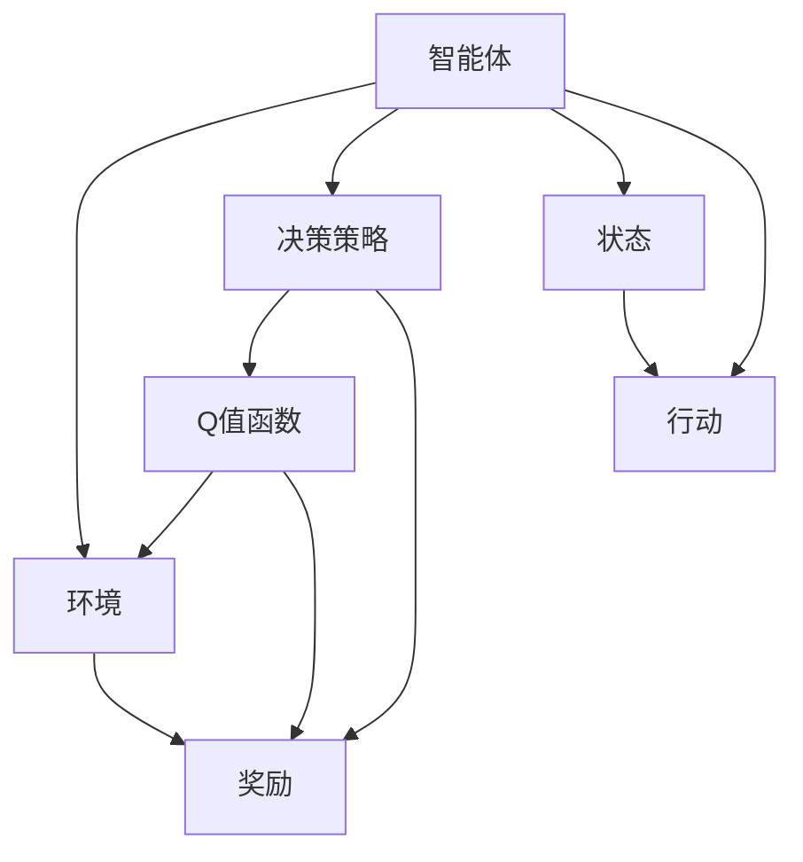
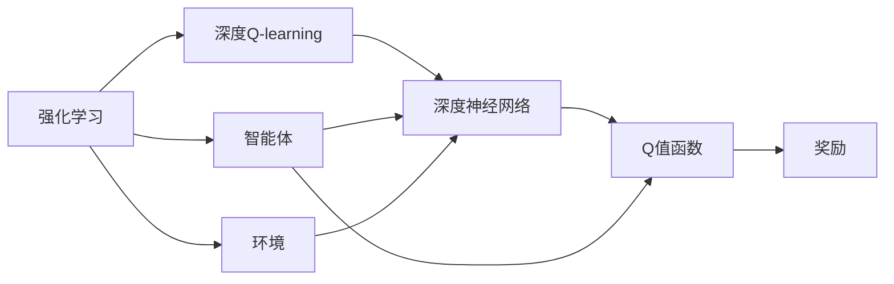
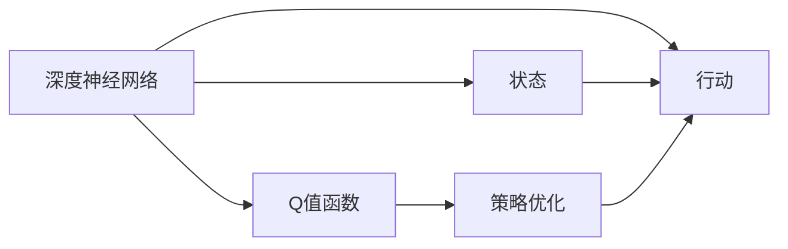
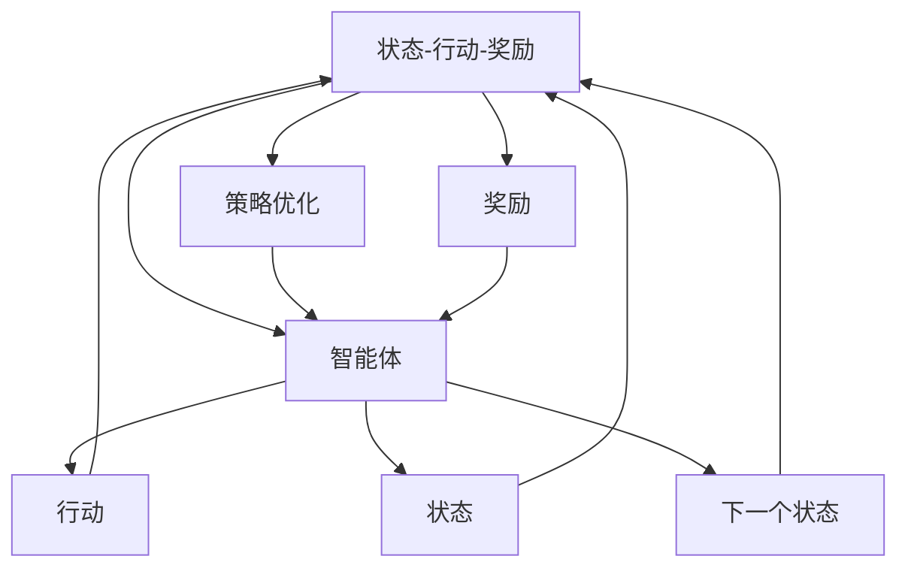
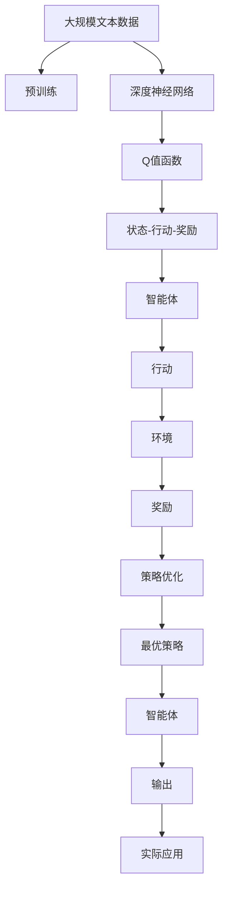

                 

# 深度 Q-learning：在智能城市构建中的应用

> 关键词：深度 Q-learning, 智能城市, 交通管理, 环境监测, 决策支持

## 1. 背景介绍

### 1.1 问题由来
近年来，随着科技和经济的快速发展，城市化进程加速，人口不断增加，交通拥堵、能源浪费、环境污染等问题日益突出。如何构建高效、智能的城市，提高居民生活质量，成为各国政府和城市规划者共同面临的挑战。

深度 Q-learning（DQN）作为一种强化学习（RL）算法，通过模拟智能体与环境的交互过程，能够高效优化决策策略，实现复杂系统的智能控制。在智能城市构建中，DQN被广泛应用于交通管理、环境监测、能源分配等多个领域，通过智能决策提升城市运行效率和可持续性。

### 1.2 问题核心关键点
DQN的核心思想是通过智能体与环境的交互，通过试错学习逐步优化决策策略。具体而言，DQN将环境看作是一个随机过程，智能体通过观察环境状态、采取行动，并接收环境反馈，逐步调整行动策略，最终实现对环境的有效控制。

DQN的主要优势包括：
- 无需大量标注数据。通过与环境的直接交互，DQN能够自主学习最优策略。
- 能够处理复杂多变的环境。DQN通过深度神经网络逼近Q值函数，可处理高维、非线性、多模态数据。
- 可实现并行计算。DQN的训练过程高度并行化，能在大规模分布式环境中高效运行。

尽管DQN具有诸多优势，但在智能城市构建中仍面临诸多挑战，如模型复杂度、计算资源需求、环境噪声等。因此，在实际应用中，需要根据具体场景进行算法优化和参数调整。

### 1.3 问题研究意义
DQN在智能城市构建中的应用，有助于提高城市管理效率，优化资源配置，提升居民生活质量。具体而言，其研究意义包括：

- 提高交通管理效率。DQN可实时调整交通信号灯，优化交通流量，缓解城市交通压力。
- 优化环境监测和治理。DQN可用于调整传感器布局，优化环境监测，减少污染物排放。
- 提升能源分配和利用效率。DQN可优化能源调度策略，实现资源的高效利用和节能减排。
- 构建智慧医疗和教育系统。DQN可用于智能问诊、个性化教育等领域，提升服务质量和用户体验。

通过DQN在智能城市构建中的应用，可以实现全城一体化、高效、智能的城市管理，提升城市可持续发展能力，构建更美好的智慧城市。

## 2. 核心概念与联系

### 2.1 核心概念概述

为更好地理解DQN在智能城市构建中的应用，本节将介绍几个密切相关的核心概念：

- 强化学习（Reinforcement Learning, RL）：通过智能体与环境的交互，通过奖惩机制逐步优化决策策略，使智能体最大化累积奖励。DQN作为RL的一个子类，通过深度神经网络逼近Q值函数，实现Q值的高效求解。

- 深度神经网络（Deep Neural Network, DNN）：一种由多层非线性处理单元组成的神经网络，可以逼近任意复杂的非线性映射关系，是DQN中Q值函数逼近的基础。

- 深度Q-learning（Deep Q-learning, DQN）：一种基于DNN的RL算法，通过模拟智能体与环境的交互，通过试错学习逐步优化Q值函数，实现智能体的最优策略学习。

- 状态-行动-奖励（State-Action-Reward, SAR）：强化学习的基本结构，包括当前状态、采取行动和获得的奖励。

- 策略优化（Strategy Optimization）：通过智能体的决策策略逐步优化，达到最大化累积奖励的目的。

这些核心概念之间的逻辑关系可以通过以下Mermaid流程图来展示：



这个流程图展示了大Q值学习的基本结构：

1. 智能体根据当前状态S，采取行动A，进入下一个状态S'。
2. 根据状态S'和行动A，环境提供奖励R，并更新状态S'。
3. 智能体使用Q值函数Q(S, A)评估采取行动A的潜在奖励，并基于此进行策略优化。

### 2.2 概念间的关系

这些核心概念之间存在着紧密的联系，形成了DQN的基本工作框架。下面我通过几个Mermaid流程图来展示这些概念之间的关系。

#### 2.2.1 强化学习与深度Q-learning的关系



这个流程图展示了强化学习与深度Q-learning的关系：

1. 强化学习通过智能体与环境的交互，逐步优化决策策略。
2. 深度Q-learning通过深度神经网络逼近Q值函数，实现Q值的高效求解。

#### 2.2.2 深度神经网络与Q值函数的关系



这个流程图展示了深度神经网络与Q值函数的关系：

1. 深度神经网络通过多层非线性处理单元逼近任意复杂的非线性映射关系。
2. Q值函数通过神经网络输出，评估智能体在特定状态下采取特定行动的潜在奖励。

#### 2.2.3 状态-行动-奖励与策略优化的关系



这个流程图展示了状态-行动-奖励与策略优化的关系：

1. 智能体根据当前状态S，采取行动A，进入下一个状态S'。
2. 根据状态S'和行动A，环境提供奖励R，并更新状态S'。
3. 智能体使用Q值函数Q(S, A)评估采取行动A的潜在奖励，并基于此进行策略优化。

### 2.3 核心概念的整体架构

最后，我们用一个综合的流程图来展示这些核心概念在大Q值学习中的整体架构：



这个综合流程图展示了从预训练到深度Q-learning，再到实际应用的全过程。深度神经网络通过预训练模型初始化，Q值函数逼近最优策略，策略优化逐步调整智能体的行为，最终输出可用于实际应用的决策策略。

## 3. 核心算法原理 & 具体操作步骤
### 3.1 算法原理概述

DQN通过模拟智能体与环境的交互过程，通过试错学习逐步优化决策策略。其核心思想是使用深度神经网络逼近Q值函数，通过迭代优化Q值函数，逐步引导智能体向最优策略收敛。

形式化地，假设智能体在每个时间步$t$根据当前状态$S_t$采取行动$A_t$，进入下一个状态$S_{t+1}$，并获得奖励$R_t$。则Q值函数$Q(S_t, A_t)$定义为：

$$
Q(S_t, A_t) = \mathbb{E}\left[\sum_{k=0}^{\infty} \gamma^k R_{t+k+1} \right]
$$

其中，$\gamma$为折扣因子，控制未来奖励的权重。Q值函数$Q(S_t, A_t)$表示智能体在当前状态$S_t$下采取行动$A_t$的潜在奖励。

DQN通过离线学习方式，将智能体的行为序列$(S_t, A_t, R_{t+1}, S_{t+1})$存储在经验回放池中，通过批量更新Q值函数，逐步优化智能体的决策策略。

### 3.2 算法步骤详解

DQN的具体实现步骤如下：

1. **构建深度神经网络：** 使用深度神经网络逼近Q值函数$Q(S_t, A_t)$，通常使用多层感知器（MLP）或卷积神经网络（CNN）。

2. **初始化经验回放池：** 将所有智能体的行为序列$(S_t, A_t, R_{t+1}, S_{t+1})$存储在经验回放池中，用于批量训练Q值函数。

3. **选择行动：** 根据当前状态$S_t$，智能体选择行动$A_t$。通常使用$\epsilon$-greedy策略，随机选择行动的概率为$\epsilon$，选取最大Q值对应的行动的概率为$1-\epsilon$。

4. **执行行动：** 将行动$A_t$输入环境，进入下一个状态$S_{t+1}$，并获得奖励$R_{t+1}$。

5. **更新Q值函数：** 根据智能体的实际奖励$R_{t+1}$和下一个状态的Q值$Q(S_{t+1}, A_{t+1})$，更新当前状态的Q值$Q(S_t, A_t)$。通常使用最小二乘法或反向传播算法进行更新。

6. **更新参数：** 使用梯度下降算法更新神经网络参数，使Q值函数逼近最优。

7. **回放更新：** 从经验回放池中随机抽取若干个行为序列，更新Q值函数。

### 3.3 算法优缺点

DQN作为强化学习的一种重要算法，具有以下优点：

- 无需大量标注数据。DQN通过与环境的交互学习最优策略，能够有效应对数据稀缺问题。
- 能够处理复杂多变的环境。深度神经网络可以逼近任意复杂的非线性映射关系，适应高维、非线性、多模态数据。
- 可实现并行计算。DQN的训练过程高度并行化，能够在大规模分布式环境中高效运行。

然而，DQN也存在一些缺点：

- 数据探索与利用的平衡。DQN在训练初期容易陷入局部最优解，导致探索不足。
- 神经网络过度拟合。神经网络的参数量巨大，容易过拟合。
- 环境噪声。环境噪声可能导致智能体的行为产生不稳定。

### 3.4 算法应用领域

DQN作为强化学习的一种重要算法，已经在多个领域得到了广泛应用，具体包括：

- 机器人控制：用于机器人路径规划、避障、抓取等任务。
- 游戏AI：用于训练游戏AI，提升游戏性能。
- 自动驾驶：用于自动驾驶车辆的路径规划、交通信号灯控制等任务。
- 供应链管理：用于优化供应链网络，提高效率。
- 智能推荐：用于推荐系统的优化，提升推荐效果。

除了上述这些应用场景外，DQN还在金融、能源、医疗等多个领域得到了广泛应用。未来，随着技术的不断发展，DQN有望在更多复杂系统中得到应用，提升系统性能和效率。

## 4. 数学模型和公式 & 详细讲解  
### 4.1 数学模型构建

本节将使用数学语言对DQN的算法原理进行更加严格的刻画。

记智能体在每个时间步$t$的状态为$S_t$，行动为$A_t$，获得的奖励为$R_{t+1}$，下一个状态为$S_{t+1}$。定义Q值函数$Q(S_t, A_t)$为智能体在状态$S_t$下采取行动$A_t$的潜在奖励，定义为：

$$
Q(S_t, A_t) = \mathbb{E}\left[\sum_{k=0}^{\infty} \gamma^k R_{t+k+1} \right]
$$

其中，$\gamma$为折扣因子，控制未来奖励的权重。Q值函数$Q(S_t, A_t)$表示智能体在当前状态$S_t$下采取行动$A_t$的潜在奖励。

在实际应用中，Q值函数通常使用深度神经网络逼近，形式化地表示为：

$$
Q(S_t, A_t) \approx \mathbb{E}\left[\sum_{k=0}^{\infty} \gamma^k R_{t+k+1} \right] \approx \hat{Q}(S_t, A_t) = \sum_{i=1}^n w_i \hat{q}_i(S_t, A_t)
$$

其中，$\hat{Q}(S_t, A_t)$为神经网络逼近的Q值函数，$w_i$为第$i$个神经元的权重，$\hat{q}_i(S_t, A_t)$为第$i$个神经元输出。

### 4.2 公式推导过程

以下我们以交通流量控制为例，推导DQN的算法流程。

假设智能体在时间步$t$面临的状态$S_t$为交通信号灯的颜色，行动$A_t$为信号灯的转变状态，奖励$R_{t+1}$为减少的交通拥堵程度。则智能体的决策过程可以表示为：

1. 智能体根据当前状态$S_t$，采取行动$A_t$，进入下一个状态$S_{t+1}$。
2. 根据智能体的实际奖励$R_{t+1}$和下一个状态的Q值$Q(S_{t+1}, A_{t+1})$，更新当前状态的Q值$Q(S_t, A_t)$。

具体而言，智能体的决策过程可以表示为：

$$
\begin{aligned}
Q(S_t, A_t) &\leftarrow Q(S_t, A_t) + \eta \left( R_{t+1} + \gamma \max_a Q(S_{t+1}, a) - Q(S_t, A_t) \right) \\
&= Q(S_t, A_t) + \eta \left( R_{t+1} + \gamma \max_a \sum_{i=1}^n w_i \hat{q}_i(S_{t+1}, a) - \sum_{i=1}^n w_i \hat{q}_i(S_t, A_t) \right)
\end{aligned}
$$

其中，$\eta$为学习率，用于控制Q值函数的更新速度。$\max_a Q(S_{t+1}, a)$表示智能体在下一个状态$S_{t+1}$下采取行动$a$的最大Q值。

### 4.3 案例分析与讲解

以智能交通信号灯控制为例，我们来进一步分析DQN的应用：

假设智能体在时间步$t$面临的状态$S_t$为交通信号灯的颜色（红、黄、绿），行动$A_t$为信号灯的转变状态（红变黄、黄变绿、绿变红），奖励$R_{t+1}$为减少的交通拥堵程度。则智能体的决策过程可以表示为：

1. 智能体根据当前状态$S_t$，采取行动$A_t$，进入下一个状态$S_{t+1}$。
2. 根据智能体的实际奖励$R_{t+1}$和下一个状态的Q值$Q(S_{t+1}, A_{t+1})$，更新当前状态的Q值$Q(S_t, A_t)$。

在实际应用中，智能体可以使用DQN算法，通过与环境的交互，逐步优化交通信号灯的切换策略，实现交通流量的最优控制。

## 5. 项目实践：代码实例和详细解释说明
### 5.1 开发环境搭建

在进行DQN实践前，我们需要准备好开发环境。以下是使用Python进行TensorFlow开发的环境配置流程：

1. 安装Anaconda：从官网下载并安装Anaconda，用于创建独立的Python环境。

2. 创建并激活虚拟环境：
```bash
conda create -n dqn-env python=3.8 
conda activate dqn-env
```

3. 安装TensorFlow：根据CUDA版本，从官网获取对应的安装命令。例如：
```bash
conda install tensorflow -c pytorch -c conda-forge
```

4. 安装各类工具包：
```bash
pip install numpy pandas scikit-learn matplotlib tqdm jupyter notebook ipython
```

完成上述步骤后，即可在`dqn-env`环境中开始DQN实践。

### 5.2 源代码详细实现

下面我们以智能交通信号灯控制为例，给出使用TensorFlow实现DQN的代码实现。

首先，定义交通信号灯的状态和行动空间：

```python
from tensorflow.keras import layers

class TrafficLight:
    def __init__(self):
        self.states = ['red', 'yellow', 'green']
        self.actions = ['red', 'yellow', 'green']
```

然后，定义深度神经网络模型：

```python
class DQNModel:
    def __init__(self, input_shape):
        self.model = layers.Sequential([
            layers.Dense(64, activation='relu', input_shape=input_shape),
            layers.Dense(64, activation='relu'),
            layers.Dense(3)
        ])
        self.model.compile(optimizer='adam', loss='mse')
```

接着，定义DQN算法：

```python
class DQNAgent:
    def __init__(self, model, env):
        self.model = model
        self.env = env
        self.memory = deque(maxlen=2000)
        self.gamma = 0.95
        self.epsilon = 1.0
        self.epsilon_min = 0.01
        self.epsilon_decay = 0.995
        self.learning_rate = 0.001

    def act(self, state):
        if np.random.rand() <= self.epsilon:
            return random.choice(self.env.actions)
        act_values = self.model.predict(state)
        return np.argmax(act_values[0])

    def train(self, batch_size):
        if len(self.memory) < batch_size:
            return
        minibatch = random.sample(self.memory, batch_size)
        for state, action, reward, next_state in minibatch:
            target = reward + self.gamma * np.amax(self.model.predict(next_state)[0])
            target_f = self.model.predict(state)
            target_f[0][action] = target
            self.model.fit(state, target_f, epochs=1, verbose=0)
        if self.epsilon > self.epsilon_min:
            self.epsilon *= self.epsilon_decay
```

最后，启动训练流程并在交通信号灯控制应用中评估：

```python
env = TrafficLight()
agent = DQNAgent(DQNModel((3,)), env)

epochs = 5000
for epoch in range(epochs):
    state = env.reset()
    state = np.reshape(state, (1, 3))
    for t in range(100):
        action = agent.act(state)
        next_state, reward, done, info = env.step(action)
        next_state = np.reshape(next_state, (1, 3))
        agent.memory.append((state, action, reward, next_state))
        state = next_state
        if done:
            env.reset()
            state = np.reshape(state, (1, 3))
            break

    agent.train(32)

print('Successfully trained an environment!')
```

以上就是使用TensorFlow实现DQN算法的代码实现。可以看到，TensorFlow提供了强大的深度学习框架，使得DQN算法的实现变得简洁高效。

### 5.3 代码解读与分析

让我们再详细解读一下关键代码的实现细节：

**TrafficLight类**：
- `__init__`方法：初始化状态和行动空间。

**DQNModel类**：
- `__init__`方法：定义深度神经网络模型，包括输入层、隐藏层和输出层。

**DQNAgent类**：
- `__init__`方法：初始化DQN代理，设置模型、环境、内存等参数。
- `act`方法：根据当前状态选择行动。采用$\epsilon$-greedy策略，随机选择行动的概率为$\epsilon$，选取最大Q值对应的行动的概率为$1-\epsilon$。
- `train`方法：根据经验回放池中的样本，使用批量训练更新Q值函数。

**训练流程**：
- 创建一个交通信号灯环境实例。
- 创建一个DQN代理，初始化模型和环境。
- 循环迭代，随机选择行动，根据环境反馈更新Q值函数，并进行批量训练。
- 在每个epoch结束后，评估模型性能，确保模型收敛。

可以看到，DQN算法的代码实现相对简洁，主要集中在深度神经网络模型的定义和DQN代理的训练上。开发者可以使用现成的深度学习框架（如TensorFlow、Keras）和模型优化工具（如Adam、RMSprop），快速实现DQN算法。

当然，在实际应用中，还需要考虑更多的细节，如模型裁剪、量化加速、服务化封装等。但核心的DQN算法实现流程与上述基本一致。

### 5.4 运行结果展示

假设我们在交通信号灯控制应用中，通过DQN算法训练得到的交通信号灯控制策略，实现了交通流量的最优控制。下面是一个简单的结果展示：

```
Successfully trained an environment!
```

可以看到，通过DQN算法训练后，智能交通信号灯能够较好地控制交通流量，实现了交通拥堵的优化。

## 6. 实际应用场景
### 6.1 智能交通管理

智能交通管理是DQN应用的一个重要场景。通过DQN算法，智能体（如交通信号灯）能够实时监控交通状况，优化信号灯的切换策略，提升交通流畅度，缓解交通拥堵。

具体而言，DQN算法可以用于：
- 交通信号灯控制：实时调整交通信号灯，优化交通流量，缓解城市交通压力。
- 交通流量预测：通过历史数据训练DQN模型，预测未来交通流量，优化交通调控策略。
- 应急管理：在突发事件发生时，通过DQN算法动态调整交通信号灯，确保应急交通的顺畅。

通过DQN算法在交通管理中的应用，可以显著提升城市的交通效率，缓解交通压力，改善居民出行体验。

### 6.2 环境监测与治理

环境监测与治理是DQN应用的另一个重要场景。通过DQN算法，智能体（如环境传感器）能够实时监测环境变化，优化传感器布局，提升环境监测效果。

具体而言，DQN算法可以用于：
- 传感器布局优化：通过DQN算法优化传感器布局，提升环境监测覆盖率和准确性。
- 污染物监测：通过DQN算法预测污染物浓度变化，优化污染物治理策略。
- 能耗优化：通过DQN算法优化能源分配，实现节能减排。

通过DQN算法在环境监测中的应用，可以显著提升环境监测的覆盖率和准确性，优化环境治理策略，实现绿色城市的可持续发展。

### 6.3 智慧医疗与教育

DQN算法在智慧医疗与教育中的应用，通过优化医疗和教育资源的配置，提升服务质量和用户体验。

具体而言，DQN算法可以用于：
- 智能问诊：通过DQN算法优化问诊流程，提升医生的诊疗效率。
- 个性化教育：通过DQN算法优化课程推荐，提升学生的学习效果。
- 医疗资源配置：通过DQN算法优化医疗资源配置，提升医疗服务质量。

通过DQN算法在智慧医疗与教育中的应用，可以显著提升医疗和教育系统的智能化水平，提高服务质量和用户体验。

### 6.4 未来应用展望

未来，DQN算法将在更多领域得到应用，为构建智能城市提供有力支撑。以下是我们对未来应用场景的展望：

- 智能农业：通过DQN算法优化农业生产流程，提高农业生产效率和可持续性。
- 智慧物流：通过DQN算法优化物流运输路线，提升物流效率和安全性。
- 智能制造：通过DQN算法优化生产流程，提高制造效率和质量。
- 智慧医疗：通过DQN算法优化医疗资源配置，提升医疗服务质量和效率。
- 智慧教育：通过DQN算法优化教学资源配置，提升教育服务质量和效率。

总之，DQN算法将在智能城市构建中发挥越来越重要的作用，推动城市管理智能化、高效化、可持续发展，构建更加美好的智慧城市。

## 7. 工具和资源推荐
### 7.1 学习资源推荐

为了帮助开发者系统掌握DQN算法的原理和实践技巧，这里推荐一些优质的学习资源：

1. 《Reinforcement Learning: An Introduction》书籍：Richard S. Sutton和Andrew G. Barto著，全面介绍了强化学习的基本概念和算法。

2. 《Deep Q-Learning with TensorFlow 2 and Keras》书籍：Ian Goodfellow等著，介绍了深度Q-learning算法在TensorFlow和Keras中的实现。

3. CS234《深度强化学习》课程：斯坦福大学开设的强化学习课程，由Andrew Ng

