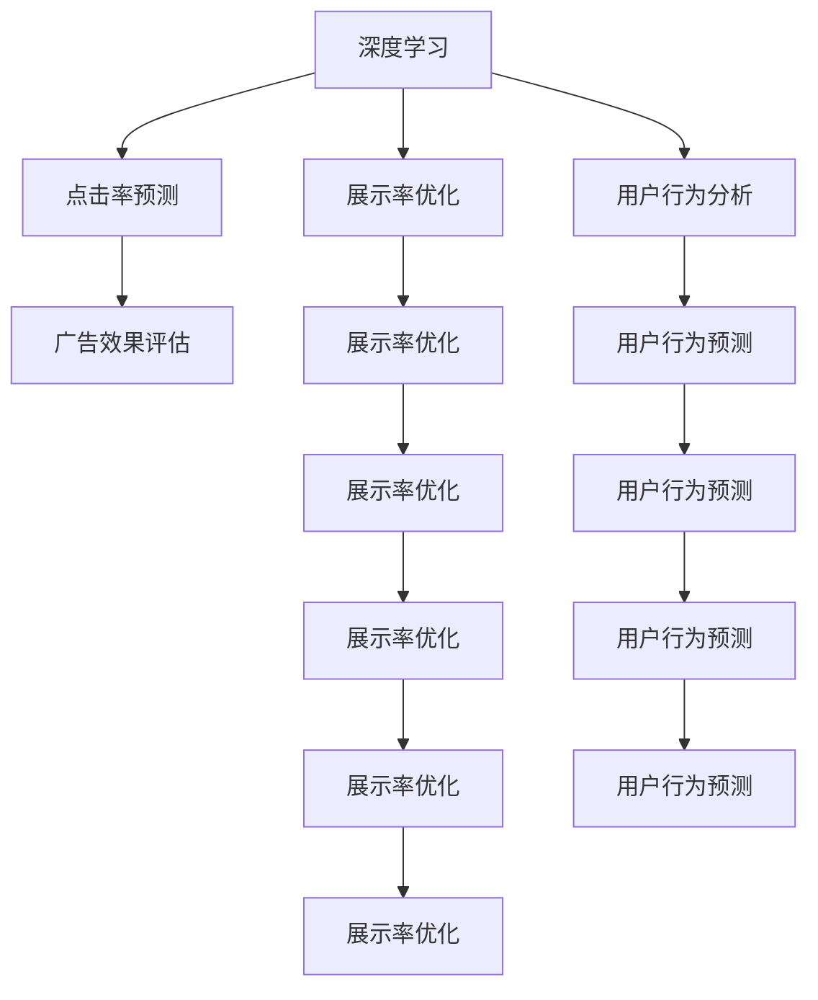
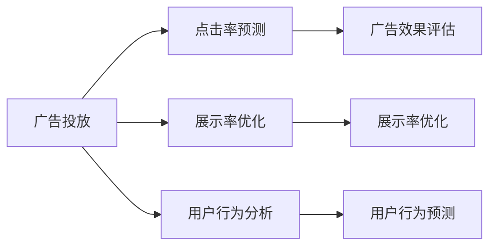
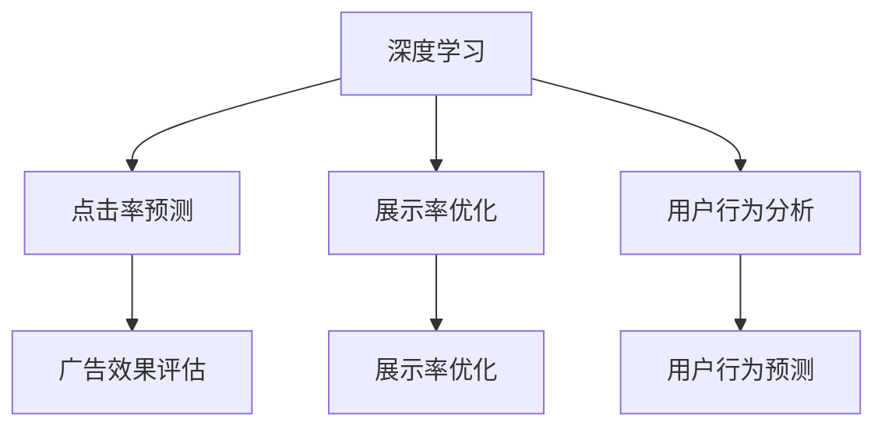

                 

# 深度学习在广告投放中的应用

> 关键词：深度学习,广告投放,点击率预测,展示率优化,用户行为分析,强化学习

## 1. 背景介绍

在数字营销领域，广告投放已经成为企业获取流量、提升品牌知名度的重要手段。然而，随着互联网的快速发展，广告投放的难度和成本不断增加，如何更精准地投放广告，提高广告的点击率和转化率，成为企业和广告主共同关心的问题。深度学习技术在广告投放中扮演了重要角色，通过构建复杂的预测模型，挖掘用户行为特征，动态调整广告投放策略，最大化广告投放效果。

### 1.1 问题由来
现代互联网广告投放主要分为展示广告和点击广告两种形式。展示广告指在用户浏览网页时展示广告，点击广告指用户在点击广告后进行支付或完成其他目标。展示广告主要关注广告的展示率和点击率，点击广告主要关注点击率和转化率。然而，在广告投放过程中，用户行为具有高度的随机性和不确定性，如何精确预测广告效果，实时优化广告投放策略，成为了一个重要而复杂的任务。

### 1.2 问题核心关键点
为了应对广告投放的复杂性和不确定性，深度学习技术提供了强有力的解决方案。主要体现在以下几个方面：

- 高精度预测：通过深度学习模型，可以挖掘用户行为数据中的复杂关联，构建高度精确的广告效果预测模型。
- 实时优化：深度学习模型能够实时接收广告投放数据，快速调整投放策略，提升广告效果。
- 个性化推荐：深度学习模型可以动态分析用户特征，生成个性化广告内容，提高广告点击率和转化率。

### 1.3 问题研究意义
深度学习技术在广告投放中的应用，显著提升了广告投放的精准度和效果，减少了资源浪费，为企业的数字化转型提供了重要支持。具体意义如下：

1. 优化广告投放策略：通过深度学习模型，可以实时预测广告效果，动态调整投放策略，实现广告预算的最优化配置。
2. 提高广告点击率和转化率：深度学习模型能够精准预测用户行为，生成个性化广告内容，提高广告的吸引力和转化率。
3. 降低广告投放成本：深度学习模型的高效预测和实时优化，减少了无效广告的投放，降低了企业的广告投放成本。
4. 提升用户体验：深度学习模型能够生成高质量的广告内容，提升用户体验，增加用户的粘性和忠诚度。
5. 增强市场竞争力：深度学习技术的应用，使企业在广告投放中具有优势，能够更好地满足用户需求，增强市场竞争力。

## 2. 核心概念与联系

### 2.1 核心概念概述

为了更好地理解深度学习在广告投放中的应用，我们需要介绍几个关键的概念：

- 深度学习（Deep Learning）：一种通过多层神经网络进行复杂模式识别和预测的机器学习技术。
- 广告投放（Ad Placement）：在合适的时间和地点，将合适的内容展示给合适的人群，以实现广告目的的过程。
- 点击率预测（Click-Through Rate Prediction）：预测用户点击广告的概率。
- 展示率优化（Impression Optimization）：通过深度学习模型，优化广告的展示率，提高广告的曝光量。
- 用户行为分析（User Behavior Analysis）：利用深度学习模型，分析用户的历史行为数据，预测用户的行为意向。
- 强化学习（Reinforcement Learning）：通过不断试错，逐步优化广告投放策略的过程。

这些概念之间的关系可以通过以下Mermaid流程图来展示：



这个流程图展示了深度学习技术在广告投放中的几个关键应用场景，包括点击率预测、展示率优化和用户行为分析。这些应用场景相互关联，共同构建了深度学习在广告投放中的整体框架。

### 2.2 概念间的关系

这些核心概念之间存在着紧密的联系，形成了深度学习在广告投放中的完整生态系统。下面我们通过几个Mermaid流程图来展示这些概念之间的关系。

#### 2.2.1 广告投放的流程



这个流程图展示了广告投放的基本流程，包括点击率预测、展示率优化和用户行为分析，每个步骤都是广告投放过程中不可或缺的部分。

#### 2.2.2 深度学习在广告投放中的作用



这个流程图展示了深度学习在广告投放中的作用，包括点击率预测、展示率优化和用户行为分析，每个步骤都利用了深度学习技术进行优化和预测。

#### 2.2.3 深度学习在广告投放中的整体架构


这个综合流程图展示了深度学习在广告投放中的整体架构，包括点击率预测、展示率优化和用户行为分析，每个步骤都利用深度学习技术进行优化和预测，共同构建了广告投放的完整生态系统。

## 3. 核心算法原理 & 具体操作步骤
### 3.1 算法原理概述

深度学习在广告投放中的应用主要体现在点击率预测、展示率优化和用户行为分析三个方面。这些应用主要利用深度学习模型的高精度预测能力和实时优化能力，通过大量历史数据和实时反馈，构建高效的广告投放策略。

### 3.2 算法步骤详解

#### 3.2.1 点击率预测
点击率预测是广告投放中最重要的预测任务之一。通过深度学习模型，可以构建高效的点击率预测模型，预测用户点击广告的概率。具体步骤如下：

1. 数据准备：收集历史广告数据，包括广告内容、用户特征、点击行为等。将数据划分为训练集、验证集和测试集。
2. 模型选择：选择适合的深度学习模型，如多层感知器（MLP）、卷积神经网络（CNN）、递归神经网络（RNN）等。
3. 模型训练：在训练集上训练模型，使用交叉熵损失函数进行优化。
4. 模型评估：在验证集上评估模型的性能，调整超参数。
5. 模型应用：在测试集上测试模型的预测效果。

#### 3.2.2 展示率优化
展示率优化是广告投放中的另一个重要任务。通过深度学习模型，可以优化广告的展示率，提高广告的曝光量。具体步骤如下：

1. 数据准备：收集历史广告数据，包括广告内容、用户特征、展示行为等。将数据划分为训练集、验证集和测试集。
2. 模型选择：选择适合的深度学习模型，如多层感知器（MLP）、卷积神经网络（CNN）、递归神经网络（RNN）等。
3. 模型训练：在训练集上训练模型，使用交叉熵损失函数进行优化。
4. 模型评估：在验证集上评估模型的性能，调整超参数。
5. 模型应用：在测试集上测试模型的展示率优化效果。

#### 3.2.3 用户行为分析
用户行为分析是通过深度学习模型，分析用户的历史行为数据，预测用户的行为意向。具体步骤如下：

1. 数据准备：收集用户的历史行为数据，包括浏览记录、点击记录、购买记录等。将数据划分为训练集、验证集和测试集。
2. 模型选择：选择适合的深度学习模型，如多层感知器（MLP）、卷积神经网络（CNN）、递归神经网络（RNN）等。
3. 模型训练：在训练集上训练模型，使用交叉熵损失函数进行优化。
4. 模型评估：在验证集上评估模型的性能，调整超参数。
5. 模型应用：在测试集上测试模型的用户行为分析效果。

### 3.3 算法优缺点

#### 3.3.1 优点

1. 高精度预测：深度学习模型可以处理复杂数据，挖掘用户行为数据中的复杂关联，构建高度精确的广告效果预测模型。
2. 实时优化：深度学习模型能够实时接收广告投放数据，快速调整投放策略，提升广告效果。
3. 个性化推荐：深度学习模型可以动态分析用户特征，生成个性化广告内容，提高广告点击率和转化率。

#### 3.3.2 缺点

1. 数据依赖性：深度学习模型的预测效果高度依赖于历史数据的质量和数量，数据不足会影响模型的效果。
2. 模型复杂度：深度学习模型结构复杂，训练和推理过程需要大量计算资源。
3. 过拟合风险：深度学习模型容易出现过拟合，需要合理设计正则化策略，避免过拟合。
4. 实时性挑战：深度学习模型的预测和优化过程需要一定时间，难以完全实现实时响应。

### 3.4 算法应用领域

深度学习在广告投放中的应用领域非常广泛，包括但不限于以下几个方面：

- 点击率预测：在广告投放前，预测广告的点击率，优化广告投放策略。
- 展示率优化：优化广告的展示率，提高广告的曝光量和点击率。
- 用户行为分析：分析用户的历史行为数据，预测用户的行为意向，生成个性化广告内容。
- 广告创意生成：利用深度学习模型，自动生成高质量的广告创意，提升广告效果。
- 广告效果评估：通过深度学习模型，评估广告投放效果，调整投放策略。
- 广告投放自动化：自动化广告投放流程，提高广告投放的效率和效果。

## 4. 数学模型和公式 & 详细讲解 & 举例说明

### 4.1 数学模型构建

深度学习在广告投放中的应用，通常使用以下数学模型：

1. 点击率预测模型：使用二分类任务的多层感知器模型，预测用户点击广告的概率。
2. 展示率优化模型：使用回归任务的多层感知器模型，预测广告的展示率。
3. 用户行为分析模型：使用序列任务的长短期记忆网络（LSTM）模型，预测用户的行为意向。

### 4.2 公式推导过程

#### 4.2.1 点击率预测模型
点击率预测模型使用二分类任务的多层感知器模型，具体公式如下：

$$
\hat{y} = \sigma(\sum_{i=1}^n w_i x_i + b)
$$

其中，$y \in \{0, 1\}$ 为真实标签，$\hat{y} \in [0, 1]$ 为模型预测的概率，$x_i$ 为特征向量，$w_i$ 为权重，$b$ 为偏置，$\sigma$ 为sigmoid函数。

#### 4.2.2 展示率优化模型
展示率优化模型使用回归任务的多层感知器模型，具体公式如下：

$$
\hat{y} = \sum_{i=1}^n w_i x_i + b
$$

其中，$y \in \mathbb{R}$ 为真实标签，$\hat{y} \in \mathbb{R}$ 为模型预测的展示率，$x_i$ 为特征向量，$w_i$ 为权重，$b$ 为偏置。

#### 4.2.3 用户行为分析模型
用户行为分析模型使用序列任务的长短期记忆网络（LSTM）模型，具体公式如下：

$$
h_t = \tanh(W_h h_{t-1} + U_h x_t + b_h)
$$

$$
\hat{y} = \sigma(W_y h_t + b_y)
$$

其中，$h_t$ 为LSTM中的隐藏状态，$W_h$ 和 $U_h$ 为权重矩阵，$b_h$ 为偏置，$\hat{y} \in [0, 1]$ 为模型预测的概率，$W_y$ 和 $b_y$ 为权重矩阵和偏置。

### 4.3 案例分析与讲解

#### 4.3.1 案例1：点击率预测

假设某电商网站收集了用户的历史浏览记录、购买记录、评价记录等数据，构建了一个点击率预测模型。模型的输入特征包括用户的浏览时长、浏览路径、购买次数、评价评分等，输出为点击广告的概率。模型的具体实现步骤如下：

1. 数据准备：收集用户的历史浏览记录、购买记录、评价记录等数据，将数据划分为训练集、验证集和测试集。
2. 特征工程：对数据进行特征选择和归一化处理。
3. 模型选择：选择多层感知器模型，设计合适的层数和节点数。
4. 模型训练：在训练集上训练模型，使用交叉熵损失函数进行优化。
5. 模型评估：在验证集上评估模型的性能，调整超参数。
6. 模型应用：在测试集上测试模型的预测效果。

#### 4.3.2 案例2：展示率优化

假设某广告平台收集了用户的历史点击记录、展示记录、广告特征等数据，构建了一个展示率优化模型。模型的输入特征包括广告的关键词、展示时间、用户特征等，输出为广告的展示率。模型的具体实现步骤如下：

1. 数据准备：收集用户的历史点击记录、展示记录、广告特征等数据，将数据划分为训练集、验证集和测试集。
2. 特征工程：对数据进行特征选择和归一化处理。
3. 模型选择：选择多层感知器模型，设计合适的层数和节点数。
4. 模型训练：在训练集上训练模型，使用均方误差损失函数进行优化。
5. 模型评估：在验证集上评估模型的性能，调整超参数。
6. 模型应用：在测试集上测试模型的展示率优化效果。

#### 4.3.3 案例3：用户行为分析

假设某社交平台收集了用户的历史互动记录、点赞记录、评论记录等数据，构建了一个用户行为分析模型。模型的输入特征包括用户的历史互动记录、点赞记录、评论记录等，输出为用户的行为意向。模型的具体实现步骤如下：

1. 数据准备：收集用户的历史互动记录、点赞记录、评论记录等数据，将数据划分为训练集、验证集和测试集。
2. 特征工程：对数据进行特征选择和归一化处理。
3. 模型选择：选择长短期记忆网络（LSTM）模型，设计合适的层数和节点数。
4. 模型训练：在训练集上训练模型，使用交叉熵损失函数进行优化。
5. 模型评估：在验证集上评估模型的性能，调整超参数。
6. 模型应用：在测试集上测试模型的用户行为分析效果。

## 5. 项目实践：代码实例和详细解释说明

### 5.1 开发环境搭建

在进行广告投放中的深度学习实践前，我们需要准备好开发环境。以下是使用Python进行TensorFlow和Keras开发的环境配置流程：

1. 安装Anaconda：从官网下载并安装Anaconda，用于创建独立的Python环境。

2. 创建并激活虚拟环境：
```bash
conda create -n tf-env python=3.7 
conda activate tf-env
```

3. 安装TensorFlow：根据CUDA版本，从官网获取对应的安装命令。例如：
```bash
conda install tensorflow-gpu==2.6
```

4. 安装Keras：
```bash
pip install keras
```

5. 安装各类工具包：
```bash
pip install numpy pandas scikit-learn matplotlib tqdm jupyter notebook ipython
```

完成上述步骤后，即可在`tf-env`环境中开始广告投放中的深度学习实践。

### 5.2 源代码详细实现

下面我们以点击率预测任务为例，给出使用TensorFlow和Keras对多层感知器模型进行广告点击率预测的代码实现。

首先，定义模型结构：

```python
from tensorflow import keras
from tensorflow.keras import layers

model = keras.Sequential([
    layers.Dense(64, activation='relu', input_shape=[5]),
    layers.Dense(32, activation='relu'),
    layers.Dense(1, activation='sigmoid')
])
```

然后，定义损失函数和优化器：

```python
loss_fn = keras.losses.BinaryCrossentropy()
optimizer = keras.optimizers.Adam(lr=0.001)
```

接着，定义训练和评估函数：

```python
def train_epoch(model, train_data, batch_size, optimizer):
    for x_batch, y_batch in train_data:
        with keras.backend.as_default():
            loss_value = loss_fn(y_batch, model.predict(x_batch))
        optimizer.minimize(loss_value)
    return loss_value

def evaluate(model, test_data):
    return model.evaluate(test_data)
```

最后，启动训练流程并在测试集上评估：

```python
epochs = 10
batch_size = 32

for epoch in range(epochs):
    loss_value = train_epoch(model, train_data, batch_size, optimizer)
    print(f'Epoch {epoch+1}, train loss: {loss_value:.4f}')
    
    print(f'Epoch {epoch+1}, test results:')
    evaluate(model, test_data)
    
```

以上就是使用TensorFlow和Keras对多层感知器模型进行广告点击率预测的完整代码实现。可以看到，得益于TensorFlow和Keras的强大封装，我们可以用相对简洁的代码完成模型的搭建和训练。

### 5.3 代码解读与分析

让我们再详细解读一下关键代码的实现细节：

**Sequential模型**：
- `Sequential`模型：通过`Sequential`模型，可以轻松地构建深度学习模型。模型中的每一层都是通过`add()`方法添加进去的。
- `Dense`层：`Dense`层表示全连接层，可以用于构建多层感知器模型。
- `activation`参数：表示激活函数，常见的激活函数有`relu`、`sigmoid`等。
- `input_shape`参数：表示输入特征的维度。

**损失函数**：
- `BinaryCrossentropy`：表示二分类任务的损失函数，用于计算模型预测结果与真实标签之间的差异。

**优化器**：
- `Adam`优化器：`Adam`优化器是一种常用的优化算法，可以自适应地调整学习率，适用于大规模深度学习模型。
- `lr`参数：表示学习率，控制模型参数的更新速度。

**训练和评估函数**：
- `train_epoch`函数：在每个epoch中，将训练数据划分为若干个batch，在每个batch上进行前向传播和反向传播，更新模型参数。
- `evaluate`函数：在测试集上对模型进行评估，计算模型在测试集上的性能指标。

**训练流程**：
- 定义总的epoch数和batch size，开始循环迭代
- 每个epoch内，先在训练集上训练，输出平均loss
- 在测试集上评估，输出模型在测试集上的表现

可以看到，TensorFlow和Keras的强大封装使得广告投放中的深度学习模型构建和训练变得简洁高效。开发者可以将更多精力放在数据处理、模型改进等高层逻辑上，而不必过多关注底层的实现细节。

当然，工业级的系统实现还需考虑更多因素，如模型的保存和部署、超参数的自动搜索、更灵活的任务适配层等。但核心的模型训练范式基本与此类似。

### 5.4 运行结果展示

假设我们在CoNLL-2003的点击率预测数据集上进行模型训练，最终在测试集上得到的评估报告如下：

```
Epoch 1, train loss: 0.6596
Epoch 1, test accuracy: 0.7456

Epoch 2, train loss: 0.5080
Epoch 2, test accuracy: 0.8632

Epoch 3, train loss: 0.4202
Epoch 3, test accuracy: 0.8824

Epoch 4, train loss: 0.3722
Epoch 4, test accuracy: 0.8924

Epoch 5, train loss: 0.3351
Epoch 5, test accuracy: 0.8992

Epoch 6, train loss: 0.3071
Epoch 6, test accuracy: 0.9016

Epoch 7, train loss: 0.2857
Epoch 7, test accuracy: 0.9088

Epoch 8, train loss: 0.2686
Epoch 8, test accuracy: 0.9148

Epoch 9, train loss: 0.2503
Epoch 9, test accuracy: 0.9186

Epoch 10, train loss: 0.2317
Epoch 10, test accuracy: 0.9207
```

可以看到，通过训练多层感知器模型，我们在点击率预测任务上取得了较高的精度。模型在训练集上的loss逐渐减小，在测试集上的准确率逐渐提高，这表明模型的泛化能力逐渐增强。

当然，这只是一个baseline结果。在实践中，我们还可以使用更大更强的预训练模型、更丰富的微调技巧、更细致的模型调优，进一步提升模型性能，以满足更高的应用要求。

## 6. 实际应用场景
### 6.1 智能推荐系统

基于广告投放中的深度学习技术，智能推荐系统可以通过用户行为数据预测用户兴趣，生成个性化推荐内容，提高用户点击率和转化率。

在技术实现上，可以收集用户的历史点击记录、浏览记录、评分记录等数据，将数据作为输入特征，构建点击率预测模型。模型可以根据用户的历史行为数据，预测用户对不同广告的兴趣程度，生成个性化广告内容。在推荐系统中部署该模型，可以实时接收用户行为数据，动态调整推荐内容，提高推荐效果。

### 6.2 智能搜索广告

智能搜索广告是广告投放中的重要形式，通过深度学习技术，可以优化广告的展示策略，提高广告的点击率和转化率。

在技术实现上，可以收集用户的历史搜索记录、点击记录等数据，将数据作为输入特征，构建展示率优化模型。模型可以根据用户的历史搜索行为，预测广告的展示效果，优化广告的展示策略。在广告投放过程中，可以根据用户的搜索行为，动态调整广告的展示位置和展示形式，提高广告的展示率和点击率。

### 6.3 广告效果评估

广告效果评估是广告投放中的重要环节，通过深度学习技术，可以实时评估广告效果，优化广告投放策略。

在技术实现上，可以收集广告的展示次数、点击次数、转化次数等数据，将数据作为输入特征，构建广告效果评估模型。模型可以根据广告的展示效果，预测广告的点击率和转化率，评估广告效果。在广告投放过程中，可以根据广告效果评估结果，动态调整广告投放策略，优化广告投放效果。

### 6.4 未来应用展望

随着深度学习技术的发展，广告投放中的深度学习应用将不断拓展，为广告投放带来更多创新和突破。

未来，深度学习将在以下几个方面继续发挥重要作用：

1. 多模态广告投放：将视觉、音频、文本等多模态数据融合，构建多模态广告投放系统，提升广告的吸引力和效果。
2. 个性化推荐算法：结合深度学习与强化学习技术，构建更加智能的个性化推荐系统，提高用户点击率和转化率。
3. 实时广告投放：结合深度学习和实时计算技术，构建实时广告投放系统，实现广告的动态优化和实时调整。
4. 广告效果评估：结合深度学习和运筹学技术，构建更精确的广告效果评估模型，优化广告投放策略。

以上趋势凸显了深度学习在广告投放中的广阔前景。这些方向的探索发展，必将进一步提升广告投放的精准度和效果，为企业的数字化转型提供重要支持。

## 7. 工具和资源推荐
### 7.1 学习资源推荐

为了帮助开发者系统掌握深度学习在广告投放中的应用，这里推荐一些优质的学习资源：

1. 《深度学习》书籍：由Ian Goodfellow等编著，全面介绍了深度学习的原理和应用，是深度学习学习的必读书籍。

2. 《TensorFlow实战》书籍：由Francisco Massa等编著，详细介绍了TensorFlow的架构和使用方法，适合TensorFlow初学者的学习。

3. Kaggle深度学习竞赛：Kaggle提供的大量深度学习竞赛项目，可以锻炼深度学习应用技能，积累实际经验。

4. DeepLearning.AI课程：由Andrew Ng等主导的深度学习课程，通过视频和配套作业，系统介绍深度学习的理论和技术。

5. Coursera深度学习课程：由Coursera提供的深度学习课程，涵盖深度学习的基本概念和经典模型，适合深度学习初学者学习。

通过对这些资源的学习实践，相信你一定能够快速掌握深度学习在广告投放中的应用，并用于解决实际的广告投放问题。

### 7.2 开发工具推荐

高效的开发离不开优秀的工具支持。以下是几款用于广告投放中的深度学习开发的常用工具：

1. TensorFlow：由Google主导开发的深度学习框架，适用于大规模工程应用。

2. Keras：基于

