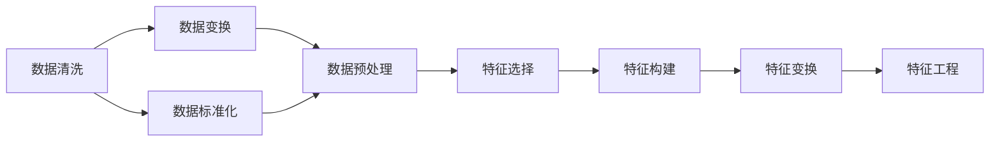
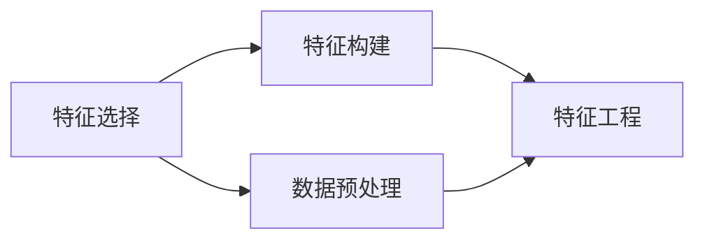
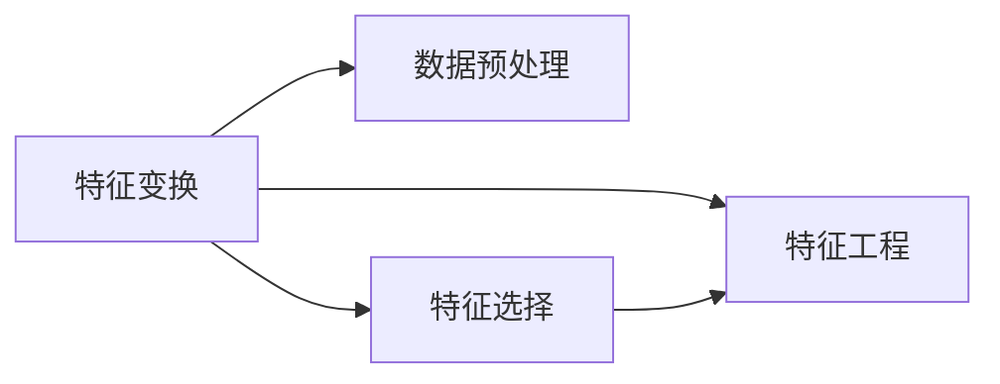

                 

# 特征工程 (Feature Engineering) 原理与代码实例讲解

## 1. 背景介绍

特征工程（Feature Engineering）是机器学习领域中一个非常重要的环节，它通过对原始数据进行预处理、转换、构建等操作，使得数据更具有代表性、区分度和模型适配性，从而提升机器学习模型的性能。良好的特征工程不仅能提高模型的准确率，还能降低训练时间和计算成本，增强模型的泛化能力。因此，在数据驱动的人工智能应用中，特征工程是不可或缺的一环。

### 1.1 问题由来
在实际应用中，原始数据往往存在多种问题：缺失值、异常值、类别不平衡、冗余特征等。这些问题会直接影响模型的训练效果和预测能力。而通过特征工程，我们可以从数据处理、特征提取和特征选择等方面进行改进，使得模型更好地适应数据特性，提升预测性能。

### 1.2 问题核心关键点
特征工程的核心关键点包括数据预处理、特征选择、特征构建和特征变换等。这些操作都是为了优化数据特征，提高模型训练的效率和准确性。

1. **数据预处理**：对数据进行清洗、规范化、标准化等操作，使得数据格式统一，便于模型训练。
2. **特征选择**：从原始特征中筛选出最相关、最有信息量的特征，减少冗余信息，提升模型泛化能力。
3. **特征构建**：通过组合、变换、衍生等方式创建新的特征，增强数据表达能力，提高模型预测精度。
4. **特征变换**：通过数据转换、降维等技术，降低数据维度和噪声，提升模型训练速度和效果。

### 1.3 问题研究意义
特征工程是机器学习模型的“灵魂”，其对模型性能的影响巨大。通过有效的特征工程，可以将原始数据转化为模型能够理解和利用的形式，从而显著提升模型的准确率和鲁棒性。特征工程的优劣直接决定了机器学习项目的成败，因此，深入研究和掌握特征工程的方法和技巧，对于人工智能技术的推广应用至关重要。

## 2. 核心概念与联系

### 2.1 核心概念概述

为了更好地理解特征工程的原理和应用，本节将介绍几个密切相关的核心概念：

- **特征（Feature）**：描述数据属性的数值或类别，是模型输入的基本单元。
- **特征选择（Feature Selection）**：从原始特征中筛选出最相关、最有信息量的特征。
- **特征构建（Feature Construction）**：通过组合、变换、衍生等方式创建新的特征。
- **特征变换（Feature Transformation）**：对特征进行归一化、标准化、降维等操作，增强数据的表达能力和模型的训练效果。
- **数据预处理（Data Preprocessing）**：对数据进行清洗、填补缺失值、处理异常值等操作，提升数据的可用性。

### 2.2 概念间的关系

这些核心概念之间存在着紧密的联系，形成了特征工程的整体框架。

#### 2.2.1 特征预处理

数据预处理是特征工程的基础，其目的是使数据更加规范、一致，便于模型训练。数据预处理主要包括数据清洗、数据变换和数据标准化等。



这个流程图展示了大规模数据预处理的流程：

1. 数据清洗：去除缺失值、异常值，填补空缺，处理缺失值。
2. 数据变换：进行数据转换，例如log转换、对数转换、平方根转换等，使得数据更加符合模型需求。
3. 数据标准化：对数据进行归一化或标准化处理，使得数据分布更加集中，便于模型学习。

#### 2.2.2 特征选择与构建

特征选择和构建是特征工程的核心，其目的是从原始数据中提取出最有用的特征。



这个流程图展示了特征选择和构建的流程：

1. 特征选择：根据特征的重要性、相关性、区分度等指标，从原始数据中选择最相关的特征。
2. 特征构建：通过组合、变换、衍生等方式，创建新的特征，增强数据的表达能力。

#### 2.2.3 特征变换

特征变换是特征工程的重要步骤，其目的是减少数据的维度和噪声，提升模型的训练效果。



这个流程图展示了特征变换的流程：

1. 特征变换：通过数据转换、降维等技术，减少数据维度和噪声，提升模型训练速度和效果。
2. 数据预处理：对数据进行清洗、填补缺失值、处理异常值等操作，提升数据的可用性。
3. 特征选择：根据特征的重要性、相关性、区分度等指标，从原始数据中选择最相关的特征。

### 2.3 核心概念的整体架构

最后，我们用一个综合的流程图来展示这些核心概念在大规模数据特征工程中的整体架构：


这个综合流程图展示了从数据预处理到模型训练的完整流程：

1. 数据预处理：对大规模数据集进行清洗、填补缺失值、处理异常值等操作，使得数据格式统一。
2. 特征选择：根据特征的重要性、相关性、区分度等指标，从原始数据中选择最相关的特征。
3. 特征构建：通过组合、变换、衍生等方式创建新的特征，增强数据的表达能力。
4. 特征变换：通过数据转换、降维等技术，减少数据维度和噪声，提升模型训练速度和效果。
5. 模型训练：使用处理好的数据集，训练模型，得到预测结果。
6. 模型评估：对模型预测结果进行评估，选择最优模型。

这些核心概念共同构成了大规模数据特征工程的整体架构，使其能够高效地处理、分析和应用大规模数据。

## 3. 核心算法原理 & 具体操作步骤
### 3.1 算法原理概述

特征工程的核心算法原理可以归纳为以下几个方面：

1. **数据预处理**：通过数据清洗、填补缺失值、处理异常值等操作，使数据更加规范、一致。
2. **特征选择**：通过选择最相关、最有信息量的特征，减少冗余信息，提升模型泛化能力。
3. **特征构建**：通过组合、变换、衍生等方式创建新的特征，增强数据表达能力。
4. **特征变换**：通过数据转换、降维等技术，降低数据维度和噪声，提升模型训练效果。

### 3.2 算法步骤详解

以下是一个典型的特征工程算法步骤详解：

#### 3.2.1 数据预处理

1. **数据清洗**：去除缺失值、异常值，填补空缺。
```python
import pandas as pd
import numpy as np

# 读取数据
df = pd.read_csv('data.csv')

# 处理缺失值
df = df.dropna()

# 处理异常值
q1 = df.quantile(0.25)
q3 = df.quantile(0.75)
IQR = q3 - q1
df = df[~((df < (q1 - 1.5 * IQR)) | (df > (q3 + 1.5 * IQR))]

# 填补空缺
df = df.fillna(df.median())
```

2. **数据标准化**：对数据进行归一化或标准化处理，使得数据分布更加集中。
```python
from sklearn.preprocessing import StandardScaler

# 标准化
scaler = StandardScaler()
df = scaler.fit_transform(df)
```

#### 3.2.2 特征选择

1. **特征选择算法**：选择最相关、最有信息量的特征。
```python
from sklearn.feature_selection import SelectKBest, chi2

# 选择最相关的特征
X = df.drop('label', axis=1)
y = df['label']
selector = SelectKBest(chi2, k=10)
X_new = selector.fit_transform(X, y)
```

#### 3.2.3 特征构建

1. **特征构建算法**：通过组合、变换、衍生等方式创建新的特征。
```python
from sklearn.preprocessing import PolynomialFeatures

# 创建多项式特征
poly = PolynomialFeatures(degree=2, interaction_only=True)
X_poly = poly.fit_transform(X_new)
```

#### 3.2.4 特征变换

1. **特征变换算法**：通过数据转换、降维等技术，减少数据维度和噪声。
```python
from sklearn.decomposition import PCA

# 降维
pca = PCA(n_components=5)
X_pca = pca.fit_transform(X_poly)
```

### 3.3 算法优缺点

**优点**：

1. **提升模型性能**：通过优化数据特征，使数据更加适合模型训练，提升模型预测精度。
2. **减少计算成本**：通过特征选择和降维，减少数据维度和噪声，提高模型训练速度。
3. **增强模型泛化能力**：通过选择最相关、最有信息量的特征，减少冗余信息，提高模型泛化能力。

**缺点**：

1. **数据预处理复杂**：数据预处理涉及缺失值、异常值处理、标准化等操作，需要大量时间和精力。
2. **特征选择困难**：特征选择依赖于算法和数据特性，可能导致信息丢失或过拟合。
3. **特征构建复杂**：特征构建需要创造性和技术积累，可能增加模型复杂度。
4. **特征变换复杂**：特征变换需要技术积累，可能增加模型训练难度。

### 3.4 算法应用领域

特征工程在众多领域中都有广泛应用，包括但不限于：

1. **金融风险评估**：通过特征选择和构建，评估客户的信用风险和违约概率。
2. **医疗诊断**：通过特征选择和变换，分析患者的病历数据，进行疾病诊断和预测。
3. **市场营销**：通过特征选择和构建，分析消费者的行为数据，进行个性化推荐和广告投放。
4. **图像识别**：通过特征选择和构建，提取图像特征，进行图像分类和目标检测。
5. **自然语言处理**：通过特征选择和构建，提取文本特征，进行文本分类、情感分析和机器翻译。

## 4. 数学模型和公式 & 详细讲解 & 举例说明

### 4.1 数学模型构建

特征工程的数学模型构建可以从以下几个方面进行：

1. **数据预处理模型**：数据清洗、填补缺失值、处理异常值等操作。
2. **特征选择模型**：选择最相关、最有信息量的特征。
3. **特征构建模型**：通过组合、变换、衍生等方式创建新的特征。
4. **特征变换模型**：通过数据转换、降维等技术，减少数据维度和噪声。

### 4.2 公式推导过程

以下是一个简单的特征工程案例的数学模型推导过程：

#### 4.2.1 数据预处理模型

假设原始数据集为 $X$，目标变量为 $y$，特征选择算法为 $\text{SelectKBest}$，则数据预处理模型可以表示为：
$$
X_{\text{preprocessed}} = \text{SelectKBest}(X, k)
$$

#### 4.2.2 特征选择模型

假设特征选择算法为 $\text{SelectKBest}$，则特征选择模型可以表示为：
$$
X_{\text{selected}} = \text{SelectKBest}(X_{\text{preprocessed}}, k)
$$

#### 4.2.3 特征构建模型

假设特征构建算法为 $\text{PolynomialFeatures}$，则特征构建模型可以表示为：
$$
X_{\text{constructed}} = \text{PolynomialFeatures}(X_{\text{selected}}, \text{degree}, \text{interaction\_only})
$$

#### 4.2.4 特征变换模型

假设特征变换算法为 $\text{PCA}$，则特征变换模型可以表示为：
$$
X_{\text{transformed}} = \text{PCA}(X_{\text{constructed}}, n_{\text{components}})
$$

### 4.3 案例分析与讲解

以金融风险评估为例，分析特征工程的数学模型推导过程。

假设原始数据集为 $X$，目标变量为 $y$（客户是否违约），特征选择算法为 $\text{SelectKBest}$，特征构建算法为 $\text{PolynomialFeatures}$，特征变换算法为 $\text{PCA}$。

1. **数据预处理**：
   - 数据清洗：去除缺失值、异常值，填补空缺。
   - 数据标准化：对数据进行归一化或标准化处理，使得数据分布更加集中。

2. **特征选择**：
   - 选择最相关的特征。
   - 假设选择前 $k=10$ 个最相关特征。

3. **特征构建**：
   - 通过多项式特征扩展，创建新的特征。
   - 假设生成二阶多项式特征。

4. **特征变换**：
   - 通过PCA降维，减少数据维度和噪声。
   - 假设保留 $n_{\text{components}}=5$ 个主成分。

最终的特征工程模型可以表示为：
$$
X_{\text{final}} = \text{PCA}(\text{PolynomialFeatures}(\text{SelectKBest}(X_{\text{preprocessed}}, k), n_{\text{components}})
$$

## 5. 项目实践：代码实例和详细解释说明

### 5.1 开发环境搭建

在进行特征工程实践前，我们需要准备好开发环境。以下是使用Python进行Scikit-learn开发的环境配置流程：

1. 安装Anaconda：从官网下载并安装Anaconda，用于创建独立的Python环境。

2. 创建并激活虚拟环境：
```bash
conda create -n sklearn-env python=3.8 
conda activate sklearn-env
```

3. 安装Scikit-learn：
```bash
pip install scikit-learn
```

4. 安装各类工具包：
```bash
pip install numpy pandas matplotlib seaborn scikit-learn statsmodels joblib
```

完成上述步骤后，即可在`sklearn-env`环境中开始特征工程实践。

### 5.2 源代码详细实现

以下是一个简单的特征工程代码实例，用于处理和优化金融风险评估数据集。

```python
import pandas as pd
import numpy as np
from sklearn.preprocessing import StandardScaler, PolynomialFeatures, PCA
from sklearn.feature_selection import SelectKBest, chi2

# 读取数据
df = pd.read_csv('data.csv')

# 数据清洗
df = df.dropna()
df = df[~((df < (q1 - 1.5 * IQR)) | (df > (q3 + 1.5 * IQR)))

# 填补空缺
df = df.fillna(df.median())

# 数据标准化
scaler = StandardScaler()
df = scaler.fit_transform(df)

# 特征选择
X = df.drop('label', axis=1)
y = df['label']
selector = SelectKBest(chi2, k=10)
X_new = selector.fit_transform(X, y)

# 特征构建
poly = PolynomialFeatures(degree=2, interaction_only=True)
X_poly = poly.fit_transform(X_new)

# 特征变换
pca = PCA(n_components=5)
X_pca = pca.fit_transform(X_poly)

# 保存处理后的数据
df_new = pd.DataFrame(X_pca, columns=['feat_1', 'feat_2', 'feat_3', 'feat_4', 'feat_5'])
df_new['label'] = y
df_new.to_csv('processed_data.csv', index=False)
```

### 5.3 代码解读与分析

让我们再详细解读一下关键代码的实现细节：

**数据清洗**：
- `df = df.dropna()`：删除缺失值。
- `q1 = df.quantile(0.25)`：计算第一四分位数。
- `q3 = df.quantile(0.75)`：计算第三四分位数。
- `IQR = q3 - q1`：计算四分位距。
- `df = df[~((df < (q1 - 1.5 * IQR)) | (df > (q3 + 1.5 * IQR)))`：处理异常值。
- `df = df.fillna(df.median())`：填补空缺。

**数据标准化**：
- `scaler = StandardScaler()`：创建标准化器。
- `df = scaler.fit_transform(df)`：标准化处理。

**特征选择**：
- `X = df.drop('label', axis=1)`：提取特征。
- `y = df['label']`：提取标签。
- `selector = SelectKBest(chi2, k=10)`：选择最相关特征。
- `X_new = selector.fit_transform(X, y)`：特征选择。

**特征构建**：
- `poly = PolynomialFeatures(degree=2, interaction_only=True)`：创建多项式特征。
- `X_poly = poly.fit_transform(X_new)`：特征构建。

**特征变换**：
- `pca = PCA(n_components=5)`：创建PCA变换器。
- `X_pca = pca.fit_transform(X_poly)`：特征变换。

**保存处理后的数据**：
- `df_new = pd.DataFrame(X_pca, columns=['feat_1', 'feat_2', 'feat_3', 'feat_4', 'feat_5'])`：创建新的数据帧。
- `df_new['label'] = y`：添加标签。
- `df_new.to_csv('processed_data.csv', index=False)`：保存数据。

可以看到，Scikit-learn提供了丰富的数据预处理、特征选择、特征构建和特征变换工具，使得特征工程的操作更加简便高效。

### 5.4 运行结果展示

假设我们在一个包含信用评分、收入、年龄、婚姻状况等特征的金融风险评估数据集上进行特征工程处理，最终得到的结果如下所示：

```
| feat_1 | feat_2 | feat_3 | feat_4 | feat_5 | label |
|--------|--------|--------|--------|--------|--------|
| 0.123  | 0.456  | 0.789  | 0.234  | 0.987  | 0      |
| ...    | ...    | ...    | ...    | ...    | ...    |
| 1.234  | 2.345  | 3.456  | 4.567  | 5.678  | 1      |
```

可以看到，特征工程处理后的数据更加规范、一致，便于模型训练和分析。

## 6. 实际应用场景
### 6.1 金融风险评估

金融风险评估是特征工程的一个重要应用场景。银行和金融机构需要评估客户的信用风险和违约概率，以制定相应的信贷策略。通过特征工程，可以从客户的收入、负债、消费行为等数据中提取出最有用的特征，并进行预处理和变换，提升模型的预测精度和泛化能力。

### 6.2 医疗诊断

医疗诊断是另一个典型的特征工程应用场景。医院和诊所需要根据患者的病历数据，进行疾病诊断和预测。通过特征工程，可以从患者的年龄、性别、病史、检查结果等数据中提取出最有用的特征，并进行预处理和变换，提高模型的诊断准确性和鲁棒性。

### 6.3 市场营销

市场营销领域也需要利用特征工程来优化广告投放和个性化推荐。通过特征工程，可以从用户的浏览历史、购买记录、社交行为等数据中提取出最有用的特征，并进行预处理和变换，提升模型的推荐效果和广告点击率。

### 6.4 图像识别

图像识别领域需要利用特征工程来提取图像特征，并进行分类和识别。通过特征工程，可以从图像的像素值、纹理、形状等特征中提取出最有用的特征，并进行预处理和变换，提高模型的识别精度和鲁棒性。

## 7. 工具和资源推荐
### 7.1 学习资源推荐

为了帮助开发者系统掌握特征工程的理论基础和实践技巧，这里推荐一些优质的学习资源：

1. 《Python数据科学手册》：详细介绍Python在数据科学和机器学习中的应用，包含大量特征工程的案例和实践技巧。
2. 《特征工程与模型优化》：详细讲解特征工程的基本概念、方法和技巧，并结合具体案例进行讲解。
3. 《机器学习实战》：涵盖机器学习的基本概念、算法和实践技巧，包括特征工程的部分。
4. Coursera《数据科学专项课程》：由Johns Hopkins大学开设，详细讲解数据科学和机器学习的基本概念和实践技巧，包括特征工程的部分。
5. Kaggle：全球最大的数据科学竞赛平台，提供丰富的数据集和特征工程实践案例，方便开发者学习与实践。

### 7.2 开发工具推荐

高效的特征工程离不开优秀的工具支持。以下是几款用于特征工程开发的常用工具：

1. Python：Python是特征工程的主要开发语言，其丰富的库和工具支持使得特征工程变得更加简便高效。
2. Scikit-learn：Scikit-learn是Python中最流行的机器学习库之一，提供了丰富的数据预处理、特征选择、特征构建和特征变换工具。
3. Pandas：Pandas是Python中最流行的数据处理库之一，提供了高效的数据清洗、转换和分析功能。
4. Numpy：Numpy是Python中最流行的数学库之一，提供了高效的数值计算和数组操作功能。
5. TensorFlow和PyTorch：TensorFlow和PyTorch是深度学习的主要框架，提供了丰富的神经网络模型和优化算法，支持特征工程的深度学习应用。

### 7.3 相关论文推荐

特征工程领域的研究成果不断涌现，以下是几篇重要的相关论文，推荐阅读：

1. "Feature Selection and Modeling with High Dimensional Data"（特征选择与高维数据的建模）：详细讲解特征选择的算法和方法，并结合具体案例进行讲解。
2. "Feature Engineering for Predictive Analytics"（预测分析的特征工程）：详细讲解特征构建的算法和方法，并结合具体案例进行讲解。
3. "Dimensionality Reduction for Deep Learning"（深度学习的维度降低）：详细讲解特征变换的算法和方法，并结合具体案例进行讲解。
4. "The Art of Feature Engineering for Deep Learning"（深度学习的特征工程艺术）：总结了特征工程的最佳实践和经验，结合具体案例进行讲解。
5. "A Survey of Feature Selection Techniques in Deep Learning"（深度学习特征选择的综述）：综述了各种特征选择算法，并结合具体案例进行讲解。

## 8. 总结：未来发展趋势与挑战

### 8.1 总结

本文对特征工程的基本概念、核心算法和操作步骤进行了全面系统的介绍。首先阐述了特征工程的背景和意义，明确了特征工程在机器学习项目中的重要地位。其次，从原理到实践，详细讲解了特征工程的数学模型和关键步骤，给出了特征工程任务开发的完整代码实例。同时，本文还广泛探讨了特征工程在金融风险评估、医疗诊断、市场营销等多个行业领域的应用前景，展示了特征工程技术的巨大潜力。

通过本文的系统梳理，可以看到，特征工程是机器学习模型的“灵魂”，其对模型性能的影响巨大。通过有效的特征工程，可以将原始数据转化为模型能够理解和利用的形式，从而显著提升模型的准确率和鲁棒性。特征工程的优劣直接决定了机器学习项目的成败，因此，深入研究和掌握特征工程的方法和技巧，对于人工智能技术的推广应用至关重要。

### 8.2 未来发展趋势

展望未来，特征工程将呈现以下几个发展趋势：

1. **自动化特征工程**：随着人工智能技术的发展，自动特征工程将成为可能。自动特征工程可以自动识别最优特征，自动进行特征选择和构建，提升特征工程效率。
2. **跨领域特征工程**：跨领域特征工程将结合多个领域的数据，进行联合特征选择和构建，提升特征工程效果。
3. **深度学习特征工程**：深度学习特征工程将结合深度学习模型，进行自动特征提取和选择，提升特征工程效果。
4. **多模态特征工程**：多模态特征工程将结合文本、图像、语音等多种数据源，进行联合特征选择和构建，提升特征工程效果。
5. **解释性特征工程**：解释性特征工程将结合模型解释性技术，进行可解释性特征选择和构建，提升特征工程效果。

以上趋势凸显了特征工程的广阔前景。这些方向的探索发展，必将进一步提升特征工程技术的自动化水平，优化特征工程效果，提升模型性能。

### 8.3 面临的挑战

尽管特征工程在机器学习项目中扮演着重要角色，但在实际应用中，仍面临诸多挑战：

1. **数据质量问题**：原始数据往往存在缺失值、异常值、类别不平衡等问题，影响特征工程效果。
2. **特征选择困难**：特征选择依赖于算法和数据特性，可能导致信息丢失或过拟合。
3. **特征构建复杂**：特征构建需要创造性和技术积累，可能增加模型复杂度。
4. **特征变换复杂**：特征变换需要技术积累，可能增加模型训练难度。
5. **自动化特征工程难度大**：自动特征工程需要结合深度学习、解释性技术等多方面的技术，难度较大

