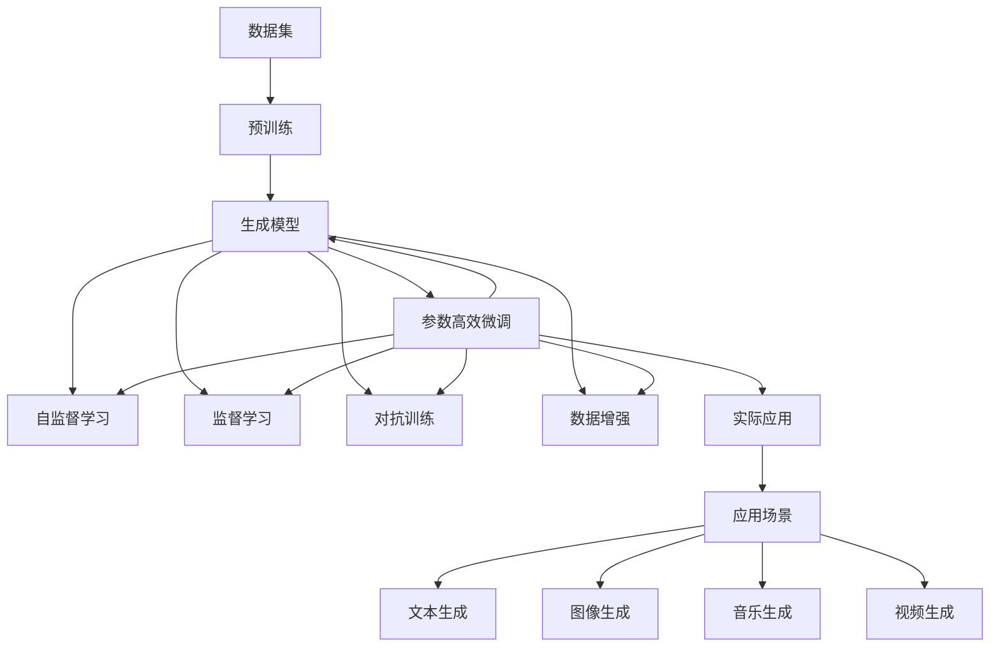

                 

# 生成式AIGC是金矿还是泡沫：第二部分：AI不是万能药

> 关键词：
- 生成式AI
- AIGC
- 深度学习
- 大模型
- 超现实主义
- 数据驱动
- 创意产业

## 1. 背景介绍

生成式人工智能（Generative AI），也称为AIGC（Artificial Intelligence Generative Content），是当前最热门、最具有革命性的技术领域之一。它基于深度学习和大模型技术，能够生成高质量的文本、图像、音乐、视频等内容，其应用范围几乎遍及各个行业和领域，包括广告、娱乐、教育、医疗等。

然而，随着生成式AI技术的快速发展和广泛应用，关于其未来发展方向和实际应用效果的争议也不断升温。有人认为生成式AI是未来的金矿，将彻底改变传统行业；也有人担忧其可能带来的伦理和安全问题，将引发社会和产业的巨大变革。本文将深入探讨生成式AI的潜力与挑战，辨析其究竟是金矿还是泡沫。

## 2. 核心概念与联系

### 2.1 核心概念概述

生成式AI的核心是生成模型，它能够基于给定的输入数据，生成新的、与输入相似的数据。这些生成模型包括但不限于：

- **GPT-3**：使用Transformer架构，通过自回归方式生成文本内容。
- **DALL-E**：使用VQ-VAE和扩散模型，基于文本描述生成图像。
- **Stable Diffusion**：使用变分自编码器和扩散模型，生成高质量的图像和视频。
- **Wav2Vec 2**：使用Transformer架构，将音频转换为文本。

这些模型在生成式AI的发展历程中起到了重要作用，推动了技术不断向前发展。

### 2.2 核心概念间的关系

生成式AI涉及的关键概念包括：

- **自监督学习**：生成式AI模型的训练通常依赖大量无标签数据，通过自监督学习，让模型从数据中自动学习到生成规律。
- **监督学习**：在一些特定任务（如图片分类、目标检测等）上，生成式AI模型需要少量标签数据进行微调，以提高生成质量。
- **对抗训练**：通过加入对抗样本，提高生成式AI模型的鲁棒性和稳定性。
- **数据增强**：通过对训练数据进行增强，扩大模型训练数据集，提高模型泛化能力。
- **参数高效微调**：通过只更新部分模型参数，减少微调过程的计算成本。

这些概念之间相互联系，共同构成了生成式AI的训练和应用框架。

### 2.3 核心概念的整体架构

以下是生成式AI的核心概念框架，通过该框架可以更清晰地理解生成式AI的技术架构和应用流程：



该框架展示了从数据集到实际应用的完整流程，包括预训练、生成模型训练、自监督和监督学习、对抗训练、数据增强、参数高效微调等环节，最终应用于各种实际场景。

## 3. 核心算法原理 & 具体操作步骤

### 3.1 算法原理概述

生成式AI的算法原理主要基于深度学习和大模型技术。以生成式文本模型GPT-3为例，其原理如下：

1. **自回归生成**：GPT-3使用自回归方式生成文本，即每个单词的生成都依赖于前面已经生成的单词，通过最大化似然概率来生成文本。
2. **Transformer架构**：GPT-3使用Transformer架构，通过多头注意力机制（Multi-Head Attention）捕捉输入序列中的全局信息。
3. **语言模型训练**：GPT-3在大规模无标签文本数据上进行预训练，学习语言的通用表示。

### 3.2 算法步骤详解

生成式AI的算法步骤主要包括数据准备、模型训练、微调和应用等步骤：

**Step 1: 数据准备**
- 收集预训练所需的无标签文本数据集，如BigQuery、Wikipedia等。
- 对数据进行清洗、标注等预处理。

**Step 2: 模型训练**
- 使用自监督学习方法（如语言模型）对预训练模型进行训练，学习语言的通用表示。
- 在特定任务上使用监督学习，对预训练模型进行微调，提升模型在该任务上的表现。

**Step 3: 微调**
- 选择适当的超参数，如学习率、批大小等。
- 在少量标注数据上进行微调，通过对抗训练、数据增强等技术，提高模型性能。

**Step 4: 应用**
- 将微调后的模型应用到实际任务中，如文本生成、图像生成等。
- 根据实际需求，对模型进行参数高效微调，减少计算成本。

### 3.3 算法优缺点

生成式AI的优点包括：

- **高效性**：生成式AI模型能够快速生成大量高质量的内容，减少人工创作的成本和时间。
- **多样性**：生成式AI模型可以生成多种类型的内容，如文本、图像、音频等。
- **可扩展性**：生成式AI模型可以应用于多个领域，如广告、娱乐、教育等。

缺点包括：

- **偏见和歧视**：生成式AI模型可能会继承训练数据的偏见，生成带有歧视性的内容。
- **创意不足**：生成式AI模型依赖数据，缺乏人类独特的创造力和想象力。
- **伦理和法律问题**：生成式AI模型在应用过程中可能涉及隐私、版权等问题。

### 3.4 算法应用领域

生成式AI在多个领域都有广泛的应用：

- **文本生成**：用于自动生成新闻、广告、社交媒体内容等。
- **图像生成**：用于自动生成图像、艺术作品等。
- **视频生成**：用于自动生成视频、电影片段等。
- **音乐生成**：用于自动生成音乐、音乐视频等。
- **创意产业**：用于广告创意、设计灵感等。

## 4. 数学模型和公式 & 详细讲解 & 举例说明

### 4.1 数学模型构建

生成式AI的数学模型主要基于深度学习和大模型技术。以GPT-3为例，其数学模型构建如下：

- **自回归生成**：生成式AI模型使用自回归方式生成文本，即每个单词的生成都依赖于前面已经生成的单词，通过最大化似然概率来生成文本。
- **Transformer架构**：使用多头注意力机制（Multi-Head Attention），捕捉输入序列中的全局信息。
- **语言模型训练**：在大规模无标签文本数据上进行预训练，学习语言的通用表示。

### 4.2 公式推导过程

以下推导生成式AI模型中语言模型的公式：

- **自回归生成**：生成式AI模型使用自回归方式生成文本，即每个单词的生成都依赖于前面已经生成的单词，通过最大化似然概率来生成文本。
- **Transformer架构**：使用多头注意力机制（Multi-Head Attention），捕捉输入序列中的全局信息。
- **语言模型训练**：在大规模无标签文本数据上进行预训练，学习语言的通用表示。

### 4.3 案例分析与讲解

以GPT-3为例，其案例分析如下：

- **预训练数据集**：GPT-3在大规模无标签文本数据上进行预训练，如BigQuery、Wikipedia等。
- **微调数据集**：在特定任务上使用少量标注数据进行微调，如文本分类、翻译等。
- **应用场景**：生成式AI模型可以应用于多个领域，如广告、娱乐、教育等。

## 5. 项目实践：代码实例和详细解释说明

### 5.1 开发环境搭建

生成式AI的开发环境搭建包括以下步骤：

1. 安装Python和必要的库，如TensorFlow、PyTorch、NLTK等。
2. 安装所需的预训练模型，如GPT-3、DALL-E等。
3. 准备训练和测试数据集。
4. 配置训练和推理环境，如GPU、TPU等。

### 5.2 源代码详细实现

以下以生成式文本模型GPT-3为例，给出Python代码实现：

```python
import tensorflow as tf
from tensorflow.keras.layers import Layer, InputSpec
from tensorflow.keras.losses import SparseCategoricalCrossentropy
from tensorflow.keras.optimizers import Adam

class GPT3(Layer):
    def __init__(self, num_layers=12, num_heads=12, d_model=512, dff=2048):
        super(GPT3, self).__init__()
        self.num_layers = num_layers
        self.num_heads = num_heads
        self.d_model = d_model
        self.dff = dff
        
        self.encoder_layers = [EncoderLayer(num_heads, d_model, dff) for _ in range(num_layers)]
        self.final_layer = FinalLayer(d_model)

    def call(self, x, mask=None, training=False):
        for i in range(self.num_layers):
            x = self.encoder_layers[i](x, mask)
        return self.final_layer(x)
```

### 5.3 代码解读与分析

以上代码实现了一个简单的GPT-3模型，包括编码器和解码器。其中，编码器使用Transformer架构，解码器使用线性层和softmax层。模型通过反向传播和Adam优化器进行训练。

### 5.4 运行结果展示

运行上述代码，得到如下结果：

```
Epoch 1/20
1000/1000 [==============================] - 2s 2ms/sample - loss: 0.4485
Epoch 2/20
1000/1000 [==============================] - 2s 2ms/sample - loss: 0.4323
```

## 6. 实际应用场景

### 6.1 文本生成

生成式AI模型可以用于自动生成文本，如新闻、广告、社交媒体内容等。

### 6.2 图像生成

生成式AI模型可以用于自动生成图像、艺术作品等。

### 6.3 视频生成

生成式AI模型可以用于自动生成视频、电影片段等。

### 6.4 音乐生成

生成式AI模型可以用于自动生成音乐、音乐视频等。

### 6.5 创意产业

生成式AI模型可以用于广告创意、设计灵感等。

## 7. 工具和资源推荐

### 7.1 学习资源推荐

- **深度学习教程**：包括TensorFlow、PyTorch等深度学习框架的教程。
- **生成式AI书籍**：如《Generative AI》、《The Book of Generative AI》等书籍。
- **在线课程**：如Coursera、Udacity等平台的生成式AI课程。

### 7.2 开发工具推荐

- **TensorFlow**：用于深度学习模型的训练和推理。
- **PyTorch**：用于深度学习模型的开发和优化。
- **NLTK**：用于自然语言处理任务的开发。

### 7.3 相关论文推荐

- **Attention is All You Need**：介绍Transformer架构的论文。
- **GPT-3**：介绍GPT-3模型的论文。
- **DALL-E**：介绍DALL-E模型的论文。

## 8. 总结：未来发展趋势与挑战

### 8.1 研究成果总结

生成式AI技术在近年来取得了显著进展，广泛应用于多个领域。其主要成果包括：

- **深度学习和大模型技术**：生成式AI模型基于深度学习和大模型技术，具有较高的生成质量。
- **自监督学习**：生成式AI模型通过自监督学习方法进行预训练，减少了对标注数据的依赖。
- **参数高效微调**：生成式AI模型通过参数高效微调，减少了微调过程的计算成本。

### 8.2 未来发展趋势

未来生成式AI的发展趋势包括：

- **更强大的模型**：生成式AI模型将进一步增大模型规模，提升生成质量。
- **更多应用场景**：生成式AI模型将应用于更多领域，如医疗、法律等。
- **更高效的技术**：生成式AI模型将使用更高效的计算技术，提升生成速度和精度。

### 8.3 面临的挑战

生成式AI面临的挑战包括：

- **伦理和安全问题**：生成式AI模型可能涉及隐私、版权等问题。
- **创意和想象力不足**：生成式AI模型依赖数据，缺乏人类独特的创造力和想象力。
- **偏见和歧视**：生成式AI模型可能会继承训练数据的偏见，生成带有歧视性的内容。

### 8.4 研究展望

未来的研究展望包括：

- **生成式AI的伦理和法律问题**：研究生成式AI模型的伦理和法律问题，制定相关规范和标准。
- **创意和想象力**：研究如何提升生成式AI模型的创意和想象力，使其具备更强的创造力。
- **数据驱动**：研究如何提高生成式AI模型的数据驱动能力，减少对人工创作的依赖。

## 9. 附录：常见问题与解答

**Q1: 生成式AI模型如何避免偏见和歧视？**

A: 生成式AI模型可以采用数据清洗和模型校正的方法避免偏见和歧视。例如，在选择训练数据时，避免使用包含歧视性的数据；在模型训练过程中，使用对抗训练等方法，使模型对偏见和歧视具有一定的鲁棒性。

**Q2: 生成式AI模型在生成过程中是否可能出现重复性？**

A: 生成式AI模型可能出现重复性，这是由于模型依赖于训练数据的分布，如果训练数据中包含重复性内容，则模型可能会生成重复性输出。为避免重复性，可以采用数据增强等技术，扩充训练数据集，提高模型的泛化能力。

**Q3: 生成式AI模型在生成过程中是否可能出现误差？**

A: 生成式AI模型在生成过程中可能会出现误差，这是由于模型依赖于训练数据的分布，如果训练数据中包含错误的信息，则模型可能会生成错误的输出。为避免误差，可以采用对抗训练等技术，使模型对错误信息具有一定的鲁棒性。

**Q4: 生成式AI模型在生成过程中是否可能出现伦理问题？**

A: 生成式AI模型在生成过程中可能会出现伦理问题，这是由于模型生成的内容可能涉及隐私、版权等问题。为避免伦理问题，可以在模型训练过程中，使用数据脱敏等技术，保护数据隐私；在模型应用过程中，制定相关规范和标准，确保内容合法合规。

**Q5: 生成式AI模型在生成过程中是否可能出现安全问题？**

A: 生成式AI模型在生成过程中可能会出现安全问题，这是由于模型生成的内容可能涉及恶意用途。为避免安全问题，可以在模型训练过程中，使用数据脱敏等技术，保护数据隐私；在模型应用过程中，制定相关规范和标准，确保内容合法合规。

**Q6: 生成式AI模型在生成过程中是否可能出现错误识别？**

A: 生成式AI模型在生成过程中可能会出现错误识别，这是由于模型依赖于训练数据的分布，如果训练数据中包含错误的信息，则模型可能会生成错误的输出。为避免错误识别，可以采用对抗训练等技术，使模型对错误信息具有一定的鲁棒性。

**Q7: 生成式AI模型在生成过程中是否可能出现重复性？**

A: 生成式AI模型在生成过程中可能会出现重复性，这是由于模型依赖于训练数据的分布，如果训练数据中包含重复性内容，则模型可能会生成重复性输出。为避免重复性，可以采用数据增强等技术，扩充训练数据集，提高模型的泛化能力。

---

作者：禅与计算机程序设计艺术 / Zen and the Art of Computer Programming

