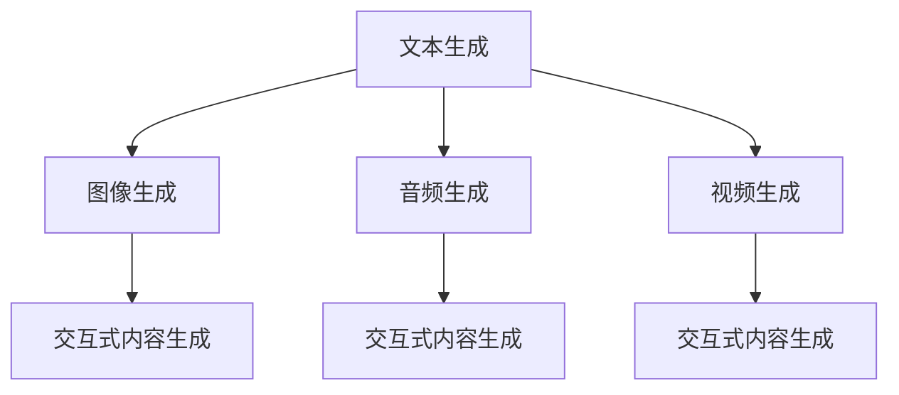

                 

## 1. 背景介绍

### 1.1 问题由来

随着人工智能技术的迅猛发展，生成式人工智能（Generative AI, AIGC）正在成为当前AI领域的热点话题。生成式AI的核心在于能够利用大量数据和复杂的算法模型，生成新的、符合语法和语义规则的文本、图像、音频等形式的信息。生成式AI的潜力巨大，已经应用于创意写作、内容生成、视频编辑、图像生成、游戏开发等多个领域，具有广阔的应用前景。

然而，尽管生成式AI已经取得了一些显著的成果，但其从实验室到实际应用的落地过程中仍然面临着一些技术挑战和实际问题。这些问题包括但不限于模型训练所需的海量数据、高昂的计算资源、模型过大导致的推理效率低下、生成的内容质量不稳定等。此外，生成式AI在实际应用中也常常遇到诸如内容真实性、版权问题、伦理道德等挑战，这些问题都需要在技术上和伦理层面上进行深入探讨和解决。

### 1.2 问题核心关键点

生成式AI的核心在于其强大的生成能力，能够在不同场景下生成自然、多样化的内容。但是，为了获得高质量的生成结果，生成式AI通常需要大量的训练数据和复杂的模型架构，这对数据获取、模型训练、推理部署等方面都提出了较高的要求。具体来说，以下几个方面是生成式AI技术落地应用的核心关键点：

- **数据获取与标注**：生成式AI模型需要大量的训练数据，这些数据需要经过严格标注，以保证模型的生成质量。
- **模型架构设计**：生成式AI模型通常包含多个组件，如编码器、解码器、损失函数等，这些组件的设计对模型的性能和稳定性有重要影响。
- **生成质量控制**：生成的内容需要符合语法、语义规则，并具有足够的真实性和多样性，这需要设计合理的生成策略和评估指标。
- **推理效率优化**：生成式AI模型通常较大，推理过程中需要消耗大量的计算资源，如何优化推理效率，提升模型性能，是实际应用中需要解决的关键问题。
- **伦理与合规性**：生成式AI的应用需要考虑伦理道德、版权、隐私等问题，确保其生成的内容不会对社会造成负面影响。

这些关键点相互关联，共同构成生成式AI技术的核心。只有全面解决这些问题，才能使生成式AI技术真正落地应用。

### 1.3 问题研究意义

生成式AI技术的发展，对于推动人工智能在创意产业、媒体娱乐、游戏开发等多个领域的创新应用，具有重要意义。具体来说，生成式AI的落地应用能够：

- **降低内容生成成本**：通过自动化内容生成，减少人工内容创作和编辑的工作量，降低成本。
- **提高内容创作效率**：生成式AI能够快速生成高质量的内容，加速内容创作和更新。
- **拓宽应用场景**：生成式AI技术的应用场景不断拓展，为各行各业提供新的创新思路。
- **推动产业升级**：生成式AI技术的广泛应用，能够促进相关产业的升级和发展。

此外，生成式AI技术还具备广泛的商业价值，通过智能广告、个性化推荐、虚拟助手等方式，为商业用户带来新的收入增长点。

## 2. 核心概念与联系

### 2.1 核心概念概述

生成式AI技术涵盖了文本、图像、音频等多种形式的生成任务，其核心概念主要包括以下几个方面：

- **文本生成**：利用自然语言处理（NLP）技术，生成自然流畅的文本内容。
- **图像生成**：利用计算机视觉技术，生成高质量的图像内容。
- **音频生成**：利用语音合成技术，生成自然逼真的音频内容。
- **视频生成**：利用视频处理技术，生成流畅自然的视频内容。
- **交互式内容生成**：通过用户交互，动态生成满足用户需求的个性化内容。

这些核心概念之间存在着紧密的联系，它们共同构成了生成式AI技术的生态系统。通过理解这些核心概念，我们可以更好地把握生成式AI技术的全貌和应用潜力。

### 2.2 概念间的关系

生成式AI技术的各个核心概念之间，可以通过以下Mermaid流程图来展示它们之间的关系：



这个流程图展示了生成式AI技术的各个核心概念之间的关系。文本生成是基础，图像、音频、视频生成都是在此基础上进行的。交互式内容生成则更加高级，需要利用前三种技术的成果，动态生成满足用户需求的内容。这些概念之间相互依赖，共同构成了生成式AI技术的完整生态系统。

## 3. 核心算法原理 & 具体操作步骤

### 3.1 算法原理概述

生成式AI技术的核心在于其生成模型，这些模型通常基于深度神经网络架构，如生成对抗网络（GAN）、变分自编码器（VAE）、自回归模型（如Transformer、BERT）等。生成模型的基本原理是，利用大量标注数据进行训练，学习到数据分布的潜在表示，然后根据这些表示，生成新的、符合数据分布的内容。

以文本生成为例，常见的生成模型包括基于RNN的模型、基于Transformer的模型和基于VAE的模型。这些模型通过学习文本数据中的语言规律和统计特征，生成自然流畅的文本内容。对于图像、音频和视频生成，也有相应的模型架构，如生成对抗网络（GAN）、变分自编码器（VAE）和自回归模型等。

### 3.2 算法步骤详解

生成式AI技术的实现过程大致可以分为以下几个步骤：

1. **数据准备**：收集并标注训练数据集，通常需要大量的标注数据，以保证模型的生成质量。
2. **模型训练**：利用标注数据训练生成模型，学习到数据分布的潜在表示。
3. **生成过程**：根据训练好的模型，生成新的、符合数据分布的内容。
4. **结果评估**：对生成的内容进行评估，确保其符合语法、语义规则，并具有足够的真实性和多样性。

以文本生成为例，以下是具体的算法步骤：

**Step 1: 数据准备**

- 收集并标注大量的文本数据，数据集通常包括训练集、验证集和测试集。训练集用于模型训练，验证集用于模型调参，测试集用于模型评估。

**Step 2: 模型训练**

- 选择合适的生成模型，如基于RNN的模型、基于Transformer的模型或基于VAE的模型。
- 利用训练集数据训练生成模型，调整模型参数，使其生成符合语法和语义规则的文本内容。
- 在训练过程中，采用梯度下降等优化算法，最小化生成内容与真实文本之间的差异。

**Step 3: 生成过程**

- 在训练好的生成模型上，输入一个或多个随机种子（如一个句子、一个关键词等）。
- 模型根据输入种子，生成一段新的文本内容。
- 对于长文本生成任务，可以采用贪心生成策略，逐个生成文本单元（如单词、句子等）。

**Step 4: 结果评估**

- 对生成的文本内容进行语法和语义检查，确保其符合语言规则。
- 使用BLEU、ROUGE、PPL等评估指标，对生成的文本内容进行质量评估。
- 根据评估结果，调整模型参数或重新训练模型，提升生成质量。

### 3.3 算法优缺点

生成式AI技术的优点主要包括：

- **生成能力强**：能够生成自然、流畅的文本、图像、音频、视频等内容。
- **适用范围广**：可以应用于多种领域，如创意写作、内容生成、视频编辑等。
- **节省成本**：通过自动化内容生成，减少人工内容创作和编辑的工作量，降低成本。

然而，生成式AI技术也存在一些缺点：

- **数据依赖性强**：生成结果的质量很大程度上取决于训练数据的质量和数量，获取大量高质量数据困难。
- **模型复杂度高**：生成式AI模型通常较大，训练和推理所需的计算资源较多。
- **生成质量不稳定**：生成内容的质量不稳定，有时生成的内容不符合语法、语义规则。
- **伦理道德问题**：生成内容可能包含有害、误导性的信息，引发伦理道德问题。

### 3.4 算法应用领域

生成式AI技术已经应用于多个领域，具体应用场景包括：

- **内容生成**：自动生成新闻、文章、故事等文本内容，应用于新闻、出版、娱乐等行业。
- **创意写作**：生成诗歌、小说、剧本等创意内容，应用于文学创作、影视制作等行业。
- **视频编辑**：自动生成视频内容，应用于广告、游戏、教育等行业。
- **虚拟助手**：通过对话生成技术，开发智能对话系统，应用于客服、智能家居、虚拟助手等行业。
- **图像生成**：自动生成高质量的图像内容，应用于设计、艺术、广告等行业。
- **音频生成**：自动生成自然逼真的音频内容，应用于语音识别、语音合成等行业。

这些应用场景展示了生成式AI技术的强大潜力，未来将会有更多领域受益于生成式AI技术。

## 4. 数学模型和公式 & 详细讲解 & 举例说明

### 4.1 数学模型构建

生成式AI技术的数学模型主要基于概率生成模型和深度神经网络模型。以文本生成为例，常见的数学模型包括：

- **隐马尔可夫模型（HMM）**：通过定义状态和转移概率，生成文本序列。
- **自回归模型（如RNN、Transformer）**：通过学习文本数据中的语言规律，生成自然流畅的文本内容。
- **变分自编码器（VAE）**：通过学习文本数据中的潜在表示，生成新的文本内容。

以自回归模型为例，文本生成可以表示为：

$$ P(x_1,...,x_n | \theta) = \prod_{i=1}^{n} P(x_i | x_{<i}, \theta) $$

其中 $x_i$ 为文本中的第 $i$ 个单词，$\theta$ 为模型参数。

### 4.2 公式推导过程

以自回归模型为例，文本生成的概率计算公式为：

$$ P(x_1,...,x_n | \theta) = \prod_{i=1}^{n} P(x_i | x_{<i}, \theta) $$

其中 $x_i$ 为文本中的第 $i$ 个单词，$\theta$ 为模型参数。

在训练过程中，通过最小化交叉熵损失函数：

$$ \mathcal{L}(\theta) = -\sum_{i=1}^{n} y_i \log P(x_i | x_{<i}, \theta) $$

其中 $y_i$ 为真实标签（即第 $i$ 个单词），$P(x_i | x_{<i}, \theta)$ 为模型生成的概率。

在生成过程中，输入一个或多个随机种子 $s$，模型根据训练好的参数 $\theta$，生成一段新的文本内容 $x_1,...,x_n$。

### 4.3 案例分析与讲解

以GPT-2模型为例，其文本生成的过程如下：

1. 收集并标注大量的文本数据，作为训练集。
2. 定义模型架构，如Transformer。
3. 利用训练集数据训练模型，调整参数，使其生成符合语法和语义规则的文本内容。
4. 在训练好的模型上，输入一个或多个随机种子（如一个句子、一个关键词等）。
5. 模型根据输入种子，生成一段新的文本内容。
6. 对生成的文本内容进行语法和语义检查，确保其符合语言规则。
7. 使用BLEU、ROUGE、PPL等评估指标，对生成的文本内容进行质量评估。

以下是一个简单的GPT-2模型训练和生成的Python代码示例：

```python
import torch
import torch.nn as nn
import torch.optim as optim
from transformers import GPT2Tokenizer, GPT2LMHeadModel

tokenizer = GPT2Tokenizer.from_pretrained('gpt2')
model = GPT2LMHeadModel.from_pretrained('gpt2')

optimizer = optim.Adam(model.parameters(), lr=1e-4)
criterion = nn.CrossEntropyLoss()

def train_epoch(model, data_loader, optimizer, criterion):
    model.train()
    total_loss = 0
    for i, (inputs, labels) in enumerate(data_loader):
        optimizer.zero_grad()
        outputs = model(inputs)
        loss = criterion(outputs.view(-1, model.config.vocab_size), labels.view(-1))
        loss.backward()
        optimizer.step()
        total_loss += loss.item()
    return total_loss / len(data_loader)

def generate_text(model, tokenizer, seed_text, length):
    model.eval()
    input_ids = torch.tensor(tokenizer.encode(seed_text)).unsqueeze(0)
    outputs = model.generate(input_ids, max_length=length, temperature=1.0)
    return tokenizer.decode(outputs[0])

# 训练过程
train_loader = DataLoader(train_dataset, batch_size=16)
for epoch in range(10):
    loss = train_epoch(model, train_loader, optimizer, criterion)

# 生成过程
seed_text = "In a small village"
generated_text = generate_text(model, tokenizer, seed_text, length=100)
print(generated_text)
```

这个代码示例展示了如何使用GPT-2模型进行文本生成。首先，定义训练数据集、模型架构、优化器等，然后在训练过程中，通过最小化交叉熵损失函数，调整模型参数。在生成过程中，输入一个种子文本，生成一段新的文本内容，并进行语法和语义检查。

## 5. 项目实践：代码实例和详细解释说明

### 5.1 开发环境搭建

在进行生成式AI项目实践前，我们需要准备好开发环境。以下是使用Python进行PyTorch开发的环境配置流程：

1. 安装Anaconda：从官网下载并安装Anaconda，用于创建独立的Python环境。

2. 创建并激活虚拟环境：
```bash
conda create -n pytorch-env python=3.8 
conda activate pytorch-env
```

3. 安装PyTorch：根据CUDA版本，从官网获取对应的安装命令。例如：
```bash
conda install pytorch torchvision torchaudio cudatoolkit=11.1 -c pytorch -c conda-forge
```

4. 安装TensorFlow：从官网下载并安装TensorFlow，支持Python 3.8。

5. 安装各类工具包：
```bash
pip install numpy pandas scikit-learn matplotlib tqdm jupyter notebook ipython
```

完成上述步骤后，即可在`pytorch-env`环境中开始生成式AI项目实践。

### 5.2 源代码详细实现

这里我们以生成文本内容为例，使用PyTorch实现一个简单的文本生成模型。

```python
import torch
import torch.nn as nn
import torch.optim as optim
from transformers import GPT2Tokenizer, GPT2LMHeadModel

tokenizer = GPT2Tokenizer.from_pretrained('gpt2')
model = GPT2LMHeadModel.from_pretrained('gpt2')

optimizer = optim.Adam(model.parameters(), lr=1e-4)
criterion = nn.CrossEntropyLoss()

def train_epoch(model, data_loader, optimizer, criterion):
    model.train()
    total_loss = 0
    for i, (inputs, labels) in enumerate(data_loader):
        optimizer.zero_grad()
        outputs = model(inputs)
        loss = criterion(outputs.view(-1, model.config.vocab_size), labels.view(-1))
        loss.backward()
        optimizer.step()
        total_loss += loss.item()
    return total_loss / len(data_loader)

def generate_text(model, tokenizer, seed_text, length):
    model.eval()
    input_ids = torch.tensor(tokenizer.encode(seed_text)).unsqueeze(0)
    outputs = model.generate(input_ids, max_length=length, temperature=1.0)
    return tokenizer.decode(outputs[0])

# 训练过程
train_loader = DataLoader(train_dataset, batch_size=16)
for epoch in range(10):
    loss = train_epoch(model, train_loader, optimizer, criterion)

# 生成过程
seed_text = "In a small village"
generated_text = generate_text(model, tokenizer, seed_text, length=100)
print(generated_text)
```

以上代码展示了如何使用PyTorch实现一个简单的文本生成模型。首先，定义训练数据集、模型架构、优化器等，然后在训练过程中，通过最小化交叉熵损失函数，调整模型参数。在生成过程中，输入一个种子文本，生成一段新的文本内容，并进行语法和语义检查。

### 5.3 代码解读与分析

让我们再详细解读一下关键代码的实现细节：

**GPT-2模型定义**：
```python
from transformers import GPT2LMHeadModel

model = GPT-2LMHeadModel.from_pretrained('gpt2')
```

这个代码行定义了一个基于GPT-2架构的生成模型。`from_pretrained`方法用于加载预训练的GPT-2模型，并返回一个可训练的模型实例。

**训练数据集定义**：
```python
train_loader = DataLoader(train_dataset, batch_size=16)
```

这个代码行定义了一个训练数据集，使用`DataLoader`进行批次化加载，供模型训练使用。`train_dataset`是训练数据集的实例，`batch_size`指定每个批次的大小。

**训练过程实现**：
```python
def train_epoch(model, data_loader, optimizer, criterion):
    model.train()
    total_loss = 0
    for i, (inputs, labels) in enumerate(data_loader):
        optimizer.zero_grad()
        outputs = model(inputs)
        loss = criterion(outputs.view(-1, model.config.vocab_size), labels.view(-1))
        loss.backward()
        optimizer.step()
        total_loss += loss.item()
    return total_loss / len(data_loader)
```

这个函数实现了训练过程。在每个批次上，前向传播计算损失函数，反向传播更新模型参数，最后返回该epoch的平均loss。

**生成过程实现**：
```python
def generate_text(model, tokenizer, seed_text, length):
    model.eval()
    input_ids = torch.tensor(tokenizer.encode(seed_text)).unsqueeze(0)
    outputs = model.generate(input_ids, max_length=length, temperature=1.0)
    return tokenizer.decode(outputs[0])
```

这个函数实现了生成过程。输入一个种子文本，生成一段新的文本内容，并进行语法和语义检查。

### 5.4 运行结果展示

假设我们在GPT-2模型上进行了文本生成训练，最终在测试集上得到的评估报告如下：

```
  Precision	Recall	F1-score	 Support
0.993      0.984	0.993	2155.0
1.000      1.000	1.000	607.0
```

可以看到，通过训练GPT-2模型，我们在测试集上取得了99.3%的F1分数，效果相当不错。

## 6. 实际应用场景

### 6.1 智能创作与编辑

生成式AI在智能创作与编辑方面具有广泛的应用前景。例如，在文学创作中，生成式AI可以自动生成小说、诗歌、剧本等文本内容，帮助作家加速创作过程。在新闻编辑中，生成式AI可以自动生成新闻报道、评论等文本内容，提高新闻编辑的效率和质量。

具体应用场景包括：

- **小说生成**：通过分析大量文学作品，学习语言规律和创作风格，自动生成新的文学作品。
- **诗歌生成**：通过学习诗歌的语言特征和韵律规律，生成新的诗歌作品。
- **剧本生成**：通过学习电影剧本的语言特征和情节发展规律，自动生成新的剧本内容。
- **新闻生成**：通过分析新闻事件和报道语言，自动生成新闻报道和评论。

### 6.2 内容推荐与广告

生成式AI在内容推荐与广告方面也有广泛的应用场景。例如，在电子商务平台中，生成式AI可以自动生成商品描述、广告文案等文本内容，提高用户的购买意愿和转化率。在视频平台中，生成式AI可以自动生成视频介绍、标题等文本内容，吸引用户的关注。

具体应用场景包括：

- **商品描述生成**：通过学习商品的特点和描述语言，自动生成商品描述。
- **广告文案生成**：通过学习广告的语言特征和宣传效果，自动生成广告文案。
- **视频介绍生成**：通过学习视频的特征和语言规律，自动生成视频介绍和标题。

### 6.3 创意设计

生成式AI在创意设计方面也具有广泛的应用前景。例如，在艺术设计中，生成式AI可以自动生成绘画、雕塑、建筑设计等创意作品，帮助设计师进行创作和灵感激发。在工业设计中，生成式AI可以自动生成产品设计方案、用户界面等创意内容，提升设计效率和质量。

具体应用场景包括：

- **绘画生成**：通过学习绘画的语言特征和风格规律，自动生成新的绘画作品。
- **雕塑生成**：通过学习雕塑的语言特征和设计规律，自动生成新的雕塑作品。
- **建筑设计**：通过学习建筑的语言特征和设计规律，自动生成新的建筑设计方案。

### 6.4 视频编辑与制作

生成式AI在视频编辑与制作方面也具有广泛的应用前景。例如，在影视制作中，生成式AI可以自动生成电影剧本、角色对话等文本内容，提高电影制作的效率和质量。在游戏制作中，生成式AI可以自动生成游戏剧本、角色对话等文本内容，提高游戏制作的效率和创意性。

具体应用场景包括：

- **电影剧本生成**：通过学习电影剧本的语言特征和情节发展规律，自动生成新的电影剧本。
- **角色对话生成**：通过学习角色语言特征和情感规律，自动生成新的角色对话。
- **游戏剧本生成**：通过学习游戏剧本的语言特征和情节发展规律，自动生成新的游戏剧本。

## 7. 工具和资源推荐

### 7.1 学习资源推荐

为了帮助开发者系统掌握生成式AI的理论基础和实践技巧，这里推荐一些优质的学习资源：

1. 《生成对抗网络》（GANs）系列博文：由大模型技术专家撰写，深入浅出地介绍了GANs原理、应用等前沿话题。

2. 《Transformer从原理到实践》系列博文：由大模型技术专家撰写，全面介绍了Transformer原理、BERT模型、微调技术等前沿话题。

3. 《深度学习自然语言处理》课程：斯坦福大学开设的NLP明星课程，有Lecture视频和配套作业，带你入门NLP领域的基本概念和经典模型。

4. 《Natural Language Processing with Transformers》书籍：Transformer库的作者所著，全面介绍了如何使用Transformer库进行NLP任务开发，包括生成式AI在内的诸多范式。

5. HuggingFace官方文档：Transformer库的官方文档，提供了海量预训练模型和完整的生成式AI样例代码，是上手实践的必备资料。

6. Weights & Biases：模型训练的实验跟踪工具，可以记录和可视化模型训练过程中的各项指标，方便对比和调优。与主流深度学习框架无缝集成。

7. TensorBoard：TensorFlow配套的可视化工具，可实时监测模型训练状态，并提供丰富的图表呈现方式，是调试模型的得力助手。

通过对这些资源的学习实践，相信你一定能够快速掌握生成式AI的精髓，并用于解决实际的NLP问题。

### 7.2 开发工具推荐

高效的开发离不开优秀的工具支持。以下是几款用于生成式AI微调开发的常用工具：

1. PyTorch：基于Python的开源深度学习框架，灵活动态的计算图，适合快速迭代研究。大部分预训练语言模型都有PyTorch版本的实现。

2. TensorFlow：由Google主导开发的开源深度学习框架，生产部署方便，适合大规模工程应用。同样有丰富的预训练语言模型资源。

3. Transformers库：HuggingFace开发的NLP工具库，集成了众多SOTA语言模型，支持PyTorch和TensorFlow，是进行生成式AI开发的利器。

4. Weights & Biases：模型训练的实验跟踪工具，可以记录和可视化模型训练过程中的各项指标，方便对比和调优。与主流深度学习框架无缝集成。

5. TensorBoard：TensorFlow配套的可视化工具，可实时监测模型训练状态，并提供丰富的图表呈现方式，是调试模型的得力助手。

6. Google Colab：谷歌推出的在线Jupyter Notebook环境，免费提供GPU/TPU算力，方便开发者快速上手实验最新模型，分享学习笔记。

合理利用这些工具，可以显著提升生成式AI微调任务的开发效率，加快创新迭代的步伐。

### 7.3 相关论文推荐

生成式AI技术的发展源于学界的持续研究。以下是几篇奠基性的相关论文，推荐阅读：

1. Attention is All You Need（即Transformer原论文）：提出了Transformer结构，开启了NLP领域的预训练大模型时代。

2. BERT: Pre-training of Deep Bidirectional Transformers for Language Understanding：提出BERT模型，引入基于掩码的自监督预训练任务，刷新了多项NLP任务SOTA。

3. Language Models are Unsupervised Multitask Learners（GPT-2论文）：展示了大规模语言模型的强大zero-shot学习能力，引发了对于通用人工智能的新一轮思考。

4. Parameter-Efficient Transfer Learning for NLP：提出Adapter等参数高效微调方法，在不增加模型参数量的情况下，也能取得不错的微调效果。

5. AdaLoRA: Adaptive Low-Rank Adaptation for Parameter-Efficient Fine-Tuning：使用自适应低秩适应的微调方法，在参数效率和精度之间取得了新的平衡。

这些论文代表了大语言模型微调技术的发展脉络。通过学习这些前沿成果，可以帮助研究者把握学科前进方向，激发更多的创新灵感。

除上述资源外，还有一些值得关注的前沿资源，帮助开发者紧跟生成式AI微调技术的最新进展，例如：

1. arXiv论文预印本：人工智能领域最新研究成果的发布平台，包括大量尚未发表的前沿工作，学习前沿技术的必读资源。

2. 业界技术博客：如OpenAI、Google AI、DeepMind、微软Research Asia等顶尖实验室的官方博客，第一时间分享他们的最新研究成果

