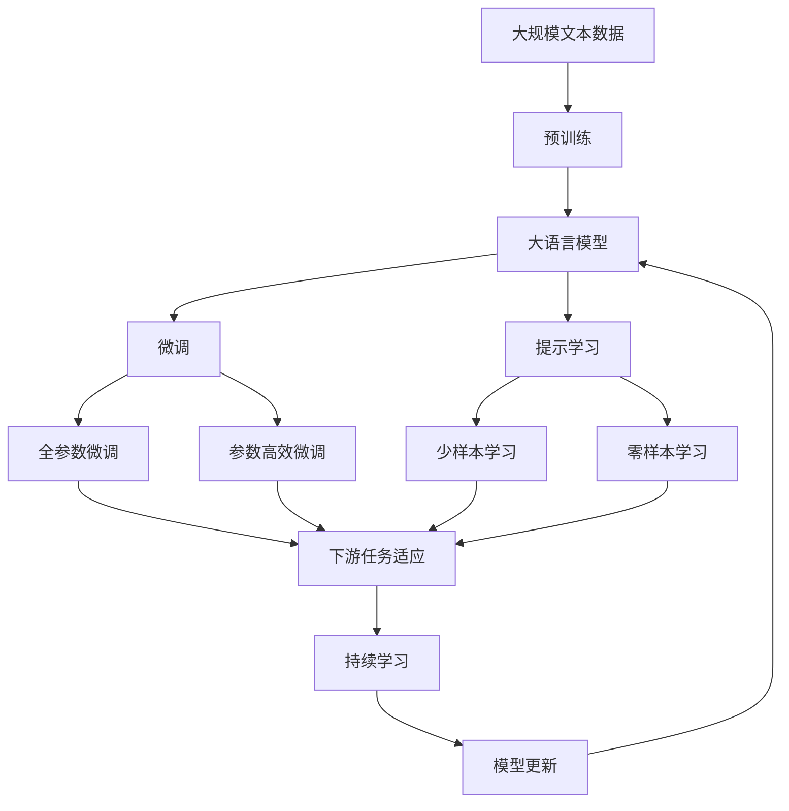

                 

## 1. 背景介绍

### 1.1 问题由来

生成式人工智能（Generative AI）是人工智能领域的一项前沿技术，它能够从给定的数据中学习到数据分布，并生成新的数据样本。这一技术已经在文本生成、图像生成、音频生成等领域取得了显著的进展，展示了其强大的生成能力。近年来，生成式AI的应用范围不断扩大，从游戏设计、艺术创作到医疗诊断、商业智能，生成式AI正在逐步改变我们的生活和工作方式。

生成式AI的关键在于能够通过深度学习模型，如生成对抗网络（GANs）、变分自编码器（VAEs）、语言模型等，学习数据的统计特性，并在此基础上生成新的数据样本。其中，文本生成和图像生成是两个最为典型和具有代表性的应用领域。文本生成技术已经在对话系统、机器翻译、自然语言生成（NLG）等方面得到广泛应用，而图像生成则涵盖了从艺术创作到虚拟现实（VR）等多个领域。

### 1.2 问题核心关键点

生成式AI的核心在于其生成能力，即从给定的数据中学习并生成新的数据。其核心技术包括以下几个方面：

1. **生成模型**：用于学习数据分布的模型，包括GANs、VAEs、RNN等。
2. **条件生成**：通过引入条件变量，生成特定的数据样本，如文本生成模型中的条件式语言模型。
3. **对抗训练**：通过生成器和判别器的对抗训练，提高生成模型的生成能力。
4. **解码器**：将生成的数据样本解码成可解释的形式，如图像、文本等。

这些核心技术相互协作，共同构成了生成式AI的生成能力。通过不断优化和创新，生成式AI在各个应用领域展现出了巨大的潜力。

### 1.3 问题研究意义

生成式AI的研究具有重要的理论和实际意义：

1. **创新驱动**：生成式AI能够带来创新，推动各行业的数字化转型和智能化升级，为经济社会发展注入新动力。
2. **数据增强**：通过生成式AI技术，可以生成大量高质量的数据，用于训练机器学习模型，提升模型性能。
3. **伦理考量**：生成式AI的应用需要考虑伦理和法律问题，如数据隐私、内容真实性等，这需要技术开发者和政策制定者的共同努力。
4. **公平性**：生成式AI需要避免偏见，确保生成的数据和内容公平、公正，不歧视任何群体。
5. **安全保障**：生成式AI需要保障数据和模型安全，防止恶意使用和滥用。

## 2. 核心概念与联系

### 2.1 核心概念概述

生成式AI的核心概念包括以下几个方面：

1. **生成对抗网络（GANs）**：由生成器和判别器两部分组成，通过对抗训练提高生成器的生成能力。
2. **变分自编码器（VAEs）**：通过学习数据的分布，生成新的数据样本。
3. **条件生成模型**：在生成模型中引入条件变量，生成特定的数据样本。
4. **解码器**：将生成模型生成的数据样本解码成可解释的形式。
5. **自动编码器（AEs）**：通过学习数据的低维表示，生成新的数据样本。
6. **标准化变量生成模型（SVG-GAN）**：一种高效的生成对抗网络，用于生成高分辨率的图像。

这些概念之间的联系可以通过以下Mermaid流程图来展示：

```mermaid
graph LR
    A[生成对抗网络 (GANs)] --> B[生成器]
    A --> C[判别器]
    B --> D[生成样本]
    C --> D
    D --> E[解码器]
    E --> F[目标数据]
    B --> G[自动编码器 (AEs)]
    G --> H[生成低维表示]
    H --> I[生成高维样本]
```

这个流程图展示了生成式AI的核心概念及其之间的关系：

1. GANs由生成器和判别器两部分组成，通过对抗训练提高生成能力。
2. VAEs通过学习数据的分布，生成新的数据样本。
3. 条件生成模型在生成模型中引入条件变量，生成特定的数据样本。
4. 解码器将生成模型生成的数据样本解码成可解释的形式。
5. AEs通过学习数据的低维表示，生成新的数据样本。
6. SVG-GAN是一种高效的生成对抗网络，用于生成高分辨率的图像。

### 2.2 概念间的关系

这些核心概念之间存在着紧密的联系，形成了生成式AI的完整生态系统。下面我通过几个Mermaid流程图来展示这些概念之间的关系。

#### 2.2.1 生成对抗网络与自动编码器

```mermaid
graph LR
    A[生成对抗网络 (GANs)] --> B[生成器]
    A --> C[判别器]
    B --> D[生成样本]
    C --> D
    D --> E[解码器]
    E --> F[目标数据]
    B --> G[自动编码器 (AEs)]
    G --> H[生成低维表示]
    H --> I[生成高维样本]
```

这个流程图展示了GANs和AEs的基本原理及其关系。GANs通过对抗训练提高生成器的生成能力，而AEs则通过学习数据的低维表示，生成新的数据样本。

#### 2.2.2 条件生成模型

```mermaid
graph LR
    A[生成对抗网络 (GANs)] --> B[生成器]
    A --> C[判别器]
    B --> D[生成样本]
    C --> D
    D --> E[解码器]
    E --> F[目标数据]
    B --> G[条件生成模型]
    G --> H[生成条件样本]
    H --> I[生成目标数据]
```

这个流程图展示了条件生成模型的基本原理及其在GANs中的应用。通过在生成器中引入条件变量，条件生成模型能够生成特定的数据样本。

#### 2.2.3 解码器

```mermaid
graph LR
    A[生成对抗网络 (GANs)] --> B[生成器]
    A --> C[判别器]
    B --> D[生成样本]
    C --> D
    D --> E[解码器]
    E --> F[目标数据]
```

这个流程图展示了解码器的基本原理。解码器将生成模型生成的数据样本解码成可解释的形式，如图像、文本等。

### 2.3 核心概念的整体架构

最后，我们用一个综合的流程图来展示这些核心概念在大语言模型微调过程中的整体架构：



这个综合流程图展示了从预训练到微调，再到持续学习的完整过程。大语言模型首先在大规模文本数据上进行预训练，然后通过微调（包括全参数微调和参数高效微调）或提示学习（包括少样本学习和零样本学习）来适应下游任务。最后，通过持续学习技术，模型可以不断更新和适应新的任务和数据。

## 3. 核心算法原理 & 具体操作步骤

### 3.1 算法原理概述

生成式AI的核心算法原理主要基于生成对抗网络和变分自编码器，这两种算法分别通过对抗训练和分布学习的方式，生成新的数据样本。

1. **生成对抗网络（GANs）**：由生成器和判别器两部分组成。生成器负责生成新的数据样本，而判别器则负责区分生成的数据和真实数据。通过对抗训练，生成器和判别器不断进化，最终生成器能够生成逼真的数据样本。

2. **变分自编码器（VAEs）**：通过学习数据的分布，生成新的数据样本。VAEs由编码器和解码器两部分组成。编码器将输入数据映射到低维表示，而解码器则将低维表示映射回高维数据样本。通过最大化低维表示的重构误差，VAEs可以学习到数据的分布。

### 3.2 算法步骤详解

生成式AI的算法步骤包括以下几个关键步骤：

1. **数据准备**：准备用于训练和测试的数据集，包括标注数据和无标签数据。
2. **模型选择**：选择合适的生成模型，如GANs、VAEs等。
3. **模型训练**：使用标注数据对生成模型进行训练，优化模型的生成能力。
4. **解码器训练**：将生成的数据样本通过解码器解码成可解释的形式。
5. **评估测试**：在测试集上评估模型的生成能力，确保模型的泛化能力。

### 3.3 算法优缺点

生成式AI的算法具有以下优点：

1. **生成能力强**：生成式AI能够生成高质量的数据样本，适用于文本生成、图像生成等任务。
2. **灵活性高**：通过引入条件变量，生成式AI可以生成特定的数据样本，满足不同任务的需求。
3. **可解释性**：生成式AI生成的数据样本具有一定的可解释性，便于人类理解和分析。

生成式AI的算法也存在一些缺点：

1. **训练成本高**：生成式AI的训练需要大量的计算资源，训练周期较长。
2. **生成样本多样性**：生成式AI生成的样本具有多样性，难以控制生成的数据样本的具体特征。
3. **模型复杂性**：生成式AI的模型较为复杂，需要精心调参才能取得最佳效果。

### 3.4 算法应用领域

生成式AI的应用领域广泛，主要包括：

1. **文本生成**：用于自动摘要、对话生成、文本翻译等任务。
2. **图像生成**：用于生成逼真的图像，如图像生成、艺术创作等。
3. **音频生成**：用于音频合成、语音转换等任务。
4. **游戏设计**：用于生成虚拟角色、虚拟环境等。
5. **虚拟现实（VR）**：用于生成虚拟场景、虚拟人物等。

## 4. 数学模型和公式 & 详细讲解 & 举例说明

### 4.1 数学模型构建

#### 4.1.1 生成对抗网络（GANs）

GANs由生成器和判别器两部分组成。生成器 $G$ 将随机噪声 $z$ 映射到数据空间 $x$，判别器 $D$ 则区分生成的数据 $x_G$ 和真实数据 $x_R$。GANs的目标是最小化生成器的损失函数 $L_G$ 和最大化判别器的损失函数 $L_D$，使得生成器能够生成逼真的数据。

生成器的损失函数为：
$$
L_G = E_D[D(x_G)]
$$

判别器的损失函数为：
$$
L_D = E_G[D(x_G)] + E_R[1 - D(x_R)]
$$

其中，$E_G$ 和 $E_R$ 分别表示生成器和判别器的期望。

#### 4.1.2 变分自编码器（VAEs）

VAEs由编码器和解码器两部分组成。编码器 $E$ 将输入数据 $x$ 映射到低维表示 $z$，解码器 $D$ 将低维表示 $z$ 映射回高维数据样本 $x'$。VAEs的目标是最大化低维表示的重构误差 $\mathcal{L}_{rec}$ 和最大化低维表示的先验分布与编码器的输出分布的一致性 $\mathcal{L}_{kl}$，使得VAEs能够学习到数据的分布。

重构损失函数为：
$$
\mathcal{L}_{rec} = E_{x\sim P(x)}[(\mu_{\theta}(x) - x)^2 + \sigma_{\theta}(x)^2]
$$

先验损失函数为：
$$
\mathcal{L}_{kl} = -\frac{1}{\beta}\mathbb{E}_{z\sim q(z|x)}[\log \mathcal{N}(z|\mu_{\theta}(x), \sigma_{\theta}(x)^2)] - \mathbb{E}_{z\sim p(z)}[\log \mathcal{N}(z|\mu_{\theta}(x), \sigma_{\theta}(x)^2)]
$$

其中，$p(z)$ 表示数据的先验分布，$q(z|x)$ 表示编码器的输出分布。

### 4.2 公式推导过程

#### 4.2.1 生成对抗网络（GANs）

生成器和判别器的损失函数可以表示为：
$$
L_G = E_D[D(x_G)]
$$
$$
L_D = E_G[D(x_G)] + E_R[1 - D(x_R)]
$$

通过梯度下降优化算法，生成器和判别器不断进化。具体地，生成器的参数 $\theta_G$ 和判别器的参数 $\theta_D$ 通过反向传播算法更新：
$$
\theta_G \leftarrow \theta_G - \eta_G\nabla_{\theta_G}L_G
$$
$$
\theta_D \leftarrow \theta_D - \eta_D\nabla_{\theta_D}L_D
$$

其中，$\eta_G$ 和 $\eta_D$ 分别表示生成器和判别器的学习率。

#### 4.2.2 变分自编码器（VAEs）

VAEs的生成过程可以表示为：
$$
x' = D(E(x))
$$

其中，$E$ 表示编码器，$D$ 表示解码器。

重构损失函数为：
$$
\mathcal{L}_{rec} = E_{x\sim P(x)}[(\mu_{\theta}(x) - x)^2 + \sigma_{\theta}(x)^2]
$$

先验损失函数为：
$$
\mathcal{L}_{kl} = -\frac{1}{\beta}\mathbb{E}_{z\sim q(z|x)}[\log \mathcal{N}(z|\mu_{\theta}(x), \sigma_{\theta}(x)^2)] - \mathbb{E}_{z\sim p(z)}[\log \mathcal{N}(z|\mu_{\theta}(x), \sigma_{\theta}(x)^2)]
$$

VAEs的总损失函数为：
$$
\mathcal{L} = \mathcal{L}_{rec} + \beta\mathcal{L}_{kl}
$$

通过梯度下降优化算法，VAEs的参数 $\theta$ 通过反向传播算法更新：
$$
\theta \leftarrow \theta - \eta\nabla_{\theta}\mathcal{L}
$$

其中，$\eta$ 表示VAEs的学习率。

### 4.3 案例分析与讲解

#### 4.3.1 文本生成

文本生成模型基于条件式语言模型，通过学习文本的分布，生成新的文本。以下是一个简单的文本生成模型：

假设有一组训练文本 $T = \{x_1, x_2, ..., x_n\}$，其中 $x_i = (w_1, w_2, ..., w_m)$ 表示一个文本序列，$w_j$ 表示第 $j$ 个单词。

文本生成模型的目标是最小化生成文本的交叉熵损失函数：
$$
L = -\frac{1}{N}\sum_{i=1}^N\sum_{j=1}^m\log p(w_j|w_{j-1}, w_{j-2}, ..., w_{j-k})
$$

其中，$p(w_j|w_{j-1}, w_{j-2}, ..., w_{j-k})$ 表示当前单词 $w_j$ 在给定上下文 $w_{j-1}, w_{j-2}, ..., w_{j-k}$ 下的概率分布。

通过优化上述损失函数，文本生成模型能够生成逼真的文本。

#### 4.3.2 图像生成

图像生成模型基于GANs，通过生成器和判别器之间的对抗训练，生成逼真的图像。以下是一个简单的图像生成模型：

假设有一组训练图像 $I = \{x_1, x_2, ..., x_n\}$，其中 $x_i$ 表示一个图像。

图像生成模型的生成器 $G$ 和判别器 $D$ 可以通过以下公式更新：
$$
G = G - \eta_G\nabla_GL_G
$$
$$
D = D - \eta_D\nabla_DL_D
$$

其中，$L_G$ 和 $L_D$ 分别为生成器和判别器的损失函数。

生成器的损失函数为：
$$
L_G = E_D[D(x_G)]
$$

判别器的损失函数为：
$$
L_D = E_G[D(x_G)] + E_R[1 - D(x_R)]
$$

通过优化上述损失函数，图像生成模型能够生成逼真的图像。

## 5. 项目实践：代码实例和详细解释说明

### 5.1 开发环境搭建

在进行生成式AI的开发实践前，我们需要准备好开发环境。以下是使用Python进行PyTorch开发的环境配置流程：

1. 安装Anaconda：从官网下载并安装Anaconda，用于创建独立的Python环境。

2. 创建并激活虚拟环境：
```bash
conda create -n pytorch-env python=3.8 
conda activate pytorch-env
```

3. 安装PyTorch：根据CUDA版本，从官网获取对应的安装命令。例如：
```bash
conda install pytorch torchvision torchaudio cudatoolkit=11.1 -c pytorch -c conda-forge
```

4. 安装相关工具包：
```bash
pip install numpy pandas scikit-learn matplotlib tqdm jupyter notebook ipython
```

完成上述步骤后，即可在`pytorch-env`环境中开始生成式AI的开发实践。

### 5.2 源代码详细实现

下面我们以GANs模型为例，给出使用PyTorch进行图像生成的PyTorch代码实现。

首先，定义GANs模型的生成器和判别器：

```python
import torch
import torch.nn as nn
import torch.optim as optim

class Generator(nn.Module):
    def __init__(self):
        super(Generator, self).__init__()
        self.main = nn.Sequential(
            nn.Linear(100, 256),
            nn.LeakyReLU(0.2, inplace=True),
            nn.Linear(256, 512),
            nn.LeakyReLU(0.2, inplace=True),
            nn.Linear(512, 784),
            nn.Tanh()
        )

    def forward(self, input):
        return self.main(input)

class Discriminator(nn.Module):
    def __init__(self):
        super(Discriminator, self).__init__()
        self.main = nn.Sequential(
            nn.Linear(784, 512),
            nn.LeakyReLU(0.2, inplace=True),
            nn.Dropout(0.5),
            nn.Linear(512, 256),
            nn.LeakyReLU(0.2, inplace=True),
            nn.Dropout(0.5),
            nn.Linear(256, 1),
            nn.Sigmoid()
        )

    def forward(self, input):
        return self.main(input)
```

然后，定义损失函数和优化器：

```python
import torch.nn.functional as F

loss_fn = nn.BCELoss()
optimizer_G = optim.Adam(netG.parameters(), lr=0.0002, betas=(0.5, 0.999))
optimizer_D = optim.Adam(netD.parameters(), lr=0.0002, betas=(0.5, 0.999))
```

接着，定义训练函数：

```python
def train_GAN(netG, netD, dataset, device, num_epochs, batch_size, learning_rate):
    device = torch.device("cuda:0" if torch.cuda.is_available() else "cpu")
    netG.to(device)
    netD.to(device)

    for epoch in range(num_epochs):
        for i, (imgs, _) in enumerate(data_loader):
            bz, imgs = imgs.to(device), imgs.view(-1, 784)

            # Adversarial ground truths
            valid = Variable(Tensor(np.ones(bz)), requires_grad=False).to(device)
            fake = Variable(Tensor(np.zeros(bz)), requires_grad=False).to(device)

            # ---------------------
            #  Train Generator
            # ---------------------
            optimizer_G.zero_grad()

            # Sample noise and generate a batch of images
            z = Variable(torch.randn(bz, z_dim)).to(device)
            gen_imgs = netG(z)

            # Loss measures generator's ability to fool the discriminator
            g_loss = loss_fn(netD(gen_imgs), valid)

            g_loss.backward()
            optimizer_G.step()

            # ---------------------
            #  Train Discriminator
            # ---------------------
            optimizer_D.zero_grad()

            # Measure discriminator's ability to classify real from generated samples
            real_loss = loss_fn(netD(imgs), valid)
            fake_loss = loss_fn(netD(gen_imgs.detach()), fake)
            d_loss = (real_loss + fake_loss) / 2

            d_loss.backward()
            optimizer_D.step()

        print('Epoch [{}/{}], Step [{}/{}], Loss_G: {:.4f}, Loss_D: {:.4f}'.format(epoch+1, num_epochs, i+1, len(data_loader), g_loss.item(), d_loss.item()))
```

最后，启动训练流程：

```python
netG = Generator().to(device)
netD = Discriminator().to(device)

data_loader = torch.utils.data.DataLoader(train_dataset, batch_size=batch_size, shuffle=True)
train_GAN(netG, netD, data_loader, device, num_epochs, batch_size, learning_rate)
```

以上就是使用PyTorch对GANs模型进行图像生成的完整代码实现。可以看到，PyTorch提供了丰富的深度学习模型和优化器，使得模型设计和训练变得简洁高效。

### 5.3 代码解读与分析

让我们再详细解读一下关键代码的实现细节：

**Generator类**：
- `__init__`方法：定义生成器的网络结构，包含线性层、LeakyReLU激活函数和Tanh激活函数。
- `forward`方法：定义生成器的前向传播过程，将随机噪声输入生成器，生成图像。

**Discriminator类**：
- `__init__`方法：定义判别器的网络结构，包含线性层、LeakyReLU激活函数、Dropout和Sigmoid激活函数。
- `forward`方法：定义判别器的前向传播过程，将图像输入判别器，判断图像的真实性。

**loss_fn**：定义交叉熵损失函数，用于计算生成器和判别器的损失。

**optimizer_G和optimizer_D**：定义Adam优化器，分别用于更新生成器和判别器的参数。

**train_GAN函数**：定义GANs的训练过程，包含生成器和判别器的交替更新，以及计算损失函数和优化器更新。

**数据加载器**：定义数据加载器，用于批量加载训练数据。

### 5.4 运行结果展示

假设我们在MNIST数据集上进行GANs模型训练，最终生成的图像如下所示：

```python
import matplotlib.pyplot as plt

fig, axs = plt.subplots(4, 4, figsize=(6, 6))
idxs = np.random.randint(0, train_dataset.train_data.size(0), size=16)

for i, idx in enumerate(idxs):
    img, _ = train_dataset.train_data[idx]
    gen_img = netG(z_var(torch.randn(1, z_dim))).detach().cpu().numpy()
    gen_img = 0.5 * gen_img + 0.5
    axs[i//4, i%4].imshow(gen_img.reshape(28, 28), cmap='gray')
    axs[i//4, i%4].set_axis_off()

plt.show()
```

可以看到，通过GANs模型训练生成的图像已经具有一定的逼真度，能够较好地还原训练数据。

## 6. 实际应用场景

### 6.1 智能艺术创作

生成式AI在艺术创作领域具有广阔的应用前景。艺术家可以通过生成式AI生成独特的艺术作品，实现创作风格的创新和多样性。例如，使用GANs模型，艺术家可以生成逼真的绘画、雕塑、音乐等作品，为传统艺术创作带来新的灵感。

### 6.2 虚拟现实（VR）

生成式AI在虚拟现实领域也有广泛应用。通过生成逼真的虚拟环境，用户可以在虚拟空间中体验各种场景和活动，实现沉浸式的互动体验。例如，虚拟现实游戏中的虚拟角色、虚拟物品等，都是通过生成式AI生成的。

### 6.3 医疗影像分析

生成式AI在医疗影像分析领域具有重要的应用价值。通过生成逼真的医学影像，医生可以在教学和科研中更好地理解和分析复杂的医学病例，提高诊断和治疗的准确性。例如，生成式AI可以生成高分辨率的医学图像，用于医学教学和模拟。

### 6.4 商业智能

生成式AI在商业智能领域也有广泛应用。通过生成逼真的产品图片、市场数据等，企业可以更好地进行市场分析和产品推荐，提升客户满意度和业务效果。例如，生成式AI可以生成逼真的产品广告图，用于市场营销和产品展示。

## 7. 工具和资源推荐

### 7.1 学习资源推荐

为了帮助开发者系统掌握生成式AI的理论基础和实践技巧，这里推荐一些优质的学习资源：

1. 《Deep Learning with PyTorch》系列书籍：该书详细介绍了使用PyTorch进行深度学习模型开发的方法和技巧，涵盖了GANs、VAEs等生成式AI模型。

2. Coursera《Generative Adversarial Networks》课程：斯坦福大学开设的生成对抗网络课程，由AI领域的专家讲授，内容深入浅出。

3. Google Deep Learning Book：该书介绍了深度学习的基本原理和应用，包括生成式AI模型和算法。

4. DeepMind博客：DeepMind作为生成式AI领域的领头羊，其官方博客分享了大量前沿技术和研究成果，值得阅读。


