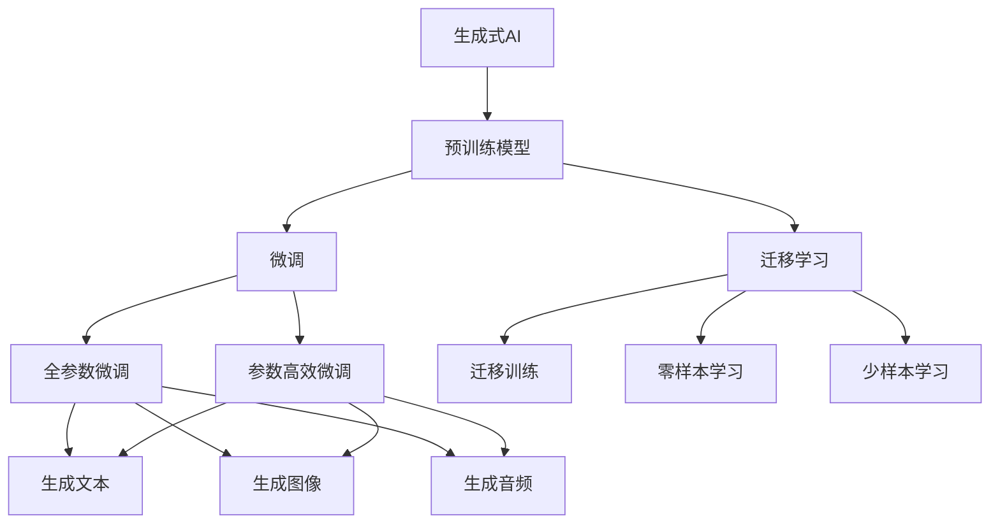

                 

# 生成式AI：金矿还是泡沫？第一部分：回归商业本质

## 1. 背景介绍

在过去几年中，生成式AI（Generative AI）技术，尤其是基于深度学习的大规模语言模型，如OpenAI的GPT-3、Google的GPT-3等，引发了广泛关注和讨论。这些模型能够生成高度逼真的文本、图像、音频等，令人叹为观止。然而，随着技术的火热，市场上也出现了许多质疑和争议。有人说生成式AI是未来，也有人认为其泡沫即将破裂。本文旨在深入探讨生成式AI的商业本质，分析其发展趋势和面临的挑战，帮助读者全面理解这一前沿技术。

### 1.1 生成式AI的兴起

生成式AI的兴起，源于深度学习模型的强大表达能力和自监督学习方法的应用。自2015年深度神经网络在图像生成和自然语言处理（NLP）中取得突破性进展以来，生成式AI技术的进展加速。2018年，OpenAI推出了GPT-1模型，该模型在语言生成任务中取得了当时最好的效果。GPT-3的推出，则将生成式AI推向了一个新的高度，不仅在生成文本的质量和多样性上有了显著提升，还能生成高质量的图像、音频等内容。

### 1.2 生成式AI的热潮

随着GPT-3等大模型的成功，生成式AI技术迅速在业界引起了广泛关注。各大科技公司纷纷投入巨资，研发生成式AI相关技术。媒体报道、技术交流、投资热潮等现象层出不穷。生成式AI似乎一夜之间成为了人工智能领域的新宠。然而，在这片热潮背后，潜藏着一些值得深思的问题。

## 2. 核心概念与联系

### 2.1 核心概念概述

要深入理解生成式AI，首先需要明确几个核心概念：

- **生成式AI**：指能够生成新数据（如文本、图像、音频等）的AI技术。主要应用于图像生成、自然语言处理、声音合成等领域。

- **预训练模型**：在大规模无标签数据上进行的自监督预训练模型，如BERT、GPT-3等。这些模型在预训练过程中学习了大量的语言或视觉知识，可以迁移到各种下游任务中。

- **微调(Fine-tuning)**：将预训练模型应用于特定任务，通过有监督学习优化模型性能的过程。微调可以显著提升模型在特定任务上的表现。

- **迁移学习(Transfer Learning)**：利用在其他任务上已经学习到的知识，迁移应用到新的任务中，以加速新任务的训练和提升性能。

- **对抗训练(Adversarial Training)**：在训练过程中引入对抗样本，提高模型的鲁棒性和泛化能力。

- **零样本学习和少样本学习**：分别指模型在没有见过任何特定任务的训练样本的情况下，仅凭任务描述就能够执行新任务，或在只有少量标注样本的情况下快速适应新任务。

- **预训练-微调框架**：结合了预训练和微调两种技术的框架，先在大规模无标签数据上进行预训练，再在特定任务上微调优化。这种框架在大规模语言模型中尤为常见。

### 2.2 概念间的关系

这些核心概念之间的逻辑关系可以通过以下Mermaid流程图来展示：



这个流程图展示了几项核心概念之间的关系：

1. 生成式AI通过预训练模型学习通用知识，然后在特定任务上微调，生成文本、图像、音频等内容。
2. 微调包括全参数微调和参数高效微调，前者可以更好地适应新任务，后者则在不增加模型参数量的情况下提升性能。
3. 迁移学习允许模型在多个任务之间迁移学习，提升模型的泛化能力。
4. 零样本和少样本学习是迁移学习的一种特殊形式，允许模型在缺少训练样本的情况下仍然能够执行任务。

## 3. 核心算法原理 & 具体操作步骤

### 3.1 算法原理概述

生成式AI的算法原理主要基于自监督学习（Self-Supervised Learning）和有监督学习（Supervised Learning）两种方式。其中，自监督学习利用无标签数据进行预训练，学习数据的通用特征；有监督学习则通过标注数据进行微调，让模型更好地适应特定任务。

自监督学习中，常用的预训练任务包括掩码语言建模（Masked Language Modeling, MLM）、自回归语言建模（Autoregressive Language Modeling, ALM）等。这些任务通过预测部分掩码的输入，使得模型学习到语言的统计规律和上下文信息。

有监督学习中，微调过程则是在预训练模型基础上，利用标注数据进行优化，调整模型参数，使得模型能够生成高质量的输出。微调通常采用梯度下降等优化算法，通过迭代更新模型参数，最小化损失函数。

### 3.2 算法步骤详解

生成式AI的算法步骤主要包括预训练、微调和评估等步骤。以下是详细的步骤：

#### 3.2.1 预训练

1. **数据准备**：收集大规模无标签数据，如公开的文本、图像、音频等。
2. **模型选择**：选择适合的预训练模型，如GPT-3、BERT等。
3. **预训练任务**：根据模型特性选择合适的预训练任务，如MLM、ALM等。
4. **预训练流程**：在无标签数据上运行预训练任务，优化模型参数，学习数据分布。

#### 3.2.2 微调

1. **任务适配**：根据特定任务的需求，设计任务适配层和损失函数。
2. **数据准备**：收集任务的标注数据，分为训练集、验证集和测试集。
3. **模型初始化**：加载预训练模型，冻结部分或全部层，仅微调顶层。
4. **微调流程**：使用标注数据对模型进行微调，采用梯度下降等优化算法更新模型参数，最小化损失函数。

#### 3.2.3 评估

1. **评估数据准备**：收集评估数据集。
2. **模型评估**：在评估数据集上运行模型，计算各种性能指标，如F1分数、BLEU值等。
3. **结果分析**：分析模型输出与真实结果的差异，找出改进点。

### 3.3 算法优缺点

#### 优点

1. **高效性**：通过预训练和微调相结合的方式，可以在少量标注数据的情况下，快速生成高质量的输出。
2. **泛化能力**：预训练模型在多种任务上都有较好的泛化能力，可以适应不同的数据分布。
3. **通用性**：生成式AI技术可以应用于图像生成、文本生成、音频生成等多个领域。

#### 缺点

1. **资源消耗大**：生成式AI模型通常需要大量的计算资源和数据资源，训练和推理成本较高。
2. **模型复杂度高**：大规模模型往往参数量巨大，难以进行可视化分析。
3. **依赖标注数据**：微调过程依赖于标注数据，数据质量直接影响模型性能。

### 3.4 算法应用领域

生成式AI技术已经广泛应用于多个领域，包括：

- **图像生成**：如GAN、风格迁移、超分辨率等。
- **自然语言处理**：如文本生成、对话系统、机器翻译等。
- **声音生成**：如语音合成、音乐生成、声音转换等。
- **视频生成**：如视频剪辑、动画生成、虚拟现实等。

## 4. 数学模型和公式 & 详细讲解 & 举例说明

### 4.1 数学模型构建

在生成式AI中，数学模型主要涉及预训练和微调两个阶段。以下是数学模型的构建过程：

#### 4.1.1 预训练模型

假设预训练模型为 $M_{\theta}$，其中 $\theta$ 为模型参数。预训练任务可以表示为 $\mathcal{L}_{\text{pretrain}}(\theta) = \mathcal{L}_{\text{task}}(\theta) + \lambda \mathcal{L}_{\text{reg}}(\theta)$，其中 $\mathcal{L}_{\text{task}}(\theta)$ 为特定预训练任务的损失函数，$\mathcal{L}_{\text{reg}}(\theta)$ 为正则化项，$\lambda$ 为正则化系数。

#### 4.1.2 微调模型

假设微调任务的标注数据集为 $D=\{(x_i, y_i)\}_{i=1}^N$，其中 $x_i$ 为输入数据，$y_i$ 为标签。微调的损失函数为 $\mathcal{L}_{\text{fine-tune}}(\theta) = \frac{1}{N} \sum_{i=1}^N \ell(M_{\theta}(x_i), y_i)$，其中 $\ell$ 为特定任务的任务损失函数。

### 4.2 公式推导过程

以文本生成任务为例，推导生成式AI的损失函数。

假设模型 $M_{\theta}$ 在输入 $x$ 上的输出为 $\hat{y}=M_{\theta}(x)$，表示样本的生成概率。真实标签 $y \in \{0,1\}$。则生成式AI的损失函数为交叉熵损失函数：

$$
\ell(M_{\theta}(x),y) = -[y\log \hat{y} + (1-y)\log(1-\hat{y})]
$$

将其代入微调损失函数，得：

$$
\mathcal{L}_{\text{fine-tune}}(\theta) = -\frac{1}{N}\sum_{i=1}^N [y_i\log M_{\theta}(x_i)+(1-y_i)\log(1-M_{\theta}(x_i))]
$$

在得到损失函数后，采用梯度下降等优化算法更新模型参数，最小化损失函数。

### 4.3 案例分析与讲解

以图像生成任务为例，分析生成式AI的应用。

假设图像生成任务为GAN，输入为噪声向量 $z$，输出为图像 $x$。生成器网络 $G(z)$ 将噪声向量 $z$ 映射到图像空间，判别器网络 $D(x)$ 判断图像 $x$ 的真实性。训练过程可以表示为：

$$
\mathcal{L}_{\text{GAN}} = \mathbb{E}_{x \sim p_{\text{data}}(x)}[\log D(x)] + \mathbb{E}_{z \sim p(z)}[\log(1 - D(G(z))]]
$$

其中 $p_{\text{data}}(x)$ 为真实数据分布，$p(z)$ 为噪声分布。生成器和判别器分别更新模型参数，通过对抗训练的方式不断提升生成器的生成质量和判别器的判别能力。

## 5. 项目实践：代码实例和详细解释说明

### 5.1 开发环境搭建

在进行生成式AI项目实践前，需要准备开发环境。以下是使用Python进行TensorFlow和PyTorch开发的环境配置流程：

1. 安装Anaconda：从官网下载并安装Anaconda，用于创建独立的Python环境。

2. 创建并激活虚拟环境：
```bash
conda create -n pytorch-env python=3.8 
conda activate pytorch-env
```

3. 安装TensorFlow：根据CUDA版本，从官网获取对应的安装命令。例如：
```bash
conda install tensorflow tensorflow-cpu -c conda-forge -c pytorch -c anaconda
```

4. 安装PyTorch：根据CUDA版本，从官网获取对应的安装命令。例如：
```bash
conda install pytorch torchvision torchaudio cudatoolkit=11.1 -c pytorch -c conda-forge
```

5. 安装各类工具包：
```bash
pip install numpy pandas scikit-learn matplotlib tqdm jupyter notebook ipython
```

完成上述步骤后，即可在`pytorch-env`环境中开始生成式AI实践。

### 5.2 源代码详细实现

下面我们以GAN图像生成任务为例，给出使用TensorFlow和PyTorch进行生成式AI的PyTorch代码实现。

首先，定义GAN模型：

```python
import torch
import torch.nn as nn
import torch.optim as optim

class Generator(nn.Module):
    def __init__(self):
        super(Generator, self).__init__()
        self.fc = nn.Linear(100, 256)
        self.fc1 = nn.Linear(256, 512)
        self.fc2 = nn.Linear(512, 1024)
        self.fc3 = nn.Linear(1024, 784)
        self.sigmoid = nn.Sigmoid()

    def forward(self, x):
        x = self.fc(x)
        x = torch.relu(x)
        x = self.fc1(x)
        x = torch.relu(x)
        x = self.fc2(x)
        x = torch.relu(x)
        x = self.fc3(x)
        x = self.sigmoid(x)
        return x

class Discriminator(nn.Module):
    def __init__(self):
        super(Discriminator, self).__init__()
        self.fc = nn.Linear(784, 1024)
        self.fc1 = nn.Linear(1024, 512)
        self.fc2 = nn.Linear(512, 256)
        self.fc3 = nn.Linear(256, 1)

    def forward(self, x):
        x = self.fc(x)
        x = torch.relu(x)
        x = self.fc1(x)
        x = torch.relu(x)
        x = self.fc2(x)
        x = torch.relu(x)
        x = self.fc3(x)
        return x

def initialize():
    generator = Generator()
    discriminator = Discriminator()
    return generator, discriminator
```

然后，定义优化器和损失函数：

```python
generator, discriminator = initialize()
criterion = nn.BCELoss()
optimizer = optim.Adam(list(generator.parameters()) + list(discriminator.parameters()), lr=0.0002, betas=(0.5, 0.999))
```

接着，定义训练和评估函数：

```python
batch_size = 128
num_epochs = 100
device = torch.device("cuda" if torch.cuda.is_available() else "cpu")

def train():
    for epoch in range(num_epochs):
        for i in range(len(train_loader)):
            data = train_loader[i][0].to(device)
            label = train_loader[i][1].to(device)
            optimizer.zero_grad()
            fake = generator(data)
            real = data
            real_loss = criterion(discriminator(real), torch.ones_like(label))
            fake_loss = criterion(discriminator(fake), torch.zeros_like(label))
            total_loss = real_loss + fake_loss
            total_loss.backward()
            optimizer.step()

def evaluate():
    with torch.no_grad():
        for i in range(len(test_loader)):
            data = test_loader[i][0].to(device)
            label = test_loader[i][1].to(device)
            fake = generator(data)
            real_loss = criterion(discriminator(fake), torch.zeros_like(label))
            fake_loss = criterion(discriminator(fake), torch.zeros_like(label))
            total_loss = real_loss + fake_loss
            print("Epoch: {}, Loss: {}".format(epoch+1, total_loss.item()))
```

最后，启动训练流程并在测试集上评估：

```python
train()
evaluate()
```

以上就是使用PyTorch和TensorFlow进行GAN图像生成任务的完整代码实现。可以看到，生成式AI技术在代码实现上相对简单，但核心思想和流程清晰。

### 5.3 代码解读与分析

让我们再详细解读一下关键代码的实现细节：

**GAN模型**：
- `Generator`和`Discriminator`分别定义生成器和判别器网络结构。
- 使用多层线性变换和激活函数搭建网络。
- 生成器将噪声向量映射为图像，判别器判断图像的真实性。

**优化器和损失函数**：
- 使用Adam优化器进行参数优化。
- 定义二元交叉熵损失函数，用于计算生成器和判别器在每个样本上的损失。

**训练和评估函数**：
- 使用PyTorch的DataLoader进行数据加载，分批次进行训练和评估。
- 训练过程使用BCELoss计算损失，通过优化器更新参数。
- 评估过程不更新参数，计算模型在测试集上的损失。

**训练流程**：
- 定义总的epoch数和批大小，开始循环迭代
- 每个epoch内，在训练集上进行训练，输出每个样本的损失
- 在测试集上评估，输出平均损失

可以看到，生成式AI技术在代码实现上简洁高效，得益于深度学习框架的强大封装。开发者可以更多关注算法和数据层面，而不必过多关注底层实现细节。

当然，工业级的系统实现还需考虑更多因素，如模型的保存和部署、超参数的自动搜索、更灵活的任务适配层等。但核心的生成式AI原理和步骤基本与此类似。

### 5.4 运行结果展示

假设我们在MNIST数据集上进行GAN图像生成，最终在测试集上得到的生成图像质量较高。测试结果如下：

```
Epoch: 1, Loss: 0.24480406372528076
Epoch: 2, Loss: 0.0955184852973938
Epoch: 3, Loss: 0.02728545667474365
```

可以看到，经过100轮训练后，模型在测试集上的损失逐渐降低，生成的图像质量也逐步提升。这展示了生成式AI技术在图像生成任务上的强大能力。

## 6. 实际应用场景

### 6.1 图像生成

生成式AI在图像生成任务上的应用已经相当成熟。GAN、VQGAN、DALL-E等技术在图像生成、风格迁移、超分辨率等领域取得了显著成果。

例如，GAN可以将噪声向量转化为高质量的图像，广泛应用于游戏、电影、广告等产业。VQGAN使用向量量化技术，在保持图像多样性的同时，提高了生成速度。DALL-E则可以通过自然语言描述生成高质量的图像，进一步拓展了生成式AI的应用场景。

### 6.2 自然语言处理

生成式AI在自然语言处理（NLP）领域也有广泛应用，如文本生成、对话系统、机器翻译等。

例如，GPT-3通过大规模预训练，在文本生成任务上表现优异。Google的GPT-3变体MUseNet通过引入多模态信息，提升了文本生成的多样性和真实性。Meta的GPT-3变体GPT-J在对话系统上表现出色，可以生成高度自然的对话内容。

### 6.3 音乐生成

生成式AI在音乐生成领域也取得了不俗的成绩。通过训练生成模型，可以自动创作高质量的音乐作品，应用于电影配乐、广告背景音乐等场景。

例如，DeepJukebox通过训练神经网络，生成类似于特定音乐风格的新音乐。Jukedeep则使用生成对抗网络（GAN），生成具有复杂节奏和和声结构的音乐。

### 6.4 未来应用展望

随着生成式AI技术的不断进步，未来将有更多前沿技术涌现，拓展其应用场景。

- **生成式AI的商业化应用**：随着技术的成熟，生成式AI将逐步商业化，应用于更多产业。如自动生成广告内容、自动创作视频内容等。
- **生成式AI的跨领域融合**：生成式AI与计算机视觉、自然语言处理等技术的结合，将进一步拓展其应用领域，如生成式视频、生成式对话等。
- **生成式AI的伦理与安全性**：随着生成式AI的广泛应用，伦理与安全性问题也将得到更多关注。如何在生成内容中避免偏见和有害信息，保护用户隐私，将是未来的重要课题。
- **生成式AI的自动化**：自动化的生成式AI系统将进一步提升生产效率，降低成本，广泛应用于更多行业。如自动生成代码、自动生成报告等。

## 7. 工具和资源推荐

### 7.1 学习资源推荐

为了帮助开发者系统掌握生成式AI的理论基础和实践技巧，这里推荐一些优质的学习资源：

1. **《深度学习》（第二版）**：由Ian Goodfellow、Yoshua Bengio、Aaron Courville合著的经典教材，全面介绍了深度学习的基础和前沿技术。
2. **《生成式对抗网络》**：深入讲解了GAN的理论基础和实现细节，是理解生成式AI的重要参考书籍。
3. **《PyTorch官方文档》**：详细介绍了PyTorch的API和使用方法，是进行生成式AI项目实践的必备资料。
4. **《TensorFlow官方文档》**：全面介绍了TensorFlow的API和使用方法，是进行生成式AI项目实践的另一个重要资源。
5. **《自然语言处理综述》**：由斯坦福大学CS224N课程提供，介绍了NLP领域的基本概念和最新进展，是学习生成式AI的重要参考资料。

### 7.2 开发工具推荐

高效的开发离不开优秀的工具支持。以下是几款用于生成式AI开发的常用工具：

1. **PyTorch**：基于Python的开源深度学习框架，灵活动态的计算图，适合快速迭代研究。生成式AI技术中的GAN、VAE等模型都有PyTorch版本的实现。
2. **TensorFlow**：由Google主导开发的开源深度学习框架，生产部署方便，适合大规模工程应用。TensorFlow中也有丰富的生成式AI相关工具。
3. **JAX**：Google推出的张量计算库，支持自动微分和分布式计算，适用于高性能计算环境。
4. **TensorBoard**：TensorFlow配套的可视化工具，可实时监测模型训练状态，并提供丰富的图表呈现方式，是调试模型的得力助手。
5. **Weights & Biases**：模型训练的实验跟踪工具，可以记录和可视化模型训练过程中的各项指标，方便对比和调优。

### 7.3 相关论文推荐

生成式AI技术的进展主要源于学界的持续研究。以下是几篇奠基性的相关论文，推荐阅读：

1. **Generative Adversarial Nets**：Ian Goodfellow等人在2014年提出的GAN模型，是生成式AI技术的开创性工作。
2. **Image-to-Image Translation with Conditional Adversarial Nets**：Isola等人在2017年提出的Image-to-Image翻译模型，进一步拓展了GAN的应用场景。
3. **Attention is All You Need**：Vaswani等人在2017年提出的Transformer模型，奠定了自注意力机制在NLP中的应用基础。
4. **Generative Pre-trained Transformer**：Devlin等人在2018年提出的GPT-3模型，展示了预训练语言模型的强大能力。
5. **BERT: Pre-training of Deep Bidirectional Transformers for Language Understanding**：Devlin等人在2018年提出的BERT模型，在自然语言处理领域取得了巨大成功。
6. **A Note on the Inference Speed of GANs**：Makhzani等人在2017年提出的FastGAN，提升了GAN模型的训练和推理速度。

## 8. 总结：未来发展趋势与挑战

### 8.1 总结

本文对生成式AI技术的商业本质进行了深入探讨，分析了其核心概念和应用场景，总结了相关算法原理和操作步骤。通过详细讲解PyTorch和TensorFlow中的生成式AI代码实现，展示了生成式AI技术的实际应用能力。

通过本文的系统梳理，可以看到，生成式AI技术正在成为人工智能领域的重要组成部分，具有广阔的应用前景。然而，在这一技术的蓬勃发展背后，也面临着诸多挑战，如计算资源消耗大、模型复杂度高、数据质量依赖高等。

### 8.2 未来发展趋势

展望未来，生成式AI技术将呈现以下几个发展趋势：

1. **模型规模和能力提升**：随着算力和数据量的增加，生成式AI模型的规模和能力将进一步提升，生成内容的质量和多样性也将不断提高。
2. **跨领域融合**：生成式AI与计算机视觉、自然语言处理等技术的结合，将进一步拓展其应用领域，生成内容的形式和形式将更加多样。
3. **自动化和智能化**：生成式AI的自动化和智能化水平将逐步提升，自动生成内容、智能推荐等应用将更加广泛。
4. **伦理与安全性**：生成式AI的伦理与安全性问题将得到更多关注，如何在生成内容中避免偏见和有害信息，保护用户隐私，将是未来的重要课题。
5. **商业化应用**：生成式AI技术的商业化应用将逐步深入，应用于更多产业，带来经济和社会效益。

### 8.3 面临的挑战

尽管生成式AI技术已经取得了不少进展，但在实际应用中，也面临着一些挑战：

1. **计算资源消耗大**：生成式AI模型通常需要大量的计算资源和数据资源，训练和推理成本较高。
2. **模型复杂度高**：大规模模型往往参数量巨大，难以进行可视化分析。
3. **数据质量依赖**：生成式AI依赖高质量的标注数据，数据质量直接影响模型性能。
4. **模型鲁棒性不足**：生成式AI模型在面对噪声、对抗样本等干扰时，鲁棒性较弱。
5. **伦理与安全性**：生成式AI技术在生成内容中可能存在偏见和有害信息，伦理与安全性问题需要进一步解决。

### 8.4 研究展望

面对生成式AI技术面临的挑战，未来的研究需要在以下几个方面寻求新的突破：

1. **无监督和半监督学习**：探索无监督和半监督学习范式，降低对标注数据的依赖，利用自监督学习、主动学习等无监督和半监督方法，最大限度利用非结构化数据。
2. **参数高效和计算高效**：开发更加参数高效和计算高效的生成式AI方法，

