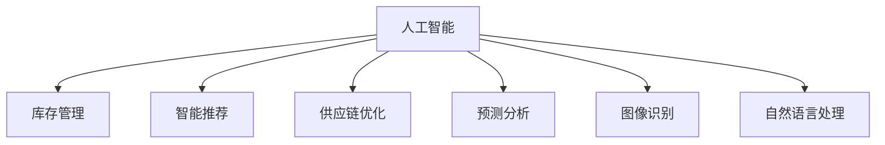
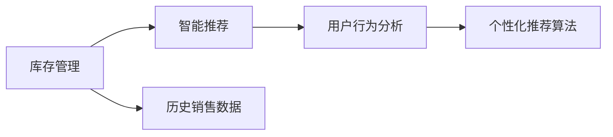
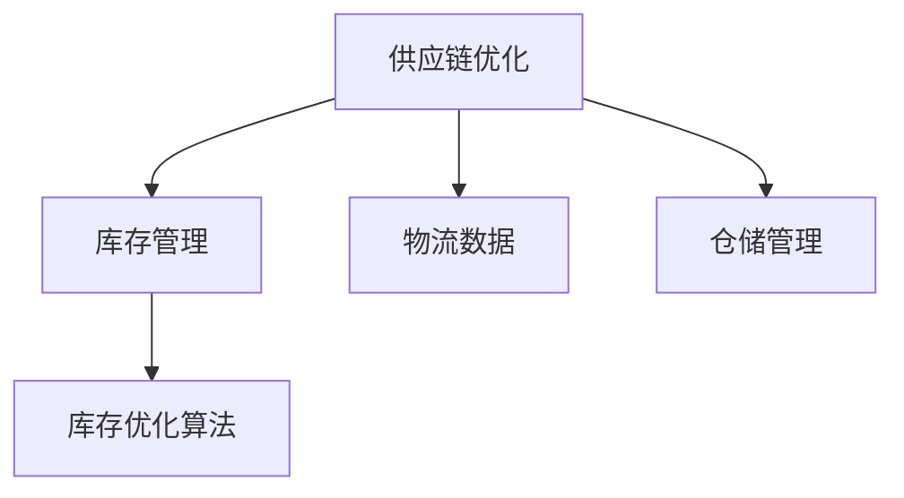
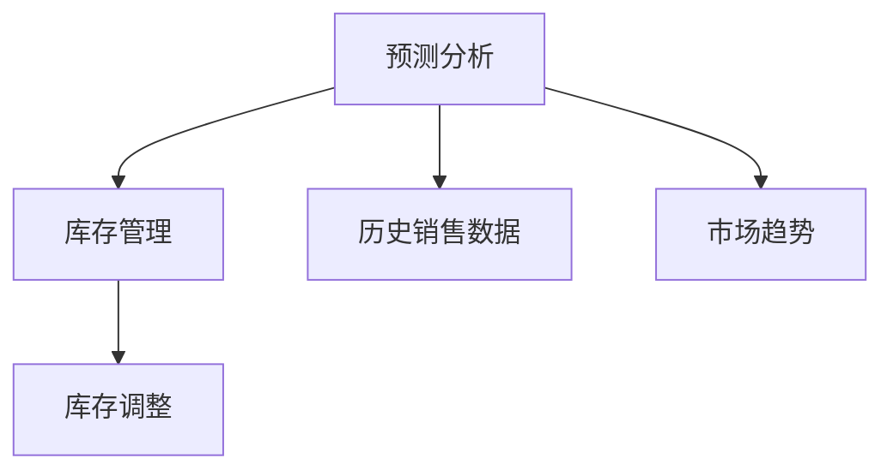
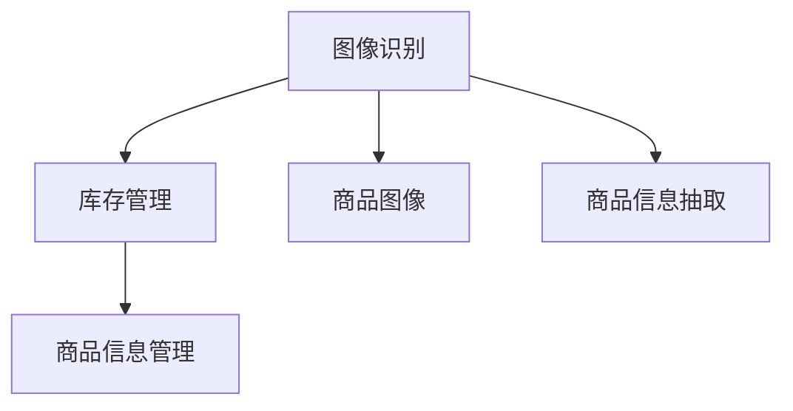
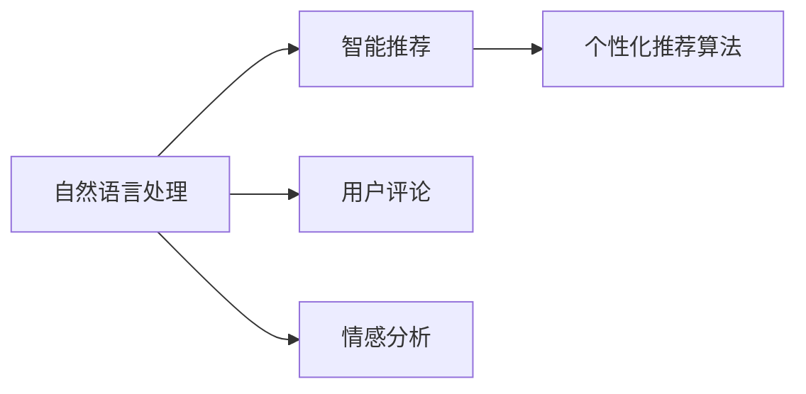
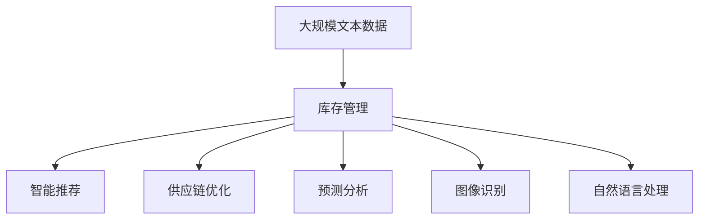

                 

# 电商平台供给能力提升：人工智能技术的应用

> 关键词：人工智能,电商平台,供给能力提升,智能推荐,库存管理,供应链优化,预测分析,图像识别,自然语言处理

## 1. 背景介绍

### 1.1 问题由来
随着互联网技术的快速发展，电商平台已成为零售行业的重要组成部分。电商平台通过整合线上线下资源，极大地拓展了零售市场的广度和深度，满足了消费者多样化的购物需求。然而，面对激烈的市场竞争，电商平台需要不断提升自身的供给能力，才能在激烈的市场竞争中脱颖而出。

近年来，人工智能技术的快速发展，为电商平台的供给能力提升提供了全新的思路和方法。通过人工智能技术，电商平台可以更精准地预测市场需求、优化库存管理、提升客户体验，从而实现供给能力的全面提升。

### 1.2 问题核心关键点
电商平台的供给能力提升，主要体现在以下几个方面：

1. **库存管理**：通过精确的库存预测和优化，避免库存积压或短缺，确保产品及时补充。
2. **智能推荐**：通过分析用户行为和偏好，提供个性化推荐，提升用户购物体验和转化率。
3. **供应链优化**：通过优化物流和供应链管理，提高物流效率，降低物流成本。
4. **预测分析**：通过分析历史数据和市场趋势，预测未来的销售趋势和需求变化。
5. **图像识别**：通过图像识别技术，自动识别和处理商品信息，提升商品管理和搜索效率。
6. **自然语言处理**：通过自然语言处理技术，分析用户评论和反馈，提升用户满意度和品牌信誉。

这些核心点涵盖了电商平台的供应链、销售、运营和用户管理等多个环节，是电商平台提升供给能力的关键。通过人工智能技术的运用，可以大幅提升各环节的效率和准确性，从而全面提升电商平台的供给能力。

### 1.3 问题研究意义
电商平台供给能力提升，对于促进零售行业的发展、提升用户购物体验、降低运营成本、增强市场竞争力具有重要意义：

1. **提升用户体验**：通过个性化推荐和智能搜索，用户可以更快速、更精准地找到所需商品，提升购物体验。
2. **降低运营成本**：通过优化库存管理和供应链，减少库存积压和物流成本，提高运营效率。
3. **增强市场竞争力**：通过精确的市场预测和需求分析，及时调整供给策略，抢占市场先机。
4. **促进零售行业发展**：通过技术创新，推动零售行业数字化、智能化转型，为行业带来新的增长点。

## 2. 核心概念与联系

### 2.1 核心概念概述

为更好地理解人工智能技术在电商平台供给能力提升中的应用，本节将介绍几个密切相关的核心概念：

- **人工智能**：通过模拟人脑的思维方式和决策过程，使计算机能够自主完成复杂任务的科学技术。
- **库存管理**：通过精确的库存预测和优化，确保商品供需平衡，避免库存积压或短缺。
- **智能推荐**：利用用户行为和偏好分析，提供个性化推荐，提升用户体验和转化率。
- **供应链优化**：通过优化物流和供应链管理，提高物流效率，降低物流成本。
- **预测分析**：通过分析历史数据和市场趋势，预测未来的销售趋势和需求变化。
- **图像识别**：利用计算机视觉技术，自动识别和处理商品信息，提升商品管理和搜索效率。
- **自然语言处理**：利用自然语言处理技术，分析用户评论和反馈，提升用户满意度和品牌信誉。

这些核心概念之间的逻辑关系可以通过以下Mermaid流程图来展示：



这个流程图展示了几大核心概念之间的关系：

1. 人工智能技术在库存管理、智能推荐、供应链优化、预测分析、图像识别和自然语言处理等多个环节中都有应用。
2. 这些环节共同构成电商平台的供给能力提升框架，通过人工智能技术的综合应用，实现全面提升。

### 2.2 概念间的关系

这些核心概念之间存在着紧密的联系，形成了电商平台供给能力提升的完整生态系统。下面我通过几个Mermaid流程图来展示这些概念之间的关系。

#### 2.2.1 人工智能技术的应用


这个流程图展示了人工智能技术在电商平台供给能力提升中的应用，具体表现为库存管理、智能推荐、供应链优化、预测分析、图像识别和自然语言处理等多个方面。

#### 2.2.2 库存管理与智能推荐的关系



这个流程图展示了库存管理和智能推荐之间的关系。库存管理通过历史销售数据和用户行为分析，可以更好地预测未来的需求变化，进而为智能推荐提供更精准的商品推荐。

#### 2.2.3 供应链优化与库存管理的关系



这个流程图展示了供应链优化与库存管理之间的关系。供应链优化通过物流数据和仓储管理，可以优化库存水平和库存结构，提升库存管理的效率。

#### 2.2.4 预测分析与库存管理的关系



这个流程图展示了预测分析与库存管理之间的关系。预测分析通过历史销售数据和市场趋势，可以预测未来的销售趋势，进而调整库存水平，确保供需平衡。

#### 2.2.5 图像识别与库存管理的关系



这个流程图展示了图像识别与库存管理之间的关系。图像识别通过商品图像和信息抽取，可以自动更新库存信息，提升商品管理和搜索效率。

#### 2.2.6 自然语言处理与智能推荐的关系



这个流程图展示了自然语言处理与智能推荐之间的关系。自然语言处理通过用户评论和情感分析，可以理解用户偏好，进而提供个性化的商品推荐。

### 2.3 核心概念的整体架构

最后，我们用一个综合的流程图来展示这些核心概念在大数据处理平台中的应用：



这个综合流程图展示了从大数据处理到各大应用环节的完整过程。电商平台首先处理大规模文本数据，从中提取和分析用户行为、商品信息等，然后通过库存管理、智能推荐、供应链优化、预测分析、图像识别和自然语言处理等多个环节，实现供给能力的全面提升。

## 3. 核心算法原理 & 具体操作步骤
### 3.1 算法原理概述

电商平台供给能力提升的核心算法原理主要涉及以下几个方面：

- **数据预处理**：通过数据清洗、归一化等预处理技术，提升数据的质量和可用性。
- **库存预测**：通过时间序列预测等技术，精确预测库存水平和需求变化。
- **智能推荐**：通过协同过滤、基于内容的推荐算法等，提供个性化推荐。
- **供应链优化**：通过优化算法、仿真模型等，优化物流和供应链管理。
- **预测分析**：通过统计分析、机器学习等技术，预测未来的销售趋势和需求变化。
- **图像识别**：通过图像处理、深度学习等技术，自动识别和处理商品信息。
- **自然语言处理**：通过情感分析、实体识别等技术，分析用户评论和反馈。

### 3.2 算法步骤详解

#### 3.2.1 数据预处理
数据预处理是人工智能算法的重要环节，涉及数据清洗、归一化、特征工程等技术，确保数据的质量和可用性。具体步骤如下：

1. **数据清洗**：去除无效数据和异常值，确保数据的完整性和准确性。
2. **归一化**：将数据缩放到同一范围内，便于算法处理。
3. **特征工程**：通过特征选择、特征提取等技术，提取有用的特征，提升算法的准确性。

#### 3.2.2 库存预测
库存预测是电商平台供给能力提升的关键环节，通过精确预测库存水平和需求变化，避免库存积压或短缺。具体步骤如下：

1. **数据收集**：收集历史销售数据、库存数据、市场趋势等数据。
2. **数据预处理**：对数据进行清洗和归一化，确保数据的质量和可用性。
3. **时间序列预测**：利用ARIMA、LSTM等时间序列预测技术，预测未来的库存水平和需求变化。
4. **库存优化**：根据预测结果，调整库存水平，确保供需平衡。

#### 3.2.3 智能推荐
智能推荐是提升用户购物体验的重要手段，通过分析用户行为和偏好，提供个性化推荐。具体步骤如下：

1. **数据收集**：收集用户行为数据、商品数据、历史交易数据等。
2. **数据预处理**：对数据进行清洗和归一化，确保数据的质量和可用性。
3. **推荐算法**：利用协同过滤、基于内容的推荐算法等，生成个性化推荐。
4. **推荐优化**：通过A/B测试等技术，优化推荐算法，提升推荐效果。

#### 3.2.4 供应链优化
供应链优化是提高物流效率、降低物流成本的关键手段，通过优化物流和供应链管理，实现全面提升。具体步骤如下：

1. **数据收集**：收集物流数据、仓储管理数据、市场数据等。
2. **数据预处理**：对数据进行清洗和归一化，确保数据的质量和可用性。
3. **优化算法**：利用优化算法、仿真模型等，优化物流和供应链管理。
4. **效果评估**：通过指标评估技术，评估供应链优化效果，持续改进。

#### 3.2.5 预测分析
预测分析是电商平台决策支持的重要手段，通过分析历史数据和市场趋势，预测未来的销售趋势和需求变化。具体步骤如下：

1. **数据收集**：收集历史销售数据、市场数据、用户行为数据等。
2. **数据预处理**：对数据进行清洗和归一化，确保数据的质量和可用性。
3. **预测模型**：利用回归分析、时间序列预测等技术，预测未来的销售趋势和需求变化。
4. **效果评估**：通过指标评估技术，评估预测模型效果，持续改进。

#### 3.2.6 图像识别
图像识别是电商平台商品管理和搜索的重要手段，通过图像处理、深度学习等技术，自动识别和处理商品信息。具体步骤如下：

1. **数据收集**：收集商品图像、商品描述、商品标签等数据。
2. **数据预处理**：对数据进行清洗和归一化，确保数据的质量和可用性。
3. **图像处理**：利用图像处理技术，提取商品特征。
4. **深度学习模型**：利用深度学习模型，自动识别和处理商品信息。
5. **效果评估**：通过指标评估技术，评估图像识别效果，持续改进。

#### 3.2.7 自然语言处理
自然语言处理是电商平台用户分析和反馈管理的重要手段，通过情感分析、实体识别等技术，分析用户评论和反馈。具体步骤如下：

1. **数据收集**：收集用户评论、用户反馈、用户评分等数据。
2. **数据预处理**：对数据进行清洗和归一化，确保数据的质量和可用性。
3. **自然语言处理**：利用情感分析、实体识别等技术，分析用户评论和反馈。
4. **效果评估**：通过指标评估技术，评估自然语言处理效果，持续改进。

### 3.3 算法优缺点

人工智能技术在电商平台供给能力提升中的应用具有以下优点：

1. **提升用户体验**：通过个性化推荐和智能搜索，用户可以更快速、更精准地找到所需商品，提升购物体验。
2. **降低运营成本**：通过优化库存管理和供应链，减少库存积压和物流成本，提高运营效率。
3. **增强市场竞争力**：通过精确的市场预测和需求分析，及时调整供给策略，抢占市场先机。

然而，人工智能技术在电商平台中的应用也存在一些局限性：

1. **数据依赖**：人工智能技术依赖高质量的数据，数据质量不高会导致模型效果不佳。
2. **模型复杂性**：复杂模型需要大量计算资源，对于小型电商平台可能不适用。
3. **数据隐私**：电商平台涉及大量用户隐私数据，数据安全问题不容忽视。
4. **技术门槛**：人工智能技术涉及多方面的知识，对于非技术背景的从业人员，学习难度较大。

尽管存在这些局限性，但人工智能技术在电商平台中的应用前景广阔，能够大幅提升电商平台的供给能力，助力零售行业的发展。

### 3.4 算法应用领域

人工智能技术在电商平台供给能力提升中的应用领域非常广泛，以下是几个典型的应用场景：

1. **智能推荐系统**：通过分析用户行为和偏好，提供个性化推荐，提升用户购物体验和转化率。
2. **库存管理系统**：通过精确的库存预测和优化，确保商品供需平衡，避免库存积压或短缺。
3. **供应链优化系统**：通过优化物流和供应链管理，提高物流效率，降低物流成本。
4. **预测分析系统**：通过分析历史数据和市场趋势，预测未来的销售趋势和需求变化。
5. **图像识别系统**：通过图像识别技术，自动识别和处理商品信息，提升商品管理和搜索效率。
6. **自然语言处理系统**：通过自然语言处理技术，分析用户评论和反馈，提升用户满意度和品牌信誉。

## 4. 数学模型和公式 & 详细讲解 & 举例说明

### 4.1 数学模型构建

电商平台供给能力提升的核心算法原理主要涉及以下几个方面的数学模型：

- **数据预处理**：通过数据清洗、归一化等预处理技术，提升数据的质量和可用性。
- **库存预测**：通过时间序列预测等技术，精确预测库存水平和需求变化。
- **智能推荐**：通过协同过滤、基于内容的推荐算法等，提供个性化推荐。
- **供应链优化**：通过优化算法、仿真模型等，优化物流和供应链管理。
- **预测分析**：通过统计分析、机器学习等技术，预测未来的销售趋势和需求变化。
- **图像识别**：通过图像处理、深度学习等技术，自动识别和处理商品信息。
- **自然语言处理**：通过情感分析、实体识别等技术，分析用户评论和反馈。

### 4.2 公式推导过程

#### 4.2.1 数据预处理
数据预处理主要涉及数据清洗、归一化和特征工程等步骤，以下是具体的公式推导：

1. **数据清洗**：去除无效数据和异常值，确保数据的完整性和准确性。
2. **归一化**：将数据缩放到同一范围内，便于算法处理。
3. **特征工程**：通过特征选择、特征提取等技术，提取有用的特征，提升算法的准确性。

#### 4.2.2 库存预测
库存预测主要涉及时间序列预测等技术，以下是具体的公式推导：

1. **ARIMA模型**：
   $$
   Y_t = c + \sum_{i=1}^p \phi_i Y_{t-i} + \sum_{j=1}^d \theta_j \epsilon_{t-j} + \epsilon_t
   $$
   其中，$Y_t$为第$t$个时间点的库存量，$c$为常数项，$\phi_i$和$\theta_j$为模型参数，$\epsilon_t$为随机误差项。

2. **LSTM模型**：
   $$
   h_t = \sigma(\mathbf{W}_{in} h_{t-1} + \mathbf{W}_{xh} x_t + \mathbf{b}_h)
   $$
   $$
   \tilde{y}_t = \sigma(\mathbf{W}_{hy} h_t + \mathbf{b}_y)
   $$
   $$
   y_t = \tanh(\mathbf{W}_{xh} x_t + \mathbf{b}_x) \odot \tanh(\mathbf{W}_{hy} h_t + \mathbf{b}_y)
   $$
   其中，$h_t$为第$t$个时间点的隐藏状态，$x_t$为第$t$个时间点的输入数据，$y_t$为第$t$个时间点的预测值，$\sigma$为激活函数，$\odot$为点乘运算，$\mathbf{W}_{in}$、$\mathbf{W}_{xh}$、$\mathbf{W}_{hy}$、$\mathbf{W}_{xh}$、$\mathbf{b}_h$、$\mathbf{b}_y$为模型参数。

#### 4.2.3 智能推荐
智能推荐主要涉及协同过滤、基于内容的推荐算法等，以下是具体的公式推导：

1. **协同过滤算法**：
   $$
   \hat{r}_{ui} = \frac{\sum_{j=1}^N r_{uj} \cdot x_{ij}}{\sqrt{\sum_{j=1}^N x_{ij}^2} \cdot \sqrt{\sum_{j=1}^N r_{uj}^2}}
   $$
   其中，$r_{uj}$为用户$u$对商品$j$的评分，$x_{ij}$为商品$j$的特征向量，$N$为商品总数。

2. **基于内容的推荐算法**：
   $$
   \hat{r}_{ui} = \sum_{j=1}^N \alpha_j \cdot x_{uj}
   $$
   其中，$\alpha_j$为商品$j$的权重，$x_{uj}$为商品$j$的特征向量，$N$为商品总数。

#### 4.2.4 供应链优化
供应链优化主要涉及优化算法、仿真模型等，以下是具体的公式推导：

1. **优化算法**：
   $$
   \min_{x} \sum_{i=1}^m c_i x_i + \sum_{i=1}^m \sum_{j=1}^n p_{ij} x_i x_j
   $$
   其中，$c_i$为第$i$个节点的固定成本，$p_{ij}$为第$i$个节点到第$j$个节点的单位成本，$x_i$为第$i$个节点的供应量。

2. **仿真模型**：
   $$
   P = \frac{1}{T} \sum_{t=1}^T \mathbb{I}(A_t \cap B_t)
   $$
   其中，$P$为仿真模型预测的匹配概率，$A_t$为仿真模型生成的数据，$B_t$为实际生成的数据，$T$为仿真模型的运行次数，$\mathbb{I}$为示性函数。

#### 4.2.5 预测分析
预测分析主要涉及回归分析、时间序列预测等技术，以下是具体的公式推导：

1. **线性回归模型**：
   $$
   y = \mathbf{W} x + b
   $$
   其中，$y$为预测值，$x$为自变量，$\mathbf{W}$为权重矩阵，$b$为偏置项。

2. **时间序列预测模型**：
   $$
   Y_t = \mathbf{W} \mathbf{X}_t + b
   $$
   其中，$Y_t$为第$t$个时间点的预测值，$\mathbf{X}_t$为第$t$个时间点的输入数据，$\mathbf{W}$为权重矩阵，$b$为偏置项。

#### 4.2.6 图像识别
图像识别主要涉及图像处理、深度学习等技术，以下是具体的公式推导：

1. **图像处理技术**：
   $$
   I' = \mathbf{W} I + b
   $$
   其中，$I$为原始图像，$I'$为处理后的图像，$\mathbf{W}$为权重矩阵，$b$为偏置项。

2. **深度学习模型**：
   $$
   y = \sigma(\mathbf{W} x + b)
   $$
   其中，$y$为预测值，$x$为输入数据，$\mathbf{W}$为权重矩阵，$b$为偏置项，$\sigma$为激活函数。

#### 4.2.7 自然语言处理
自然语言处理主要涉及情感分析、实体识别等技术，以下是具体的公式推导：

1. **情感分析模型**：
   $$
   y = \sigma(\mathbf{W} x + b)
   $$
   其中，$y$为情感得分，$x$为输入数据，$\mathbf{W}$为权重矩阵，$b$为偏置项，$\sigma$为激活函数。

2. **实体识别模型**：
   $$
   y = \sigma(\mathbf{W} x + b)
   $$
   其中，$y$为实体识别结果，$x$为输入数据，$\mathbf{W}$为权重矩阵，$b$为偏置项，$\sigma$为激活函数。

### 4.3 案例分析与讲解

#### 4.3.1 智能推荐系统
以亚马逊为例，亚马逊通过智能推荐系统大幅提升了用户购物体验和销售额。其推荐算法主要基于协同过滤和基于内容的推荐，通过分析用户行为和商品特征，生成个性化推荐。

亚马逊首先收集用户的历史行为数据，包括浏览、点击、购买等行为，以及商品的特征数据，如价格、类别、描述等。然后对数据进行清洗和归一化，去除无效数据和异常值。

接着，利用协同过滤算法，通过计算用户与商品的相似度，生成个性化推荐。同时，利用基于内容的推荐算法，通过分析商品特征，生成基于内容的推荐。

最后，通过A/B测试等技术，不断优化推荐算法，提升推荐效果。亚马逊的智能推荐系统通过精准的推荐，显著提升了用户满意度，提高了销售额。

#### 4.3.2 库存管理系统
以阿里巴巴为例，阿里巴巴通过库存管理系统优化了库存水平和物流效率。其库存管理系统主要基于时间序列预测和优化算法，通过精确预测库存水平和优化物流管理。

阿里巴巴首先收集历史销售数据、库存数据、市场趋势等数据，对数据进行清洗和归一化。然后利用ARIMA模型进行时间序列预测，预测未来的库存水平。

接着，利用优化算法，通过计算不同物流方案的成本和效益，优化物流管理。同时，利用仿真模型，模拟不同的物流方案，评估效果。

最后，通过指标评估技术，评估库存管理系统的效果，持续改进。阿里巴巴的库存管理系统通过精确的库存预测和优化，显著提高了物流效率，降低了运营成本。

#### 4.3.3 供应链优化系统
以京东为例，京东通过供应链优化系统优化了物流和供应链管理，大幅提升了物流效率和客户满意度。其供应链优化系统主要基于优化算法和仿真模型，通过优化物流和供应链管理。

京东首先收集物流数据、仓储管理数据、市场数据等，对数据进行清洗和归一化。然后利用优化算法，通过计算不同物流方案的成本和效益，优化物流管理。

接着，利用仿真模型，模拟不同的物流方案，评估效果。同时，利用大数据分析技术，预测未来的物流需求。

最后，通过指标评估技术，评估供应链优化系统的效果，持续改进。京东的供应链优化系统通过优化物流和供应链管理，显著提高了物流效率，降低了运营成本。

## 5. 项目实践：代码实例和详细解释说明

### 5.1 开发环境搭建

在进行电商平台供给能力提升的项目实践前，我们需要准备好开发环境。以下是使用Python进行PyTorch开发的环境配置流程：

1. 安装Anaconda：从官网下载并安装Anaconda，用于创建独立的Python环境。

2. 创建并激活虚拟环境：
```bash
conda create -n pytorch-env python=3.8 
conda activate pytorch-env
```

3. 安装PyTorch：根据CUDA版本，从官网获取对应的安装命令。例如：
```bash
conda install pytorch torchvision torchaudio cudatoolkit=11.1 -c pytorch -c conda-forge
```

4. 安装其他依赖包：
```bash
pip install numpy pandas scikit-learn matplotlib tqdm jupyter notebook ipython
```

完成上述步骤后，即可在`pytorch-env`环境中开始项目实践。

### 5.2 源代码详细实现

这里我们以智能推荐系统为例，给出使用PyTorch进行推荐算法开发的PyTorch代码实现。

首先，定义推荐算法的数据处理函数：

```python
from torch.utils.data import Dataset
import torch

class RecommendationDataset(Dataset):
    def __init__(self, user_ids, item_ids, ratings, num_factors, embedding_dim):
        self.user_ids = user_ids
        self.item_ids = item_ids
        self.ratings = ratings
        self.num_factors = num

