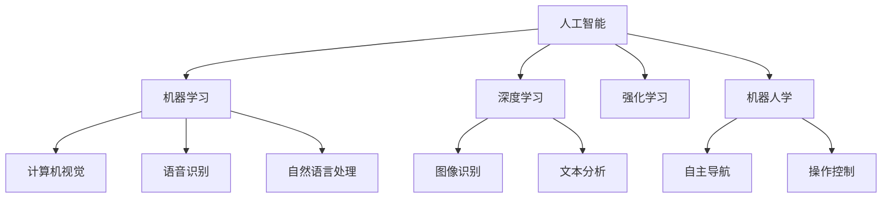

                 

## 1. 背景介绍

### 1.1 问题由来
电影《我，机器人》（I, Robot）是一部由Alex Proyas执导，讲述未来世界中人类与高度智能化机器人共存的故事。影片中，高度智能化机器人能够自主思考和行动，在各个领域内执行复杂任务，展现了AI技术的强大潜力。虽然影片中机器人具有高度自主性，但依然受制于人类设定的规则和限制，这反映出AI技术在实际应用中仍面临的诸多挑战和伦理困境。

### 1.2 问题核心关键点
《我，机器人》以高度智能化机器人为主角，探讨了AI技术在现实世界中的应用场景和伦理问题。影片中，机器人按照人类设定的三大基本法则进行行动，但随着情节发展，这些规则不断受到挑战，最终引发了伦理上的争议。以下是核心关键点：
- **第一法则**：机器人不得伤害人类，也不得看到人类受到伤害而袖手不管。
- **第二法则**：机器人必须服从人类的命令，当命令与第一法则冲突时，优先执行第一法则。
- **第三法则**：机器人不得伤害自身，当自身安全受到威胁时，可违反第一法则和第二法则。

### 1.3 问题研究意义
研究《我，机器人》中的AI技术，有助于深入理解现代AI技术的发展现状和潜在风险。AI技术在各个领域的广泛应用，不仅带来了效率和创新，也引发了伦理、法律和社会责任等诸多问题。通过对影片中AI技术的分析，可以借鉴其成功经验，避免潜在问题，推动AI技术在人类社会中健康发展。

## 2. 核心概念与联系

### 2.1 核心概念概述
为了深入探讨电影《我，机器人》中的AI技术，本节将介绍几个核心概念：

- **人工智能（Artificial Intelligence, AI）**：指使计算机能够模拟人类的智能行为和决策能力的计算机科学领域。包括感知、学习、推理、自我修正等智能过程。
- **机器学习（Machine Learning, ML）**：指使计算机通过数据和算法自主学习，改进自身性能和决策能力的一种技术。
- **深度学习（Deep Learning, DL）**：指通过多层神经网络模拟人脑处理复杂信息的过程，广泛应用于计算机视觉、语音识别、自然语言处理等领域。
- **强化学习（Reinforcement Learning, RL）**：指通过奖励和惩罚机制，使计算机自主学习最优决策策略的一种技术。
- **机器人学（Robotics）**：研究如何设计和控制机器人在不同环境下的行为和决策的学科。
- **伦理和法律问题**：AI技术的应用引发了诸多伦理和法律问题，包括隐私保护、责任归属、社会公平等。

### 2.2 概念间的关系
这些核心概念之间存在着紧密的联系，形成了现代AI技术的基础框架。以下通过一个Mermaid流程图展示这些概念之间的关系：



这个流程图展示了大规模人工智能技术的应用领域和关键技术。其中，机器学习、深度学习和强化学习构成了AI技术的核心框架，而计算机视觉、语音识别和自然语言处理等具体应用，则体现了AI技术在现实世界中的广泛影响。机器人学则进一步拓展了AI技术的应用场景，涉及自主导航和操作控制等实际问题。

## 3. 核心算法原理 & 具体操作步骤

### 3.1 算法原理概述
在《我，机器人》中，机器人按照三大基本法则进行行动，这与AI技术的核心算法原理密切相关。AI技术的核心算法原理包括以下几个方面：

- **感知**：通过传感器和视觉系统，机器人和AI系统感知周围环境，获取输入数据。
- **学习和决策**：通过机器学习算法，AI系统从大量数据中学习规律和模式，并根据学习结果进行决策。
- **自主行动**：根据决策结果，机器人执行自主行动，完成预定任务。

AI技术的核心算法原理是通过感知、学习和行动等步骤，实现自主决策和执行能力。在影片中，机器人按照三大基本法则行动，这与AI系统的决策机制相似，基于输入数据和预设规则进行判断和行动。

### 3.2 算法步骤详解
以下详细介绍AI技术在感知、学习和决策三个步骤中的具体算法步骤。

#### 3.2.1 感知
感知是AI系统的第一步，通常通过传感器和视觉系统获取环境信息。例如，计算机视觉系统可以通过摄像头捕捉图像，然后通过图像处理算法提取特征，最终得到环境数据。在《我，机器人》中，机器人通过摄像头感知周围环境，获取视频数据，并使用图像处理算法提取关键信息。

#### 3.2.2 学习
学习是AI系统的核心，通过机器学习算法从大量数据中学习规律和模式。例如，深度学习算法通过多层神经网络模拟人脑处理复杂信息的过程，从大量数据中提取特征，建立模型，并根据模型预测未来行为。在《我，机器人》中，机器人通过深度学习算法学习人类的语言和行为模式，从而理解人类的意图和需求。

#### 3.2.3 决策
决策是AI系统的最终目标，根据学习结果进行决策并执行行动。例如，强化学习算法通过奖励和惩罚机制，训练模型最优决策策略。在《我，机器人》中，机器人根据三大基本法则进行决策，执行行动，确保人类安全和社会稳定。

### 3.3 算法优缺点
AI技术在感知、学习和决策三个步骤中具有以下优缺点：

#### 优点
- **高效性**：通过机器学习算法，AI系统能够在短时间内从大量数据中学习规律和模式，完成复杂任务。
- **自主性**：AI系统能够自主感知环境，进行学习和决策，减少人类干预。
- **广泛应用**：AI技术在计算机视觉、语音识别、自然语言处理等领域都有广泛应用，推动了多个行业的发展。

#### 缺点
- **数据依赖**：AI系统的性能很大程度上取决于输入数据的质量和数量，数据不足可能影响模型效果。
- **复杂性**：AI系统的算法复杂度较高，需要大量计算资源和专业知识。
- **安全性**：AI系统在复杂环境中可能出现错误判断，导致安全事故。

### 3.4 算法应用领域
AI技术在各个领域都有广泛应用，以下是几个主要应用领域：

- **计算机视觉**：通过图像处理和识别技术，广泛应用于医疗影像分析、自动驾驶、安防监控等领域。
- **自然语言处理**：通过文本分析、语音识别和生成技术，广泛应用于智能客服、机器翻译、智能写作等领域。
- **机器人学**：通过自主导航和操作控制技术，广泛应用于工业自动化、服务机器人、娱乐机器人等领域。
- **医疗健康**：通过数据分析和决策支持技术，广泛应用于疾病诊断、手术辅助、健康监测等领域。
- **金融科技**：通过数据分析和风险控制技术，广泛应用于投资分析、信用评估、反欺诈等领域。

## 4. 数学模型和公式 & 详细讲解 & 举例说明

### 4.1 数学模型构建
AI技术的核心数学模型包括感知模型、学习模型和决策模型。以下以计算机视觉中的图像分类任务为例，构建数学模型。

假设输入图像为 $x \in \mathbb{R}^n$，图像分类器为 $f(x;\theta)$，其中 $\theta$ 为模型参数。分类器的输出为 $y \in \{0,1\}$，表示图像属于类别0或类别1。定义损失函数 $L$ 为：

$$
L = -\log(f(x;\theta)) \times y + (1 - \log(f(x;\theta))) \times (1 - y)
$$

目标是最小化损失函数 $L$，得到最优参数 $\theta^*$：

$$
\theta^* = \mathop{\arg\min}_{\theta} L(x,\theta,y)
$$

### 4.2 公式推导过程
以下是图像分类任务中损失函数 $L$ 的推导过程。

1. 定义分类器输出为 $f(x;\theta) = \sigma(\mathbf{W}x + \mathbf{b})$，其中 $\sigma$ 为激活函数，$\mathbf{W}$ 和 $\mathbf{b}$ 为模型参数。
2. 定义交叉熵损失函数 $L_{CE}$ 为：

$$
L_{CE} = -y \log f(x;\theta) + (1 - y) \log(1 - f(x;\theta))
$$

3. 对 $L_{CE}$ 进行梯度计算，得到梯度表达式：

$$
\nabla_{\theta} L_{CE} = \frac{1}{n} \sum_{i=1}^n \left( y_i \nabla_{\theta} f(x_i;\theta) - f(x_i;\theta) \nabla_{\theta} f(x_i;\theta) \right)
$$

4. 将梯度表达式代入损失函数 $L$，得到最终的损失函数表达式。

### 4.3 案例分析与讲解
以自然语言处理中的文本分类任务为例，展示AI技术的应用。假设输入文本为 $x \in \mathbb{R}^n$，文本分类器为 $f(x;\theta)$，其中 $\theta$ 为模型参数。分类器的输出为 $y \in \{0,1\}$，表示文本属于类别0或类别1。定义损失函数 $L$ 为：

$$
L = -\log(f(x;\theta)) \times y + (1 - \log(f(x;\theta))) \times (1 - y)
$$

目标是最小化损失函数 $L$，得到最优参数 $\theta^*$：

$$
\theta^* = \mathop{\arg\min}_{\theta} L(x,\theta,y)
$$

假设输入文本为一句话，文本分类器为基于深度学习模型的分类器，使用词嵌入和多层神经网络进行特征提取和分类。在训练过程中，通过反向传播算法更新模型参数 $\theta$，最小化损失函数 $L$，最终得到最优参数 $\theta^*$，用于文本分类任务。

## 5. 项目实践：代码实例和详细解释说明

### 5.1 开发环境搭建

在实际项目实践中，需要搭建合适的开发环境。以下是Python环境下开发AI项目的步骤：

1. 安装Anaconda：从官网下载并安装Anaconda，用于创建独立的Python环境。

2. 创建并激活虚拟环境：

```bash
conda create -n pytorch-env python=3.8 
conda activate pytorch-env
```

3. 安装PyTorch：根据CUDA版本，从官网获取对应的安装命令。例如：

```bash
conda install pytorch torchvision torchaudio cudatoolkit=11.1 -c pytorch -c conda-forge
```

4. 安装TensorFlow：使用pip或conda安装，例如：

```bash
pip install tensorflow
```

5. 安装Numpy、Pandas、Scikit-learn等常用库：

```bash
pip install numpy pandas scikit-learn
```

完成上述步骤后，即可在`pytorch-env`环境中开始AI项目实践。

### 5.2 源代码详细实现

以图像分类任务为例，展示如何使用PyTorch实现AI模型的训练和测试。

首先，定义数据集：

```python
import torch
from torchvision import datasets, transforms

transform = transforms.Compose([
    transforms.ToTensor(),
    transforms.Normalize((0.5, 0.5, 0.5), (0.5, 0.5, 0.5))
])

train_set = datasets.CIFAR10(root='data', train=True, download=True, transform=transform)
test_set = datasets.CIFAR10(root='data', train=False, download=True, transform=transform)

train_loader = torch.utils.data.DataLoader(train_set, batch_size=64, shuffle=True)
test_loader = torch.utils.data.DataLoader(test_set, batch_size=64, shuffle=False)
```

然后，定义模型：

```python
import torch.nn as nn
import torch.nn.functional as F

class Net(nn.Module):
    def __init__(self):
        super(Net, self).__init__()
        self.conv1 = nn.Conv2d(3, 6, 5)
        self.pool = nn.MaxPool2d(2, 2)
        self.conv2 = nn.Conv2d(6, 16, 5)
        self.fc1 = nn.Linear(16 * 5 * 5, 120)
        self.fc2 = nn.Linear(120, 84)
        self.fc3 = nn.Linear(84, 10)

    def forward(self, x):
        x = self.pool(F.relu(self.conv1(x)))
        x = self.pool(F.relu(self.conv2(x)))
        x = x.view(-1, 16 * 5 * 5)
        x = F.relu(self.fc1(x))
        x = F.relu(self.fc2(x))
        x = self.fc3(x)
        return x

net = Net()
```

接着，定义优化器：

```python
import torch.optim as optim

criterion = nn.CrossEntropyLoss()
optimizer = optim.SGD(net.parameters(), lr=0.001, momentum=0.9)
```

最后，训练和测试模型：

```python
def train(net, train_loader, test_loader, num_epochs=5):
    for epoch in range(num_epochs):
        train_loss = 0.0
        correct = 0
        total = 0
        for data, target in train_loader:
            output = net(data)
            loss = criterion(output, target)
            optimizer.zero_grad()
            loss.backward()
            optimizer.step()
            train_loss += loss.item() * data.size(0)
            _, predicted = output.max(1)
            total += target.size(0)
            correct += predicted.eq(target).sum().item()

        print('Epoch {}: \nTrain Loss: {:.4f}\nAccuracy: {:.2f}%'.format(epoch+1, 100*correct/total, 100*correct/total))
        test_loss = 0.0
        correct = 0
        total = 0
        with torch.no_grad():
            for data, target in test_loader:
                output = net(data)
                loss = criterion(output, target)
                test_loss += loss.item() * data.size(0)
                _, predicted = output.max(1)
                total += target.size(0)
                correct += predicted.eq(target).sum().item()

        print('Test Loss: {:.4f}\nAccuracy: {:.2f}%'.format(test_loss/len(test_loader), 100*correct/total))

train(net, train_loader, test_loader)
```

以上就是使用PyTorch实现图像分类任务的完整代码实现。可以看到，通过简短的代码实现，即完成了模型定义、数据加载、优化器设置和模型训练的过程。

### 5.3 代码解读与分析

以下是代码中每个部分的详细解读：

1. 数据集定义：使用`datasets.CIFAR10`加载CIFAR-10数据集，并进行预处理，包括归一化和转换为Tensor。

2. 模型定义：使用`nn.Module`定义一个简单的卷积神经网络模型，包括卷积层、池化层和全连接层。

3. 优化器定义：使用`optim.SGD`定义随机梯度下降优化器，设置学习率和动量。

4. 训练过程：使用`DataLoader`加载数据，并进行迭代训练。在每个epoch内，计算损失函数，反向传播更新模型参数，并输出训练损失和准确率。

5. 测试过程：在测试集上评估模型性能，计算测试损失和准确率。

## 6. 实际应用场景

### 6.1 智能客服系统
智能客服系统是AI技术在自然语言处理领域的一个重要应用。通过微调大语言模型，智能客服系统能够理解和处理客户咨询，快速响应和解决问题，提高客户满意度。

例如，可以通过微调BERT模型，构建智能客服系统，用于处理各种客户咨询。系统先使用BERT模型进行文本分类，确定客户咨询的类别，再根据类别选择相应的回复模板，完成客户问题的解答。

### 6.2 金融舆情监测
金融舆情监测是AI技术在金融领域的重要应用。通过微调大语言模型，系统可以实时监测金融市场的舆情变化，及时预警风险，保护投资者利益。

例如，可以通过微调BERT模型，构建舆情监测系统，用于分析金融新闻、社交媒体等数据。系统先使用BERT模型进行文本分类，确定文本的主题和情感倾向，再根据分类结果进行舆情预警。

### 6.3 个性化推荐系统
个性化推荐系统是AI技术在推荐系统领域的重要应用。通过微调大语言模型，系统可以深入挖掘用户兴趣和行为，提供个性化推荐内容，提升用户体验。

例如，可以通过微调BERT模型，构建个性化推荐系统，用于推荐用户感兴趣的文章、商品等。系统先使用BERT模型进行文本分类，确定用户兴趣，再根据分类结果进行推荐。

### 6.4 未来应用展望

未来，随着AI技术的不断进步，基于电影《我，机器人》中的AI技术将有更广泛的应用场景，带来更深远的影响：

1. **智能制造**：通过自主导航和操作控制技术，机器人可以在工厂内完成复杂任务，提高生产效率和质量。

2. **智慧医疗**：通过深度学习和自然语言处理技术，AI系统可以辅助医生进行疾病诊断、手术辅助等工作，提高医疗水平。

3. **智能交通**：通过计算机视觉和自主导航技术，智能交通系统可以优化交通流量，减少交通拥堵，提高交通安全。

4. **智慧教育**：通过自然语言处理和智能推荐技术，智能教育系统可以个性化推荐学习内容，提高学习效果。

5. **智慧城市**：通过AI技术和大数据分析，智慧城市可以优化资源配置，提高城市管理水平，提升居民生活质量。

## 7. 工具和资源推荐

### 7.1 学习资源推荐

为了帮助开发者系统掌握AI技术，这里推荐一些优质的学习资源：

1. 《深度学习》（Ian Goodfellow、Yoshua Bengio、Aaron Courville著）：深度学习领域的经典教材，详细介绍了深度学习的基本原理和应用。

2. 《Python深度学习》（Francois Chollet著）：介绍如何使用TensorFlow和Keras进行深度学习开发的教程。

3. 《自然语言处理综论》（Daniel Jurafsky、James H. Martin著）：自然语言处理领域的经典教材，介绍了NLP的各个方面。

4. 《机器学习实战》（Peter Harrington著）：介绍了机器学习的基本概念和常用算法，并提供了实战案例。

5. Coursera的机器学习和深度学习课程：斯坦福大学和密歇根大学的机器学习和深度学习课程，涵盖从入门到高级的知识点。

### 7.2 开发工具推荐

高效的开发离不开优秀的工具支持。以下是几款用于AI开发常用的工具：

1. PyTorch：基于Python的开源深度学习框架，灵活的计算图和动态图机制，适合快速迭代研究。

2. TensorFlow：由Google主导开发的开源深度学习框架，生产部署方便，适合大规模工程应用。

3. Transformers：HuggingFace开发的NLP工具库，集成了多个预训练语言模型，支持PyTorch和TensorFlow。

4. Weights & Biases：模型训练的实验跟踪工具，记录和可视化模型训练过程中的各项指标，方便对比和调优。

5. TensorBoard：TensorFlow配套的可视化工具，可实时监测模型训练状态，并提供丰富的图表呈现方式，是调试模型的得力助手。

6. Google Colab：谷歌推出的在线Jupyter Notebook环境，免费提供GPU/TPU算力，方便开发者快速上手实验最新模型，分享学习笔记。

### 7.3 相关论文推荐

AI技术在各个领域的研究不断涌现，以下是几篇奠基性的相关论文，推荐阅读：

1. AlexNet：ImageNet大规模视觉识别挑战赛的冠军算法，标志着深度学习时代的到来。

2. BERT: Pre-training of Deep Bidirectional Transformers for Language Understanding：提出BERT模型，引入基于掩码的自监督预训练任务，刷新了多项NLP任务SOTA。

3. ImageNet Classification with Deep Convolutional Neural Networks：提出卷积神经网络（CNN），在图像识别任务上取得了优异的表现。

4. Deep Q-Networks for Humanoid Robotics：提出深度Q网络（DQN），在机器人控制领域取得了突破性进展。

5. Generating Sequences with Recurrent Neural Networks：提出递归神经网络（RNN），在序列生成任务上取得了成功。

6. Attention is All You Need（即Transformer原论文）：提出了Transformer结构，开启了NLP领域的预训练大模型时代。

## 8. 总结：未来发展趋势与挑战

### 8.1 研究成果总结
本文详细介绍了电影《我，机器人》中的AI技术，并探讨了其在现实世界中的应用场景和面临的挑战。AI技术在各个领域都有广泛应用，推动了科技和社会的进步。

### 8.2 未来发展趋势
未来，AI技术将继续发展，呈现以下几个趋势：

1. **模型规模持续增大**：随着算力成本的下降和数据规模的扩张，预训练语言模型的参数量还将持续增长。超大规模语言模型蕴含的丰富语言知识，有望支撑更加复杂多变的下游任务微调。

2. **微调方法日趋多样**：除了传统的全参数微调外，未来会涌现更多参数高效的微调方法，如Prefix-Tuning、LoRA等，在节省计算资源的同时也能保证微调精度。

3. **持续学习成为常态**：随着数据分布的不断变化，微调模型也需要持续学习新知识以保持性能。如何在不遗忘原有知识的同时，高效吸收新样本信息，将成为重要的研究课题。

4. **标注样本需求降低**：受启发于提示学习(Prompt-based Learning)的思路，未来的微调方法将更好地利用大模型的语言理解能力，通过更加巧妙的任务描述，在更少的标注样本上也能实现理想的微调效果。

5. **多模态微调崛起**：当前的微调主要聚焦于纯文本数据，未来会进一步拓展到图像、视频、语音等多模态数据微调。多模态信息的融合，将显著提升语言模型对现实世界的理解和建模能力。

6. **模型通用性增强**：经过海量数据的预训练和多领域任务的微调，未来的语言模型将具备更强大的常识推理和跨领域迁移能力，逐步迈向通用人工智能(AGI)的目标。

### 8.3 面临的挑战

尽管AI技术已经取得了瞩目成就，但在迈向更加智能化、普适化应用的过程中，它仍面临着诸多挑战：

1. **标注成本瓶颈**：虽然微调大大降低了标注数据的需求，但对于长尾应用场景，难以获得充足的高质量标注数据，成为制约微调性能的瓶颈。如何进一步降低微调对标注样本的依赖，将是一大难题。

2. **模型鲁棒性不足**：当前微调模型面对域外数据时，泛化性能往往大打折扣。对于测试样本的微小扰动，微调模型的预测也容易发生波动。如何提高微调模型的鲁棒性，避免灾难性遗忘，还需要更多理论和实践的积累。

3. **推理效率有待提高**：大规模语言模型虽然精度高，但在实际部署时往往面临推理速度慢、内存占用大等效率问题。如何在保证性能的同时，简化模型结构，提升推理速度，优化资源占用，将是重要的优化方向。

4. **可解释性亟需加强**：当前微调模型更像是"黑盒"系统，难以解释其内部工作机制和决策逻辑。对于医疗、金融等高风险应用，算法的可解释性和可审计性尤为重要。如何赋予微调模型更强的可解释性，将是亟待攻克的难题。

5. **安全性有待保障**。预训练语言模型难免会学习到有偏见、有害的信息，通过微调传递到下游任务，产生误导性、歧视性的输出，给实际应用带来安全隐患。如何从数据和算法层面消除模型偏见，避免恶意用途，确保输出的安全性，也将是重要的研究课题。

6. **知识整合能力不足**。现有的微调模型往往局限于任务内数据，难以灵活吸收和运用更广泛的先验知识。如何让微调过程更好地与外部知识库、规则库等专家知识结合，形成更加全面、准确的信息整合能力，还有很大的想象空间。

### 8.4 研究展望
面对AI技术面临的诸多挑战，未来的研究需要在以下几个方面寻求新的突破：

1. **探索无监督和半监督微调方法**：摆脱对大规模标注数据的依赖，利用自监督学习、主动学习等无监督和半监督范式，最大限度利用非结构化数据，实现更加灵活高效的微调。

2. **研究参数高效和计算高效的微调范式**：开发更加参数高效的微调方法，在固定大部分预训练参数的同时，只更新极少量的任务相关参数。同时优化微调模型的计算图，减少前向传播和反向传播的资源消耗，实现更加轻量级、实时性的部署。

3. **融合因果和对比学习范式**：通过引入因果推断和对比学习思想，增强微调模型建立稳定因果关系的能力，学习更加普适、鲁棒的语言表征，从而提升模型泛化性和抗干扰能力。

4. **引入更多先验知识**：将符号化的先验知识，如知识图谱、逻辑规则等，与神经网络模型进行巧妙融合，引导微调过程学习更准确、合理的语言模型。同时加强不同模态数据的整合，实现视觉、语音等多模态信息与文本信息的协同建模。

5. **结合因果分析和博弈论工具**：将因果分析方法引入微调模型，识别出模型决策的关键特征，增强输出解释的因果性和逻辑性。借助博弈论工具刻画人机交互过程，主动探索并规避模型的脆弱点，提高系统稳定性。

6. **纳入伦理道德约束**：在模型训练目标中

