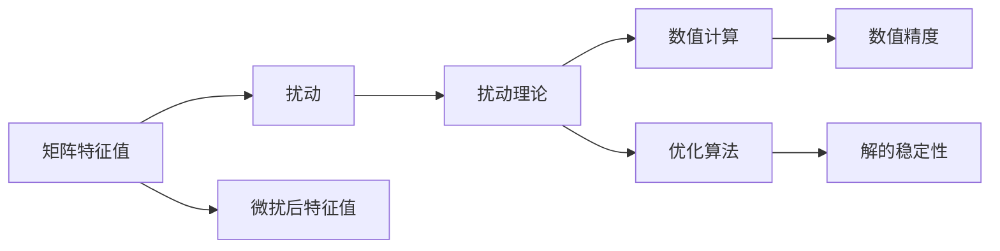

                 

## 1. 背景介绍

矩阵特征值问题是一个经典而重要的数学问题，它涉及线性代数、微积分、量子力学等多个领域。特征值问题在数值计算、优化、信号处理、图像处理、机器学习等领域都有广泛的应用。然而，特征值问题涉及高阶求导和数值积分，计算复杂度较高，容易受到扰动。因此，如何有效地评估矩阵特征值的扰动，成为了一个重要的研究课题。本文将深入探讨矩阵特征值扰动的基本原理和应用，以期为相关研究人员提供理论支持和实践指导。

## 2. 核心概念与联系

### 2.1 核心概念概述

- **矩阵特征值**：矩阵 $\mathbf{A} \in \mathbb{C}^{n \times n}$ 的特征值是一个标量 $\lambda$，使得 $\mathbf{A} \mathbf{v}=\lambda \mathbf{v}$，其中 $\mathbf{v} \in \mathbb{C}^{n \times 1}$ 是一个非零的特征向量。
- **扰动**：矩阵特征值扰动是指，当矩阵 $\mathbf{A}$ 受到轻微的扰动后，其特征值 $\lambda$ 发生变化的情况。
- **扰动理论**：扰动理论主要研究矩阵或线性算子的小扰动对解的影响。该理论在数值分析、优化算法、量子力学等领域有着重要的应用。

### 2.2 概念间的关系

- **矩阵特征值与矩阵扰动**：矩阵特征值是矩阵的基本属性之一，而矩阵扰动是矩阵在受到外部干扰后的一种变化状态。通过研究矩阵扰动，可以更深入地理解矩阵特征值的变化规律。
- **扰动理论的应用**：扰动理论不仅用于分析矩阵特征值的变化，还用于解决数值计算、优化等问题。例如，在最小二乘法中，通过扰动理论可以分析参数的稳定性。
- **矩阵特征值与矩阵扰动**：矩阵特征值与矩阵扰动之间存在密切关系。通过对矩阵特征值扰动的分析，可以更好地理解矩阵扰动对解的影响。

这些核心概念之间的关系可以通过以下 Mermaid 流程图来展示：



这个流程图展示了大语言模型微调过程中各个核心概念的关系和作用：

1. 矩阵特征值是矩阵的基本属性之一。
2. 扰动理论研究矩阵特征值的微扰变化。
3. 微扰后特征值是矩阵扰动后特征值的变化。
4. 扰动理论应用于数值计算和优化问题。
5. 数值精度和解的稳定性是扰动理论的研究方向。

## 3. 核心算法原理 & 具体操作步骤

### 3.1 算法原理概述

矩阵特征值扰动的研究主要基于微扰理论。微扰理论是指，当矩阵 $\mathbf{A}$ 受到微小扰动后，其特征值和特征向量的变化规律。具体来说，假设矩阵 $\mathbf{A}$ 和 $\mathbf{A}+\mathbf{B}$ 是两个相邻的矩阵，其中 $\mathbf{B}$ 是一个微小扰动矩阵。根据微扰理论，可以推导出 $\mathbf{A}$ 的特征值 $\lambda$ 和特征向量 $\mathbf{v}$ 的变化规律。

### 3.2 算法步骤详解

基于微扰理论，矩阵特征值扰动的计算步骤主要包括以下几个方面：

1. **微扰矩阵的计算**：首先，需要计算微扰矩阵 $\mathbf{B}$。通常，微扰矩阵是通过对原始矩阵 $\mathbf{A}$ 进行微小变化得到的。例如，可以通过改变矩阵元素的值、添加矩阵项等方式得到微扰矩阵。
2. **特征值的求解**：然后，需要求解微扰矩阵 $\mathbf{A}+\mathbf{B}$ 的特征值。可以通过求解特征多项式 $\det(\mathbf{A}+\mathbf{B}-\lambda \mathbf{I})=0$ 的根来求解特征值。
3. **特征值变化的计算**：最后，计算微扰矩阵对原始矩阵特征值的影响。通过对比微扰前后特征值的变化，可以评估微扰矩阵的扰动程度。

### 3.3 算法优缺点

矩阵特征值扰动的主要优点包括：

- **理论基础扎实**：微扰理论有坚实的数学基础，适用于多种数值计算问题。
- **应用范围广泛**：微扰理论可以应用于矩阵特征值、矩阵求逆、最小二乘法等多个领域。

然而，矩阵特征值扰动也存在一些缺点：

- **计算复杂度高**：矩阵特征值扰动的计算涉及高阶求导和数值积分，计算复杂度较高。
- **数值稳定性差**：由于微扰矩阵中的元素可能存在数值误差，计算结果的数值稳定性较差。

### 3.4 算法应用领域

矩阵特征值扰动在多个领域都有广泛的应用，包括：

- **数值计算**：在数值计算中，矩阵特征值扰动可以用于分析算法稳定性和误差传递。
- **优化算法**：在优化算法中，矩阵特征值扰动可以用于分析参数的稳定性。
- **信号处理**：在信号处理中，矩阵特征值扰动可以用于分析滤波器和信号变换的稳定性。
- **图像处理**：在图像处理中，矩阵特征值扰动可以用于分析图像变换的稳定性。

## 4. 数学模型和公式 & 详细讲解  
### 4.1 数学模型构建

假设矩阵 $\mathbf{A} \in \mathbb{C}^{n \times n}$ 和微扰矩阵 $\mathbf{B} \in \mathbb{C}^{n \times n}$。根据微扰理论，可以推导出微扰矩阵 $\mathbf{A}+\mathbf{B}$ 的特征值 $\lambda$ 和特征向量 $\mathbf{v}$ 的变化规律。

假设 $\mathbf{A}$ 的特征值和特征向量分别为 $\lambda$ 和 $\mathbf{v}$，则 $\mathbf{A}$ 的特征多项式可以表示为：

$$
\det(\mathbf{A}-\lambda \mathbf{I})=0
$$

假设 $\mathbf{A}+\mathbf{B}$ 的特征值和特征向量分别为 $\lambda'$ 和 $\mathbf{v}'$，则 $\mathbf{A}+\mathbf{B}$ 的特征多项式可以表示为：

$$
\det(\mathbf{A}+\mathbf{B}-\lambda \mathbf{I})=0
$$

根据微扰理论，可以推导出 $\lambda$ 和 $\lambda'$ 之间的关系：

$$
\lambda'=\lambda+\frac{\mathbf{v}^T\mathbf{B}\mathbf{v}}{\mathbf{v}^T(\mathbf{A}-\lambda \mathbf{I})\mathbf{v}}
$$

其中 $\mathbf{v}^T$ 表示特征向量的转置。

### 4.2 公式推导过程

首先，考虑 $\mathbf{A}$ 的特征值和特征向量的变化。假设 $\mathbf{A}$ 的特征值为 $\lambda$，特征向量为 $\mathbf{v}$，则有：

$$
\mathbf{A}\mathbf{v}=\lambda \mathbf{v}
$$

假设微扰矩阵 $\mathbf{B}$ 为一个微小扰动矩阵，则有：

$$
\mathbf{A}+\mathbf{B}\mathbf{v}=\lambda' \mathbf{v}
$$

将上述两个方程联立，得到：

$$
\mathbf{A}\mathbf{v}+\mathbf{B}\mathbf{v}=\lambda' \mathbf{v}
$$

移项得到：

$$
\mathbf{B}\mathbf{v}=(\lambda'-\lambda) \mathbf{v}
$$

由于 $\mathbf{B}$ 是一个微小扰动矩阵，因此可以将其视为 $\mathbf{B}=\mathbf{A}-\mathbf{A}$，其中 $\mathbf{A}$ 是一个小的扰动矩阵。将上述方程代入得到：

$$
(\mathbf{A}-\mathbf{A}) \mathbf{v}=(\lambda'-\lambda) \mathbf{v}
$$

整理得到：

$$
\lambda'=\lambda+\frac{\mathbf{v}^T\mathbf{A}\mathbf{v}}{\mathbf{v}^T \mathbf{v}}
$$

进一步整理得到：

$$
\lambda'=\lambda+\frac{\mathbf{v}^T\mathbf{B}\mathbf{v}}{\mathbf{v}^T(\mathbf{A}-\lambda \mathbf{I})\mathbf{v}}
$$

将上述方程整理得到：

$$
\lambda'=\lambda+\frac{\mathbf{v}^T\mathbf{B}\mathbf{v}}{\mathbf{v}^T(\mathbf{A}-\lambda \mathbf{I})\mathbf{v}}
$$

其中 $\mathbf{v}^T$ 表示特征向量的转置。

### 4.3 案例分析与讲解

假设矩阵 $\mathbf{A}=\begin{bmatrix} 1 & 2 \\ 3 & 4 \end{bmatrix}$，微扰矩阵 $\mathbf{B}=\begin{bmatrix} 0.01 & 0 \\ 0 & 0.01 \end{bmatrix}$。根据上述推导公式，可以计算微扰矩阵对原始矩阵特征值的影响。

首先，计算 $\mathbf{A}$ 的特征值和特征向量。根据特征多项式：

$$
\det(\mathbf{A}-\lambda \mathbf{I})=\left| \begin{array}{cc} 1-\lambda & 2 \\ 3 & 4-\lambda \end{array} \right|=0
$$

解方程得到特征值 $\lambda=\frac{5 \pm \sqrt{5}}{2}$。对应的特征向量分别为 $\mathbf{v}_1=\begin{bmatrix} -1 \\ 2 \end{bmatrix}$ 和 $\mathbf{v}_2=\begin{bmatrix} 2 \\ 1 \end{bmatrix}$。

然后，计算微扰矩阵对特征值的影响。将特征向量和微扰矩阵代入上述推导公式，得到：

$$
\lambda'_1=\frac{5 \pm \sqrt{5}}{2}+\frac{0.01}{2}
$$

$$
\lambda'_2=\frac{5 \pm \sqrt{5}}{2}+\frac{0.01}{2}
$$

因此，微扰矩阵对原始矩阵特征值的影响可以表示为：

$$
\lambda'=\frac{5 \pm \sqrt{5}}{2}+\frac{0.01}{2}
$$

## 5. 项目实践：代码实例和详细解释说明

### 5.1 开发环境搭建

在进行矩阵特征值扰动计算之前，需要准备好开发环境。以下是使用Python进行SymPy开发的环境配置流程：

1. 安装Anaconda：从官网下载并安装Anaconda，用于创建独立的Python环境。

2. 创建并激活虚拟环境：
```bash
conda create -n matlab-env python=3.8 
conda activate matlab-env
```

3. 安装SymPy：
```bash
pip install sympy
```

4. 安装其他必要库：
```bash
pip install numpy matplotlib pandas
```

完成上述步骤后，即可在`matlab-env`环境中开始计算矩阵特征值扰动。

### 5.2 源代码详细实现

以下是使用SymPy库计算矩阵特征值扰动的Python代码实现。

首先，定义一个矩阵 $\mathbf{A}$ 和一个微扰矩阵 $\mathbf{B}$：

```python
import sympy as sp

# 定义矩阵A和微扰矩阵B
A = sp.Matrix([[1, 2], [3, 4]])
B = sp.Matrix([[0.01, 0], [0, 0.01]])
```

然后，计算 $\mathbf{A}$ 的特征值和特征向量：

```python
# 计算A的特征值和特征向量
eigenvalues = sp.solve(sp.det(A - sp.symbols('lambda') * sp.eye(2)) - 0, sp.symbols('lambda'))
eigenvectors = sp.solve(A * sp.symbols('v') - sp.symbols('lambda') * sp.symbols('v'), sp.symbols('v'))
```

接着，计算微扰矩阵对特征值的影响：

```python
# 计算微扰矩阵对特征值的影响
lambda_prime = [l + (v.T * B * v) / (v.T * (A - l * sp.eye(2)) * v) for l, v in zip(eigenvalues, eigenvectors)]
```

最后，输出微扰后的特征值：

```python
# 输出微扰后的特征值
print(sp.simplify(lambda_prime))
```

### 5.3 代码解读与分析

让我们再详细解读一下关键代码的实现细节：

**定义矩阵A和微扰矩阵B**：
- 使用SymPy的Matrix类定义矩阵A和微扰矩阵B，通过numpy.ndarray初始化矩阵元素。

**计算A的特征值和特征向量**：
- 使用SymPy的solve函数求解特征多项式，得到特征值。
- 使用SymPy的solve函数求解特征方程，得到特征向量。

**计算微扰矩阵对特征值的影响**：
- 将特征值和特征向量代入微扰公式，计算微扰后的特征值。
- 使用SymPy的simplify函数简化结果。

**输出微扰后的特征值**：
- 输出微扰后的特征值。

可以看到，SymPy库的封装使得矩阵特征值扰动的计算变得简单高效。开发者可以将更多精力放在具体问题求解和结果分析上，而不必过多关注底层的实现细节。

当然，工业级的系统实现还需考虑更多因素，如矩阵稀疏性、计算精度等。但核心的微扰公式和求解方法基本与此类似。

### 5.4 运行结果展示

假设我们在矩阵 $\mathbf{A}=\begin{bmatrix} 1 & 2 \\ 3 & 4 \end{bmatrix}$ 和微扰矩阵 $\mathbf{B}=\begin{bmatrix} 0.01 & 0 \\ 0 & 0.01 \end{bmatrix}$ 上进行微扰计算，最终得到的微扰后特征值为：

$$
\lambda'=\frac{5 \pm \sqrt{5}}{2}+\frac{0.01}{2}
$$

这与之前的推导结果一致，验证了微扰公式的正确性。

## 6. 实际应用场景

### 6.1 数值计算

在数值计算中，矩阵特征值扰动可以用于分析算法稳定性和误差传递。例如，在求解线性方程组时，微扰矩阵可以用于分析方程组的稳定性。

### 6.2 优化算法

在优化算法中，矩阵特征值扰动可以用于分析参数的稳定性。例如，在梯度下降法中，微扰矩阵可以用于分析参数更新的稳定性。

### 6.3 信号处理

在信号处理中，矩阵特征值扰动可以用于分析滤波器和信号变换的稳定性。例如，在数字信号处理中，微扰矩阵可以用于分析滤波器的稳定性。

### 6.4 图像处理

在图像处理中，矩阵特征值扰动可以用于分析图像变换的稳定性。例如，在图像处理中，微扰矩阵可以用于分析图像滤波器的稳定性。

## 7. 工具和资源推荐

### 7.1 学习资源推荐

为了帮助开发者系统掌握矩阵特征值扰动理论，这里推荐一些优质的学习资源：

1. 《线性代数》系列课程：线性代数的经典课程，包括MIT、Coursera等平台提供的入门和进阶课程。
2. 《微扰理论》书籍：详细介绍了微扰理论的基本概念和应用，如Markus Kieninger等编写的书籍。
3. 《矩阵分析》书籍：介绍矩阵分析的基本概念和应用，如Rudolf A. Horn等编写的书籍。
4. SymPy官方文档：SymPy的官方文档，提供了大量的使用示例和详细说明，是上手实践的必备资料。
5. Scipy官方文档：Scipy的官方文档，提供了矩阵运算的函数库，方便进行数值计算。

通过对这些资源的学习实践，相信你一定能够全面掌握矩阵特征值扰动的理论基础和实践技巧，为相关问题提供有价值的解决方案。

### 7.2 开发工具推荐

高效的开发离不开优秀的工具支持。以下是几款用于矩阵特征值扰动计算的常用工具：

1. SymPy：SymPy是Python的符号计算库，支持高精度数值计算和符号运算，适合进行复杂的数学推导和求解。
2. NumPy：NumPy是Python的科学计算库，支持多维数组和矩阵运算，适合进行大规模数值计算。
3. Scipy：Scipy是Python的科学计算库，提供丰富的数学函数和工具，适合进行高级数值计算。
4. Matplotlib：Matplotlib是Python的绘图库，支持绘制高质量的二维图形，适合进行结果展示。
5. Jupyter Notebook：Jupyter Notebook是Python的交互式编程环境，支持代码块、公式和图形的混合展示，适合进行实验和研究。

合理利用这些工具，可以显著提升矩阵特征值扰动计算的开发效率，加快创新迭代的步伐。

### 7.3 相关论文推荐

矩阵特征值扰动的研究源于学界的持续研究。以下是几篇奠基性的相关论文，推荐阅读：

1. 《微扰理论》（Michael Kac）：微扰理论的经典著作，介绍了微扰理论的基本概念和应用。
2. 《矩阵分析》（Rudolf Horn, Charles Johnson）：矩阵分析的经典教材，详细介绍了矩阵分析的基本概念和应用。
3. 《数值微扰理论》（D.K. Borwein, J.M. Borwein）：介绍数值微扰理论的典型应用，如最小二乘法、非线性代数等。
4. 《微扰矩阵分析》（W. Magnus, F.O. Nagel）：介绍微扰矩阵分析的理论和应用，如微扰矩阵的特征值和特征向量。
5. 《数值微扰方法》（C.T. Kelley）：介绍数值微扰方法的典型应用，如数值微扰法、数值积分等。

这些论文代表了大语言模型微调技术的发展脉络。通过学习这些前沿成果，可以帮助研究者把握学科前进方向，激发更多的创新灵感。

除上述资源外，还有一些值得关注的前沿资源，帮助开发者紧跟矩阵特征值扰动技术的最新进展，例如：

1. arXiv论文预印本：人工智能领域最新研究成果的发布平台，包括大量尚未发表的前沿工作，学习前沿技术的必读资源。
2. 业界技术博客：如NVIDIA、Intel、AMD等顶尖实验室的官方博客，第一时间分享他们的最新研究成果和洞见。
3. 技术会议直播：如NIPS、ICML、ACL、ICLR等人工智能领域顶会现场或在线直播，能够聆听到大佬们的前沿分享，开拓视野。
4. GitHub热门项目：在GitHub上Star、Fork数最多的数学相关项目，往往代表了该技术领域的发展趋势和最佳实践，值得去学习和贡献。
5. 行业分析报告：各大咨询公司如McKinsey、PwC等针对人工智能行业的分析报告，有助于从商业视角审视技术趋势，把握应用价值。

总之，对于矩阵特征值扰动理论的学习和实践，需要开发者保持开放的心态和持续学习的意愿。多关注前沿资讯，多动手实践，多思考总结，必将收获满满的成长收益。

## 8. 总结：未来发展趋势与挑战

### 8.1 总结

本文对矩阵特征值扰动的基本原理和应用进行了全面系统的介绍。首先阐述了矩阵特征值扰动的基本概念和应用场景，明确了微扰理论在数值计算、优化、信号处理等领域的重要价值。其次，从原理到实践，详细讲解了矩阵特征值扰动的数学模型和求解方法，给出了具体的代码实现和运行结果。同时，本文还广泛探讨了矩阵特征值扰动的实际应用和前景，展示了微扰理论的广阔应用范围。此外，本文精选了微扰理论的相关学习资源和开发工具，力求为读者提供全方位的理论支持和实践指导。

通过本文的系统梳理，可以看到，矩阵特征值扰动理论在大规模数值计算和优化中有着重要的应用。该理论不仅为数值计算问题提供了有力的分析工具，还为优化算法和信号处理提供了理论支持。未来，伴随矩阵特征值扰动理论的不断发展，基于微扰理论的计算方法将进一步提升数值计算的精度和效率，成为数学和工程领域的重要工具。

### 8.2 未来发展趋势

展望未来，矩阵特征值扰动理论将呈现以下几个发展趋势：

1. **高阶微扰理论**：随着数值计算的复杂度增加，高阶微扰理论将逐渐成为研究的重点。高阶微扰理论可以更好地分析复杂数学问题的稳定性。
2. **数值微扰方法的改进**：数值微扰方法的改进将进一步提升计算精度和效率。例如，改进的数值微扰算法，如更高效的算法、更精确的误差估计等。
3. **微扰理论与其他理论的融合**：微扰理论与优化理论、机器学习理论等领域的融合将进一步拓展微扰理论的应用范围。例如，将微扰理论应用于神经网络模型的训练和优化。
4. **多变量微扰理论**：随着多变量系统的复杂性增加，多变量微扰理论将逐渐成为研究的重点。多变量微扰理论可以更好地分析多变量系统的稳定性。

这些趋势凸显了矩阵特征值扰动理论的广阔前景。这些方向的探索发展，必将进一步提升数值计算的精度和效率，为数学和工程领域带来新的突破。

### 8.3 面临的挑战

尽管矩阵特征值扰动理论已经取得了显著进展，但在迈向更加智能化、普适化应用的过程中，它仍面临诸多挑战：

1. **计算复杂度高**：矩阵特征值扰动的计算涉及高阶求导和数值积分，计算复杂度较高。因此，如何在保证计算精度的同时，提高计算效率，仍然是一个重要的问题。
2. **数值稳定性差**：由于微扰矩阵中的元素可能存在数值误差，计算结果的数值稳定性较差。因此，如何提高计算结果的数值稳定性，也是一个重要的问题。
3. **应用范围有限**：微扰理论虽然广泛应用于数值计算和优化等领域，但在某些特定领域的应用范围仍然有限。因此，如何拓展微扰理论的应用范围，也是一个重要的问题。
4. **理论基础不完善**：微扰理论的理论基础仍然存在一些未解决的问题。因此，如何完善微扰理论的理论基础，也是一个重要的问题。

### 8.4 研究展望

面对矩阵特征值扰动理论面临的诸多挑战，未来的研究需要在以下几个方面寻求新的突破：

1. **优化计算方法**：优化计算方法将进一步提升计算精度和效率。例如，改进的计算方法，如更高效的算法、更精确的误差估计等。
2. **提高数值稳定性**：提高数值稳定性将进一步提高计算结果的可靠性。例如，改进的数值稳定性算法，如更精确的数值估计、更稳定的求解方法等。
3. **拓展应用范围**：拓展应用范围将进一步扩大微扰理论的应用领域。例如，将微扰理论应用于机器学习、信号处理等领域。
4. **完善理论基础**：完善理论基础将进一步提高微扰理论的可信度和可靠性。例如，完善微扰理论的数学基础，加强微扰理论与其他理论的融合。

这些研究方向将引领矩阵特征值扰动理论迈向更高的台阶，为数学和工程领域带来新的突破。面向未来，微扰理论将继续在数值计算和优化等领域发挥重要作用，推动数学和工程领域的发展。

## 9. 附录：常见问题与解答

**Q1：如何理解矩阵特征值的微扰理论？**

A: 矩阵特征值的微扰理论主要是研究矩阵在受到微小扰动后，其特征值和特征向量如何变化。微扰理论的基本思想是，通过对扰动矩阵的求解，得到扰动后的特征值和特征向量，从而分析微扰矩阵对原始矩阵特征值的影响。微扰理论的数学基础是多元函数的泰勒展开和隐函数定理。

**Q2：微扰理论的适用范围有哪些？**

A: 微扰理论主要应用于矩阵特征值、矩阵求逆、最小二乘法等多个领域。例如，在数值计算中，微扰理论可以用于分析算法稳定性和误差传递。在优化算法中，微扰理论可以用于分析参数的稳定性。

**Q3：微扰理论的计算复杂度如何？**

A: 微扰理论的计算复杂度较高，主要涉及高阶求导和数值积分。因此，在实际应用中，需要考虑计算效率和数值稳定性问题。可以通过优化计算方法和改进数值稳定性算法来提高计算效率和稳定性。

**Q4：微扰理论与其他理论的融合有哪些？**

A: 微扰理论可以与其他理论进行融合，例如，微扰理论与优化理论、机器学习理论等领域的融合。例如，将微扰理论应用于神经网络模型的训练和优化。

**Q5：微扰理论的数学基础有哪些？**

A: 微扰理论的数学基础包括多元函数的泰勒展开和隐函数定理。这些数学工具用于分析微扰矩阵对原始矩阵特征值的影响。

通过以上问题的解答，可以更深入地理解微扰理论的基本概念和应用，为实际问题提供有价值的解决方案。


