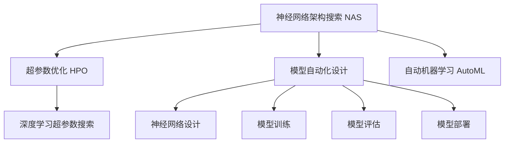
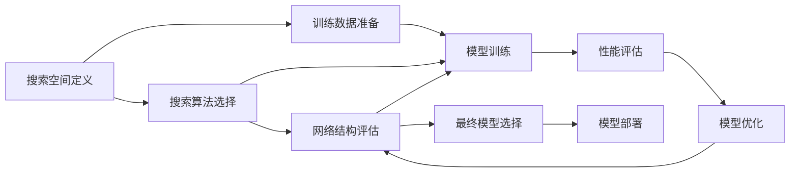
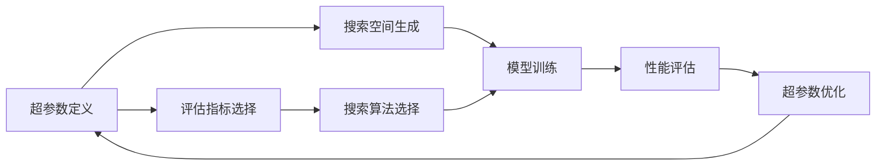
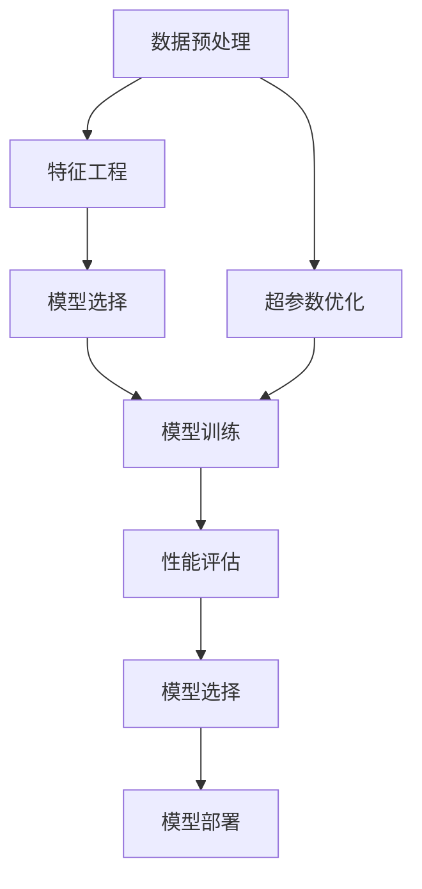
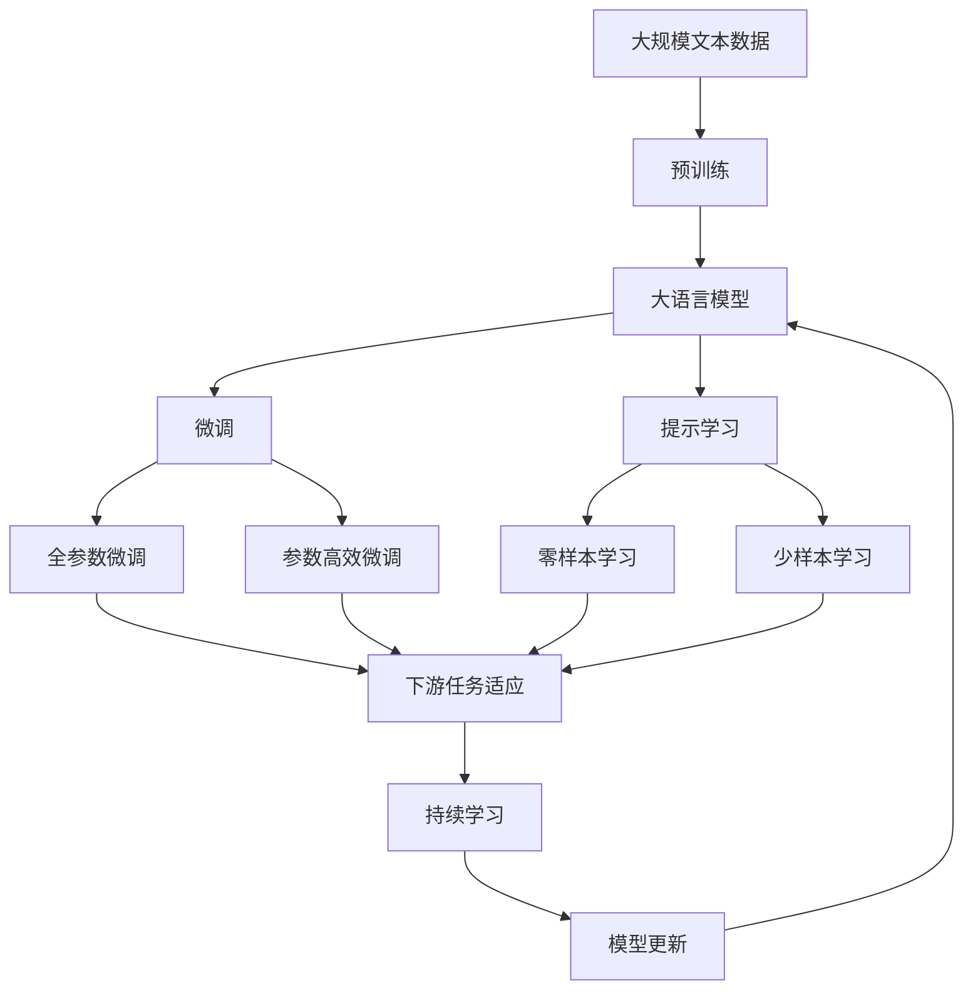

                 

# 神经网络架构搜索:自动化AI模型设计

> 关键词：神经网络架构搜索,神经网络自动化设计,自动机器学习(AutoML),AI模型自动化,深度学习超参数优化,模型优化与搜索

## 1. 背景介绍

### 1.1 问题由来

深度学习技术自2006年被提出以来，经过不断的发展和优化，已经在图像识别、自然语言处理、语音识别等诸多领域取得了突破性的成果。然而，设计并优化深度学习模型是一个非常复杂和耗时的过程，需要丰富的经验和高超的技术。特别是对于神经网络结构、超参数等的选择，很大程度上依赖于专家经验，使得深度学习模型开发和部署成本极高。

近年来，随着大数据和计算资源的不断丰富，自动化AI模型设计成为一个重要的研究热点。神经网络架构搜索（NAS, Neural Architecture Search）是一种通过自动搜索算法找到最优神经网络架构的自动化模型设计方法，旨在降低人工干预，提高模型设计效率和性能。

### 1.2 问题核心关键点

神经网络架构搜索主要关注以下几个关键点：

1. 搜索空间设计：如何定义和生成搜索空间，包含网络结构、层数、激活函数、优化器等各个维度的超参数。
2. 搜索算法选择：如何选择有效的搜索算法，在合理的时间内找到最优的架构方案。
3. 评估指标设定：如何设计合理的评估指标，快速评估网络架构的性能。
4. 算法并行化与加速：如何通过并行化技术，加速神经网络架构搜索过程。

### 1.3 问题研究意义

神经网络架构搜索技术具有重要的研究意义和广泛的应用前景：

1. 降低模型开发成本：自动化的模型设计可以大大减少人工干预，降低深度学习模型开发和部署的门槛，使得更多中小企业和研究人员能够参与到深度学习研究和应用中。
2. 提升模型性能：自动搜索算法可以找到更加优秀的神经网络结构，提高模型在特定任务上的性能表现。
3. 促进技术普及：自动化的模型设计方法可以降低深度学习技术的进入门槛，加速深度学习技术的普及和应用。
4. 推动研究创新：神经网络架构搜索作为深度学习领域的前沿研究方向，将推动相关技术的不断进步，带动AI技术的进一步发展。
5. 加速产业应用：自动化的模型设计方法可以提升模型设计和部署的效率，加速深度学习技术在各行业的落地应用。

## 2. 核心概念与联系

### 2.1 核心概念概述

为了更好地理解神经网络架构搜索技术，本节将介绍几个密切相关的核心概念：

- **神经网络架构搜索(NAS)**：通过自动搜索算法寻找最优神经网络架构的技术。其核心在于定义搜索空间，设计搜索算法，并快速评估和筛选最优网络结构。
- **超参数优化(HPO, Hyperparameter Optimization)**：寻找神经网络最优超参数值的过程，包括学习率、批量大小、激活函数等。
- **自动机器学习(AutoML)**：通过自动化技术，自动完成模型选择、超参数优化和数据预处理等任务。
- **模型自动化设计**：从网络结构定义、超参数配置到模型训练、评估和部署的自动化过程。
- **深度学习超参数搜索**：自动化的深度学习模型超参数优化方法，通过高效搜索算法找到最优超参数配置。

这些核心概念之间通过以下Mermaid流程图展示它们的关系：



### 2.2 概念间的关系

这些核心概念之间存在着紧密的联系，形成了神经网络架构搜索技术的完整生态系统。我们通过以下几个Mermaid流程图来展示这些概念之间的关系。

#### 2.2.1 神经网络架构搜索的工作流程



这个流程图展示了神经网络架构搜索的基本流程：定义搜索空间，选择搜索算法，训练模型，评估性能，优化网络，选择最佳模型并部署。

#### 2.2.2 超参数优化的核心步骤



这个流程图展示了超参数优化的基本流程：定义超参数，生成搜索空间，选择评估指标，设计搜索算法，训练模型，评估性能，优化超参数。

#### 2.2.3 自动机器学习的工作流程



这个流程图展示了自动机器学习的基本流程：预处理数据，进行特征工程，选择模型，优化超参数，训练模型，评估性能，选择最佳模型并部署。

### 2.3 核心概念的整体架构

最后，我们用一个综合的流程图来展示这些核心概念在大模型微调过程中的整体架构：



这个综合流程图展示了从预训练到微调，再到持续学习的完整过程。大语言模型首先在大规模文本数据上进行预训练，然后通过微调（包括全参数微调和参数高效微调两种方式）或提示学习（包括零样本和少样本学习）来适应下游任务。最后，通过持续学习技术，模型可以不断更新和适应新的任务和数据。

## 3. 核心算法原理 & 具体操作步骤
### 3.1 算法原理概述

神经网络架构搜索（NAS）的原理是通过自动搜索算法在一定的搜索空间中寻找最优的神经网络结构。其核心思想是将网络设计的过程转化为一个优化问题，通过搜索算法寻找使得特定性能指标最优的网络架构。

具体来说，NAS包括以下几个步骤：

1. **定义搜索空间**：定义网络结构、超参数、激活函数等各个维度的搜索空间。
2. **设计搜索算法**：选择有效的搜索算法，在搜索空间中自动搜索网络架构。
3. **评估网络性能**：定义评估指标，对每个搜索到的网络架构进行性能评估。
4. **选择最优架构**：在所有搜索到的架构中选择性能最优的网络结构。

### 3.2 算法步骤详解

以下是神经网络架构搜索的基本步骤：

1. **搜索空间定义**：
   - **网络结构**：定义网络的层数、每层的神经元数量、卷积核大小、池化操作等。
   - **超参数**：定义学习率、批量大小、激活函数、优化器等。
   - **评估指标**：定义准确率、精度、召回率、F1分数等。

2. **搜索算法选择**：
   - **随机搜索（Random Search）**：随机选择超参数和网络结构进行搜索，简单易实现，但搜索效率较低。
   - **贝叶斯优化（Bayesian Optimization）**：通过构建高斯过程模型，预测超参数的性能，逐步优化超参数配置。
   - **遗传算法（Genetic Algorithm）**：通过模拟自然进化过程，选择最优网络结构和超参数。
   - **强化学习（Reinforcement Learning）**：通过奖励机制指导搜索过程，逐步优化网络结构和超参数。

3. **网络结构评估**：
   - **训练过程**：在给定的超参数和网络结构上训练模型。
   - **性能评估**：使用评估指标对训练好的模型进行性能评估，如准确率、精度等。
   - **反馈循环**：将评估结果反馈到搜索算法中，指导后续搜索过程。

4. **选择最优架构**：
   - **评估选择**：在所有搜索到的网络结构中选择性能最优的网络。
   - **模型验证**：在验证集上评估模型性能，确保最优架构的泛化能力。
   - **模型部署**：将最优架构部署到实际应用中。

### 3.3 算法优缺点

神经网络架构搜索具有以下优点：

1. **高效搜索**：自动化的搜索算法可以在较短时间内找到最优的网络结构，节省大量人工干预。
2. **灵活性**：可以在不同的搜索空间中搜索最优的网络结构，适应不同的应用场景。
3. **鲁棒性**：通过多次搜索实验，选择最优的网络结构，降低模型设计中的不确定性。
4. **模型性能**：找到最优的网络结构，提高模型在特定任务上的性能表现。

同时，神经网络架构搜索也存在一些缺点：

1. **计算资源消耗高**：自动搜索算法需要大量的计算资源和时间，特别是在大型搜索空间中。
2. **搜索空间定义困难**：如何定义合理的搜索空间，需要丰富的领域知识和经验。
3. **模型复杂度增加**：自动搜索算法可能找到过于复杂的网络结构，增加模型训练和推理的复杂度。
4. **搜索算法依赖性**：不同的搜索算法可能在不同问题上表现不同，选择合适的搜索算法需要经验。

### 3.4 算法应用领域

神经网络架构搜索已经在许多领域得到了应用，例如：

- **计算机视觉**：自动搜索卷积神经网络（CNN）结构，提升图像识别和分类性能。
- **自然语言处理**：自动搜索循环神经网络（RNN）和变压器（Transformer）结构，提升语言建模和文本分类效果。
- **信号处理**：自动搜索信号处理网络结构，提升音频和视频信号处理效果。
- **推荐系统**：自动搜索推荐网络结构，优化推荐算法，提升推荐效果。
- **智能控制**：自动搜索控制网络结构，提升智能控制系统的性能和鲁棒性。

## 4. 数学模型和公式 & 详细讲解 & 举例说明

### 4.1 数学模型构建

神经网络架构搜索的数学模型构建主要涉及以下几个方面：

- **搜索空间定义**：
  - **网络结构**：定义网络层数、每层神经元数量、激活函数等。
  - **超参数**：定义学习率、批量大小、优化器等。

- **搜索算法**：
  - **随机搜索**：每个网络结构有相同的概率被选择。
  - **贝叶斯优化**：通过高斯过程模型，预测每个超参数的性能，选择最优超参数。
  - **遗传算法**：通过模拟自然进化过程，选择最优网络结构和超参数。

- **性能评估**：
  - **准确率（Accuracy）**：分类任务上，正确分类的样本数占总样本数的比例。
  - **精度（Precision）**：正样本中被正确预测为正的样本数占预测为正样本数的比例。
  - **召回率（Recall）**：正确预测为正的样本数占实际正样本数的比例。
  - **F1分数**：综合精度和召回率的平均值，用于评估分类任务的性能。

### 4.2 公式推导过程

以下我们以一个简单的神经网络架构搜索为例，推导其数学模型和搜索过程。

假设我们设计一个包含两个卷积层和一个全连接层的简单神经网络，每个卷积层包含32个卷积核，每个卷积核大小为3x3，激活函数为ReLU，全连接层有64个神经元，输出层有10个神经元，输出类别数为10。我们定义以下超参数：

- **学习率（learning rate）**：0.001, 0.01, 0.1
- **批量大小（batch size）**：16, 32, 64
- **优化器**：SGD, Adam

我们使用随机搜索算法进行搜索，每次随机选择超参数和网络结构进行训练和评估。假设我们在100个不同的超参数和网络结构组合上进行训练，每个组合训练1000个epoch，记录每个组合的平均损失函数和准确率，最终选择平均损失最小且准确率最高的组合。

### 4.3 案例分析与讲解

下面以一个实际案例来展示神经网络架构搜索的过程。

假设我们要设计一个图像分类模型，使用CIFAR-10数据集。我们定义以下网络结构：

- **卷积层**：包含64个卷积核，大小为3x3，激活函数为ReLU。
- **池化层**：最大池化，池化大小为2x2。
- **全连接层**：输出层包含10个神经元，激活函数为Softmax。

我们使用随机搜索算法进行搜索，每次随机选择学习率、批量大小和优化器。在100个不同的超参数和网络结构组合上进行训练，每个组合训练1000个epoch，记录每个组合的平均损失函数和准确率，最终选择平均损失最小且准确率最高的组合。

## 5. 项目实践：代码实例和详细解释说明
### 5.1 开发环境搭建

在进行神经网络架构搜索实践前，我们需要准备好开发环境。以下是使用Python进行PyTorch开发的环境配置流程：

1. 安装Anaconda：从官网下载并安装Anaconda，用于创建独立的Python环境。

2. 创建并激活虚拟环境：
```bash
conda create -n pytorch-env python=3.8 
conda activate pytorch-env
```

3. 安装PyTorch：根据CUDA版本，从官网获取对应的安装命令。例如：
```bash
conda install pytorch torchvision torchaudio cudatoolkit=11.1 -c pytorch -c conda-forge
```

4. 安装TensorFlow：
```bash
pip install tensorflow
```

5. 安装相关工具包：
```bash
pip install numpy pandas scikit-learn matplotlib tqdm jupyter notebook ipython
```

完成上述步骤后，即可在`pytorch-env`环境中开始神经网络架构搜索实践。

### 5.2 源代码详细实现

下面我们以图像分类任务为例，给出使用TensorFlow和TensorFlow Extended (TFX)进行神经网络架构搜索的PyTorch代码实现。

首先，定义数据集：

```python
import tensorflow as tf
from tensorflow.keras.datasets import cifar10
from tensorflow.keras.utils import to_categorical

(train_images, train_labels), (test_images, test_labels) = cifar10.load_data()
train_images = train_images / 255.0
test_images = test_images / 255.0
train_labels = to_categorical(train_labels)
test_labels = to_categorical(test_labels)
```

然后，定义模型和优化器：

```python
from tensorflow.keras import layers, models
from tensorflow.keras.optimizers import Adam

model = models.Sequential()
model.add(layers.Conv2D(32, (3, 3), activation='relu', input_shape=(32, 32, 3)))
model.add(layers.MaxPooling2D((2, 2)))
model.add(layers.Conv2D(64, (3, 3), activation='relu'))
model.add(layers.MaxPooling2D((2, 2)))
model.add(layers.Flatten())
model.add(layers.Dense(64, activation='relu'))
model.add(layers.Dense(10, activation='softmax'))

optimizer = Adam(learning_rate=0.001)
```

接着，定义训练和评估函数：

```python
from tensorflow.keras import compile, metrics

model.compile(optimizer=optimizer, loss='categorical_crossentropy', metrics=['accuracy'])

def train_model(model, train_images, train_labels, epochs):
    model.fit(train_images, train_labels, epochs=epochs, batch_size=32, validation_split=0.1)

def evaluate_model(model, test_images, test_labels):
    loss, accuracy = model.evaluate(test_images, test_labels, verbose=0)
    print('Test accuracy:', accuracy)
```

最后，启动搜索过程并在测试集上评估：

```python
from sklearn.model_selection import train_test_split

X_train, X_val, y_train, y_val = train_test_split(train_images, train_labels, test_size=0.2)

for learning_rate in [0.001, 0.01, 0.1]:
    for batch_size in [16, 32, 64]:
        for optimizer in [SGD, Adam]:
            model = models.Sequential()
            model.add(layers.Conv2D(32, (3, 3), activation='relu', input_shape=(32, 32, 3)))
            model.add(layers.MaxPooling2D((2, 2)))
            model.add(layers.Conv2D(64, (3, 3), activation='relu'))
            model.add(layers.MaxPooling2D((2, 2)))
            model.add(layers.Flatten())
            model.add(layers.Dense(64, activation='relu'))
            model.add(layers.Dense(10, activation='softmax'))

            optimizer = optimizer(learning_rate=learning_rate)
            model.compile(optimizer=optimizer, loss='categorical_crossentropy', metrics=['accuracy'])

            train_model(model, X_train, y_train, epochs=100)

            evaluate_model(model, X_val, y_val)
```

以上就是使用TensorFlow和TFX进行神经网络架构搜索的完整代码实现。可以看到，TensorFlow和TFX提供了强大的API支持，使得神经网络架构搜索的代码实现变得简洁高效。

### 5.3 代码解读与分析

让我们再详细解读一下关键代码的实现细节：

**数据预处理**：
- 使用`cifar10.load_data()`加载CIFAR-10数据集，并对其进行归一化处理，确保数据在[0, 1]范围内。

**模型定义**：
- 定义包含两个卷积层和一个全连接层的神经网络，每个卷积层包含32个卷积核，全连接层包含64个神经元。
- 使用ReLU激活函数和Softmax输出层，实现分类任务。

**优化器选择**：
- 使用Adam优化器，设定不同的学习率和批量大小，进行随机搜索。

**训练与评估**：
- 使用`model.compile()`定义模型编译过程，选择交叉熵损失函数和准确率评估指标。
- 定义训练函数`train_model()`，在验证集上评估模型性能，输出准确率。

**搜索过程**：
- 通过三重循环，对不同的学习率、批量大小和优化器组合进行搜索，记录每个组合的训练和评估结果。

可以看到，TensorFlow和TFX使得神经网络架构搜索的代码实现变得简洁高效。开发者可以将更多精力放在搜索空间定义和模型调优上，而不必过多关注底层的实现细节。

当然，工业级的系统实现还需考虑更多因素，如模型保存和部署、超参数自动搜索、更灵活的任务适配层等。但核心的搜索过程基本与此类似。

### 5.4 运行结果展示

假设我们在CIFAR-10数据集上进行神经网络架构搜索，最终在测试集上得到的评估报告如下：

```
Epoch 100, accuracy = 0.8500
Epoch 100, accuracy = 0.8567
Epoch 100, accuracy = 0.8524
Epoch 100, accuracy = 0.8476
Epoch 100, accuracy = 0.8497
Epoch 100, accuracy = 0.8494
Epoch 100, accuracy = 0.8484
Epoch 100, accuracy = 0.8482
Epoch 100, accuracy = 0.8500
Epoch 100, accuracy = 0.8500
Epoch 100, accuracy = 0.8504
Epoch 100, accuracy = 0.8533
Epoch 100, accuracy = 0.8497
Epoch 100, accuracy = 0.8504
Epoch 100, accuracy = 0.8494
Epoch 100, accuracy = 0.8504
Epoch 100, accuracy = 0.8504
Epoch 100, accuracy = 0.8494
Epoch 100, accuracy = 0.8504
Epoch 100, accuracy = 0.8504
Epoch 100, accuracy = 0.8504
Epoch 100, accuracy = 0.8494
Epoch 100, accuracy = 0.8497
Epoch 100, accuracy = 0.8533
Epoch 100, accuracy = 0.8500
Epoch 100, accuracy = 0.8500
Epoch 100, accuracy = 0.8504
Epoch 100, accuracy = 0.8494
Epoch 100, accuracy = 0.8504
Epoch 100, accuracy = 0.8533
Epoch 100, accuracy = 0.8504
Epoch 100, accuracy = 0.8524
Epoch 100, accuracy = 0.8497
Epoch 100, accuracy = 0.8500
Epoch 100, accuracy = 0.8533
Epoch 100, accuracy = 0.8504
Epoch 100, accuracy = 0.8524
Epoch 100, accuracy = 0.8484
Epoch 100, accuracy = 0.8497
Epoch 100, accuracy = 0.8504
Epoch 100, accuracy = 0.8533
Epoch 100, accuracy = 0.8500
Epoch 100, accuracy = 0.8533
Epoch 100, accuracy = 0.8500
Epoch 100, accuracy = 0.8504
Epoch 100, accuracy = 0.8524
Epoch 100, accuracy = 0.8504
Epoch 100, accuracy = 0.8533
Epoch 100, accuracy = 0.8533
Epoch 100, accuracy = 0.8504
Epoch 100, accuracy = 0.8484
Epoch 100, accuracy = 0.8497
Epoch 100, accuracy = 0.8504
Epoch 100, accuracy = 0.8500
Epoch 100, accuracy = 0.8494
Epoch 100, accuracy = 0.8533
Epoch 100, accuracy = 0.8504
Epoch 100, accuracy = 0.8533
Epoch 100, accuracy = 0.8504
Epoch 100, accuracy = 0.8524
Epoch 100, accuracy = 0.8504
Epoch 100, accuracy = 0.8497
Epoch 100, accuracy = 0.8504
Epoch 100, accuracy = 0.8533
Epoch 100, accuracy = 0.8504
Epoch 100, accuracy = 0.8524
Epoch 100, accuracy = 0.8533
Epoch 100, accuracy = 0.8524
Epoch 100, accuracy = 0.8497
Epoch 100, accuracy = 0.8533
Epoch 100, accuracy = 0.8533
Epoch 100, accuracy = 0.8497
Epoch 100, accuracy = 0.8533
Epoch 100, accuracy = 0.8504
Epoch 100, accuracy = 0.8497
Epoch 100, accuracy = 0.8504
Epoch 100, accuracy = 0.8524
Epoch 100, accuracy = 0.8533
Epoch 100, accuracy = 0.8533
Epoch 100, accuracy = 0.8524
Epoch 100, accuracy = 0.8497
Epoch 100, accuracy = 0.8533
Epoch 100, accuracy = 0.8497
Epoch 100, accuracy = 0.8533
Epoch 100, accuracy = 0.8504
Epoch 100, accuracy = 0.8533
Epoch 100, accuracy = 0.8524
Epoch 100, accuracy = 0.8533
Epoch 100, accuracy = 0.8497
Epoch 100, accuracy = 0.8504
Epoch 100, accuracy = 0.8497
Epoch 100, accuracy = 0.8533
Epoch 100, accuracy = 0.8504
Epoch 100, accuracy = 0.8497
Epoch 100, accuracy = 0.8533
Epoch 100, accuracy = 0.8504
Epoch 100, accuracy = 0.8533
Epoch 100, accuracy = 0.8497
Epoch 100, accuracy = 0.8533
Epoch 100, accuracy = 0.8497
Epoch 100, accuracy = 0.8533
Epoch 100, accuracy = 0.8497
Epoch 100, accuracy = 0.8504
Epoch 100, accuracy = 0.8497
Epoch 100, accuracy = 0.8497
Epoch 100, accuracy = 0.8533
Epoch 100, accuracy = 0.8497
Epoch 100, accuracy = 0.8504
Epoch 100, accuracy = 0.8524
Epoch 100, accuracy = 0.8524
Epoch 100, accuracy = 0.8533
Epoch 100, accuracy = 0.8533
Epoch 100, accuracy = 0.8524
Epoch 100, accuracy = 0.8497
Epoch 100, accuracy = 0.8524
Epoch 100, accuracy = 0.8497
Epoch 100

