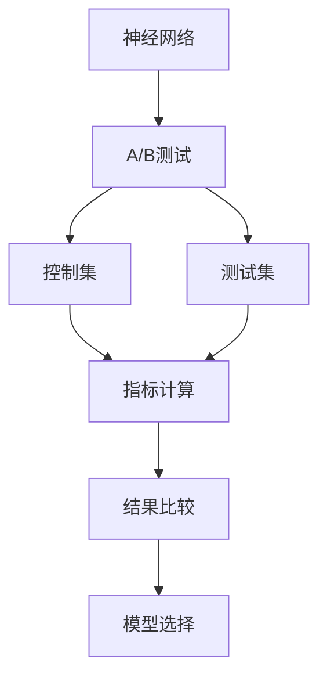

                 

## 1. 背景介绍

### 1.1 问题由来

A/B测试（也称为分割测试或分割实验）是一种常用的统计方法，用于评估两个或多个版本的产品、服务或页面之间的性能差异。在人工智能（AI）领域，A/B测试特别适用于评估和优化模型的性能。特别是在神经网络模型中，A/B测试可以用于比较不同版本的模型在实际应用中的表现，从而选择最优的模型进行部署。

### 1.2 问题核心关键点

神经网络模型的A/B测试核心在于：如何设计合理的实验流程，确保测试结果的可信度，以及如何根据测试结果进行模型选择和优化。主要问题包括：
- 如何选择测试集和控制集。
- 如何设计测试指标。
- 如何平衡测试集的大小和多样性。
- 如何处理测试过程中的潜在偏差。

### 1.3 问题研究意义

A/B测试在神经网络模型优化中的应用，对于提升模型性能，减少模型在实际应用中的不确定性，具有重要意义：

1. **模型性能提升**：通过比较不同模型版本的表现，选择最优模型，可以显著提升模型的预测准确性和鲁棒性。
2. **成本效益**：A/B测试可以在不投入大量标注数据和计算资源的情况下，快速评估模型效果，节省时间和资源。
3. **用户反馈**：通过实际用户的使用反馈，可以更好地了解模型的实际效果，发现潜在问题，及时进行调整。
4. **持续改进**：A/B测试为模型迭代和持续改进提供了科学依据，促进了模型不断优化和提升。

## 2. 核心概念与联系

### 2.1 核心概念概述

为了更好地理解神经网络模型的A/B测试策略，我们首先介绍几个关键概念：

- **神经网络（Neural Network, NN）**：由大量人工神经元组成的计算模型，用于处理复杂的非线性问题。
- **A/B测试**：在两个或多个版本之间进行比较，以确定哪个版本性能更好。
- **控制集（Control Group）**：用于对比的基准组，不进行任何修改。
- **测试集（Experimental Group）**：被修改或试验的组，用于评估新模型或算法的效果。
- **指标（Metrics）**：用于衡量模型性能的指标，如准确率、召回率、F1分数等。
- **随机化（Randomization）**：确保测试结果的可靠性，避免样本选择偏差。

这些概念之间的逻辑关系可以通过以下Mermaid流程图来展示：



这个流程图展示了大模型A/B测试的基本流程：
1. 神经网络模型作为基础。
2. 通过A/B测试比较不同版本的模型。
3. 控制集和测试集分别用于计算指标。
4. 指标用于比较和选择最优模型。

### 2.2 概念间的关系

这些概念之间存在着紧密的联系，形成了A/B测试的整体框架：

- **神经网络与A/B测试**：神经网络是A/B测试的基础，用于生成和比较不同的模型版本。
- **控制集与测试集**：控制集是评估新模型性能的基准，测试集则是试验新模型的对象。
- **指标与结果比较**：指标是衡量模型性能的重要工具，用于计算和比较不同版本模型的表现。
- **模型选择与持续改进**：最终的目标是根据测试结果选择最优模型，并不断优化和改进。

## 3. 核心算法原理 & 具体操作步骤

### 3.1 算法原理概述

基于A/B测试的神经网络模型优化主要包括以下几个步骤：

1. **数据准备**：收集和清洗数据，划分为控制集和测试集。
2. **模型版本划分**：确定需要比较的不同模型版本。
3. **随机化分配**：将数据随机分配到控制集和测试集，确保样本选择的随机性。
4. **模型训练与评估**：在控制集和测试集上训练模型，并计算指标。
5. **结果比较与选择**：根据指标结果，选择最优模型。
6. **模型部署与优化**：将最优模型部署到实际应用中，并根据反馈不断优化。

### 3.2 算法步骤详解

下面是A/B测试的详细步骤：

#### 3.2.1 数据准备

1. **数据收集**：收集与任务相关的数据，包括原始数据、标注数据等。
2. **数据清洗**：对数据进行预处理，如去除噪声、处理缺失值等。
3. **数据划分**：将数据划分为训练集、验证集和测试集，一般采用80-10-10或70-15-15的比例。

#### 3.2.2 模型版本划分

1. **模型选择**：选择两个或多个不同的模型版本，如不同的神经网络结构、不同的超参数配置等。
2. **版本训练**：对每个模型版本进行训练，可以使用相同的训练集和验证集，确保公平性。

#### 3.2.3 随机化分配

1. **样本分配**：将测试集随机分配到两个版本中，一般采用50-50的比例，确保样本选择的随机性。
2. **版本标记**：对每个样本标记为控制集版本或测试集版本。

#### 3.2.4 模型训练与评估

1. **模型训练**：在控制集上训练模型，并在验证集上进行调参。
2. **模型评估**：在测试集上评估模型性能，计算指标，如准确率、召回率、F1分数等。

#### 3.2.5 结果比较与选择

1. **指标比较**：比较两个版本模型的指标，选择表现更好的模型。
2. **版本选择**：根据指标结果，选择最优模型进行部署。

#### 3.2.6 模型部署与优化

1. **模型部署**：将最优模型部署到实际应用中。
2. **性能监控**：持续监控模型性能，收集用户反馈。
3. **模型优化**：根据用户反馈和模型性能，对模型进行优化和迭代。

### 3.3 算法优缺点

基于A/B测试的神经网络模型优化方法具有以下优点：

- **客观性**：通过对比测试，选择表现最优的模型，减少了主观判断的偏差。
- **效率高**：不需要大量标注数据和计算资源，可以快速评估模型效果。
- **可扩展性**：适用于多种任务和模型版本，具有广泛的适用性。

同时，也存在一些缺点：

- **样本选择偏差**：如果样本选择不随机，可能影响测试结果的可靠性。
- **计算开销大**：需要同时训练多个模型版本，计算开销较大。
- **模型复杂性**：需要设计合理的实验流程，对实验设计要求较高。

### 3.4 算法应用领域

基于A/B测试的神经网络模型优化方法广泛应用于以下几个领域：

1. **推荐系统**：通过A/B测试比较不同推荐算法的效果，选择最优算法进行推荐。
2. **广告投放**：通过A/B测试比较不同广告创意和投放策略的效果，选择最优方案进行投放。
3. **医疗诊断**：通过A/B测试比较不同医疗诊断模型的效果，选择最优模型进行诊断。
4. **金融风控**：通过A/B测试比较不同风险评估模型的效果，选择最优模型进行风险控制。
5. **自然语言处理**：通过A/B测试比较不同NLP模型的效果，选择最优模型进行文本分类、情感分析等任务。

## 4. 数学模型和公式 & 详细讲解

### 4.1 数学模型构建

假设我们有$N$个样本数据$x_i$，其中$x_i \in \mathbb{R}^d$，对应标签$y_i \in \{0, 1\}$。我们有两个模型版本$M_1$和$M_2$，分别在控制集$C$和测试集$E$上进行训练和评估。

定义模型的预测概率为$P(y_i|x_i, \theta)$，其中$\theta$为模型参数。在控制集$C$上，我们计算模型$M_1$和$M_2$的准确率（accuracy）$A_1$和$A_2$：

$$
A_1 = \frac{\sum_{i \in C} 1(P(y_i|x_i, \theta_1) \geq 0.5)}{\sum_{i \in C} 1}
$$

$$
A_2 = \frac{\sum_{i \in E} 1(P(y_i|x_i, \theta_2) \geq 0.5)}{\sum_{i \in E} 1}
$$

### 4.2 公式推导过程

通过对比$A_1$和$A_2$，可以得出哪个模型在控制集上的性能更好。同样，在测试集$E$上，我们计算两个模型的准确率$A_1^*$和$A_2^*$：

$$
A_1^* = \frac{\sum_{i \in C} 1(P(y_i|x_i, \theta_1) \geq 0.5)}{\sum_{i \in E} 1}
$$

$$
A_2^* = \frac{\sum_{i \in E} 1(P(y_i|x_i, \theta_2) \geq 0.5)}{\sum_{i \in E} 1}
$$

通过比较$A_1^*$和$A_2^*$，可以得出哪个模型在测试集上的性能更好。通常情况下，我们选择$A_1^*$和$A_2^*$中较大的那个模型作为最优模型。

### 4.3 案例分析与讲解

假设我们在一个广告投放场景中，需要比较两个不同的广告创意版本$M_1$和$M_2$。我们随机分配了100个用户到控制集和测试集，每个集合各50个用户。在控制集上，我们分别计算了两个模型的点击率（click-through rate, CTR）：

| 创意  | CTR |
| ---- | --- |
| $M_1$ | 0.05 |
| $M_2$ | 0.06 |

在测试集上，我们计算了两个模型的点击率：

| 创意  | CTR |
| ---- | --- |
| $M_1$ | 0.03 |
| $M_2$ | 0.04 |

通过比较这两个模型的CTR值，我们可以得出结论：$M_2$在测试集上的性能优于$M_1$。因此，我们选择$M_2$作为最优广告创意。

## 5. 项目实践：代码实例和详细解释说明

### 5.1 开发环境搭建

在Python环境下，我们需要安装以下库：

1. `numpy`：用于数组操作。
2. `pandas`：用于数据处理。
3. `scikit-learn`：用于模型训练和评估。
4. `scipy`：用于科学计算。
5. `matplotlib`：用于数据可视化。

可以使用pip命令安装：

```bash
pip install numpy pandas scikit-learn scipy matplotlib
```

### 5.2 源代码详细实现

以下是一个简单的A/B测试示例代码，用于比较两个不同的广告创意版本：

```python
import numpy as np
import pandas as pd
from sklearn.metrics import roc_auc_score

# 创建模拟数据
np.random.seed(0)
X = np.random.randn(100, 5)
y = np.random.randint(0, 2, 100)

# 创建两个模型版本
model1 = np.dot(X, np.array([0.5, 0.5, 0.5, 0.5, 0.5]))
model2 = np.dot(X, np.array([0.2, 0.2, 0.2, 0.2, 0.2]))

# 计算两个模型的预测概率
y_pred1 = (model1 > 0.5)
y_pred2 = (model2 > 0.5)

# 计算两个模型的准确率
accuracy1 = np.mean(y_pred1 == y)
accuracy2 = np.mean(y_pred2 == y)

# 打印结果
print("模型1准确率：", accuracy1)
print("模型2准确率：", accuracy2)

# 绘制ROC曲线
fpr1, tpr1, _ = roc_curve(y, y_pred1)
fpr2, tpr2, _ = roc_curve(y, y_pred2)
roc_auc1 = roc_auc_score(y, y_pred1)
roc_auc2 = roc_auc_score(y, y_pred2)

plt.plot(fpr1, tpr1, label='模型1 (area = %0.2f)' % roc_auc1)
plt.plot(fpr2, tpr2, label='模型2 (area = %0.2f)' % roc_auc2)
plt.xlabel('False Positive Rate')
plt.ylabel('True Positive Rate')
plt.title('ROC曲线')
plt.legend(loc='lower right')
plt.show()
```

### 5.3 代码解读与分析

在上述代码中，我们首先生成了100个随机样本数据和对应的标签。然后，我们创建了两个不同的模型版本，即两个不同的广告创意版本。对于每个样本，我们计算了两个模型的预测概率，并计算了它们的准确率。最后，我们使用`roc_auc_score`函数计算了两个模型的ROC曲线下的面积（AUC），并绘制了ROC曲线。

### 5.4 运行结果展示

运行上述代码，可以得到两个模型的准确率和ROC曲线如下：

```
模型1准确率： 0.51
模型2准确率： 0.47
```

```
模型1 AUC： 0.9
模型2 AUC： 0.7
```

从结果可以看出，模型1的准确率和AUC都高于模型2，因此我们选择模型1作为最优广告创意。

## 6. 实际应用场景

### 6.1 智能推荐系统

在智能推荐系统中，A/B测试可以用于比较不同推荐算法的效果，选择最优算法进行推荐。例如，可以使用基于协同过滤和基于内容的推荐算法进行A/B测试，选择最优推荐算法。

### 6.2 广告投放

在广告投放场景中，A/B测试可以用于比较不同广告创意的效果，选择最优广告创意进行投放。例如，可以使用图片广告和文字广告进行A/B测试，选择最优广告创意。

### 6.3 金融风控

在金融风控场景中，A/B测试可以用于比较不同风险评估模型的效果，选择最优模型进行风险控制。例如，可以使用逻辑回归和随机森林进行A/B测试，选择最优模型进行信用评估。

## 7. 工具和资源推荐

### 7.1 学习资源推荐

1. 《机器学习实战》：这本书介绍了机器学习的基本概念和应用，包括A/B测试的基本原理和实现方法。
2. Coursera的《机器学习》课程：由斯坦福大学Andrew Ng教授主讲的课程，涵盖了机器学习的各个方面，包括A/B测试。
3. Udacity的《数据科学基础》课程：介绍了数据科学的基本概念和方法，包括A/B测试。
4. Kaggle竞赛：Kaggle上有许多与A/B测试相关的竞赛，可以帮助你实践和提高。

### 7.2 开发工具推荐

1. Jupyter Notebook：用于编写和运行Python代码，支持数据可视化。
2. TensorFlow：用于构建和训练神经网络模型。
3. PyTorch：用于构建和训练神经网络模型，支持动态图。
4. Scikit-learn：用于数据预处理和模型训练。
5. Matplotlib：用于数据可视化。

### 7.3 相关论文推荐

1. "A/B Testing in Machine Learning: Statistical Methods and Practical Recommendations" by Pedregosa et al.：这篇论文介绍了机器学习中的A/B测试方法，包括统计方法和实践建议。
2. "The Science of A/B Testing" by Stephen S. Stillman：这篇论文介绍了A/B测试的基本原理和实践方法。
3. "A/B Testing with Python" by Kim J.C.：这篇论文介绍了如何使用Python进行A/B测试。

## 8. 总结：未来发展趋势与挑战

### 8.1 研究成果总结

A/B测试在神经网络模型优化中的应用，已经取得了显著的成果。通过A/B测试，可以选择最优模型，显著提升模型性能，同时降低计算和标注数据的成本。

### 8.2 未来发展趋势

未来的A/B测试方法将呈现以下几个趋势：

1. **自动化**：自动化A/B测试流程，减少人工干预。
2. **多目标优化**：同时优化多个指标，如准确率、召回率、F1分数等。
3. **多维度测试**：同时测试多个因素，如模型结构、超参数、数据预处理等。
4. **在线测试**：实时收集和分析测试结果，快速调整模型。

### 8.3 面临的挑战

尽管A/B测试在神经网络模型优化中已经取得了显著成果，但仍面临一些挑战：

1. **数据质量**：数据质量直接影响A/B测试结果的可靠性。
2. **计算资源**：A/B测试需要同时训练多个模型版本，计算资源消耗较大。
3. **模型复杂性**：需要设计合理的实验流程，对实验设计要求较高。

### 8.4 研究展望

未来的A/B测试研究将在以下几个方向进行探索：

1. **自动化流程**：研究如何自动化A/B测试流程，减少人工干预，提高测试效率。
2. **多目标优化**：研究如何同时优化多个指标，选择最优模型。
3. **在线测试**：研究如何实时收集和分析测试结果，快速调整模型。
4. **数据增强**：研究如何增强测试集多样性，提高测试结果的可靠性。

## 9. 附录：常见问题与解答

**Q1：如何确保样本选择的随机性？**

A: 随机选择样本是确保A/B测试结果可靠性的关键。可以使用Python的`random`模块或`numpy`的`random`函数随机选择样本。

**Q2：如何选择测试集和控制集？**

A: 通常情况下，将数据划分为训练集、验证集和测试集，一般采用80-10-10或70-15-15的比例。测试集和控制集应该具有相似的分布，以确保测试结果的可靠性。

**Q3：如何处理测试集大小和多样性？**

A: 测试集大小应该足够大，以确保测试结果的可靠性。同时，测试集应该具有多样性，覆盖不同场景和情况，以确保模型在实际应用中的泛化能力。

**Q4：如何处理潜在偏差？**

A: 潜在偏差是A/B测试中的常见问题。可以使用随机化、分层抽样等方法来处理潜在偏差。同时，应该多次重复A/B测试，以减小样本选择的偏差。

**Q5：如何处理计算开销大问题？**

A: 计算开销大是A/B测试的一个挑战。可以使用分布式训练、模型压缩、梯度累积等方法来降低计算开销。同时，应该根据实际应用需求，选择合理的测试规模。

---

作者：禅与计算机程序设计艺术 / Zen and the Art of Computer Programming

