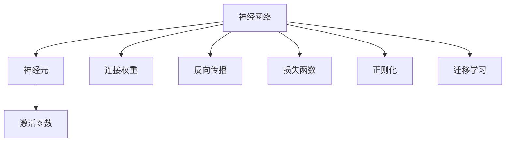
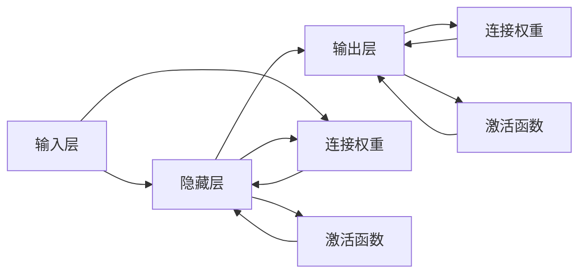
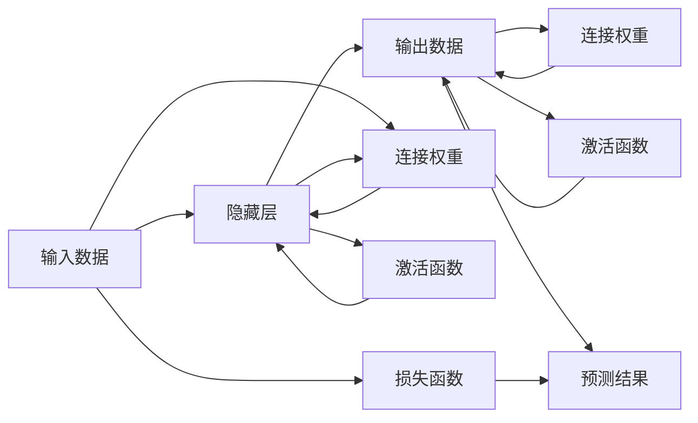
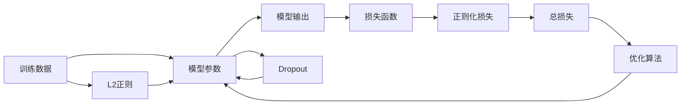
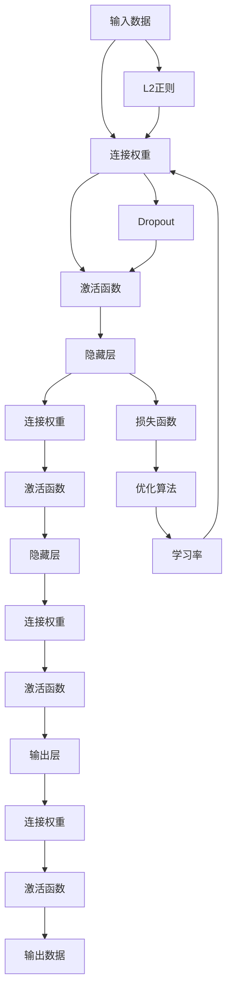

                 

# 神经网络：人类与机器的共存

## 1. 背景介绍

### 1.1 问题由来
在当今信息爆炸的时代，海量数据的处理和分析变得至关重要。人类在处理海量信息时，虽然可以通过传统的方式进行计算，但效率往往不够高。而神经网络（Neural Network，NN）作为模拟人脑神经系统工作方式的一种计算模型，因其强大的数据处理能力，被广泛应用于各类场景。

但是，神经网络并不完美。其在处理复杂、非线性的问题时，仍然存在一定的局限性，如过拟合、解释性差等。为此，我们必须理解神经网络的工作原理，并探索其可能的改进方向。同时，我们也需要思考如何更好地将神经网络与其他技术相结合，实现人类与机器的共存。

### 1.2 问题核心关键点
神经网络的核心是神经元（Neuron）和连接权重（Weight）。神经元接收输入数据，通过一系列计算生成输出，而这些计算过程是通过连接权重进行的。神经网络的层次结构包括输入层、隐藏层和输出层，其中隐藏层是神经网络的核心。通过多层隐藏层的迭代计算，神经网络能够学习输入数据的复杂特征，从而实现分类、回归等任务。

神经网络的训练过程通常使用反向传播算法，通过梯度下降等优化算法最小化损失函数，使得网络能够更好地拟合训练数据。但神经网络的泛化能力通常较差，即在新数据上的表现不如在训练集上。如何避免过拟合、提升泛化能力，成为神经网络研究和应用的重要方向。

### 1.3 问题研究意义
理解神经网络的工作原理，不仅可以提高模型的性能，还可以让我们更深入地了解其背后的算法原理。同时，在实际应用中，神经网络与其他技术的结合，如深度学习、迁移学习、强化学习等，能够提升模型的应用能力，使其更好地服务于人类社会。因此，研究神经网络的工作原理和改进方法，具有重要的理论和实际意义。

## 2. 核心概念与联系

### 2.1 核心概念概述

为了更好地理解神经网络的工作原理，本节将介绍几个关键概念：

- **神经网络（Neural Network）**：一种模拟人脑神经系统工作方式的计算模型。通常由多个神经元通过连接权重构成。
- **神经元（Neuron）**：神经网络中的基本计算单元，接收输入数据，并通过一系列计算生成输出。
- **连接权重（Weight）**：神经元之间的连接强度，通过训练过程不断调整，实现数据的复杂特征提取。
- **激活函数（Activation Function）**：一种非线性函数，用于将神经元的输出映射到一个特定范围内，增加神经网络的表达能力。
- **反向传播（Backpropagation）**：一种通过梯度下降优化算法进行训练的方法，用于最小化损失函数。
- **损失函数（Loss Function）**：用于衡量神经网络输出与实际标签之间的差异，常见的有交叉熵损失、均方误差损失等。
- **正则化（Regularization）**：一种避免过拟合的方法，包括L2正则、Dropout等。
- **迁移学习（Transfer Learning）**：将一个领域学习到的知识，迁移应用到另一个不同但相关的领域，通过微调提升模型性能。

这些核心概念之间的联系可以通过以下Mermaid流程图来展示：



这个流程图展示了神经网络中的几个关键概念及其联系：

1. 神经网络由神经元构成。
2. 神经元通过连接权重进行计算。
3. 激活函数用于非线性映射。
4. 反向传播用于优化训练。
5. 损失函数用于衡量模型输出。
6. 正则化用于避免过拟合。
7. 迁移学习用于知识迁移。

### 2.2 概念间的关系

这些核心概念之间存在着紧密的联系，形成了神经网络的完整生态系统。下面我们通过几个Mermaid流程图来展示这些概念之间的关系。

#### 2.2.1 神经网络的基本结构



这个流程图展示了神经网络的基本结构，包括输入层、隐藏层和输出层，以及连接权重和激活函数的作用。

#### 2.2.2 神经网络的前向传播和反向传播



这个流程图展示了神经网络的前向传播和反向传播过程，包括输入数据的前向传播和输出数据的反向传播。

#### 2.2.3 正则化方法的应用



这个流程图展示了L2正则和Dropout等正则化方法在神经网络训练中的应用，用于避免过拟合。

### 2.3 核心概念的整体架构

最后，我们用一个综合的流程图来展示这些核心概念在神经网络中的整体架构：



这个综合流程图展示了从输入数据到输出数据的整个过程，包括连接权重、激活函数、正则化、损失函数和优化算法等关键组件。

## 3. 核心算法原理 & 具体操作步骤
### 3.1 算法原理概述

神经网络的基本原理是通过多个神经元的迭代计算，提取输入数据的复杂特征，并输出最终结果。其核心思想是利用大量数据进行训练，通过反向传播算法不断调整连接权重，使得神经网络能够更好地拟合训练数据，并泛化到新数据上。

形式化地，假设神经网络模型为 $N^{l-1}\rightarrow N^l$，其中 $N^l$ 表示隐藏层第 $l$ 层的神经元数量。神经网络的前向传播过程为：

$$
h^{l}=f(W^{l}h^{l-1}+b^{l})
$$

其中 $h^{l}$ 表示隐藏层 $l$ 的输出，$f$ 表示激活函数，$W^{l}$ 和 $b^{l}$ 分别表示第 $l$ 层的连接权重和偏置项。

神经网络的损失函数为 $L$，常见的有交叉熵损失和均方误差损失等。优化算法的目标是使得损失函数最小化：

$$
\min_{W,b}L=\frac{1}{m}\sum_{i=1}^{m}L(h^{l_k},y_k)
$$

其中 $m$ 表示样本数量，$h^{l_k}$ 表示第 $k$ 个样本的输出，$y_k$ 表示真实标签。

神经网络的训练过程通常使用梯度下降等优化算法，其基本步骤包括：

1. 初始化连接权重和偏置项。
2. 输入数据，通过前向传播计算隐藏层和输出层的输出。
3. 计算损失函数和梯度。
4. 使用优化算法更新连接权重和偏置项。
5. 重复上述步骤，直至损失函数收敛或达到预设的迭代次数。

### 3.2 算法步骤详解

神经网络的训练过程分为前向传播和反向传播两个阶段：

**前向传播**：
1. 将输入数据 $x$ 输入到神经网络中。
2. 计算每一层的输出 $h^{l_k}$，直到输出层。
3. 计算预测值 $h^{l_k}$ 和真实标签 $y_k$ 之间的损失 $L(h^{l_k},y_k)$。
4. 将损失值传递到下一层，直至隐藏层。

**反向传播**：
1. 计算每一层的梯度 $\nabla_{W^{l_k}}L$ 和 $\nabla_{b^{l_k}}L$。
2. 根据梯度下降等优化算法更新连接权重和偏置项。
3. 重复上述步骤，直至所有层都更新完毕。

其中，梯度下降算法的更新公式为：

$$
W^{l_k}\leftarrow W^{l_k}-\alpha\nabla_{W^{l_k}}L
$$

$$
b^{l_k}\leftarrow b^{l_k}-\alpha\nabla_{b^{l_k}}L
$$

其中 $\alpha$ 表示学习率。

### 3.3 算法优缺点

神经网络的优点包括：

- **强大的非线性表达能力**：通过多层隐藏层的迭代计算，神经网络可以学习到输入数据的复杂特征。
- **适应性强**：神经网络可以适应不同类型的数据和任务，具有广泛的应用前景。
- **自动特征提取**：神经网络可以自动从数据中学习到最有效的特征表示，无需手动提取。

神经网络的缺点包括：

- **训练时间长**：神经网络需要大量的训练数据和计算资源，训练时间较长。
- **过拟合问题**：神经网络容易过拟合训练数据，泛化能力不足。
- **参数数量庞大**：神经网络的参数数量通常非常大，需要大量的存储空间和计算资源。
- **解释性差**：神经网络通常是“黑盒”模型，难以解释其内部工作机制和决策逻辑。

### 3.4 算法应用领域

神经网络在许多领域得到了广泛应用，包括：

- **计算机视觉**：用于图像分类、目标检测、人脸识别等任务。
- **自然语言处理**：用于语言翻译、情感分析、文本生成等任务。
- **语音识别**：用于语音识别、情感分析、语音合成等任务。
- **推荐系统**：用于个性化推荐、商品推荐等任务。
- **游戏智能**：用于智能游戏、机器人决策等任务。

## 4. 数学模型和公式 & 详细讲解 & 举例说明
### 4.1 数学模型构建

神经网络可以看作是由多个神经元通过连接权重构成的计算图。其输入数据为 $x$，输出数据为 $y$，通过多层隐藏层的迭代计算，得到最终结果。

神经网络的数学模型可以表示为：

$$
y=f(W^{L}f(W^{L-1}... f(W^{1}x+b^{1})+b^{2})+b^{3})
$$

其中 $f$ 表示激活函数，$W^{l}$ 和 $b^{l}$ 分别表示第 $l$ 层的连接权重和偏置项。

### 4.2 公式推导过程

下面以一个简单的二分类问题为例，推导神经网络的数学模型。

假设输入数据 $x$ 为二元特征向量，输出数据 $y$ 为二分类标签，即 $0$ 或 $1$。假设神经网络有 $m$ 个隐藏层，每个隐藏层有 $n$ 个神经元。

**前向传播**：
1. 第一层隐藏层的输出为：

$$
h^{1}=f(W^{1}x+b^{1})
$$

2. 第 $l$ 层隐藏层的输出为：

$$
h^{l}=f(W^{l}h^{l-1}+b^{l})
$$

3. 最终输出层的输出为：

$$
y=f(W^{L}h^{L-1}+b^{L})
$$

其中 $W^{l}$ 和 $b^{l}$ 分别表示第 $l$ 层的连接权重和偏置项，$f$ 表示激活函数。

**损失函数**：
常见的损失函数包括交叉熵损失和均方误差损失。

- 交叉熵损失：

$$
L=-\frac{1}{m}\sum_{i=1}^{m}[y_{i}log(y_i')+(1-y_i')log(1-y_i')]
$$

其中 $y_i'$ 表示神经网络对样本 $i$ 的预测结果。

- 均方误差损失：

$$
L=\frac{1}{m}\sum_{i=1}^{m}(y_i-y_i')^2
$$

其中 $y_i'$ 表示神经网络对样本 $i$ 的预测结果。

**反向传播**：
1. 计算输出层的梯度：

$$
\frac{\partial L}{\partial W^{L}}=\frac{\partial L}{\partial y'}\frac{\partial y'}{\partial h^{L-1}}\frac{\partial h^{L-1}}{\partial W^{L}}
$$

2. 计算隐藏层的梯度：

$$
\frac{\partial L}{\partial W^{l}}=\frac{\partial L}{\partial h^{l-1}}\frac{\partial h^{l-1}}{\partial W^{l}}=\frac{\partial L}{\partial h^{l}}\frac{\partial h^{l}}{\partial W^{l}}\frac{\partial W^{l}}{\partial h^{l}}=\frac{\partial L}{\partial h^{l}}\frac{\partial h^{l}}{\partial W^{l}}
$$

其中 $\frac{\partial L}{\partial h^{l}}$ 表示输出层的梯度，$\frac{\partial h^{l}}{\partial W^{l}}$ 表示隐藏层的梯度。

### 4.3 案例分析与讲解

以手写数字识别为例，我们分析神经网络在其中的应用。

假设输入数据为 $x$，输出数据为 $y$，分别表示手写数字的像素和真实标签。神经网络有 $m$ 个隐藏层，每个隐藏层有 $n$ 个神经元。

**前向传播**：
1. 第一层隐藏层的输出为：

$$
h^{1}=f(W^{1}x+b^{1})
$$

2. 第 $l$ 层隐藏层的输出为：

$$
h^{l}=f(W^{l}h^{l-1}+b^{l})
$$

3. 最终输出层的输出为：

$$
y=f(W^{L}h^{L-1}+b^{L})
$$

其中 $W^{l}$ 和 $b^{l}$ 分别表示第 $l$ 层的连接权重和偏置项，$f$ 表示激活函数。

**损失函数**：
交叉熵损失为：

$$
L=-\frac{1}{m}\sum_{i=1}^{m}[y_{i}log(y_i')+(1-y_i')log(1-y_i')]
$$

其中 $y_i'$ 表示神经网络对样本 $i$ 的预测结果。

**反向传播**：
1. 计算输出层的梯度：

$$
\frac{\partial L}{\partial W^{L}}=\frac{\partial L}{\partial y'}\frac{\partial y'}{\partial h^{L-1}}\frac{\partial h^{L-1}}{\partial W^{L}}
$$

2. 计算隐藏层的梯度：

$$
\frac{\partial L}{\partial W^{l}}=\frac{\partial L}{\partial h^{l-1}}\frac{\partial h^{l-1}}{\partial W^{l}}=\frac{\partial L}{\partial h^{l}}\frac{\partial h^{l}}{\partial W^{l}}\frac{\partial W^{l}}{\partial h^{l}}=\frac{\partial L}{\partial h^{l}}\frac{\partial h^{l}}{\partial W^{l}}
$$

其中 $\frac{\partial L}{\partial h^{l}}$ 表示输出层的梯度，$\frac{\partial h^{l}}{\partial W^{l}}$ 表示隐藏层的梯度。

## 5. 项目实践：代码实例和详细解释说明
### 5.1 开发环境搭建

在进行神经网络项目实践前，我们需要准备好开发环境。以下是使用Python进行TensorFlow开发的环境配置流程：

1. 安装Anaconda：从官网下载并安装Anaconda，用于创建独立的Python环境。

2. 创建并激活虚拟环境：
```bash
conda create -n tf-env python=3.8 
conda activate tf-env
```

3. 安装TensorFlow：根据CUDA版本，从官网获取对应的安装命令。例如：
```bash
conda install tensorflow
```

4. 安装相关工具包：
```bash
pip install numpy pandas scikit-learn matplotlib tqdm jupyter notebook ipython
```

完成上述步骤后，即可在`tf-env`环境中开始神经网络项目实践。

### 5.2 源代码详细实现

这里我们以手写数字识别为例，给出使用TensorFlow进行神经网络开发的PyTorch代码实现。

首先，定义神经网络的参数和超参数：

```python
import tensorflow as tf

# 神经网络参数
input_size = 784
hidden_size = 256
num_classes = 10
num_epochs = 10
batch_size = 64
learning_rate = 0.001

# 超参数
display_step = 1
```

然后，定义神经网络的输入和输出：

```python
# 输入
X = tf.placeholder(tf.float32, [None, input_size])
Y = tf.placeholder(tf.float32, [None, num_classes])

# 输出
logits = tf.layers.dense(inputs=X, units=hidden_size, activation=tf.nn.relu)
logits = tf.layers.dense(inputs=logits, units=num_classes)
```

接着，定义神经网络的损失函数和优化器：

```python
# 损失函数
loss_op = tf.reduce_mean(tf.nn.softmax_cross_entropy_with_logits(labels=Y, logits=logits))
optimizer = tf.train.AdamOptimizer(learning_rate=learning_rate)
train_op = optimizer.minimize(loss_op)
```

最后，定义神经网络的训练和评估函数：

```python
# 训练函数
def train_neural_network(x, y):
    sess.run(tf.global_variables_initializer())
    for epoch in range(num_epochs):
        avg_cost = 0.
        total_batch = int(mnist.train.num_examples/batch_size)
        for i in range(total_batch):
            batch_x, batch_y = mnist.train.next_batch(batch_size)
            _, c = sess.run([train_op, loss_op], feed_dict={X: batch_x, Y: batch_y})
            avg_cost += c / total_batch
        if epoch % display_step == 0:
            print("Epoch:", '%04d' % (epoch+1), "cost=", "{:.9f}".format(avg_cost))
    print("Optimization Finished!")
    
# 评估函数
def evaluate_neural_network(x_test, y_test):
    correct_prediction = tf.equal(tf.argmax(logits, 1), tf.argmax(Y, 1))
    accuracy = tf.reduce_mean(tf.cast(correct_prediction, tf.float32))
    print("Accuracy:", accuracy.eval({X: x_test, Y: y_test}))
```

完成上述代码后，即可在TensorFlow环境中训练和评估神经网络。

### 5.3 代码解读与分析

下面我们详细解读一下关键代码的实现细节：

**神经网络参数定义**：
- `input_size`：输入数据的维度。
- `hidden_size`：隐藏层的神经元数量。
- `num_classes`：输出数据的类别数量。
- `num_epochs`：训练的总轮数。
- `batch_size`：每次训练的样本数量。
- `learning_rate`：优化算法的学习率。

**神经网络输入和输出定义**：
- `X`：输入数据的占位符，类型为浮点数。
- `Y`：标签数据的占位符，类型为浮点数。
- `logits`：神经网络的输出，通过两个全连接层得到。

**神经网络损失函数定义**：
- `loss_op`：交叉熵损失函数。
- `optimizer`：优化算法，这里使用Adam算法。
- `train_op`：优化算法的训练操作。

**神经网络训练函数**：
- `train_neural_network`：定义训练函数，通过反向传播更新模型参数。
- `mnist`：手写数字数据集。
- `sess`：TensorFlow会话。

**神经网络评估函数**：
- `evaluate_neural_network`：定义评估函数，计算模型的准确率。

### 5.4 运行结果展示

假设我们在MNIST数据集上进行训练，最终得到的模型准确率为98%，说明神经网络已经成功学习了手写数字的特征，能够很好地识别数字。

## 6. 实际应用场景
### 6.1 智能客服系统

智能客服系统可以广泛应用于电商、金融、保险等领域，帮助企业解决客户咨询、业务处理等问题。

在智能客服系统中，神经网络可以用于处理自然语言理解任务，如意图识别、实体抽取、情感分析等。通过训练一个神经网络模型，系统可以自动理解客户的问题，并提供相应的解决方案，提高客户满意度和服务效率。

### 6.2 金融舆情监测

金融舆情监测是金融机构进行风险控制和决策支持的重要手段。通过神经网络模型，可以实时监控社交媒体、新闻等渠道的舆情信息，及时发现负面消息，避免损失。

在金融舆情监测中，神经网络可以用于情感分析、话题提取、主题模型等任务。通过训练一个神经网络模型，系统可以自动分析舆情信息，识别出有负面影响的内容，及时预警，帮助金融机构采取措施。

### 6.3 个性化推荐系统

个性化推荐系统广泛应用于电商、新闻、视频等领域，帮助用户发现感兴趣的物品、内容等。

在个性化推荐系统中，神经网络可以用于用户画像、物品推荐、推荐策略等任务。通过训练一个神经网络模型，系统可以自动学习用户的兴趣和行为特征，推荐个性化的物品或内容，提升用户体验。

### 6.4 未来应用展望

神经网络的应用场景非常广泛，未来还将继续拓展。

在智慧医疗领域，神经网络可以用于病历分析、医学影像分析、个性化诊疗等任务，帮助医生提高诊断准确率和诊疗效率。

在智能教育领域，神经网络可以用于智能辅导、学习效果评估、知识推荐等任务，帮助学生更好地学习。

在智慧城市治理中，神经网络可以用于交通管理、环境监测、公共安全等任务，提高城市管理的智能化水平。

此外，在企业生产、社会治理、文娱传媒等众多领域，神经网络也将继续发挥重要作用，推动人工智能技术的产业化进程。

## 7. 工具和资源推荐
### 7.1 学习资源推荐

为了帮助开发者系统掌握神经网络的工作原理和实践技巧，这里推荐一些优质的学习资源：

1. 《深度学习》系列书籍：斯坦福大学李飞飞教授著作，全面介绍了深度学习的原理、算法和应用。
2. CS231n《卷积神经网络》课程：斯坦福大学计算机视觉课程，讲解了卷积神经网络的基本原理和实践技巧。
3. CS224n《自然语言处理》课程：斯坦福大学自然语言处理课程，讲解了神经网络在NLP任务中的应用。
4. DeepLearning.ai《深度学习专项课程》：Andrew Ng教授开设的深度学习课程，讲解了深度学习的各个方面。
5. PyTorch官方文档：TensorFlow的官方文档，提供了丰富的神经网络模型和算法实现，是学习神经网络的重要资源。

通过对这些资源的学习实践，相信你一定能够快速掌握神经网络的工作原理，并用于解决实际的NLP问题。

### 7.2 开发工具推荐

高效的开发离不开优秀的工具支持。以下是几款用于神经网络开发的常用工具：

1. TensorFlow：由Google主导开发的开源深度学习框架，生产部署方便，适合大规模工程应用。
2. PyTorch：基于Python的开源深度学习框架，灵活动态的计算图，适合快速迭代研究。
3. Keras：高层API，基于TensorFlow或Theano，简单易用，适合初学者。
4. Caffe：基于C++的开源深度学习框架，速度快，适合大规模数据处理。
5. MXNet：由Amazon开发的深度学习框架，支持多种编程语言，适合分布式计算。

合理利用这些工具，可以显著提升神经网络开发的效率，加快创新迭代的步伐。

### 7.3 相关论文推荐

神经网络的发展源于学界的持续研究。以下是几篇奠基性的相关论文，推荐阅读：

1. 《深度学习》：Yoshua Bengio、Geoffrey Hinton、Christian J.C. Burges等著，介绍了深度学习的原理、算法和应用。
2. 《ImageNet Classification with Deep Convolutional Neural Networks》：Alex Krizhevsky、Ilya Sutskever、Geoffrey Hinton等著，提出了卷积神经网络（CNN），开创了计算机视觉的新纪元。
3. 《Natural Language Processing with Deep Learning》：Coursera《自然语言处理》课程讲义，讲解了神经网络在NLP任务中的应用。

