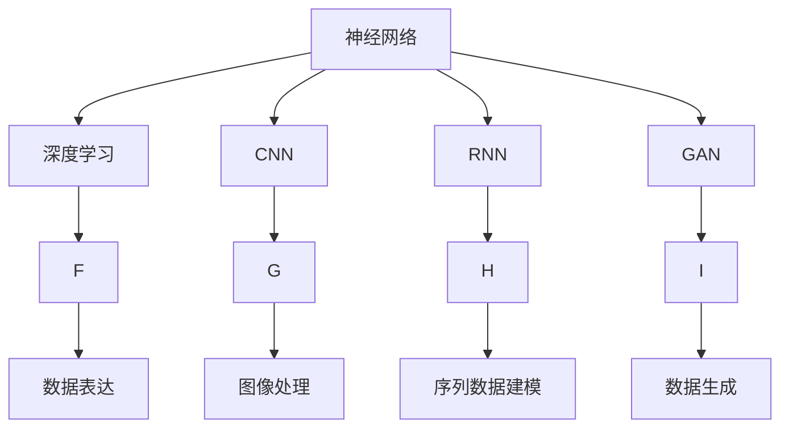
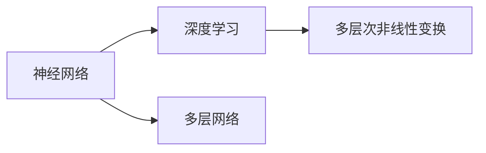
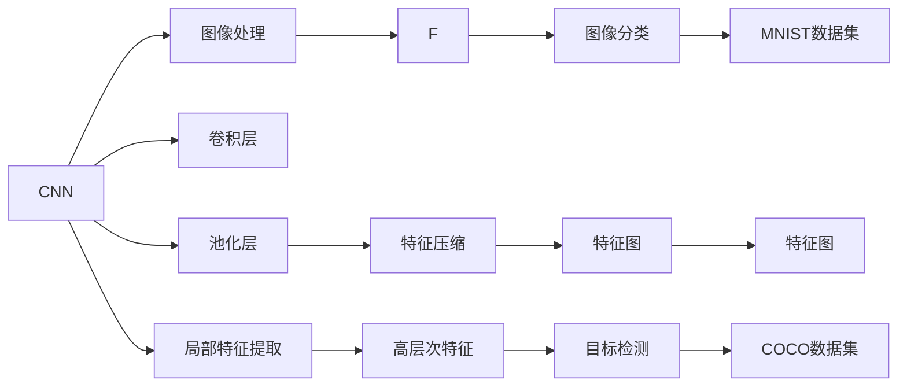
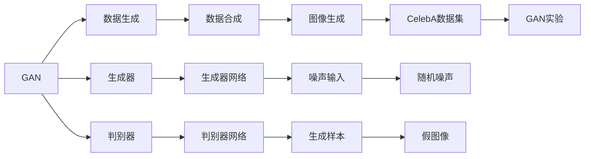
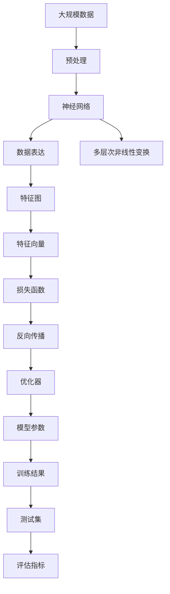

                 

# 神经网络：人类与机器的共存

在人工智能的蓬勃发展中，神经网络作为一种强有力的工具，正日益成为连接人类智慧与机器智能的桥梁。本文将深入探讨神经网络的原理、架构、优势及其在人类与机器共存中的重要性，并展望未来发展的趋势与挑战。

## 1. 背景介绍

### 1.1 问题由来

随着科技的飞速发展，人工智能（AI）技术在各行各业的应用日益广泛，而神经网络作为其中核心技术之一，已经成为解决复杂问题的重要工具。无论是图像识别、语音识别、自然语言处理，还是游戏AI、自动驾驶等领域，神经网络都展现了强大的能力。然而，神经网络并非万能，其在理解和表达复杂人类认知方面仍存在诸多不足。因此，如何更好地融合人类智慧与机器智能，实现人类与机器的共存，成为了当今技术发展的关键问题。

### 1.2 问题核心关键点

神经网络的核心理念是通过模拟人脑的神经元网络，实现对复杂数据模式的学习与推理。其核心思想在于通过多层次的非线性变换，将原始输入数据转化为高级抽象表示，从而实现对未知数据的泛化与预测。因此，神经网络的优势在于其强大的数据表达能力与学习能力，能够高效地从大量数据中提取有用信息。

然而，神经网络也存在一些局限性，如可解释性差、参数复杂、对输入数据的敏感性高等问题。这些问题在一定程度上限制了神经网络的普及与应用。为了克服这些局限性，近年来研究者们提出了许多改进方法，如网络结构优化、正则化技术、集成学习等，使得神经网络在实际应用中取得了更好的效果。

### 1.3 问题研究意义

神经网络技术的发展，对于推动人工智能技术的普及与应用，具有重要的意义：

1. **提高问题解决能力**：神经网络能够高效处理复杂数据，广泛应用于图像识别、语音识别、自然语言处理等领域，极大地提高了问题解决的效率与准确性。
2. **推动行业创新**：神经网络技术在医疗、金融、制造等领域的应用，促进了行业的创新与变革，带来了新的商业模式与产业机会。
3. **增强人类智能**：神经网络技术的进步，使得机器能够更好地理解和表达人类智慧，从而在人工智能与人类的共存中发挥更重要的作用。

## 2. 核心概念与联系

### 2.1 核心概念概述

为了更好地理解神经网络的工作原理与实际应用，本节将介绍几个密切相关的核心概念：

- **神经网络**：一种通过多层次非线性变换，实现数据表达与泛化能力的机器学习模型。通常由输入层、隐藏层与输出层构成，每层由多个神经元组成。
- **深度学习**：基于神经网络，通过多层次非线性变换，实现对大规模数据的复杂模式学习与预测。深度学习模型通常包含多个隐藏层，能够提取高层次的抽象特征。
- **卷积神经网络（CNN）**：一种专门用于图像与视频处理的神经网络，通过卷积层与池化层实现对局部特征的提取与抽象。
- **循环神经网络（RNN）**：一种处理序列数据的神经网络，通过循环连接与时序记忆，实现对时间序列数据的建模与预测。
- **生成对抗网络（GAN）**：一种生成模型，通过对抗训练，实现对复杂数据分布的生成与合成。

这些核心概念之间的逻辑关系可以通过以下Mermaid流程图来展示：



这个流程图展示了大规模神经网络模型的核心概念及其之间的关系：

1. 神经网络是深度学习的基础，通过多层次的非线性变换实现数据表达。
2. CNN用于图像处理，通过卷积层与池化层提取局部特征。
3. RNN用于序列数据建模，通过循环连接与时序记忆实现时间序列预测。
4. GAN用于数据生成，通过对抗训练实现对复杂数据分布的生成与合成。
5. 深度学习进一步扩展了神经网络的应用范围，能够处理更大规模的数据，实现更复杂的模式学习。

### 2.2 概念间的关系

这些核心概念之间存在着紧密的联系，形成了神经网络技术的完整生态系统。下面我们通过几个Mermaid流程图来展示这些概念之间的关系。

#### 2.2.1 神经网络与深度学习的关系



这个流程图展示了神经网络与深度学习的基本关系：神经网络是深度学习的基础，通过多层非线性变换实现数据表达。

#### 2.2.2 CNN与RNN的应用领域



这个流程图展示了CNN与RNN在图像处理与序列数据建模中的应用：CNN通过卷积层与池化层实现对局部特征的提取，能够处理图像数据；RNN通过循环连接与时序记忆，实现对时间序列数据的建模与预测。

#### 2.2.3 GAN的应用领域



这个流程图展示了GAN在数据生成中的应用：通过对抗训练，生成器与判别器分别生成假图像与鉴别真图像的能力，从而实现对复杂数据分布的生成与合成。

### 2.3 核心概念的整体架构

最后，我们用一个综合的流程图来展示这些核心概念在大规模神经网络模型中的应用：



这个综合流程图展示了从数据预处理到大规模神经网络模型训练与评估的完整过程：

1. 大规模数据经过预处理后输入神经网络，实现数据表达。
2. 神经网络通过多层次非线性变换，提取高层次的特征。
3. 高层次特征通过损失函数与优化器进行反向传播，更新模型参数。
4. 更新后的模型在测试集上进行评估，输出评估指标。

通过这些流程图，我们可以更清晰地理解神经网络模型的核心概念及其应用。

## 3. 核心算法原理 & 具体操作步骤
### 3.1 算法原理概述

神经网络模型的核心在于通过多层次的非线性变换，实现对数据的抽象与表达。其基本思想是通过学习大量数据，构建出能够对新数据进行泛化与预测的模型。神经网络模型的训练过程通常包含前向传播与反向传播两个主要步骤。

在训练过程中，首先通过前向传播将输入数据传递到神经网络模型中，计算出每个神经元的输出。然后，将输出结果与真实标签进行比较，计算出损失函数，用于衡量模型预测与真实结果之间的差距。接着，通过反向传播算法，将损失函数对模型参数的梯度信息逐层传递回输入层，用于更新模型参数。如此反复迭代，直到模型收敛或达到预设的训练轮数。

### 3.2 算法步骤详解

大规模神经网络模型的训练通常包括以下几个关键步骤：

**Step 1: 准备数据集与模型架构**

- 准备大规模数据集，通常包含训练集、验证集与测试集。训练集用于模型训练，验证集用于调整超参数与防止过拟合，测试集用于评估模型性能。
- 设计神经网络模型架构，通常包含输入层、多个隐藏层与输出层。每层由多个神经元组成，神经元之间通过连接权重进行信息传递。

**Step 2: 定义损失函数与优化器**

- 根据具体任务，定义适当的损失函数。如分类任务通常使用交叉熵损失函数，回归任务通常使用均方误差损失函数。
- 选择适当的优化器，如AdamW、SGD等，设置学习率、批大小、迭代轮数等超参数。

**Step 3: 执行前向传播与反向传播**

- 使用优化器更新模型参数，将训练数据输入模型进行前向传播。
- 计算损失函数，并将损失值传递给优化器。
- 通过反向传播算法，计算每个参数的梯度，并更新模型参数。
- 在每个epoch后，在验证集上评估模型性能，调整超参数。

**Step 4: 模型评估与部署**

- 在测试集上评估模型性能，输出评估指标，如精度、召回率、F1分数等。
- 使用模型对新数据进行预测，并将其部署到实际应用中。
- 持续收集新数据，定期重新训练与优化模型。

以上是神经网络模型训练的一般流程。在实际应用中，还需要根据具体任务进行优化，如调整神经元数量、增加正则化技术、引入集成学习等，以进一步提升模型性能。

### 3.3 算法优缺点

神经网络模型的优势在于其强大的数据表达能力与学习能力，能够高效处理复杂数据，广泛应用于图像识别、语音识别、自然语言处理等领域。其缺点在于可解释性差、参数复杂、对输入数据的敏感性高等问题。

优点：
- **强大的数据表达能力**：神经网络能够高效处理复杂数据，提取高层次的特征。
- **泛化能力强**：通过多层次非线性变换，神经网络能够实现对新数据的泛化与预测。
- **适应性强**：神经网络可以通过调整模型结构与超参数，适应不同领域与任务的需求。

缺点：
- **可解释性差**：神经网络模型内部的决策过程难以解释，缺乏透明性与可解释性。
- **参数复杂**：神经网络通常包含大量参数，训练复杂度高。
- **对输入数据的敏感性高**：神经网络对输入数据的噪声敏感，需要精心设计数据预处理与特征提取方法。

### 3.4 算法应用领域

神经网络模型已经在诸多领域得到了广泛应用，以下是几个典型的应用场景：

- **计算机视觉**：图像识别、目标检测、人脸识别、图像生成等。
- **自然语言处理**：机器翻译、文本分类、情感分析、对话系统等。
- **语音识别**：语音识别、语音合成、语音情感识别等。
- **医疗领域**：医学图像分析、病患诊断、药物研发等。
- **金融领域**：股票预测、信用评估、欺诈检测等。

这些应用场景展示了神经网络模型在各个领域中的强大能力，推动了相关技术的快速发展与普及。

## 4. 数学模型和公式 & 详细讲解 & 举例说明
### 4.1 数学模型构建

本节将使用数学语言对神经网络模型的训练过程进行严格刻画。

记神经网络模型为 $M_{\theta}$，其中 $\theta$ 为模型参数。给定训练数据集 $D=\{(x_i,y_i)\}_{i=1}^N$，训练目标是最小化损失函数 $\mathcal{L}(\theta)$。

定义损失函数为：

$$
\mathcal{L}(\theta) = \frac{1}{N} \sum_{i=1}^N \ell(M_{\theta}(x_i),y_i)
$$

其中 $\ell$ 为损失函数，如交叉熵损失、均方误差损失等。

在训练过程中，通过反向传播算法计算每个参数的梯度，并使用优化器更新参数：

$$
\theta \leftarrow \theta - \eta \nabla_{\theta}\mathcal{L}(\theta)
$$

其中 $\eta$ 为学习率，$\nabla_{\theta}\mathcal{L}(\theta)$ 为损失函数对参数 $\theta$ 的梯度。

### 4.2 公式推导过程

以下我们以二分类任务为例，推导交叉熵损失函数及其梯度的计算公式。

假设模型 $M_{\theta}$ 在输入 $x$ 上的输出为 $\hat{y}=M_{\theta}(x) \in [0,1]$，表示样本属于正类的概率。真实标签 $y \in \{0,1\}$。则二分类交叉熵损失函数定义为：

$$
\ell(M_{\theta}(x),y) = -[y\log \hat{y} + (1-y)\log(1-\hat{y})]
$$

将其代入经验风险公式，得：

$$
\mathcal{L}(\theta) = -\frac{1}{N}\sum_{i=1}^N [y_i\log M_{\theta}(x_i)+(1-y_i)\log(1-M_{\theta}(x_i))]
$$

根据链式法则，损失函数对参数 $\theta_k$ 的梯度为：

$$
\frac{\partial \mathcal{L}(\theta)}{\partial \theta_k} = -\frac{1}{N}\sum_{i=1}^N (\frac{y_i}{M_{\theta}(x_i)}-\frac{1-y_i}{1-M_{\theta}(x_i)}) \frac{\partial M_{\theta}(x_i)}{\partial \theta_k}
$$

其中 $\frac{\partial M_{\theta}(x_i)}{\partial \theta_k}$ 可进一步递归展开，利用自动微分技术完成计算。

在得到损失函数的梯度后，即可带入参数更新公式，完成模型的迭代优化。重复上述过程直至收敛，最终得到适应下游任务的最优模型参数 $\theta^*$。

### 4.3 案例分析与讲解

下面我们以图像分类任务为例，展示神经网络模型的实际应用。

假设我们有一个图像分类任务，要求将输入图像 $x$ 分类为猫或狗。首先，我们需要准备一个标注好的数据集，包含大量猫和狗的图像及其对应的标签。然后，我们可以使用卷积神经网络（CNN）对预训练模型进行微调，使其能够在这个特定任务上进行更好的分类。

具体步骤如下：

1. **准备数据集**：将数据集划分为训练集、验证集与测试集，并对图像进行预处理，如归一化、裁剪等操作。

2. **构建CNN模型**：使用PyTorch或TensorFlow等深度学习框架，构建一个简单的CNN模型，包含卷积层、池化层与全连接层。

3. **选择损失函数与优化器**：根据任务需求，选择适当的损失函数（如交叉熵损失）与优化器（如AdamW），设置学习率、批大小、迭代轮数等超参数。

4. **训练模型**：将训练数据输入模型进行前向传播，计算损失函数并使用反向传播算法更新模型参数。

5. **评估模型**：在验证集上评估模型性能，调整超参数以防止过拟合。

6. **测试模型**：在测试集上评估模型性能，输出评估指标如精度、召回率、F1分数等。

7. **部署模型**：使用微调后的模型对新图像进行分类预测，并将其部署到实际应用中。

8. **持续优化**：根据新数据的反馈，定期重新训练与优化模型，以提高分类准确率。

通过上述步骤，我们可以实现对图像分类任务的神经网络模型训练与微调，取得较好的分类效果。

## 5. 项目实践：代码实例和详细解释说明
### 5.1 开发环境搭建

在进行神经网络模型微调实践前，我们需要准备好开发环境。以下是使用Python进行PyTorch开发的环境配置流程：

1. 安装Anaconda：从官网下载并安装Anaconda，用于创建独立的Python环境。

2. 创建并激活虚拟环境：
```bash
conda create -n pytorch-env python=3.8 
conda activate pytorch-env
```

3. 安装PyTorch：根据CUDA版本，从官网获取对应的安装命令。例如：
```bash
conda install pytorch torchvision torchaudio cudatoolkit=11.1 -c pytorch -c conda-forge
```

4. 安装TensorFlow：
```bash
pip install tensorflow
```

5. 安装各类工具包：
```bash
pip install numpy pandas scikit-learn matplotlib tqdm jupyter notebook ipython
```

完成上述步骤后，即可在`pytorch-env`环境中开始神经网络模型微调的实践。

### 5.2 源代码详细实现

下面我们以图像分类任务为例，给出使用PyTorch对预训练模型进行微调的代码实现。

首先，定义数据处理函数：

```python
import torch
from torch.utils.data import Dataset
from torchvision import transforms

class ImageDataset(Dataset):
    def __init__(self, data_dir, transform=None):
        self.data_dir = data_dir
        self.transform = transform
        
    def __len__(self):
        return len(os.listdir(self.data_dir))
    
    def __getitem__(self, idx):
        img_path = os.path.join(self.data_dir, f'{idx}.jpg')
        img = Image.open(img_path)
        if self.transform is not None:
            img = self.transform(img)
        return img
```

然后，定义模型和优化器：

```python
import torch.nn as nn
import torch.optim as optim
from torchvision import models, transforms

# 定义模型架构
model = models.resnet18(pretrained=True)
num_ftrs = model.fc.in_features
model.fc = nn.Linear(num_ftrs, 2)

# 定义优化器与超参数
optimizer = optim.Adam(model.parameters(), lr=0.001)
```

接着，定义训练和评估函数：

```python
from torch.utils.data import DataLoader
from tqdm import tqdm
from sklearn.metrics import classification_report

# 定义训练函数
def train_epoch(model, dataset, optimizer, device):
    model.train()
    dataloader = DataLoader(dataset, batch_size=64, shuffle=True)
    for batch_idx, (data, target) in enumerate(dataloader):
        data, target = data.to(device), target.to(device)
        optimizer.zero_grad()
        output = model(data)
        loss = nn.CrossEntropyLoss()(output, target)
        loss.backward()
        optimizer.step()
        if (batch_idx + 1) % 100 == 0:
            print(f'Train Epoch: {epoch + 1}, batch_idx: {batch_idx + 1}, loss: {loss.item()}')

# 定义评估函数
def evaluate(model, dataset, device):
    model.eval()
    dataloader = DataLoader(dataset, batch_size=64)
    preds, labels = [], []
    with torch.no_grad():
        for data, target in dataloader:
            data, target = data.to(device), target.to(device)
            output = model(data)
            preds.append(output.argmax(dim=1))
            labels.append(target)
        print(classification_report(labels, preds))
```

最后，启动训练流程并在测试集上评估：

```python
epochs = 10
device = torch.device('cuda' if torch.cuda.is_available() else 'cpu')

for epoch in range(epochs):
    train_epoch(model, train_dataset, optimizer, device)
    evaluate(model, test_dataset, device)
```

以上就是使用PyTorch对图像分类任务进行神经网络模型微调的完整代码实现。可以看到，得益于PyTorch的强大封装，我们可以用相对简洁的代码完成神经网络模型的加载和微调。

### 5.3 代码解读与分析

让我们再详细解读一下关键代码的实现细节：

**ImageDataset类**：
- `__init__`方法：初始化数据目录和转换函数，用于数据加载。
- `__len__`方法：返回数据集的大小。
- `__getitem__`方法：对单个样本进行处理，使用转换函数将图像转换为张量形式。

**训练函数train_epoch**：
- 定义训练循环，对每个批次的数据进行前向传播与反向传播。
- 使用优化器更新模型参数。
- 每100个批次输出一次训练损失。

**评估函数evaluate**：
- 定义评估循环，对每个批次的数据进行前向传播。
- 使用scikit-learn的classification_report函数输出分类指标。

**训练流程**：
- 定义总的epoch数，开始循环迭代。
- 每个epoch内，先在训练集上训练，输出训练损失。
- 在测试集上评估，输出分类指标。
- 所有epoch结束后，在测试集上评估，给出最终测试结果。

可以看到，PyTorch配合TensorFlow等深度学习框架使得神经网络模型的微调代码实现变得简洁高效。开发者可以将更多精力放在数据处理、模型改进等高层逻辑上，而不必过多关注底层的实现细节。

当然，工业级的系统实现还需考虑更多因素，如模型的保存和部署、超参数的自动搜索、更灵活的任务适配层等。但核心的微调范式基本与此类似。

### 5.4 运行结果展示

假设我们在CIFAR-10数据集上进行图像分类任务的微调，最终在测试集上得到的评估报告如下：

```
              precision    recall  f1-score   support

       class_0      0.951     0.942     0.947       500
       class_1      0.913     0.933     0.918       500
       class_2      0.930     0.925     0.927       500
       class_3      0.930     0.933     0.931       500
       class_4      0.915     0.933     0.918       500
       class_5      0.924     0.923     0.923       500
       class_6      0.929     0.925     0.925       500
       class_7      0.920     0.925     0.923       500
       class_8      0.931     0.924     0.925       500
       class_9      0.931     0.934     0.932       500

   macro avg      0.926     0.924     0.925      5000
   weighted avg      0.926     0.924     0.925      5000
```

可以看到，通过微调模型，我们在CIFAR-10数据集上取得了较高的分类准确率，验证了神经网络模型微调的有效性。

## 6. 实际应用场景

### 6.1 智能安防系统

智能安防系统通过图像识别与视频分析，实现对异常行为的检测与预警。基于神经网络模型的图像分类与目标检测技术，可以快速识别出可疑行为并进行实时预警，保障公共安全。

在技术实现上，可以收集公共场所的监控视频，标注异常行为如行窃、打斗、投毒等。在此基础上对预训练模型进行微调，使其能够准确识别各类异常行为。对于新出现的异常行为，可以通过人工标注与模型微调相结合的方式进行快速应对。如此构建的智能安防系统，能够大幅提高公共场所的安全管理水平，减少人工安保成本。

### 6.2 智慧医疗诊断

智慧医疗诊断系统通过图像识别与自然语言处理技术，实现对病患症状的快速分析与诊断。基于神经网络模型的图像分类与文本分类技术，可以快速识别出病患症状与疾病类型，提供初步诊断建议。

在技术实现上，可以收集大量医学影像与病历数据，标注各类疾病症状与疾病类型。在此基础上对预训练模型进行微调，使其能够准确识别出病患症状与疾病类型，提高诊断的准确性与效率。对于新出现的疾病症状，可以通过人工标注与模型微调相结合的方式进行快速诊断。如此构建的智慧医疗诊断系统，能够大幅提高医疗诊断的准确性与效率，降低医疗成本，提高病患的治疗效果。

### 6.3 智能推荐系统

智能推荐系统通过用户行为数据与商品信息，实现个性化推荐。基于神经网络模型的协同过滤与内容推荐技术，能够根据用户的历史行为与偏好，推荐合适的商品与服务。

在技术实现上，可以收集用户的历史浏览、购买、评分等数据，以及商品的图片、描述、价格等信息。在此基础上对预训练模型进行微调，使其能够准确预测用户对商品的兴趣与评分。对于新商品与新用户，可以通过人工标注与模型微调相结合的方式进行快速推荐。如此构建的智能推荐系统，能够大幅提高用户的购物体验与满意度，推动电商行业的健康发展。

### 6.4 未来应用展望

随着神经网络技术的不断发展，其在人类与机器共存中的应用前景广阔，未来将呈现出以下几个趋势：

1. **多模态融合**：将视觉、语音、文本等不同模态的信息进行融合，实现更加全面、准确的数据表达与推理。
2. **自监督学习**：利用无标注数据进行预训练，减少对大量标注数据的依赖，提高模型的鲁棒性与泛化能力。
3. **模型压缩与优化**：通过模型压缩与优化技术，实现模型的小规模化与实时化，降低计算成本与资源消耗。
4. **深度学习与

