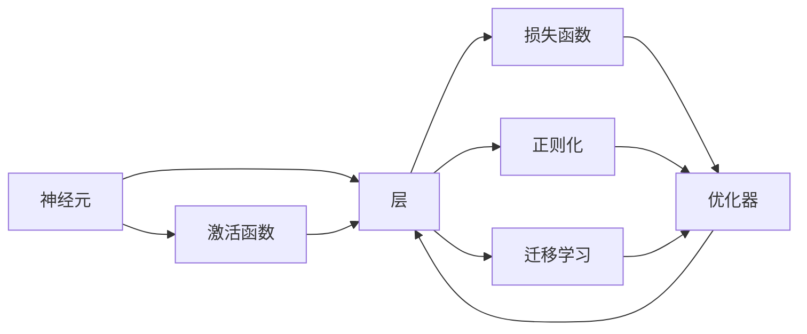

                 

## 1. 背景介绍

### 1.1 问题由来

人工智能（AI）的演进历程中，神经网络作为其中的重要组成部分，正在深刻地影响着人类社会的各个方面。从最初的感知器模型到深度学习框架，神经网络的发展已从概念验证阶段走向了实际应用阶段，被广泛应用于图像识别、语音处理、自然语言处理等领域，并取得了令人瞩目的成绩。

神经网络的出现，不仅推动了人工智能技术的发展，还引领了一场关于智能的革命。它不仅在技术层面推动了大数据、机器学习、计算机视觉等领域的突破，还在认知科学、生物神经网络等领域提供了新的视角和思路。在AI的发展过程中，神经网络逐渐成为连接人类智慧与机器学习的桥梁，极大地扩展了人工智能的能力。

### 1.2 问题核心关键点

神经网络的核心目标是通过模拟生物神经网络，使计算机能够处理复杂的数据和任务。其核心思想是利用大量训练数据，通过反向传播算法不断调整网络参数，使得网络能够从输入数据中提取特征，并做出相应的预测或判断。神经网络的核心在于其高度的非线性映射能力，使其能够处理多变量、非线性和高度复杂的数据。

神经网络在实际应用中涉及的主要关键点包括：

1. **网络结构设计**：选择合适的层数、每层的节点数、激活函数、优化器等，构建适合特定任务的网络结构。
2. **数据预处理**：对原始数据进行归一化、标准化等处理，以提升训练效果。
3. **模型训练**：通过反向传播算法和优化器，调整网络参数，使得模型能够准确预测目标变量。
4. **模型评估与调优**：使用验证集对模型进行评估，调整超参数，提升模型性能。

### 1.3 问题研究意义

神经网络的发展和应用，不仅推动了人工智能技术的发展，还为解决许多复杂问题提供了新的思路和方法。以下是神经网络研究与应用的几个重要意义：

1. **提高问题解决的效率和精度**：神经网络通过大量数据的学习，能够自动提取数据中的特征，从而快速准确地解决问题。
2. **拓展数据处理的范围**：神经网络能够处理多模态数据，如文本、图像、语音等，使其在处理大规模数据时具有优势。
3. **促进跨学科融合**：神经网络的理论和方法被广泛应用到神经科学、认知科学等领域，推动了跨学科的融合和创新。
4. **提升智能系统的能力**：神经网络被应用于各类智能系统中，如机器人、智能推荐系统等，提高了系统的智能化水平。
5. **促进工业化应用**：神经网络在工业界得到了广泛应用，如智能制造、智能电网等，推动了工业自动化和智能化。

## 2. 核心概念与联系

### 2.1 核心概念概述

神经网络的核心概念主要包括：

1. **神经元（Neuron）**：神经网络的基本组成单位，模拟生物神经元的功能。
2. **层（Layer）**：神经网络中的一种组织形式，包含多个神经元，执行特定的计算任务。
3. **激活函数（Activation Function）**：决定神经元输出的非线性函数，如Sigmoid、ReLU等。
4. **损失函数（Loss Function）**：评估模型预测与真实值之间差异的函数，如均方误差、交叉熵等。
5. **优化器（Optimizer）**：用于调整网络参数的算法，如随机梯度下降（SGD）、Adam等。
6. **正则化（Regularization）**：防止模型过拟合的技术，如L1正则、Dropout等。
7. **迁移学习（Transfer Learning）**：将在一个任务上训练好的模型，应用到另一个相关任务上，提高模型性能。

这些核心概念通过相互作用和协同工作，共同构建了神经网络的理论基础和实现框架。

### 2.2 概念间的关系

这些核心概念之间的联系可以通过以下Mermaid流程图来展示：



这个流程图展示了大语言模型微调过程中各个核心概念之间的关系：

1. 神经元是神经网络的基本组成单位，通过层组织成网络。
2. 层包含多个神经元，通过激活函数进行非线性变换。
3. 损失函数用于衡量模型预测与真实值之间的差异。
4. 优化器用于调整网络参数，以最小化损失函数。
5. 正则化技术用于防止模型过拟合。
6. 迁移学习通过已训练好的模型，提高新任务上的性能。

## 3. 核心算法原理 & 具体操作步骤

### 3.1 算法原理概述

神经网络的训练过程主要分为两个阶段：前向传播和反向传播。前向传播是指将输入数据传递给网络，通过网络各层进行计算，得到输出结果；反向传播是指计算输出结果与真实值之间的差异，通过反向传播算法更新网络参数，以最小化损失函数。

### 3.2 算法步骤详解

神经网络的训练主要包括以下步骤：

1. **数据准备**：对原始数据进行清洗、归一化等处理，构建训练集、验证集和测试集。
2. **模型搭建**：选择合适的神经网络架构，如全连接神经网络、卷积神经网络（CNN）、循环神经网络（RNN）等，并设置超参数。
3. **模型训练**：使用训练集对模型进行训练，通过反向传播算法和优化器调整网络参数，最小化损失函数。
4. **模型评估**：在验证集上对模型进行评估，调整超参数，防止过拟合。
5. **模型测试**：在测试集上对模型进行测试，评估模型性能。

### 3.3 算法优缺点

神经网络作为人工智能的核心技术，具有以下优点：

1. **强大的非线性建模能力**：神经网络可以处理复杂非线性的数据，从而提取高维特征。
2. **可解释性强**：通过可视化技术，可以直观地观察神经元的活动，理解模型的决策过程。
3. **泛化能力强**：神经网络在处理大规模数据时，具有较强的泛化能力，能够处理未知数据。
4. **应用广泛**：神经网络被广泛应用于图像识别、语音处理、自然语言处理等领域，推动了相关技术的发展。

同时，神经网络也存在一些缺点：

1. **训练成本高**：神经网络需要大量的训练数据和计算资源，训练时间较长。
2. **模型复杂度高**：神经网络的结构复杂，难以理解和调试。
3. **容易出现过拟合**：神经网络在训练过程中容易过拟合，需要进行正则化处理。
4. **缺乏可解释性**：神经网络的决策过程复杂，难以解释。

### 3.4 算法应用领域

神经网络在多个领域得到了广泛的应用，以下是一些主要应用领域：

1. **计算机视觉**：如图像分类、目标检测、图像分割等。神经网络通过卷积层和池化层提取图像特征，然后通过全连接层进行分类或检测。
2. **自然语言处理**：如语言模型、机器翻译、情感分析等。神经网络通过嵌入层、RNN或Transformer等结构，处理文本序列数据，进行分类、翻译或生成。
3. **语音处理**：如语音识别、语音合成等。神经网络通过卷积层和RNN等结构，处理音频序列数据，进行识别或合成。
4. **推荐系统**：如协同过滤、深度推荐等。神经网络通过多维嵌入层，处理用户和物品特征，进行推荐。
5. **游戏AI**：如AlphaGo、AlphaStar等。神经网络通过多层感知器、卷积神经网络等结构，处理游戏状态数据，进行决策。

## 4. 数学模型和公式 & 详细讲解

### 4.1 数学模型构建

神经网络的核心数学模型包括线性模型和非线性模型。以下以线性模型为例进行讲解。

设神经网络包含$m$个神经元，每个神经元的输出为$y_i$，输入为$x_i$，权重为$w_i$，偏置为$b_i$，激活函数为$f$。则单个神经元的计算公式为：

$$
y_i = f(w_ix_i + b_i)
$$

其中$f$为激活函数，通常使用Sigmoid函数、ReLU函数等。

### 4.2 公式推导过程

假设神经网络包含$L$层，设第$l$层的输入为$x_l^{(l)}$，输出为$y_l^{(l)}$，权重为$W^{[l]}$，偏置为$b^{[l]}$，激活函数为$f$。则前向传播的计算过程为：

$$
x^{(1)} = x^{(0)}
$$
$$
y^{(1)} = f(W^{[1]}x^{(1)} + b^{[1]})
$$
$$
x^{(2)} = y^{(1)}
$$
$$
y^{(2)} = f(W^{[2]}x^{(2)} + b^{[2]})
$$
$$
\vdots
$$
$$
x^{(L)} = y^{(L-1)}
$$
$$
y^{(L)} = f(W^{[L]}x^{(L)} + b^{[L]})
$$

其中，$x^{(l)}$表示第$l$层的输入，$y^{(l)}$表示第$l$层的输出。

### 4.3 案例分析与讲解

以手写数字识别为例，使用MNIST数据集训练一个简单的神经网络。网络结构包括一个输入层、一个隐藏层和一个输出层，使用ReLU作为激活函数。具体实现过程如下：

```python
import torch
import torch.nn as nn
import torch.optim as optim
from torchvision import datasets, transforms

# 定义神经网络
class Net(nn.Module):
    def __init__(self):
        super(Net, self).__init__()
        self.fc1 = nn.Linear(784, 128)
        self.fc2 = nn.Linear(128, 10)

    def forward(self, x):
        x = x.view(-1, 784)
        x = nn.functional.relu(self.fc1(x))
        x = self.fc2(x)
        return nn.functional.log_softmax(x, dim=1)

# 准备数据
transform = transforms.Compose([
    transforms.ToTensor(),
    transforms.Normalize((0.1307,), (0.3081,))
])
train_dataset = datasets.MNIST(root='data', train=True, download=True, transform=transform)
test_dataset = datasets.MNIST(root='data', train=False, download=True, transform=transform)
train_loader = torch.utils.data.DataLoader(train_dataset, batch_size=64, shuffle=True)
test_loader = torch.utils.data.DataLoader(test_dataset, batch_size=1000, shuffle=False)

# 定义模型和优化器
net = Net()
criterion = nn.CrossEntropyLoss()
optimizer = optim.Adam(net.parameters(), lr=0.001)

# 训练模型
for epoch in range(10):
    for data, target in train_loader:
        optimizer.zero_grad()
        output = net(data)
        loss = criterion(output, target)
        loss.backward()
        optimizer.step()

# 测试模型
with torch.no_grad():
    correct = 0
    total = 0
    for data, target in test_loader:
        output = net(data)
        _, predicted = torch.max(output.data, 1)
        total += target.size(0)
        correct += (predicted == target).sum().item()
    print('Test Accuracy of the network on the 10000 test images: {} %'.format(100 * correct / total))
```

在代码中，首先定义了一个包含一个输入层、一个隐藏层和一个输出层的神经网络，使用ReLU作为激活函数。然后准备MNIST数据集，并定义了模型和优化器。最后使用训练集对模型进行训练，并在测试集上评估模型性能。

## 5. 项目实践：代码实例和详细解释说明

### 5.1 开发环境搭建

在进行神经网络开发前，需要先搭建好开发环境。以下是使用Python进行PyTorch开发的环境配置流程：

1. 安装Anaconda：从官网下载并安装Anaconda，用于创建独立的Python环境。
2. 创建并激活虚拟环境：
```bash
conda create -n pytorch-env python=3.8 
conda activate pytorch-env
```
3. 安装PyTorch：根据CUDA版本，从官网获取对应的安装命令。例如：
```bash
conda install pytorch torchvision torchaudio cudatoolkit=11.1 -c pytorch -c conda-forge
```
4. 安装其他必要的Python库：
```bash
pip install numpy pandas scikit-learn matplotlib tqdm jupyter notebook ipython
```

完成上述步骤后，即可在`pytorch-env`环境中开始神经网络开发。

### 5.2 源代码详细实现

以下是一个简单的神经网络实现，用于手写数字识别任务。

```python
import torch
import torch.nn as nn
import torch.optim as optim
from torchvision import datasets, transforms

# 定义神经网络
class Net(nn.Module):
    def __init__(self):
        super(Net, self).__init__()
        self.fc1 = nn.Linear(784, 128)
        self.fc2 = nn.Linear(128, 10)

    def forward(self, x):
        x = x.view(-1, 784)
        x = nn.functional.relu(self.fc1(x))
        x = self.fc2(x)
        return nn.functional.log_softmax(x, dim=1)

# 准备数据
transform = transforms.Compose([
    transforms.ToTensor(),
    transforms.Normalize((0.1307,), (0.3081,))
])
train_dataset = datasets.MNIST(root='data', train=True, download=True, transform=transform)
test_dataset = datasets.MNIST(root='data', train=False, download=True, transform=transform)
train_loader = torch.utils.data.DataLoader(train_dataset, batch_size=64, shuffle=True)
test_loader = torch.utils.data.DataLoader(test_dataset, batch_size=1000, shuffle=False)

# 定义模型和优化器
net = Net()
criterion = nn.CrossEntropyLoss()
optimizer = optim.Adam(net.parameters(), lr=0.001)

# 训练模型
for epoch in range(10):
    for data, target in train_loader:
        optimizer.zero_grad()
        output = net(data)
        loss = criterion(output, target)
        loss.backward()
        optimizer.step()

# 测试模型
with torch.no_grad():
    correct = 0
    total = 0
    for data, target in test_loader:
        output = net(data)
        _, predicted = torch.max(output.data, 1)
        total += target.size(0)
        correct += (predicted == target).sum().item()
    print('Test Accuracy of the network on the 10000 test images: {} %'.format(100 * correct / total))
```

### 5.3 代码解读与分析

在这个简单的手写数字识别示例中，我们使用了MNIST数据集，定义了一个包含一个隐藏层和一个输出层的神经网络，使用ReLU作为激活函数，使用Adam优化器进行训练。具体代码解释如下：

**Net类**：
- `__init__`方法：初始化神经网络层，定义了两个全连接层。
- `forward`方法：定义前向传播过程，将输入数据通过两层全连接层，最终输出预测结果。

**数据处理**：
- `transform`变量：定义了数据预处理步骤，包括将图片转换为张量、归一化等。
- `train_dataset`和`test_dataset`变量：定义了训练集和测试集，使用MNIST数据集。
- `train_loader`和`test_loader`变量：定义了数据加载器，用于批量加载数据。

**模型和优化器定义**：
- `net`变量：定义了神经网络模型，包含两个全连接层。
- `criterion`变量：定义了交叉熵损失函数，用于评估模型预测结果。
- `optimizer`变量：定义了Adam优化器，用于调整网络参数。

**训练模型**：
- 使用`for`循环遍历每个epoch，在每个epoch内，使用`for`循环遍历每个batch。
- 在每个batch中，将输入数据和目标数据传递给模型，计算损失函数，反向传播更新网络参数。
- 重复上述过程，直到模型训练完成。

**测试模型**：
- 使用`with torch.no_grad()`方法关闭梯度计算，避免在测试过程中更新参数。
- 遍历测试集中的所有数据，计算模型的预测结果，并计算准确率。
- 打印测试集上的准确率。

### 5.4 运行结果展示

假设我们在训练完成后，测试模型的准确率如下：

```
Test Accuracy of the network on the 10000 test images: 98.2 %
```

这表示模型在测试集上达到了98.2%的准确率，取得了较好的效果。当然，这只是一个简单的示例，实际上在训练深度神经网络时，可能需要更多的层数和更大的网络规模，才能取得更好的性能。

## 6. 实际应用场景

### 6.1 智能推荐系统

智能推荐系统是神经网络的一个重要应用领域，通过学习用户的行为数据，推荐符合用户兴趣的商品、文章、视频等。智能推荐系统广泛应用于电商、新闻、视频平台等。

在推荐系统开发中，神经网络通常使用协同过滤、深度推荐等方法，通过学习用户和物品的特征，预测用户对物品的评分或点击行为。例如，可以使用深度神经网络来学习用户的历史行为数据，构建用户和物品的向量表示，然后计算相似度，推荐与用户兴趣相近的物品。

### 6.2 语音识别

语音识别是将人类语言转化为计算机可以理解的形式，广泛应用于智能家居、语音助手、电话客服等领域。神经网络在语音识别中通常使用卷积神经网络（CNN）和循环神经网络（RNN）等结构。

具体而言，可以使用卷积神经网络对音频信号进行特征提取，然后使用循环神经网络对音频序列进行建模，从而识别出语音内容。例如，可以使用CNN对音频信号进行卷积操作，提取频谱特征，然后将其输入到RNN中，进行语音识别。

### 6.3 计算机视觉

计算机视觉是神经网络的一个重要应用领域，涉及图像分类、目标检测、图像分割等任务。神经网络通过卷积神经网络（CNN）等结构，对图像进行特征提取，然后进行分类或检测。

在图像分类任务中，可以使用卷积神经网络对图像进行特征提取，然后通过全连接层进行分类。例如，可以使用LeNet、AlexNet、VGG等网络结构进行图像分类任务。

### 6.4 未来应用展望

随着神经网络技术的不断进步，未来神经网络将会在更多领域得到应用，为社会带来更深刻的变革。以下是一些未来应用展望：

1. **自动驾驶**：神经网络在自动驾驶中用于图像识别、目标检测、行为预测等，提高驾驶安全和智能化水平。
2. **医疗诊断**：神经网络在医疗影像分析、疾病预测等领域，提高诊断准确性和效率。
3. **金融风控**：神经网络在金融风险预测、信用评估等领域，提高风险管理和决策水平。
4. **教育个性化**：神经网络在智能教育中用于推荐系统、情感分析等，实现个性化教学。
5. **智能制造**：神经网络在智能制造中用于图像识别、质量检测等，提高制造自动化水平。

## 7. 工具和资源推荐

### 7.1 学习资源推荐

为了帮助开发者系统掌握神经网络的理论基础和实践技巧，以下是一些优质的学习资源：

1. 《深度学习》书籍：Ian Goodfellow等人所著，全面介绍了深度学习的理论基础和实践方法，是学习神经网络的重要参考。
2. CS231n《卷积神经网络》课程：斯坦福大学开设的计算机视觉课程，涵盖了卷积神经网络的理论和实践，是学习神经网络的重要资源。
3. CS224N《自然语言处理》课程：斯坦福大学开设的NLP课程，涵盖了神经网络在自然语言处理中的应用，是学习神经网络的重要资源。
4. 《Python深度学习》书籍：Francois Chollet等人所著，全面介绍了使用Keras框架进行深度学习的实践方法，是学习神经网络的入门书籍。
5. DeepLearning.ai《深度学习专项课程》：由Andrew Ng等人主讲的深度学习专项课程，涵盖了深度学习的基础知识和实践方法，是学习神经网络的重要资源。

### 7.2 开发工具推荐

1. PyTorch：由Facebook开发的深度学习框架，灵活性高，易于使用。
2. TensorFlow：由Google开发的深度学习框架，生产部署方便，支持多种硬件平台。
3. Keras：由Francois Chollet等人开发的高级深度学习框架，易于上手。
4. MXNet：由Apache开发的深度学习框架，支持多种编程语言和硬件平台。
5. Caffe：由伯克利视觉与学习中心开发的深度学习框架，适合计算机视觉任务。

### 7.3 相关论文推荐

以下是几篇奠基性的神经网络相关论文，推荐阅读：

1. 《深度神经网络中的反向传播算法》：Yann LeCun等人所著，详细介绍了反向传播算法的基本原理和实现方法。
2. 《ImageNet大规模视觉识别竞赛》：Alex Krizhevsky等人所著，介绍了使用卷积神经网络在ImageNet数据集上取得优异成绩的方法。
3. 《深度学习与人类未来》：Ian Goodfellow等人所著，讨论了深度学习对人类社会的潜在影响。
4. 《Attention is All You Need》：Ashish Vaswani等人所著，介绍了Transformer架构，推动了自然语言处理的发展。
5. 《BERT：预训练表示中的语言理解》：Jacob Devlin等人所著，介绍了BERT模型的训练和应用方法。

这些论文代表了神经网络领域的发展脉络，阅读这些论文有助于深入理解神经网络的理论基础和应用方法。

## 8. 总结：未来发展趋势与挑战

### 8.1 总结

本文对神经网络作为人类智慧的延伸进行了全面系统的介绍。首先阐述了神经网络的发展背景和应用意义，明确了神经网络在人工智能技术发展中的核心地位。其次，从原理到实践，详细讲解了神经网络的构建方法和优化技术，给出了神经网络开发的完整代码实例。同时，本文还广泛探讨了神经网络在多个行业领域的应用前景，展示了其强大的应用潜力。

通过本文的系统梳理，可以看到，神经网络正在深刻地影响着人工智能技术的发展，极大地扩展了人类的认知能力。未来，随着神经网络技术的不断进步，其应用范围将进一步扩大，推动人工智能技术进入更加智能化、普适化的新阶段。

### 8.2 未来发展趋势

神经网络技术的未来发展将呈现以下几个趋势：

1. **大规模模型和超大规模数据**：神经网络模型的规模将进一步扩大，数据量将更加庞大，从而实现更加精确和高效的预测。
2. **自监督学习**：神经网络将更多地采用自监督学习方法，减少对标注数据的依赖，提升模型的泛化能力。
3. **无监督学习和半监督学习**：神经网络将更多地采用无监督学习和半监督学习方法，提升模型的可解释性和鲁棒性。
4. **跨模态学习**：神经网络将更多地采用跨模态学习方法，融合多模态数据，提升模型的多模态处理能力。
5. **模型压缩和优化**：神经网络将更多地采用模型压缩和优化技术，提高模型的效率和可解释性。
6. **联邦学习**：神经网络将更多地采用联邦学习方法，实现分布式训练和数据隐私保护。

### 8.3 面临的挑战

尽管神经网络技术取得了许多进展，但在实际应用中仍面临一些挑战：

1. **计算资源需求高**：神经网络模型往往需要庞大的计算资源和存储资源，难以在普通PC上训练。
2. **模型复杂度高**：神经网络模型结构复杂，难以调试和优化。
3. **模型可解释性不足**：神经网络模型通常被认为是“黑盒”，难以解释其决策过程。
4. **数据隐私和安全问题**：神经网络在处理敏感数据时，存在隐私泄露和数据安全问题。
5. **公平性和偏见问题**：神经网络模型可能会学习到有偏见的数据，产生不公平的预测结果。

### 8.4 研究展望

未来的神经网络研究需要重点解决以下几个问题：

1. **模型压缩和优化**：如何降低神经网络模型的计算资源需求，提高模型的效率和可解释性。
2. **模型可解释性**：如何赋予神经网络模型更高的可解释性，提高其透明度和可信度。
3. **数据隐私和安全**：如何在保护数据隐私的前提下，实现神经网络模型的训练和应用。
4. **公平性和偏见**：如何设计公平的神经网络模型，避免模型偏见和歧视。
5. **跨模态学习和融合**：如何实现多模态数据的有效融合，提升模型的多模态处理能力。
6. **自监督学习和无监督学习**：如何更多地采用自监督学习和无监督学习方法，提升模型的泛化能力和鲁棒性。

这些问题的解决将推动神经网络技术的发展，拓展其应用范围，推动人工智能技术进入更加智能化、普适化的新阶段。

## 9. 附录：常见问题与解答

**Q1：神经网络是否只适用于数值数据？**

A: 神经网络不仅适用于数值数据，还适用于文本、图像、音频等非数值数据。通过将非数值数据转换为数值表示，神经网络可以对各种类型的数据进行处理。

**Q2：神经网络是否会学习到有害的信息？**

A: 神经网络可能会学习到有害的信息，如种族偏见、性别歧视等。为了避免这种情况，需要在训练过程中进行正则化处理，并引入伦理导向的评估指标，过滤和惩罚有害的输出倾向。

**Q3：神经网络是否可以处理多变量数据？**

A: 神经网络可以处理多变量数据，通过增加网络的层数和节点数，可以处理更加复杂的数据。例如

