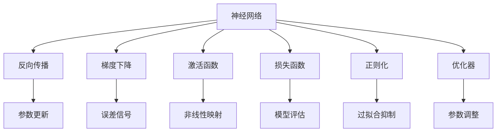
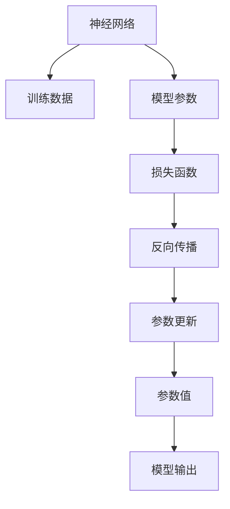
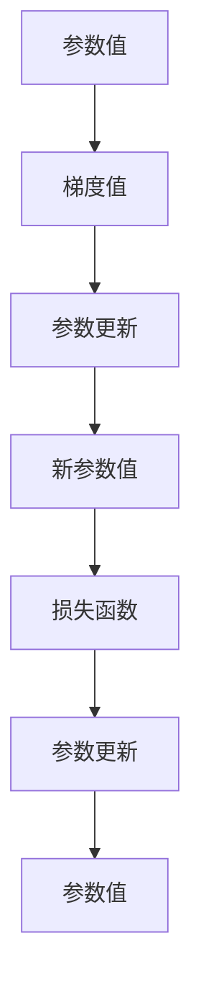
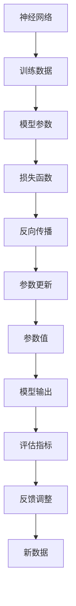

                 

# 神经网络：开启智能新纪元

## 1. 背景介绍

### 1.1 问题由来
随着人工智能技术的迅猛发展，神经网络（Neural Networks）已经成为了推动智能技术进步的重要驱动力。从语音识别、图像处理到自然语言处理、推荐系统，神经网络被广泛应用于各种领域，极大地提升了技术的应用水平和用户体验。

然而，尽管神经网络在许多任务上取得了卓越的成果，但其复杂的模型结构和训练过程仍存在诸多挑战。例如，模型的泛化能力、解释性、鲁棒性等都是神经网络面临的重要问题。因此，深入理解神经网络的原理和应用，对于推动智能技术的发展具有重要意义。

### 1.2 问题核心关键点
神经网络的核心思想是通过多层非线性变换，构建一个强大的函数映射。其核心构成包括输入层、隐藏层和输出层，每层由多个神经元组成，每个神经元接收来自前一层的输入，并输出给下一层。通过反向传播算法，神经网络能够自动学习输入与输出之间的映射关系，从而实现对未知数据的预测和分类。

神经网络的主要优点包括：
- 强大的表达能力：能够处理高度复杂的非线性映射。
- 自动学习：通过大量数据训练，能够自动提取特征，学习到数据的内部结构。
- 高效计算：使用高效的矩阵运算加速计算过程。

同时，神经网络也面临以下挑战：
- 过拟合：模型在训练数据上表现良好，但在新数据上表现不佳。
- 计算资源需求高：模型参数量大，训练和推理计算资源消耗大。
- 解释性不足：难以解释模型的决策过程，难以进行调试和优化。
- 鲁棒性问题：面对噪声、对抗样本等干扰，模型表现不稳定。

因此，在实践中，神经网络的设计和训练需要兼顾模型性能和计算效率，同时确保模型的可解释性和鲁棒性。

### 1.3 问题研究意义
神经网络作为智能技术的重要基石，其理论和应用的研究具有重要意义：

1. 提高智能技术水平：神经网络为人工智能提供了强大的计算和表达能力，是实现各种智能应用的基础。
2. 推动技术创新：神经网络的广泛应用带来了诸多前沿研究方向，如深度学习、迁移学习、强化学习等。
3. 加速产业发展：神经网络的应用能够显著降低技术开发成本，推动相关产业的快速成长。
4. 提升用户体验：神经网络能够实现语音识别、图像处理、自然语言处理等领域的智能化，极大地提升了用户的使用体验。
5. 拓展应用场景：神经网络在医疗、金融、教育、交通等领域具有广泛的应用前景，能够带来深远的社会经济效益。

## 2. 核心概念与联系

### 2.1 核心概念概述

为更好地理解神经网络的核心概念和应用，本节将介绍几个密切相关的核心概念：

- 神经网络（Neural Networks）：由多层神经元组成的计算模型，通过反向传播算法训练得到数据特征和规律。
- 反向传播算法（Backpropagation）：一种用于训练神经网络的算法，通过链式法则计算误差信号，反向更新网络参数。
- 梯度下降（Gradient Descent）：一种常用的优化算法，通过不断调整参数，使损失函数最小化。
- 激活函数（Activation Function）：一种非线性函数，将神经元的输入映射到输出，引入非线性因素，提升模型表达能力。
- 损失函数（Loss Function）：用于衡量模型预测与真实标签之间的差异，常见的有交叉熵损失、均方误差损失等。
- 正则化（Regularization）：一种防止模型过拟合的技术，如L2正则、Dropout等。
- 优化器（Optimizer）：一种用于调整神经网络参数的算法，如SGD、Adam等。

这些核心概念之间的逻辑关系可以通过以下Mermaid流程图来展示：

这个流程图展示了大语言模型的核心概念及其之间的关系：

1. 神经网络通过反向传播算法进行训练，更新参数以最小化损失函数。
2. 梯度下降算法用于更新神经网络参数，使之逼近最优解。
3. 激活函数引入非线性因素，增强模型的表达能力。
4. 损失函数用于评估模型预测与真实标签之间的差异。
5. 正则化技术防止模型过拟合。
6. 优化器调整参数，加快收敛速度。

这些核心概念共同构成了神经网络的学习和应用框架，使其能够在各种场景下发挥强大的智能处理能力。通过理解这些核心概念，我们可以更好地把握神经网络的工作原理和优化方向。

### 2.2 概念间的关系

这些核心概念之间存在着紧密的联系，形成了神经网络的完整生态系统。下面我通过几个Mermaid流程图来展示这些概念之间的关系。

#### 2.2.1 神经网络的学习范式

这个流程图展示了大语言模型的学习范式：

1. 神经网络接收训练数据作为输入。
2. 通过反向传播算法计算损失函数。
3. 参数更新以最小化损失函数。
4. 模型输出与真实标签进行对比，形成新的训练样本。

#### 2.2.2 反向传播算法的工作流程

这个流程图展示了反向传播算法的基本流程：

1. 输入数据经过前向传播计算输出。
2. 计算损失函数以评估模型预测。
3. 计算梯度信号。
4. 反向传播梯度信号，更新模型参数。

#### 2.2.3 梯度下降算法的工作流程

这个流程图展示了梯度下降算法的工作流程：

1. 获取当前参数值。
2. 计算梯度值。
3. 更新参数值。
4. 计算新损失函数值。
5. 更新新参数值。

### 2.3 核心概念的整体架构

最后，我们用一个综合的流程图来展示这些核心概念在大语言模型学习过程中的整体架构：

这个综合流程图展示了从数据输入到模型输出的完整过程。神经网络接收训练数据作为输入，通过反向传播算法计算损失函数，并更新模型参数以最小化损失函数。模型输出经过评估指标和反馈调整，用于指导新的数据输入和模型优化。通过这些流程图，我们可以更清晰地理解神经网络的学习和应用过程。

## 3. 核心算法原理 & 具体操作步骤
### 3.1 算法原理概述

神经网络的核心思想是通过多层非线性变换，构建一个强大的函数映射。其核心构成包括输入层、隐藏层和输出层，每层由多个神经元组成，每个神经元接收来自前一层的输入，并输出给下一层。通过反向传播算法，神经网络能够自动学习输入与输出之间的映射关系，从而实现对未知数据的预测和分类。

形式化地，假设神经网络包含 $L$ 层，第 $l$ 层的神经元数为 $n_l$，输入数据为 $\boldsymbol{x}$，输出为 $\boldsymbol{y}$，模型参数为 $\boldsymbol{\theta}$。神经网络的前向传播计算公式为：

$$
\boldsymbol{a}^{(l)}=\sigma(\boldsymbol{W}^{(l)}\boldsymbol{a}^{(l-1)}+\boldsymbol{b}^{(l)})\quad(1)
$$

其中，$\boldsymbol{a}^{(l)}$ 为第 $l$ 层的输出，$\boldsymbol{W}^{(l)}$ 为第 $l$ 层的权重矩阵，$\boldsymbol{b}^{(l)}$ 为第 $l$ 层的偏置向量，$\sigma$ 为激活函数。

神经网络的损失函数通常为交叉熵损失，即：

$$
\mathcal{L}(\boldsymbol{\theta})=-\frac{1}{N}\sum_{i=1}^N\sum_{j=1}^C y_{ij}\log\hat{y}_{ij}\quad(2)
$$

其中，$N$ 为训练样本数，$C$ 为输出类别数，$y_{ij}$ 为第 $i$ 个样本的第 $j$ 个类别的真实标签，$\hat{y}_{ij}$ 为第 $i$ 个样本的第 $j$ 个类别的预测概率。

神经网络的反向传播算法通过链式法则计算梯度，更新模型参数，以最小化损失函数。具体的梯度计算公式为：

$$
\frac{\partial \mathcal{L}}{\partial \boldsymbol{\theta}}=\frac{\partial \mathcal{L}}{\partial \boldsymbol{y}}\frac{\partial \boldsymbol{y}}{\partial \boldsymbol{a}^{(L)}}\frac{\partial \boldsymbol{a}^{(L)}}{\partial \boldsymbol{a}^{(L-1)}}...\frac{\partial \boldsymbol{a}^{(1)}}{\partial \boldsymbol{x}}\quad(3)
$$

其中，$\frac{\partial \mathcal{L}}{\partial \boldsymbol{y}}$ 为输出层损失函数对输出概率的梯度，$\frac{\partial \boldsymbol{y}}{\partial \boldsymbol{a}^{(L)}}$ 为输出层激活函数对输出概率的梯度，$\frac{\partial \boldsymbol{a}^{(L)}}{\partial \boldsymbol{a}^{(L-1)}}$ 为隐藏层激活函数对输出概率的梯度，依此类推。

### 3.2 算法步骤详解

神经网络的训练过程主要包括以下几个关键步骤：

**Step 1: 准备数据和模型**
- 收集并准备训练数据集 $\mathcal{D}=\{(\boldsymbol{x}_i, \boldsymbol{y}_i)\}_{i=1}^N$，其中 $\boldsymbol{x}_i$ 为输入，$\boldsymbol{y}_i$ 为输出。
- 定义神经网络的结构，包括输入层、隐藏层和输出层，设置各层的神经元数和激活函数。
- 随机初始化模型参数 $\boldsymbol{\theta}$。

**Step 2: 前向传播**
- 输入数据 $\boldsymbol{x}$，通过神经网络的前向传播计算输出 $\boldsymbol{y}$。

**Step 3: 计算损失函数**
- 计算预测输出 $\boldsymbol{y}$ 与真实标签 $\boldsymbol{y}$ 之间的交叉熵损失 $\mathcal{L}$。

**Step 4: 反向传播**
- 通过链式法则计算梯度 $\frac{\partial \mathcal{L}}{\partial \boldsymbol{\theta}}$。

**Step 5: 参数更新**
- 使用梯度下降等优化算法更新模型参数 $\boldsymbol{\theta}$。
- 设置合适的学习率 $\eta$ 和正则化参数 $\lambda$，防止过拟合。

**Step 6: 训练和验证**
- 重复上述步骤，直到模型在验证集上达到预设的性能指标。
- 定期在测试集上评估模型性能，以避免过拟合。

以上是神经网络的训练流程，通过多次迭代优化，神经网络能够逐渐学习到数据的内部结构，从而实现对未知数据的预测和分类。

### 3.3 算法优缺点

神经网络的主要优点包括：
1. 强大的表达能力：能够处理高度复杂的非线性映射。
2. 自动学习：通过大量数据训练，能够自动提取特征，学习到数据的内部结构。
3. 高效计算：使用高效的矩阵运算加速计算过程。

同时，神经网络也面临以下挑战：
1. 过拟合：模型在训练数据上表现良好，但在新数据上表现不佳。
2. 计算资源需求高：模型参数量大，训练和推理计算资源消耗大。
3. 解释性不足：难以解释模型的决策过程，难以进行调试和优化。
4. 鲁棒性问题：面对噪声、对抗样本等干扰，模型表现不稳定。

因此，在实践中，神经网络的设计和训练需要兼顾模型性能和计算效率，同时确保模型的可解释性和鲁棒性。

### 3.4 算法应用领域

神经网络已经广泛应用于各种领域，包括但不限于以下方面：

- 计算机视觉：图像分类、物体检测、人脸识别等。
- 自然语言处理：文本分类、机器翻译、语音识别等。
- 推荐系统：用户行为预测、物品推荐等。
- 医疗健康：疾病诊断、药物研发等。
- 金融科技：风险评估、欺诈检测等。
- 自动驾驶：环境感知、路径规划等。

除了上述这些典型应用外，神经网络还在游戏、音乐、艺术等领域得到了广泛应用，极大地推动了相关产业的发展。

## 4. 数学模型和公式 & 详细讲解 & 举例说明
### 4.1 数学模型构建

本节将使用数学语言对神经网络的基本原理和训练过程进行更加严格的刻画。

记神经网络包含 $L$ 层，第 $l$ 层的神经元数为 $n_l$，输入数据为 $\boldsymbol{x}$，输出为 $\boldsymbol{y}$，模型参数为 $\boldsymbol{\theta}$。神经网络的前向传播计算公式为：

$$
\boldsymbol{a}^{(l)}=\sigma(\boldsymbol{W}^{(l)}\boldsymbol{a}^{(l-1)}+\boldsymbol{b}^{(l)})\quad(1)
$$

其中，$\boldsymbol{a}^{(l)}$ 为第 $l$ 层的输出，$\boldsymbol{W}^{(l)}$ 为第 $l$ 层的权重矩阵，$\boldsymbol{b}^{(l)}$ 为第 $l$ 层的偏置向量，$\sigma$ 为激活函数。

神经网络的损失函数通常为交叉熵损失，即：

$$
\mathcal{L}(\boldsymbol{\theta})=-\frac{1}{N}\sum_{i=1}^N\sum_{j=1}^C y_{ij}\log\hat{y}_{ij}\quad(2)
$$

其中，$N$ 为训练样本数，$C$ 为输出类别数，$y_{ij}$ 为第 $i$ 个样本的第 $j$ 个类别的真实标签，$\hat{y}_{ij}$ 为第 $i$ 个样本的第 $j$ 个类别的预测概率。

神经网络的反向传播算法通过链式法则计算梯度，更新模型参数，以最小化损失函数。具体的梯度计算公式为：

$$
\frac{\partial \mathcal{L}}{\partial \boldsymbol{\theta}}=\frac{\partial \mathcal{L}}{\partial \boldsymbol{y}}\frac{\partial \boldsymbol{y}}{\partial \boldsymbol{a}^{(L)}}\frac{\partial \boldsymbol{a}^{(L)}}{\partial \boldsymbol{a}^{(L-1)}}...\frac{\partial \boldsymbol{a}^{(1)}}{\partial \boldsymbol{x}}\quad(3)
$$

其中，$\frac{\partial \mathcal{L}}{\partial \boldsymbol{y}}$ 为输出层损失函数对输出概率的梯度，$\frac{\partial \boldsymbol{y}}{\partial \boldsymbol{a}^{(L)}}$ 为输出层激活函数对输出概率的梯度，$\frac{\partial \boldsymbol{a}^{(L)}}{\partial \boldsymbol{a}^{(L-1)}}$ 为隐藏层激活函数对输出概率的梯度，依此类推。

### 4.2 公式推导过程

以下我们以二分类任务为例，推导交叉熵损失函数及其梯度的计算公式。

假设神经网络在输入 $\boldsymbol{x}$ 上的输出为 $\hat{y}=\sigma(\boldsymbol{W}\boldsymbol{x}+\boldsymbol{b})$，其中 $\sigma$ 为 sigmoid 激活函数。

根据交叉熵损失函数的定义，有：

$$
\mathcal{L}(\boldsymbol{\theta})=-\frac{1}{N}\sum_{i=1}^N(y_i\log \hat{y}_i+(1-y_i)\log (1-\hat{y}_i))\quad(4)
$$

其中，$y_i$ 为第 $i$ 个样本的真实标签，$\hat{y}_i$ 为神经网络对第 $i$ 个样本的预测概率。

对损失函数求 $\boldsymbol{\theta}$ 的梯度，有：

$$
\frac{\partial \mathcal{L}}{\partial \boldsymbol{\theta}}=-\frac{1}{N}\sum_{i=1}^N\left(\frac{y_i}{\hat{y}_i}-\frac{1-y_i}{1-\hat{y}_i}\right)\frac{\partial \hat{y}}{\partial \boldsymbol{\theta}}\quad(5)
$$

根据 $\hat{y}$ 对 $\boldsymbol{\theta}$ 的导数，有：

$$
\frac{\partial \hat{y}}{\partial \boldsymbol{\theta}}=\sigma(\boldsymbol{W}\boldsymbol{x}+\boldsymbol{b})\frac{\partial \sigma(\boldsymbol{W}\boldsymbol{x}+\boldsymbol{b})}{\partial \boldsymbol{\theta}}=\hat{y}(1-\hat{y})(\boldsymbol{W}\boldsymbol{x}+\boldsymbol{b})\frac{\partial \sigma(\boldsymbol{W}\boldsymbol{x}+\boldsymbol{b})}{\partial \boldsymbol{\theta}}\quad(6)
$$

将 $\frac{\partial \hat{y}}{\partial \boldsymbol{\theta}}$ 代入梯度公式，得到：

$$
\frac{\partial \mathcal{L}}{\partial \boldsymbol{\theta}}=-\frac{1}{N}\sum_{i=1}^N\left(\frac{y_i}{\hat{y}_i}-\frac{1-y_i}{1-\hat{y}_i}\right)\hat{y}(1-\hat{y})(\boldsymbol{W}\boldsymbol{x}+\boldsymbol{b})\frac{\partial \sigma(\boldsymbol{W}\boldsymbol{x}+\boldsymbol{b})}{\partial \boldsymbol{\theta}}\quad(7)
$$

进一步简化，有：

$$
\frac{\partial \mathcal{L}}{\partial \boldsymbol{\theta}}=-\frac{1}{N}\sum_{i=1}^N\left(\frac{y_i}{\hat{y}_i}-\frac{1-y_i}{1-\hat{y}_i}\right)\hat{y}(1-\hat{y})\boldsymbol{W}\boldsymbol{x}\quad(8)
$$

根据前向传播公式，有：

$$
\hat{y}=\sigma(\boldsymbol{W}\boldsymbol{x}+\boldsymbol{b})\quad(9)
$$

将 $\hat{y}$ 代入梯度公式，得到：

$$
\frac{\partial \mathcal{L}}{\partial \boldsymbol{\theta}}=-\frac{1}{N}\sum_{i=1}^N\left(\frac{y_i}{\sigma(\boldsymbol{W}\boldsymbol{x}+\boldsymbol{b})}-\frac{1-y_i}{1-\sigma(\boldsymbol{W}\boldsymbol{x}+\boldsymbol{b})}\right)\sigma(\boldsymbol{W}\boldsymbol{x}+\boldsymbol{b})(1-\sigma(\boldsymbol{W}\boldsymbol{x}+\boldsymbol{b}))\boldsymbol{W}\boldsymbol{x}\quad(10)
$$

将梯度公式代入反向传播公式，有：

$$
\frac{\partial \mathcal{L}}{\partial \boldsymbol{\theta}}=\frac{\partial \mathcal{L}}{\partial \boldsymbol{y}}\frac{\partial \boldsymbol{y}}{\partial \boldsymbol{a}^{(L)}}\frac{\partial \boldsymbol{a}^{(L)}}{\partial \boldsymbol{a}^{(L-1)}}...\frac{\partial \boldsymbol{a}^{(1)}}{\partial \boldsymbol{x}}\quad(3)
$$

其中，$\frac{\partial \mathcal{L}}{\partial \boldsymbol{y}}=-\frac{1}{N}\sum_{i=1}^N\left(\frac{y_i}{\sigma(\boldsymbol{W}\boldsymbol{x}+\boldsymbol{b})}-\frac{1-y_i}{1-\sigma(\boldsymbol{W}\boldsymbol{x}+\boldsymbol{b})}\right)$，$\frac{\partial \boldsymbol{y}}{\partial \boldsymbol{a}^{(L)}}=\sigma(\boldsymbol{W}\boldsymbol{a}^{(L-1)}+\boldsymbol{b})$，$\frac{\partial \boldsymbol{a}^{(L)}}{\partial \boldsymbol{a}^{(L-1)}}=\boldsymbol{W}^{(L)}$，依此类推。

通过这些公式的推导，可以更深刻地理解神经网络的数学原理和训练过程。

### 4.3 案例分析与讲解

为了更好地理解神经网络的训练过程，下面以一个简单的二分类任务为例进行案例分析。

假设我们有一个包含 $N=1000$ 个样本的数据集，每个样本有 $D=10$ 个特征。我们定义了一个包含 $L=2$ 层，每层有 $n_l=5$ 个神经元的神经网络，使用 sigmoid 激活函数。

首先，我们随机初始化模型参数 $\boldsymbol{\theta}$，并定义交叉熵损失函数：

$$
\mathcal{L}(\boldsymbol{\theta})=-\frac{1}{N}\sum_{i=1}^N(y_i\log \hat{y}_i+(1-y_i)\log (1-\hat{y}_i))
$$

然后，我们将训练数据输入神经网络，计算输出 $\boldsymbol{y}$：

$$
\boldsymbol{a}^{(1)}=\sigma(\boldsymbol{W}^{(1)}\boldsymbol{x}+\boldsymbol{b}^{(1)})=\sigma(\boldsymbol{W}^{(1)}\boldsymbol{x}+\boldsymbol{b}^{(1)})
$$

$$
\boldsymbol{a}^{(2)}=\sigma(\boldsymbol{W}^{(2)}\boldsymbol{a}^{(1)}+\boldsymbol{b}^{(2)})=\sigma(\boldsymbol{W}^{(2)}\boldsymbol{a}^{(1)}+\boldsymbol{b}^{(2)})
$$

$$
\boldsymbol{y}=\boldsymbol{W}^{(2)}\boldsymbol{a}^{(1)}+\boldsymbol{b}^{(2)}
$$

然后，我们计算损失函数 $\mathcal{L}$，并求梯度 $\frac{\partial \mathcal{L}}{\partial \boldsymbol{\theta}}$：

$$
\mathcal{L}(\boldsymbol{\theta})=-\frac{1}{N}\sum_{i=1}^N(y_i\log \hat{y}_i+(1-y_i)\log (1-\hat{y}_i))
$$

$$
\frac{\partial \mathcal{L}}{\partial \boldsymbol{\theta}}=-\frac{1}{N}\sum_{i=1}^N\left(\frac{y_i}{\hat{y}_i}-\frac{1-y_i}{1-\hat{y}_i}\right)\hat{y}(1-\hat{y})(\boldsymbol{W}^{(2)}\boldsymbol{a}^{(1)})\frac{\partial \sigma(\boldsymbol{W}^{(2)}\boldsymbol{a}^{(1)})}{\partial \boldsymbol{\theta}}
$$

其中，$\hat{y}=\sigma(\boldsymbol{W}^{(2)}\boldsymbol{a}^{(1)})$，$\frac{\partial \sigma(\boldsymbol{W}^{(2)}\boldsymbol{a}^{(1)})}{\partial \boldsymbol{\theta}}=\hat{y}(1-\hat{y})(\boldsymbol{W}^{(2)}\boldsymbol{a}^{(1)})$。

最后，我们使用梯度下降算法更新模型参数 $\boldsymbol{\theta}$，以最小化损失函数 $\mathcal{L}$。

通过这个案例，可以看到神经网络的训练过程是复杂的，涉及到大量的数学推导和计算。然而，正是这些复杂的数学推导和计算，使得神经网络能够从数据中自动学习到复杂的

