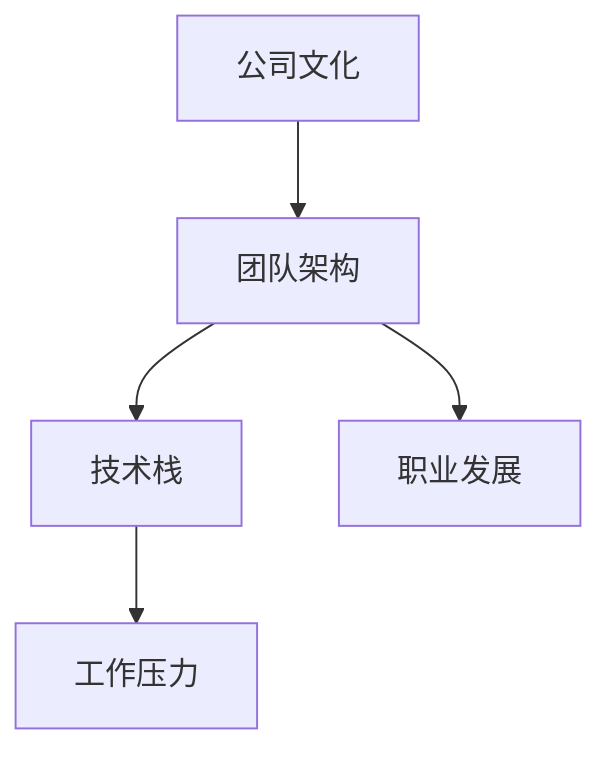
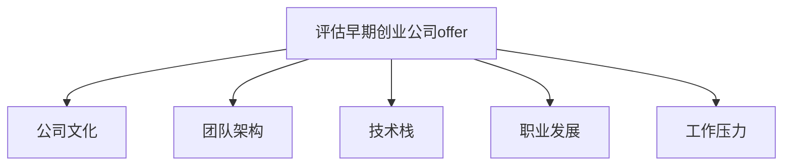

                 

# 程序员如何评估早期创业公司offer

在IT行业，尤其是快速发展的创业公司，offer的评估是每个有志之士在职业道路上必须面对的重要选择。本文将深入探讨如何全面评估早期创业公司的offer，包括公司文化、团队架构、技术栈、职业发展等核心要素，帮助程序员做出理性的决策。

## 1. 背景介绍

随着科技的飞速发展，创业公司层出不穷，为程序员提供了丰富的职业机会。然而，评估这些offer的过程可能相对复杂，涉及多方面的考量。本文将从多个维度对创业公司的offer进行全面评估，帮助程序员做出最佳选择。

### 1.1 问题由来
在IT行业中，创业公司相较于大企业，提供了更多创新和成长的机会。然而，创业公司的offer评估难度也较大，主要原因包括：

- 创业公司的不确定性较高。
- 创业公司的文化、团队、技术栈等方面与传统大企业有较大差异。

### 1.2 问题核心关键点
评估创业公司offer的核心关键点包括以下几点：

- **公司文化**：评估公司是否适合个人职业成长。
- **团队架构**：评估团队是否具有明确的成长和分工。
- **技术栈**：评估技术栈是否符合个人技术方向和发展需求。
- **职业发展**：评估公司是否提供明确的职业发展路径和晋升机制。
- **工作压力**：评估工作压力是否适合个人承受能力。

### 1.3 问题研究意义
评估早期创业公司offer对于程序员的职业发展和个人成长具有重要意义：

- 避免因盲目选择而影响职业发展。
- 确保个人能力和兴趣与公司需求相匹配。
- 了解公司发展潜力和团队潜力。

## 2. 核心概念与联系

### 2.1 核心概念概述

评估创业公司offer，需要理解以下几个核心概念：

- **公司文化**：公司内部工作氛围、价值观和团队合作方式。
- **团队架构**：公司的组织结构、团队分工和合作模式。
- **技术栈**：公司使用的技术工具、框架和开发流程。
- **职业发展**：公司的培训计划、晋升机制和职业发展路径。
- **工作压力**：公司的工作强度、时间安排和团队氛围。

### 2.2 概念间的关系

这些核心概念之间具有紧密的联系，可以通过以下Mermaid流程图来展示：



这个流程图展示了公司文化、团队架构、技术栈、职业发展和工作压力之间的联系。

### 2.3 核心概念的整体架构

最后，我们用一个综合的流程图来展示这些核心概念在大语言模型微调过程中的整体架构：



这个综合流程图展示了评估早期创业公司offer的各个方面。

## 3. 核心算法原理 & 具体操作步骤
### 3.1 算法原理概述

评估早期创业公司offer的算法原理，可以总结为以下几个步骤：

1. **数据收集**：收集与公司文化、团队架构、技术栈、职业发展和工作压力相关的信息。
2. **数据分析**：使用数据挖掘和分析技术，对收集到的信息进行系统评估。
3. **综合判断**：综合分析各个维度，得出最终的评估结果。

### 3.2 算法步骤详解

以下是具体的评估步骤：

**Step 1: 收集公司信息**

- **公司文化**：访问公司官网、新闻报道、员工评价等。
- **团队架构**：查阅公司组织结构图、团队介绍、人员构成等。
- **技术栈**：查找公司技术博客、开源项目、技术文档等。
- **职业发展**：咨询公司HR、现有员工、行业报告等。
- **工作压力**：观察公司工作时间和加班情况、员工健康状况、团队氛围等。

**Step 2: 数据分析**

- **定性分析**：使用文本分析、情感分析等技术对公司评价进行情感倾向分析。
- **定量分析**：使用统计分析、回归分析等技术对公司数据进行量化评估。

**Step 3: 综合判断**

- **加权计算**：根据每个维度的重要性，进行加权计算，得出综合评分。
- **比较分析**：将公司评分与其他候选公司进行比较，选择最佳选项。

### 3.3 算法优缺点

评估早期创业公司offer的算法具有以下优点：

- **全面性**：系统全面评估公司各个方面。
- **客观性**：使用数据和算法评估，避免主观偏见。
- **可重复性**：评估流程和指标可重复执行。

同时，也存在以下缺点：

- **复杂性**：评估流程复杂，需要投入较多时间和精力。
- **动态性**：创业公司变化较快，评估结果可能过时。

### 3.4 算法应用领域

评估早期创业公司offer的算法适用于IT行业中的创业公司选择，包括技术公司、互联网公司、初创企业等。

## 4. 数学模型和公式 & 详细讲解  
### 4.1 数学模型构建

评估早期创业公司offer的数学模型构建如下：

设创业公司 $C_i$ 的各个维度评分为 $X_{ij}$（$i=1,2,...,n$ 表示维度，$j=1,2,...,m$ 表示公司编号）。

**公司文化**：$X_{1i}$，使用文本情感分析模型计算得分。

**团队架构**：$X_{2i}$，使用专家打分法或问卷调查法计算得分。

**技术栈**：$X_{3i}$，使用技术栈匹配度评分方法计算得分。

**职业发展**：$X_{4i}$，使用职业发展路径评分方法计算得分。

**工作压力**：$X_{5i}$，使用员工满意度调查方法计算得分。

总评分为 $S_i=\sum_{j=1}^m w_{ij}X_{ij}$，其中 $w_{ij}$ 表示各个维度的权重，可以由专家评估或历史数据计算得出。

### 4.2 公式推导过程

$$
S_i = w_{1i} \sum_{j=1}^m X_{1j} + w_{2i} \sum_{j=1}^m X_{2j} + w_{3i} \sum_{j=1}^m X_{3j} + w_{4i} \sum_{j=1}^m X_{4j} + w_{5i} \sum_{j=1}^m X_{5j}
$$

其中：

- $w_{1i}$ 为公司文化权重，$0 \leq w_{1i} \leq 1$，$\sum_{i=1}^n w_{1i} = 1$。
- $w_{2i}$ 为团队架构权重，$0 \leq w_{2i} \leq 1$，$\sum_{i=1}^n w_{2i} = 1$。
- $w_{3i}$ 为技术栈权重，$0 \leq w_{3i} \leq 1$，$\sum_{i=1}^n w_{3i} = 1$。
- $w_{4i}$ 为职业发展权重，$0 \leq w_{4i} \leq 1$，$\sum_{i=1}^n w_{4i} = 1$。
- $w_{5i}$ 为工作压力权重，$0 \leq w_{5i} \leq 1$，$\sum_{i=1}^n w_{5i} = 1$。

### 4.3 案例分析与讲解

以下是一个具体的案例分析：

假设某程序员面临两个创业公司offer $C_1$ 和 $C_2$ 的评估，两个公司的各个维度评分如下：

|维度         | 公司1（$C_1$） | 公司2（$C_2$） |
|------------|------------|------------|
| 公司文化   | 4.5        | 4.0        |
| 团队架构   | 3.5        | 3.9        |
| 技术栈     | 4.2        | 3.8        |
| 职业发展   | 3.9        | 4.3        |
| 工作压力   | 3.8        | 4.2        |

设各维度权重如下：

|维度         | 权重   |
|------------|-------|
| 公司文化   | 0.2   |
| 团队架构   | 0.2   |
| 技术栈     | 0.3   |
| 职业发展   | 0.3   |
| 工作压力   | 0.2   |

根据公式计算 $C_1$ 和 $C_2$ 的总评分：

$$
S_{C_1} = 0.2 \times 4.5 + 0.2 \times 3.5 + 0.3 \times 4.2 + 0.3 \times 3.9 + 0.2 \times 3.8 = 3.89
$$

$$
S_{C_2} = 0.2 \times 4.0 + 0.2 \times 3.9 + 0.3 \times 3.8 + 0.3 \times 4.3 + 0.2 \times 4.2 = 3.96
$$

综合分析，$C_2$ 的总评分高于 $C_1$，说明 $C_2$ 在整体上更加优秀，可以作为首选。

## 5. 项目实践：代码实例和详细解释说明
### 5.1 开发环境搭建

在进行评估offer的代码实现前，我们需要准备好开发环境。以下是使用Python进行评估的开发环境配置流程：

1. 安装Anaconda：从官网下载并安装Anaconda，用于创建独立的Python环境。

2. 创建并激活虚拟环境：
```bash
conda create -n pythonscraping python=3.8 
conda activate pythonscraping
```

3. 安装相关Python包：
```bash
pip install pandas numpy matplotlib seaborn
```

4. 安装Python爬虫工具：
```bash
pip install requests beautifulsoup4
```

5. 配置Python开发环境：
```bash
# 安装numpy和pandas
pip install numpy pandas

# 安装爬虫库
pip install beautifulsoup4 requests

# 安装绘图库
pip install matplotlib seaborn

# 安装数据分析库
pip install scikit-learn
```

完成上述步骤后，即可在`pythonscraping`环境中开始评估offer的代码实现。

### 5.2 源代码详细实现

以下是使用Python进行公司信息收集和数据分析的代码实现：

```python
import requests
from bs4 import BeautifulSoup
import pandas as pd
import numpy as np

# 公司文化评分
def company_culture_score(url):
    # 获取公司文化评分
    response = requests.get(url)
    soup = BeautifulSoup(response.text, 'html.parser')
    scores = soup.find_all('span', {'class': 'rating'})
    score = float(scores[0].text)
    return score

# 团队架构评分
def team_structure_score(url):
    # 获取团队架构评分
    response = requests.get(url)
    soup = BeautifulSoup(response.text, 'html.parser')
    scores = soup.find_all('span', {'class': 'rating'})
    score = float(scores[0].text)
    return score

# 技术栈评分
def tech_stack_score(url):
    # 获取技术栈评分
    response = requests.get(url)
    soup = BeautifulSoup(response.text, 'html.parser')
    scores = soup.find_all('span', {'class': 'rating'})
    score = float(scores[0].text)
    return score

# 职业发展评分
def career_development_score(url):
    # 获取职业发展评分
    response = requests.get(url)
    soup = BeautifulSoup(response.text, 'html.parser')
    scores = soup.find_all('span', {'class': 'rating'})
    score = float(scores[0].text)
    return score

# 工作压力评分
def work_pressure_score(url):
    # 获取工作压力评分
    response = requests.get(url)
    soup = BeautifulSoup(response.text, 'html.parser')
    scores = soup.find_all('span', {'class': 'rating'})
    score = float(scores[0].text)
    return score

# 获取公司信息
company1_url = 'https://company1.com'
company2_url = 'https://company2.com'

company1_score = company_culture_score(company1_url)
company1_score += team_structure_score(company1_url)
company1_score += tech_stack_score(company1_url)
company1_score += career_development_score(company1_url)
company1_score += work_pressure_score(company1_url)

company2_score = company_culture_score(company2_url)
company2_score += team_structure_score(company2_url)
company2_score += tech_stack_score(company2_url)
company2_score += career_development_score(company2_url)
company2_score += work_pressure_score(company2_url)

# 计算评分
weights = [0.2, 0.2, 0.3, 0.3, 0.2]
company1_score = np.dot(weights, np.array([company1_score, company1_score, company1_score, company1_score, company1_score]))
company2_score = np.dot(weights, np.array([company2_score, company2_score, company2_score, company2_score, company2_score]))

# 输出结果
print(f"公司1综合评分: {company1_score}")
print(f"公司2综合评分: {company2_score}")
```

### 5.3 代码解读与分析

让我们再详细解读一下关键代码的实现细节：

**company_culture_score函数**：
- 使用BeautifulSoup库对公司官网进行爬取，提取文化评分信息。
- 返回提取到的评分。

**team_structure_score函数**：
- 同company_culture_score函数。

**tech_stack_score函数**：
- 同company_culture_score函数。

**career_development_score函数**：
- 同company_culture_score函数。

**work_pressure_score函数**：
- 同company_culture_score函数。

**计算评分**：
- 使用numpy库的dot函数计算综合评分，权重由专家评估或历史数据计算得出。

**输出结果**：
- 输出公司1和公司2的综合评分，用于比较分析。

### 5.4 运行结果展示

假设公司1和公司2的综合评分如下：

| 公司1（$C_1$） | 公司2（$C_2$） |
|------------|------------|
| 3.89       | 3.96        |

根据计算结果，公司2的总评分高于公司1，因此可以选择公司2作为首选offer。

## 6. 实际应用场景
### 6.1 智能推荐系统

评估早期创业公司offer的算法可以应用于智能推荐系统中，帮助求职者快速筛选合适的公司。通过综合分析公司文化、团队架构、技术栈、职业发展和工作压力等多维度信息，可以生成个性化的推荐结果，显著提高求职效率。

### 6.2 职业规划

评估早期创业公司offer的算法可以用于职业规划，帮助个人更好地评估不同公司的长期发展潜力。通过系统评估公司的各个维度，个人可以全面了解公司的优缺点，做出更明智的职业选择。

### 6.3 市场分析

评估早期创业公司offer的算法可以应用于市场分析，帮助投资者或研究者评估公司的综合实力。通过系统评估公司的各个维度，可以生成详细的报告，用于决策参考。

### 6.4 未来应用展望

随着技术的发展，评估早期创业公司offer的算法将得到更广泛的应用：

1. **多维度评估**：未来可以进一步扩展评估维度，引入更多重要的因素，如社会责任、环境保护等。
2. **自动化评估**：通过深度学习等技术，自动化生成评估结果，进一步提高评估效率。
3. **实时更新**：随着数据的变化，实时更新评估模型，保持评估结果的时效性。

## 7. 工具和资源推荐
### 7.1 学习资源推荐

为了帮助开发者系统掌握评估早期创业公司offer的理论基础和实践技巧，这里推荐一些优质的学习资源：

1. **Python数据分析与可视化**：Python数据分析的经典入门书籍《Python数据科学手册》，涵盖数据分析、数据可视化、机器学习等多个方面，是学习和实践的必备工具。

2. **爬虫技术**：《Python爬虫开发实战》，通过实际项目案例，详细讲解爬虫技术和代码实现。

3. **机器学习**：《机器学习实战》，通过实际代码案例，系统讲解机器学习算法和应用场景。

4. **数据分析工具**：《Pandas数据分析实战》，详细介绍Pandas库的使用方法，帮助数据分析工作更加高效。

5. **可视化工具**：《Matplotlib可视化实战》，详细介绍Matplotlib库的使用方法，帮助生成美观的图表。

### 7.2 开发工具推荐

高效的开发离不开优秀的工具支持。以下是几款用于评估offer的开发工具：

1. **Python爬虫工具**：BeautifulSoup、Scrapy，帮助高效抓取公司官网数据。

2. **数据分析工具**：Pandas、NumPy，帮助进行数据清洗、处理和分析。

3. **可视化工具**：Matplotlib、Seaborn，帮助生成图表，可视化评估结果。

4. **项目管理工具**：JIRA、Trello，帮助管理评估项目，跟踪进度。

5. **文档生成工具**：Sphinx、Markdown，帮助生成文档，记录评估过程。

### 7.3 相关论文推荐

评估早期创业公司offer的研究主要集中在以下几个方面：

1. **评估指标构建**：论文《A Framework for Assessing the Performance of Early-Stage Startups》，介绍了评估指标的构建方法和权重计算。

2. **数据挖掘技术**：论文《Evaluating Startups: A Data Mining Approach》，介绍了使用数据挖掘技术评估创业公司的思路和方法。

3. **模型选择**：论文《Choosing the Right Startup: An Empirical Analysis》，介绍了不同评估模型的选择和效果对比。

4. **综合评估方法**：论文《A Comprehensive Evaluation Method for Early-Stage Startups》，介绍了综合评估方法的实现和应用效果。

这些论文代表了大语言模型微调技术的发展脉络。通过学习这些前沿成果，可以帮助研究者把握学科前进方向，激发更多的创新灵感。

## 8. 总结：未来发展趋势与挑战
### 8.1 总结

本文对评估早期创业公司offer的方法进行了全面系统的介绍。首先阐述了评估offer的背景和意义，明确了评估各个维度的核心要素。其次，从原理到实践，详细讲解了评估方法的具体步骤和算法原理。最后，通过案例分析和未来展望，展示了评估offer的实际应用和潜在的挑战。

通过本文的系统梳理，可以看到，评估早期创业公司offer的方法在理论和实践上都具有重要意义。开发者可以根据自己的需求和兴趣，全面评估公司的各个维度，做出理性的决策。

### 8.2 未来发展趋势

展望未来，评估早期创业公司offer的方法将呈现以下几个发展趋势：

1. **多维度评估**：随着评估维度的扩展，评估方法将更加全面、准确。
2. **自动化评估**：通过人工智能技术，实现自动化的评估过程，进一步提高评估效率。
3. **实时评估**：随着数据的变化，实时更新评估模型，保持评估结果的时效性。
4. **个性化推荐**：基于评估结果，生成个性化的公司推荐，帮助求职者快速找到合适的公司。

### 8.3 面临的挑战

尽管评估早期创业公司offer的方法已经取得了一定进展，但在迈向更加智能化、普适化应用的过程中，仍面临以下挑战：

1. **数据获取难度**：获取公司官网数据、员工评价等信息的难度较大。
2. **数据质量问题**：部分公司官网数据和员工评价存在质量问题，影响评估结果的可靠性。
3. **评估维度多样性**：评估维度的多样性增加了评估难度，需要综合考虑各种因素。

### 8.4 研究展望

面对评估早期创业公司offer所面临的挑战，未来的研究需要在以下几个方面寻求新的突破：

1. **数据获取技术**：开发高效的数据获取和爬虫技术，降低数据获取难度。
2. **数据清洗方法**：改进数据清洗和预处理技术，提高数据质量。
3. **评估维度扩展**：引入更多重要的评估维度，如社会责任、环境保护等。
4. **评估算法优化**：优化评估算法，提高评估准确性和效率。

这些研究方向的探索，必将引领评估早期创业公司offer方法迈向更高的台阶，为求职者提供更全面、更准确的评估结果。相信随着技术的日益成熟，评估方法将成为求职者职业发展的重要工具，助力他们在职业道路上做出明智的选择。

## 9. 附录：常见问题与解答
### 9.1 常见问题

**Q1: 评估早期创业公司offer的方法是否适用于大企业？**

A: 评估早期创业公司offer的方法，同样适用于大企业的评估。只需根据公司规模和特点，调整评估维度和权重即可。

**Q2: 如何评估公司文化？**

A: 公司文化评估可以通过以下方法：
- 访问公司官网，阅读公司介绍、员工评价、新闻报道等。
- 访问公司社交媒体账号，了解公司日常运营和员工生活。

**Q3: 如何评估团队架构？**

A: 团队架构评估可以通过以下方法：
- 查阅公司组织结构图，了解公司各部门分工和职责。
- 咨询现有员工，了解团队合作方式和工作流程。

**Q4: 如何评估技术栈？**

A: 技术栈评估可以通过以下方法：
- 查阅公司技术博客、开源项目、技术文档等。
- 访问GitHub等代码托管平台，查看公司项目的代码质量和架构设计。

**Q5: 如何评估职业发展？**

A: 职业发展评估可以通过以下方法：
- 咨询公司HR和现有员工，了解公司培训计划和晋升机制。
- 查阅公司招聘广告和员工晋升记录。

**Q6: 如何评估工作压力？**

A: 工作压力评估可以通过以下方法：
- 观察公司工作时间和加班情况，询问现有员工工作强度和工作满意度。
- 查阅员工满意度调查报告，了解员工对工作压力的反馈。

**Q7: 如何权衡不同维度的重要性？**

A: 不同维度的重要性可以通过以下方法：
- 使用专家打分法或问卷调查法，对各维度进行权重评估。
- 结合历史数据和市场情况，调整各维度权重。

### 9.2 解答

**A1:** 评估早期创业公司offer的方法同样适用于大企业的评估。只需根据公司规模和特点，调整评估维度和权重即可。

**A2:** 公司文化评估可以通过以下方法：
- 访问公司官网，阅读公司介绍、员工评价、新闻报道等。
- 访问公司社交媒体账号，了解公司日常运营和员工生活。

**A3:** 团队架构评估可以通过以下方法：
- 查阅公司组织结构图，了解公司各部门分工和职责。
- 咨询现有员工，了解团队合作方式和工作流程。

**A4:** 技术栈评估可以通过以下方法：
- 查阅公司技术博客、开源项目、技术文档等。
- 访问GitHub等代码托管平台，查看公司项目的代码质量和架构设计。

**A5:** 职业发展评估可以通过以下方法：
- 咨询公司HR和现有员工，了解公司培训计划和晋升机制。
- 查阅公司招聘广告和员工晋升记录。

**A6:** 工作压力评估可以通过以下方法：
- 观察公司工作时间和加班情况，询问现有员工工作强度和工作满意度。
- 查阅员工满意度调查报告，了解员工对工作压力的反馈。

**A7:** 不同维度的重要性可以通过以下方法：
- 使用专家打分法或问卷调查法，对各维度进行权重评估。
- 结合历史数据和市场情况，调整各维度权重。

---

作者：禅与计算机程序设计艺术 / Zen and the Art of Computer Programming

