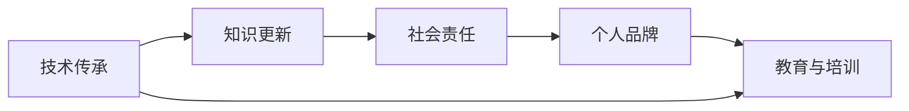

                 

# 程序员的退休生活：从赚钱到传承的思考

## 1. 背景介绍

程序员的退休生活，长久以来一直被视为一个充满挑战和转变的时期。这个阶段，他们需要从专注于编码的“挣钱”状态，转变为“传承”的角色，不仅仅是将自己积累的知识和技能传授给新一代，更要思考如何将这些宝贵的经验应用于更广泛的领域，促进技术的进步和社会的福祉。本文将探讨程序员在退休后如何调整心态，重新定位自己的角色，以及如何在传承中实现个人价值和社会责任的统一。

## 2. 核心概念与联系

### 2.1 核心概念概述

在探讨程序员退休生活的话题时，有几个关键概念是绕不开的：

- **技术传承**：指将技术和经验传递给新一代程序员，包括技术知识、问题解决的方法、代码风格、编程伦理等。

- **知识更新**：指退休后的程序员需要不断学习新技术和新方法，以保持与行业发展同步。

- **社会责任**：指程序员应承担的社会义务，如推动技术公正、普及数字素养、参与社会公益等。

- **个人品牌**：指个人在技术领域的影响力和声誉，退休后可以通过传承和分享来维护和提升。

- **教育与培训**：指向年轻一代传授编程知识和技能的过程，包括编写书籍、开设课程、参与讲座等。

这些概念相互关联，共同构成了程序员退休后生活的主线。通过理解这些概念，我们可以更好地规划退休生活，实现个人成长和社会价值的双赢。

### 2.2 概念间的关系

这些概念之间的关系可以用以下Mermaid流程图来表示：



这个图表展示了技术传承作为起点，通过不断学习新知识、承担社会责任、维护个人品牌，最终实现教育和培训的过程。每个环节都是相辅相成的，缺一不可。

## 3. 核心算法原理 & 具体操作步骤

### 3.1 算法原理概述

程序员退休后的生活，虽然在具体的技术操作上可能与在职时有所不同，但在思想和原则上，仍需遵循一定的算法和步骤。本文将从技术传承、知识更新、社会责任、个人品牌和教育与培训五个方面，介绍退休后程序员可以遵循的操作原则。

### 3.2 算法步骤详解

#### 3.2.1 技术传承

1. **建立知识库**：利用现有的技术和工具，建立自己的知识库，包括代码、文档、技术博客等。
   
2. **选择合适的平台**：将知识库上传至GitHub、Medium等平台，方便他人访问和学习。

3. **定期更新**：保持知识库的活跃度，定期更新内容，确保信息的准确性和时效性。

#### 3.2.2 知识更新

1. **订阅行业资讯**：通过订阅RSS、GitHub Watch、电子邮件列表等方式，获取最新的行业动态和技术进展。

2. **参加在线课程**：利用Coursera、edX等在线学习平台，参加相关课程，更新知识结构。

3. **参与技术社区**：加入LinkedIn、Stack Overflow等社区，与同行交流，分享经验。

#### 3.2.3 社会责任

1. **参与公益活动**：加入或发起与技术相关的公益项目，如开源项目、编程俱乐部等。

2. **撰写科普文章**：通过撰写技术科普文章，提高公众对技术的理解。

3. **推广技术公正**：参与技术公平和伦理问题的讨论，推广技术公正。

#### 3.2.4 个人品牌

1. **维护技术博客**：定期更新技术博客，分享个人见解和项目经验。

2. **编写书籍**：撰写技术书籍，系统地整理和传播技术知识。

3. **参与讲座和会议**：在技术会议和讲座上分享经验，扩大影响力。

#### 3.2.5 教育与培训

1. **开设线上课程**：利用Udemy、Khan Academy等平台，开设自己的线上课程。

2. **提供咨询服务**：通过提供技术咨询服务，帮助企业和团队解决技术难题。

3. **参与编程比赛**：指导年轻程序员参与编程比赛，提升实战经验。

### 3.3 算法优缺点

#### 3.3.1 技术传承

**优点**：
- 可以系统地整理知识，便于传播和继承。
- 有助于培养新一代程序员，推动技术发展。

**缺点**：
- 工作量大，需要投入大量时间和精力。
- 需要不断更新内容，以保持知识的时效性。

#### 3.3.2 知识更新

**优点**：
- 保持技术敏锐度，随时掌握行业动态。
- 拓宽知识面，增强竞争力。

**缺点**：
- 需要持续投入时间和精力，学习成本较高。
- 新技术快速迭代，容易跟不上。

#### 3.3.3 社会责任

**优点**：
- 提升社会影响力，增加社会认可度。
- 推动技术公益事业，履行社会责任。

**缺点**：
- 可能需要投入更多的时间和资源。
- 效果难以量化，回报可能不及预期。

#### 3.3.4 个人品牌

**优点**：
- 提升个人在行业内的知名度和影响力。
- 有利于个人职业发展和创新。

**缺点**：
- 需要持续投入时间和精力，维护难度高。
- 品牌建设是一个长期过程，短期内难以看到成效。

#### 3.3.5 教育与培训

**优点**：
- 将知识传承给下一代，实现个人价值的延续。
- 通过教育和培训，提升新一代程序员的技能水平。

**缺点**：
- 工作量大，需要大量的时间和精力。
- 需要不断调整和优化教学方法和内容。

### 3.4 算法应用领域

退休后程序员的技术传承、知识更新、社会责任、个人品牌和教育与培训，适用于各个行业领域，特别是技术驱动的行业，如IT、金融、医疗等。通过这些活动，退休后的程序员可以在更广泛的领域发挥作用，实现个人价值和社会价值的统一。

## 4. 数学模型和公式 & 详细讲解 & 举例说明

### 4.1 数学模型构建

在退休后的生活和工作中，程序员可能需要运用数学模型来分析和解决问题。以下是一个简单的数学模型示例，用于说明退休后如何在传承和更新知识的过程中，保持技术的连续性和有效性。

设$P$为程序员在退休后每月用于学习和传承知识的时间，$C$为每月用于社会责任和公益活动的时间，$B$为每月用于个人品牌建设和维护的时间。则退休后程序员的生活可以分为三部分，模型如下：

$$
\text{总价值} = f(P, C, B) = P \times \text{知识传承价值} + C \times \text{社会责任价值} + B \times \text{个人品牌价值}
$$

### 4.2 公式推导过程

以知识传承价值为例，我们可以推导如下：

假设每位程序员每月能培养一名新的程序员，每位新程序员在五年内的平均产出为$V$，则知识传承的总价值$V(P)$为：

$$
V(P) = \frac{P}{12} \times 5 \times V
$$

### 4.3 案例分析与讲解

假设退休程序员每月投入10小时学习新知识，并能每月培养一名新程序员，五年内每位新程序员的平均产出为$500,000$美元。则退休程序员的知识传承价值为：

$$
V(10) = \frac{10}{12} \times 5 \times 500,000 = 833,333.33 \text{ 美元}
$$

这意味着，通过持续学习和传承，退休程序员不仅能在个人品牌和影响力上获得回报，还能为社会带来可观的经济效益。

## 5. 项目实践：代码实例和详细解释说明

### 5.1 开发环境搭建

在退休后进行技术传承和知识更新，需要搭建一个合适的开发环境。以下是一个基本的搭建流程：

1. **安装编程工具**：如VS Code、Sublime Text等，确保能够高效编写代码。

2. **配置开发环境**：如配置GitHub等版本控制工具，确保代码的协作和版本管理。

3. **订阅在线课程**：利用Coursera、edX等平台，订阅相关的在线课程，学习新技术和新方法。

### 5.2 源代码详细实现

以下是一个简单的技术传承项目示例，用于说明如何将知识库上传到GitHub：

```python
import os
import git

def upload_code_to_github():
    repo_name = 'my_knowledge_base'
    repo_url = 'https://github.com/{owner}/{repo}'
    
    # 创建或更新仓库
    repo = git.Repo.clone_from(repo_url, repo_name)
    
    # 上传代码
    for filename in os.listdir('.'):
        if filename.endswith('.py'):
            repo.create_blob(commit_message='Update code', content=open(filename, 'r').read())
    
    # 提交更新
    repo.commit(commit_message='Update code')
    repo.push()

upload_code_to_github()
```

### 5.3 代码解读与分析

这个Python脚本利用git库，将当前目录下的所有Python文件上传到GitHub。它的基本思路是：

1. **创建或更新仓库**：克隆或创建GitHub上的仓库。
2. **上传代码**：遍历当前目录，将每个Python文件提交到仓库。
3. **提交更新**：提交代码变更，并推送到GitHub。

### 5.4 运行结果展示

执行上述代码后，可以在GitHub上看到上传的代码文件。这样，退休程序员就可以通过GitHub共享和传播自己的知识，实现技术传承。

## 6. 实际应用场景

### 6.1 技术讲座

退休程序员可以利用自己的经验和知识，开设技术讲座和培训课程，传授编程技能和经验。这不仅能够帮助他人提升技能，也能增强自己在行业内的影响力。

### 6.2 开源项目

参与开源项目是退休程序员传承技术的另一种方式。通过在开源项目上贡献代码和文档，可以帮助年轻程序员学习和成长。

### 6.3 技术博客

撰写技术博客是退休程序员传播知识和经验的有效手段。通过博客分享技术见解、编程技巧、项目经验等，可以吸引更多的读者，扩大影响力。

### 6.4 未来应用展望

退休程序员在传承技术的同时，还可以结合最新的技术趋势，探索新的应用领域。例如，利用人工智能和机器学习技术，开发新的应用和工具，推动技术创新。

## 7. 工具和资源推荐

### 7.1 学习资源推荐

1. **在线课程平台**：如Coursera、edX、Udacity，提供各种技术课程。

2. **编程社区**：如Stack Overflow、GitHub、Reddit，参与技术讨论和知识分享。

3. **技术博客**：如Medium、Hacker Noon，分享个人技术见解和项目经验。

### 7.2 开发工具推荐

1. **文本编辑器**：如VS Code、Sublime Text，高效编写代码。

2. **版本控制工具**：如Git、GitHub，管理代码版本和协作。

3. **在线学习平台**：如Coursera、edX，订阅相关课程，更新知识结构。

### 7.3 相关论文推荐

1. **技术传承研究**：如"Technology Transfer: A Review of Theories, Models, and Practices"。

2. **知识更新方法**：如"Learning in a New Era: The Role of Continuous Learning in the Adoption of Emerging Technologies"。

3. **社会责任研究**：如"The Role of Computer Scientists in Society: Towards a Responsible and Ethical Practice"。

## 8. 总结：未来发展趋势与挑战

### 8.1 研究成果总结

退休程序员在传承技术、更新知识、承担社会责任、维护个人品牌和参与教育与培训方面，有着广阔的发展前景。通过这些活动，可以推动技术进步，促进社会福祉，实现个人价值的最大化。

### 8.2 未来发展趋势

1. **技术自动化**：随着人工智能和机器学习技术的发展，退休程序员可以通过自动化工具，更高效地进行技术传承和知识更新。

2. **跨学科融合**：技术与其他学科的融合，如技术与医学、技术与艺术等，将为退休程序员提供更多的创新机会。

3. **远程协作**：远程工作方式的普及，使得退休程序员可以通过网络平台，实现全球范围内的协作和传承。

### 8.3 面临的挑战

1. **技术迭代快**：新技术快速迭代，退休程序员需要不断学习，跟上行业发展的步伐。

2. **时间和资源限制**：退休生活时间有限，需要合理规划时间和资源，确保传承和更新的高效性。

3. **社会认知度**：退休程序员需要提升自己在社会上的认知度，才能更好地传播技术和知识。

### 8.4 研究展望

未来的研究应该集中在以下几个方面：

1. **技术传承工具**：开发更高效的技术传承工具，帮助退休程序员更轻松地管理和传播知识。

2. **跨代沟通**：研究跨代沟通的有效方法，促进技术传承。

3. **社会影响评估**：评估退休程序员在社会中的影响，优化社会责任的承担方式。

通过这些研究方向，退休程序员可以在传承中实现个人价值和社会责任的统一，为技术的发展和社会进步贡献力量。

## 9. 附录：常见问题与解答

**Q1：退休程序员如何保持技术敏锐度？**

A: 通过订阅在线课程、参加技术社区和讲座、编写技术博客等方式，持续学习新知识。

**Q2：退休程序员如何在传承中保持创新性？**

A: 结合最新的技术趋势，探索新的应用领域，利用自动化工具提高效率。

**Q3：退休程序员如何平衡传承和更新知识？**

A: 合理规划时间和资源，优先传递基础技术，再深入学习和探索前沿技术。

**Q4：退休程序员如何参与社会公益活动？**

A: 加入或发起与技术相关的公益项目，如开源项目、编程俱乐部等。

**Q5：退休程序员如何提高个人品牌影响力？**

A: 通过撰写技术书籍、开设线上课程、参与技术讲座等方式，提升知名度和影响力。

---

作者：禅与计算机程序设计艺术 / Zen and the Art of Computer Programming

