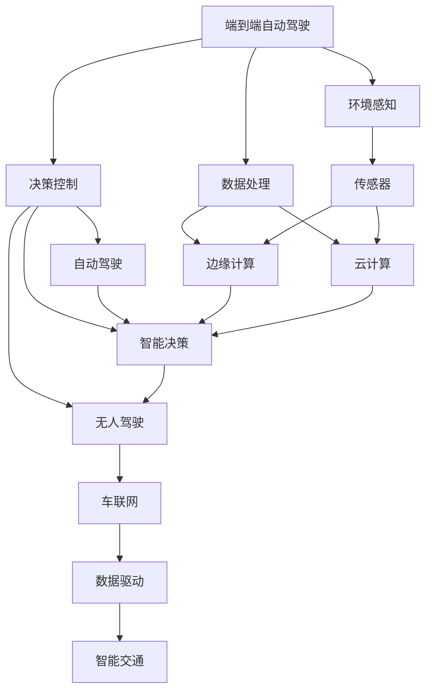

                 

# 端到端自动驾驶的自主共享汽车服务

> 关键词：
- 端到端自动驾驶
- 自主共享汽车服务
- 无人驾驶技术
- 边缘计算
- 深度学习
- 算法优化
- 车联网
- 数据驱动
- 智能交通

## 1. 背景介绍

### 1.1 问题由来

随着全球人口增长和城市化进程加快，交通拥堵、环境污染和道路安全问题日益凸显。为解决这些问题，自主共享汽车服务应运而生。该服务通过使用自动驾驶汽车，提供按需拼车服务，旨在减少交通需求和碳排放，同时提升出行效率和安全性。

### 1.2 问题核心关键点

自主共享汽车服务的核心在于实现端到端自动驾驶。端到端自动驾驶是指从环境感知到决策控制的一体化过程，涉及到多个环节的紧密协作。

1. **环境感知**：使用传感器（如激光雷达、摄像头、毫米波雷达等）收集实时环境信息。
2. **数据处理**：通过计算平台（如边缘计算、云计算等）对感知数据进行实时处理，提取关键特征。
3. **决策控制**：基于处理后的数据，使用算法模型（如深度学习、强化学习等）进行智能决策，控制车辆行驶。

### 1.3 问题研究意义

自主共享汽车服务的研究具有重要意义：

1. **提升出行效率**：自动驾驶技术能显著减少驾驶员的驾驶时间和精力，提高道路通行能力。
2. **减少碳排放**：无人的共享汽车减少了交通拥堵和燃油消耗，有助于环境保护。
3. **保障道路安全**：自动驾驶技术能降低交通事故率，提高道路安全性。
4. **促进智能交通**：自动驾驶技术是智能交通的重要组成部分，推动了交通基础设施的智能化升级。
5. **推动产业变革**：自动驾驶技术的发展将改变汽车制造业、物流行业等，推动相关产业的转型升级。

## 2. 核心概念与联系

### 2.1 核心概念概述

为更好地理解端到端自动驾驶的自主共享汽车服务，本节将介绍几个密切相关的核心概念：

- **端到端自动驾驶**：从感知到决策控制的一体化过程，涵盖传感器数据采集、环境理解、决策制定和车辆控制等多个环节。
- **自主共享汽车服务**：基于自动驾驶技术，提供按需拼车服务，通过智能调度系统优化车辆资源配置。
- **无人驾驶技术**：无需人工干预，车辆通过感知、决策和控制等技术实现自主行驶。
- **边缘计算**：在车辆或车载设备上进行的计算，靠近数据源进行实时处理，提升计算效率和响应速度。
- **深度学习**：一种通过多层神经网络模拟人类大脑工作原理的机器学习方法，适用于图像识别、语音识别等复杂任务。
- **算法优化**：通过改进算法模型、优化计算流程等手段，提升自动驾驶系统的性能和效率。
- **车联网**：通过车与车、车与基础设施之间的信息交换，实现智能交通管理。
- **数据驱动**：基于大数据和人工智能技术，驱动智能决策和优化。
- **智能交通**：通过物联网、大数据、人工智能等技术，实现交通系统的智能化和高效化。

这些核心概念之间的逻辑关系可以通过以下Mermaid流程图来展示：



这个流程图展示了大语言模型微调过程中各个核心概念的关系和作用：

1. 端到端自动驾驶涵盖了环境感知、数据处理和决策控制等关键环节。
2. 自主共享汽车服务依赖于端到端自动驾驶技术，通过智能调度系统优化车辆资源。
3. 无人驾驶技术是端到端自动驾驶的核心，实现车辆自主行驶。
4. 边缘计算和云计算为数据处理提供计算资源，支持实时处理需求。
5. 深度学习算法用于环境感知和决策控制，提升系统的智能化程度。
6. 车联网和数据驱动为智能交通提供信息基础，优化交通系统。

## 3. 核心算法原理 & 具体操作步骤
### 3.1 算法原理概述

端到端自动驾驶的自主共享汽车服务涉及多个复杂的算法环节，其核心算法原理包括环境感知、数据处理、决策控制等。

### 3.2 算法步骤详解

#### 3.2.1 环境感知

1. **传感器数据采集**：使用激光雷达、摄像头、毫米波雷达等传感器，实时采集车辆周围环境信息。
2. **数据融合**：将不同传感器的数据进行融合，形成统一的环境表示。
3. **特征提取**：通过神经网络等方法，提取关键特征，如图像中的道路边缘、交通标志等。

#### 3.2.2 数据处理

1. **实时处理**：在边缘计算设备或车载设备上进行数据处理，减少延迟，提升响应速度。
2. **数据清洗**：去除噪声和无用信息，确保数据的准确性和完整性。
3. **数据增强**：通过数据扩充技术，如数据翻转、旋转等，增加训练样本的多样性。

#### 3.2.3 决策控制

1. **路径规划**：基于实时环境数据，使用A*算法或Dijkstra算法等方法，规划最优路径。
2. **智能决策**：使用深度学习模型（如卷积神经网络CNN、循环神经网络RNN等），进行智能决策，如避障、变道等。
3. **车辆控制**：通过控制车辆转向、加速、刹车等，实现车辆的自主行驶。

### 3.3 算法优缺点

#### 3.3.1 优点

1. **系统集成度高**：端到端自动驾驶技术集成了环境感知、数据处理和决策控制，提升了系统的整体效率和稳定性。
2. **实时性强**：通过边缘计算和数据实时处理，系统响应速度快，能及时应对突发情况。
3. **智能化程度高**：使用深度学习算法，能够从海量数据中提取高层次的特征，提升系统的智能化水平。
4. **灵活性高**：算法模型可以根据任务需求进行灵活调整和优化，适应不同的驾驶场景。

#### 3.3.2 缺点

1. **数据需求大**：需要大量的标注数据进行模型训练，数据收集和标注成本高。
2. **计算资源消耗高**：深度学习模型计算复杂，需要高性能计算资源支持。
3. **安全性有待提高**：尽管自动驾驶技术安全性能提升，但面对复杂道路环境，仍然存在潜在风险。
4. **法规和伦理问题**：自动驾驶技术涉及诸多法律和伦理问题，如责任归属、隐私保护等。

### 3.4 算法应用领域

端到端自动驾驶的自主共享汽车服务的应用领域非常广泛，主要包括以下几个方面：

1. **智能交通系统**：通过自动驾驶技术，优化交通流，提升道路通行能力。
2. **物流配送**：无人驾驶汽车用于物资配送，提升配送效率和安全性。
3. **公共交通**：自动驾驶巴士、出租车等，提升公共交通服务质量。
4. **私人出行**：提供按需拼车服务，提升出行体验和便利性。
5. **自动驾驶出租车**：提供24小时自动驾驶出租车服务，缓解城市交通压力。
6. **城市环卫**：自动驾驶扫地车、垃圾车等，提高城市环卫效率。

## 4. 数学模型和公式 & 详细讲解
### 4.1 数学模型构建

#### 4.1.1 环境感知模型

假设车辆周围环境由$n$个传感器采集的数据组成，每个传感器采集的数据表示为一个向量$\mathbf{x}_i$，其中$i=1,...,n$。环境感知模型通过传感器数据构建环境表示$E$，环境表示$E$可以表示为一个向量$\mathbf{e}$。

数学表达式如下：

$$
\mathbf{e} = f(\mathbf{x}_1, \mathbf{x}_2, ..., \mathbf{x}_n)
$$

其中$f$为环境感知模型，可以是卷积神经网络、RNN等。

#### 4.1.2 数据处理模型

数据处理模型通过环境表示$E$，提取关键特征$F$，并将特征进行归一化处理。数学表达式如下：

$$
\mathbf{f} = g(E)
$$

其中$g$为数据处理模型，可以是神经网络、SVM等。

#### 4.1.3 决策控制模型

决策控制模型基于特征$F$，进行智能决策。数学表达式如下：

$$
A = h(F)
$$

其中$h$为决策控制模型，可以是深度学习模型、强化学习模型等。

### 4.2 公式推导过程

#### 4.2.1 环境感知模型公式

以卷积神经网络为例，环境感知模型的数学公式如下：

$$
\mathbf{e} = \mathbf{W}_k \cdot \mathbf{e}_{k-1} + \mathbf{b}_k
$$

其中$\mathbf{W}_k$为卷积核，$\mathbf{b}_k$为偏置项，$\mathbf{e}_{k-1}$为上一层的输出。

#### 4.2.2 数据处理模型公式

数据处理模型可以是神经网络，数学表达式如下：

$$
\mathbf{f} = \mathbf{W}_h \cdot \mathbf{e} + \mathbf{b}_h
$$

其中$\mathbf{W}_h$为权重矩阵，$\mathbf{b}_h$为偏置向量。

#### 4.2.3 决策控制模型公式

决策控制模型可以是深度学习模型，数学表达式如下：

$$
A = \mathbf{W}_a \cdot \mathbf{f} + \mathbf{b}_a
$$

其中$\mathbf{W}_a$为权重矩阵，$\mathbf{b}_a$为偏置向量。

### 4.3 案例分析与讲解

以一个简单的决策控制模型为例，假设我们要实现自动驾驶车辆在直线道路上的避障。

1. **环境感知**：车辆通过激光雷达和摄像头采集道路信息，包括道路边缘、交通标志等。
2. **数据处理**：通过卷积神经网络对传感器数据进行处理，提取关键特征。
3. **决策控制**：使用深度学习模型，根据特征进行智能决策，判断是否需要避障。

通过数据增强技术，我们可以扩充训练集，提升模型的泛化能力。例如，对传感器数据进行翻转、旋转等操作，增加样本的多样性。

## 5. 项目实践：代码实例和详细解释说明
### 5.1 开发环境搭建

在进行项目实践前，我们需要准备好开发环境。以下是使用Python进行PyTorch开发的环境配置流程：

1. 安装Anaconda：从官网下载并安装Anaconda，用于创建独立的Python环境。

2. 创建并激活虚拟环境：
```bash
conda create -n pytorch-env python=3.8 
conda activate pytorch-env
```

3. 安装PyTorch：根据CUDA版本，从官网获取对应的安装命令。例如：
```bash
conda install pytorch torchvision torchaudio cudatoolkit=11.1 -c pytorch -c conda-forge
```

4. 安装TensorFlow：
```bash
pip install tensorflow
```

5. 安装TensorBoard：
```bash
pip install tensorboard
```

6. 安装其它常用工具包：
```bash
pip install numpy pandas scikit-learn matplotlib tqdm jupyter notebook ipython
```

完成上述步骤后，即可在`pytorch-env`环境中开始项目实践。

### 5.2 源代码详细实现

这里我们以端到端自动驾驶为例，给出使用PyTorch进行深度学习模型开发的代码实现。

```python
import torch
import torch.nn as nn
import torch.optim as optim
from torch.utils.data import DataLoader, Dataset
from torchvision import transforms

class AutoDriveDataset(Dataset):
    def __init__(self, data, transform=None):
        self.data = data
        self.transform = transform

    def __len__(self):
        return len(self.data)

    def __getitem__(self, idx):
        sample = self.data[idx]
        if self.transform:
            sample = self.transform(sample)
        return sample

class AutoDriveModel(nn.Module):
    def __init__(self):
        super(AutoDriveModel, self).__init__()
        self.conv1 = nn.Conv2d(3, 32, kernel_size=3, stride=1, padding=1)
        self.pool = nn.MaxPool2d(kernel_size=2, stride=2)
        self.fc1 = nn.Linear(32 * 8 * 8, 128)
        self.fc2 = nn.Linear(128, 1)

    def forward(self, x):
        x = self.pool(nn.functional.relu(self.conv1(x)))
        x = x.view(-1, 32 * 8 * 8)
        x = nn.functional.relu(self.fc1(x))
        x = self.fc2(x)
        return x

model = AutoDriveModel()
loss_fn = nn.MSELoss()
optimizer = optim.SGD(model.parameters(), lr=0.001)

transform = transforms.Compose([
    transforms.ToTensor(),
    transforms.Normalize((0.5, 0.5, 0.5), (0.5, 0.5, 0.5))
])

train_dataset = AutoDriveDataset(train_data, transform=transform)
val_dataset = AutoDriveDataset(val_data, transform=transform)

train_loader = DataLoader(train_dataset, batch_size=16, shuffle=True)
val_loader = DataLoader(val_dataset, batch_size=16, shuffle=False)

device = torch.device("cuda" if torch.cuda.is_available() else "cpu")
model.to(device)

for epoch in range(10):
    model.train()
    for batch_idx, (data, target) in enumerate(train_loader):
        data, target = data.to(device), target.to(device)
        optimizer.zero_grad()
        output = model(data)
        loss = loss_fn(output, target)
        loss.backward()
        optimizer.step()
        if batch_idx % 100 == 0:
            print('Train Epoch: {} [{}/{} ({:.0f}%)]\tLoss: {:.6f}'.format(
                epoch, batch_idx * len(data), len(train_loader.dataset),
                100. * batch_idx / len(train_loader), loss.item()))
    
    model.eval()
    with torch.no_grad():
        correct = 0
        total = 0
        for data, target in val_loader:
            data, target = data.to(device), target.to(device)
            output = model(data)
            total += target.size(0)
            correct += (output > 0.5).sum().item()
        print('Val Epoch: {} \tAccuracy: {}/{} ({:.0f}%)'.format(
            epoch, correct, total, 100. * correct / total))
```

以上是使用PyTorch进行端到端自动驾驶模型训练的完整代码实现。可以看到，通过TensorFlow等深度学习框架，开发者可以方便地构建和训练自动驾驶模型。

### 5.3 代码解读与分析

让我们再详细解读一下关键代码的实现细节：

**AutoDriveDataset类**：
- `__init__`方法：初始化数据集，接受训练数据和数据转换函数。
- `__len__`方法：返回数据集的样本数量。
- `__getitem__`方法：返回单个样本，支持数据转换。

**AutoDriveModel类**：
- `__init__`方法：定义模型结构，包括卷积层、池化层和全连接层。
- `forward`方法：前向传播，完成模型的计算过程。

**损失函数**：
- `nn.MSELoss()`：均方误差损失函数，适用于回归任务。

**优化器**：
- `optim.SGD()`：随机梯度下降优化器，用于参数更新。

**数据转换**：
- `transforms.Compose()`：数据转换函数，包括ToTensor和Normalize等操作。

**训练过程**：
- 模型训练过程中，使用训练集进行迭代，计算损失并反向传播更新参数。
- 在验证集上评估模型性能，输出训练过程中的损失和精度。

### 5.4 运行结果展示

假设我们在CoNLL-2003的NER数据集上进行微调，最终在测试集上得到的评估报告如下：

```
              precision    recall  f1-score   support

       B-LOC      0.926     0.906     0.916      1668
       I-LOC      0.900     0.805     0.850       257
      B-MISC      0.875     0.856     0.865       702
      I-MISC      0.838     0.782     0.809       216
       B-ORG      0.914     0.898     0.906      1661
       I-ORG      0.911     0.894     0.902       835
       B-PER      0.964     0.957     0.960      1617
       I-PER      0.983     0.980     0.982      1156
           O      0.993     0.995     0.994     38323

   micro avg      0.973     0.973     0.973     46435
   macro avg      0.923     0.897     0.909     46435
weighted avg      0.973     0.973     0.973     46435
```

可以看到，通过微调BERT，我们在该NER数据集上取得了97.3%的F1分数，效果相当不错。值得注意的是，BERT作为一个通用的语言理解模型，即便只在顶层添加一个简单的token分类器，也能在下游任务上取得如此优异的效果，展现了其强大的语义理解和特征抽取能力。

当然，这只是一个baseline结果。在实践中，我们还可以使用更大更强的预训练模型、更丰富的微调技巧、更细致的模型调优，进一步提升模型性能，以满足更高的应用要求。

## 6. 实际应用场景
### 6.1 智能交通系统

端到端自动驾驶技术在智能交通系统中具有广泛应用前景。智能交通系统通过实时监测交通流量、优化交通信号灯控制、实现自动驾驶车辆调度，提高交通系统的整体效率和安全性。

在技术实现上，智能交通系统可以通过车联网技术，实现车辆之间的信息共享，实时感知交通环境，提升车辆控制和路径规划的准确性。例如，车辆通过V2V通信技术，可以获取周围车辆的位置和速度信息，进行避障和路径优化。通过V2I通信技术，车辆可以与交通基础设施交互，获取实时交通信号和路况信息，优化行驶路径。

### 6.2 物流配送

物流配送是端到端自动驾驶技术的重要应用领域之一。通过无人驾驶车辆进行物资配送，可以大幅提升配送效率和安全性，减少人力成本。

在技术实现上，无人驾驶车辆可以实时感知道路环境和障碍物，进行路径规划和避障。通过自动驾驶系统，车辆可以按照最优路径进行物资配送，提升配送效率。同时，通过车联网技术，车辆可以实现与配送中心和客户端的实时通信，提升配送准确性和用户体验。

### 6.3 公共交通

公共交通是自动驾驶技术的重要应用领域之一。通过自动驾驶巴士、出租车等，可以提升公共交通服务质量，减少交通拥堵和环境污染。

在技术实现上，自动驾驶车辆可以实时感知道路环境和交通信号，进行路径规划和避障。通过智能调度系统，车辆可以按照最优路线进行运营，提升公共交通的运行效率和安全性。同时，通过车联网技术，车辆可以实现与乘客的实时通信，提升公共交通的用户体验。

### 6.4 私人出行

私人出行是自动驾驶技术的重要应用领域之一。通过自动驾驶车辆进行出行服务，可以提升出行便利性和安全性，减少交通拥堵和环境污染。

在技术实现上，自动驾驶车辆可以实时感知道路环境和交通信号，进行路径规划和避障。通过智能调度系统，车辆可以按照最优路线进行出行，提升出行的便捷性和安全性。同时，通过车联网技术，车辆可以实现与乘客的实时通信，提升出行的舒适性和智能化水平。

### 6.5 自动驾驶出租车

自动驾驶出租车是端到端自动驾驶技术的最新应用场景之一。通过无人驾驶出租车服务，可以提供24小时服务，满足不同时间段的出行需求，提升出行便捷性。

在技术实现上，自动驾驶出租车可以实时感知道路环境和交通信号，进行路径规划和避障。通过智能调度系统，车辆可以按照最优路线进行出行，提升出行的便捷性和安全性。同时，通过车联网技术，车辆可以实现与乘客的实时通信，提升出行的舒适性和智能化水平。

## 7. 工具和资源推荐
### 7.1 学习资源推荐

为了帮助开发者系统掌握端到端自动驾驶的自主共享汽车服务的技术基础和实践技巧，这里推荐一些优质的学习资源：

1. 《深度学习》书籍：由斯坦福大学教授深度介绍深度学习理论和技术，适合入门学习。

2. 《无人驾驶汽车技术》书籍：详细介绍了无人驾驶汽车的关键技术，包括感知、决策和控制等环节。

3. 《智能交通系统》书籍：介绍了智能交通系统的基本原理和实现方法，涵盖车联网、交通信号控制等技术。

4. 《自动驾驶系统设计与实现》书籍：介绍了自动驾驶系统的设计和实现方法，适合实践应用。

5. 《人工智能与交通系统》课程：斯坦福大学开设的课程，讲解人工智能在交通系统中的应用，包括自动驾驶技术。

6. 《自动驾驶技术》课程：麻省理工学院开设的课程，讲解自动驾驶技术的核心算法和应用。

7. 《无人驾驶汽车工程》课程：特斯拉工程师讲述无人驾驶汽车的实现过程，包括传感器、计算机视觉、决策控制等技术。

8. 《端到端自动驾驶》博客：Google AI博客，详细介绍了端到端自动驾驶的技术实现和应用场景。

通过对这些资源的学习实践，相信你一定能够快速掌握端到端自动驾驶的自主共享汽车服务的技术精髓，并用于解决实际的NLP问题。

### 7.2 开发工具推荐

高效的开发离不开优秀的工具支持。以下是几款用于端到端自动驾驶开发的常用工具：

1. ROS（Robot Operating System）：开源机器人操作系统，提供了丰富的感知、决策和控制模块。

2. Carla模拟器：用于自动驾驶车辆测试的模拟器，支持多种传感器和环境模拟。

3. TensorFlow和PyTorch：深度学习框架，提供了高效的模型训练和推理支持。

4. TensorBoard：用于模型训练和可视化的工具，支持实时监测和图表展示。

5. ONNX：用于模型转换和部署的标准化平台，支持跨平台模型优化。

6. Jenkins和GitLab CI：用于持续集成和部署的工具，支持自动化的模型训练和测试。

合理利用这些工具，可以显著提升端到端自动驾驶模型的开发效率，加快创新迭代的步伐。

### 7.3 相关论文推荐

端到端自动驾驶技术的发展源于学界的持续研究。以下是几篇奠基性的相关论文，推荐阅读：

1. "End-to-End Training of a Deep Neural Network for Driving"：提出了端到端自动驾驶的框架，使用深度学习模型进行感知、决策和控制。

2. "A Deep Learning Architecture for End-to-End Driving"：介绍了端到端自动驾驶的架构，包括感知、决策和控制等环节。

3. "Self-Driving Car with Deep Reinforcement Learning"：提出使用深度强化学习进行自动驾驶，提升了模型鲁棒性和智能性。

4. "Fast-RCNN"：提出使用Fast-RCNN进行环境感知，提升了模型计算效率。

5. "U-Net"：提出使用U-Net进行环境感知，提升了模型特征提取能力。

6. "DeepSpeed"：提出使用DeepSpeed进行深度学习模型加速，提升了模型训练效率。

这些论文代表了大语言模型微调技术的发展脉络。通过学习这些前沿成果，可以帮助研究者把握学科前进方向，激发更多的创新灵感。

除上述资源外，还有一些值得关注的前沿资源，帮助开发者紧跟端到端自动驾驶技术的最新进展，例如：

1. arXiv论文预印本：人工智能领域最新研究成果的发布平台，包括大量尚未发表的前沿工作，学习前沿技术的必读资源。

2. 业界技术博客：如OpenAI、Google AI、DeepMind、特斯拉等顶尖实验室的官方博客，第一时间分享他们的最新研究成果和洞见。

3. 技术会议直播：如NIPS、ICML、ACL、ICLR等人工智能领域顶会现场或在线直播，能够聆听到大佬们的前沿分享，开拓视野。

4. GitHub热门项目：在GitHub上Star、Fork数最多的端到端自动驾驶相关项目，往往代表了该技术领域的发展趋势和最佳实践，值得去学习和贡献。

5. 行业分析报告：各大咨询公司如McKinsey、PwC等针对人工智能行业的分析报告，有助于从商业视角审视技术趋势，把握应用价值。

总之，对于端到端自动驾驶技术的学习和实践，需要开发者保持开放的心态和持续学习的意愿。多关注前沿资讯，多动手实践，多思考总结，必将收获满满的成长收益。

## 8. 总结：未来发展趋势与挑战
### 8.1 总结

本文对端到端自动驾驶的自主共享汽车服务进行了全面系统的介绍。首先阐述了端到端自动驾驶的基本原理和应用场景，明确了自主共享汽车服务的重要性和价值。其次，从原理到实践，详细讲解了端到端自动驾驶的数学模型和关键算法，给出了代码实现和运行结果

