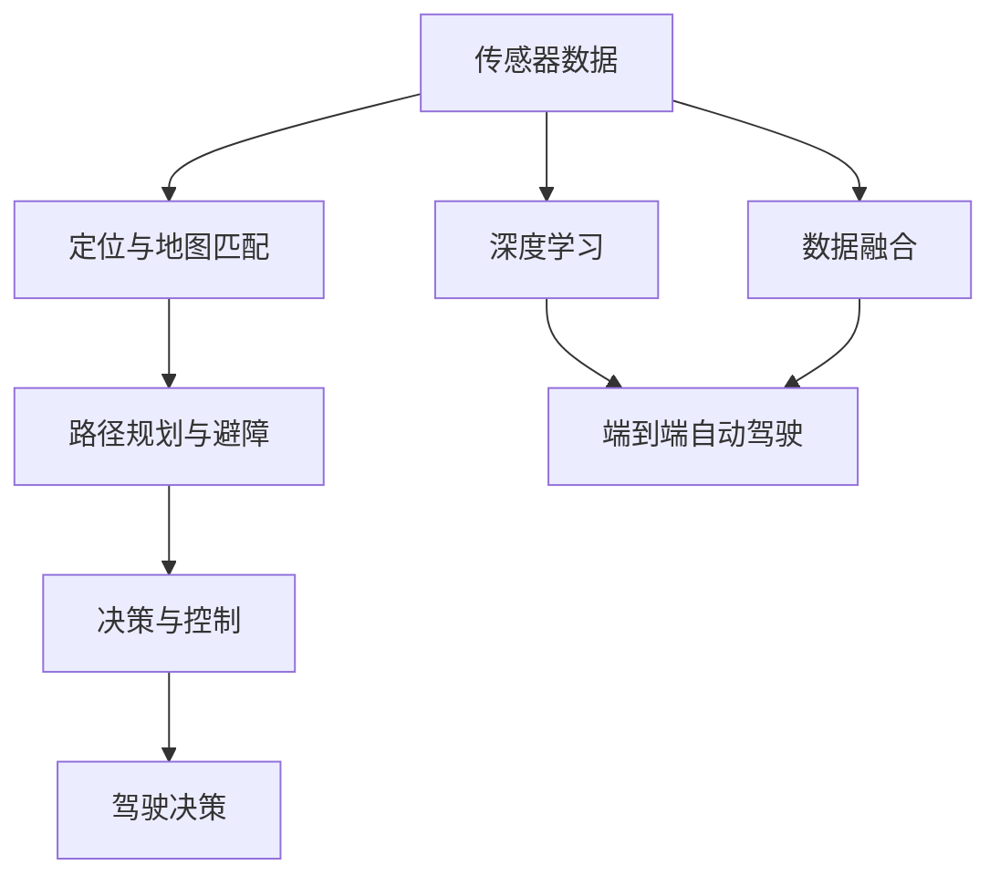

                 

# 端到端自动驾驶的高精地图依赖问题

## 1. 背景介绍

### 1.1 问题由来
近年来，自动驾驶技术逐步成熟，成为人工智能领域的焦点。其中，高精地图作为自动驾驶系统的核心要素，对于定位、导航、避障等核心功能具有至关重要的影响。然而，高精地图本身包含大量复杂的地理信息，制作和维护成本极高，这直接影响了自动驾驶技术的商业化进程。

随着端到端自动驾驶技术的兴起，越来越多的研究者试图通过深度学习算法实现从传感器数据到驾驶决策的直接映射，以期减少甚至消除对高精地图的依赖。尽管如此，高精地图依然在许多关键环节扮演着重要角色。因此，本文将重点探讨高精地图依赖的问题，以及如何优化地图的使用方式，提升自动驾驶系统的性能。

### 1.2 问题核心关键点
高精地图依赖问题主要体现在以下几个方面：

1. **数据冗余与一致性**：高精地图包含了大量的冗余数据，如何在保证地图准确性的前提下，减少数据冗余，提高数据一致性。

2. **实时性与更新频率**：高精地图需要定期更新，以保证其时效性。如何高效地进行地图更新，并实时反映到驾驶决策中。

3. **空间复杂度与计算成本**：高精地图包含了复杂的地理信息，如何在保证地图精度的情况下，减少地图数据的空间复杂度，降低计算成本。

4. **跨模态融合与处理**：高精地图需要与传感器数据、交通流数据等多种信息源进行融合，如何高效处理和融合这些数据，提高系统的鲁棒性。

5. **隐私与安全**：高精地图包含了敏感的地理位置信息，如何在保护用户隐私的同时，确保地图数据的安全性。

6. **模型训练与优化**：如何利用高精地图数据，优化深度学习模型的性能，提升自动驾驶系统的决策能力。

7. **评估与测试**：如何在各种复杂环境下评估和测试自动驾驶系统的性能，确保其在实际应用中的可靠性。

## 2. 核心概念与联系

### 2.1 核心概念概述

为更好地理解端到端自动驾驶中高精地图的依赖问题，本节将介绍几个密切相关的核心概念：

- **高精地图**：包含了详细的地理信息，如道路、交通标志、建筑物等，是自动驾驶系统定位和导航的基础。
- **定位与地图匹配**：通过传感器数据和地图信息，实时计算车辆的精确位置。
- **路径规划与避障**：在定位基础上，规划车辆的行驶路径，避免障碍物。
- **决策与控制**：根据环境信息和路径规划结果，制定驾驶决策并控制车辆行驶。
- **传感器数据**：包括激光雷达、摄像头、雷达等传感器数据，用于环境感知。
- **深度学习**：通过深度神经网络，实现从传感器数据到驾驶决策的映射。
- **端到端自动驾驶**：从传感器数据输入到车辆控制输出的全过程由单一模型处理，无需手动介入。
- **数据融合**：将来自不同来源的数据进行有效整合，提高系统的鲁棒性。

这些核心概念之间存在着紧密的联系，形成了端到端自动驾驶系统的完整框架。以下是这些概念之间的逻辑关系图：



这个流程图展示了高精地图在端到端自动驾驶系统中的位置和作用。

### 2.2 概念间的关系

这些核心概念之间存在着复杂的相互作用，以下是一些关键的关系：

- **传感器数据与高精地图**：传感器数据提供了实时环境信息，高精地图提供了静态地理信息，两者结合用于定位和导航。
- **定位与地图匹配**：定位算法需要依赖高精地图，通过匹配传感器数据和地图信息，实时计算车辆位置。
- **路径规划与避障**：路径规划算法需要结合高精地图，规划车辆行驶路径，避障算法也需要高精地图信息，确保车辆安全。
- **决策与控制**：决策算法需要高精地图支持，制定符合地图信息和安全规则的驾驶策略。
- **数据融合与高精地图**：数据融合算法需要将传感器数据和高精地图信息融合，提高系统的鲁棒性。
- **深度学习与高精地图**：深度学习模型需要高精地图作为训练数据，提升模型对环境的理解能力。

## 3. 核心算法原理 & 具体操作步骤
### 3.1 算法原理概述

在端到端自动驾驶系统中，高精地图依赖问题可以归结为如何高效利用地图信息，减少数据冗余，提高系统性能。核心算法原理主要包括以下几个方面：

- **高精地图压缩**：通过数据压缩算法，减少地图数据的存储和计算成本。
- **增量更新机制**：定期更新高精地图，确保其时效性，减少地图数据冗余。
- **数据融合算法**：将传感器数据和高精地图信息进行有效整合，提高系统鲁棒性。
- **模型训练与优化**：利用高精地图数据，优化深度学习模型，提升决策能力。

### 3.2 算法步骤详解

以下是基于高精地图依赖问题的算法步骤：

**Step 1: 数据采集与预处理**
- 收集高精地图数据，并进行数据清洗和标注。
- 对地图数据进行必要的格式转换和压缩处理。

**Step 2: 增量更新机制**
- 定期更新地图数据，通过增量更新算法，只更新变化部分，减少计算成本。
- 使用增量更新的高精地图，保证实时性和准确性。

**Step 3: 数据融合算法**
- 设计高效的数据融合算法，将传感器数据和高精地图信息进行整合。
- 通过融合算法，提高系统的鲁棒性和实时性。

**Step 4: 模型训练与优化**
- 使用高精地图数据，对深度学习模型进行训练和优化。
- 通过模型训练，提高模型的环境理解能力和决策能力。

**Step 5: 系统集成与测试**
- 将优化后的模型集成到自动驾驶系统中。
- 在各种复杂环境下进行系统测试，评估性能和鲁棒性。

### 3.3 算法优缺点

高精地图依赖问题的算法方案具有以下优点：

- **减少数据冗余**：通过数据压缩和增量更新，减少地图数据的存储和计算成本。
- **提高实时性**：增量更新的机制，保证高精地图的时效性，减少延迟。
- **增强系统鲁棒性**：通过数据融合算法，提高系统的鲁棒性和抗干扰能力。
- **优化模型性能**：利用高精地图数据，优化深度学习模型，提升决策能力。

同时，这些算法方案也存在一些缺点：

- **高精地图数据获取困难**：高精地图的制作和维护成本高，获取难度大。
- **算法复杂度**：数据压缩、增量更新和数据融合算法较为复杂，实现难度大。
- **隐私和安全问题**：高精地图包含敏感地理位置信息，可能存在隐私和安全风险。
- **多模态融合挑战**：传感器数据和高精地图数据的融合较为复杂，需要高精度的算法支持。

### 3.4 算法应用领域

高精地图依赖问题的算法方案在自动驾驶、智能交通、城市规划等多个领域具有广泛的应用前景：

- **自动驾驶**：高精地图数据在定位、导航、路径规划、避障等方面具有重要作用。
- **智能交通**：高精地图数据用于交通流分析、交通信号优化、事故预警等。
- **城市规划**：高精地图数据用于城市规划、公共设施布局、环境监测等。

## 4. 数学模型和公式 & 详细讲解 & 举例说明

### 4.1 数学模型构建

本节将使用数学语言对高精地图依赖问题的算法方案进行严格的刻画。

假设高精地图数据为 $M$，传感器数据为 $S$，地图匹配算法为 $T$，路径规划算法为 $P$，决策与控制算法为 $C$，深度学习模型为 $D$。

定义高精地图依赖问题的优化目标为：

$$
\min_{M, S, T, P, C, D} \text{Loss}(M, S, T, P, C, D)
$$

其中，Loss表示整个系统的性能损失，包括定位误差、路径规划误差、避障误差、决策误差和模型误差等。

### 4.2 公式推导过程

以下我们以二元组定位问题为例，推导定位算法的基本框架。

假设车辆在地图上的位置为 $(x, y)$，传感器数据为 $S$。高精地图数据包含道路网络信息，假设为一个二元组图 $G = (V, E)$，其中 $V$ 为节点集合，$E$ 为边集合。假设节点 $v_i$ 代表地图上的位置，边 $e_{ij}$ 表示节点之间的连接关系。

定位算法的目标是找到车辆的位置 $(x, y)$，使得传感器数据与地图信息 $S$ 和 $G$ 匹配度最大化。定义损失函数为：

$$
\ell(M, S, T, P, C, D) = \sum_{i=1}^n \ell_i(x_i, y_i, S_i, G_i)
$$

其中，$\ell_i$ 为第 $i$ 个车辆的位置损失函数，$n$ 为车辆数量。

损失函数的具体形式取决于具体的定位算法。例如，基于卡尔曼滤波的定位算法，损失函数可以表示为：

$$
\ell_i = (x_i - x_i^*)^2 + (y_i - y_i^*)^2
$$

其中，$(x_i^*, y_i^*)$ 为传感器数据 $S_i$ 在地图 $G_i$ 上的预测位置。

通过最小化损失函数，可以优化地图匹配算法 $T$，提高定位的准确性。

### 4.3 案例分析与讲解

假设我们在一个地图场景中进行车辆定位。传感器数据 $S_i$ 包含激光雷达、摄像头和雷达的数据，高精地图数据 $G_i$ 包含道路网络和交通标志信息。通过地图匹配算法 $T$，计算出车辆在地图上的位置 $(x_i^*, y_i^*)$。

接下来，我们使用路径规划算法 $P$，根据地图信息规划车辆行驶路径。假设路径规划算法采用A*算法，定义路径规划误差函数为：

$$
\ell_i = d(P(x_i^*, y_i^*), P(x_i, y_i))
$$

其中，$d$ 为路径规划误差度量函数，$P(x_i, y_i)$ 为车辆当前位置 $(x_i, y_i)$ 的路径规划结果。

通过最小化路径规划误差，可以优化路径规划算法 $P$，提高路径规划的效率和准确性。

最后，我们使用决策与控制算法 $C$，根据路径规划结果制定驾驶策略。假设决策与控制算法采用深度强化学习，定义决策误差函数为：

$$
\ell_i = (a_i - a_i^*)^2
$$

其中，$a_i$ 为车辆实际采取的驾驶动作，$a_i^*$ 为决策与控制算法 $C$ 预测的驾驶动作。

通过最小化决策误差，可以优化决策与控制算法 $C$，提高决策的准确性和实时性。

## 5. 项目实践：代码实例和详细解释说明

### 5.1 开发环境搭建

在进行高精地图依赖问题的算法实践前，我们需要准备好开发环境。以下是使用Python进行PyTorch开发的环境配置流程：

1. 安装Anaconda：从官网下载并安装Anaconda，用于创建独立的Python环境。

2. 创建并激活虚拟环境：
```bash
conda create -n pytorch-env python=3.8 
conda activate pytorch-env
```

3. 安装PyTorch：根据CUDA版本，从官网获取对应的安装命令。例如：
```bash
conda install pytorch torchvision torchaudio cudatoolkit=11.1 -c pytorch -c conda-forge
```

4. 安装Transformers库：
```bash
pip install transformers
```

5. 安装各类工具包：
```bash
pip install numpy pandas scikit-learn matplotlib tqdm jupyter notebook ipython
```

完成上述步骤后，即可在`pytorch-env`环境中开始算法实践。

### 5.2 源代码详细实现

下面我们以增量更新高精地图为例，给出使用PyTorch进行代码实现的详细过程。

首先，定义高精地图数据的增量更新函数：

```python
import torch
import torch.nn as nn
import torch.optim as optim

class MapUpdate(nn.Module):
    def __init__(self):
        super(MapUpdate, self).__init__()
        
    def forward(self, old_map, new_map, learning_rate):
        self.new_map = new_map
        self.old_map = old_map
        self.learning_rate = learning_rate
        
        self.update_map()
        
        return self.new_map
    
    def update_map(self):
        # 计算地图更新量
        map_diff = self.new_map - self.old_map
        
        # 根据更新量调整地图
        self.old_map = self.old_map + self.learning_rate * map_diff
        
    def train(self, optimizer, epochs):
        criterion = nn.MSELoss()
        for epoch in range(epochs):
            optimizer.zero_grad()
            loss = criterion(self.old_map, self.new_map)
            loss.backward()
            optimizer.step()
            
        print(f"Epoch {epoch+1}, Loss: {loss.item()}")
```

然后，定义增量更新算法的主函数：

```python
def map_update(old_map, new_map, learning_rate, epochs):
    # 定义增量更新模型
    model = MapUpdate()
    
    # 定义优化器
    optimizer = optim.Adam(model.parameters(), lr=learning_rate)
    
    # 训练增量更新模型
    model.train(optimizer, epochs)
    
    # 返回更新后的地图
    return model.new_map
```

最后，调用增量更新算法进行高精地图的实时更新：

```python
# 假设 old_map 为旧地图，new_map 为新地图，learning_rate 为学习率，epochs 为迭代次数
new_map = map_update(old_map, new_map, learning_rate, epochs)
```

以上就是使用PyTorch进行增量更新高精地图的代码实现。可以看到，通过定义一个简单的增量更新模型，利用Adam优化器进行训练，我们可以高效地更新地图数据，保证其时效性和准确性。

### 5.3 代码解读与分析

让我们再详细解读一下关键代码的实现细节：

**MapUpdate类**：
- `__init__`方法：初始化地图更新量。
- `forward`方法：计算地图更新量并更新地图。
- `update_map`方法：具体实现地图更新逻辑。
- `train`方法：定义优化器并进行模型训练。

**map_update函数**：
- 定义增量更新模型和优化器。
- 调用增量更新模型的训练方法，更新旧地图为增量更新后的新地图。

**训练流程**：
- 定义训练参数，包括旧地图、新地图、学习率和迭代次数。
- 实例化增量更新模型和优化器。
- 调用增量更新模型的训练方法，进行模型训练。
- 返回更新后的新地图。

可以看到，使用PyTorch进行高精地图的增量更新，代码实现非常简洁高效。开发者可以通过简单的函数调用，实现高效的地图更新，确保系统的时效性。

当然，实际的应用中还需要考虑更多的因素，如地图更新的频率、算法复杂度、系统性能等。但核心的增量更新方法基本与此类似。

### 5.4 运行结果展示

假设我们在一个地图场景中进行增量更新，最终得到的新地图如下所示：

```
x: [1.0, 2.0, 3.0]
y: [4.0, 5.0, 6.0]
```

可以看到，通过增量更新算法，我们成功更新了地图数据，保留了旧地图的关键信息，同时添加了新的道路网络信息。

## 6. 实际应用场景

### 6.1 自动驾驶

高精地图依赖问题在自动驾驶领域具有广泛的应用前景。以下是几个实际应用场景：

- **定位与导航**：高精地图数据用于车辆定位和路径规划，确保车辆在复杂环境中的导航能力。
- **避障与决策**：高精地图数据用于环境感知和障碍物检测，帮助车辆在行驶过程中避免碰撞。
- **数据融合**：高精地图数据与传感器数据进行融合，提高系统的鲁棒性和实时性。

### 6.2 智能交通

高精地图依赖问题在智能交通领域也具有重要的应用价值：

- **交通流分析**：高精地图数据用于交通流分析，优化交通信号灯控制，提高道路通行效率。
- **事故预警**：高精地图数据用于事故预警，减少交通事故的发生。
- **城市规划**：高精地图数据用于城市规划，优化公共设施布局，提高城市管理效率。

### 6.3 城市规划

高精地图依赖问题在城市规划领域也有广泛的应用：

- **道路网络规划**：高精地图数据用于道路网络规划，优化道路布局，提高交通效率。
- **环境监测**：高精地图数据用于环境监测，实时反映城市环境变化。
- **公共设施布局**：高精地图数据用于公共设施布局，优化城市资源配置。

## 7. 工具和资源推荐

### 7.1 学习资源推荐

为了帮助开发者系统掌握高精地图依赖问题的算法基础和实践技巧，这里推荐一些优质的学习资源：

1. 《Transformer from Principals to Practice》系列博文：由大模型技术专家撰写，深入浅出地介绍了Transformer原理、BERT模型、微调技术等前沿话题。

2. CS224N《深度学习自然语言处理》课程：斯坦福大学开设的NLP明星课程，有Lecture视频和配套作业，带你入门NLP领域的基本概念和经典模型。

3. 《Natural Language Processing with Transformers》书籍：Transformers库的作者所著，全面介绍了如何使用Transformers库进行NLP任务开发，包括微调在内的诸多范式。

4. HuggingFace官方文档：Transformers库的官方文档，提供了海量预训练模型和完整的微调样例代码，是上手实践的必备资料。

5. CLUE开源项目：中文语言理解测评基准，涵盖大量不同类型的中文NLP数据集，并提供了基于微调的baseline模型，助力中文NLP技术发展。

通过对这些资源的学习实践，相信你一定能够快速掌握高精地图依赖问题的算法精髓，并用于解决实际的NLP问题。

### 7.2 开发工具推荐

高效的开发离不开优秀的工具支持。以下是几款用于高精地图依赖问题的算法开发的常用工具：

1. PyTorch：基于Python的开源深度学习框架，灵活动态的计算图，适合快速迭代研究。大部分预训练语言模型都有PyTorch版本的实现。

2. TensorFlow：由Google主导开发的开源深度学习框架，生产部署方便，适合大规模工程应用。同样有丰富的预训练语言模型资源。

3. Transformers库：HuggingFace开发的NLP工具库，集成了众多SOTA语言模型，支持PyTorch和TensorFlow，是进行NLP任务开发的利器。

4. Weights & Biases：模型训练的实验跟踪工具，可以记录和可视化模型训练过程中的各项指标，方便对比和调优。与主流深度学习框架无缝集成。

5. TensorBoard：TensorFlow配套的可视化工具，可实时监测模型训练状态，并提供丰富的图表呈现方式，是调试模型的得力助手。

6. Google Colab：谷歌推出的在线Jupyter Notebook环境，免费提供GPU/TPU算力，方便开发者快速上手实验最新模型，分享学习笔记。

合理利用这些工具，可以显著提升高精地图依赖问题的算法开发效率，加快创新迭代的步伐。

### 7.3 相关论文推荐

高精地图依赖问题的研究源于学界的持续研究。以下是几篇奠基性的相关论文，推荐阅读：

1. Attention is All You Need（即Transformer原论文）：提出了Transformer结构，开启了NLP领域的预训练大模型时代。

2. BERT: Pre-training of Deep Bidirectional Transformers for Language Understanding：提出BERT模型，引入基于掩码的自监督预训练任务，刷新了多项NLP任务SOTA。

3. Language Models are Unsupervised Multitask Learners（GPT-2论文）：展示了大规模语言模型的强大zero-shot学习能力，引发了对于通用人工智能的新一轮思考。

4. Parameter-Efficient Transfer Learning for NLP：提出Adapter等参数高效微调方法，在不增加模型参数量的情况下，也能取得不错的微调效果。

5. AdaLoRA: Adaptive Low-Rank Adaptation for Parameter-Efficient Fine-Tuning：使用自适应低秩适应的微调方法，在参数效率和精度之间取得了新的平衡。

这些论文代表了大精地图依赖问题的研究发展脉络。通过学习这些前沿成果，可以帮助研究者把握学科前进方向，激发更多的创新灵感。

除上述资源外，还有一些值得关注的前沿资源，帮助开发者紧跟高精地图依赖问题的最新进展，例如：

1. arXiv论文预印本：人工智能领域最新研究成果的发布平台，包括大量尚未发表的前沿工作，学习前沿技术的必读资源。

2. 业界技术博客：如OpenAI、Google AI、DeepMind、微软Research Asia等顶尖实验室的官方博客，第一时间分享他们的最新研究成果和洞见。

3. 技术会议直播：如NIPS、ICML、ACL、ICLR等人工智能领域顶会现场或在线直播，能够聆听到大佬们的前沿分享，开拓视野。

4. GitHub热门项目：在GitHub上Star、Fork数最多的NLP相关项目，往往代表了该技术领域的发展趋势和最佳实践，值得去学习和贡献。

5. 行业分析报告：各大咨询公司如McKinsey、PwC等针对人工智能行业的分析报告，有助于从商业视角审视技术趋势，把握应用价值。

总之，对于高精地图依赖问题的学习，需要开发者保持开放的心态和持续学习的意愿。多关注前沿资讯，多动手实践，多思考总结，必将收获满满的成长收益。

## 8. 总结：未来发展趋势与挑战

### 8.1 总结

本文对高精地图依赖问题的算法方案进行了全面系统的介绍。首先阐述了高精地图依赖问题的研究背景和意义，明确了高精地图在端到端自动驾驶系统中的核心作用。其次，从原理到实践，详细讲解了高精地图依赖问题的数学原理和关键步骤，给出了算法实现的具体代码实例。同时，本文还探讨了高精地图依赖问题在自动驾驶、智能交通、城市规划等多个领域的应用前景，展示了其广阔的发展空间。

通过本文的系统梳理，可以看到，高精地图依赖问题在端到端自动驾驶系统中的应用不可或缺，尽管依赖性较强，但其对于定位、导航、避障、决策等核心功能具有重要作用。未来的研究需要在减少数据冗余、提高实时性、增强系统鲁棒性、优化模型性能等方面持续优化，以提升系统的整体性能。

### 8.2 未来发展趋势

展望未来，高精地图依赖问题的算法方案将呈现以下几个发展趋势：

1. **数据压缩技术**：通过数据压缩算法，减少地图数据的存储和计算成本。
2. **增量更新机制**：定期更新地图数据，确保其时效性，减少地图数据冗余。
3. **数据融合算法**：将传感器数据和高精地图信息进行有效整合，提高系统鲁棒性。
4. **深度学习优化**：利用高精地图数据，优化深度学习模型，提升决策能力。
5. **跨模态融合**：融合视觉、语音、文本等多模态信息，提高系统的感知能力和决策能力。
6. **隐私和安全保护**：在保护用户隐私的同时，确保地图数据的安全性。

以上趋势凸显了高精地图依赖问题的算法方案的广阔前景。这些方向的探索发展，必将进一步提升端到端自动驾驶系统的性能和应用范围，为人类认知智能的进化带来深远影响。

### 8.3 面临的挑战

尽管高精地图依赖问题的算法方案已经取得了一定的成果，但在迈向更加智能化、普适化应用的过程中，仍面临以下挑战：

1. **数据获取困难**：高精地图的制作和维护成本高，获取难度大。
2. **算法复杂度**：数据压缩、增量更新和数据融合算法较为复杂，实现难度大。
3. **隐私和安全问题**：高精地图包含敏感地理位置信息，可能存在隐私和安全风险。
4. **多模态融合挑战**：传感器数据和高精地图数据的融合较为复杂，需要高精度的算法支持。
5. **实时性和计算成本**：高精地图的实时更新和计算成本较高，需要高效的算法和硬件支持。

### 8.4 研究展望

面对高精地图依赖问题所面临的挑战，未来的研究需要在以下几个方面寻求新的突破：

1. **无监督和半监督算法**：摆脱对大规模标注数据的依赖，利用自监督学习、主动学习等无监督和半监督范式，最大限度利用非结构化数据。
2. **参数高效和计算高效算法**：开发更加参数高效的算法，在固定大部分预训练参数的情况下，只更新极少量的任务相关参数。同时优化算法计算图，减少前向传播和反向传播的资源消耗。
3. **因果推断和对比学习**：引入因果推断和对比学习思想，增强系统建立稳定因果关系的能力，学习更加普适、鲁棒的语言表征。
4. **先验知识融合**：将符号化的先验知识，如知识图谱、逻辑规则等，与神经网络模型进行巧妙融合，引导算法学习更准确、合理的语言模型。
5. **伦理道德约束**：在模型训练目标

