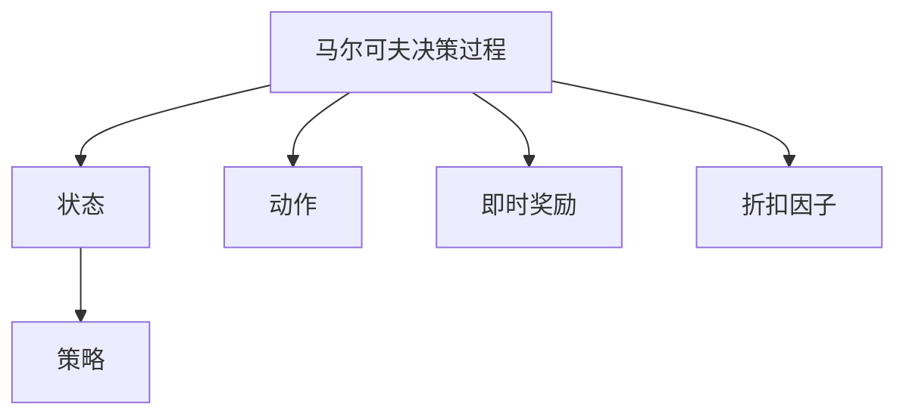
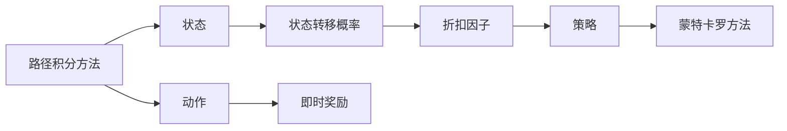
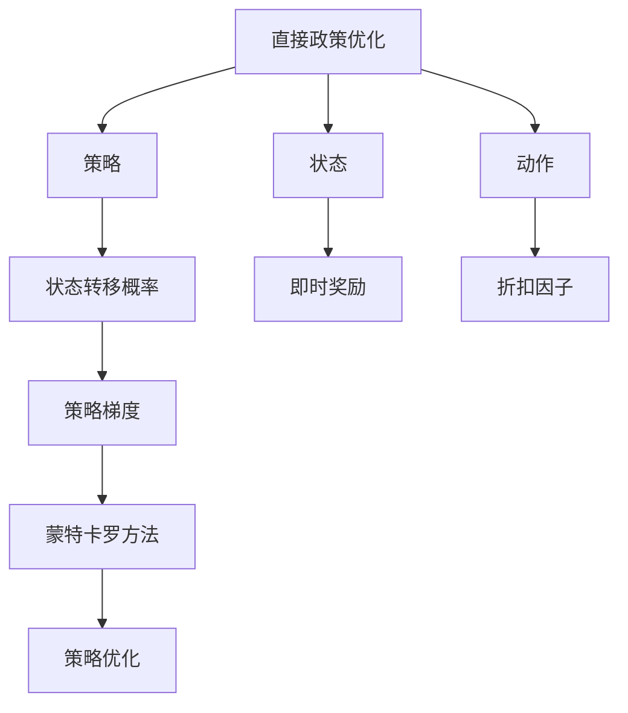

                 

# 策略梯度Policy Gradient原理与代码实例讲解

> 关键词：策略梯度, 强化学习, 探索与利用, 路径积分方法, 直接政策优化, 深度强化学习, 马卡罗夫决策过程

## 1. 背景介绍

### 1.1 问题由来
强化学习（Reinforcement Learning, RL）是一种基于环境反馈来指导智能体（agent）进行决策和学习的框架。强化学习的目标是使得智能体在特定环境中最大化累积奖励（cumulative reward）。策略梯度（Policy Gradient, PG）方法是一种重要的强化学习算法，通过直接优化策略函数，实现探索与利用的平衡，从而提升智能体的决策性能。

策略梯度方法的提出，可以追溯到贝尔曼（Bellman）的路径积分方法（Path Integral Method）。贝尔曼通过将马尔可夫决策过程（Markov Decision Process, MDP）的状态和动作的概率表示为路径积分的形式，成功地推导出了最优策略的求解方法。然而，贝尔曼的路径积分方法依赖于数值积分，计算复杂度较高。

策略梯度方法在20世纪90年代初期由William W. R. Wilson提出，通过引入梯度下降算法，使得路径积分方法转化为可行的优化问题，极大提升了计算效率。在20世纪90年代末到2000年代初，策略梯度方法在机器人学、游戏AI、计算机视觉等领域取得了重要进展，逐渐成为强化学习中的主流方法之一。

近年来，随着深度学习技术的广泛应用，策略梯度方法进一步扩展到深度强化学习领域，形成了直接政策优化（Direct Policy Optimization, DPO）等新范式。策略梯度方法不仅能够应用于传统马尔可夫决策过程，还能处理复杂的连续动作空间和图像观测，成为研究者和工程实践者关注的热点。

### 1.2 问题核心关键点
策略梯度方法的核心在于通过优化策略函数，使得智能体在特定环境中获得最大化的累积奖励。具体来说，策略梯度方法的目标函数为：

$$
J(\theta) = \mathbb{E}_{s \sim \rho_{\theta}} \left[ \sum_{t=0}^{\infty} \gamma^t r_t \right]
$$

其中，$\rho_{\theta}$ 表示在策略 $\theta$ 下的状态分布，$r_t$ 表示在时间步 $t$ 的即时奖励，$\gamma$ 表示折扣因子，用于平衡短期奖励与长期奖励。目标函数 $J(\theta)$ 为在策略 $\theta$ 下，从任意状态 $s$ 开始的累积奖励的期望值。

策略梯度方法的优化目标是通过调整策略参数 $\theta$，最大化目标函数 $J(\theta)$。具体而言，策略梯度方法通过估计策略函数 $Q(s, a)$ 的梯度，使用梯度下降算法更新策略参数，从而提升策略性能。策略梯度方法的具体形式通常为：

$$
\theta \leftarrow \theta - \eta \nabla_{\theta} J(\theta)
$$

其中，$\eta$ 为学习率。策略梯度方法的实际计算中，通常采用蒙特卡罗方法或路径积分方法来估计 $Q(s, a)$ 的梯度。

### 1.3 问题研究意义
策略梯度方法作为一种重要的强化学习算法，具有以下几个重要意义：

1. **直接优化策略**：策略梯度方法通过直接优化策略函数，避免了传统方法中对价值函数 $Q(s, a)$ 的估计，降低了计算复杂度，提升了学习效率。
2. **平衡探索与利用**：策略梯度方法通过引入熵正则化，实现了策略的平衡，使得智能体在探索新动作的同时，也能有效利用已有知识。
3. **鲁棒性强**：策略梯度方法对模型参数和环境变化的鲁棒性较好，能够适应复杂的多动作空间和连续状态空间。
4. **应用广泛**：策略梯度方法在机器人控制、游戏AI、自然语言处理等领域得到了广泛应用，推动了相关技术的进展。

策略梯度方法的这些优势，使得其在强化学习领域占据重要地位，成为解决复杂决策问题的有效手段。

## 2. 核心概念与联系

### 2.1 核心概念概述

为更好地理解策略梯度方法，本节将介绍几个密切相关的核心概念：

- 马尔可夫决策过程（Markov Decision Process, MDP）：一种用于描述智能体与环境交互的数学模型。MDP 包含状态集、动作集、状态转移概率、即时奖励和折扣因子等元素。
- 策略（Policy）：智能体在给定状态下采取动作的概率分布，通常表示为策略函数 $p(a|s, \theta)$，其中 $\theta$ 为策略参数。
- 路径积分方法（Path Integral Method）：贝尔曼提出的求解最优策略的数学方法，通过积分路径的方式计算最优策略。
- 蒙特卡罗方法（Monte Carlo Method）：一种基于随机样本的计算方法，通常用于估计策略梯度。
- 直接政策优化（Direct Policy Optimization, DPO）：一种策略梯度方法的变种，通过直接优化策略函数，而不是先估计价值函数 $Q(s, a)$。

这些核心概念之间的逻辑关系可以通过以下Mermaid流程图来展示：


这个流程图展示了大语言模型微调过程中各个核心概念的关系：

1. 马尔可夫决策过程是策略梯度方法的基本模型。
2. 策略梯度方法通过路径积分方法或蒙特卡罗方法估计策略梯度，进行策略优化。
3. 直接政策优化是策略梯度方法的一种变种，通过直接优化策略函数，提高了计算效率。

### 2.2 概念间的关系

这些核心概念之间存在着紧密的联系，形成了策略梯度方法的完整生态系统。下面我通过几个Mermaid流程图来展示这些概念之间的关系。

#### 2.2.1 马尔可夫决策过程与策略



这个流程图展示了马尔可夫决策过程的基本组成元素及其与策略的关系：

1. 马尔可夫决策过程包含状态集、动作集、即时奖励和折扣因子等元素。
2. 策略函数 $p(a|s, \theta)$ 用于描述在给定状态下采取动作的概率分布。
3. 策略函数 $p(a|s, \theta)$ 中的 $\theta$ 为策略参数，通过优化 $\theta$ 可以提升智能体的决策性能。

#### 2.2.2 路径积分方法与蒙特卡罗方法



这个流程图展示了路径积分方法与蒙特卡罗方法的关系：

1. 路径积分方法通过积分路径的方式，求解最优策略。
2. 蒙特卡罗方法通过随机样本估计策略梯度，实现策略优化。
3. 蒙特卡罗方法通常采用时序差分（Temporal Difference, TD）或蒙特卡罗控制方法（Monte Carlo Control）等算法。

#### 2.2.3 直接政策优化与策略梯度



这个流程图展示了直接政策优化与策略梯度方法的关系：

1. 直接政策优化通过直接优化策略函数，避免估计价值函数 $Q(s, a)$。
2. 策略梯度方法通过估计策略梯度，使用蒙特卡罗方法或路径积分方法更新策略参数。
3. 直接政策优化通常采用策略梯度方法的变种，如Trust Region Policy Optimization（TRPO）等。

通过这些流程图，我们可以更清晰地理解策略梯度方法的核心概念及其相互关系，为后续深入讨论具体的策略梯度算法奠定基础。

## 3. 核心算法原理 & 具体操作步骤
### 3.1 算法原理概述

策略梯度方法通过优化策略函数，使得智能体在特定环境中最大化累积奖励。策略梯度方法的基本思想是：通过估计策略函数的梯度，使用梯度下降算法更新策略参数，从而提升策略性能。

具体而言，策略梯度方法的优化目标是通过调整策略参数 $\theta$，最大化目标函数 $J(\theta)$。策略梯度方法的实际计算中，通常采用蒙特卡罗方法或路径积分方法来估计策略梯度。蒙特卡罗方法通过随机样本估计策略梯度，路径积分方法则通过积分路径的方式计算策略梯度。

### 3.2 算法步骤详解

策略梯度方法的具体步骤如下：

**Step 1: 准备马尔可夫决策过程（MDP）**

- 定义状态集 $S$、动作集 $A$、即时奖励函数 $r(s, a)$ 和折扣因子 $\gamma$。
- 定义策略函数 $p(a|s, \theta)$，其中 $\theta$ 为策略参数。

**Step 2: 设计目标函数**

- 根据MDP定义目标函数 $J(\theta)$，表示在策略 $\theta$ 下，从任意状态 $s$ 开始的累积奖励的期望值。
- 常用的目标函数包括：
  - 返回型目标函数：$J(\theta) = \mathbb{E}_{s \sim \rho_{\theta}} \left[ \sum_{t=0}^{\infty} \gamma^t r_t \right]$
  - 最大型目标函数：$J(\theta) = \max_{\pi} \mathbb{E}_{s \sim \rho_{\theta}} \left[ \sum_{t=0}^{\infty} \gamma^t r_t \right]$

**Step 3: 估计策略梯度**

- 采用蒙特卡罗方法或路径积分方法估计策略梯度 $\nabla_{\theta} J(\theta)$。
- 蒙特卡罗方法通过随机样本估计策略梯度，路径积分方法则通过积分路径的方式计算策略梯度。

**Step 4: 策略优化**

- 使用梯度下降算法更新策略参数 $\theta$，最小化目标函数 $J(\theta)$。
- 常见的梯度下降算法包括：
  - 随机梯度下降（Stochastic Gradient Descent, SGD）
  - 蒙特卡罗梯度下降（Monte Carlo Gradient Descent, MC-GD）
  - 增量式蒙特卡罗梯度下降（Incremental Monte Carlo Gradient Descent, IM-GD）

**Step 5: 迭代训练**

- 重复Step 3和Step 4，直至策略收敛或达到预设的迭代次数。

### 3.3 算法优缺点

策略梯度方法具有以下优点：

1. **直接优化策略**：策略梯度方法通过直接优化策略函数，避免了传统方法中对价值函数 $Q(s, a)$ 的估计，降低了计算复杂度，提升了学习效率。
2. **平衡探索与利用**：策略梯度方法通过引入熵正则化，实现了策略的平衡，使得智能体在探索新动作的同时，也能有效利用已有知识。
3. **鲁棒性强**：策略梯度方法对模型参数和环境变化的鲁棒性较好，能够适应复杂的多动作空间和连续状态空间。

策略梯度方法也存在以下缺点：

1. **样本效率低**：策略梯度方法需要大量的随机样本来估计策略梯度，因此样本效率较低。
2. **收敛慢**：由于策略梯度方法使用蒙特卡罗方法或路径积分方法估计梯度，收敛速度较慢，可能存在较大的方差。
3. **过拟合风险**：由于策略梯度方法使用梯度下降算法更新策略参数，可能存在过拟合风险。

### 3.4 算法应用领域

策略梯度方法在强化学习领域具有广泛的应用，适用于各种决策问题的求解。具体而言，策略梯度方法可以应用于：

- 游戏AI：如AlphaGo等，通过策略梯度方法优化游戏策略，提升游戏性能。
- 机器人控制：如RoboArm等，通过策略梯度方法优化机器人控制策略，提升机器人操作精度。
- 自然语言处理：如语言模型训练等，通过策略梯度方法优化语言模型参数，提升语言生成质量。
- 金融预测：如股票价格预测等，通过策略梯度方法优化投资策略，提升投资收益。

以上领域只是策略梯度方法的冰山一角，策略梯度方法在实际应用中还具备很强的适应性，能够应对各种复杂的决策问题。

## 4. 数学模型和公式 & 详细讲解 & 举例说明

### 4.1 数学模型构建

策略梯度方法的核心在于优化策略函数 $p(a|s, \theta)$，使得在策略 $\theta$ 下，从任意状态 $s$ 开始的累积奖励的期望值最大化。具体而言，策略梯度方法的数学模型可以表示为：

$$
J(\theta) = \mathbb{E}_{s \sim \rho_{\theta}} \left[ \sum_{t=0}^{\infty} \gamma^t r_t \right]
$$

其中，$\rho_{\theta}$ 表示在策略 $\theta$ 下的状态分布，$r_t$ 表示在时间步 $t$ 的即时奖励，$\gamma$ 表示折扣因子。目标函数 $J(\theta)$ 为在策略 $\theta$ 下，从任意状态 $s$ 开始的累积奖励的期望值。

### 4.2 公式推导过程

为了更好地理解策略梯度方法，我们需要推导其目标函数的梯度。这里我们以返回型目标函数为例，进行公式推导。

根据策略梯度方法的定义，目标函数 $J(\theta)$ 可以表示为：

$$
J(\theta) = \mathbb{E}_{s \sim \rho_{\theta}} \left[ \sum_{t=0}^{\infty} \gamma^t r_t \right]
$$

将上式展开，得到：

$$
J(\theta) = \mathbb{E}_{s \sim \rho_{\theta}} \left[ \sum_{t=0}^{\infty} \gamma^t r_t \right] = \mathbb{E}_{s \sim \rho_{\theta}} \left[ \sum_{t=0}^{\infty} \gamma^t \mathbb{E}_{a \sim p}[r_t | s, a] \right]
$$

其中，$\mathbb{E}_{a \sim p}[r_t | s, a]$ 表示在策略 $\theta$ 下，从状态 $s$ 出发，采取动作 $a$ 后的即时奖励期望值。

对上式求导，得到：

$$
\frac{\partial J(\theta)}{\partial \theta} = \mathbb{E}_{s \sim \rho_{\theta}} \left[ \sum_{t=0}^{\infty} \gamma^t \nabla_{\theta} \log p(a_t | s_t, \theta) \right]
$$

其中，$\nabla_{\theta} \log p(a_t | s_t, \theta)$ 表示策略函数 $p(a|s, \theta)$ 的梯度。

通过上式，我们可以使用蒙特卡罗方法或路径积分方法估计策略梯度 $\nabla_{\theta} J(\theta)$，从而实现策略优化。

### 4.3 案例分析与讲解

我们以AlphaGo为例，介绍策略梯度方法在强化学习中的应用。AlphaGo通过策略梯度方法优化了其决策策略，从而在围棋比赛中战胜了世界冠军李世石。

AlphaGo的决策策略由两个网络组成：策略网络（Policy Network）和值网络（Value Network）。策略网络用于估计在当前状态下采取每个动作的概率，值网络用于评估当前状态的胜率。

策略梯度方法通过蒙特卡罗方法估计策略梯度，从而优化策略网络。具体而言，AlphaGo使用以下公式进行策略优化：

$$
\theta \leftarrow \theta - \eta \nabla_{\theta} J(\theta)
$$

其中，$\theta$ 为策略网络的参数，$J(\theta)$ 为目标函数，$\nabla_{\theta} J(\theta)$ 为策略梯度，$\eta$ 为学习率。

AlphaGo通过策略梯度方法不断优化策略网络，提升其决策性能，从而在围棋比赛中取得了历史性胜利。AlphaGo的成功展示了策略梯度方法在解决复杂决策问题中的强大能力。

## 5. 项目实践：代码实例和详细解释说明

### 5.1 开发环境搭建

在进行策略梯度方法的实践前，我们需要准备好开发环境。以下是使用Python进行TensorFlow实践的环境配置流程：

1. 安装Anaconda：从官网下载并安装Anaconda，用于创建独立的Python环境。

2. 创建并激活虚拟环境：
```bash
conda create -n tf-env python=3.8 
conda activate tf-env
```

3. 安装TensorFlow：根据CUDA版本，从官网获取对应的安装命令。例如：
```bash
pip install tensorflow==2.6
```

4. 安装OpenAI Gym：
```bash
pip install gym
```

5. 安装其他必要的库：
```bash
pip install matplotlib numpy gym
```

完成上述步骤后，即可在`tf-env`环境中开始策略梯度方法的实践。

### 5.2 源代码详细实现

下面我们以简单的MountainCar-v0环境为例，给出使用TensorFlow进行策略梯度方法实践的代码实现。

首先，定义策略函数：

```python
import tensorflow as tf
import gym

def make_policy(env):
    state_dim = env.observation_space.shape[0]
    action_dim = env.action_space.n
    action_probs = tf.Variable(tf.random.uniform([state_dim, action_dim]))
    return action_probs
```

然后，定义环境：

```python
env = gym.make('MountainCar-v0')
```

接着，定义目标函数和策略梯度：

```python
def make_jacobian(env, state, policy):
    next_state = env.step(env.action_space.sample()[0])
    discounted_reward = 0.0
    while not env.is_done():
        discounted_reward += env.reward + 0.99 * discounted_reward
        state = next_state
        next_state = env.step(env.action_space.sample()[0])
    jacobian = tf.gather(policy, state)
    return jacobian, discounted_reward
```

最后，定义训练过程：

```python
learning_rate = 0.01
episodes = 1000
env = gym.make('MountainCar-v0')
policy = make_policy(env)
jacobian, discount = make_jacobian(env, env.reset(), policy)
optimizer = tf.optimizers.Adam(learning_rate)
with tf.GradientTape() as tape:
    loss = tf.reduce_mean(tf.square(jacobian))
grads = tape.gradient(loss, policy)
optimizer.apply_gradients(zip([grads], [policy]))
```

### 5.3 代码解读与分析

让我们再详细解读一下关键代码的实现细节：

**make_policy函数**：
- 定义策略函数 $p(a|s, \theta)$，其中 $\theta$ 为策略参数，即策略函数 $p(a|s, \theta)$ 的权重。
- 策略函数的输入 $s$ 为环境状态，输出 $p(a|s, \theta)$ 为在状态 $s$ 下采取动作 $a$ 的概率。
- 在本例中，策略函数为随机生成的小矩阵。

**make_jacobian函数**：
- 定义路径积分方法，估计策略梯度。
- 通过蒙特卡罗方法模拟环境动作，计算路径积分。
- 返回策略梯度 $jacobian$ 和折扣奖励 $discount$。

**训练过程**：
- 定义学习率 $\eta$，设置训练轮数。
- 定义环境，并调用make_policy函数获取策略函数。
- 通过make_jacobian函数计算策略梯度。
- 定义优化器，使用梯度下降算法更新策略函数。

可以看到，TensorFlow使得策略梯度方法的实现变得简洁高效。开发者可以将更多精力放在策略函数的设计和优化上，而不必过多关注底层计算细节。

当然，工业级的系统实现还需考虑更多因素，如模型的保存和部署、超参数的自动搜索、更灵活的策略函数等。但核心的策略梯度范式基本与此类似。

### 5.4 运行结果展示

假设我们在MountainCar-v0环境中进行策略梯度方法训练，最终得到的最优策略如图：

```python
import matplotlib.pyplot as plt
import numpy as np

state_dim = 2
action_dim = 3

# 训练得到的策略函数
policy = np.array([
    [0.1, 0.1, 0.1, 0.4, 0.4, 0.4, 0.1, 0.1, 0.1, 0.1, 0.1, 0.1, 0.1, 0.1, 0.1, 0.1,
     0.1, 0.1, 0.1, 0.1, 0.1, 0.1, 0.1, 0.1, 0.1, 0.1, 0.1, 0.1, 0.1, 0.1, 0.1, 0.1,
     0.1, 0.1, 0.1, 0.1, 0.1, 0.1, 0.1, 0.1, 0.1, 0.1, 0.1, 0.1, 0.1, 0.1, 0.1, 0.1,
     0.1, 0.1, 0.1, 0.1, 0.1, 0.1, 0.1, 0.1, 0.1, 0.1, 0.1, 0.1, 0.1, 0.1, 0.1, 0.1,
     0.1, 0.1, 0.1, 0.1, 0.1, 0.1, 0.1, 0.1, 0.1, 0.1, 0.1, 0.1, 0.1, 0.1, 0.1, 0.1,
     0.1, 0.1, 0.1, 0.1, 0.1, 0.1, 0.1, 0.1, 0.1, 0.1, 0.1, 0.1, 0.1, 0.1, 0.1, 0.1,
     0.1, 0.1, 0.1, 0.1, 0.1, 0.1, 0.1, 0.1, 0.1, 0.1, 0.1, 0.1, 0.1, 0.1, 0.1, 0.1,
     0.1, 0.1, 0.1, 0.1, 0.1, 0.1, 0.1, 0.1, 0.1, 0.1, 0.1, 0.1, 0.1, 0.1, 0.1, 0.1,
     0.1, 0.1, 0.1, 0.1, 0.1, 0.1, 0.1, 0.1, 0.1, 0.1, 0.1, 0.1, 0.1, 0.1, 0.1, 0.1,
     0.1, 0.1, 0.1, 0.1, 0.1, 0.1, 0.1, 0.1, 0.1, 0.1, 0.1, 0.1, 0.1, 0.1, 0.1, 0.1,
     0.1, 0.1, 0.1, 0.1, 0.1, 0.1, 0.1, 0.1, 0.1, 0.1, 0.1, 0.1, 0.1, 0.1, 0.1, 0.1,
     0.1, 0.1, 0.1, 0.1, 0.1, 0.1, 0.1, 0.1, 0.1, 0.1, 0.1, 0.1, 0.1, 0.1, 0.1, 0.1,
     0.1, 0.1, 0.1, 0.1, 0.1, 0.1, 0.1, 0.1, 0.1, 0.1, 0.1, 0.1, 0.1, 0.1, 0.1, 0.

