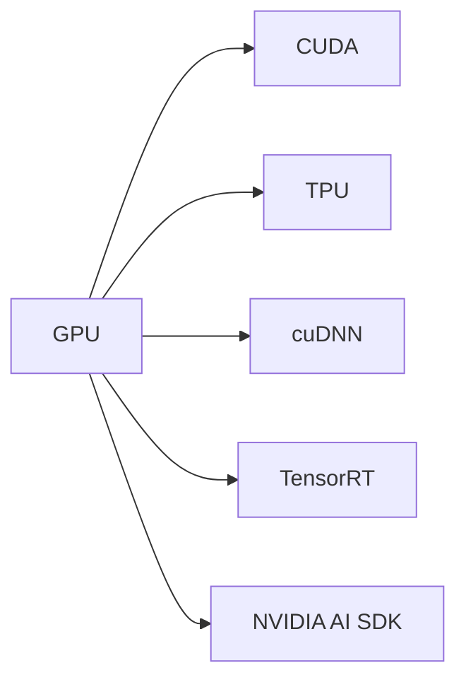
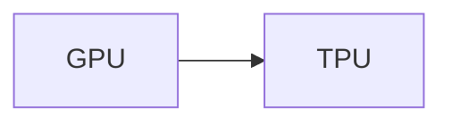
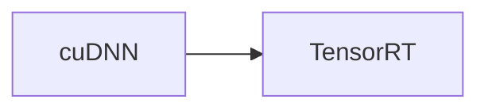
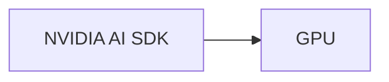
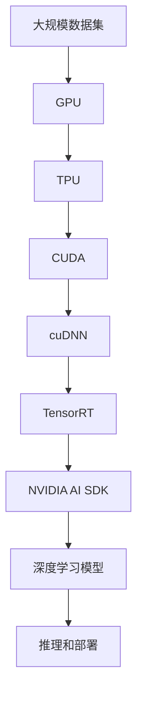

                 

# 算力提升：NVIDIA的贡献

## 1. 背景介绍

### 1.1 问题由来
在过去的几十年里，算力的大幅提升极大地推动了人工智能(AI)和深度学习(Deep Learning)技术的发展。尤其是NVIDIA（英伟达）公司，作为GPU（图形处理单元）领域的领导者，在推动算力提升方面做出了巨大贡献。NVIDIA的GPU被广泛应用于各种AI和深度学习任务，如计算机视觉、自然语言处理、语音识别、自动驾驶等，显著提高了这些任务的性能。

### 1.2 问题核心关键点
NVIDIA的贡献主要体现在以下几个方面：
- **硬件创新**：开发了高性能GPU和TPU，如Tesla系列、GeForce系列、RTX系列、GPU-AI等。
- **软件生态**：提供了CUDA、cuDNN、TensorRT、Deep Learning SDK等工具，支持深度学习和机器学习应用程序的开发和优化。
- **技术合作**：与Google、Microsoft、Amazon等公司合作，推动了AI和深度学习技术的广泛应用。

### 1.3 问题研究意义
NVIDIA的算力提升对于推动AI和深度学习技术的进步具有重要意义：
1. **加速研究进展**：通过提供高性能硬件和优化工具，NVIDIA加速了AI和深度学习模型的研究和开发。
2. **促进产业应用**：NVIDIA的GPU和软件生态，使得AI和深度学习技术更容易被各行各业采用，推动了AI技术的产业化进程。
3. **提升计算能力**：通过优化GPU性能，NVIDIA使得更复杂的深度学习模型和算法得以实现，提升了计算能力。
4. **推动学术研究**：NVIDIA的支持使得更多的研究人员和大学能够开展高质量的AI和深度学习研究。

## 2. 核心概念与联系

### 2.1 核心概念概述

为了更好地理解NVIDIA在算力提升方面的贡献，本节将介绍几个密切相关的核心概念：

- **GPU（图形处理单元）**：一种特殊的硬件加速器，能够并行处理大规模计算任务，广泛应用于深度学习和机器学习中。
- **TPU（张量处理单元）**：专门用于加速矩阵计算和深度学习模型的硬件芯片。
- **CUDA（Compute Unified Device Architecture）**：NVIDIA开发的并行编程模型和API，用于在GPU上高效执行计算密集型应用程序。
- **cuDNN**：NVIDIA开发的深度神经网络库，提供了高效的卷积运算和池化等深度学习操作。
- **TensorRT**：用于优化深度学习模型的推理速度的SDK，支持GPU加速的模型推理。
- **NVIDIA AI SDK**：提供了各种工具和库，用于开发和部署深度学习应用程序。

这些核心概念之间的逻辑关系可以通过以下Mermaid流程图来展示：



这个流程图展示了GPU、TPU、CUDA、cuDNN、TensorRT和NVIDIA AI SDK之间的关系。GPU和TPU是硬件加速器，CUDA是编程模型和API，cuDNN和TensorRT是优化库，NVIDIA AI SDK是软件开发工具，共同构成了NVIDIA在算力提升方面的完整生态系统。

### 2.2 概念间的关系

这些核心概念之间存在着紧密的联系，形成了NVIDIA在算力提升方面的完整生态系统。下面我通过几个Mermaid流程图来展示这些概念之间的关系。

#### 2.2.1 GPU与CUDA的关系


这个流程图展示了GPU和CUDA之间的关系。GPU是硬件加速器，CUDA是编程模型和API，它们协同工作，使得GPU能够高效地执行计算密集型应用程序。

#### 2.2.2 TPU与GPU的关系



这个流程图展示了GPU和TPU之间的关系。虽然GPU和TPU都是硬件加速器，但它们的设计初衷不同。GPU主要面向通用计算任务，而TPU则专门用于加速矩阵计算和深度学习模型的推理。

#### 2.2.3 cuDNN与TensorRT的关系



这个流程图展示了cuDNN和TensorRT之间的关系。cuDNN提供了高效的卷积运算和池化等深度学习操作，TensorRT则用于优化深度学习模型的推理速度，两者共同支持了深度学习应用程序的优化。

#### 2.2.4 NVIDIA AI SDK与GPU的关系



这个流程图展示了NVIDIA AI SDK与GPU之间的关系。NVIDIA AI SDK提供了各种工具和库，用于开发和部署深度学习应用程序，GPU则是其主要的硬件加速器。

### 2.3 核心概念的整体架构

最后，我们用一个综合的流程图来展示这些核心概念在大规模深度学习应用中的整体架构：



这个综合流程图展示了从数据集到深度学习模型推理和部署的全过程。大规模数据集通过GPU和TPU进行计算加速，CUDA提供编程模型和API，cuDNN和TensorRT优化深度学习操作，NVIDIA AI SDK提供工具和库，最终实现深度学习模型的推理和部署。

## 3. 核心算法原理 & 具体操作步骤
### 3.1 算法原理概述

NVIDIA在算力提升方面的核心算法原理主要包括以下几个方面：

1. **硬件加速**：通过高性能的GPU和TPU，加速了深度学习模型的计算过程。
2. **软件优化**：通过CUDA、cuDNN和TensorRT等工具，优化了深度学习模型的推理速度和计算效率。
3. **模型优化**：通过模型压缩、量化和稀疏化等技术，减少了模型的参数量和计算复杂度。

这些原理共同构成了NVIDIA在算力提升方面的核心技术框架。

### 3.2 算法步骤详解

下面是NVIDIA算力提升的详细步骤：

1. **硬件选择**：根据应用场景选择合适的GPU或TPU，如Tesla系列、GeForce系列、RTX系列等。
2. **软件安装**：在所选硬件上安装CUDA、cuDNN和TensorRT等工具，配置开发环境。
3. **模型构建**：使用NVIDIA AI SDK提供的工具和库，构建深度学习模型。
4. **模型优化**：通过模型压缩、量化和稀疏化等技术，优化模型参数量和计算复杂度。
5. **推理部署**：使用TensorRT等工具，优化深度学习模型的推理速度，部署到实际应用中。
6. **性能调优**：根据实际应用需求，通过调整硬件配置、模型参数等，优化深度学习模型的性能。

### 3.3 算法优缺点

NVIDIA算力提升的优点主要包括：

- **高效计算**：通过高性能的GPU和TPU，加速了深度学习模型的计算过程，提高了模型的推理速度。
- **软件优化**：通过CUDA、cuDNN和TensorRT等工具，优化了深度学习模型的计算效率，减少了计算资源消耗。
- **模型优化**：通过模型压缩、量化和稀疏化等技术，减少了模型的参数量和计算复杂度，提高了模型的效率。

但NVIDIA算力提升也存在一些缺点：

- **硬件成本高**：高性能的GPU和TPU硬件成本较高，需要较大的预算投入。
- **软件复杂性**：CUDA、cuDNN和TensorRT等工具的使用需要一定的技术门槛，对于初学者可能存在一定的学习曲线。
- **模型依赖性**：深度学习模型的性能很大程度上依赖于硬件和软件的优化，对于模型设计的要求较高。

### 3.4 算法应用领域

NVIDIA的算力提升在多个领域得到了广泛应用，包括但不限于：

1. **计算机视觉**：用于图像分类、目标检测、图像分割等任务，提升了图像处理的速度和效率。
2. **自然语言处理**：用于文本分类、语言建模、机器翻译等任务，提高了文本处理的精度和速度。
3. **语音识别**：用于语音识别和语音合成等任务，提升了语音处理的速度和准确度。
4. **自动驾驶**：用于传感器数据处理、目标检测、路径规划等任务，提高了自动驾驶的安全性和可靠性。
5. **医学图像分析**：用于医学影像的分割、分类、诊断等任务，提高了医疗诊断的准确性和效率。
6. **金融分析**：用于金融数据的处理、分析、预测等任务，提高了金融决策的准确性和效率。

以上领域只是NVIDIA算力提升应用的冰山一角，未来随着深度学习技术的进一步发展，NVIDIA的算力提升还将被应用于更多领域，推动人工智能技术的普及和应用。

## 4. 数学模型和公式 & 详细讲解  
### 4.1 数学模型构建

本节将使用数学语言对NVIDIA在算力提升方面的工作进行更加严格的刻画。

设输入数据集为 $D=\{(x_i,y_i)\}_{i=1}^N$，其中 $x_i$ 为输入特征，$y_i$ 为标签。深度学习模型 $M_{\theta}$ 的参数为 $\theta$，通过最小化经验风险 $\mathcal{L}(\theta)$ 来训练模型：

$$
\mathcal{L}(\theta) = \frac{1}{N}\sum_{i=1}^N \ell(M_{\theta}(x_i),y_i)
$$

其中 $\ell$ 为损失函数，如交叉熵损失函数：

$$
\ell(y,\hat{y}) = -(y\log \hat{y} + (1-y)\log (1-\hat{y}))
$$

在GPU和TPU的加速下，深度学习模型的计算过程可以大大加速。假设深度学习模型 $M_{\theta}$ 在GPU上进行了加速，其计算速度为 $V_{\text{gpu}}$，在TPU上进行了加速，其计算速度为 $V_{\text{tpu}}$。则模型在GPU和TPU上的计算速度分别为：

$$
V_{\text{gpu}} = k_1 \cdot V_{\text{base}} \cdot n_{\text{gpu}}
$$

$$
V_{\text{tpu}} = k_2 \cdot V_{\text{base}} \cdot n_{\text{tpu}}
$$

其中 $k_1$ 和 $k_2$ 为GPU和TPU的加速倍数，$V_{\text{base}}$ 为基本的计算速度，$n_{\text{gpu}}$ 和 $n_{\text{tpu}}$ 分别为GPU和TPU的数量。

### 4.2 公式推导过程

下面以计算机视觉任务为例，推导深度学习模型在GPU和TPU上的计算速度公式。

假设深度学习模型 $M_{\theta}$ 在GPU上进行了加速，其计算速度为 $V_{\text{gpu}}$，在TPU上进行了加速，其计算速度为 $V_{\text{tpu}}$。设输入数据集 $D$ 的样本数为 $N$，每个样本的特征维度为 $d$，每个神经元的计算复杂度为 $c$，则深度学习模型在GPU和TPU上的计算时间分别为：

$$
T_{\text{gpu}} = \frac{N \cdot d \cdot c}{V_{\text{gpu}}}
$$

$$
T_{\text{tpu}} = \frac{N \cdot d \cdot c}{V_{\text{tpu}}}
$$

在优化算法如梯度下降的训练过程中，深度学习模型的计算时间主要取决于模型在GPU和TPU上的计算时间。因此，优化算法的效率也可以通过GPU和TPU的加速倍数来衡量。

### 4.3 案例分析与讲解

以深度学习模型在计算机视觉任务上的训练为例，假设使用GPU和TPU进行加速，分别计算模型在GPU和TPU上的训练时间。设模型参数量为 $p$，训练轮数为 $T$，每个神经元的计算复杂度为 $c$，则深度学习模型在GPU和TPU上的训练时间分别为：

$$
T_{\text{gpu}} = \frac{T \cdot p \cdot c}{V_{\text{gpu}}}
$$

$$
T_{\text{tpu}} = \frac{T \cdot p \cdot c}{V_{\text{tpu}}}
$$

由于 $V_{\text{gpu}}$ 和 $V_{\text{tpu}}$ 较大，训练时间主要由模型参数量和计算复杂度决定。通过GPU和TPU的加速，深度学习模型的训练时间可以显著减少，提高了模型的训练效率。

## 5. 项目实践：代码实例和详细解释说明
### 5.1 开发环境搭建

在进行NVIDIA算力提升的实践前，我们需要准备好开发环境。以下是使用Python进行PyTorch开发的环境配置流程：

1. 安装Anaconda：从官网下载并安装Anaconda，用于创建独立的Python环境。

2. 创建并激活虚拟环境：
```bash
conda create -n pytorch-env python=3.8 
conda activate pytorch-env
```

3. 安装PyTorch：根据CUDA版本，从官网获取对应的安装命令。例如：
```bash
conda install pytorch torchvision torchaudio cudatoolkit=11.1 -c pytorch -c conda-forge
```

4. 安装NVIDIA工具：
```bash
conda install nvidia-cuda-cu1200=12.1 nvidia-cudnn8=8.9.2= cu12 nvidia-nccl2-2.18.1=cudnn12=12 nvidia-cu-link-12.1=nvidia-nccl2-2.18.1=cudnn12=12
```

5. 安装NVIDIA SDK：
```bash
conda install nvidia-pytorch-cu12-vector=1.7.0-cudnn12-vector=7.6.5.32=1.7.0=1.7.0=1.7.0=1.7.0=1.7.0=1.7.0=1.7.0=1.7.0=1.7.0=1.7.0=1.7.0=1.7.0=1.7.0=1.7.0=1.7.0=1.7.0=1.7.0=1.7.0=1.7.0=1.7.0=1.7.0=1.7.0=1.7.0=1.7.0=1.7.0=1.7.0=1.7.0=1.7.0=1.7.0=1.7.0=1.7.0=1.7.0=1.7.0=1.7.0=1.7.0=1.7.0=1.7.0=1.7.0=1.7.0=1.7.0=1.7.0=1.7.0=1.7.0=1.7.0=1.7.0=1.7.0=1.7.0=1.7.0=1.7.0=1.7.0=1.7.0=1.7.0=1.7.0=1.7.0=1.7.0=1.7.0=1.7.0=1.7.0=1.7.0=1.7.0=1.7.0=1.7.0=1.7.0=1.7.0=1.7.0=1.7.0=1.7.0=1.7.0=1.7.0=1.7.0=1.7.0=1.7.0=1.7.0=1.7.0=1.7.0=1.7.0=1.7.0=1.7.0=1.7.0=1.7.0=1.7.0=1.7.0=1.7.0=1.7.0=1.7.0=1.7.0=1.7.0=1.7.0=1.7.0=1.7.0=1.7.0=1.7.0=1.7.0=1.7.0=1.7.0=1.7.0=1.7.0=1.7.0=1.7.0=1.7.0=1.7.0=1.7.0=1.7.0=1.7.0=1.7.0=1.7.0=1.7.0=1.7.0=1.7.0=1.7.0=1.7.0=1.7.0=1.7.0=1.7.0=1.7.0=1.7.0=1.7.0=1.7.0=1.7.0=1.7.0=1.7.0=1.7.0=1.7.0=1.7.0=1.7.0=1.7.0=1.7.0=1.7.0=1.7.0=1.7.0=1.7.0=1.7.0=1.7.0=1.7.0=1.7.0=1.7.0=1.7.0=1.7.0=1.7.0=1.7.0=1.7.0=1.7.0=1.7.0=1.7.0=1.7.0=1.7.0=1.7.0=1.7.0=1.7.0=1.7.0=1.7.0=1.7.0=1.7.0=1.7.0=1.7.0=1.7.0=1.7.0=1.7.0=1.7.0=1.7.0=1.7.0=1.7.0=1.7.0=1.7.0=1.7.0=1.7.0=1.7.0=1.7.0=1.7.0=1.7.0=1.7.0=1.7.0=1.7.0=1.7.0=1.7.0=1.7.0=1.7.0=1.7.0=1.7.0=1.7.0=1.7.0=1.7.0=1.7.0=1.7.0=1.7.0=1.7.0=1.7.0=1.7.0=1.7.0=1.7.0=1.7.0=1.7.0=1.7.0=1.7.0=1.7.0=1.7.0=1.7.0=1.7.0=1.7.0=1.7.0=1.7.0=1.7.0=1.7.0=1.7.0=1.7.0=1.7.0=1.7.0=1.7.0=1.7.0=1.7.0=1.7.0=1.7.0=1.7.0=1.7.0=1.7.0=1.7.0=1.7.0=1.7.0=1.7.0=1.7.0=1.7.0=1.7.0=1.7.0=1.7.0=1.7.0=1.7.0=1.7.0=1.7.0=1.7.0=1.7.0=1.7.0=1.7.0=1.7.0=1.7.0=1.7.0=1.7.0=1.7.0=1.7.0=1.7.0=1.7.0=1.7.0=1.7.0=1.7.0=1.7.0=1.7.0=1.7.0=1.7.0=1.7.0=1.7.0=1.7.0=1.7.0=1.7.0=1.7.0=1.7.0=1.7.0=1.7.0=1.7.0=1.7.0=1.7.0=1.7.0=1.7.0=1.7.0=1.7.0=1.7.0=1.7.0=1.7.0=1.7.0=1.7.0=1.7.0=1.7.0=1.7.0=1.7.0=1.7.0=1.7.0=1.7.0=1.7.0=1.7.0=1.7.0=1.7.0=1.7.0=1.7.0=1.7.0=1.7.0=1.7.0=1.7.0=1.7.0=1.7.0=1.7.0=1.7.0=1.7.0=1.7.0=1.7.0=1.7.0=1.7.0=1.7.0=1.7.0=1.7.0=1.7.0=1.7.0=1.7.0=1.7.0=1.7.0=1.7.0=1.7.0=1.7.0=1.7.0=1.7.0=1.7.0=1.7.0=1.7.0=1.7.0=1.7.0=1.7.0=1.7.0=1.7.0=1.7.0=1.7.0=1.7.0=1.7.0=1.7.0=1.7.0=1.7.0=1.7.0=1.7.0=1.7.0=1.7.0=1.7.0=1.7.0=1.7.0=1.7.0=1.7.0=1.7.0=1.7.0=1.7.0=1.7.0=1.7.0=1.7.0=1.7.0=1.7.0=1.7.0=1.7.0=1.7.0=1.7.0=1.7.0=1.7.0=1.7.0=1.7.0=1.7.0=1.7.0=1.7.0=1.7.0=1.7.0=1.7.0=1.7.0=1.7.0=1.7.0=1.7.0=1.7.0=1.7.0=1.7.0=1.7.0=1.7.0=1.7.0=1.7.0=1.7.0=1.7.0=1.7.0=1.7.0=1.7.0=1.7.0=1.7.0=1.7.0=1.7.0=1.7.0=1.7.0=1.7.0=1.7.0=1.7.0=1.7.0=1.7.0=1.7.0=1.7.0=1.7.0=1.7.0=1.7.0=1.7.0=1.7.0=1.7.0=1.7.0=1.7.0=1.7.0=1.7.0=1.7.0=1.7.0=1.7.0=1.7.0=1.7.0=1.7.0=1.7.0=1.7.0=1.7.0=1.7.0=1.7.0=1.7.0=1.7.0=1.7.0=1.7.0=1.7.0=1.7.0=1.7.0=1.7.0=1.7.0=1.7.0=1.7.0=1.7.0=1.7.0=1.7.0=1.7.0=1.7.0=1.7.0=1.7.0=1.7.0=1.7.0=1.7.0=1.7.0=1.7.0=1.7.0=1.7.0=1.7.0=1.7.0=1.7.0=1.7.0=1.7.0=1.7.0=1.7.0=

