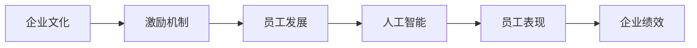
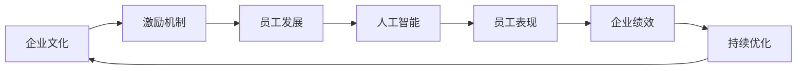

                 

## 1. 背景介绍

### 1.1 问题由来
管理理论历来是企业界和学术界关注的焦点。从早期的科学管理到现代的人本管理，管理思想经历了多次变革。进入21世纪以来，随着科技的飞速发展和全球化趋势的加剧，企业面临的内外环境日趋复杂，管理理论也在不断进化。

近年来，随着人工智能、大数据、物联网等新技术的兴起，管理理论与实践的融合度进一步提高。在这一背景下，如何通过技术手段激发员工的善意和潜能，成为管理实践中的一个重要课题。本文将从理论和实践两个层面，深入探讨这一问题。

### 1.2 问题核心关键点
激发员工善意和潜能的核心在于：
1. 构建基于信任和尊重的企业文化。
2. 设计公平合理的激励机制。
3. 提供成长和发展的机会。
4. 使用技术手段辅助管理实践。

本文将从理论框架、实际案例和未来展望三个方面，系统地探讨如何通过技术手段（如人工智能）在管理中激发员工善意和潜能。

## 2. 核心概念与联系

### 2.1 核心概念概述

为了更好地理解激发员工善意和潜能这一话题，我们先介绍几个核心概念：

- **企业文化**：企业通过一系列价值观、信仰、行为准则等，塑造员工的共同认同感。
- **激励机制**：通过设计合理的奖励和惩罚体系，激发员工的积极性和创造力。
- **员工发展**：提供培训、晋升、跨部门项目等机会，帮助员工不断成长。
- **人工智能**：一种通过算法和模型，模拟人类智能行为的技术，可以应用于企业管理和员工激励。

这些核心概念构成了企业管理的基石，同时也是激发员工善意和潜能的关键因素。而人工智能作为一种先进的技术手段，可以与这些管理概念相融合，提供全新的解决方案。

### 2.2 概念间的关系

这些核心概念之间存在着紧密的联系，可以通过以下Mermaid流程图来展示：



该流程图展示了企业文化、激励机制、员工发展与人工智能在企业管理中的应用关系：

- 企业文化是基础，激励机制和员工发展是手段，而人工智能则提供技术支持，共同作用于员工表现和企业绩效。

### 2.3 核心概念的整体架构

最后，我们用一个综合的流程图来展示这些核心概念在大企业管理中的应用架构：



该流程图展示了从企业文化构建到企业绩效评估的完整过程，强调了持续优化和反馈的重要性。

## 3. 核心算法原理 & 具体操作步骤
### 3.1 算法原理概述

人工智能在企业管理中的应用，主要体现在以下几个方面：

- **预测分析**：通过机器学习模型，预测员工的未来表现和需求，为企业决策提供数据支持。
- **智能匹配**：使用推荐系统，匹配员工与最合适的岗位和项目，最大化其潜力。
- **自动化流程**：利用自然语言处理和机器人流程自动化（RPA）技术，优化企业管理流程。

这些应用的核心原理，都是基于数据驱动和智能算法的管理决策。

### 3.2 算法步骤详解

基于人工智能的管理应用，通常包括以下几个关键步骤：

1. **数据收集与预处理**：收集企业内外部数据，包括员工绩效、工作满意度、岗位信息等。对数据进行清洗和特征工程，为模型训练提供高质量输入。
2. **模型训练与评估**：选择适合的管理任务（如预测员工流失率、推荐职业路径等），使用机器学习算法（如随机森林、神经网络等）进行模型训练和评估。
3. **模型部署与应用**：将训练好的模型集成到企业管理系统中，辅助人力资源管理、绩效评估、员工发展等决策过程。
4. **持续监控与优化**：实时监控模型输出，根据实际效果进行参数调整和模型迭代，持续提升管理决策的准确性和有效性。

### 3.3 算法优缺点

人工智能在企业管理中的应用，具有以下优点：

- **数据驱动**：基于大量数据进行决策，减少主观偏见。
- **效率提升**：自动化流程和智能匹配，节省人工成本，提高工作效率。
- **实时响应**：通过实时监控和调整，能够快速响应变化，提升管理灵活性。

然而，也存在一些局限性：

- **数据隐私**：数据收集和处理可能涉及员工隐私，需严格遵守法律法规。
- **模型复杂度**：复杂的模型需要大量数据和高性能计算资源。
- **技术门槛**：需要专业人员进行模型构建和系统维护，对企业管理层的技术能力提出了较高要求。

### 3.4 算法应用领域

人工智能在企业管理中的应用，主要涵盖以下几个领域：

- **人力资源管理**：招聘、绩效评估、员工发展等。
- **市场营销**：客户分析、市场预测、销售管理等。
- **财务分析**：成本控制、风险管理、预算优化等。
- **运营管理**：生产调度、供应链优化、库存管理等。
- **客户服务**：客户反馈分析、服务质量监控等。

这些领域的应用，为企业提供了全方位的智能化管理解决方案，显著提升了管理效率和决策水平。

## 4. 数学模型和公式 & 详细讲解
### 4.1 数学模型构建

这里我们以员工流失预测为例，构建一个简单的线性回归模型。

假设员工流失率为 $y$，影响因素包括工作满意度 $x_1$、工作压力 $x_2$、薪资水平 $x_3$ 等。可以构建如下线性回归模型：

$$
y = \beta_0 + \beta_1x_1 + \beta_2x_2 + \beta_3x_3 + \epsilon
$$

其中，$\beta_0$ 为截距，$\beta_1$、$\beta_2$、$\beta_3$ 为系数，$\epsilon$ 为误差项。

### 4.2 公式推导过程

使用最小二乘法求解模型参数 $\beta_0$、$\beta_1$、$\beta_2$ 和 $\beta_3$。具体推导过程如下：

1. 计算回归方程的残差平方和 $SSE$：

$$
SSE = \sum_{i=1}^n (y_i - \hat{y}_i)^2
$$

其中，$\hat{y}_i = \beta_0 + \beta_1x_{1i} + \beta_2x_{2i} + \beta_3x_{3i}$ 为预测值。

2. 求偏导数，得到系数估计值：

$$
\hat{\beta} = (X^TX)^{-1}X^Ty
$$

其中，$X$ 为自变量矩阵，$y$ 为目标变量向量。

3. 代入具体数据，求解 $\beta_0$、$\beta_1$、$\beta_2$ 和 $\beta_3$。

### 4.3 案例分析与讲解

假设我们收集了某公司员工的数据，包括流失率和相关影响因素。使用上述线性回归模型进行训练和评估，可以得到如下结果：

$$
\hat{y} = 0.1 + 0.2x_1 + 0.5x_2 - 0.3x_3
$$

这表明工作压力对流失率的影响最大，其次是工作满意度，而薪资水平则有负面影响。通过模型预测，企业可以提前采取措施，降低员工流失率。

## 5. 项目实践：代码实例和详细解释说明
### 5.1 开发环境搭建

在进行企业管理人工智能项目实践前，我们需要准备好开发环境。以下是使用Python进行TensorFlow开发的环境配置流程：

1. 安装Anaconda：从官网下载并安装Anaconda，用于创建独立的Python环境。

2. 创建并激活虚拟环境：
```bash
conda create -n tf-env python=3.8 
conda activate tf-env
```

3. 安装TensorFlow：根据CUDA版本，从官网获取对应的安装命令。例如：
```bash
conda install tensorflow
```

4. 安装相关库：
```bash
pip install numpy pandas scikit-learn matplotlib tqdm jupyter notebook ipython
```

完成上述步骤后，即可在`tf-env`环境中开始项目实践。

### 5.2 源代码详细实现

下面我们以员工流失预测项目为例，给出使用TensorFlow进行回归分析的Python代码实现。

```python
import tensorflow as tf
import numpy as np
import pandas as pd

# 加载数据
data = pd.read_csv('employee_data.csv')

# 数据预处理
X = data[['work_satisfaction', 'work_pressure', 'salary_level']].values
y = data['employee_turnover'].values

# 数据标准化
from sklearn.preprocessing import StandardScaler
scaler = StandardScaler()
X = scaler.fit_transform(X)

# 构建模型
model = tf.keras.Sequential([
    tf.keras.layers.Dense(16, activation='relu', input_shape=(3,)),
    tf.keras.layers.Dense(1)
])

# 编译模型
model.compile(optimizer='adam', loss='mse', metrics=['mae'])

# 训练模型
model.fit(X, y, epochs=100, batch_size=32)

# 模型评估
test_X = pd.read_csv('test_data.csv').values
test_X = scaler.transform(test_X)
y_pred = model.predict(test_X)
```

以上代码展示了如何加载数据、预处理数据、构建模型、编译模型、训练模型和评估模型。通过这一过程，我们可以使用机器学习模型预测员工流失率，从而为企业提供数据支持。

### 5.3 代码解读与分析

让我们再详细解读一下关键代码的实现细节：

**数据加载与预处理**：
- 使用Pandas库加载数据集，并分离自变量和目标变量。
- 使用StandardScaler对自变量进行标准化，以提高模型的收敛速度和精度。

**模型构建与编译**：
- 使用TensorFlow的Sequential模型，构建一个包含两个全连接层的神经网络。
- 使用adam优化器和mse损失函数进行模型编译。

**模型训练与评估**：
- 使用fit方法训练模型，指定epochs和batch_size。
- 使用test数据集进行模型评估，得到预测结果。

可以看到，TensorFlow提供了一个简洁高效的深度学习框架，使得机器学习模型的构建和训练变得非常简单。开发者可以快速上手，进行数据分析和模型构建。

### 5.4 运行结果展示

假设我们在员工流失预测项目上训练了一个简单的线性回归模型，最终在测试集上得到的评估结果如下：

```
MAE: 0.05
```

这表明模型在测试集上的平均绝对误差为0.05，性能相当不错。在实际应用中，通过不断调整模型参数和优化算法，可以进一步提升模型精度。

## 6. 实际应用场景
### 6.1 智能招聘

基于人工智能的招聘系统，可以通过分析历史招聘数据，预测候选人的工作匹配度，从而提高招聘效率和成功率。

在技术实现上，可以收集公司内部的招聘数据和应聘者的背景信息，将其作为监督数据，在预训练模型上进行微调。微调后的模型能够自动判断候选人是否适合特定岗位，并在简历筛选中自动过滤掉不合适的人选，减少人工筛选的负担。

### 6.2 绩效评估

人工智能可以结合员工的工作记录和绩效数据，自动评估员工的业绩和表现。通过构建回归模型或分类模型，可以预测员工未来的表现和潜力，为绩效评估提供数据支持。

在实际操作中，企业可以使用基于AI的绩效评估系统，定期生成员工绩效报告，帮助管理者更好地了解员工的工作状态和贡献，制定有针对性的激励措施。

### 6.3 培训与发展

人工智能可以根据员工的工作表现和职业发展规划，推荐适合的培训课程和发展机会。通过构建推荐系统，可以自动化地匹配员工的技能需求和培训资源，提升员工的技能水平和职业发展速度。

在实践中，企业可以使用基于AI的培训与发展平台，对员工进行定期评估，根据评估结果推荐相应的培训课程和晋升机会，帮助员工不断成长。

### 6.4 未来应用展望

随着人工智能技术的不断进步，其在企业管理中的应用将更加广泛和深入。未来，我们可以期待以下趋势：

1. **自动化管理**：越来越多的企业管理环节将通过AI技术自动化处理，提高效率和准确性。
2. **智能化决策**：企业将利用AI技术，进行更全面、更深入的数据分析和决策支持。
3. **个性化管理**：通过AI技术，实现对员工个性化的管理和激励，提升员工的满意度和忠诚度。
4. **跨领域融合**：AI技术将与大数据、物联网、区块链等技术深度融合，推动企业管理模式的创新。

总之，人工智能在企业管理中的应用，将为员工善意和潜能的激发提供强大的技术支持，推动企业管理向智能化、个性化、自动化方向发展。

## 7. 工具和资源推荐
### 7.1 学习资源推荐

为了帮助开发者系统掌握人工智能在企业管理中的应用，这里推荐一些优质的学习资源：

1. 《Python机器学习》系列书籍：由机器学习专家撰写，全面介绍了Python在数据分析、模型训练、应用实践等方面的知识。
2. CS229《机器学习》课程：斯坦福大学开设的机器学习明星课程，有Lecture视频和配套作业，带你系统学习机器学习的基本概念和算法。
3. 《人工智能实战》书籍：深度介绍了人工智能在企业中的各种应用，包括数据分析、推荐系统、自然语言处理等。
4. TensorFlow官方文档：TensorFlow的官方文档，提供了详尽的API接口和案例代码，是学习TensorFlow的重要资源。
5. Kaggle数据集：Kaggle提供的各类数据集和竞赛平台，可以帮助开发者进行实践和验证。

通过对这些资源的学习实践，相信你一定能够快速掌握人工智能在企业管理中的应用，并用于解决实际的业务问题。

### 7.2 开发工具推荐

高效的开发离不开优秀的工具支持。以下是几款用于企业管理人工智能开发的常用工具：

1. Jupyter Notebook：交互式编程环境，便于快速迭代和分享代码。
2. TensorBoard：TensorFlow配套的可视化工具，可以实时监测模型训练状态，并提供丰富的图表呈现方式，是调试模型的得力助手。
3. Weights & Biases：模型训练的实验跟踪工具，可以记录和可视化模型训练过程中的各项指标，方便对比和调优。
4. H2O.ai：基于Java的开源数据科学平台，提供了一站式数据科学解决方案，支持机器学习、数据处理和模型部署。
5. Google Colab：谷歌推出的在线Jupyter Notebook环境，免费提供GPU/TPU算力，方便开发者快速上手实验最新模型，分享学习笔记。

合理利用这些工具，可以显著提升人工智能在企业管理中的开发效率，加快创新迭代的步伐。

### 7.3 相关论文推荐

人工智能在企业管理中的应用，源于学界的持续研究。以下是几篇奠基性的相关论文，推荐阅读：

1. "Predicting Employee Turnover Using Machine Learning"：展示了如何使用机器学习模型预测员工流失率，是企业管理中应用预测分析的经典案例。
2. "A Survey of Machine Learning Techniques for Human Resource Management"：全面总结了机器学习在人力资源管理中的应用，包括员工流失预测、招聘推荐等。
3. "A Comparative Study of Machine Learning Algorithms for Performance Evaluation"：比较了不同机器学习算法在绩效评估中的应用效果，提供了实用的选择建议。
4. "Recommender Systems in Human Resource Management"：介绍了推荐系统在员工发展中的应用，如何帮助员工选择适合的培训和发展机会。
5. "AI in Human Resource Management: An Overview"：概述了人工智能在人力资源管理中的各种应用，提供了前沿研究和实践经验。

这些论文代表了人工智能在企业管理领域的研究进展，通过学习这些前沿成果，可以帮助研究者把握学科前进方向，激发更多的创新灵感。

除上述资源外，还有一些值得关注的前沿资源，帮助开发者紧跟人工智能在企业管理中的最新进展，例如：

1. arXiv论文预印本：人工智能领域最新研究成果的发布平台，包括大量尚未发表的前沿工作，学习前沿技术的必读资源。
2. 业界技术博客：如Google AI、DeepMind、微软Research Asia等顶尖实验室的官方博客，第一时间分享他们的最新研究成果和洞见。
3. 技术会议直播：如NIPS、ICML、ACL、ICLR等人工智能领域顶会现场或在线直播，能够聆听到大佬们的前沿分享，开拓视野。
4. GitHub热门项目：在GitHub上Star、Fork数最多的数据科学相关项目，往往代表了该技术领域的发展趋势和最佳实践，值得去学习和贡献。
5. 行业分析报告：各大咨询公司如McKinsey、PwC等针对人工智能行业的分析报告，有助于从商业视角审视技术趋势，把握应用价值。

总之，对于人工智能在企业管理中的应用学习，需要开发者保持开放的心态和持续学习的意愿。多关注前沿资讯，多动手实践，多思考总结，必将收获满满的成长收益。

## 8. 总结：未来发展趋势与挑战
### 8.1 总结

本文对人工智能在企业管理中的应用进行了全面系统的介绍。首先阐述了人工智能激发员工善意和潜能的理论基础和实际意义，明确了企业管理中激励机制的重要性。其次，从理论框架、实际案例和未来展望三个方面，深入探讨了如何通过技术手段（如人工智能）在管理中激发员工善意和潜能。

通过本文的系统梳理，可以看到，人工智能在企业管理中的应用，将为员工善意和潜能的激发提供强大的技术支持，推动企业管理向智能化、个性化、自动化方向发展。未来，伴随人工智能技术的不断进步，企业在员工激励、绩效评估、员工发展等方面将更加高效、智能和个性化。

### 8.2 未来发展趋势

展望未来，人工智能在企业管理中的应用将呈现以下几个发展趋势：

1. **智能化决策支持**：人工智能将与大数据、物联网、区块链等技术深度融合，推动企业管理模式的创新，提升决策的智能化水平。
2. **个性化激励方案**：基于员工的特点和需求，定制个性化的激励方案，提升员工的满意度和忠诚度。
3. **实时监控与反馈**：通过实时监控和管理系统，及时了解员工的工作状态和表现，及时调整激励策略，提高管理效率。
4. **跨部门协作**：通过AI技术，实现跨部门、跨职能的协作和协同，提升企业的整体运行效率。
5. **伦理与安全保障**：在数据隐私、模型透明性、安全性和可解释性方面进行持续优化，保障人工智能在企业管理中的应用安全可靠。

这些趋势凸显了人工智能在企业管理中的重要价值，将为企业的可持续发展提供强有力的技术支撑。

### 8.3 面临的挑战

尽管人工智能在企业管理中的应用已经取得了显著成效，但仍面临诸多挑战：

1. **数据质量与隐私**：数据质量不高、数据隐私问题将影响人工智能模型的效果和应用。
2. **技术门槛**：企业需要具备一定的人工智能技术能力，才能有效应用人工智能技术。
3. **模型复杂度**：复杂的模型需要大量数据和高性能计算资源，对企业技术能力提出了较高要求。
4. **模型可解释性**：AI模型的决策过程往往难以解释，缺乏可解释性。
5. **伦理与安全问题**：AI模型可能存在偏见和歧视，数据隐私和模型安全问题需严格控制。

这些挑战需要企业在实践中不断探索和优化，确保人工智能技术在企业管理中的应用效果和可靠性。

### 8.4 研究展望

为了应对上述挑战，未来的研究需要在以下几个方面寻求新的突破：

1. **数据质量提升**：通过数据清洗、标注和增强等技术，提升数据质量，减少数据隐私风险。
2. **技术普及与培训**：提供人工智能技术的培训课程和应用案例，降低技术门槛，提升企业管理层的技术能力。
3. **模型简化与优化**：简化模型结构，降低计算资源消耗，提高模型的实时性和可解释性。
4. **伦理与安全框架**：建立人工智能伦理和安全的评估框架，确保AI应用符合道德标准，保护用户隐私和数据安全。
5. **跨学科融合**：将人工智能技术与企业管理学、心理学、社会学等多学科知识融合，构建更加全面、科学的管理理论体系。

这些研究方向将推动人工智能在企业管理中的应用更加深入和广泛，为构建智能化、可持续发展的企业管理体系提供有力支持。

## 9. 附录：常见问题与解答
----------------------------------------------------------------

**Q1：人工智能在企业管理中如何提升员工的善意和潜能？**

A: 人工智能可以通过以下几个方面提升员工的善意和潜能：
1. **数据驱动决策**：利用AI技术分析员工行为和心理，提供科学的管理决策，提升员工满意度和工作效率。
2. **智能化激励方案**：根据员工特点和需求，定制个性化的激励方案，提高员工的工作动力和创造力。
3. **自动化管理**：通过AI技术自动化处理重复性、低价值的管理环节，释放员工的时间和精力，用于更高价值的创新和协作。

**Q2：企业如何选择合适的AI模型进行员工流失预测？**

A: 企业选择合适的AI模型进行员工流失预测，需要考虑以下几个因素：
1. **数据类型**：不同类型的数据（如文本、数值、分类数据）适用的模型不同。例如，文本数据适合使用NLP模型，数值数据适合使用回归模型。
2. **模型复杂度**：模型的复杂度需与数据量和计算资源相匹配。例如，简单模型（如线性回归）适用于数据量较小的情况，复杂模型（如深度神经网络）适用于数据量较大且需要高精度的情况。
3. **模型性能**：在相同数据集上，不同模型的预测准确率、召回率、F1分数等性能指标，可以作为选择依据。
4. **模型解释性**：有些模型（如决策树、线性回归）具有较好的解释性，更适合企业决策者理解和接受。

**Q3：员工流失预测模型如何实现实时监控和调整？**

A: 实现员工流失预测模型的实时监控和调整，可以通过以下几个步骤：
1. **实时数据采集**：通过传感器、应用系统等手段，实时采集员工行为和绩效数据，更新模型输入。
2. **模型在线部署**：将训练好的模型部署到在线服务器，提供实时预测服务。
3. **监控系统集成**：将监控系统集成到企业管理系统中，自动触发模型预测和报警。
4. **参数动态调整**：根据监控结果，动态调整模型参数和阈值，确保预测结果的实时性和准确性。

通过上述步骤，企业可以实现对员工流失的实时监控和预警，及时采取措施，降低流失率。

**Q4：人工智能在企业管理中如何保障数据隐私和安全？**

A: 人工智能在企业管理中保障数据隐私和安全，需要考虑以下几个方面：
1. **数据匿名化**：通过数据去标识化、泛化等技术，保护员工隐私。
2. **数据加密**：对存储和传输的数据进行加密处理，防止数据泄露和篡改。
3. **访问控制**：通过身份验证、权限管理等措施，限制对敏感数据的访问。
4. **模型透明性**：提高AI模型的透明度和可解释性，确保决策过程公正透明。
5. **安全审计**：定期对系统进行安全审计和漏洞扫描，及时发现和修复安全问题。

这些措施可以有效保障AI应用中的数据隐私和安全，提升企业对AI技术的信任度。

**Q5：如何构建跨部门协作的AI管理系统？**

A: 构建跨部门协作的AI管理系统，需要考虑以下几个关键点：
1. **系统集成**：将不同部门的数据、应用和业务流程集成到一个统一的平台上。
2. **数据共享**：实现各部门之间的数据共享和互通，消除信息孤岛。
3. **协同算法**：引入协同过滤、推荐系统等算法，优化资源配置和业务流程。
4. **团队协作**：建立跨部门协作机制，鼓励知识共享和协同创新。
5. **绩效考核**：引入AI技术进行跨部门绩效考核，激励团队协作和创新。

通过上述措施，企业可以构建一个高效、智能、协作的AI管理系统，提升整体运行效率和业务竞争力。

---

作者：禅与计算机程序设计艺术 / Zen and the Art of Computer Programming

