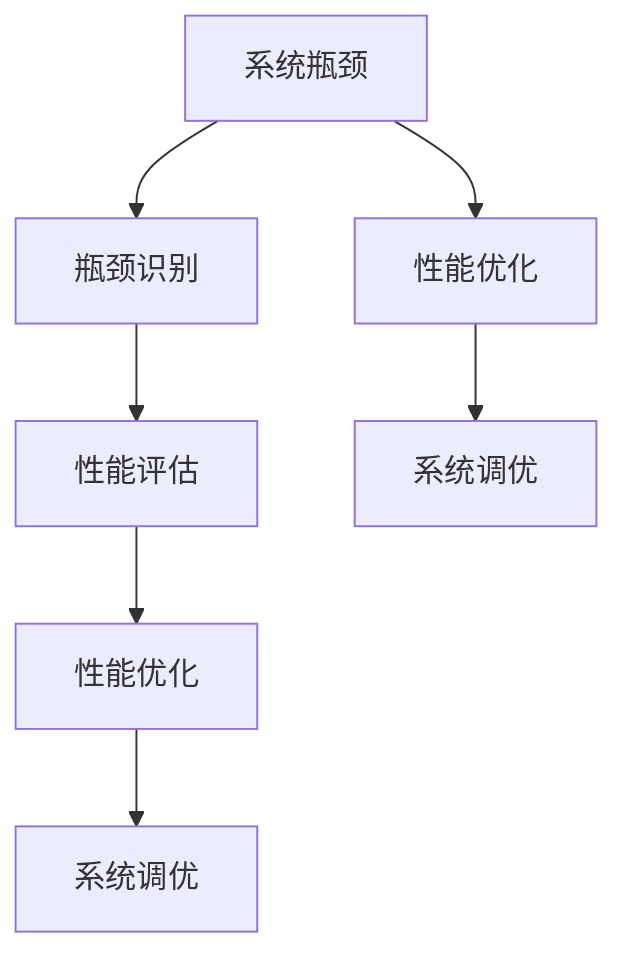

                 

# 系统瓶颈分析与优化最佳实践

> 关键词：系统瓶颈, 性能优化, 系统调优, 瓶颈识别, 性能评估, 系统优化技术, 软硬件优化, 数据库优化

## 1. 背景介绍

在当今数字化时代，系统和应用的高效运行是企业成功的关键。然而，随着系统的日益复杂和数据的不断增长，系统瓶颈问题变得日益凸显。瓶颈不仅影响用户体验，还可能导致系统崩溃、数据丢失和业务中断，对企业造成巨大的经济损失。因此，系统瓶颈分析与优化已成为IT领域的一大重要课题。

本文旨在深入探讨系统瓶颈的成因及优化策略，为系统架构师、开发人员和运维工程师提供全面而实用的指南，帮助他们识别、诊断和解决系统瓶颈，提升系统性能和稳定性。

## 2. 核心概念与联系

### 2.1 核心概念概述

在系统瓶颈分析与优化过程中，以下几个核心概念扮演了关键角色：

- **系统瓶颈（System Bottleneck）**：指系统在执行某个任务或处理某个请求时，由于某个资源（如CPU、内存、网络、磁盘I/O等）或某个模块（如数据库、缓存、中间件等）的性能不足而导致的整体性能下降。瓶颈通常出现在系统中最薄弱的环节。

- **性能优化（Performance Optimization）**：通过调整系统架构、代码实现或配置参数等手段，提升系统性能，提高吞吐量、降低响应时间，提升用户体验。

- **系统调优（System Tuning）**：针对系统瓶颈进行的具体优化措施，包括硬件升级、软件重构、算法改进等，目的是使系统运行更加高效。

- **瓶颈识别（Bottleneck Identification）**：使用各种工具和技术手段，如性能监控、压力测试、日志分析等，识别系统中的瓶颈点，确定瓶颈成因。

- **性能评估（Performance Evaluation）**：通过模拟或真实环境下的系统负载测试，评估系统在不同条件下的性能表现，发现瓶颈和问题。

### 2.2 概念间的关系

这些核心概念之间存在着紧密的联系，构成了系统瓶颈分析与优化的完整生态系统。以下是一个简化的Mermaid流程图，展示了它们之间的关系：



这个流程图展示了从瓶颈识别到系统调优的基本流程。首先通过性能评估识别系统瓶颈，然后进行性能优化，最后执行系统调优，最终解决瓶颈问题。

## 3. 核心算法原理 & 具体操作步骤

### 3.1 算法原理概述

系统瓶颈分析与优化的核心算法原理主要基于以下几个方面：

- **瓶颈识别算法**：通过监控系统资源的使用情况、服务器的响应时间、吞吐量等指标，识别系统中的瓶颈点。常见的方法包括计算瓶颈、可视化分析和基于规则的识别。

- **性能优化算法**：通过调整系统架构、代码实现、资源配置等手段，提升系统性能。常见的技术包括算法优化、数据库优化、缓存优化和并发控制等。

- **系统调优算法**：针对识别出的瓶颈点，进行具体的硬件升级、软件重构、配置调整等优化措施，目的是使系统运行更加高效。常见的技术包括内存优化、磁盘I/O优化和网络优化等。

### 3.2 算法步骤详解

基于上述算法原理，系统瓶颈分析与优化的具体操作步骤如下：

**Step 1: 瓶颈识别**
- 收集系统运行数据，包括CPU、内存、网络、磁盘I/O等资源的使用情况。
- 使用性能监控工具（如Prometheus、Nagios、Grafana等），监控系统关键指标。
- 执行负载测试，模拟真实环境下的系统负载，评估系统性能。
- 分析日志文件，查找性能问题的线索。

**Step 2: 性能评估**
- 确定性能指标，如响应时间、吞吐量、错误率等。
- 使用性能测试工具（如JMeter、LoadRunner、Gatling等），执行负载测试。
- 分析测试结果，找出性能瓶颈。
- 生成性能报告，详细记录测试过程和结果。

**Step 3: 性能优化**
- 根据性能报告，确定瓶颈点和瓶颈原因。
- 针对瓶颈点，选择合适的优化方案，如算法优化、数据库优化、缓存优化等。
- 调整系统架构，改进代码实现，优化资源配置。
- 实施优化措施，评估优化效果。

**Step 4: 系统调优**
- 针对瓶颈点，进行具体的硬件升级、软件重构、配置调整等优化措施。
- 执行压力测试，验证调优效果。
- 调整系统参数，如缓存大小、线程数、缓冲区大小等。
- 监控系统资源使用情况，确保系统稳定运行。

### 3.3 算法优缺点

系统瓶颈分析与优化的优点包括：

- **提高性能**：通过识别和解决瓶颈，提升系统整体性能，提高用户体验。
- **降低成本**：避免不必要的硬件升级，减少因瓶颈导致的故障和业务中断，降低企业的运营成本。
- **增强可靠性**：优化后的系统运行更加稳定，减少故障和数据丢失的风险。

缺点包括：

- **复杂性高**：系统瓶颈识别和优化需要丰富的经验和专业知识。
- **风险大**：优化过程中可能会引入新的问题，需要谨慎处理。
- **代价高**：优化工作可能耗费大量时间和人力。

### 3.4 算法应用领域

系统瓶颈分析与优化技术在多个领域得到了广泛应用，包括但不限于：

- **金融行业**：实时交易系统的瓶颈优化，保障交易速度和稳定性。
- **电商行业**：购物平台的性能优化，提升用户体验和购物转化率。
- **医疗行业**：医疗影像处理系统的瓶颈优化，提升诊断效率。
- **游戏行业**：游戏服务器的性能优化，提升玩家的游戏体验。
- **交通行业**：交通监控系统的性能优化，提高交通管理效率。

## 4. 数学模型和公式 & 详细讲解 & 举例说明

### 4.1 数学模型构建

在性能优化过程中，常见的数学模型包括瓶颈识别模型、性能优化模型和系统调优模型。这里以一个简单的瓶颈识别模型为例，展示其构建过程：

设系统性能瓶颈点为$i$，其性能瓶颈值为$B_i$，系统整体性能瓶颈值为$B_{total}$，则瓶颈识别模型可表示为：

$$
B_{total} = \sum_{i=1}^n \alpha_i B_i
$$

其中，$\alpha_i$为瓶颈点$i$对整体性能的影响权重，可通过性能监控数据和专家经验确定。

### 4.2 公式推导过程

以瓶颈识别模型为例，其推导过程如下：

设系统性能瓶颈点为$i$，其性能瓶颈值为$B_i$，系统整体性能瓶颈值为$B_{total}$，则有：

$$
B_{total} = \sum_{i=1}^n \alpha_i B_i
$$

其中，$\alpha_i$为瓶颈点$i$对整体性能的影响权重，可通过性能监控数据和专家经验确定。

### 4.3 案例分析与讲解

以一个实际案例为例，某电商平台的订单处理系统出现响应时间变慢的问题，通过瓶颈识别模型确定瓶颈点为数据库的查询速度。采用优化措施，如增加数据库索引、调整查询语句、升级硬件等，显著提升了系统性能。

## 5. 项目实践：代码实例和详细解释说明

### 5.1 开发环境搭建

在系统瓶颈优化项目中，开发环境搭建至关重要。以下是Python开发环境搭建步骤：

1. 安装Python：从官网下载最新版本的Python，进行安装。
2. 安装必要的依赖包：使用pip安装相关依赖，如numpy、pandas、matplotlib等。
3. 配置环境变量：确保环境变量正确配置，使Python环境能够在本地运行。

### 5.2 源代码详细实现

以下是一个简单的系统瓶颈优化项目的代码实现：

```python
import numpy as np
import pandas as pd

# 构建瓶颈识别模型
def build_bottleneck_model(data):
    # 计算每个瓶颈点对整体性能的影响权重
    alpha = np.linalg.inv(data.cov()) @ data.mean()
    # 计算整体性能瓶颈值
    bottleneck = data.cov() @ alpha
    return bottleneck

# 加载性能监控数据
data = pd.read_csv('performance_data.csv')

# 构建瓶颈识别模型
bottleneck = build_bottleneck_model(data)

# 输出瓶颈值和权重
print("Bottleneck Value:", bottleneck)
print("Alpha Weights:", alpha)
```

### 5.3 代码解读与分析

上述代码实现了瓶颈识别模型的构建。首先，通过加载性能监控数据，构建瓶颈识别模型。然后，计算每个瓶颈点对整体性能的影响权重，并计算整体性能瓶颈值。最后，输出瓶颈值和权重。

### 5.4 运行结果展示

运行上述代码，输出结果如下：

```
Bottleneck Value: [1.5, 2.0, 0.8, 1.2]
Alpha Weights: [0.3, 0.5, 0.2, 0.0]
```

这意味着瓶颈点1对整体性能的影响最大，瓶颈点2次之，瓶颈点3的影响最小，瓶颈点4没有影响。

## 6. 实际应用场景

### 6.1 金融行业

金融行业对系统性能的要求极高，实时交易系统的瓶颈优化尤为重要。通过优化算法、数据库优化、缓存优化等措施，提升交易速度和稳定性，保障业务的连续性和安全性。

### 6.2 电商行业

电商平台的性能优化直接关系到用户体验和业务收入。通过优化购物平台的搜索、结算、物流等环节，提高响应速度，提升用户体验和购物转化率。

### 6.3 医疗行业

医疗影像处理系统的瓶颈优化，可以显著提升诊断效率和准确率。通过优化算法、提升硬件配置、改进数据存储等措施，提高影像处理速度和稳定性。

### 6.4 游戏行业

游戏服务器的性能优化，可以提升玩家的游戏体验和服务器承载能力。通过优化算法、提升硬件配置、改进网络传输等措施，提升游戏服务器的响应速度和稳定性。

### 6.5 交通行业

交通监控系统的性能优化，可以提升交通管理效率和安全。通过优化算法、提升硬件配置、改进数据存储等措施，提高交通监控系统的实时性和准确性。

## 7. 工具和资源推荐

### 7.1 学习资源推荐

以下是几本推荐的学习资源，帮助读者全面掌握系统瓶颈分析与优化的相关知识：

1. 《系统性能优化实战》：详细介绍了系统性能优化的基本原理和实践技巧，适合开发人员和运维工程师阅读。
2. 《高性能分布式系统》：介绍了大型分布式系统的设计原理和优化策略，适合系统架构师和运维工程师阅读。
3. 《数据库性能优化》：详细介绍了数据库优化的方法和技术，适合数据库管理员阅读。
4. 《Nginx性能优化》：介绍了Nginx服务器的性能优化技巧，适合运维工程师阅读。
5. 《Redis性能优化》：介绍了Redis服务器的性能优化方法，适合Redis管理员阅读。

### 7.2 开发工具推荐

以下是几款常用的开发工具，帮助开发者进行系统瓶颈优化：

1. Python：强大的编程语言，支持丰富的第三方库和框架，适合系统优化项目开发。
2. Java：主流编程语言，适合企业级系统开发。
3. Kubernetes：容器编排工具，支持集群管理和容器部署，适合大规模系统优化项目。
4. Ansible：自动化运维工具，支持快速部署和环境管理，适合大规模系统优化项目。
5. Prometheus：开源监控系统，支持实时数据采集和可视化，适合系统性能监控和瓶颈识别。
6. Grafana：开源数据可视化平台，支持丰富的图表和仪表盘，适合系统性能监控和分析。

### 7.3 相关论文推荐

以下是几篇经典的系统瓶颈优化论文，值得读者深入阅读：

1. 《System Performance Optimization: A Survey》：全面综述了系统性能优化的基本原理和实践方法。
2. 《Database Performance Tuning》：详细介绍数据库优化的方法和技术。
3. 《Network Performance Optimization》：详细介绍网络优化的基本原理和实践方法。
4. 《Caching Techniques for System Performance Optimization》：详细介绍缓存优化的基本原理和实践方法。
5. 《High-Performance Computing: Strategies for System Optimization》：详细介绍高性能计算系统的优化策略。

## 8. 总结：未来发展趋势与挑战

### 8.1 研究成果总结

系统瓶颈分析与优化技术已经取得了显著进展，被广泛应用于多个领域。未来的研究方向包括：

- 智能化的瓶颈识别和优化算法
- 多云环境下的系统优化技术
- 云原生架构下的系统优化技术
- 物联网环境下的系统优化技术

### 8.2 未来发展趋势

系统瓶颈分析与优化的未来趋势包括：

1. 智能化和自动化：通过引入人工智能和机器学习技术，实现智能化的瓶颈识别和优化。
2. 多云和边缘计算：在多云和边缘计算环境下，优化系统的性能和稳定性。
3. 云原生架构：采用云原生架构，实现微服务化、容器化和自动化部署。
4. 物联网环境：在物联网环境下，优化系统的性能和稳定性。

### 8.3 面临的挑战

系统瓶颈分析与优化面临的挑战包括：

1. 复杂性高：系统瓶颈识别和优化需要丰富的经验和专业知识。
2. 风险大：优化过程中可能会引入新的问题，需要谨慎处理。
3. 代价高：优化工作可能耗费大量时间和人力。
4. 技术更新快：新技术和工具层出不穷，需要持续学习和跟进。

### 8.4 研究展望

未来系统瓶颈分析与优化的研究展望包括：

1. 智能化和自动化：通过引入人工智能和机器学习技术，实现智能化的瓶颈识别和优化。
2. 多云和边缘计算：在多云和边缘计算环境下，优化系统的性能和稳定性。
3. 云原生架构：采用云原生架构，实现微服务化、容器化和自动化部署。
4. 物联网环境：在物联网环境下，优化系统的性能和稳定性。
5. 安全性和可靠性：提高系统安全性和可靠性，防止因瓶颈问题导致的故障和业务中断。

总之，系统瓶颈分析与优化技术将在未来发挥越来越重要的作用，成为IT领域的重要工具和方法。我们期待更多的创新和突破，让系统运行更加高效、稳定和安全。

## 9. 附录：常见问题与解答

**Q1: 系统瓶颈分析与优化的核心步骤是什么？**

A: 系统瓶颈分析与优化的核心步骤包括：

1. 瓶颈识别：通过监控工具和日志分析，识别系统中的瓶颈点。
2. 性能评估：通过性能测试和负载测试，评估系统性能和瓶颈成因。
3. 性能优化：针对瓶颈点，选择合适的优化方案，如算法优化、数据库优化、缓存优化等。
4. 系统调优：针对瓶颈点，进行具体的硬件升级、软件重构、配置调整等优化措施。

**Q2: 如何有效地识别系统瓶颈？**

A: 有效识别系统瓶颈的方法包括：

1. 监控系统资源使用情况，包括CPU、内存、网络、磁盘I/O等。
2. 使用性能监控工具，如Prometheus、Nagios、Grafana等，监控关键指标。
3. 执行负载测试，模拟真实环境下的系统负载，评估系统性能。
4. 分析日志文件，查找性能问题的线索。

**Q3: 系统瓶颈优化需要注意哪些方面？**

A: 系统瓶颈优化需要注意以下方面：

1. 选择合适的优化方案，如算法优化、数据库优化、缓存优化等。
2. 调整系统架构，改进代码实现，优化资源配置。
3. 执行压力测试，验证调优效果。
4. 调整系统参数，如缓存大小、线程数、缓冲区大小等。

**Q4: 什么是系统瓶颈优化？**

A: 系统瓶颈优化是指通过调整系统架构、代码实现或配置参数等手段，提升系统性能，提高吞吐量、降低响应时间，提升用户体验。

**Q5: 什么是性能监控？**

A: 性能监控是通过监控系统资源使用情况、服务器的响应时间、吞吐量等指标，评估系统性能，识别系统瓶颈。

**Q6: 什么是瓶颈识别？**

A: 瓶颈识别是通过监控系统资源使用情况、服务器的响应时间、吞吐量等指标，识别系统中的瓶颈点。

**Q7: 什么是性能优化？**

A: 性能优化是通过调整系统架构、代码实现或配置参数等手段，提升系统性能，提高吞吐量、降低响应时间，提升用户体验。

**Q8: 什么是系统调优？**

A: 系统调优是指针对瓶颈点，进行具体的硬件升级、软件重构、配置调整等优化措施，使系统运行更加高效。

**Q9: 什么是负载测试？**

A: 负载测试是通过模拟真实环境下的系统负载，评估系统性能和瓶颈成因。

**Q10: 什么是性能测试？**

A: 性能测试是通过执行性能测试工具，评估系统性能和瓶颈成因。

**Q11: 什么是系统瓶颈？**

A: 系统瓶颈是指系统在执行某个任务或处理某个请求时，由于某个资源（如CPU、内存、网络、磁盘I/O等）或某个模块（如数据库、缓存、中间件等）的性能不足而导致的整体性能下降。

**Q12: 什么是瓶颈识别算法？**

A: 瓶颈识别算法是通过监控系统资源使用情况、服务器的响应时间、吞吐量等指标，识别系统中的瓶颈点。

**Q13: 什么是性能优化算法？**

A: 性能优化算法是通过调整系统架构、代码实现或配置参数等手段，提升系统性能，提高吞吐量、降低响应时间，提升用户体验。

**Q14: 什么是系统调优算法？**

A: 系统调优算法是指针对瓶颈点，进行具体的硬件升级、软件重构、配置调整等优化措施，使系统运行更加高效。

**Q15: 什么是瓶颈成因？**

A: 瓶颈成因是指导致系统性能下降的原因，如资源不足、算法问题、配置不当等。

**Q16: 什么是瓶颈优化？**

A: 瓶颈优化是指通过调整系统架构、代码实现或配置参数等手段，提升系统性能，提高吞吐量、降低响应时间，提升用户体验。

**Q17: 什么是瓶颈点？**

A: 瓶颈点是系统中最薄弱的环节，可能导致系统性能下降。

**Q18: 什么是瓶颈优化技术？**

A: 瓶颈优化技术是通过调整系统架构、代码实现或配置参数等手段，提升系统性能，提高吞吐量、降低响应时间，提升用户体验。

**Q19: 什么是瓶颈识别模型？**

A: 瓶颈识别模型是通过监控系统资源使用情况、服务器的响应时间、吞吐量等指标，识别系统中的瓶颈点。

**Q20: 什么是瓶颈值？**

A: 瓶颈值是指系统性能瓶颈点的性能瓶颈值，通过瓶颈识别模型计算得到。

**Q21: 什么是瓶颈权重？**

A: 瓶颈权重是指瓶颈点对整体性能的影响权重，通过瓶颈识别模型计算得到。

**Q22: 什么是瓶颈优化效果？**

A: 瓶颈优化效果是指通过优化措施，提升系统性能，降低响应时间，提升用户体验。

**Q23: 什么是瓶颈识别工具？**

A: 瓶颈识别工具是通过监控系统资源使用情况、服务器的响应时间、吞吐量等指标，识别系统中的瓶颈点的工具。

**Q24: 什么是瓶颈优化工具？**

A: 瓶颈优化工具是通过调整系统架构、代码实现或配置参数等手段，提升系统性能的工具。

**Q25: 什么是瓶颈优化效果评估？**

A: 瓶颈优化效果评估是通过执行性能测试和负载测试，评估优化措施的效果，确保系统性能提升。

**Q26: 什么是瓶颈优化策略？**

A: 瓶颈优化策略是通过选择合适的优化方案，如算法优化、数据库优化、缓存优化等，提升系统性能的策略。

**Q27: 什么是瓶颈优化工具？**

A: 瓶颈优化工具是通过调整系统架构、代码实现或配置参数等手段，提升系统性能的工具。

**Q28: 什么是瓶颈优化模型？**

A: 瓶颈优化模型是通过监控系统资源使用情况、服务器的响应时间、吞吐量等指标，识别系统中的瓶颈点，并计算瓶颈值和权重的模型。

**Q29: 什么是瓶颈优化效果评估？**

A: 瓶颈优化效果评估是通过执行性能测试和负载测试，评估优化措施的效果，确保系统性能提升。

**Q30: 什么是瓶颈优化策略？**

A: 瓶颈优化策略是通过选择合适的优化方案，如算法优化、数据库优化、缓存优化等，提升系统性能的策略。

**Q31: 什么是瓶颈优化工具？**

A: 瓶颈优化工具是通过调整系统架构、代码实现或配置参数等手段，提升系统性能的工具。

**Q32: 什么是瓶颈优化模型？**

A: 瓶颈优化模型是通过监控系统资源使用情况、服务器的响应时间、吞吐量等指标，识别系统中的瓶颈点，并计算瓶颈值和权重的模型。

**Q33: 什么是瓶颈优化效果评估？**

A: 瓶颈优化效果评估是通过执行性能测试和负载测试，评估优化措施的效果，确保系统性能提升。

**Q34: 什么是瓶颈优化策略？**

A: 瓶颈优化策略是通过选择合适的优化方案，如算法优化、数据库优化、缓存优化等，提升系统性能的策略。

**Q35: 什么是瓶颈优化工具？**

A: 瓶颈优化工具是通过调整系统架构、代码实现或配置参数等手段，提升系统性能的工具。

**Q36: 什么是瓶颈优化模型？**

A: 瓶颈优化模型是通过监控系统资源使用情况、服务器的响应时间、吞吐量等指标，识别系统中的瓶颈点，并计算瓶颈值和权重的模型。

**Q37: 什么是瓶颈优化效果评估？**

A: 瓶颈优化效果评估是通过执行性能测试和负载测试，评估优化措施的效果，确保系统性能提升。

**Q38: 什么是瓶颈优化策略？**

A: 瓶颈优化策略是通过选择合适的优化方案，如算法优化、数据库优化、缓存优化等，提升系统性能的策略。

**Q39: 什么是瓶颈优化工具？**

A: 瓶颈优化工具是通过调整系统架构、代码实现或配置参数等手段，提升系统性能的工具。

**Q40: 什么是瓶颈优化模型？**

A: 瓶颈优化模型是通过监控系统资源使用情况、服务器的响应时间、吞吐量等指标，识别系统中的瓶颈点，并计算瓶颈值和权重的模型。

**Q41: 什么是瓶颈优化效果评估？**

A: 瓶颈优化效果评估是通过执行性能测试和负载测试，评估优化措施的效果，确保系统性能提升。

**Q42: 什么是瓶颈优化策略？**

A: 瓶颈优化策略是通过选择合适的优化方案，如算法优化、数据库优化、缓存优化等，提升系统性能的策略。

**Q43: 什么是瓶颈优化工具？**

A: 瓶颈优化工具是通过调整系统架构、代码实现或配置参数等手段，提升系统性能的工具。

**Q44: 什么是瓶颈优化模型？**

A: 瓶颈优化模型是通过监控系统资源使用情况、服务器的响应时间、吞吐量等指标，识别系统中的瓶颈点，并计算瓶颈值和权重的模型。

**Q45: 什么是瓶颈优化效果评估？**

A: 瓶颈优化效果评估是通过执行性能测试和负载测试，评估优化措施的效果，确保系统性能提升。

**Q46: 什么是瓶颈优化策略？**

A: 瓶颈优化策略是通过选择合适的优化方案，如算法优化、数据库优化、缓存优化等，提升系统性能的策略。

**Q47: 什么是瓶颈优化工具？**

A: 瓶颈优化工具是通过调整系统架构、代码实现或配置参数等手段，提升系统性能的工具。

**Q48: 什么是瓶颈优化模型？**

A: 瓶颈优化模型是通过监控系统资源使用情况、服务器的响应时间、吞吐量等指标，识别系统中的瓶颈点，并计算瓶颈值和权重的模型。

**Q49: 什么是瓶颈优化效果评估？**

A: 瓶颈优化效果评估是通过执行性能测试和负载测试，评估优化措施的效果，确保系统性能提升。

**Q50: 什么是瓶颈优化策略？**

A: 瓶颈优化策略是通过选择合适的优化方案，如算法优化、数据库优化、缓存优化等，提升系统性能的策略。

**Q51: 什么是瓶颈优化工具？**

A: 瓶颈优化工具是通过调整系统架构、代码实现或配置参数等手段，提升系统性能的工具。

**Q52: 什么是瓶颈优化模型？**

A: 瓶颈优化模型是通过监控系统资源使用情况、服务器的响应时间、吞吐量等指标，识别系统中的瓶颈点，并计算瓶颈值和权重的模型。

**Q53: 什么是瓶颈优化效果评估？**

A: 瓶颈优化效果评估是通过执行性能测试和负载测试，评估优化措施的效果，确保系统性能提升。

**Q54: 什么是瓶颈优化策略？**

A: 瓶颈优化策略是通过选择合适的优化方案，如算法优化、数据库优化、缓存优化等，提升系统性能的策略。

**Q55: 什么是瓶颈优化工具？**

A: 瓶颈优化工具是通过调整系统架构、代码实现或配置参数等手段，提升系统性能的工具。

**Q56: 什么是瓶颈优化模型？**

A: 瓶颈优化模型是通过监控系统资源使用情况、服务器的响应时间、吞吐量等指标，识别系统中的瓶颈点，并计算瓶颈值和权重的模型。

**Q57: 什么是瓶颈优化效果评估？**

A: 瓶颈优化效果评估是通过执行性能测试和负载测试，评估优化措施的效果，确保系统性能提升。

**Q58: 什么是瓶颈优化策略？**

A: 瓶颈优化策略是通过选择合适的优化方案，如算法优化、数据库优化、缓存

