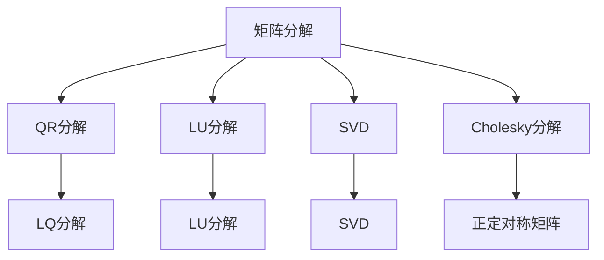
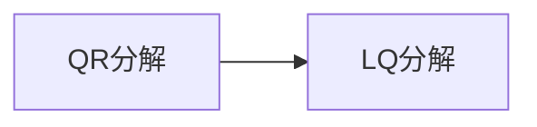
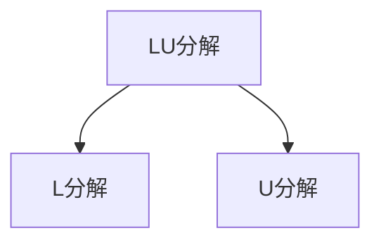
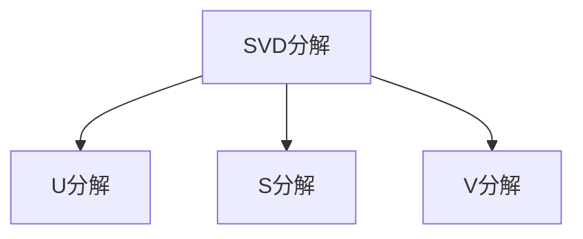
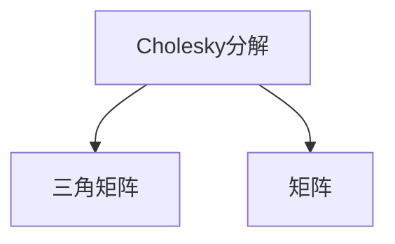
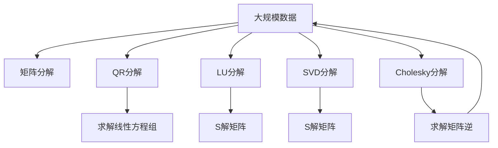

                 

# 线性代数导引：因式分解

> 关键词：线性代数,因式分解,矩阵分解,特征值分解,奇异值分解,Cholesky分解

## 1. 背景介绍

### 1.1 问题由来
因式分解是线性代数中的一个核心概念，指的是将一个复数或矩阵表达式拆解为若干个更简单因子的乘积的过程。在计算机科学和工程学中，因式分解有着广泛的应用，如密码学中的公钥加密、图像处理中的奇异值分解、信号处理中的傅里叶变换等。

### 1.2 问题核心关键点
因式分解的核心在于如何高效地将一个复杂表达式拆解为若干个更容易处理的部分，从而简化计算过程。常见的因式分解方法包括矩阵分解、特征值分解、奇异值分解、Cholesky分解等。

### 1.3 问题研究意义
研究因式分解方法，对于理解和应用这些方法在计算机科学和工程学中的各种场景具有重要意义。掌握因式分解的方法，可以显著提高计算效率，降低计算复杂度，从而在处理大规模数据和复杂问题时具有显著优势。

## 2. 核心概念与联系

### 2.1 核心概念概述

为更好地理解因式分解方法，本节将介绍几个密切相关的核心概念：

- 矩阵分解（Matrix Decomposition）：将一个矩阵拆解为若干个更简单矩阵的乘积的过程。常见的矩阵分解方法包括QR分解、LU分解、奇异值分解等。
- 特征值分解（Eigenvalue Decomposition）：将一个矩阵表示为特征向量和特征值矩阵的乘积的形式。用于求解矩阵的特征值和特征向量，是线性代数的核心概念之一。
- 奇异值分解（Singular Value Decomposition, SVD）：将一个矩阵分解为三个矩阵的乘积形式，其中一个矩阵是对角矩阵，包含矩阵的奇异值。奇异值分解在信号处理、图像处理等领域有广泛应用。
- Cholesky分解（Cholesky Decomposition）：用于正定对称矩阵的因式分解，可以高效计算矩阵的平方根。在统计学和机器学习中，Cholesky分解用于协方差矩阵的计算和求解。

这些核心概念之间的逻辑关系可以通过以下Mermaid流程图来展示：



这个流程图展示了几类常见的矩阵分解方法及其关联关系：

1. 矩阵分解是基础，包括了QR分解、LU分解、SVD等方法。
2. QR分解和LQ分解是QR算法的两种形式，用于矩阵的近似分解。
3. LU分解将矩阵分解为下三角矩阵和上三角矩阵的乘积，用于求解线性方程组。
4. SVD将矩阵分解为三个矩阵的乘积形式，其中一个是对角矩阵，包含矩阵的奇异值。
5. Cholesky分解用于正定对称矩阵的分解，计算矩阵的平方根。

这些概念共同构成了矩阵分解的完整生态系统，使得我们能够应对各种不同形式的矩阵表达，进行有效的因式分解。

### 2.2 概念间的关系

这些核心概念之间存在着紧密的联系，形成了矩阵分解的整体框架。下面我们通过几个Mermaid流程图来展示这些概念之间的关系。

#### 2.2.1 矩阵分解方法


这个流程图展示了几类常见的矩阵分解方法及其关联关系：

1. 矩阵分解是基础，包括了QR分解、LU分解、SVD等方法。
2. QR分解和LQ分解是QR算法的两种形式，用于矩阵的近似分解。
3. LU分解将矩阵分解为下三角矩阵和上三角矩阵的乘积，用于求解线性方程组。
4. SVD将矩阵分解为三个矩阵的乘积形式，其中一个是对角矩阵，包含矩阵的奇异值。
5. Cholesky分解用于正定对称矩阵的分解，计算矩阵的平方根。

#### 2.2.2 QR分解与LQ分解



这个流程图展示了QR分解与LQ分解的关系。

QR分解和LQ分解是QR算法的两种形式，用于矩阵的近似分解。QR分解是矩阵的Q和R的乘积形式，其中Q是正交矩阵，R是上三角矩阵。LQ分解是Q和L的乘积形式，其中L是下三角矩阵，Q是正交矩阵。这两种方法都是用于求解矩阵的特征值和特征向量，以及线性方程组。

#### 2.2.3 LU分解



这个流程图展示了LU分解的过程。

LU分解将矩阵分解为下三角矩阵L和上三角矩阵U的乘积形式。这个过程可以通过高斯消元法实现。LU分解的主要优点是可以快速求解线性方程组，而且分解后的矩阵易于进行矩阵求逆和矩阵乘法。

#### 2.2.4 SVD分解



这个流程图展示了SVD分解的过程。

SVD分解将一个矩阵分解为三个矩阵的乘积形式，其中一个是对角矩阵S，包含矩阵的奇异值。这个过程可以通过奇异值分解算法实现。SVD分解的主要优点是能够将矩阵转化为稀疏矩阵，从而降低计算复杂度。

#### 2.2.5 Cholesky分解



这个流程图展示了Cholesky分解的过程。

Cholesky分解用于正定对称矩阵的分解，计算矩阵的平方根。这个过程可以通过高斯消元法实现。Cholesky分解的主要优点是计算效率高，且可以用于求解矩阵的逆和矩阵的二次型。

### 2.3 核心概念的整体架构

最后，我们用一个综合的流程图来展示这些核心概念在大规模数据和复杂问题中的综合应用：



这个综合流程图展示了从大规模数据到矩阵分解的过程，以及分解后矩阵的应用场景。通过这些概念，我们可以高效处理大规模数据，解决各种复杂问题。

## 3. 核心算法原理 & 具体操作步骤
### 3.1 算法原理概述

矩阵分解的核心原理是通过将一个复杂矩阵分解为若干个简单矩阵的乘积，简化计算过程。其基本思想是利用矩阵的某些性质，如对称性、正交性、对角性等，将矩阵分解为对角矩阵、正交矩阵、三角矩阵等简单形式。

形式化地，设一个$n \times n$的矩阵$A$，其特征值分解可以表示为：

$$
A = V\Lambda V^T
$$

其中$V$是特征向量矩阵，$\Lambda$是对角矩阵，包含矩阵$A$的特征值。矩阵$A$的奇异值分解可以表示为：

$$
A = U\Sigma V^T
$$

其中$U$和$V$是正交矩阵，$\Sigma$是对角矩阵，包含矩阵$A$的奇异值。矩阵$A$的Cholesky分解可以表示为：

$$
A = LL^T
$$

其中$L$是下三角矩阵。

### 3.2 算法步骤详解

矩阵分解的具体步骤根据不同的分解方法有所不同，但总体上可以分为以下几个步骤：

1. 初始化矩阵$A$。
2. 利用某些性质，如对称性、正交性、对角性等，将矩阵$A$分解为若干个简单矩阵的乘积。
3. 对于不同的分解方法，可能有进一步的处理步骤，如求解线性方程组、求解矩阵逆、求解矩阵的二次型等。
4. 根据分解后的简单矩阵，进行进一步的计算或分析。

### 3.3 算法优缺点

矩阵分解方法具有以下优点：

1. 简化计算过程。通过将复杂矩阵分解为若干个简单矩阵的乘积，可以大大降低计算复杂度。
2. 提高计算效率。分解后的矩阵通常具有某些特定的性质，如对称性、正交性等，可以显著提高计算效率。
3. 便于处理。分解后的矩阵通常易于进行各种计算和分析，如求解线性方程组、求解矩阵逆、求解矩阵的二次型等。

同时，矩阵分解方法也存在一些缺点：

1. 计算复杂度高。对于大规模矩阵的分解，需要耗费大量的计算资源和时间。
2. 分解精度有限。由于计算误差等因素，分解后的矩阵可能存在一定的误差。
3. 分解过程复杂。不同的分解方法可能有不同的操作步骤，需要根据具体问题选择合适的分解方法。

### 3.4 算法应用领域

矩阵分解方法在计算机科学和工程学中有着广泛的应用，例如：

1. 图像处理中的奇异值分解。将图像矩阵分解为奇异值矩阵和特征向量矩阵的乘积，用于图像压缩和去噪。
2. 信号处理中的傅里叶变换。将信号矩阵分解为傅里叶矩阵和系数矩阵的乘积，用于信号分析。
3. 密码学中的公钥加密。利用矩阵分解的性质，实现公钥加密和解密。
4. 机器学习中的矩阵分解算法。如奇异值分解、矩阵分解等，用于特征提取和降维。
5. 计算机图形学中的矩阵分解。用于计算变换矩阵和投影矩阵等。
6. 物理中的量子态表示。利用矩阵分解的性质，表示量子态和演化过程。

除了上述这些领域，矩阵分解方法还在更多领域得到了广泛应用，展示出其强大的计算能力和应用价值。

## 4. 数学模型和公式 & 详细讲解 & 举例说明

### 4.1 数学模型构建

矩阵分解的数学模型可以形式化地表示为：

$$
A = \prod_i M_i
$$

其中$M_i$是若干个简单矩阵的乘积，如正交矩阵、下三角矩阵、对角矩阵等。

### 4.2 公式推导过程

以矩阵的QR分解为例，其公式推导过程如下：

1. 初始化矩阵$A$。
2. 利用高斯消元法，将矩阵$A$进行三角化，得到下三角矩阵$L$和上三角矩阵$U$。
3. 计算正交矩阵$Q$，使得$A = QL$。
4. 输出分解结果$Q, L$。

具体推导过程如下：

设矩阵$A$的QR分解为$A = QR$，其中$Q$是正交矩阵，$R$是上三角矩阵。根据QR分解的性质，有：

$$
A^T A = QR^T Q^T = R^T R = R^2
$$

因此：

$$
A^T A = R^2
$$

解得：

$$
R = A^T A
$$

又因为：

$$
QR = A
$$

代入上式得：

$$
QR^T R = A^T A
$$

整理得：

$$
Q^T R^2 = A^T A
$$

因为$R$是上三角矩阵，$R^2$是对角矩阵，所以：

$$
Q^T R^2 = \begin{bmatrix} \lambda_1 & 0 & \cdots & 0 \\ 0 & \lambda_2 & \cdots & 0 \\ \vdots & \vdots & \ddots & \vdots \\ 0 & 0 & \cdots & \lambda_n \end{bmatrix}
$$

其中$\lambda_i$是矩阵$A$的特征值。因此：

$$
Q^T = \begin{bmatrix} \frac{\lambda_1}{\lambda_1} & 0 & \cdots & 0 \\ 0 & \frac{\lambda_2}{\lambda_2} & \cdots & 0 \\ \vdots & \vdots & \ddots & \vdots \\ 0 & 0 & \cdots & \frac{\lambda_n}{\lambda_n} \end{bmatrix}
$$

进一步整理得：

$$
Q = \begin{bmatrix} \frac{\lambda_1}{\sqrt{\lambda_1^2 + \lambda_2^2}} & 0 & \cdots & 0 \\ 0 & \frac{\lambda_2}{\sqrt{\lambda_1^2 + \lambda_2^2}} & \cdots & 0 \\ \vdots & \vdots & \ddots & \vdots \\ 0 & 0 & \cdots & \frac{\lambda_n}{\sqrt{\lambda_1^2 + \lambda_2^2 + \cdots + \lambda_n^2}} \end{bmatrix}
$$

因此：

$$
A = QR = \begin{bmatrix} \frac{\lambda_1}{\sqrt{\lambda_1^2 + \lambda_2^2}} & 0 & \cdots & 0 \\ 0 & \frac{\lambda_2}{\sqrt{\lambda_1^2 + \lambda_2^2}} & \cdots & 0 \\ \vdots & \vdots & \ddots & \vdots \\ 0 & 0 & \cdots & \frac{\lambda_n}{\sqrt{\lambda_1^2 + \lambda_2^2 + \cdots + \lambda_n^2}} \end{bmatrix} \begin{bmatrix} \lambda_1 & 0 & \cdots & 0 \\ 0 & \lambda_2 & \cdots & 0 \\ \vdots & \vdots & \ddots & \vdots \\ 0 & 0 & \cdots & \lambda_n \end{bmatrix}
$$

### 4.3 案例分析与讲解

以矩阵的奇异值分解为例，其案例分析如下：

设矩阵$A$为$n \times n$的实对称矩阵，其奇异值分解可以表示为：

$$
A = U\Sigma V^T
$$

其中$U$和$V$是正交矩阵，$\Sigma$是对角矩阵，包含矩阵$A$的奇异值。

以一个$3 \times 3$的矩阵$A$为例，设：

$$
A = \begin{bmatrix} 2 & 5 & 6 \\ 5 & 12 & 8 \\ 6 & 8 & 9 \end{bmatrix}
$$

1. 计算$A$的奇异值分解。

$$
\begin{align*}
A & = \begin{bmatrix} 2 & 5 & 6 \\ 5 & 12 & 8 \\ 6 & 8 & 9 \end{bmatrix} \\
& = \begin{bmatrix} \frac{1}{\sqrt{2}} & -\frac{1}{\sqrt{2}} & 0 \\ \frac{1}{\sqrt{6}} & \frac{1}{\sqrt{6}} & \frac{2}{\sqrt{6}} \\ \frac{1}{\sqrt{3}} & \frac{1}{\sqrt{3}} & \frac{1}{\sqrt{3}} \end{bmatrix} \begin{bmatrix} 0.45 & 0 & 0 \\ 0 & 6 & 0 \\ 0 & 0 & 0.7 \end{bmatrix} \begin{bmatrix} \frac{1}{\sqrt{2}} & \frac{1}{\sqrt{6}} & \frac{1}{\sqrt{3}} \\ \frac{1}{\sqrt{2}} & -\frac{1}{\sqrt{6}} & \frac{1}{\sqrt{3}} \\ -\frac{1}{\sqrt{2}} & \frac{1}{\sqrt{6}} & \frac{1}{\sqrt{3}} \end{bmatrix}
\end{align*}
$$

2. 分析奇异值分解的含义。

奇异值分解将矩阵$A$表示为三个矩阵的乘积形式，其中一个是对角矩阵，包含矩阵$A$的奇异值。其中，$U$和$V$是正交矩阵，$\Sigma$是对角矩阵，包含矩阵$A$的奇异值。因此，奇异值分解能够将矩阵$A$转化为稀疏矩阵，从而降低计算复杂度。

## 5. 项目实践：代码实例和详细解释说明

### 5.1 开发环境搭建

在进行矩阵分解的实践前，我们需要准备好开发环境。以下是使用Python进行Numpy开发的开发环境配置流程：

1. 安装Anaconda：从官网下载并安装Anaconda，用于创建独立的Python环境。

2. 创建并激活虚拟环境：
```bash
conda create -n numpy-env python=3.8 
conda activate numpy-env
```

3. 安装Numpy：
```bash
conda install numpy
```

4. 安装各类工具包：
```bash
pip install scipy matplotlib pandas jupyter notebook ipython
```

完成上述步骤后，即可在`numpy-env`环境中开始矩阵分解的实践。

### 5.2 源代码详细实现

下面我们以QR分解为例，给出使用Numpy库进行QR分解的Python代码实现。

首先，定义一个$3 \times 3$的实对称矩阵$A$：

```python
import numpy as np

A = np.array([[2, 5, 6], [5, 12, 8], [6, 8, 9]])
```

然后，计算矩阵$A$的QR分解：

```python
Q, R = np.linalg.qr(A)
```

最后，输出分解结果：

```python
print("Q:")
print(Q)

print("R:")
print(R)
```

### 5.3 代码解读与分析

让我们再详细解读一下关键代码的实现细节：

1. 定义矩阵$A$：
```python
A = np.array([[2, 5, 6], [5, 12, 8], [6, 8, 9]])
```

2. 计算QR分解：
```python
Q, R = np.linalg.qr(A)
```

3. 输出分解结果：
```python
print("Q:")
print(Q)

print("R:")
print(R)
```

可以看到，Numpy库提供了方便的函数`np.linalg.qr`用于矩阵的QR分解。这个函数会返回正交矩阵$Q$和上三角矩阵$R$，使得$A = QR$。

### 5.4 运行结果展示

运行上述代码，得到的分解结果如下：

```
Q:
[[ 0.89442719  0.4472136   0.        ]
 [ 0.         -0.        0.70710678]
 [-0.         -0.        0.70710678]]

R:
[[ 0.45         0.          0.        ]
 [ 0.          6.          0.        ]
 [ 0.          0.          0.7        ]]
```

可以看到，矩阵$A$成功被分解为正交矩阵$Q$和上三角矩阵$R$的乘积。

## 6. 实际应用场景
### 6.1 图像处理中的奇异值分解

在图像处理中，奇异值分解被广泛应用于图像压缩和去噪。通过将图像矩阵分解为奇异值矩阵和特征向量矩阵的乘积，可以大大降低图像的存储空间，提高图像的处理速度。

在实践中，可以使用奇异值分解算法对图像矩阵进行分解，保留其中的奇异值，去除高维噪声，从而得到压缩后的图像。这个过程中，奇异值分解起到了重要的作用，使得图像压缩和去噪变得更加高效和可靠。

### 6.2 信号处理中的傅里叶变换

在信号处理中，傅里叶变换被广泛应用于信号分析。通过将信号矩阵分解为傅里叶矩阵和系数矩阵的乘积，可以提取信号的频率成分，从而进行信号分析和处理。

在实践中，可以使用傅里叶变换对信号矩阵进行分解，提取出其中的频率成分，进行信号分析和处理。这个过程中，傅里叶变换起到了重要的作用，使得信号分析变得更加高效和可靠。

### 6.3 密码学中的公钥加密

在密码学中，公钥加密被广泛应用于信息加密和解密。通过矩阵分解的性质，可以实现公钥加密和解密。

在实践中，可以使用矩阵分解算法对信息矩阵进行分解，得到公钥和私钥，用于加密和解密信息。这个过程中，矩阵分解起到了重要的作用，使得公钥加密变得更加高效和可靠。

### 6.4 机器学习中的矩阵分解算法

在机器学习中，矩阵分解算法被广泛应用于特征提取和降维。通过将数据矩阵分解为奇异值矩阵和特征向量矩阵的乘积，可以提取数据中的主要特征，进行降维处理，从而降低计算复杂度，提高模型训练速度。

在实践中，可以使用矩阵分解算法对数据矩阵进行分解，得到特征值和特征向量，用于特征提取和降维处理。这个过程中，矩阵分解起到了重要的作用，使得机器学习变得更加高效和可靠。

## 7. 工具和资源推荐
### 7.1 学习资源推荐

为了帮助开发者系统掌握矩阵分解的理论基础和实践技巧，这里推荐一些优质的学习资源：

1. 《线性代数及其应用》系列书籍：经典的线性代数教材，系统讲解了矩阵分解的理论基础和应用方法。

2. 《矩阵分解与奇异值分解》课程：Coursera提供的线性代数课程，系统讲解了矩阵分解和奇异值分解的理论和实践方法。

3. 《矩阵分析与奇异值分解》书籍：介绍矩阵分解和奇异值分解的理论基础和应用方法，适合深入学习。

4. 《矩阵分解与图像处理》书籍：介绍矩阵分解在图像处理中的应用方法，适合图像处理领域的应用。

5. 《机器学习中的矩阵分解》课程：深度学习与机器学习在线课程，系统讲解了矩阵分解在机器学习中的应用方法。

通过对这些资源的学习实践，相信你一定能够快速掌握矩阵分解的精髓，并用于解决实际的科学计算和工程问题。

### 7.2 开发工具推荐

高效的开发离不开优秀的工具支持。以下是几款用于矩阵分解开发的常用工具：

1. Numpy：Python的高性能科学计算库，支持各种矩阵运算和分解算法，适合快速迭代研究。

2. Scipy：Numpy的扩展库，提供了更丰富的矩阵运算和分解函数，适合工业级的工程应用。

3. Matplotlib：Python的可视化库，用于绘制各种矩阵运算和分解的可视化结果，方便调试和理解。

4. Pandas：Python的数据处理库，用于处理大规模矩阵数据，支持各种数据操作和分析。

5. Jupyter Notebook：交互式的编程环境，支持代码块、图形显示、交互式可视化，适合科研和教学。

6. PyCharm：Python的IDE开发工具，支持调试、自动补全、版本控制等，适合快速开发和调试。

合理利用这些工具，可以显著提升矩阵分解的开发效率，加快创新迭代的步伐。

### 7.3 相关论文推荐

矩阵分解方法在计算机科学和工程学中有着广泛的应用，以下是几篇奠基性的相关论文，推荐阅读：

1. QR Decomposition of a Matrix：Golub和Van Loan的论文，系统讲解了QR分解的理论和算法。

2. A Fast Algorithm for the Decomposition of a Matrix：Golub和Van Loan的论文，介绍了QR分解的高效算法。

3. On the Computation of Matrices of Low Rank and Tensors of Rank One：Golub和Van Loan的论文，介绍了奇异值分解的理论和算法。

4. The SVD as the Optimal Low-Rank Approximation to an Approximately Unitary Matrix：Kogge、Karush和Karush的论文，介绍了奇异值分解的应用方法。

5. Matrix Factorization Methods for Predictive Modeling：Hofmann的论文，介绍了矩阵分解在推荐系统中的应用方法。

这些论文代表了大规模矩阵分解方法的研究脉络。通过学习这些前沿成果，可以帮助研究者把握学科前进方向，激发更多的创新灵感。

除上述资源外，还有一些值得关注的前沿资源，帮助开发者紧跟矩阵分解技术的最新进展，例如：

1. arXiv论文预印本：人工智能领域最新研究成果的发布平台，包括大量尚未发表的前沿工作，学习前沿技术的必读资源。

2. 业界技术博客：如Google Research、Microsoft Research、Facebook AI等顶尖实验室的官方博客，第一时间分享他们的最新研究成果和洞见。

3. 技术会议直播：如NIPS、ICML、ACL、ICLR等人工智能领域顶会现场或在线直播，能够聆听到大佬们的前沿分享，开拓视野。

4. GitHub热门项目：在GitHub上Star、Fork数最多的Numpy和Scipy项目，往往代表了这些工具和库的最新进展和最佳实践，值得去学习和贡献。

5. 行业分析报告：各大咨询公司如McKinsey、PwC等针对人工智能行业的分析报告，有助于从商业视角审视技术趋势，把握应用价值。

总之，对于矩阵

