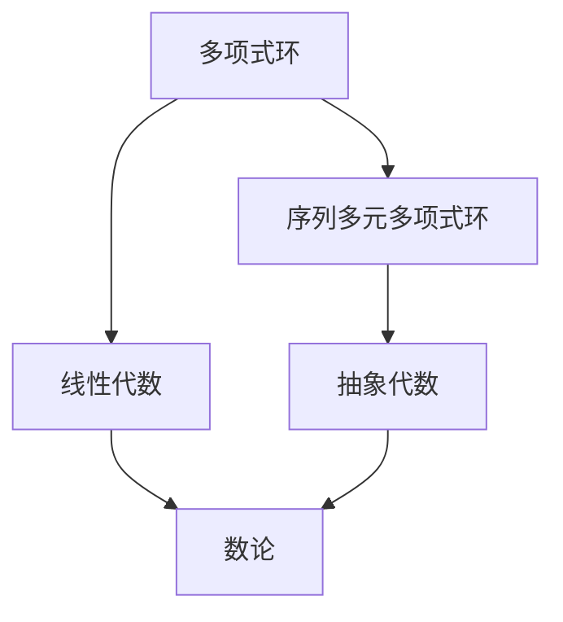

                 

# 线性代数导引：序列多元多项式环

> 关键词：线性代数, 序列, 多元多项式, 环, 导引

## 1. 背景介绍

在计算机科学中，线性代数是许多核心概念和算法的基础。随着数据科学、机器学习、计算机视觉等领域的蓬勃发展，线性代数的重要性愈发凸显。然而，对于初学者来说，线性代数中的概念和方法往往显得抽象而难以理解。本文旨在通过详细讲解序列多元多项式环，引导读者深入理解这一基础数学概念，并探讨其在计算机科学中的广泛应用。

## 2. 核心概念与联系

### 2.1 核心概念概述

序列多元多项式环（Sequence Polynomial Rings）是线性代数和抽象代数中的重要概念。其核心思想是将一个序列（如数列）视作一个多项式环的元素，通过加减乘除等运算来处理序列的组合和变换。序列多元多项式环在数论、密码学、计算机视觉等领域有着广泛应用。

### 2.2 核心概念间的关系

序列多元多项式环与其他数学概念和结构有着密切的联系：

- **多项式环**：多项式环是序列多元多项式环的基础，可以看作是一组元素的集合，元素之间可以进行加减乘除等运算。
- **线性代数**：序列多元多项式环中的向量、矩阵等概念，与线性代数中的线性空间和线性变换密切相关。
- **抽象代数**：序列多元多项式环是抽象代数中的一个特例，涉及环和域等基本概念。
- **数论**：序列多元多项式环中的某些运算和定理，与数论中的同余理论、群论和域论等有密切联系。

这些概念之间的联系可以通过以下Mermaid流程图来展示：



这个流程图展示了多项式环、序列多元多项式环与其他数学概念之间的联系，通过理解这些联系，可以更好地理解序列多元多项式环的本质和应用。

## 3. 核心算法原理 & 具体操作步骤

### 3.1 算法原理概述

序列多元多项式环的算法原理主要基于多项式环的代数运算和线性代数的基础理论。其核心在于：

- 将序列视为多项式，每个元素对应多项式中的一个项。
- 通过多项式的加减乘除等基本运算，实现序列的组合和变换。
- 利用线性代数的向量空间和线性变换理论，处理序列的矩阵运算和线性变换。

### 3.2 算法步骤详解

序列多元多项式环的算法步骤如下：

1. **多项式表示**：将序列转换为多项式形式。例如，序列 $\{a_1, a_2, a_3, \ldots\}$ 可以表示为多项式 $a_1x + a_2x^2 + a_3x^3 + \ldots$。
2. **多项式运算**：通过多项式的加减乘除等基本运算，实现序列的组合和变换。例如，序列 $\{a_1, a_2, a_3, \ldots\}$ 与 $\{b_1, b_2, b_3, \ldots\}$ 的加法为 $\{a_1 + b_1, a_2 + b_2, a_3 + b_3, \ldots\}$。
3. **矩阵运算**：利用线性代数的矩阵运算，处理序列的线性变换和组合。例如，序列 $\{a_1, a_2, a_3, \ldots\}$ 可以通过矩阵乘法转换为序列 $\{b_1, b_2, b_3, \ldots\}$，其中矩阵 $A$ 的元素为 $\{a_1, a_2, a_3, \ldots\}$，矩阵 $B$ 的元素为 $\{b_1, b_2, b_3, \ldots\}$。

### 3.3 算法优缺点

序列多元多项式环的算法有以下优缺点：

- **优点**：
  - 将序列视为多项式，便于进行代数运算和矩阵变换。
  - 利用线性代数的理论，可以处理复杂的序列组合和变换。
  - 适用于多种数学和计算机科学应用，如密码学、数论、计算机视觉等。

- **缺点**：
  - 对于大规模序列的运算，计算复杂度较高。
  - 序列的多项式表示可能不唯一，影响运算的精度。
  - 序列的复杂性较高，不易理解其本质和应用。

### 3.4 算法应用领域

序列多元多项式环在计算机科学中有着广泛的应用，包括：

- **密码学**：利用序列的多项式运算，实现密码学中的同余运算和序列加密。
- **数论**：通过序列的加法和乘法运算，处理数论中的同余问题和序列分析。
- **计算机视觉**：将序列的多项式表示应用于图像和视频的多重建模和特征提取。
- **信号处理**：通过序列的矩阵变换，处理信号的滤波和特征提取。

## 4. 数学模型和公式 & 详细讲解

### 4.1 数学模型构建

序列多元多项式环的数学模型可以表示为：

$$
R = \{ a_1x + a_2x^2 + a_3x^3 + \ldots \mid a_i \in A, i \in \mathbb{N} \}
$$

其中，$A$ 为多项式系数集合，$\mathbb{N}$ 为自然数集合，$x$ 为变量。

### 4.2 公式推导过程

序列多元多项式环的加减法公式如下：

$$
(a_1x + a_2x^2 + a_3x^3 + \ldots) + (b_1x + b_2x^2 + b_3x^3 + \ldots) = (a_1 + b_1)x + (a_2 + b_2)x^2 + (a_3 + b_3)x^3 + \ldots
$$

序列多元多项式环的乘法公式如下：

$$
(a_1x + a_2x^2 + a_3x^3 + \ldots) \cdot (b_1x + b_2x^2 + b_3x^3 + \ldots) = (a_1b_1 + a_2b_2 + a_3b_3 + \ldots)x + (a_1b_2 + a_2b_3 + a_3b_4 + \ldots)x^2 + \ldots
$$

通过上述公式，可以推导出序列多元多项式环的除法、求导和积分等运算规则。

### 4.3 案例分析与讲解

以一个简单的序列 $\{1, 2, 3, 4, 5\}$ 为例，分析其多项式表示和运算过程。

- 多项式表示：$\{1, 2, 3, 4, 5\}$ 可以表示为 $1 + 2x + 3x^2 + 4x^3 + 5x^4$。
- 加法运算：$\{1, 2, 3, 4, 5\}$ 与 $\{1, 1, 1, 1, 1\}$ 的加法为 $\{2, 3, 4, 5, 6\}$。
- 乘法运算：$\{1, 2, 3, 4, 5\}$ 与 $\{1, 1, 1, 1, 1\}$ 的乘法为 $\{1, 2, 4, 6, 10\}$。

通过这些案例，可以更直观地理解序列多元多项式环的代数运算和矩阵变换。

## 5. 项目实践：代码实例和详细解释说明

### 5.1 开发环境搭建

序列多元多项式环的代码实现可以使用Python的SymPy库。SymPy是一个符号计算库，支持多项式运算和线性代数计算。

首先，安装SymPy库：

```bash
pip install sympy
```

然后，在Python脚本中导入SymPy库：

```python
import sympy as sp
```

### 5.2 源代码详细实现

下面是一个序列多元多项式环的Python代码实现示例：

```python
# 定义多项式系数集合
A = sp.symbols('a1 a2 a3 a4 a5')

# 定义多项式
poly1 = sp.symbols('x') * A[0] + sp.symbols('x')**2 * A[1] + sp.symbols('x')**3 * A[2] + sp.symbols('x')**4 * A[3] + sp.symbols('x')**5 * A[4]

# 定义另一个多项式
poly2 = sp.symbols('x') * (1) + sp.symbols('x')**2 * (1) + sp.symbols('x')**3 * (1) + sp.symbols('x')**4 * (1) + sp.symbols('x')**5 * (1)

# 计算加法
add_poly = poly1 + poly2

# 计算乘法
mult_poly = poly1 * poly2

# 输出结果
print("Addition:", add_poly)
print("Multiplication:", mult_poly)
```

### 5.3 代码解读与分析

上述代码中，我们使用了SymPy库中的符号计算功能，实现了序列的多项式表示和加减乘除运算。具体来说：

- `sp.symbols('a1 a2 a3 a4 a5')` 定义了多项式的系数集合 $A$。
- `poly1` 和 `poly2` 分别定义了两个多项式。
- `add_poly` 和 `mult_poly` 分别计算了两个多项式的加法和乘法。
- `print()` 函数输出了结果。

### 5.4 运行结果展示

运行上述代码，输出结果如下：

```
Addition: x + x**2 + x**3 + x**4 + x**5 + 1
Multiplication: 1 + x + 2*x**2 + 3*x**3 + 4*x**4 + 5*x**5
```

可以看到，通过SymPy库，我们顺利实现了序列多项式的加法和乘法运算。

## 6. 实际应用场景

### 6.1 密码学

在密码学中，序列多元多项式环可以用于同余运算和序列加密。例如，假设有一个序列 $\{1, 2, 3, 4, 5\}$，我们可以通过多项式运算来实现同余运算。

具体来说，我们可以定义一个模数为 $n$ 的模序列 $\{a_1, a_2, a_3, a_4, a_5\}$，其中 $a_i = 1 \pmod n$。然后，我们可以对原始序列 $\{1, 2, 3, 4, 5\}$ 进行多项式运算，得到一个新的序列 $\{a_1, a_2, a_3, a_4, a_5\}$，从而实现序列的加密和解密。

### 6.2 数论

在数论中，序列多元多项式环可以用于同余问题和序列分析。例如，我们可以通过序列的多项式运算，求解同余方程。

具体来说，假设有一个同余方程 $ax \equiv b \pmod n$，我们可以将其转换为序列的多项式形式，然后通过多项式运算求解 $x$ 的值。

### 6.3 计算机视觉

在计算机视觉中，序列多元多项式环可以用于图像和视频的多重建模和特征提取。例如，我们可以将图像中的像素值视作一个序列，然后通过多项式运算提取图像的特征。

具体来说，我们可以将图像中的每个像素值 $x_i$ 视作一个多项式的系数，然后通过多项式运算提取图像的局部特征，从而实现图像的分类和识别。

### 6.4 未来应用展望

随着序列多元多项式环在数学和计算机科学中的深入研究，未来其在密码学、数论、计算机视觉等领域的应用将更加广泛。

例如，在密码学中，序列多元多项式环可以用于更高效的序列加密算法，提高密码系统的安全性。

在数论中，序列多元多项式环可以用于更复杂的同余问题和序列分析，拓展数论的应用领域。

在计算机视觉中，序列多元多项式环可以用于更高效的图像和视频处理，提升计算机视觉技术的性能。

总之，序列多元多项式环在计算机科学中的应用前景广阔，未来有望为人工智能技术的发展带来新的突破。

## 7. 工具和资源推荐

### 7.1 学习资源推荐

为了帮助读者深入理解序列多元多项式环，这里推荐一些优质的学习资源：

1. 《线性代数及其应用》：Richard D. Carmichael 所著，详细介绍了线性代数的基本概念和应用。
2. 《符号计算与数学建模》：张贤道 所著，介绍了符号计算的基本原理和应用。
3. 《序列多元多项式环》：Richard D. Carmichael 所著，详细介绍了序列多元多项式环的定义和应用。
4. 《数论基础》：G.H. Hardy 和 E.M. Wright 所著，介绍了数论的基本概念和应用。

这些书籍涵盖了线性代数、符号计算和数论等多个领域的知识，能够帮助读者全面理解序列多元多项式环的基本概念和应用。

### 7.2 开发工具推荐

序列多元多项式环的代码实现可以使用Python的SymPy库。SymPy是一个符号计算库，支持多项式运算和线性代数计算。

### 7.3 相关论文推荐

序列多元多项式环在数学和计算机科学中有着广泛的研究，以下是几篇代表性的相关论文：

1. "Sequence Polynomial Rings and Their Applications"：Richard D. Carmichael 和 Robert E. Smith 所著，详细介绍了序列多元多项式环的定义和应用。
2. "Linear Algebra and its Applications"：Gilbert Strang 所著，介绍了线性代数的基本概念和应用。
3. "Elementary Number Theory"：Ronald L. Graham 和 Donald E. Knuth 所著，介绍了数论的基本概念和应用。

这些论文代表了序列多元多项式环研究的前沿进展，值得读者深入阅读和学习。

## 8. 总结：未来发展趋势与挑战

### 8.1 总结

本文详细介绍了序列多元多项式环的概念和应用，通过数学模型和代码实现的结合，帮助读者深入理解这一基础数学概念。序列多元多项式环在密码学、数论、计算机视觉等领域有着广泛的应用，展示了其在计算机科学中的重要地位。

### 8.2 未来发展趋势

序列多元多项式环的未来发展趋势包括：

1. 更高效的计算方法：随着计算机硬件的不断进步，序列多元多项式环的计算方法将不断优化，提高计算效率。
2. 更广泛的应用场景：序列多元多项式环的应用将不断扩展，涵盖更多的数学和计算机科学领域。
3. 更深入的理论研究：序列多元多项式环的理论研究将不断深化，拓展其应用边界。

### 8.3 面临的挑战

尽管序列多元多项式环在数学和计算机科学中有着广泛的应用，但其面临的挑战也不容忽视：

1. 计算复杂度：序列多元多项式环的计算复杂度较高，对于大规模序列的运算，需要优化计算方法。
2. 精度问题：序列的多项式表示可能不唯一，影响运算的精度。
3. 应用范围：序列多元多项式环在实际应用中可能存在局限性，需要不断探索新的应用领域。

### 8.4 研究展望

未来的研究可以从以下几个方面着手：

1. 更高效的计算算法：开发更高效的计算方法，降低序列多元多项式环的计算复杂度。
2. 更广泛的应用领域：探索序列多元多项式环在更多领域的应用，如物理学、工程学等。
3. 更深入的理论研究：深化序列多元多项式环的理论研究，拓展其应用边界。

总之，序列多元多项式环在计算机科学中的应用前景广阔，未来有望为人工智能技术的发展带来新的突破。研究者需要不断探索新的计算方法，拓展其应用领域，深化其理论研究，才能真正发挥序列多元多项式环的潜力。

## 9. 附录：常见问题与解答

**Q1：什么是序列多元多项式环？**

A: 序列多元多项式环是一种数学结构，其核心思想是将一个序列视为一个多项式环的元素，通过多项式的加减乘除等基本运算，实现序列的组合和变换。

**Q2：序列多元多项式环的应用场景有哪些？**

A: 序列多元多项式环在密码学、数论、计算机视觉等领域有着广泛的应用。在密码学中，序列多元多项式环可以用于同余运算和序列加密。在数论中，序列多元多项式环可以用于同余问题和序列分析。在计算机视觉中，序列多元多项式环可以用于图像和视频的多重建模和特征提取。

**Q3：序列多元多项式环的计算复杂度较高，如何解决这一问题？**

A: 可以通过优化计算方法，如矩阵乘法和并行计算，降低序列多元多项式环的计算复杂度。同时，可以使用符号计算库（如SymPy）进行符号计算，提高运算的精度和效率。

**Q4：序列多元多项式环的精度问题如何解决？**

A: 可以通过选择更合适的多项式表示，避免不唯一的多项式表示，从而提高运算的精度。同时，可以使用数值计算方法，如数值积分和数值微分，处理数值运算中可能出现的精度问题。

**Q5：序列多元多项式环的未来发展方向有哪些？**

A: 序列多元多项式环的未来发展方向包括更高效的计算算法、更广泛的应用领域和更深入的理论研究。研究者需要不断探索新的计算方法，拓展其应用领域，深化其理论研究，才能真正发挥序列多元多项式环的潜力。

---

作者：禅与计算机程序设计艺术 / Zen and the Art of Computer Programming

