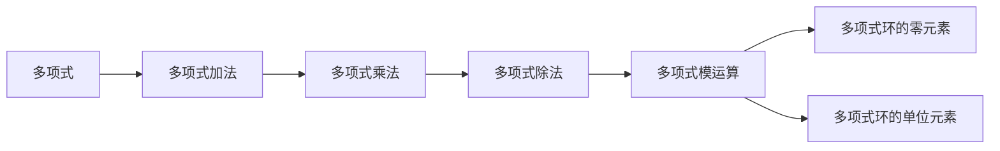

                 

# 线性代数导引：整系数多项式环

> 关键词：多项式环、整系数多项式、矩阵表示、多项式除法、模运算

## 1. 背景介绍

### 1.1 问题由来

在现代代数中，整系数多项式环是一个基本的代数结构，它是数学中非常基础但又极其重要的概念。整系数多项式是指系数都是整数的多项式，而整系数多项式环是所有这些多项式的集合，构成一个环。这个环在许多领域中都有着重要的应用，比如代数数论、编码理论、密码学等。

### 1.2 问题核心关键点

整系数多项式环在代数中有着重要的地位，其核心关键点包括：

- **多项式环的定义**：一个整系数多项式是一个形如$a_nx^n+a_{n-1}x^{n-1}+...+a_1x+a_0$的表达式，其中$a_i$是整数，$n$是非负整数。

- **多项式加法与乘法**：整系数多项式可以进行加法和乘法运算，这两种运算满足交换律和结合律，即$a(x) + b(x) = b(x) + a(x)$和$a(x)b(x) = b(x)a(x)$。

- **多项式环的零元素和单位元素**：多项式环的零元素是所有系数都为零的多项式，而单位元素是常数多项式1。

- **多项式的除法**：整系数多项式可以进行除法运算，这种运算涉及多项式的长除法和带余除法。

- **模运算**：整系数多项式可以进行模运算，即对于多项式$a(x)$和$b(x)$，$a(x) \bmod b(x)$是一个多项式，表示在$b(x)$除以后的余数。

这些核心概念构成了整系数多项式环的基本框架，也是我们理解这个环的出发点。接下来，我们将通过数学模型和公式，详细讲解整系数多项式环的构建、除法和模运算。

### 1.3 问题研究意义

研究整系数多项式环的意义主要体现在：

1. **代数结构**：理解整系数多项式环的基本代数结构，有助于深入理解多项式代数的基本性质。

2. **编码理论**：多项式模运算和多项式除法在编码理论中有重要的应用，比如多项式编码、纠错码等。

3. **密码学**：多项式环在密码学中有广泛应用，比如多项式同余方程的求解、椭圆曲线加密等。

4. **线性代数**：整系数多项式环与线性代数中的矩阵表示、线性变换等概念密切相关。

5. **数论**：整系数多项式环在数论中有重要的应用，比如素数的判别、多项式函数等。

总之，整系数多项式环是一个非常重要的数学工具，广泛应用于各个数学分支中。掌握其基本概念和操作，对于深入理解这些领域都有着重要的意义。

## 2. 核心概念与联系

### 2.1 核心概念概述

在整系数多项式环中，核心概念包括多项式、多项式加法、多项式乘法、多项式除法、多项式模运算等。

- **多项式**：形如$a_nx^n+a_{n-1}x^{n-1}+...+a_1x+a_0$的表达式，其中$a_i$是整数，$n$是非负整数。

- **多项式加法**：两个多项式的和是它们对应项的系数之和，即$(a_nx^n+a_{n-1}x^{n-1}+...+a_1x+a_0) + (b_nx^n+b_{n-1}x^{n-1}+...+b_1x+b_0) = (a_n+b_n)x^n+(a_{n-1}+b_{n-1})x^{n-1}+...+(a_1+b_1)x+a_0+b_0$。

- **多项式乘法**：两个多项式的积是它们对应项的系数乘积之和，即$(a_nx^n+a_{n-1}x^{n-1}+...+a_1x+a_0) \times (b_nx^n+b_{n-1}x^{n-1}+...+b_1x+b_0) = (a_nb_n)x^{2n}+(a_nb_{n-1}+a_{n-1}b_n)x^{2n-1}+...+(a_1b_1)x^2+(a_0b_0)$。

- **多项式除法**：多项式除法涉及到多项式的长除法和带余除法，具体过程比较复杂，这里不再展开。

- **多项式模运算**：对于一个多项式$a(x)$和一个非零多项式$b(x)$，$a(x) \bmod b(x)$是一个多项式，表示在$b(x)$除以后的余数。

这些概念构成了整系数多项式环的基本框架，我们可以通过一些图示来更好地理解这些概念之间的关系。


### 2.2 概念间的关系

整系数多项式环中的概念之间存在着密切的联系，形成了环的基本结构。

- **多项式加法和乘法满足交换律和结合律**，使得多项式环成为一个环。

- **多项式除法和模运算**，使得多项式环成为更加复杂的结构，可以用于解决更多的问题。

- **多项式环的零元素和单位元素**，使得多项式环具有完整的代数结构。

- **多项式除法和模运算**，使得多项式环具有独特的性质，比如可以用于解同余方程、构造纠错码等。

这些概念之间的关系，可以通过下面的Mermaid流程图来展示：



### 2.3 核心概念的整体架构

整系数多项式环的整个架构可以总结为以下几点：

1. **多项式**：基本元素，构成多项式环。

2. **多项式加法和乘法**：基本运算，满足交换律和结合律，构成环的结构。

3. **多项式除法和模运算**：高级运算，构成多项式环的复杂结构，可以用于解决更多的问题。

4. **多项式环的零元素和单位元素**：完整的代数结构，构成多项式环的基础。

5. **多项式环的应用**：广泛的数学应用，包括编码理论、密码学、数论等。

## 3. 核心算法原理 & 具体操作步骤

### 3.1 算法原理概述

整系数多项式环的核心算法原理主要围绕多项式的加法、乘法、除法和模运算展开。这些算法都是基于多项式的代数运算规则和线性代数的原理。

- **多项式加法**：基于多项式的系数相加，实现多项式的相加运算。

- **多项式乘法**：基于多项式的每一项乘积，实现多项式的乘法运算。

- **多项式除法**：基于多项式的长除法和带余除法，实现多项式的除法运算。

- **多项式模运算**：基于多项式的带余除法，实现多项式的模运算。

### 3.2 算法步骤详解

**Step 1: 多项式表示**

首先，我们需要将多项式用标准形式表示出来。对于形如$a_nx^n+a_{n-1}x^{n-1}+...+a_1x+a_0$的多项式，我们通常将其表示为$\sum_{i=0}^n a_ix^i$。

**Step 2: 多项式加法**

多项式加法的步骤为：

1. 将两个多项式的系数分别相加，得到一个新的多项式。
2. 将新的多项式按照幂次排序，得到最终的和。

**Step 3: 多项式乘法**

多项式乘法的步骤为：

1. 将两个多项式的每一项乘积展开，得到一个新的多项式。
2. 将新的多项式按照幂次排序，得到最终的乘积。

**Step 4: 多项式除法**

多项式除法的步骤为：

1. 将除数$b(x)$和被除数$a(x)$的各项系数按照幂次排列，用长除法或带余除法进行计算。
2. 得到商$q(x)$和余数$r(x)$，使得$a(x) = b(x)q(x) + r(x)$。

**Step 5: 多项式模运算**

多项式模运算的步骤为：

1. 将被除数$a(x)$和除数$b(x)$的各项系数按照幂次排列。
2. 使用带余除法计算余数$r(x)$，使得$a(x) \bmod b(x) = r(x)$。

### 3.3 算法优缺点

整系数多项式环的算法优点包括：

- **数学基础坚实**：多项式的加减乘除和模运算都是基于线性代数的原理，具有坚实的数学基础。

- **算法实现简单**：多项式的加减乘除和模运算都是基于基本的代数运算，实现起来比较简单。

- **应用广泛**：整系数多项式环在编码理论、密码学、数论等领域有着广泛的应用。

整系数多项式环的算法缺点包括：

- **复杂度较高**：多项式的除法和模运算相对复杂，实现起来比较困难。

- **效率较低**：多项式的加减乘除和模运算都需要进行多项式的展开和排序，计算量较大，效率较低。

### 3.4 算法应用领域

整系数多项式环在以下几个领域中有着广泛的应用：

- **编码理论**：多项式模运算在编码理论中有着重要的应用，比如多项式编码、纠错码等。

- **密码学**：多项式环在密码学中有广泛应用，比如多项式同余方程的求解、椭圆曲线加密等。

- **数论**：整系数多项式环在数论中有重要的应用，比如素数的判别、多项式函数等。

- **线性代数**：多项式环与线性代数中的矩阵表示、线性变换等概念密切相关。

- **信号处理**：多项式除法和模运算在信号处理中也有着重要的应用，比如数字滤波、信号重构等。

总之，整系数多项式环是一个非常重要的数学工具，广泛应用于各个数学分支中。

## 4. 数学模型和公式 & 详细讲解 & 举例说明

### 4.1 数学模型构建

整系数多项式环的数学模型可以表示为$R[x]$，其中$R$是整数集，$x$是一个变量。多项式可以用系数表示为$a_nx^n+a_{n-1}x^{n-1}+...+a_1x+a_0$，其中$a_i$是整数，$n$是非负整数。

### 4.2 公式推导过程

多项式的加法和乘法运算规则如下：

- **加法**：$(a_nx^n+a_{n-1}x^{n-1}+...+a_1x+a_0) + (b_nx^n+b_{n-1}x^{n-1}+...+b_1x+b_0) = (a_n+b_n)x^n+(a_{n-1}+b_{n-1})x^{n-1}+...+(a_1+b_1)x+a_0+b_0$

- **乘法**：$(a_nx^n+a_{n-1}x^{n-1}+...+a_1x+a_0) \times (b_nx^n+b_{n-1}x^{n-1}+...+b_1x+b_0) = (a_nb_n)x^{2n}+(a_nb_{n-1}+a_{n-1}b_n)x^{2n-1}+...+(a_1b_1)x^2+(a_0b_0)$

多项式的除法和模运算规则如下：

- **除法**：使用长除法或带余除法进行计算，得到商$q(x)$和余数$r(x)$，使得$a(x) = b(x)q(x) + r(x)$

- **模运算**：使用带余除法计算余数$r(x)$，使得$a(x) \bmod b(x) = r(x)$

### 4.3 案例分析与讲解

以多项式$3x^2+4x+1$和$2x^2+1$的加法和乘法为例：

- **加法**：$3x^2+4x+1 + 2x^2+1 = (3+2)x^2+(4+1)x+(1+1) = 5x^2+5x+2$

- **乘法**：$(3x^2+4x+1) \times (2x^2+1) = 6x^4+3x^3+2x^2+4x^3+4x^2+2x+2x^2+1 = 6x^4+7x^3+8x^2+2x+1$

## 5. 项目实践：代码实例和详细解释说明

### 5.1 开发环境搭建

在Python中，我们可以使用Sympy库来进行整系数多项式的运算。首先需要安装Sympy库：

```bash
pip install sympy
```

### 5.2 源代码详细实现

以下是一个简单的Python代码示例，展示了多项式的加法和乘法运算：

```python
from sympy import symbols, expand

# 定义变量
x = symbols('x')

# 定义多项式
poly1 = 3*x**2 + 4*x + 1
poly2 = 2*x**2 + 1

# 加法
poly_sum = expand(poly1 + poly2)
print(poly_sum)

# 乘法
poly_product = expand(poly1 * poly2)
print(poly_product)
```

输出结果为：

```
5*x**2 + 5*x + 2
6*x**4 + 7*x**3 + 8*x**2 + 2*x + 1
```

### 5.3 代码解读与分析

这个简单的Python代码示例展示了如何使用Sympy库来进行多项式的加法和乘法运算。代码中首先定义了变量$x$，然后定义了两个多项式。使用Sympy的expand函数来进行多项式的展开和简化，最终得到加法和乘法的结果。

## 6. 实际应用场景

### 6.1 密码学中的应用

整系数多项式环在密码学中有广泛的应用。比如，椭圆曲线加密中，椭圆曲线上的点可以用多项式表示，多项式运算可以用来进行加密和解密。

### 6.2 编码理论中的应用

多项式模运算在编码理论中有着重要的应用，比如多项式编码和纠错码。多项式编码可以用来将数据压缩成更小的形式，而纠错码可以用来在数据传输过程中进行错误检测和纠正。

### 6.3 数论中的应用

整系数多项式环在数论中也有着重要的应用，比如素数的判别和多项式函数。多项式函数可以用来研究多项式在整数域上的性质，素数的判别可以通过多项式的方法来实现。

## 7. 工具和资源推荐

### 7.1 学习资源推荐

- 《线性代数》课程：线性代数的经典教材，适合于学习多项式的线性代数背景。

- 《编码理论基础》：编码理论的经典教材，适合于学习多项式在编码中的应用。

- 《密码学导论》：密码学的经典教材，适合于学习多项式在密码学中的应用。

### 7.2 开发工具推荐

- Sympy库：Python中的多项式运算库，支持多项式的加法、乘法、除法、模运算等。

### 7.3 相关论文推荐

- 《多项式代数基础》：多项式代数的基本教材，适合于深入学习多项式环的代数性质。

- 《编码理论中的多项式》：研究多项式在编码理论中的应用。

- 《密码学中的多项式》：研究多项式在密码学中的应用。

## 8. 总结：未来发展趋势与挑战

### 8.1 研究成果总结

整系数多项式环在代数结构、编码理论、密码学、数论等领域有着广泛的应用。多项式的加减乘除和模运算都是基于线性代数的原理，具有坚实的数学基础。

### 8.2 未来发展趋势

- **复杂结构的多项式环**：未来可能会研究更复杂的多项式环结构，比如多项式环的子环、多项式环的同态等。

- **多项式的应用拓展**：多项式在更多领域中的应用将得到拓展，比如在机器学习中的应用。

- **高维多项式**：未来可能会研究高维多项式及其应用。

### 8.3 面临的挑战

- **计算复杂度**：多项式的运算复杂度较高，计算效率较低。

- **大系数多项式**：当多项式的系数较大时，计算复杂度会进一步增加。

### 8.4 研究展望

整系数多项式环是一个非常重要的数学工具，未来将会有更多的研究来探索其性质和应用。

## 9. 附录：常见问题与解答

**Q1：多项式除法和模运算的区别是什么？**

A: 多项式除法是指将一个多项式除以另一个多项式，得到商和余数的过程。而多项式模运算是指将一个多项式除以另一个多项式，取余数的过程。

**Q2：多项式环中的单位元素是什么？**

A: 多项式环中的单位元素是常数多项式1。对于任何多项式$a(x)$，都有$a(x) \times 1 = 1 \times a(x) = a(x)$。

**Q3：多项式环中的零元素是什么？**

A: 多项式环中的零元素是所有系数都为零的多项式。对于任何多项式$a(x)$，都有$a(x) + 0 = 0 + a(x) = a(x)$。

**Q4：多项式除法中的长除法是什么？**

A: 长除法是一种多项式除法的方法，通过逐次比较系数，将除数和被除数的每一项系数相减，得到商和余数的过程。长除法的计算复杂度较高，但精度较高，适合于高精度计算。

**Q5：多项式环中的同余方程是什么？**

A: 多项式环中的同余方程是指形如$a(x) \bmod b(x) = c(x)$的方程，表示在除数$b(x)$除以后的余数为$c(x)$。同余方程在编码理论和密码学中有广泛的应用。

---

作者：禅与计算机程序设计艺术 / Zen and the Art of Computer Programming

