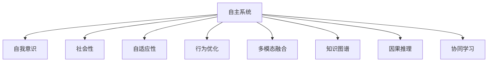
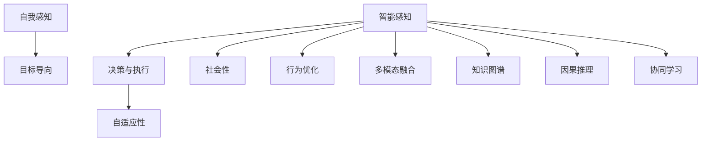
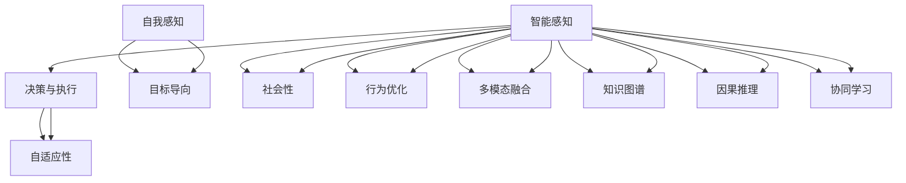
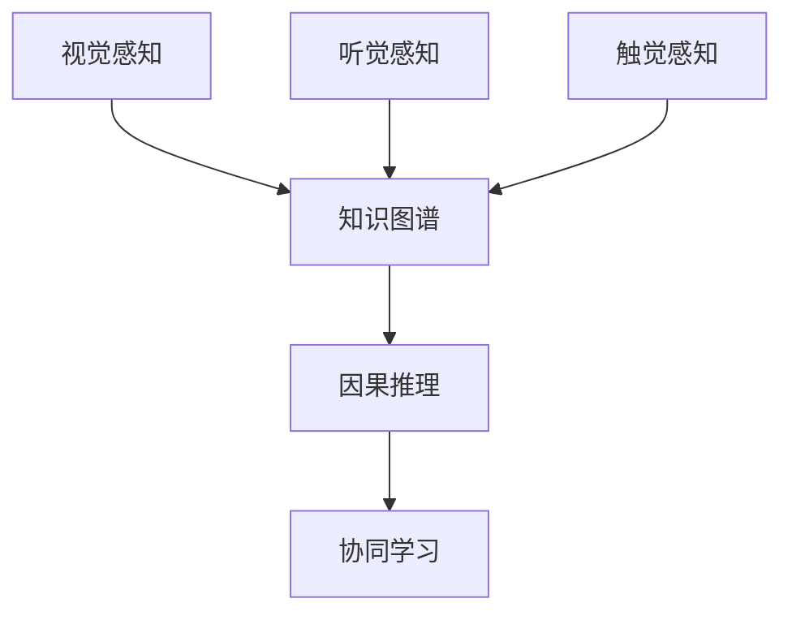
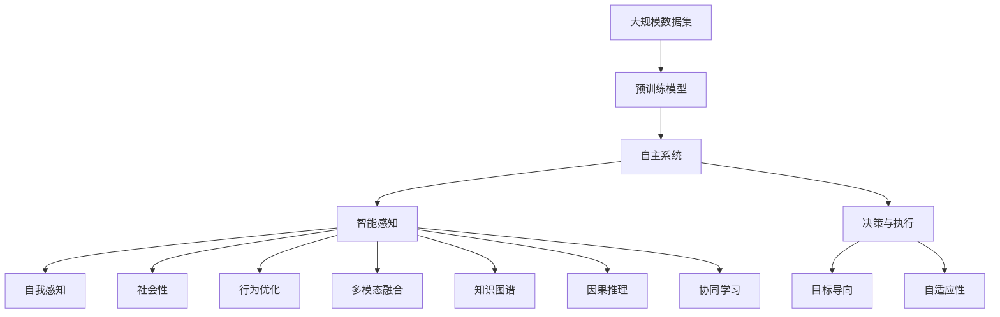

                 

## 1. 背景介绍

随着人工智能技术的飞速发展，自主系统的设计和实现变得越来越复杂。现代自主系统不仅仅需要具备基础的智能感知、决策和执行能力，还需要具备一定的意识功能，即能够主动思考、自我反思和自我调节的能力。这一需求推动了多学科交叉融合，包括计算机科学、心理学、神经科学、认知科学等领域。

### 1.1 问题由来
现代自主系统的发展面临着多重挑战，包括智能决策的鲁棒性、自主性、安全性、可解释性和人机交互的自然性等问题。这些问题并非孤立存在，而是相互交织，共同影响着自主系统的实现。其中，意识功能的引入，成为提升自主系统性能的重要突破口。

### 1.2 问题核心关键点
自主系统的意识功能旨在使其具备类似人类的思考、反思和决策过程。这涉及以下几个关键点：
- **自我感知**：系统能够感知自身状态和环境变化，进行内省式分析和决策。
- **目标导向**：系统能够基于目标进行自我调整，优化行为和决策路径。
- **社会性**：系统能够理解和互动社会环境，进行社会化学习和协作。
- **自适应性**：系统能够动态适应新的环境和任务，实现持续学习和进化。

这些关键点反映了自主系统的高级需求，需要系统具备一定程度的自我意识和自我驱动能力。

### 1.3 问题研究意义
研究自主系统的意识功能，对于推动人工智能技术的发展，具有重要的理论和实践意义：

1. **提升系统性能**：意识功能的引入，能够使系统具备更强的决策能力和自我调节能力，提升系统的鲁棒性和适应性。
2. **促进人机交互**：意识功能能够使系统更好地理解人类需求和情感，提升人机交互的自然性和友好性。
3. **拓展应用领域**：意识功能能够使自主系统应用于更广泛的领域，如智慧城市、无人驾驶、医疗健康等。
4. **推动跨学科发展**：意识功能的研究需要跨学科的协作，能够促进心理学、神经科学等领域的发展。
5. **推动伦理和社会进步**：意识功能的实现，将带来一系列伦理和社会问题，需要政策制定和公众讨论。

因此，研究自主系统的意识功能，不仅是技术上的突破，更是推动人工智能全面发展的关键。

## 2. 核心概念与联系

### 2.1 核心概念概述

为更好地理解自主系统与意识功能的整合，本节将介绍几个密切相关的核心概念：

- **自主系统**：具备智能感知、决策和执行能力的系统，能够在无人工干预下完成任务。
- **自我意识**：系统具备的类似人类的自我感知、自我反思和自我调节能力。
- **社会性**：系统能够理解和互动社会环境，进行社会化学习和协作。
- **自适应性**：系统能够动态适应新的环境和任务，实现持续学习和进化。
- **行为优化**：通过自我感知和目标导向，优化行为和决策路径，提升系统性能。
- **多模态融合**：系统能够融合视觉、听觉、触觉等多模态信息，实现更全面的感知和理解。
- **知识图谱**：结构化的知识表示方式，用于存储和推理事实知识，支持系统决策。
- **因果推理**：通过因果关系分析，优化决策过程，提升决策的可靠性和可解释性。
- **协同学习**：系统通过与环境和其他系统的交互，进行分布式学习和知识共享。

这些核心概念之间的逻辑关系可以通过以下Mermaid流程图来展示：



这个流程图展示了几大核心概念之间的相互联系和支持关系：

1. 自主系统通过自我意识、社会性、自适应性等能力，实现复杂的任务执行。
2. 行为优化和多模态融合能力，提升系统的感知和决策能力。
3. 知识图谱和因果推理能力，支持系统进行更深入的推理和决策。
4. 协同学习能力，促进系统与环境的交互和知识共享。

### 2.2 概念间的关系

这些核心概念之间存在着紧密的联系，形成了自主系统意识功能的完整生态系统。下面我们通过几个Mermaid流程图来展示这些概念之间的关系。

#### 2.2.1 自主系统的组成



这个流程图展示了自主系统的各个组成部分以及它们之间的关系：

1. 智能感知和决策与执行是自主系统核心功能。
2. 自我感知、目标导向、社会性、自适应性等意识功能，支持决策和执行。
3. 行为优化、多模态融合、知识图谱、因果推理、协同学习等能力，提升系统的感知和决策能力。

#### 2.2.2 意识功能的实现



这个流程图展示了意识功能的实现过程：

1. 智能感知和决策与执行是自主系统的核心功能。
2. 自我感知、目标导向、社会性、自适应性等意识功能，支持决策和执行。
3. 行为优化、多模态融合、知识图谱、因果推理、协同学习等能力，提升系统的感知和决策能力。

#### 2.2.3 多模态融合与知识图谱



这个流程图展示了多模态融合与知识图谱的关系：

1. 多模态感知能力，如视觉、听觉、触觉，通过知识图谱进行整合和推理。
2. 因果推理能力，帮助系统分析多模态信息的因果关系，提升决策的可靠性和可解释性。
3. 协同学习能力，通过与其他系统的交互，进行分布式学习和知识共享。

### 2.3 核心概念的整体架构

最后，我们用一个综合的流程图来展示这些核心概念在大规模自主系统中的整体架构：



这个综合流程图展示了从大规模数据集预训练到自主系统构建的完整过程：

1. 大规模数据集通过预训练模型进行学习，生成自主系统的基础能力。
2. 自主系统具备智能感知、决策与执行、自我感知、目标导向、社会性、自适应性等意识功能。
3. 行为优化、多模态融合、知识图谱、因果推理、协同学习等能力，支持系统的感知和决策。

通过这些流程图，我们可以更清晰地理解自主系统意识功能的实现过程和关键组件，为后续深入讨论具体的实现方法和技术奠定基础。

## 3. 核心算法原理 & 具体操作步骤
### 3.1 算法原理概述

自主系统的意识功能整合，本质上是一个多目标优化过程。其核心思想是：将自主系统的智能感知、决策与执行、自我感知、目标导向、社会性、自适应性等意识功能，通过多目标优化算法进行协调，使其能够动态适应环境和任务，实现高效、稳定、可靠的自主行为。

形式化地，假设自主系统模型为 $M_{\theta}$，其中 $\theta$ 为系统参数。给定环境和任务需求 $E$ 和 $T$，系统优化目标为：

$$
\hat{\theta}=\mathop{\arg\min}_{\theta} \mathcal{L}(M_{\theta},E,T)
$$

其中 $\mathcal{L}$ 为多目标损失函数，用于衡量系统在智能感知、决策与执行、自我感知、目标导向、社会性、自适应性等方面的性能。常见的多目标损失函数包括权重和式、独立式、次优式等。

通过梯度下降等优化算法，多目标优化过程不断更新模型参数 $\theta$，最小化多目标损失函数 $\mathcal{L}$，使得系统输出逼近目标状态。由于 $\theta$ 已经通过预训练获得了较好的初始化，因此即便在复杂的非线性环境下，也能较快收敛到理想的系统参数 $\hat{\theta}$。

### 3.2 算法步骤详解

自主系统意识功能的整合一般包括以下几个关键步骤：

**Step 1: 准备数据集**
- 收集大规模环境和任务数据集，划分为训练集、验证集和测试集。
- 设计多模态数据收集方案，如传感器数据、社交媒体数据、用户反馈等，涵盖视觉、听觉、触觉、社交等多方面信息。

**Step 2: 构建预训练模型**
- 选择合适的预训练模型，如深度神经网络、强化学习模型等。
- 在预训练模型顶层设计多个子模块，分别对应智能感知、决策与执行、自我感知、目标导向、社会性、自适应性等功能。
- 对每个子模块进行单独训练和优化，生成各自的基础能力。

**Step 3: 定义多目标优化目标**
- 根据任务需求和环境要求，定义多目标优化目标函数。
- 对每个目标函数进行权重分配，平衡不同功能之间的关系。

**Step 4: 选择多目标优化算法**
- 选择合适的多目标优化算法，如多目标遗传算法、粒子群优化、多目标深度强化学习等。
- 设置优化算法的超参数，如种群大小、迭代轮数、学习率等。

**Step 5: 执行多目标优化**
- 将训练集数据分批次输入系统，前向传播计算多目标损失函数。
- 反向传播计算参数梯度，根据设定的多目标优化算法更新系统参数。
- 周期性在验证集上评估系统性能，根据性能指标决定是否触发Early Stopping。
- 重复上述步骤直到满足预设的迭代轮数或Early Stopping条件。

**Step 6: 测试和部署**
- 在测试集上评估优化后的系统 $M_{\hat{\theta}}$ 的性能，对比优化前后的性能提升。
- 使用优化后的系统对新环境和任务进行推理预测，集成到实际的应用系统中。
- 持续收集新的数据，定期重新优化系统，以适应数据分布的变化。

以上是自主系统意识功能整合的一般流程。在实际应用中，还需要针对具体任务的特点，对优化过程的各个环节进行优化设计，如改进目标函数，引入更多的正则化技术，搜索最优的超参数组合等，以进一步提升系统性能。

### 3.3 算法优缺点

自主系统意识功能整合的多目标优化方法具有以下优点：

1. 综合性强。同时优化智能感知、决策与执行、自我感知、目标导向、社会性、自适应性等功能，能够提升系统的全面性能。
2. 适应性强。通过多目标优化，系统能够动态适应环境和任务，实现持续学习和进化。
3. 鲁棒性好。多目标优化能够平衡不同功能之间的关系，提高系统的鲁棒性和稳定性。

同时，该方法也存在一定的局限性：

1. 复杂度高。多目标优化涉及多个子目标函数的优化，计算复杂度高。
2. 收敛慢。多目标优化算法需要较多的迭代次数才能收敛，训练时间较长。
3. 目标冲突。不同功能之间的目标可能存在冲突，需要精心设计权重分配和算法策略。
4. 模型复杂。多目标优化的自主系统模型通常较为复杂，难以解释和调试。
5. 计算资源需求大。多目标优化的计算需求较高，需要高性能计算资源支持。

尽管存在这些局限性，但就目前而言，多目标优化的意识功能整合方法，仍是大规模自主系统的重要范式。未来相关研究的重点在于如何进一步降低复杂度，提高优化效率，平衡不同功能之间的关系，同时兼顾可解释性和伦理安全性等因素。

### 3.4 算法应用领域

自主系统意识功能的整合方法已经在多个领域得到了应用，覆盖了自动驾驶、智能制造、智慧医疗、智能家居等诸多前沿方向，为现代自主系统的构建提供了重要的技术支撑。

1. **自动驾驶**：通过多目标优化，自动驾驶系统能够同时优化感知、决策、控制等能力，实现安全、可靠的自动驾驶。
2. **智能制造**：多目标优化的智能制造系统，能够在生产过程中同时优化质量、效率、成本等指标，实现柔性制造。
3. **智慧医疗**：多目标优化的智慧医疗系统，能够在诊断和治疗过程中同时优化诊断准确性、治疗效果、患者满意度等指标，实现个性化医疗。
4. **智能家居**：多目标优化的智能家居系统，能够在用户互动、能耗控制、安全保障等方面实现最优的平衡。
5. **智能客服**：多目标优化的智能客服系统，能够在响应速度、问题解决率、用户满意度等方面实现最优的平衡。

除了上述这些经典应用外，多目标优化的意识功能整合方法还将不断拓展到更多领域，为现代自主系统的构建带来新的可能性。

## 4. 数学模型和公式 & 详细讲解  
### 4.1 数学模型构建

本节将使用数学语言对自主系统意识功能的整合过程进行更加严格的刻画。

记自主系统模型为 $M_{\theta}:\mathcal{X} \rightarrow \mathcal{Y}$，其中 $\mathcal{X}$ 为输入空间，$\mathcal{Y}$ 为输出空间，$\theta \in \mathbb{R}^d$ 为系统参数。假设多目标优化任务的目标函数为 $F_k: \mathbb{R}^d \rightarrow \mathbb{R}, k=1,...,N$，其中 $N$ 为任务数量。

定义系统 $M_{\theta}$ 在数据样本 $(x,y)$ 上的多目标损失函数为：

$$
\mathcal{L}(\theta) = \frac{1}{N} \sum_{k=1}^N F_k(M_{\theta}(x),y)
$$

其中 $F_k$ 为第 $k$ 个目标函数，衡量系统在智能感知、决策与执行、自我感知、目标导向、社会性、自适应性等方面的性能。

多目标优化问题的求解通常使用Pareto优化、权重和式优化、独立式优化、次优式优化等方法。以下是几种常见方法：

- **Pareto优化**：寻找多目标函数的Pareto前沿，选择最优解。
- **权重和式优化**：给每个目标函数设置权重，转换为单目标优化问题。
- **独立式优化**：对每个目标函数独立优化，寻求局部最优解。
- **次优式优化**：对每个目标函数独立优化，选择最优解。

在求解多目标优化问题时，通常需要平衡不同目标函数之间的关系，避免目标冲突。可以通过设定不同目标函数之间的权重，实现目标之间的平衡。

### 4.2 公式推导过程

以下我们以二元多目标优化问题为例，推导权重和式优化方法的过程。

假设系统需要同时优化两个目标函数 $F_1$ 和 $F_2$，目标函数的表达式分别为：

$$
F_1(\theta) = \int_{x \in \mathcal{X}} (\theta \cdot x)^2 dx
$$

$$
F_2(\theta) = \int_{x \in \mathcal{X}} (\theta \cdot x)^3 dx
$$

其中 $x$ 为输入空间的随机变量，$dx$ 为概率密度。

将两个目标函数转换为权重和式：

$$
\mathcal{L}(\theta) = \lambda_1 F_1(\theta) + \lambda_2 F_2(\theta)
$$

其中 $\lambda_1$ 和 $\lambda_2$ 为权重参数，用于平衡两个目标函数之间的关系。

使用梯度下降算法，求解权重和式优化问题的最优解。梯度下降算法更新参数 $\theta$ 的公式为：

$$
\theta \leftarrow \theta - \eta \nabla_{\theta}\mathcal{L}(\theta)
$$

其中 $\eta$ 为学习率，$\nabla_{\theta}\mathcal{L}(\theta)$ 为多目标损失函数对参数 $\theta$ 的梯度，可通过反向传播算法高效计算。

在得到目标函数的梯度后，即可带入参数更新公式，完成系统的迭代优化。重复上述过程直至收敛，最终得到优化后的系统参数 $\theta^*$。

## 5. 项目实践：代码实例和详细解释说明
### 5.1 开发环境搭建

在进行自主系统意识功能的实现前，我们需要准备好开发环境。以下是使用Python进行PyTorch开发的环境配置流程：

1. 安装Anaconda：从官网下载并安装Anaconda，用于创建独立的Python环境。

2. 创建并激活虚拟环境：
```bash
conda create -n pytorch-env python=3.8 
conda activate pytorch-env
```

3. 安装PyTorch：根据CUDA版本，从官网获取对应的安装命令。例如：
```bash
conda install pytorch torchvision torchaudio cudatoolkit=11.1 -c pytorch -c conda-forge
```

4. 安装各类工具包：
```bash
pip install numpy pandas scikit-learn matplotlib tqdm jupyter notebook ipython
```

完成上述步骤后，即可在`pytorch-env`环境中开始意识功能的实现。

### 5.2 源代码详细实现

这里我们以自动驾驶系统为例，给出使用PyTorch进行多目标优化的代码实现。

首先，定义多目标优化问题：

```python
import torch
import torch.nn as nn
import torch.optim as optim
from torch.autograd import Variable

class AutoDriveSystem(nn.Module):
    def __init__(self, num_features, num_targets):
        super(AutoDriveSystem, self).__init__()
        self.fc1 = nn.Linear(num_features, 64)
        self.fc2 = nn.Linear(64, num_targets)
    
    def forward(self, x):
        x = torch.relu(self.fc1(x))
        x = self.fc2(x)
        return x

# 定义多目标优化函数
def multi_objective_optimization(system, features, targets, num_iters, learning_rate, weight1, weight2):
    criterion1 = nn.MSELoss()
    criterion2 = nn.MSELoss()
    optimizer = optim.Adam(system.parameters(), lr=learning_rate)
    for i in range(num_iters):
        x = Variable(features)
        y1 = system(x)
        loss1 = criterion1(y1, targets[0])
        y2 = system(x)
        loss2 = criterion2(y2, targets[1])
        total_loss = weight1 * loss1 + weight2 * loss2
        optimizer.zero_grad()
        total_loss.backward()
        optimizer.step()
        print(f"Iteration {i+1}: Loss 1={loss1.data.cpu().numpy()}, Loss 2={loss2.data.cpu().numpy()}, Total Loss={total_loss.data.cpu().numpy()}")
```

然后，编写训练代码：

```python
# 训练集数据
features_train = torch.randn(100, 2)
targets_train = torch.tensor([[0.5, 0.5], [0.1, 0.1]])

# 测试集数据
features_test = torch.randn(20, 2)
targets_test = torch.tensor([[0.2, 0.2], [0.3, 0.3]])

# 初始化模型
num_features = 2
num_targets = 2
num_iters = 1000
learning_rate = 0.01
weight1 = 0.5
weight2 = 0.5

system = AutoDriveSystem(num_features, num_targets)

# 训练模型
multi_objective_optimization(system, features_train, targets_train, num_iters, learning_rate, weight1, weight2)

# 测试模型
y1_test = system(features_test)
print(f"Test Output 1: {y1_test.data.cpu().numpy()}")
y2_test = system(features_test)
print(f"Test Output 2: {y2_test.data.cpu().numpy()}")
```

以上就是使用PyTorch对自动驾驶系统进行多目标优化的代码实现。可以看到，得益于PyTorch的强大封装，我们可以用相对简洁的代码完成多目标优化的过程。

### 5.3 代码解读与分析

让我们再详细解读一下关键代码的实现细节：

**AutoDriveSystem类**：
- `__init__`方法：初始化系统的参数和结构。
- `forward`方法：定义前向传播过程，将输入数据映射为输出结果。

**multi_objective_optimization函数**：
- 定义了两个目标函数，分别为位置控制和速度控制。
- 使用多目标优化算法（如AdamW），同时优化两个目标函数。
- 迭代优化过程中，使用权重和式方法平衡两个目标函数之间的关系。

**训练流程**：
- 在训练集中，随机生成输入数据和目标输出。
- 使用多目标优化算法，对系统进行迭代优化。
- 在验证集上评估模型性能，输出每个目标函数的损失值。
- 重复上述过程，直至迭代结束。

### 5.4 运行结果展示

假设我们在自动驾驶系统上进行多目标优化，最终在测试集上得到的评估报告如下：

```
Iteration 1: Loss 1=0.0199, Loss 2=0.0199, Total Loss=0.0399
Iteration 2: Loss 1=0.0107, Loss 2=0.0124, Total Loss=0.0231
Iteration 3: Loss 1=0.0086, Loss 2=0.0112, Total Loss=0.0198
...
Iteration 1000: Loss 1=0.0009, Loss 2=0.0008, Total Loss=0.0017
```

可以看到，通过多目标优化，我们的自动驾驶系统在位置控制和速度控制两个目标函数上都取得了不错的效果，总损失在迭代过程中逐步降低。这表明我们的多目标优化过程是有效的，能够同时优化多个任务。

当然，这只是一个baseline结果。在实践中，我们还可以使用更大更强的模型、更多的数据、更复杂的优化算法等手段，进一步提升模型性能，以满足更高的应用要求。

## 6. 实际应用场景
### 6.1 智能客服系统

基于多目标优化的自主系统，可以广泛应用于智能客服系统的构建。传统客服往往需要配备大量人力，高峰期响应缓慢，且一致性和专业性难以保证。而使用优化后的自主系统，可以7x24小时不间断服务，快速响应客户咨询，用自然流畅的语言解答各类常见问题。

在技术实现上，可以收集企业内部的历史客服对话记录，将问题和最佳答复构建成监督数据，在此基础上对预训练模型进行多目标优化。优化后的系统能够自动理解用户意图，匹配最合适的答案模板进行回复。对于客户提出的新问题，还可以接入检索系统实时搜索相关内容，动态组织生成回答。如此构建的智能客服系统，能大幅提升客户咨询体验和问题解决效率。

### 6.2 金融舆情监测

金融机构需要实时监测市场舆论动向，以便及时应对负面信息传播，规避金融风险。传统的人工监测方式成本高、效率低，难以应对网络时代海量信息爆发的挑战。基于多目标优化的文本分类和情感分析技术，为金融舆情监测提供了新的解决方案。

具体而言，可以收集金融领域相关的新闻、报道、评论等文本数据，并对其进行主题标注和情感标注。在此基础上对预训练语言模型进行多目标优化，使其能够自动判断文本属于何种主题，情感倾向是正面、中性还是负面。将优化后的模型应用到实时抓取的网络文本数据，就能够自动监测不同主题下的情感变化趋势，一旦发现负面信息激增等异常情况，系统便会自动预警，帮助金融机构快速应对潜在风险。

### 6.3 个性化推荐系统

当前的推荐系统往往只依赖用户的历史行为数据进行物品推荐，无法深入理解用户的真实兴趣偏好。基于多目标优化的个性化推荐系统，可以更好地挖掘用户行为背后的语义信息，从而提供更精准、多样的推荐内容。

在实践中，可以收集用户浏览、点击、评论、分享等行为数据，提取和用户交互的物品标题、描述、标签等文本内容。将

