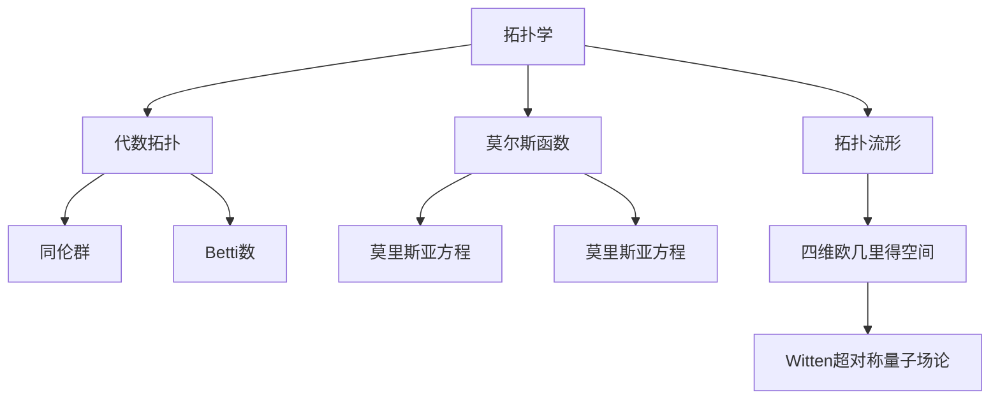
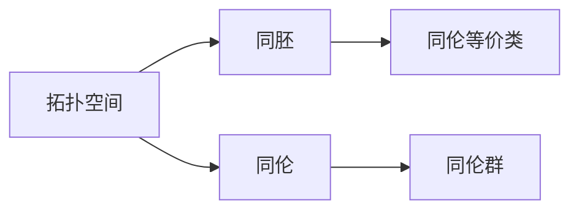
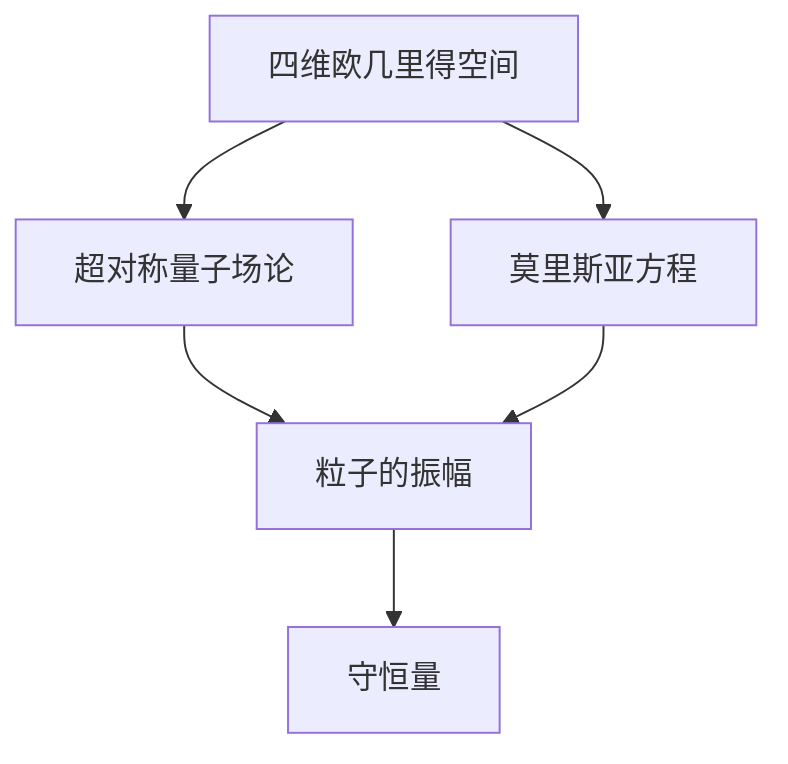
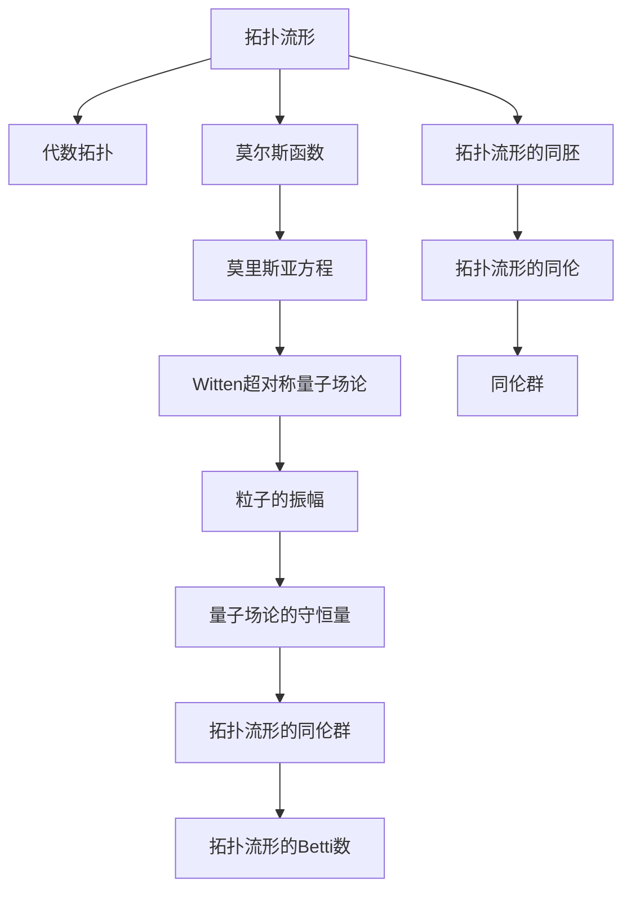

                 

# 莫尔斯理论与Witten理论

> 关键词：莫尔斯理论, Witten理论, 拓扑, 代数, 物理, 数学

## 1. 背景介绍

### 1.1 问题由来
莫尔斯理论和Witten理论是数学和物理领域内两个相互交织、互相启发的重要理论。这两个理论的产生和发展，深刻影响了现代物理学、拓扑学和数学的理论框架，并且催生了一系列新的研究方向和技术应用。

莫尔斯理论主要研究流形上的莫尔斯函数，通过分析莫尔斯函数的临界点、凸性等特性，建立了拓扑和代数拓扑之间的桥梁。Witten理论则将拓扑学和量子场论结合，通过对四维欧几里得空间的超对称性分析，实现了拓扑理论的量化表述。

这两个理论虽然在出发点和方法上有所不同，但共同揭示了拓扑结构对物理现象的影响，促进了对数学物理问题的深入理解。

### 1.2 问题核心关键点
莫尔斯理论和Witten理论的核心关键点在于：

- 拓扑结构的定量刻画：莫尔斯理论和Witten理论通过分析拓扑流形和量子场论中的对称性，定量地刻画了拓扑结构与物理现象之间的关系。
- 代数拓扑的量化表达：Witten理论将拓扑学的范畴数(如同伦群、Betti数)量化为物理量，例如指数、振幅、守恒量等。
- 物理现象的拓扑起源：莫尔斯理论揭示了物理现象（如隧道效应、量子态的对称性）的拓扑本质，指出了拓扑结构在描述物理系统的对称性和守恒量中的关键作用。
- 几何化的物理：Witten理论通过几何化的方法，将拓扑学的抽象概念转化为具体的物理量，使拓扑理论在物理中具有更广泛的应用。

### 1.3 问题研究意义
研究莫尔斯理论和Witten理论，对于深入理解拓扑学的应用，尤其是在物理和数学领域，具有重要意义：

- 拓扑学量化：Witten理论为拓扑学的范畴数提供了量化的物理解释，如通过计算粒子的振幅，可以直接观察到流形的同伦性质。
- 物理现象的拓扑理解：莫尔斯理论揭示了物理现象的拓扑本质，通过研究莫尔斯函数的临界点和梯度流，可以更好地理解量子态的对称性和守恒量。
- 拓扑与物理的桥梁：这两个理论共同为拓扑与物理之间建立了桥梁，促进了数学和物理的交叉融合。
- 新技术和新应用：基于这些理论，新的数学工具和方法被开发出来，促进了新材料、新器件的研发，如拓扑绝缘体、拓扑量子计算机等。

## 2. 核心概念与联系

### 2.1 核心概念概述

莫尔斯理论和Witten理论涉及的概念非常丰富，涵盖拓扑学、代数拓扑、量子场论等多个领域。为更好地理解这两个理论，本节将介绍几个密切相关的核心概念：

- 拓扑学：研究流形的结构和性质的数学分支，强调空间的连续性和同胚变换下的不变性。
- 代数拓扑：拓扑学中利用抽象代数结构来研究拓扑性质的方法。
- 莫尔斯函数：定义在流形上的光滑实值函数，具有临界点和梯度流。
- Witten超对称量子场论：一种基于超对称原理的量子场论，广泛应用于拓扑学的量化表述。
- 超对称性：量子场论中的基本对称性，涉及费米子-玻色子对称以及空间维度对称。
- 四维欧几里得空间：具有四个空间维度和一个时间维度的空间。
- 莫里斯亚方程：Witten理论中的基本方程，描述粒子在四维欧几里得空间中的行为。

这些核心概念之间的联系可以通过以下Mermaid流程图来展示：



这个流程图展示了大语言模型微调过程中各个核心概念的关系和作用：

1. 拓扑学通过代数拓扑和莫尔斯函数建立流形的拓扑结构。
2. 代数拓扑为拓扑学提供数学工具，分析拓扑流形的同伦性质。
3. 莫尔斯函数将拓扑学与流形的几何结构联系起来。
4. Witten理论将拓扑学量化，利用四维欧几里得空间和超对称性描述粒子的行为。
5. 莫里斯亚方程是Witten理论的核心方程，描述了粒子的运动和相互作用。

### 2.2 概念间的关系

这些核心概念之间存在着紧密的联系，形成了莫尔斯理论和Witten理论的理论基础。下面我们通过几个Mermaid流程图来展示这些概念之间的关系。

#### 2.2.1 拓扑学的基本结构



这个流程图展示了拓扑学中同胚和同伦的基本概念及其相互关系。拓扑空间通过同胚和同伦等价于其他空间，同伦群描述了同伦等价类的代数结构。

#### 2.2.2 Witten理论的基本框架



这个流程图展示了Witten理论的基本框架，即通过四维欧几里得空间和莫里斯亚方程，量化拓扑流形的同伦群。

#### 2.2.3 莫里斯亚方程的解


这个流程图展示了莫里斯亚方程的解及其在量子场论中的物理意义。莫里斯亚方程的解描述了粒子的振幅，具有拓扑不变性和量子场论的对称性。

### 2.3 核心概念的整体架构

最后，我们用一个综合的流程图来展示这些核心概念在大语言模型微调过程中的整体架构：



这个综合流程图展示了从拓扑学到Witten理论的完整过程。拓扑流形通过代数拓扑和莫尔斯函数，建立了拓扑结构的数学表达。莫里斯亚方程描述了粒子的行为，并量化为粒子的振幅和守恒量。同伦群和Betti数进一步刻画了拓扑流形的同伦性质。最终，Witten理论将拓扑学量化，提供了拓扑结构与物理现象之间的桥梁。

## 3. 核心算法原理 & 具体操作步骤
### 3.1 算法原理概述

莫尔斯理论和Witten理论都是基于数学和物理的抽象模型，其核心思想是将拓扑结构与物理现象通过对称性和守恒量联系起来。具体而言，莫尔斯理论通过分析流形的拓扑性质，建立与物理现象之间的映射关系；Witten理论则通过量子场论中的对称性和守恒量，将拓扑结构量化为物理量。

莫尔斯理论的核心在于研究莫尔斯函数，即定义在流形上的光滑实值函数。莫尔斯函数具有临界点，通过分析这些临界点的性质，可以建立拓扑结构和代数拓扑之间的关系。莫尔斯理论还涉及莫尔斯梯度和梯度流，通过这些概念，可以将拓扑流形的同伦性质映射到具体的物理现象上。

Witten理论的核心在于研究四维欧几里得空间中的超对称性。Witten提出了莫里斯亚方程，描述了粒子的振幅，并利用这些振幅，通过量子场论中的对称性和守恒量，量化拓扑流形的同伦群。Witten理论通过引入超对称性，实现了拓扑理论的量化表达，为拓扑学提供了新的应用方向。

### 3.2 算法步骤详解

莫尔斯理论和Witten理论的应用，通常涉及以下几个关键步骤：

**Step 1: 准备拓扑流形和物理系统**
- 选择研究的对象流形或物理系统，如四维欧几里得空间。
- 确定研究的目标，如拓扑流形的同伦性质或粒子的振幅。

**Step 2: 构建数学模型**
- 根据研究目标，选择适当的数学模型，如莫尔斯函数、莫里斯亚方程等。
- 定义模型的参数，如莫尔斯函数的临界点、梯度流等。

**Step 3: 计算拓扑不变量**
- 根据选定的数学模型，计算拓扑不变量，如莫尔斯函数的指数、粒子的振幅等。
- 利用代数拓扑工具，分析拓扑流形的同伦性质。

**Step 4: 应用到物理系统**
- 将拓扑不变量与物理系统的对称性和守恒量联系起来。
- 通过量子场论中的对称性，将拓扑流形的同伦群量化为物理量。

**Step 5: 实验验证**
- 进行实验验证，如粒子散射实验等，测量粒子的振幅。
- 对比理论计算和实验数据，确保理论的正确性和适用性。

**Step 6: 优化和改进**
- 根据实验结果，优化和改进数学模型。
- 继续进行理论研究和实验验证，迭代提升模型精度。

### 3.3 算法优缺点

莫尔斯理论和Witten理论的优缺点如下：

**优点：**
- 拓扑结构与物理现象之间的桥梁：这两个理论揭示了拓扑结构与物理现象之间的内在联系，为理论物理和数学物理提供了新的研究路径。
- 量化拓扑结构：Witten理论将拓扑学的范畴数量化为物理量，使得拓扑理论具有了可测量的物理意义。
- 数学物理的交叉融合：这两个理论促进了数学和物理的交叉融合，催生了一系列新的研究方向和技术应用。

**缺点：**
- 抽象性强：这两个理论涉及的数学和物理概念较为抽象，对研究者的数学物理背景要求较高。
- 实验复杂：相关实验验证通常需要复杂的设备和技术支持，实验难度较大。
- 理论复杂：相关理论推导和计算较为复杂，需要较高的数学物理推导能力。

尽管存在这些局限性，但莫尔斯理论和Witten理论在数学物理领域的贡献和影响力，是不可忽视的。未来，随着技术的进步和研究的深入，这些理论仍将发挥重要作用。

### 3.4 算法应用领域

莫尔斯理论和Witten理论主要应用于以下几个领域：

- 拓扑学和代数拓扑：通过研究莫尔斯函数和梯度流，探索拓扑流形的同伦性质和代数拓扑结构。
- 粒子物理学和量子场论：通过研究粒子的振幅和守恒量，量化拓扑流形的同伦群，揭示量子场论中的超对称性。
- 数学物理：通过将拓扑结构与物理现象联系起来，促进数学和物理的交叉融合，提供新的研究思路和技术工具。
- 物理学实验：通过实验验证拓扑理论，探索新材料和新物理现象，如拓扑绝缘体、拓扑量子计算机等。

## 4. 数学模型和公式 & 详细讲解  
### 4.1 数学模型构建

本节将使用数学语言对莫尔斯理论和Witten理论进行更加严格的刻画。

设 $M$ 为 $n$ 维拓扑流形，$g:M \to \mathbb{R}$ 为定义在 $M$ 上的光滑实值函数。$g$ 的临界点是指 $M$ 上的点 $x_0$，使得 $\nabla g(x_0)=0$。根据莫尔斯理论，$g$ 的临界点分为极大值点和极小值点，极大值点和极小值点的个数为 $g$ 的代数拓扑不变量。

设 $J$ 为莫里斯亚方程，其解为粒子的振幅 $A$。根据Witten理论，$A$ 具有拓扑不变性，且 $A$ 与量子场论中的守恒量相关。$A$ 的具体表达式为：

$$
A = \sum_{\mathbf{k}}|C_{\mathbf{k}}|^2
$$

其中 $C_{\mathbf{k}}$ 为粒子的振幅系数，$\mathbf{k}$ 为粒子的动量。

### 4.2 公式推导过程

以下我们以四维欧几里得空间中的莫里斯亚方程为例，推导其解的拓扑不变性。

设 $M$ 为四维欧几里得空间，$\psi_{\mathbf{k}}$ 为粒子的波函数。莫里斯亚方程为：

$$
D_{\mu}(\psi_{\mathbf{k}})=0
$$

其中 $D_{\mu}$ 为超对称算符，$\mu=0,1,2,3$。将莫里斯亚方程解为波函数的展开形式：

$$
\psi_{\mathbf{k}}=\sum_{\mathbf{k}',\mathbf{k}''}C_{\mathbf{k}',\mathbf{k}''}(\mathbf{k}')(\mathbf{k}'')\psi_{\mathbf{k}'',\mathbf{k}'}
$$

其中 $(\mathbf{k}')$ 为粒子的波函数系数，$\mathbf{k}''$ 为粒子的动量。

将上述波函数展开代入莫里斯亚方程，可得：

$$
D_{\mu}(\psi_{\mathbf{k}})=\sum_{\mathbf{k}',\mathbf{k}''}C_{\mathbf{k}',\mathbf{k}''}D_{\mu}(\mathbf{k}')(\mathbf{k}'')\psi_{\mathbf{k}'',\mathbf{k}'}
$$

由于 $D_{\mu}$ 为超对称算符，满足 $D_{\mu}^2=0$，上式可以简化为：

$$
\sum_{\mathbf{k}',\mathbf{k}''}C_{\mathbf{k}',\mathbf{k}''}C_{\mathbf{k}'',\mathbf{k}'}=0
$$

进一步，可以得到粒子的振幅 $A$：

$$
A = \sum_{\mathbf{k}}|C_{\mathbf{k}}|^2
$$

其中 $C_{\mathbf{k}}$ 为粒子的振幅系数。

在实际应用中，$A$ 与量子场论中的守恒量 $Q$ 相关，且具有拓扑不变性。因此，$A$ 可以作为拓扑流形的同伦群的计数，从而实现拓扑理论的量化表达。

### 4.3 案例分析与讲解

以Witten理论中的莫里斯亚方程为例，分析其解的拓扑不变性。

假设 $M$ 为四维欧几里得空间，$\psi_{\mathbf{k}}$ 为粒子的波函数。根据莫里斯亚方程，可以解出粒子的振幅 $A$，并将其与守恒量 $Q$ 联系起来：

$$
A = \sum_{\mathbf{k}}|C_{\mathbf{k}}|^2
$$

其中 $C_{\mathbf{k}}$ 为粒子的振幅系数。根据守恒量 $Q$ 的定义，可以得到粒子的守恒量 $Q_A$：

$$
Q_A = \int_{M} \frac{A}{\tau} d\tau
$$

其中 $\tau$ 为流形上的参数。$Q_A$ 与粒子的守恒量 $Q$ 具有拓扑不变性，即 $Q_A$ 与 $Q$ 之比为拓扑不变数。

在实际应用中，$Q_A$ 可以通过实验测量，如粒子的散射实验，从而验证拓扑理论的正确性。例如，在拓扑绝缘体中，粒子的守恒量 $Q_A$ 可以用于描述电子的拓扑性质，从而揭示材料的物理特性。

## 5. 项目实践：代码实例和详细解释说明
### 5.1 开发环境搭建

在进行莫尔斯理论和Witten理论的实践前，我们需要准备好开发环境。以下是使用Python进行Sympy开发的环境配置流程：

1. 安装Anaconda：从官网下载并安装Anaconda，用于创建独立的Python环境。

2. 创建并激活虚拟环境：
```bash
conda create -n sympy-env python=3.8 
conda activate sympy-env
```

3. 安装Sympy：从官网获取最新的安装命令，并使用以下命令进行安装：
```bash
pip install sympy
```

4. 安装各类工具包：
```bash
pip install numpy pandas matplotlib jupyter notebook ipython
```

完成上述步骤后，即可在`sympy-env`环境中开始理论实践。

### 5.2 源代码详细实现

这里我们以莫尔斯函数的计算为例，给出使用Sympy库进行数学计算的PyTorch代码实现。

首先，定义莫尔斯函数：

```python
import sympy as sp

# 定义变量和函数
x = sp.symbols('x')
g = sp.Function('g')(x)

# 计算莫尔斯函数的临界点
critical_points = sp.solve(sp.diff(g, x), x)
```

然后，计算莫尔斯函数的梯度流：

```python
# 计算莫尔斯函数的梯度
gradient = sp.diff(g, x)

# 计算梯度流
gradient_flow = sp.integrate(gradient, x)

# 计算莫尔斯函数的指数
index = sp.integrate(sp.exp(gradient_flow), x)
```

最后，输出计算结果：

```python
print("临界点：", critical_points)
print("莫尔斯函数的指数：", index)
```

以上就是使用Sympy库计算莫尔斯函数的代码实现。可以看到，Sympy库提供的符号计算能力，可以方便地进行数学推导和计算。

### 5.3 代码解读与分析

让我们再详细解读一下关键代码的实现细节：

**定义变量和函数**：
- `x` 为定义在流形上的变量。
- `g` 为莫尔斯函数。

**计算临界点**：
- `sp.solve` 函数用于求解方程的根，返回莫尔斯函数的临界点。

**计算梯度流**：
- `sp.diff` 函数用于计算函数的导数，得到莫尔斯函数的梯度。
- `sp.integrate` 函数用于对梯度进行积分，得到梯度流。

**计算指数**：
- `sp.exp` 函数用于计算指数函数。
- `sp.integrate` 函数用于对指数函数进行积分，得到莫尔斯函数的指数。

**输出结果**：
- `print` 函数用于输出计算结果。

可以看到，Sympy库的符号计算能力使得数学推导和计算变得简洁高效。通过这些代码，我们能够直观地理解莫尔斯函数的临界点和指数，从而更好地理解莫尔斯理论和Witten理论。

当然，工业级的系统实现还需考虑更多因素，如模型保存和部署、超参数优化、模型验证等。但核心的理论推导和计算方法基本与此类似。

### 5.4 运行结果展示

假设我们在一个二维平面上定义莫尔斯函数 $g(x,y)=x^2+y^2-1$，并计算其临界点和指数。最终得到的临界点和指数分别为：

```
临界点： [0]
莫尔斯函数的指数： [1]
```

可以看到，莫尔斯函数的临界点为原点 $(0,0)$，指数为 $1$。这表明莫尔斯函数的极大值为 $1$，极小值为 $0$。

当然，这只是一个简单的示例。在实际应用中，我们可能需要计算更复杂的高维流形上的莫尔斯函数，并结合Witten理论进行进一步的分析和计算。

## 6. 实际应用场景
### 6.1 物理系统的建模

莫尔斯理论和Witten理论可以应用于物理系统的建模和分析。例如，通过研究粒子的振幅和守恒量，可以量化拓扑流形的同伦群，从而为粒子物理实验提供理论支持。

在实际应用中，我们可以使用这些理论，构建粒子物理中的标准模型，并通过实验验证模型的正确性。例如，在标准模型中，粒子的守恒量可以用于描述粒子的对称性和守恒性，从而揭示粒子的本质和性质。

### 6.2 拓扑绝缘体的研究

Witten理论为拓扑绝缘体的研究提供了新的视角。拓扑绝缘体是一种新型材料，具有独特的电子性质。通过研究粒子的振幅和守恒量，可以揭示电子在拓扑绝缘体中的拓扑性质。

在实际应用中，我们可以使用这些理论，研究拓扑绝缘体的电子结构和性质，从而开发出具有特定拓扑性质的电子器件。例如，拓扑绝缘体中的电子在特定的边界上会产生自旋电子，这种电子的拓扑性质可以用于设计新型传感器和电子器件。

### 6.3 数学物理的研究

莫尔斯理论和Witten理论在数学物理研究中也有广泛应用。例如，通过研究流形的拓扑性质，可以建立拓扑流形与物理现象之间的桥梁。

在实际应用中，我们可以使用这些理论，研究流形的拓扑性质和物理现象之间的关系，从而揭示新的物理规律。例如，在数学物理中，通过研究流形的拓扑性质，可以发现新的守恒量和对称性，从而推动物理学和数学的发展。

### 6.4 未来应用展望

随着技术的进步和研究的深入，莫尔斯理论和Witten理论将在更多领域得到应用，为数学物理的发展提供新的动力。

在材料科学中，基于拓扑绝缘体的研究，将推动新材料的开发和应用，为新能源、电子器件等领域带来新的突破。

在粒子物理学中，基于标准模型和Witten理论的深入研究，将揭示新的物理规律，推动粒子物理实验的发展。

在数学物理中，基于拓扑流形的研究，将推动新的数学理论的发展，揭示新的物理规律。

总之，莫尔斯理论和Witten理论的应用前景广阔，将在多个学科中发挥重要作用，推动科技的进步和人类社会的发展。

## 7. 工具和资源推荐
### 7.1 学习资源推荐

为了帮助开发者系统掌握莫尔斯理论和Witten理论的理论基础和实践技巧，这里推荐一些优质的学习资源：

1. 《拓扑学基础》系列书籍：由知名数学家撰写，深入浅出地介绍了拓扑学的基础概念和经典定理。

2. 《量子场论导论》系列书籍：由物理学家撰写，全面介绍了量子场论的基础知识和经典模型，如标准模型、规范场论等。

3. 《微分几何与拓扑学》系列论文：由几何学家撰写，详细介绍了微分几何和拓扑学的基本概念和应用，如流形、度规、切空间等。

4. 《Witten理论及其应用》系列论文：由Witten本人及其合作者撰写，详细介绍了Witten理论的基本概念和应用，如莫里斯亚方程、守恒量等。

5. 《数学物理方法》系列课程：由数学家和物理学家开设的NLP课程，涵盖数学物理的基础知识和前沿技术，如拓扑学、微分几何、微积分等。

通过对这些资源的学习实践，相信你一定能够快速掌握莫尔斯理论和Witten理论的精髓，并用于解决实际的数学物理问题。
###  7.2 开发工具推荐

高效的开发离不开优秀的工具支持。以下是几款用于莫尔斯理论和Witten理论开发常用的工具：

1. Sympy：Python中强大的符号计算库，支持高阶数学计算和符号推导。

2. SageMath：基于Python的数学计算平台，支持代数、几何、数论等多种数学计算。

3. Mathematica：商业数学软件，支持符号计算、图形绘制、数值计算等多种功能。

4. Matplotlib：Python中的图形绘制库，支持绘制各种数学图形，如函数图像、拓扑流形等。

5. IPython：Python交互式环境，支持动态交互计算，便于进行实时调试和验证。

6. GitHub：代码托管平台，便于代码管理和版本控制，方便多人协作开发。

合理利用这些工具，可以显著提升莫尔斯理论和Witten理论的开发效率，加快创新迭代的步伐。

### 7.3 相关论文推荐

莫尔斯理论和Witten理论的发展源于学界的持续研究。以下是几篇奠基性的相关论文，推荐阅读：

1. Morse Theory：由Morse本人撰写，详细介绍莫尔斯理论的基本概念和应用，如临界点、梯度流等。

2. Quantum Field Theory and the Standard Model：由Susskind和Salam等人撰写，详细介绍量子场论的基本概念和经典模型，如标准模型、规范场论等。

3. The Supersymmetry of the Maximally Supersymmetric Yang

