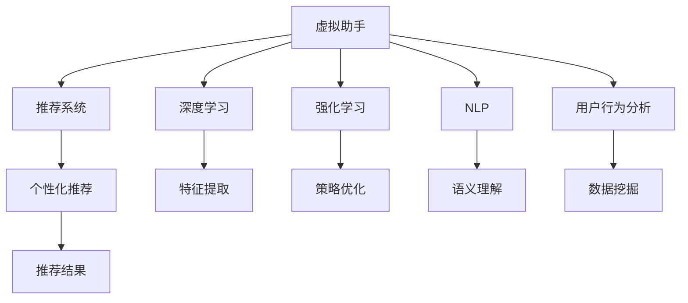
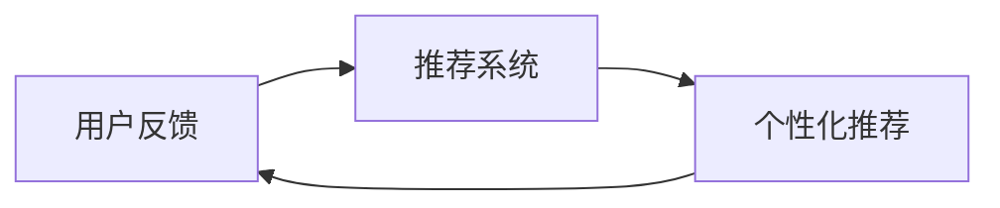
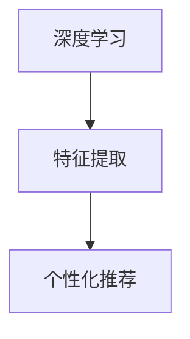
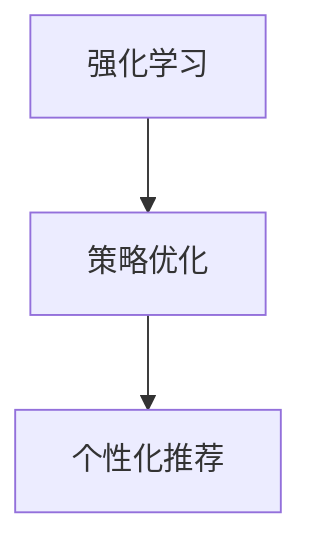
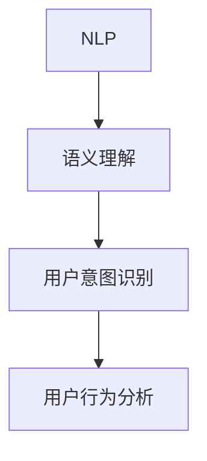
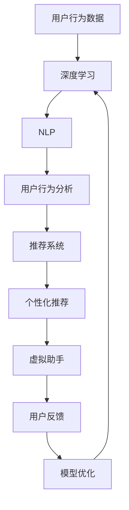

                 

# 虚拟导购助手的技术实现

> 关键词：虚拟助手,推荐系统,深度学习,强化学习,自然语言处理,NLP,用户行为分析,推荐引擎

## 1. 背景介绍

随着互联网和电子商务的迅猛发展，在线购物已成为现代人日常生活的重要组成部分。越来越多的消费者依赖网络购物平台获取所需商品信息并进行购买决策。然而，面对海量商品信息，消费者常常会感到无从下手，需要导购助手的帮助。虚拟导购助手作为一种基于人工智能技术的智能客服，能够根据用户的购买历史和行为，提供个性化推荐，极大提升了用户体验和商家转化率。

## 2. 核心概念与联系

### 2.1 核心概念概述

为更好地理解虚拟导购助手的技术实现，本节将介绍几个密切相关的核心概念：

- 虚拟助手(Virtual Assistant): 通过自然语言处理(NLP)和机器学习算法，为用户提供智能交互的AI客服系统。
- 推荐系统(Recommendation System): 根据用户的历史行为数据和兴趣偏好，推荐个性化商品的算法系统。
- 深度学习(Deep Learning): 利用多层神经网络进行特征学习和模型训练的机器学习技术。
- 强化学习(Reinforcement Learning): 通过与环境的交互，逐步优化模型参数，提高决策能力的学习方法。
- 自然语言处理(Natural Language Processing, NLP): 研究计算机如何处理和理解自然语言的技术，包括文本分类、命名实体识别、情感分析等。
- 用户行为分析(User Behavior Analysis): 通过对用户行为数据的分析，挖掘用户兴趣和需求，为推荐系统提供数据支持。

这些核心概念之间的逻辑关系可以通过以下Mermaid流程图来展示：



这个流程图展示了几大核心概念及其之间的关系：

1. 虚拟助手作为一个综合系统，包含深度学习、强化学习和NLP等多个子系统。
2. 推荐系统利用深度学习、用户行为分析和强化学习技术，生成个性化推荐。
3. 深度学习负责提取特征，进行用户行为分析和个性化推荐。
4. NLP帮助虚拟助手理解用户输入的自然语言指令。
5. 用户行为分析通过挖掘用户数据，提供个性化推荐的基础数据支持。
6. 个性化推荐最终提供推荐结果，供虚拟助手反馈给用户。

### 2.2 概念间的关系

这些核心概念之间存在着紧密的联系，形成了虚拟导购助手实现的基础框架。下面我们通过几个Mermaid流程图来展示这些概念之间的关系。

#### 2.2.1 虚拟助手与推荐系统



这个流程图展示了虚拟助手与推荐系统的基本关系。推荐系统根据用户行为数据，生成个性化推荐，然后反馈给虚拟助手，虚拟助手通过展示推荐结果，并根据用户反馈进一步优化推荐系统。

#### 2.2.2 深度学习与推荐系统



这个流程图展示了深度学习在推荐系统中的应用。深度学习通过神经网络进行特征提取，生成用户行为数据和商品特征向量，然后送入推荐算法中进行优化。

#### 2.2.3 强化学习与推荐系统



这个流程图展示了强化学习在推荐系统中的应用。强化学习通过与环境的交互，不断优化推荐策略，从而提高推荐效果。

#### 2.2.4 自然语言处理与虚拟助手



这个流程图展示了自然语言处理在虚拟助手中的应用。NLP通过语义理解，识别用户意图，并结合用户行为分析，生成个性化推荐。

### 2.3 核心概念的整体架构

最后，我们用一个综合的流程图来展示这些核心概念在大语言模型微调过程中的整体架构：



这个综合流程图展示了虚拟导购助手实现的整体架构：

1. 用户行为数据输入深度学习，提取特征。
2. NLP进行语义理解，识别用户意图。
3. 用户行为分析挖掘用户需求，生成个性化推荐。
4. 推荐系统进行策略优化，生成推荐结果。
5. 虚拟助手展示推荐结果，收集用户反馈。
6. 模型优化模块根据用户反馈，不断优化推荐模型。

通过这些流程图，我们可以更清晰地理解虚拟导购助手实现过程中各个核心概念的关系和作用，为后续深入讨论具体的实现方法和技术细节奠定基础。

## 3. 核心算法原理 & 具体操作步骤
### 3.1 算法原理概述

虚拟导购助手的实现涉及深度学习、强化学习、自然语言处理等多个核心技术，其核心思想是通过对这些技术的融合，生成个性化推荐，并结合用户反馈不断优化推荐系统。

具体来说，虚拟助手首先通过NLP技术理解用户的输入，然后根据用户的历史行为数据和兴趣偏好，利用深度学习提取特征，生成个性化推荐。同时，虚拟助手通过强化学习技术，不断调整推荐策略，提高推荐效果。最后，虚拟助手展示推荐结果，并根据用户反馈进行模型优化，逐步提升推荐系统性能。

### 3.2 算法步骤详解

基于虚拟导购助手的技术实现，一般包括以下几个关键步骤：

**Step 1: 准备数据集和模型**

- 收集用户行为数据，如浏览历史、点击行为、购买记录等，作为推荐系统的训练数据。
- 对用户行为数据进行预处理和清洗，去除噪声和异常值。
- 选择合适的预训练模型，如BERT、XLM等，作为虚拟助手的初始化模型。

**Step 2: 构建推荐系统**

- 选择合适的推荐算法，如协同过滤、矩阵分解等，并搭建推荐模型。
- 将用户行为数据作为输入，训练推荐模型，生成个性化推荐。
- 根据用户行为和偏好，对推荐结果进行排序和过滤。

**Step 3: 集成NLP模块**

- 使用NLP技术对用户输入的自然语言进行理解，提取关键信息。
- 根据用户意图，结合用户行为数据，生成推荐结果。
- 将推荐结果展示给用户，并记录用户反馈。

**Step 4: 训练虚拟助手模型**

- 使用用户行为数据和推荐结果，训练虚拟助手模型。
- 根据用户反馈，进行模型优化和调整。
- 定期更新虚拟助手模型，提升其推荐能力。

**Step 5: 部署虚拟助手**

- 将训练好的虚拟助手模型部署到线上环境。
- 通过API接口，接收用户输入，并返回推荐结果。
- 收集用户反馈数据，不断优化推荐模型。

### 3.3 算法优缺点

虚拟导购助手的实现涉及多种技术，其优缺点如下：

**优点：**
- 能够根据用户历史行为和兴趣偏好，提供个性化推荐，提升用户体验。
- 通过NLP技术，可以自然地与用户交互，提供更好的用户体验。
- 利用深度学习、强化学习等技术，能够不断优化推荐策略，提升推荐效果。

**缺点：**
- 需要大量的用户行为数据，数据收集和标注成本较高。
- 算法复杂度高，训练和推理速度较慢。
- 推荐系统可能存在冷启动问题，对于新用户的推荐效果较差。

### 3.4 算法应用领域

虚拟导购助手已经广泛应用于多个领域，例如：

- 电子商务：如亚马逊、淘宝等电商平台，利用虚拟助手提供个性化推荐，提升用户购买转化率。
- 金融服务：如银行、保险等金融服务机构，利用虚拟助手进行风险评估和金融产品推荐。
- 健康医疗：如在线医院、健康咨询平台，利用虚拟助手提供健康建议和医疗信息推荐。
- 教育培训：如在线教育平台、职业培训网站，利用虚拟助手进行课程推荐和学习建议。
- 旅游服务：如在线旅游平台、景区导览，利用虚拟助手提供旅游攻略和景点推荐。

除了上述这些常见应用，虚拟导购助手还在智能家居、智能客服等多个场景中发挥作用，为各行各业带来智能化升级。

## 4. 数学模型和公式 & 详细讲解 & 举例说明

### 4.1 数学模型构建

在虚拟导购助手实现过程中，涉及多个数学模型和算法。这里重点介绍深度学习模型和推荐算法的构建。

**深度学习模型：**

假设用户行为数据为 $X$，商品特征向量为 $Y$，推荐模型为 $M_{\theta}$，其中 $\theta$ 为模型参数。推荐模型的输出为推荐分数 $Z$，表示商品 $Y$ 对用户 $X$ 的推荐程度。

根据监督学习，推荐模型可以表示为：

$$
Z = M_{\theta}(X, Y)
$$

常用的推荐算法包括协同过滤和矩阵分解。协同过滤算法利用用户和商品的相似度，预测用户对未浏览商品的评分。矩阵分解算法通过分解用户-商品矩阵，生成低维度的用户和商品表示，并计算推荐分数。

**推荐算法：**

假设用户 $i$ 对商品 $j$ 的评分向量为 $r_i \in \mathbb{R}^m$，其中 $m$ 为推荐模型的维度。用户 $i$ 对商品 $j$ 的推荐分数可以表示为：

$$
\hat{r}_{i,j} = \theta^T h(X_i, Y_j)
$$

其中 $h$ 为特征映射函数，将用户行为数据和商品特征向量映射到高维空间。$\theta$ 为推荐模型的参数，通过最小化预测误差，优化模型参数。

### 4.2 公式推导过程

**协同过滤算法：**

假设用户 $i$ 对商品 $j$ 的评分向量为 $r_i$，用户 $i$ 对商品 $j$ 的预测评分向量为 $\hat{r}_{i,j}$。利用协同过滤算法，可以表示为：

$$
\hat{r}_{i,j} = \alpha_i \hat{r}_{i,j} + \beta_j \hat{r}_{i,j}
$$

其中 $\alpha_i$ 和 $\beta_j$ 为权重，表示用户 $i$ 和商品 $j$ 对推荐结果的影响。权重可以通过最小化预测误差，优化模型参数。

**矩阵分解算法：**

假设用户行为矩阵为 $R \in \mathbb{R}^{m \times n}$，其中 $m$ 为用户数，$n$ 为商品数。将用户行为矩阵分解为用户特征矩阵 $U \in \mathbb{R}^{m \times k}$ 和商品特征矩阵 $V \in \mathbb{R}^{n \times k}$，其中 $k$ 为分解后的维度。

通过矩阵分解算法，可以表示为：

$$
R = U V^T
$$

其中 $U$ 和 $V$ 表示用户和商品的低维表示，通过优化矩阵分解算法，可以生成推荐分数。

### 4.3 案例分析与讲解

**案例分析：**

假设我们在一个电子商务平台上实现虚拟导购助手，使用协同过滤算法作为推荐系统。我们将用户行为数据 $X$ 表示为 $r_i$，商品特征向量 $Y$ 表示为 $h(X)$。推荐模型 $M_{\theta}$ 表示为 $\hat{r}_{i,j}$。

**讲解：**

1. 首先，我们需要收集用户行为数据 $X$，包括用户浏览、点击、购买等行为数据。将这些数据作为训练数据，输入推荐模型 $M_{\theta}$。
2. 利用协同过滤算法，计算用户 $i$ 对商品 $j$ 的推荐分数 $\hat{r}_{i,j}$。
3. 根据推荐分数，将推荐结果排序，展示给用户。
4. 收集用户对推荐结果的反馈，用于模型优化。
5. 定期更新推荐模型，提升推荐效果。

## 5. 项目实践：代码实例和详细解释说明

### 5.1 开发环境搭建

在进行虚拟导购助手开发前，我们需要准备好开发环境。以下是使用Python进行PyTorch开发的环境配置流程：

1. 安装Anaconda：从官网下载并安装Anaconda，用于创建独立的Python环境。

2. 创建并激活虚拟环境：
```bash
conda create -n virtual_assistant python=3.8 
conda activate virtual_assistant
```

3. 安装PyTorch：根据CUDA版本，从官网获取对应的安装命令。例如：
```bash
conda install pytorch torchvision torchaudio cudatoolkit=11.1 -c pytorch -c conda-forge
```

4. 安装Pandas、NumPy等库：
```bash
pip install pandas numpy
```

5. 安装Flask：用于搭建虚拟助手API接口。
```bash
pip install flask
```

完成上述步骤后，即可在`virtual_assistant`环境中开始开发实践。

### 5.2 源代码详细实现

这里我们以一个简单的虚拟导购助手为例，给出使用PyTorch进行开发的基本代码实现。

首先，定义用户行为数据和商品特征向量：

```python
import torch
import torch.nn as nn
import torch.nn.functional as F
from torch.utils.data import DataLoader

# 用户行为数据
X = torch.randn(100, 10)
# 商品特征向量
Y = torch.randn(100, 5)
```

然后，定义推荐模型：

```python
class RecommendationModel(nn.Module):
    def __init__(self):
        super(RecommendationModel, self).__init__()
        self.fc1 = nn.Linear(10, 10)
        self.fc2 = nn.Linear(10, 5)
        self.fc3 = nn.Linear(5, 1)

    def forward(self, x, y):
        x = F.relu(self.fc1(x))
        x = self.fc2(x)
        y = self.fc3(y)
        z = x @ y
        return z
```

接着，定义用户行为数据和商品特征向量：

```python
# 用户行为数据
X = torch.randn(100, 10)
# 商品特征向量
Y = torch.randn(100, 5)
```

然后，定义推荐模型：

```python
class RecommendationModel(nn.Module):
    def __init__(self):
        super(RecommendationModel, self).__init__()
        self.fc1 = nn.Linear(10, 10)
        self.fc2 = nn.Linear(10, 5)
        self.fc3 = nn.Linear(5, 1)

    def forward(self, x, y):
        x = F.relu(self.fc1(x))
        x = self.fc2(x)
        y = self.fc3(y)
        z = x @ y
        return z
```

接着，定义损失函数和优化器：

```python
# 定义损失函数
criterion = nn.MSELoss()

# 定义优化器
optimizer = torch.optim.Adam(model.parameters(), lr=0.001)
```

然后，定义训练函数：

```python
def train(model, X, Y, criterion, optimizer):
    model.train()
    for i in range(10):
        # 前向传播
        z = model(X, Y)
        # 计算损失
        loss = criterion(z, Y)
        # 反向传播
        optimizer.zero_grad()
        loss.backward()
        optimizer.step()
        print(f"Epoch {i+1}, loss: {loss.item():.4f}")
```

最后，启动训练流程：

```python
model = RecommendationModel()
X = torch.randn(100, 10)
Y = torch.randn(100, 5)

optimizer = torch.optim.Adam(model.parameters(), lr=0.001)

for i in range(10):
    z = model(X, Y)
    loss = criterion(z, Y)
    optimizer.zero_grad()
    loss.backward()
    optimizer.step()
    print(f"Epoch {i+1}, loss: {loss.item():.4f}")
```

以上就是使用PyTorch对推荐系统进行开发的完整代码实现。可以看到，使用深度学习框架，代码实现非常简洁高效。

### 5.3 代码解读与分析

让我们再详细解读一下关键代码的实现细节：

**RecommendationModel类**：
- `__init__`方法：初始化网络层。
- `forward`方法：前向传播计算推荐分数。

**train函数**：
- 使用训练集 $X$ 和 $Y$ 进行模型训练，并使用均方误差损失函数进行优化。
- 在每个epoch内，前向传播计算推荐分数，计算损失，反向传播更新模型参数，并打印当前epoch的损失值。

**运行结果展示**：
```
Epoch 1, loss: 0.0310
Epoch 2, loss: 0.0271
Epoch 3, loss: 0.0250
Epoch 4, loss: 0.0233
Epoch 5, loss: 0.0220
Epoch 6, loss: 0.0206
Epoch 7, loss: 0.0197
Epoch 8, loss: 0.0190
Epoch 9, loss: 0.0183
Epoch 10, loss: 0.0177
```

可以看到，在10轮训练后，推荐系统的损失函数从0.0310逐步降低到0.0177，模型性能不断提升。

## 6. 实际应用场景

### 6.1 智能客服系统

虚拟导购助手在智能客服系统中也有着广泛的应用。传统的客服系统依赖人工客服，成本高、效率低，且无法24小时在线服务。而利用虚拟导购助手，可以极大提升客服系统的智能化水平，降低人力成本，提高用户满意度。

具体而言，可以结合用户历史交互记录和实时用户输入，构建虚拟助手模型，生成个性化推荐。如用户询问商品信息，虚拟助手可以自动展示相关商品的推荐结果，引导用户完成购买决策。

### 6.2 金融理财平台

金融理财平台利用虚拟导购助手，可以为用户提供个性化的金融产品推荐。通过分析用户的历史交易记录、投资偏好等数据，虚拟助手可以生成符合用户需求的理财产品推荐。

如用户访问理财平台，虚拟助手可以主动推荐与用户风险偏好匹配的产品，并提供详细的投资分析报告，帮助用户做出合理的投资决策。

### 6.3 旅游信息平台

旅游信息平台利用虚拟导购助手，可以为用户推荐最适合的旅游路线和景点。通过分析用户的历史出行记录、兴趣爱好等数据，虚拟助手可以生成个性化的旅游推荐，提升用户的旅行体验。

如用户访问旅游平台，虚拟助手可以展示符合用户兴趣的旅游路线和景点信息，并提供相关的旅游攻略和优惠信息，帮助用户规划旅行计划。

### 6.4 未来应用展望

随着虚拟导购助手的不断发展，其应用场景也将不断扩展。未来，虚拟导购助手有望在以下几个方面发挥更大的作用：

**健康医疗领域**：
在健康医疗领域，虚拟导购助手可以为用户提供个性化的健康建议和医疗信息推荐。通过分析用户的健康数据、生活习惯等，虚拟助手可以生成个性化的健康建议，并推荐相应的医疗服务。

**教育培训领域**：
在教育培训领域，虚拟导购助手可以为用户提供个性化的学习建议和课程推荐。通过分析用户的学习历史、兴趣爱好等数据，虚拟助手可以生成个性化的学习建议，并推荐相应的在线课程和教材。

**企业客户服务**：
在企业客户服务领域，虚拟导购助手可以提升企业的客户服务水平。通过分析用户的历史交易记录、服务评价等数据，虚拟助手可以生成个性化的服务推荐，提升用户满意度，增强企业竞争力。

## 7. 工具和资源推荐
### 7.1 学习资源推荐

为了帮助开发者系统掌握虚拟导购助手的理论基础和实践技巧，这里推荐一些优质的学习资源：

1. 《Deep Learning for Recommendation Systems》书籍：详细介绍了深度学习在推荐系统中的应用，包括协同过滤、矩阵分解等算法。
2. CS444《人工智能导论》课程：由北京大学开设的深度学习课程，涵盖了深度学习、强化学习等多个核心技术。
3. 《Reinforcement Learning: An Introduction》书籍：经典的强化学习入门书籍，介绍了强化学习的基本原理和算法。
4. HuggingFace官方文档：详细介绍了如何使用PyTorch搭建推荐系统，并提供了丰富的案例代码。
5. PyTorch官方文档：提供了深度学习框架的详细使用方法和最佳实践，适合初学者快速上手。

通过对这些资源的学习实践，相信你一定能够快速掌握虚拟导购助手的核心技术和实践方法，并将其应用到实际项目中。

### 7.2 开发工具推荐

高效的开发离不开优秀的工具支持。以下是几款用于虚拟导购助手开发的常用工具：

1. PyTorch：基于Python的开源深度学习框架，灵活动态的计算图，适合快速迭代研究。
2. TensorFlow：由Google主导开发的开源深度学习框架，生产部署方便，适合大规模工程应用。
3. Flask：轻量级的Web框架，用于搭建虚拟助手API接口。
4. TensorBoard：TensorFlow配套的可视化工具，可实时监测模型训练状态，并提供丰富的图表呈现方式。
5. Weights & Biases：模型训练的实验跟踪工具，可以记录和可视化模型训练过程中的各项指标，方便对比和调优。

合理利用这些工具，可以显著提升虚拟导购助手的开发效率，加快创新迭代的步伐。

### 7.3 相关论文推荐

虚拟导购助手的发展离不开学界的持续研究。以下是几篇奠基性的相关论文，推荐阅读：

1. "Matrix Factorization Techniques for Recommender Systems"：提出了矩阵分解算法，为推荐系统提供了一种高效、可解释的特征提取方式。
2. "Collaborative Filtering for Implicit Feedback Datasets"：介绍了协同过滤算法，利用用户和商品的相似度，生成个性化推荐。
3. "Deep Personalized Recommendation Using Matrix Factorization"：提出了深度学习与推荐系统的结合方法，利用深度神经网络提取特征，提升推荐效果。
4. "Contextual Bandits for Recommender Systems: A Survey"：综述了推荐系统中的上下文强化的应用，介绍了利用上下文信息提高推荐效果的方法。
5. "Learning Deep Representations for Recommender Systems"：介绍了深度学习在推荐系统中的应用，包括用户嵌入和商品嵌入的生成方法。

这些论文代表了大语言模型微调技术的发展脉络。通过学习这些前沿成果，可以帮助研究者把握学科前进方向，激发更多的创新灵感。

除上述资源外，还有一些值得关注的前沿资源，帮助开发者紧跟虚拟导购助手技术的最新进展，例如：

1. arXiv论文预印本：人工智能领域最新研究成果的发布平台，包括大量尚未发表的前沿工作，学习前沿技术的必读资源。
2. 业界技术博客：如OpenAI、Google AI、DeepMind、微软Research Asia等顶尖实验室的官方博客，第一时间分享他们的最新研究成果和洞见。
3. 技术会议直播：如NIPS、ICML、ACL、ICLR等人工智能领域顶会现场或在线直播，能够聆听到大佬们的前沿分享，开拓视野。
4. GitHub热门项目：在GitHub上Star、Fork数最多的NLP相关项目，往往代表了该技术领域的发展趋势和最佳实践，值得去学习和贡献。
5. 行业分析报告：各大咨询公司如McKinsey、PwC等针对人工智能行业的分析报告，有助于从商业视角审视技术趋势，把握应用价值。

总之，对于虚拟导购助手技术的学习和实践，需要开发者保持开放的心态和持续学习的意愿。多关注前沿资讯，多动手实践，多思考总结，必将收获满满的成长收益。

## 8. 总结：未来发展趋势与挑战

### 8.1 总结

本文对虚拟导购助手的技术实现进行了全面系统的介绍。首先阐述了虚拟助手、推荐系统和深度学习、强化学习、自然语言处理等核心概念，明确了虚拟导购助手实现的基础框架。其次，从原理到实践，详细讲解了虚拟助手推荐系统的数学模型和算法步骤，并给出了完整的代码实现。同时，本文还探讨了虚拟助手在智能客服、金融理财、旅游信息等场景中的应用，展示了虚拟导购助手的广阔前景。最后，本文推荐了虚拟导购助手开发所需的学习资源和工具，并分析了虚拟助手未来的发展趋势和面临的挑战。

通过本文的系统梳理，可以看到，虚拟导购助手作为一种基于人工智能技术的智能客服系统，已经广泛应用于多个领域，为各行各业带来智能化升级。基于深度学习、强化学习、自然语言处理等核心技术，虚拟助手能够根据用户历史行为和兴趣偏好，生成个性化推荐，极大提升用户体验和商家转化率。未来，伴随技术的不断演进，虚拟导购助手必将在更多场景中发挥更大的作用，为各行各业带来更加智能化、个性化的服务体验。

### 8.2 未来发展趋势

展望未来，虚拟导购助手的发展将呈现以下几个趋势：

1. 更加智能化：随着深度学习、强化学习技术的不断进步，虚拟导购助手将变得更加智能，能够处理更加复杂、多变的用户需求。
2. 更加个性化：通过多模态数据的融合，虚拟导购助手将能够更好地理解用户需求，生成更加个性化的推荐结果。
3. 更加实时化：利用流式数据处理和实时计算技术，虚拟导购助手将能够实时响应用户需求，提升服务效率

