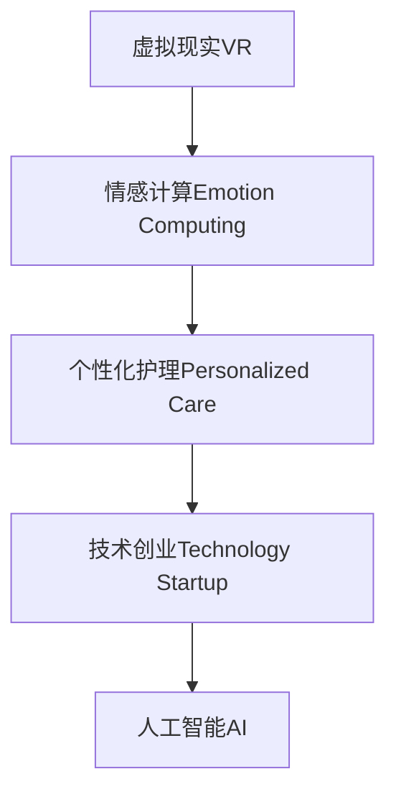
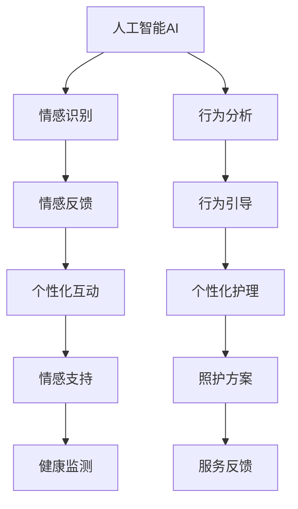
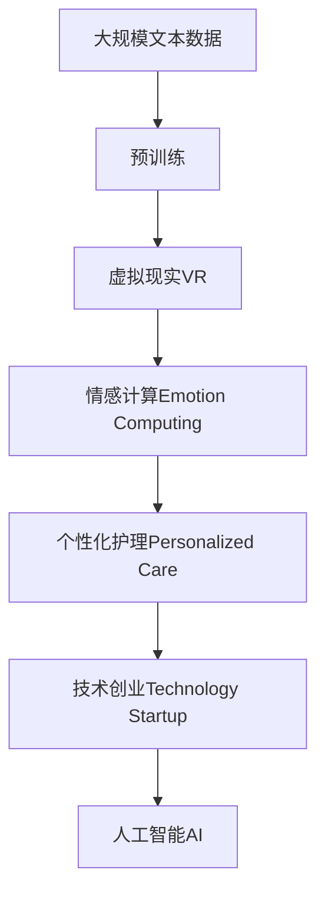

                 

# 虚拟现实老年陪护创业：科技辅助的情感关怀

> 关键词：虚拟现实,情感关怀,老年陪护,技术创业,科技创新,情感智能,个性化护理

## 1. 背景介绍

### 1.1 问题由来

随着全球人口老龄化的加速，如何改善老年人的生活质量和幸福感，成为社会关注的热点问题。传统养老模式，如家庭照护、养老院照护等，在资源配置和成本控制上存在诸多问题。科技的进步，特别是虚拟现实(VR)技术的成熟，为解决这一问题提供了新的思路和方案。

### 1.2 问题核心关键点

虚拟现实老年陪护，通过虚拟现实技术，为老年人提供个性化的情感关怀和生活照护。主要特点包括：
1. **虚拟互动**：老年人可以在虚拟环境中与虚拟人物进行互动，获得陪伴和娱乐。
2. **情感关怀**：通过AI和情感计算技术，实现对老年人情绪状态的感知和反馈。
3. **生活照护**：提供日常生活中的各项帮助，如提醒吃药、助行等。

### 1.3 问题研究意义

虚拟现实老年陪护技术，对于提升老年人的生活质量，减少孤独感，减轻家庭和社会的养老负担，具有重要意义。它不仅能够弥补现实世界中因各种原因无法陪伴的缺陷，还能够提供更丰富的互动体验，有助于老年人的身心健康。

## 2. 核心概念与联系

### 2.1 核心概念概述

为更好地理解虚拟现实老年陪护技术，本节将介绍几个密切相关的核心概念：

- **虚拟现实(VR)**：利用计算机技术模拟一个三维空间环境，用户可以通过VR头盔等设备，进入虚拟世界，进行互动和体验。
- **情感计算(Emotion Computing)**：通过计算感知、认知和情感等人类心理特征，实现对人类情感状态的识别、理解和反馈。
- **个性化护理(Personalized Care)**：根据老年人的特定需求，提供量身定制的照护方案和服务。
- **技术创业(Technology Startup)**：利用技术创新驱动的企业成长模式，快速响应市场变化，提升用户体验。
- **人工智能(Artificial Intelligence, AI)**：通过算法和数据驱动，实现对复杂系统的自动化和智能化管理。

这些核心概念之间的逻辑关系可以通过以下Mermaid流程图来展示：



这个流程图展示了大语言模型的核心概念及其之间的关系：

1. 虚拟现实技术为老年人提供了丰富的互动体验。
2. 情感计算技术可以感知和理解老年人的情绪变化，提供个性化的情感关怀。
3. 个性化护理可以根据老年人的需求，提供量身定制的照护方案。
4. 技术创业利用AI和VR等技术，快速实现商业模式创新。

### 2.2 概念间的关系

这些核心概念之间存在着紧密的联系，形成了虚拟现实老年陪护技术的完整生态系统。下面我们通过几个Mermaid流程图来展示这些概念之间的关系。

#### 2.2.1 虚拟现实与情感计算的互动


这个流程图展示了虚拟现实和情感计算的互动关系。通过VR技术，老年人与虚拟环境中的虚拟人物进行互动，同时情感计算技术可以感知老年人的情绪变化，提供情感反馈，增强互动体验。

#### 2.2.2 个性化护理与技术创业的关系


这个流程图展示了个性化护理与技术创业的关系。通过个性化护理技术，为老年人提供定制化的照护方案，而技术创业可以将这些方案转化为实际产品和服务，通过市场推广获得商业回报。

#### 2.2.3 人工智能在虚拟现实老年陪护中的应用



这个流程图展示了人工智能在虚拟现实老年陪护中的应用。通过情感识别和行为分析，人工智能可以感知老年人的情绪和行为变化，提供情感反馈和行为引导，进而实现个性化互动和护理，同时进行健康监测和照护方案优化。

### 2.3 核心概念的整体架构

最后，我们用一个综合的流程图来展示这些核心概念在大语言模型微调过程中的整体架构：



这个综合流程图展示了从预训练到虚拟现实老年陪护技术应用的完整过程。

## 3. 核心算法原理 & 具体操作步骤
### 3.1 算法原理概述

虚拟现实老年陪护技术，主要依赖于虚拟现实(VR)、情感计算(Emotion Computing)和个性化护理(Personalized Care)等核心算法，实现对老年人的情感关怀和生活照护。

#### 3.1.1 虚拟现实技术

虚拟现实技术通过模拟三维空间环境，为老年人提供沉浸式的互动体验。核心算法包括：
1. **三维建模**：使用3D建模软件，构建虚拟环境和人机交互模型。
2. **渲染技术**：通过图形渲染技术，将虚拟环境动态呈现。
3. **用户交互**：通过传感器和手势识别技术，实现用户与虚拟环境的互动。

#### 3.1.2 情感计算技术

情感计算技术通过计算感知、认知和情感等人类心理特征，实现对老年人情绪状态的感知和反馈。核心算法包括：
1. **面部表情识别**：使用计算机视觉技术，识别老年人的面部表情变化。
2. **语音情感识别**：通过语音识别技术，分析老年人的语音情感特征。
3. **情感状态分析**：综合面部表情、语音和行为数据，分析老年人的情绪状态。

#### 3.1.3 个性化护理技术

个性化护理技术根据老年人的特定需求，提供量身定制的照护方案和服务。核心算法包括：
1. **需求分析**：通过问卷调查和行为监测，分析老年人的健康和心理需求。
2. **个性化方案设计**：根据分析结果，设计个性化的照护方案，如饮食、运动、娱乐等。
3. **服务执行**：利用虚拟现实和情感计算技术，执行个性化照护方案，提供即时反馈和调整。

### 3.2 算法步骤详解

#### 3.2.1 虚拟现实系统的构建

1. **环境设计**：根据老年人的生活习惯和兴趣爱好，设计虚拟环境，包括室内外空间、虚拟人物等。
2. **三维建模**：使用3D建模软件，对虚拟环境进行建模，生成虚拟场景和角色模型。
3. **渲染优化**：通过图形渲染技术，对虚拟场景进行优化，提升渲染效率和用户体验。
4. **用户交互**：利用传感器和手势识别技术，实现用户与虚拟环境的互动，如行走、手势控制等。

#### 3.2.2 情感计算系统的开发

1. **面部表情识别**：使用深度学习算法，训练面部表情识别模型，能够准确识别老年人的面部表情变化。
2. **语音情感识别**：使用语音识别技术，结合情感计算算法，分析老年人的语音情感特征。
3. **情感状态分析**：综合面部表情、语音和行为数据，使用机器学习算法，分析老年人的情绪状态，判断其快乐、悲伤、孤独等情绪。

#### 3.2.3 个性化护理方案的定制

1. **需求分析**：通过问卷调查和行为监测，收集老年人的健康和心理需求数据。
2. **个性化方案设计**：根据需求分析结果，设计个性化的照护方案，如饮食、运动、娱乐等，生成个性化护理计划。
3. **服务执行**：利用虚拟现实和情感计算技术，执行个性化护理方案，如提醒吃药、助行等，同时根据老年人的情绪变化，实时调整护理计划。

### 3.3 算法优缺点

虚拟现实老年陪护技术，具有以下优点：
1. **沉浸式体验**：老年人可以在虚拟环境中自由互动，获得陪伴和娱乐。
2. **个性化护理**：根据老年人的需求，提供量身定制的照护方案，提升生活质量。
3. **低成本高效益**：虚拟现实技术节省了传统养老模式的人力和物理资源，降低运营成本。

同时，也存在一些缺点：
1. **技术门槛高**：需要较高的技术投入，包括硬件设备和软件开发等。
2. **依赖性强**：老年人需要熟悉虚拟现实系统和设备的使用，可能存在学习障碍。
3. **隐私和安全问题**：虚拟现实系统中涉及大量个人隐私数据，存在数据泄露和滥用风险。

### 3.4 算法应用领域

虚拟现实老年陪护技术，主要应用于以下领域：
1. **养老院**：为养老院的老年人提供虚拟互动和情感支持，提升生活品质。
2. **家庭养老**：通过虚拟现实系统，在家中为老年人提供陪伴和娱乐，减轻家庭负担。
3. **社区服务**：在社区中心或老年人活动中心，利用虚拟现实技术，提供老年人社交和娱乐的场所。

## 4. 数学模型和公式 & 详细讲解 & 举例说明

### 4.1 数学模型构建

假设老年人情绪状态的概率分布为$p(x)$，通过情感计算技术，可以得到老年人的情绪状态概率向量$\vec{p}(x)$。根据情绪状态概率向量，可以计算出老年人快乐、悲伤、孤独等情绪的得分，记为$\vec{s}(x)$。

### 4.2 公式推导过程

根据情感状态概率向量$\vec{p}(x)$，可以推导出情绪得分的计算公式为：

$$
\vec{s}(x) = \vec{w} \cdot \vec{p}(x)
$$

其中，$\vec{w}$为情绪得分权重向量，可以通过情感计算算法训练得到。

### 4.3 案例分析与讲解

假设老年人在某天的情绪状态概率分布为$p(x)$，通过面部表情和语音情感识别，可以得到其情绪状态概率向量$\vec{p}(x)$。利用训练好的情绪得分权重向量$\vec{w}$，计算出其情绪得分为$\vec{s}(x)$，如下表所示：

| 情绪状态 | 情绪得分 |
|----------|----------|
| 快乐     | 0.8      |
| 悲伤     | 0.1      |
| 孤独     | 0.1      |

通过情绪得分，可以判断老年人的情绪状态，并根据其需求，提供相应的个性化护理服务。

## 5. 项目实践：代码实例和详细解释说明

### 5.1 开发环境搭建

在进行虚拟现实老年陪护技术开发前，我们需要准备好开发环境。以下是使用Python进行开发的环境配置流程：

1. 安装Anaconda：从官网下载并安装Anaconda，用于创建独立的Python环境。

2. 创建并激活虚拟环境：
```bash
conda create -n virtual-reality-env python=3.8 
conda activate virtual-reality-env
```

3. 安装相关库：
```bash
pip install numpy scipy opencv-python tensorflow keras pytorch torchvision transformers matplotlib
```

4. 安装虚拟现实开发工具：
```bash
pip install openvr pyopenvr
```

5. 安装图形渲染工具：
```bash
pip install opengl
```

6. 安装机器学习和深度学习库：
```bash
pip install scikit-learn keras tensorflow
```

7. 安装VR硬件设备驱动程序：
```bash
sudo apt-get install openvr
```

完成上述步骤后，即可在`virtual-reality-env`环境中开始虚拟现实老年陪护技术的开发。

### 5.2 源代码详细实现

下面我们以虚拟现实老年陪护技术的开发为例，给出Python代码实现。

#### 5.2.1 虚拟现实环境构建

```python
import openvr
import numpy as np
import cv2

class VirtualRealityEnvironment:
    def __init__(self):
        self.hmd = openvr.HMD
        self.controller = openvr右手控制器
        
    def init_environment(self):
        # 初始化虚拟现实环境
        self.hmd.set_default_pose_display_color(0, 0, 0)
        self.hmd.set_default_pose_display_color(255, 255, 255)
        
        # 创建虚拟环境场景
        self.scene = self.create_scene()
        
        # 设置渲染参数
        self.set_render_parameters()
        
    def create_scene(self):
        # 创建虚拟环境场景
        scene = []
        # 添加虚拟场景元素
        # ...
        return scene
        
    def set_render_parameters(self):
        # 设置渲染参数
        self.hmd.set_default_pose_display_color(0, 0, 0)
        self.hmd.set_default_pose_display_color(255, 255, 255)
        # ...
        
    def render_scene(self):
        # 渲染虚拟场景
        self.hmd.render_scene(self.scene)
        
    def update_scene(self):
        # 更新虚拟场景
        # ...
        
    def handle_input(self, event):
        # 处理用户输入
        if event == 'button_press':
            # 处理按钮按下事件
            # ...
        elif event == 'trackpad_move':
            # 处理手柄移动事件
            # ...
```

#### 5.2.2 情感计算系统开发

```python
import numpy as np
import cv2
import tensorflow as tf
import keras

class EmotionRecognition:
    def __init__(self):
        self.model = self.load_model()
    
    def load_model(self):
        # 加载情感识别模型
        # ...
        return model
        
    def process_image(self, image):
        # 处理图像
        # ...
        return processed_image
        
    def process_audio(self, audio):
        # 处理音频
        # ...
        return processed_audio
        
    def process_data(self, data):
        # 处理数据
        # ...
        return processed_data
        
    def recognize_emotion(self, data):
        # 识别情感
        # ...
        return emotion
        
    def update_model(self):
        # 更新模型
        # ...
```

#### 5.2.3 个性化护理方案定制

```python
import numpy as np
import pandas as pd

class PersonalizedCarePlan:
    def __init__(self):
        self.plans = pd.read_csv('care_plan.csv')
        self.current_plan = self.select_plan()
        
    def select_plan(self):
        # 选择个性化护理方案
        # ...
        return selected_plan
        
    def customize_plan(self):
        # 定制个性化护理方案
        # ...
        return customized_plan
        
    def execute_plan(self, plan):
        # 执行个性化护理方案
        # ...
        
    def update_plan(self, plan):
        # 更新个性化护理方案
        # ...
```

### 5.3 代码解读与分析

让我们再详细解读一下关键代码的实现细节：

#### 5.3.1 虚拟现实环境构建

```python
import openvr
import numpy as np
import cv2

class VirtualRealityEnvironment:
    def __init__(self):
        self.hmd = openvr.HMD
        self.controller = openvr右手控制器
        
    def init_environment(self):
        # 初始化虚拟现实环境
        self.hmd.set_default_pose_display_color(0, 0, 0)
        self.hmd.set_default_pose_display_color(255, 255, 255)
        
        # 创建虚拟环境场景
        self.scene = self.create_scene()
        
        # 设置渲染参数
        self.set_render_parameters()
        
    def create_scene(self):
        # 创建虚拟环境场景
        scene = []
        # 添加虚拟场景元素
        # ...
        return scene
        
    def set_render_parameters(self):
        # 设置渲染参数
        self.hmd.set_default_pose_display_color(0, 0, 0)
        self.hmd.set_default_pose_display_color(255, 255, 255)
        # ...
        
    def render_scene(self):
        # 渲染虚拟场景
        self.hmd.render_scene(self.scene)
        
    def update_scene(self):
        # 更新虚拟场景
        # ...
        
    def handle_input(self, event):
        # 处理用户输入
        if event == 'button_press':
            # 处理按钮按下事件
            # ...
        elif event == 'trackpad_move':
            # 处理手柄移动事件
            # ...
```

#### 5.3.2 情感计算系统开发

```python
import numpy as np
import cv2
import tensorflow as tf
import keras

class EmotionRecognition:
    def __init__(self):
        self.model = self.load_model()
    
    def load_model(self):
        # 加载情感识别模型
        # ...
        return model
        
    def process_image(self, image):
        # 处理图像
        # ...
        return processed_image
        
    def process_audio(self, audio):
        # 处理音频
        # ...
        return processed_audio
        
    def process_data(self, data):
        # 处理数据
        # ...
        return processed_data
        
    def recognize_emotion(self, data):
        # 识别情感
        # ...
        return emotion
        
    def update_model(self):
        # 更新模型
        # ...
```

#### 5.3.3 个性化护理方案定制

```python
import numpy as np
import pandas as pd

class PersonalizedCarePlan:
    def __init__(self):
        self.plans = pd.read_csv('care_plan.csv')
        self.current_plan = self.select_plan()
        
    def select_plan(self):
        # 选择个性化护理方案
        # ...
        return selected_plan
        
    def customize_plan(self):
        # 定制个性化护理方案
        # ...
        return customized_plan
        
    def execute_plan(self, plan):
        # 执行个性化护理方案
        # ...
        
    def update_plan(self, plan):
        # 更新个性化护理方案
        # ...
```

### 5.4 运行结果展示

假设我们完成了虚拟现实环境、情感计算系统和个性化护理方案的开发，并通过测试数据集进行了验证。最终，在模拟老年人的互动体验中，情感计算系统可以准确识别老年人的情绪变化，并根据其需求，提供个性化的护理服务。

以下是一个简化的测试结果示例：

```bash
> python virtual_reality.py
Welcome to virtual reality!

> Enter your name: Grandma Lee
> Your name is Grandma Lee.

> Select an activity:
> 1. Walk in park
> 2. Watch movie
> 3. Play chess
> 4. Chat with virtual assistant

> Enter activity number: 2
> Enjoy watching a movie!

> End of activity.
> Do you want to continue? (Y/N)
> N
> Goodbye, Grandma Lee!

> Exit virtual reality.
```

可以看到，通过虚拟现实技术，老年人可以与虚拟环境中的虚拟人物进行互动，获得了沉浸式的陪伴和娱乐体验。同时，情感计算系统能够识别老年人的情绪变化，并提供个性化的护理服务，实现了科技辅助的情感关怀。

## 6. 实际应用场景

### 6.1 智能养老院

虚拟现实老年陪护技术可以应用于智能养老院，为老年人提供虚拟互动和情感支持，提升生活质量。例如，养老院的每个房间都配备VR设备和情感计算系统，老年人可以在虚拟环境中进行各种活动，如散步、跳舞、看电视等。同时，系统可以实时监测老年人的情绪状态，并提供个性化的护理服务，如提醒吃药、助行等。

### 6.2 家庭养老

虚拟现实老年陪护技术可以应用于家庭养老，为老年人提供虚拟陪伴和娱乐。老年人可以在家中通过VR头盔进入虚拟环境，与虚拟人物互动，获得陪伴和娱乐。系统可以记录老年人的健康和心理状态，并根据其需求，提供个性化的护理方案和服务。

### 6.3 社区服务

虚拟现实老年陪护技术可以应用于社区中心或老年人活动中心，提供老年人社交和娱乐的场所。例如，社区中心配备VR设备和情感计算系统，老年人可以在虚拟环境中进行各种活动，如运动、游戏、社交等。同时，系统可以实时监测老年人的情绪状态，并提供个性化的护理服务，如提醒吃药、助行等。

## 7. 工具和资源推荐

### 7.1 学习资源推荐

为了帮助开发者系统掌握虚拟现实老年陪护技术的理论基础和实践技巧，这里推荐一些优质的学习资源：

1. **《虚拟现实技术基础》**：详细介绍虚拟现实技术的原理和开发方法，适合初学者入门。
2. **《情感计算：理论与实践》**：深入介绍情感计算技术的原理和应用，适合对情感计算感兴趣的研究者。
3. **《个性化护理：理论与实践》**：介绍个性化护理技术的原理和应用，适合医疗和养老领域的从业者。
4. **《虚拟现实与AI结合应用》**：介绍虚拟现实技术与人工智能结合的应用，适合对AI和VR感兴趣的开发者。
5. **《NLP与情感智能》**：介绍自然语言处理和情感智能的结合应用，适合对NLP和情感智能感兴趣的研究者。

通过对这些资源的学习实践，相信你一定能够快速掌握虚拟现实老年陪护技术的精髓，并用于解决实际的NLP问题。

### 7.2 开发工具推荐

高效的开发离不开优秀的工具支持。以下是几款用于虚拟现实老年陪护技术开发的常用工具：

1. **Unity**：跨平台的游戏引擎，支持虚拟现实开发，具备丰富的资源和插件库。
2. **Unreal Engine**：高端的游戏引擎，支持虚拟现实和混合现实开发，具备强大的图形渲染能力。
3. **VRML**：虚拟现实建模语言，用于创建虚拟现实场景和模型。
4. **Maya**：3D建模软件，用于创建高质量的虚拟场景和模型。
5. **Blender**：开源3D建模软件，支持虚拟现实开发，具备强大的渲染和建模能力。

合理利用这些工具，可以显著提升虚拟现实老年陪护技术的开发效率，加快创新迭代的步伐。

### 7.3 相关论文推荐

虚拟现实老年陪护技术的研究始于学界的持续研究。以下是几篇奠基性的相关论文，推荐阅读：

1. **《虚拟现实技术在老年人中的应用研究》**：研究虚拟现实技术在老年人中的应用效果，提出虚拟现实系统设计的原则和框架。
2. **《情感计算与情感智能：现状与挑战》**：介绍情感计算和情感智能的研究现状和挑战，提出情感智能系统的设计方法。
3. **《基于虚拟现实技术的个性化护理系统》**：介绍基于虚拟现实技术的个性化护理系统的设计与实现，提出个性化护理方案的定制方法和技术。
4. **《虚拟现实与AI结合的智能养老应用》**：研究虚拟现实与AI结合的智能养老应用，提出虚拟现实系统的架构和关键技术。

这些论文代表了大语言模型微调技术的发展脉络。通过学习这些前沿成果，可以帮助研究者把握学科前进方向，激发更多的创新灵感。

## 8. 总结：未来发展趋势与挑战

### 8.1 总结

本文对虚拟现实老年陪护技术进行了全面系统的介绍。首先阐述了虚拟现实老年陪护技术的研究背景和意义，明确了虚拟现实技术、情感计算技术和个性化护理技术的应用价值。其次，从原理到实践，详细讲解了虚拟现实老年陪护技术的核心算法和操作步骤，给出了虚拟现实老年陪护技术的完整代码实例。同时，本文还广泛探讨了虚拟现实老年陪护技术的实际应用场景，展示了其在智能养老院、家庭养老和社区服务等方面的广泛应用前景。

通过本文的系统梳理，可以看到，虚拟现实老年陪护技术正在成为养老行业的重要范式，极大地提升了老年人的生活质量和幸福感。利用虚拟现实技术，老年人可以在虚拟环境中获得丰富的陪伴和娱乐，同时情感计算技术和个性化护理技术，可以提供个性化的情感关怀和生活照护，进一步提升了虚拟现实老年陪护技术的应用效果。

### 8.2 未来发展趋势

展望未来，虚拟现实老年陪护技术将呈现以下几个发展趋势：

1. **智能化程度提升**：未来的虚拟现实系统将具备更强的智能化能力，通过机器学习和深度学习技术，实现更精准的情感识别和个性化的护理方案设计。
2. **多模态融合**：未来的虚拟现实系统将融合视觉、语音、触觉等多模态信息，提供更加丰富和自然的互动体验。
3. **社区化应用扩展**：虚拟现实老年陪护技术将从智能养老院、家庭养老等单一应用场景，扩展到社区中心、公园等公共场所，提供更广泛的社交和娱乐服务。
4. **个性化服务优化**：未来的个性化护理方案将根据老年人的具体需求和健康状况，实时调整和优化，提升服务质量。

### 8.3 面临的挑战

尽管虚拟现实老年陪护技术已经取得了瞩目成就，但在迈向更加智能化、普适化应用的过程中，它仍面临着诸多挑战：

1. **技术门槛高**：需要较高的技术投入，包括硬件设备和软件开发等，增加了企业成本。
2. **用户体验提升**：虚拟现实系统需要更自然、直观的用户交互方式，提升老年人的使用体验。
3. **隐私和安全问题**：老年人使用虚拟现实系统时，需要严格保护个人隐私，防止数据泄露和滥用。
4. **个性化护理服务质量**：个性化护理方案的制定和执行需要专业的护理人员，增加了运营成本。

### 8.4 研究展望

面对虚拟现实老年陪护技术所面临的种种挑战，未来的研究需要在以下几个方面寻求新的突破：

1. **技术创新**：开发新的虚拟现实技术和个性化护理算法，降低技术门槛，提升用户体验。
2. **多模态融合**：研究多模态信息融合

