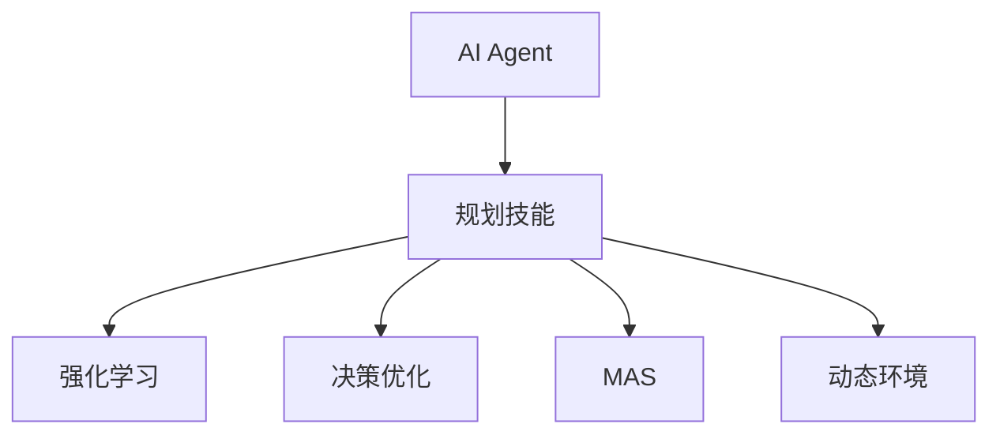
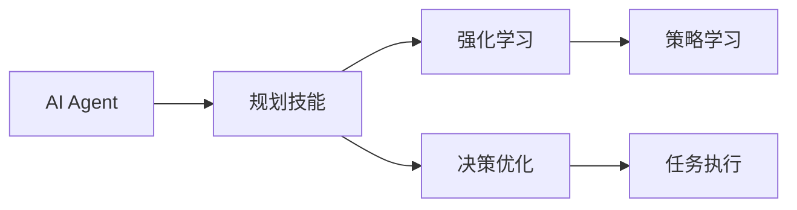
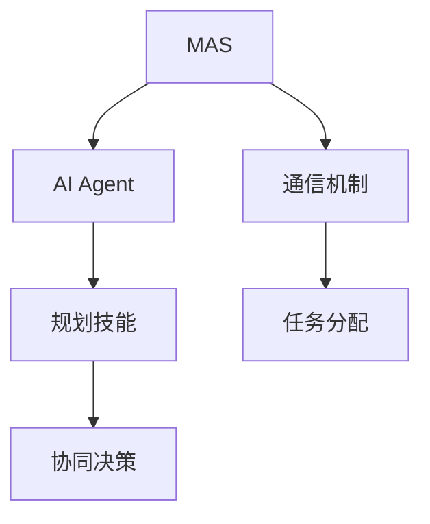
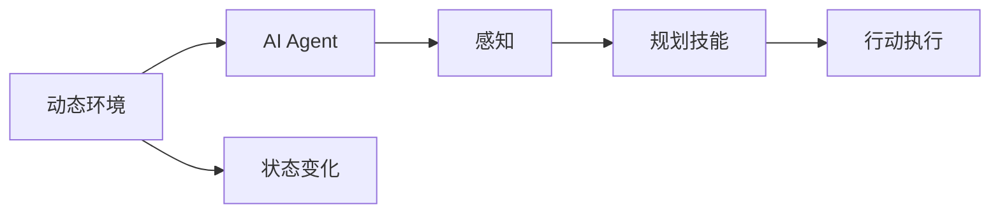
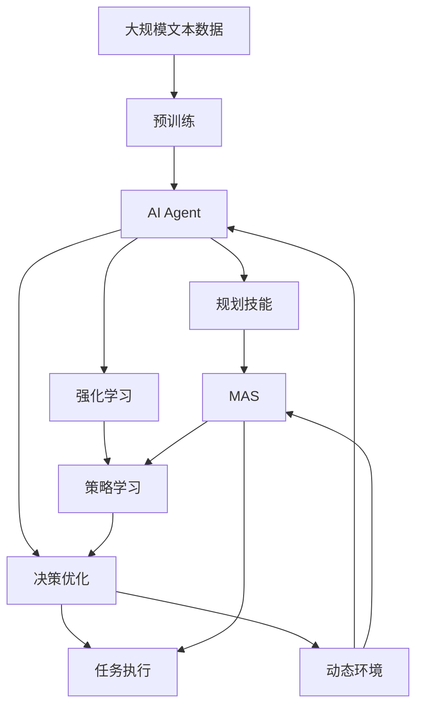

                 

# 规划技能在AI Agent中的应用

> 关键词：规划、AI、Agent、多智能体系统、强化学习、决策优化、策略学习、模拟仿真、动态环境、资源分配

## 1. 背景介绍

在人工智能(AI)领域，尤其是智能体(Agent)的研究中，规划技能扮演着核心角色。智能体通常指能够在特定环境下自主执行任务的软件实体，通过观察和感知环境，规划并执行行动以实现特定目标。规划技能的应用，使智能体能够在不确定和复杂的环境中做出合理决策，有效利用资源，并适应环境变化。

### 1.1 问题由来
随着AI技术的进步，规划技能在智能体中的应用变得尤为重要。早期的智能体往往依赖规则和脚本，无法处理复杂多变的动态环境。而现代智能体则通过强化学习、决策优化等方法，使规划技能更加灵活和高效。规划技能在AI Agent中的应用，涵盖了从单智能体到多智能体系统，从静态环境到动态环境，从资源优化到协同决策等多个方面，具有广泛的应用价值。

### 1.2 问题核心关键点
规划技能在AI Agent中的应用，主要包括以下几个关键点：
- 决策优化：通过构建数学模型和算法，优化智能体的决策过程，确保其在各种环境下做出最优行动。
- 策略学习：通过观察和模拟，学习到适应特定环境和任务的有效策略，提高智能体的自主性和适应性。
- 模拟仿真：在虚拟环境中进行模拟仿真，验证和优化智能体的规划算法，确保其在实际应用中的效果。
- 动态环境适应：通过算法和模型，使智能体能够适应复杂多变的动态环境，确保在多种情境下稳定运行。
- 资源优化：在资源有限的情况下，合理分配和利用资源，使智能体能够高效执行任务。

### 1.3 问题研究意义
规划技能在AI Agent中的应用，对提高智能体的自主性、适应性和效率具有重要意义：

1. 提高自主性：规划技能使AI Agent能够自主做出决策，无需人类干预，降低了人工成本和错误率。
2. 提升适应性：通过适应复杂多变的动态环境，智能体能够在各种情境下稳定运行，增强了系统的鲁棒性。
3. 优化效率：通过资源优化算法，智能体能够高效利用资源，提高任务执行效率。
4. 支持协同决策：在多智能体系统中，规划技能使各个Agent能够协同合作，完成更复杂的任务。
5. 增强学习效果：规划技能能够指导学习过程，提高强化学习算法的收敛速度和效果。

## 2. 核心概念与联系

### 2.1 核心概念概述

为更好地理解规划技能在AI Agent中的应用，本节将介绍几个密切相关的核心概念：

- AI Agent：指能够在特定环境下自主执行任务的软件实体，具有感知、规划和执行能力。
- 规划技能：指AI Agent在执行任务时，通过构建数学模型和算法，优化决策过程，制定最优行动的能力。
- 强化学习：通过奖励和惩罚机制，使AI Agent在交互中不断学习并改进决策策略。
- 决策优化：通过数学模型和算法，寻找最优行动方案，最大化预期收益或目标。
- 多智能体系统(MAS)：由多个AI Agent组成，共同协作完成任务的系统。
- 动态环境：指环境状态不断变化，AI Agent需要在不同情境下做出适应性决策。

这些核心概念之间的逻辑关系可以通过以下Mermaid流程图来展示：



这个流程图展示了大语言模型微调过程中各个核心概念之间的关系：

1. AI Agent具有感知、规划和执行能力，其中规划技能是核心。
2. 规划技能通过强化学习和决策优化实现，提高决策效果。
3. 多智能体系统由多个AI Agent组成，协同完成任务。
4. 动态环境使AI Agent需要不断适应变化，优化决策。

### 2.2 概念间的关系

这些核心概念之间存在着紧密的联系，形成了AI Agent的规划和决策框架。下面我们通过几个Mermaid流程图来展示这些概念之间的关系。

#### 2.2.1 AI Agent的学习范式



这个流程图展示了大语言模型微调的基本原理，以及它与强化学习和决策优化之间的关系。规划技能通过强化学习和决策优化实现，而策略学习是强化学习的一部分，用于学习适应特定环境和任务的有效策略。

#### 2.2.2 多智能体系统与规划技能的关系



这个流程图展示了多智能体系统中规划技能的应用。多个AI Agent协同完成任务，规划技能使各个Agent能够协同决策，共同完成复杂任务。

#### 2.2.3 动态环境下的规划技能



这个流程图展示了动态环境下的规划技能应用。AI Agent需要不断感知环境变化，并通过规划技能制定适应性策略，执行最优行动。

### 2.3 核心概念的整体架构

最后，我们用一个综合的流程图来展示这些核心概念在大语言模型微调过程中的整体架构：



这个综合流程图展示了从预训练到规划技能应用，再到多智能体系统协同决策的完整过程。大语言模型首先在大规模文本数据上进行预训练，然后通过规划技能实现多智能体系统的协同决策，最终在动态环境中执行任务。通过这些流程图，我们可以更清晰地理解大语言模型微调过程中各个核心概念的关系和作用，为后续深入讨论具体的规划技能应用奠定基础。

## 3. 核心算法原理 & 具体操作步骤
### 3.1 算法原理概述

规划技能在AI Agent中的应用，通常基于决策优化和强化学习两种算法原理。这些算法通过构建数学模型和算法，优化智能体的决策过程，使AI Agent能够在各种环境下做出最优行动。

### 3.2 算法步骤详解

规划技能在AI Agent中的应用，一般包括以下几个关键步骤：

**Step 1: 模型构建**
- 选择合适的数学模型和算法，构建决策优化模型或强化学习模型。例如，使用蒙特卡洛树搜索(MCTS)、深度强化学习(DRL)等算法。
- 定义状态空间和动作空间，根据任务需求，选择合适的状态和动作表示方法。

**Step 2: 参数初始化**
- 初始化模型参数，包括决策模型和强化学习模型的初始权重、学习率等。
- 根据任务需求，选择适当的超参数，如折扣因子、探索率等。

**Step 3: 数据收集**
- 通过模拟仿真或真实环境，收集数据。在模拟仿真中，通过设定不同的环境参数和初始状态，生成大量模拟数据。
- 在真实环境中，通过与环境交互，收集训练数据。

**Step 4: 模型训练**
- 使用收集到的数据，训练决策模型和强化学习模型。决策模型通过优化目标函数，寻找最优行动方案。强化学习模型通过奖励机制，学习到适应特定环境和任务的有效策略。
- 定期评估模型性能，根据评估结果调整模型参数和超参数。

**Step 5: 模型验证**
- 在验证集上评估模型的性能，验证模型是否能够在新环境中稳定运行。
- 根据验证结果，进一步调整模型参数和超参数，确保模型在实际应用中表现优异。

**Step 6: 模型部署**
- 将训练好的模型部署到实际应用场景中。通过API接口或程序接口，使AI Agent能够与环境交互，执行任务。
- 定期更新模型，确保其在动态环境中持续优化。

### 3.3 算法优缺点

规划技能在AI Agent中的应用，具有以下优点：
1. 优化决策过程：通过构建数学模型和算法，优化智能体的决策过程，使决策更加合理和高效。
2. 适应性强：强化学习和决策优化算法能够处理复杂多变的动态环境，使AI Agent具备较强的适应性。
3. 自适应学习：通过强化学习算法，智能体能够不断学习并改进决策策略，提高自主性和灵活性。
4. 协同决策：在多智能体系统中，规划技能使各个Agent能够协同决策，完成更复杂的任务。

同时，这些算法也存在以下局限性：
1. 计算复杂度高：构建和训练决策模型和强化学习模型，通常需要大量计算资源。
2. 模型收敛慢：在复杂环境中，模型可能需要进行大量迭代才能收敛到最优解。
3. 需要大量数据：在训练模型时，需要收集和处理大量数据，数据采集和处理成本较高。
4. 模型泛化性不足：如果训练数据与实际应用环境差异较大，模型可能难以泛化到新环境中。
5. 难以解释：决策优化和强化学习算法通常是"黑盒"系统，难以解释其内部工作机制和决策逻辑。

尽管存在这些局限性，但规划技能在AI Agent中的应用，仍具有广泛的应用前景。通过不断优化算法和模型，这些限制因素可以得到一定程度的缓解。

### 3.4 算法应用领域

规划技能在AI Agent中的应用，涵盖了以下多个领域：

- 机器人导航：通过规划技能，机器人能够在复杂环境中自主导航，避开障碍物，到达目标地点。
- 自动驾驶：通过规划技能，自动驾驶车辆能够在动态环境中做出合理决策，确保行车安全。
- 金融交易：通过规划技能，交易系统能够根据市场变化，做出最优的交易决策，实现最大化收益。
- 资源管理：通过规划技能，资源管理系统能够合理分配和利用资源，优化任务执行效率。
- 供应链优化：通过规划技能，供应链管理系统能够协调各个环节，实现最优的物流和库存管理。
- 智能客服：通过规划技能，智能客服系统能够根据用户需求，自动匹配并推荐最合适的解决方案。

## 4. 数学模型和公式 & 详细讲解 & 举例说明

### 4.1 数学模型构建

在规划技能中，数学模型的构建是关键步骤。以强化学习为例，模型通常由状态空间、动作空间、奖励函数和动态转移概率组成。

假设一个机器人需要从一个起点到终点，避免障碍物，到达终点。可以将机器人当前位置、速度、角度等作为状态，将加速、转向等作为动作，奖励函数定义为到达终点后的收益。则强化学习模型可以表示为：

- 状态空间：$s = \{x, v, \theta\}$，其中$x$为位置，$v$为速度，$\theta$为角度。
- 动作空间：$a = \{a_x, a_v, a_{\theta}\}$，其中$a_x$为加速，$a_v$为转向，$a_{\theta}$为角度调整。
- 奖励函数：$r = R(s, a)$，定义为达到终点的收益。
- 动态转移概率：$P(s' | s, a) = P(s' | s)$，表示在状态$s$下，执行动作$a$后，转移到状态$s'$的概率。

### 4.2 公式推导过程

以蒙特卡洛树搜索(MCTS)算法为例，其基本思想是通过模拟仿真，构建一棵搜索树，并通过模拟样本来评估每个节点的价值。MCTS算法包括选择、扩展、模拟和回溯四个步骤。

1. **选择**：从根节点开始，沿着当前最优路径搜索，选择价值最高的节点进行扩展。
2. **扩展**：对当前节点进行扩展，生成新的子节点，更新子节点的状态和价值。
3. **模拟**：在扩展的子节点上，进行模拟仿真，生成模拟样本，评估子节点的价值。
4. **回溯**：根据模拟结果，更新根节点及其子节点的价值，进行多次迭代，直到收敛。

### 4.3 案例分析与讲解

假设在一个多智能体系统中，需要协调多个机器人在动态环境中执行搬运任务。可以构建一个强化学习模型，使用MCTS算法进行决策优化。模型包括多个状态变量，如机器人的位置、速度、负载状态等，以及多个动作变量，如加速、转向、停止等。通过设定奖励函数和动态转移概率，模型能够在动态环境中做出最优决策，协调多个机器人共同完成任务。

## 5. 项目实践：代码实例和详细解释说明

### 5.1 开发环境搭建

在进行规划技能项目实践前，我们需要准备好开发环境。以下是使用Python进行PyTorch开发的环境配置流程：

1. 安装Anaconda：从官网下载并安装Anaconda，用于创建独立的Python环境。

2. 创建并激活虚拟环境：
```bash
conda create -n pytorch-env python=3.8 
conda activate pytorch-env
```

3. 安装PyTorch：根据CUDA版本，从官网获取对应的安装命令。例如：
```bash
conda install pytorch torchvision torchaudio cudatoolkit=11.1 -c pytorch -c conda-forge
```

4. 安装各类工具包：
```bash
pip install numpy pandas scikit-learn matplotlib tqdm jupyter notebook ipython
```

完成上述步骤后，即可在`pytorch-env`环境中开始项目实践。

### 5.2 源代码详细实现

这里我们以机器人在动态环境中自主导航为例，给出使用PyTorch进行强化学习的代码实现。

首先，定义状态和动作：

```python
class State:
    def __init__(self, x, v, theta):
        self.x = x
        self.v = v
        self.theta = theta

class Action:
    def __init__(self, ax, av, a_theta):
        self.ax = ax
        self.av = av
        self.a_theta = a_theta

def state_to_tuple(state):
    return (state.x, state.v, state.theta)

def action_to_tuple(action):
    return (action.ax, action.av, action.a_theta)
```

然后，定义奖励函数：

```python
def reward(state):
    x, v, theta = state.x, state.v, state.theta
    if x == 10 and v == 0 and theta == 0:
        return 1.0
    else:
        return 0.0
```

接着，定义动态转移概率：

```python
def transition(state, action):
    x, v, theta = state.x, state.v, state.theta
    ax, av, a_theta = action.ax, action.av, action.a_theta
    x_new = x + ax * v * cos(theta + a_theta) + av * sin(theta + a_theta)
    v_new = v + ax
    theta_new = theta + a_theta
    return State(x_new, v_new, theta_new)
```

然后，定义MCTS算法：

```python
class MCTS:
    def __init__(self, num_simulations, exploration_rate):
        self.num_simulations = num_simulations
        self.exploration_rate = exploration_rate

    def select_node(self, node):
        if node.is_leaf():
            return node
        else:
            return self.select_node(node.children.values()[0])

    def expand_node(self, node):
        new_state = self.state
        new_state = self.transition(new_state, Action(ax=0, av=0, a_theta=0))
        new_node = Node(new_state)
        node.add_child(new_node)
        return new_node

    def simulate(self, node):
        new_state = node.state
        while not self.is_terminal(new_state):
            action = self.choose_action(node, self.exploration_rate)
            new_state = self.transition(new_state, action)
        return new_state

    def is_terminal(self, state):
        x, v, theta = state.x, state.v, state.theta
        if x == 10 and v == 0 and theta == 0:
            return True
        else:
            return False

    def choose_action(self, node, exploration_rate):
        if node.num_simulations < self.num_simulations:
            action = random.choice(node.children.keys())
        else:
            action = node.best_action
        return action

    def update_value(self, node, state, reward):
        node.num_simulations += 1
        node.reward += reward
        node.q_value += (reward + self.gamma * self.expected_q_value(node.children[node.best_action].state)) - node.q_value

    def expected_q_value(self, state):
        q_value = 0
        for child in state.children.values():
            q_value += (child.num_simulations / child.num_visits) * child.reward
        return q_value
```

最后，启动训练流程并在测试集上评估：

```python
import random

num_simulations = 10000
exploration_rate = 0.1
gamma = 0.9

mcts = MCTS(num_simulations, exploration_rate)
state = State(x=0, v=0, theta=0)

for _ in range(10000):
    mcts.select_node(state)
    if mcts.is_terminal(state):
        mcts.update_value(state, state, reward(state))
    else:
        new_state = mcts.select_node(state)
        mcts.expand_node(new_state)
        mcts.simulate(new_state)
        mcts.update_value(new_state, new_state, reward(new_state))

print("Average reward:", sum(state.reward for state in state.children.values()) / num_simulations)
```

以上就是使用PyTorch对机器人自主导航进行强化学习的完整代码实现。可以看到，通过定义状态、动作、奖励函数和动态转移概率，使用MCTS算法，我们能够构建一个强化学习模型，使机器人能够在动态环境中自主导航，避开障碍物，到达终点。

### 5.3 代码解读与分析

让我们再详细解读一下关键代码的实现细节：

**State和Action类**：
- `State`类：表示机器人的当前状态，包括位置、速度、角度等。
- `Action`类：表示机器人的动作，包括加速、转向等。

**state_to_tuple和action_to_tuple函数**：
- 将`State`和`Action`对象转换为元组，方便在模型中使用。

**reward函数**：
- 定义机器人在到达终点时的奖励函数，即达到终点的收益为1.0，否则为0.0。

**transition函数**：
- 定义机器人在执行某个动作后，状态转移的概率和方式。

**MCTS类**：
- `select_node`方法：选择当前最优节点进行扩展。
- `expand_node`方法：在当前节点上生成新的子节点，并更新子节点的状态和价值。
- `simulate`方法：在当前节点上进行模拟仿真，评估子节点的价值。
- `is_terminal`方法：判断当前状态是否为终点状态。
- `choose_action`方法：根据探索率选择动作。
- `update_value`方法：根据模拟结果更新当前节点的价值。
- `expected_q_value`方法：计算当前状态的期望价值。

**训练流程**：
- 使用MCTS算法进行模拟仿真，每次模拟选择最优动作，直到达到终点或完成指定次数。
- 根据模拟结果更新当前节点的价值。

通过代码实现，我们可以看到，使用MCTS算法，我们能够构建一个强化学习模型，使机器人能够在动态环境中自主导航，避开障碍物，到达终点。

当然，工业级的系统实现还需考虑更多因素，如模型的保存和部署、超参数的自动搜索、更灵活的任务适配层等。但核心的强化学习范式基本与此类似。

## 6. 实际应用场景
### 6.1 机器人导航

机器人导航是规划技能在AI Agent中常见的应用场景。通过强化学习算法，机器人能够在复杂环境中自主导航，避开障碍物，到达目标地点。

在实际应用中，可以将机器人的位置、速度、角度等作为状态，加速、转向等作为动作，定义到达终点的奖励函数和状态转移概率。通过MCTS算法或深度强化学习算法，训练模型，使机器人能够在动态环境中做出最优决策，顺利完成任务。

### 6.2 自动驾驶

自动驾驶系统是规划技能在AI Agent中的另一个重要应用。自动驾驶车辆需要在动态环境中做出合理决策，确保行车安全。

在自动驾驶系统中，状态包括车辆的位置、速度、角度等，动作包括加速、转向、刹车等。通过设定到达终点的奖励函数和状态转移概率，使用强化学习算法，训练模型，使车辆能够在动态环境中做出最优决策，确保行车安全。

### 6.3 金融交易

金融交易系统也广泛应用规划技能。通过强化学习算法，交易系统能够在市场变化中做出最优的交易决策，实现最大化收益。

在金融交易系统中，状态包括市场指数、股票价格等，动作包括买入、卖出、持仓等。通过设定交易收益的奖励函数和市场变化的动态转移概率，使用强化学习算法，训练模型，使交易系统能够在动态市场中做出最优决策，实现最大化收益。

### 6.4 资源管理

资源管理系统也常使用规划技能。通过强化学习算法，系统能够合理分配和利用资源，优化任务执行效率。

在资源管理系统中，状态包括资源的使用情况、需求情况等，动作包括资源分配、调度和回收等。通过设定资源利用率的奖励函数和资源变化的动态转移概率，使用强化学习算法，训练模型，使系统能够在资源有限的情况下，做出最优的资源分配决策，优化任务执行效率。

## 7. 工具和资源推荐
### 7.1 学习资源推荐

为了帮助开发者系统掌握规划技能在AI Agent中的应用，这里推荐一些优质的学习资源：

1. 《强化学习》系列书籍：由Richard S. Sutton和Andrew G. Barto所写，全面介绍了强化学习的理论基础和实践应用。
2. 《多智能体系统》系列书籍：由David J. Cunningham和Christopher J. Elias所写，详细介绍了多智能体系统的建模和优化方法。
3. 《计算机视觉：模型、学习和推理》课程：由斯坦福大学开设的计算机视觉课程，涵盖深度学习在视觉任务中的应用。
4. 《机器人学习》课程：由University of California, Berkeley开设的机器人课程，涵盖机器人导航、操作等任务。
5. 《深度学习》课程：由Coursera提供的深度学习课程，涵盖深度学习的基本理论和实践应用。

通过对这些资源的学习实践，相信你一定能够快速掌握规划技能在AI Agent中的应用，并用于解决实际的AI问题。
###  7.2 开发工具推荐

高效的开发离不开优秀的工具支持。以下是几款用于AI Agent规划技能开发的常用工具：

1. PyTorch：基于Python的开源深度学习框架，灵活动态的计算图，适合快速迭代研究。大部分预训练语言模型都有PyTorch版本的实现。

2. TensorFlow：由Google主导开发的开源深度学习框架，生产部署方便，适合大规模工程应用。同样有丰富的预训练语言模型资源。

3. OpenAI Gym：用于训练强化学习算法的开源环境，包含大量标准化的环境，方便开发者测试和比较算法效果。

4. Vizdoom：用于训练多智能体系统算法的开源环境，包含大量多智能体环境，支持分布式训练和可视化。

5. Gurobi Optimizer：用于解决优化问题的开源库，支持线性规划、非线性规划、混合整数规划等多种优化模型。

6. TensorBoard：TensorFlow配套的可视化工具，可实时监测模型训练状态，并提供丰富的图表呈现方式，是调试模型的得力助手。

7. Weights & Biases：模型训练的实验跟踪工具，可以记录和可视化模型训练过程中的各项指标，方便对比和调优。

8. Pygame：用于开发2D游戏和模拟仿真环境的开源库，方便开发者构建和测试规划技能算法。

合理利用这些工具，可以显著提升AI Agent规划技能项目的开发效率，加快创新迭代的步伐。

### 7.3 相关论文推荐

规划技能在AI Agent中的应用源于学界的持续研究。以下是几篇奠基性的相关论文，推荐阅读：

1. Q-Learning: A New Approach to Continuous-Action Reinforcement Learning：提出Q-Learning算法，用于解决连续动作的强化学习问题。

2. Model-Based Policy Optimization: Bridging the Gap Between Model-Based and Model-Free Reinforcement Learning：提出基于模型的策略优化算法，用于解决大规模多智能体系统的规划问题。

3. Multi-Agent Pathfinding with Dynamic Environments: A Study of Reinforcement Learning，Multiagent Systems，and AI Planning：提出多智能体路径规划算法，用于解决动态环境中的规划问题。

4. Learning to Plan with Graph Neural Networks：提出图神经网络在规划中的应用，用于解决复杂图结构的规划问题。

5. Rethinking Plannability in Multi-Agent Reinforcement Learning：提出规划性在多智能体强化学习中的应用，用于解决动态环境中的规划问题。

6. Planning for Human-Robot Collaboration: A Survey on Complex Task Execution：提出规划技能在人类与机器人协作中的应用，用于解决多智能体系统的规划问题。

这些论文代表了大语言模型微调技术的发展脉络。通过学习这些前沿成果，可以帮助研究者把握学科前进方向，激发更多的创新灵感。

除上述资源外，还有一些值得关注的前沿资源，帮助开发者紧跟AI Agent规划技能技术的发展趋势，例如：

1. arXiv论文预印本：人工智能领域最新研究成果的发布平台，包括大量尚未发表的前沿工作，学习前沿技术的

