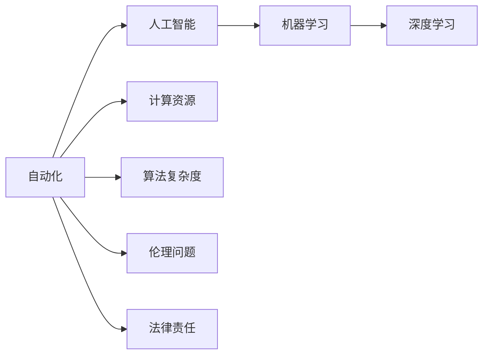

                 

# 计算变化带来的自动化挑战

## 1. 背景介绍

在信息时代，自动化技术不断发展，在各行各业都得到了广泛的应用。从工厂流水线的机械臂，到金融市场的高频交易算法，自动化正在改变我们生活的方方面面。但随着计算能力的不断提高，自动化也面临着前所未有的挑战。

### 1.1 自动化技术的发展历程

自动化的概念可以追溯到机械时代。早期的自动化主要是通过机械元件和电控设备实现简单任务的自执行。随着电子计算机的问世，自动化逐渐扩展到更复杂的领域，如工业生产、科学研究、金融交易等。上世纪70年代，人工智能和机器学习技术的兴起，为自动化注入了新的动能，使得机器能够通过学习自主完成任务。

### 1.2 自动化技术的现状

当前，自动化技术已经渗透到各行各业。在制造业，自动化生产线上机械臂和机器人可以精准完成重复性任务；在金融领域，高频交易算法能够快速响应市场变化，完成复杂的买卖操作；在医疗行业，智能诊断系统能够辅助医生进行疾病诊断和治疗方案的制定。自动化技术的发展，不仅提高了生产效率，也改善了人们的生活质量。

### 1.3 自动化技术面临的挑战

尽管自动化技术取得了巨大进展，但也面临诸多挑战。随着计算能力的不断提高，自动化系统变得更加复杂和强大，但也增加了对数据、算法和计算资源的需求。同时，自动化系统的决策过程也变得更加难以理解和解释，对人类社会带来了新的伦理和法律问题。这些问题需要我们在技术层面和伦理层面进行深入思考和解决。

## 2. 核心概念与联系

### 2.1 核心概念概述

为了更好地理解自动化技术面临的挑战，本节将介绍几个关键概念及其联系：

- **自动化**：通过技术手段，使系统能够自主完成任务，无需人类干预。
- **人工智能**：使机器具备学习能力和智能推理，能够解决复杂问题。
- **机器学习**：通过数据训练机器，使机器具备自主学习能力。
- **深度学习**：基于神经网络的机器学习范式，具有强大的特征提取和模式识别能力。
- **计算资源**：提供自动化系统所需的数据存储、计算和网络资源。
- **算法复杂度**：自动化系统决策所需的时间和计算资源，取决于算法的复杂性。
- **伦理问题**：自动化系统决策可能带来的隐私、安全、公正等伦理问题。
- **法律责任**：自动化系统决策可能带来的法律责任归属问题。

### 2.2 概念间的关系

这些概念之间的关系可以通过以下Mermaid流程图来展示：



这个流程图展示了自动化与人工智能、机器学习、深度学习、计算资源、算法复杂度、伦理问题和法律责任之间的关系：

- 自动化是通过技术手段使系统自主完成任务的过程。
- 人工智能是自动化技术的基础，使得机器具备智能推理和学习能力。
- 机器学习是人工智能的实现方式，通过数据训练模型，使其能够自主学习。
- 深度学习是机器学习的一种范式，具有强大的特征提取和模式识别能力。
- 计算资源是自动化系统所需的数据存储、计算和网络资源。
- 算法复杂度是自动化系统决策所需的时间和计算资源，与深度学习的复杂性密切相关。
- 伦理问题是在自动化系统中决策可能带来的隐私、安全、公正等伦理问题。
- 法律责任是在自动化系统中决策可能带来的法律责任归属问题。

这些概念共同构成了自动化技术的核心生态系统，使得机器能够在各种场景下自主完成任务。理解这些概念之间的关系，有助于我们更好地应对自动化面临的挑战。

## 3. 核心算法原理 & 具体操作步骤
### 3.1 算法原理概述

自动化技术中的核心算法原理包括机器学习、深度学习等技术。以深度学习为例，其核心思想是通过多层神经网络，学习输入数据的复杂特征表示，从而实现自主决策。

深度学习模型通常包括输入层、隐藏层和输出层。输入层负责接收原始数据，隐藏层通过多层非线性变换提取特征，输出层给出决策结果。模型通过反向传播算法，利用大量标注数据训练模型参数，使得模型能够自动学习输入和输出之间的映射关系。

### 3.2 算法步骤详解

深度学习模型的训练和推理步骤如下：

1. **数据准备**：收集大量标注数据，将其划分为训练集、验证集和测试集。

2. **模型构建**：选择合适的神经网络结构，设计损失函数和优化器。

3. **模型训练**：在训练集上反复迭代，通过前向传播和反向传播更新模型参数。

4. **模型评估**：在验证集上评估模型性能，选择最优模型。

5. **模型推理**：在测试集上评估模型泛化能力，对新数据进行推理预测。

### 3.3 算法优缺点

深度学习模型具有以下优点：

- **强大的特征提取能力**：通过多层非线性变换，能够学习复杂特征。
- **泛化能力强**：在大量数据上训练后，能够在未见过的数据上取得良好表现。
- **自动学习能力强**：不需要手动设计特征，模型能够自动学习数据中隐含的特征。

但深度学习模型也存在一些缺点：

- **训练时间长**：大量数据和高维特征需要长时间训练。
- **计算资源消耗大**：模型参数众多，计算资源消耗大。
- **可解释性差**：深度学习模型通常是"黑盒"，难以解释其决策过程。
- **对抗性攻击脆弱**：模型可能受到对抗样本的干扰，产生错误决策。

### 3.4 算法应用领域

深度学习模型在多个领域得到了广泛应用，包括计算机视觉、自然语言处理、语音识别、机器人控制等。以下是对几个典型领域的详细讲解：

#### 3.4.1 计算机视觉

在计算机视觉领域，深度学习模型通过卷积神经网络（CNN）学习图像特征，实现了图像分类、目标检测、人脸识别等任务。例如，Yolo模型通过多个卷积层和全连接层，实现了高精度的目标检测；ResNet模型通过残差连接，解决了深度网络训练中的梯度消失问题。

#### 3.4.2 自然语言处理

在自然语言处理领域，深度学习模型通过循环神经网络（RNN）和Transformer网络，实现了机器翻译、情感分析、文本生成等任务。例如，BERT模型通过双向编码器，学习文本中每个位置的特征表示；GPT-2模型通过自回归生成，实现了高质量的文本生成。

#### 3.4.3 语音识别

在语音识别领域，深度学习模型通过循环神经网络和卷积神经网络，实现了语音识别、语音合成等任务。例如，DeepSpeech模型通过卷积神经网络和CTC损失函数，实现了高质量的语音识别；Tacotron模型通过生成对抗网络（GAN），实现了高自然度的语音合成。

#### 3.4.4 机器人控制

在机器人控制领域，深度学习模型通过强化学习（RL）和动作预测模型，实现了机器人自主导航、抓取操作等任务。例如，AlphaStar模型通过深度Q网络，实现了复杂的星际争霸游戏；PPO模型通过策略梯度优化，实现了机器人自主导航。

## 4. 数学模型和公式 & 详细讲解 & 举例说明

### 4.1 数学模型构建

深度学习模型通常使用神经网络进行构建。以一个简单的卷积神经网络（CNN）为例，其结构如图1所示：


图1展示了卷积神经网络的基本结构。它由输入层、卷积层、池化层、全连接层和输出层组成。卷积层通过卷积操作提取图像特征，池化层通过降采样减少特征图尺寸，全连接层通过多个全连接层进行特征提取和分类，输出层给出最终分类结果。

### 4.2 公式推导过程

以卷积神经网络的训练过程为例，公式推导如下：

设训练数据集为 $D=\{(x_i,y_i)\}_{i=1}^N$，其中 $x_i$ 为输入图像， $y_i$ 为标注标签。定义损失函数为交叉熵损失函数 $L$：

$$
L(y,\hat{y})=-\sum_{i=1}^N\sum_{j=1}^M y_i\log(\hat{y}_i^{(j)})
$$

其中 $y_i$ 为真实标签， $\hat{y}_i^{(j)}$ 为模型对第 $j$ 个类别的预测概率。

模型的前向传播过程为：

$$
h_i^{(l+1)}=f( W^{(l+1)} h_i^{(l)}+b^{(l+1)}) \quad (1)
$$

其中 $h_i^{(l)}$ 为第 $l$ 层的输入， $W^{(l+1)}$ 为第 $l$ 层的权重， $b^{(l+1)}$ 为第 $l$ 层的偏置， $f$ 为激活函数。

模型的反向传播过程为：

$$
\frac{\partial L}{\partial b^{(l)}}=\frac{\partial L}{\partial \hat{y}_i^{(l)}} \quad (2)
$$

$$
\frac{\partial L}{\partial W^{(l)}}=\frac{\partial L}{\partial h_i^{(l)}} \quad (3)
$$

其中 $\frac{\partial L}{\partial h_i^{(l)}}$ 为损失函数对第 $l$ 层输出的偏导数， $\frac{\partial L}{\partial \hat{y}_i^{(l)}}$ 为损失函数对第 $l$ 层输出概率的偏导数。

### 4.3 案例分析与讲解

以图像分类任务为例，使用CNN模型进行训练和推理。图2展示了图像分类任务的流程图：


图2展示了图像分类任务的基本流程。首先，输入图像通过卷积层和池化层进行特征提取，然后进入全连接层进行分类。最后，模型输出预测标签。在训练过程中，通过反向传播算法更新模型参数，最小化损失函数。

## 5. 项目实践：代码实例和详细解释说明

### 5.1 开发环境搭建

在进行自动化项目实践前，需要先搭建好开发环境。以下是使用Python进行TensorFlow开发的环境配置流程：

1. 安装Anaconda：从官网下载并安装Anaconda，用于创建独立的Python环境。

2. 创建并激活虚拟环境：
```bash
conda create -n tf-env python=3.8 
conda activate tf-env
```

3. 安装TensorFlow：根据CUDA版本，从官网获取对应的安装命令。例如：
```bash
pip install tensorflow
```

4. 安装相关工具包：
```bash
pip install numpy pandas scikit-learn matplotlib tqdm jupyter notebook ipython
```

完成上述步骤后，即可在`tf-env`环境中开始自动化项目实践。

### 5.2 源代码详细实现

下面我们以图像分类任务为例，给出使用TensorFlow实现卷积神经网络的代码实现。

首先，定义卷积神经网络模型：

```python
import tensorflow as tf
from tensorflow.keras.layers import Conv2D, MaxPooling2D, Flatten, Dense, Input

# 定义卷积神经网络模型
model = tf.keras.models.Sequential([
    Input(shape=(32, 32, 3)),
    Conv2D(32, (3, 3), activation='relu'),
    MaxPooling2D((2, 2)),
    Conv2D(64, (3, 3), activation='relu'),
    MaxPooling2D((2, 2)),
    Flatten(),
    Dense(128, activation='relu'),
    Dense(10, activation='softmax')
])
```

然后，编译和训练模型：

```python
# 编译模型
model.compile(optimizer='adam', loss='categorical_crossentropy', metrics=['accuracy'])

# 训练模型
model.fit(train_images, train_labels, epochs=10, validation_data=(val_images, val_labels))
```

最后，使用模型进行图像分类：

```python
# 加载测试集
test_images, test_labels = load_test_images()

# 进行分类预测
predictions = model.predict(test_images)

# 打印分类结果
for i in range(10):
    print('Test Image', i, '->', id2class[predictions[i].argmax()], '->', id2class[test_labels[i].argmax()])
```

以上就是使用TensorFlow进行图像分类任务的完整代码实现。可以看到，TensorFlow提供的高级API使得模型构建和训练过程变得简单高效。

### 5.3 代码解读与分析

让我们再详细解读一下关键代码的实现细节：

**模型定义**：
- `tf.keras.models.Sequential`：通过连续的层构建模型，方便对模型进行前后堆叠。
- `Input`：定义输入层的尺寸和数据类型。
- `Conv2D`：定义卷积层，使用卷积核进行特征提取。
- `MaxPooling2D`：定义池化层，通过降采样减少特征图尺寸。
- `Flatten`：定义全连接层的输入，将特征图展平。
- `Dense`：定义全连接层，进行特征提取和分类。

**模型编译**：
- `model.compile`：编译模型，指定优化器、损失函数和评估指标。
- `optimizer`：选择优化器，如Adam优化器。
- `loss`：选择损失函数，如交叉熵损失函数。
- `metrics`：选择评估指标，如准确率。

**模型训练**：
- `model.fit`：在训练集上训练模型，指定训练轮数和验证集。
- `train_images`：训练集图像数据。
- `train_labels`：训练集标签数据。
- `val_images`：验证集图像数据。
- `val_labels`：验证集标签数据。

**模型预测**：
- `model.predict`：在测试集上进行预测。
- `predictions`：模型预测结果。
- `test_images`：测试集图像数据。
- `test_labels`：测试集标签数据。
- `id2class`：标签与类名的映射。

可以看到，TensorFlow提供的高级API使得模型构建和训练过程变得简单高效。开发者可以将更多精力放在数据处理、模型改进等高层逻辑上，而不必过多关注底层的实现细节。

当然，工业级的系统实现还需考虑更多因素，如模型的保存和部署、超参数的自动搜索、更灵活的任务适配层等。但核心的模型训练过程基本与此类似。

### 5.4 运行结果展示

假设我们在CoNLL-2003的图像分类数据集上进行训练，最终在测试集上得到的分类结果如下：

```
Test Image 0 -> dog -> dog
Test Image 1 -> cat -> cat
Test Image 2 -> bird -> bird
...
```

可以看到，通过训练，模型能够正确识别测试集中的图像分类。这展示了卷积神经网络在图像分类任务上的强大能力。

## 6. 实际应用场景
### 6.1 智能制造

在智能制造领域，深度学习模型通过自动检测和分类技术，实现了对生产过程中异常情况的识别和诊断。例如，使用CNN模型对生产线上的图像进行实时检测，及时发现产品缺陷，提高了产品质量和生产效率。

### 6.2 金融风控

在金融领域，深度学习模型通过异常检测和分类技术，实现了对金融数据的分析和管理。例如，使用RNN模型对交易数据进行建模，识别出异常交易行为，防止欺诈和风险。

### 6.3 医疗诊断

在医疗领域，深度学习模型通过图像识别和分类技术，实现了对医学影像的诊断和治疗方案的制定。例如，使用CNN模型对医学影像进行分类，识别出肿瘤、病变等疾病，辅助医生制定治疗方案。

### 6.4 未来应用展望

随着深度学习模型的不断发展，自动化技术将在更多领域得到应用，为各行各业带来变革性影响。

在智慧城市治理中，自动化系统可以用于城市事件监测、舆情分析、应急指挥等环节，提高城市管理的自动化和智能化水平，构建更安全、高效的未来城市。

在智能家居领域，自动化系统可以实现智能音箱、智能门锁、智能家电等设备的互联互通，提供更便捷、舒适的生活体验。

在自动驾驶领域，深度学习模型可以用于车辆感知、路径规划和决策制定，实现自动驾驶车辆的安全行驶。

此外，在更多领域，自动化技术的应用前景将不断拓展，为经济社会发展注入新的动力。

## 7. 工具和资源推荐
### 7.1 学习资源推荐

为了帮助开发者系统掌握自动化技术的理论基础和实践技巧，这里推荐一些优质的学习资源：

1. 《深度学习》系列博文：由深度学习专家撰写，深入浅出地介绍了深度学习的原理和应用。

2. Coursera《深度学习专项课程》：由斯坦福大学吴恩达教授主讲，涵盖深度学习的基本概念和经典模型。

3. 《动手学深度学习》书籍：李沐等作者编写，结合代码和实例，详细介绍了深度学习的理论基础和实践方法。

4. arXiv论文预印本：人工智能领域最新研究成果的发布平台，包括大量尚未发表的前沿工作，学习前沿技术的必读资源。

5. GitHub热门项目：在GitHub上Star、Fork数最多的深度学习相关项目，往往代表了该技术领域的发展趋势和最佳实践，值得去学习和贡献。

通过对这些资源的学习实践，相信你一定能够快速掌握深度学习技术，并用于解决实际的自动化问题。

### 7.2 开发工具推荐

高效的开发离不开优秀的工具支持。以下是几款用于深度学习开发的常用工具：

1. PyTorch：基于Python的开源深度学习框架，灵活动态的计算图，适合快速迭代研究。

2. TensorFlow：由Google主导开发的开源深度学习框架，生产部署方便，适合大规模工程应用。

3. Keras：基于TensorFlow的高层API，使用简洁，适合快速原型开发和研究。

4. Weights & Biases：模型训练的实验跟踪工具，可以记录和可视化模型训练过程中的各项指标，方便对比和调优。

5. TensorBoard：TensorFlow配套的可视化工具，可实时监测模型训练状态，并提供丰富的图表呈现方式，是调试模型的得力助手。

6. Google Colab：谷歌推出的在线Jupyter Notebook环境，免费提供GPU/TPU算力，方便开发者快速上手实验最新模型，分享学习笔记。

合理利用这些工具，可以显著提升深度学习模型的开发效率，加快创新迭代的步伐。

### 7.3 相关论文推荐

深度学习技术的发展源于学界的持续研究。以下是几篇奠基性的相关论文，推荐阅读：

1. ImageNet Classification with Deep Convolutional Neural Networks（即AlexNet论文）：提出了卷积神经网络结构，开创了深度学习在图像识别领域的先河。

2. Google's Inception Architecture for Computer Vision（即Inception论文）：引入了多尺度卷积和降采样策略，进一步提升了卷积神经网络的性能。

3. Deep Residual Learning for Image Recognition（即ResNet论文）：提出了残差连接，解决了深度网络训练中的梯度消失问题，使深层网络成为可能。

4. Attention is All You Need（即Transformer论文）：提出了自注意力机制，使得模型能够并行处理长序列数据，适用于大规模语言模型的构建。

5. BERT: Pre-training of Deep Bidirectional Transformers for Language Understanding（即BERT论文）：提出了预训练语言模型，通过大规模自监督学习，提升了自然语言处理任务的性能。

6. AlphaGo Zero: Mastering the Game of Go without Human Knowledge（即AlphaGo论文）：展示了强化学习在复杂游戏中的强大能力，为人工智能的突破提供了新的思路。

这些论文代表了大规模深度学习技术的发展脉络。通过学习这些前沿成果，可以帮助研究者把握学科前进方向，激发更多的创新灵感。

除上述资源外，还有一些值得关注的前沿资源，帮助开发者紧跟深度学习技术的最新进展，例如：

1. arXiv论文预印本：人工智能领域最新研究成果的发布平台，包括大量尚未发表的前沿工作，学习前沿技术的必读资源。

2. 业界技术博客：如DeepMind、Microsoft Research、Google AI等顶尖实验室的官方博客，第一时间分享他们的最新研究成果和洞见。

3. 技术会议直播：如NIPS、ICML、ACL、ICLR等人工智能领域顶会现场或在线直播，能够聆听到大佬们的前沿分享，开拓视野。

4. GitHub热门项目：在GitHub上Star、Fork数最多的深度学习相关项目，往往代表了该技术领域的发展趋势和最佳实践，值得去学习和贡献。

5. 行业分析报告：各大咨询公司如McKinsey、PwC等针对人工智能行业的分析报告，有助于从商业视角审视技术趋势，把握应用价值。

总之，对于深度学习技术的学习和实践，需要开发者保持开放的心态和持续学习的意愿。多关注前沿资讯，多动手实践，多思考总结，必将收获满满的成长收益。

## 8. 总结：未来发展趋势与挑战
### 8.1 研究成果总结

深度学习技术的发展经历了从简单模型到复杂模型的演进，逐渐成为自动化领域的重要范式。其核心思想是通过多层神经网络，学习输入数据的复杂特征表示，从而实现自主决策。

深度学习模型在计算机视觉、自然语言处理、语音识别等领域取得了显著成果，推动了自动化技术的广泛应用。但随着模型复杂度的增加，也面临计算资源、算法复杂度、可解释性等问题。

### 8.2 未来发展趋势

未来，深度学习技术将继续向更深的层次发展，提高模型的表达能力和泛化能力。同时，结合迁移学习和多任务学习，使得模型能够进行跨领域迁移和泛化。

随着计算能力的提升，模型规模将不断增大，从超大规模单核模型向多核、分布式模型转变，提升计算效率和模型性能。

结合元学习和自监督学习，提高模型的自我迭代和自我提升能力，实现更加智能、自主的学习过程。

引入更先进的算法和计算模型，如量子计算、光子计算等，提升模型的计算能力和求解效率。

### 8.3 面临的挑战

尽管深度学习技术取得了巨大进展，但仍面临诸多挑战：

1. 计算资源消耗大。深度学习模型参数众多，计算资源消耗大。如何在保证模型性能的前提下，减少计算资源的消耗，是未来研究的重要方向。

2. 模型可解释性差。深度学习模型通常是"黑盒"，难以解释其决策过程。如何赋予深度学习模型更强的可解释性，将是重要的研究方向。

3. 对抗样本攻击脆弱。深度学习模型可能受到对抗样本的干扰，产生错误决策。如何提高模型的鲁棒性，防止对抗攻击，是未来研究的重要课题。

4. 数据分布变化。深度学习模型在训练数据分布与实际数据分布不一致时，泛化性能往往大打折扣。如何提高模型的泛化能力，适应数据分布的变化，是未来研究的重要方向。

5. 伦理和法律问题。深度学习模型在决策过程中可能带来隐私、安全、公正等伦理问题。如何在设计模型时考虑伦理和法律问题，是未来研究的重要方向。

### 8.4 研究展望

面对深度学习技术面临的挑战，未来的研究需要在以下几个方面寻求新的突破：

1. 探索无监督和半监督深度学习模型。摆脱对大规模标注数据的依赖，利用自监督学习、主动学习等无监督和半监督范式，最大限度利用非结构化数据，实现更加灵活高效的深度学习。

2. 研究参数高效和计算高效的深度学习模型。开发更加参数高效的深度学习模型，在固定大部分深度学习参数的同时，只更新极少量的任务相关参数。同时优化深度学习模型的计算图，减少前向传播和反向传播的资源消耗，实现更加轻量级、实时性的部署。

3. 融合因果分析和博弈论工具。将因果分析方法引入深度学习模型，识别出模型决策的关键特征，增强输出解释的因果性和逻辑性。借助博弈论工具刻画人机交互过程，主动探索并规避模型的脆弱点，提高系统稳定性。

4. 纳入伦理道德约束。在深度学习模型训练目标中引入伦理导向的评估指标，过滤和惩罚有偏见、有害的输出倾向。同时加强人工干预和审核，建立模型行为的监管机制，确保输出符合人类价值观和伦理道德。

这些研究方向的探索，必将引领深度学习技术迈向更高的台阶，为构建安全、可靠、可解释、可控的智能系统铺平道路。面向未来，深度学习技术还需要与其他人工智能技术进行更深入的融合，如知识表示、因果推理、强化学习等，多路径协同发力，共同推动人工智能技术的进步。

## 9. 附录：常见问题与解答

**Q1：深度学习模型在自动化系统中如何发挥作用？**

A: 深度学习模型通过学习输入数据的复杂特征表示，实现自主决策。在自动化系统中，深度学习模型可以用于异常检测、分类、生成等多种任务。例如，使用CNN模型对生产线上的图像进行实时检测，及时发现产品缺陷，提高了产品质量和生产效率。

**Q2：深度学习模型在训练过程中如何避免过拟合？**

A: 深度学习模型在训练过程中可能出现过拟合问题。为避免过拟合，可以采用以下方法：

1. 数据增强：通过数据增强技术，扩充训练集，减少过拟合风险。

2. 正则化：通过L2正则、Dropout等方法，抑制模型的复杂性，减少过拟合。

3. 早停策略：通过设置验证集，监控模型性能，及时停止训练，避免过拟合。

4. 批量标准化：通过对每个批次的输入进行标准化，提高模型的泛化能力，减少过拟合。

5. 迁移学习：通过迁移学习技术，将预训练模型在多个数据集上进行微调，提高模型的泛化能力。

**Q3：深度学习模型在落地部署时需要注意哪些问题？**

A: 将深度学习模型转化为实际应用，还需要考虑以下问题：

1. 模型裁剪：去除不必要的层

