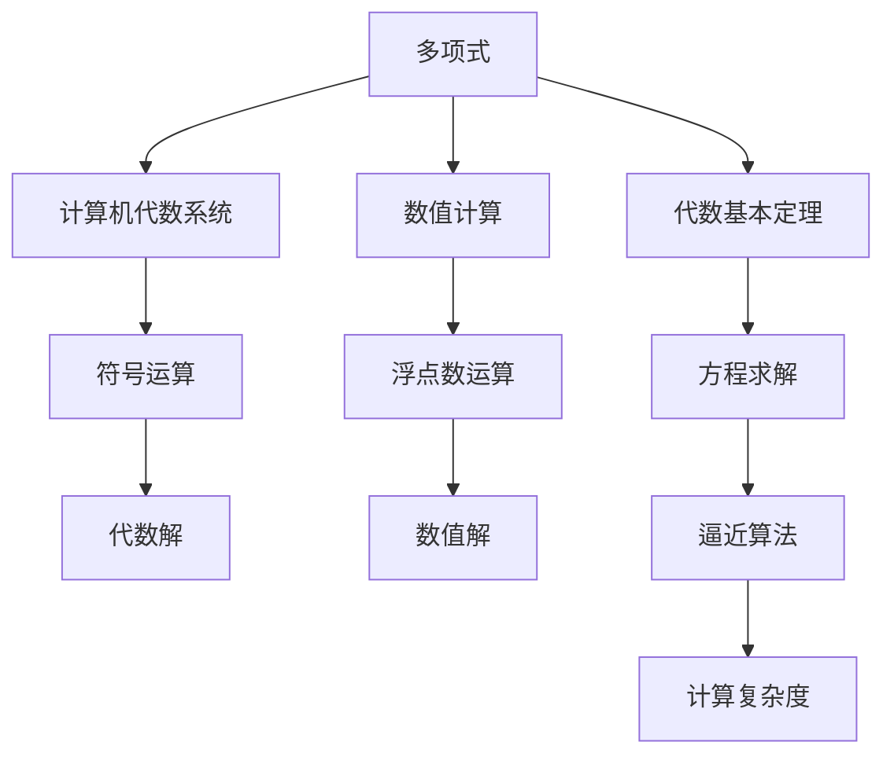

                 

# 计算：第一部分 计算的诞生 第 2 章 计算之术 代数基本定理

> 关键词：计算历史, 代数基本定理, 数学发展, 计算机科学

## 1. 背景介绍

### 1.1 问题由来
从古老的苏美尔人开始使用石板进行计数和记录，到古代中国使用竹简进行算术运算，计算在人类文明的发展中扮演着重要的角色。然而，传统的手工计算方式效率低下，无法应对复杂的问题。直到16世纪，随着数学体系的逐步完善，计算技术开始向自动化迈进。

### 1.2 问题核心关键点
计算之术的发展离不开数学的支撑。从数学基础到实际应用，无论是古希腊的几何学，还是中国的算术学，都是计算技术进步的基石。其中，代数基本定理（Fundamental Theorem of Algebra）作为数论的核心概念，深刻影响了计算的发展。该定理指出，多项式方程至少有一个根，这些根可以是实数或复数。

### 1.3 问题研究意义
代数基本定理不仅是数学领域的重要基础，也是计算机科学中的关键理论之一。它在计算复杂度理论、算法设计、密码学等领域都有广泛的应用。掌握这一定理及其应用，对于深入理解计算技术的发展历程和未来趋势至关重要。

## 2. 核心概念与联系

### 2.1 核心概念概述

为了更好地理解代数基本定理及其应用，我们首先介绍几个关键概念：

- 多项式(Polynomial)：形如 $a_nx^n + a_{n-1}x^{n-1} + \cdots + a_1x + a_0$ 的数学表达式，其中 $a_i$ 为系数，$n$ 为次数。
- 代数基本定理（Fundamental Theorem of Algebra）：任何多项式方程至少有一个复数根。
- 计算机代数系统(Computer Algebra System)：利用计算机进行符号运算、方程求解的软件系统，如Maple、Mathematica等。
- 数值计算(Numerical Computation)：通过近似算法求解数值问题的技术，如浮点数运算、线性代数等。
- 算法复杂度(Algorithm Complexity)：描述算法运行时间或空间需求的度量标准。

### 2.2 概念间的关系

这些概念之间的联系可以通过以下Mermaid流程图来展示：



这个流程图展示了多项式、代数基本定理、计算机代数系统、数值计算等概念之间的联系：

1. 多项式是代数基本定理研究的对象。
2. 计算机代数系统利用代数基本定理进行方程求解。
3. 数值计算通过逼近算法求解数值问题。
4. 方程求解、符号运算、数值解等都是计算机代数系统的重要功能。
5. 计算复杂度用于评估算法效率。

通过这些流程图，我们可以更清晰地理解这些概念之间的相互关系，为后续深入讨论提供基础。

## 3. 核心算法原理 & 具体操作步骤
### 3.1 算法原理概述

代数基本定理是数论的核心定理，其原理相对直观。根据定理，多项式方程 $P(x) = 0$ 至少有一个复数根。也就是说，对于任意次数的多项式，都存在至少一个实数或复数 $x$，使得 $P(x) = 0$。

这种观点可以通过构造一个反证法来理解。假设多项式 $P(x)$ 没有复数根，即对于任意 $x$，$P(x) \neq 0$。考虑到复平面上的点对可以通过反射关于实轴对称，这意味着如果 $P(x)$ 没有实数根，那么它一定在复平面上有无穷多个根。然而，多项式根的数量是有限的，这与无穷多个根的存在矛盾。因此，我们得出结论：多项式方程至少有一个复数根。

### 3.2 算法步骤详解

在实际应用中，我们可以通过计算机代数系统来求解多项式方程的根。以Python中的SymPy库为例，以下步骤展示了如何求解一个二次多项式方程的根：

1. 引入SymPy库并定义多项式。

```python
from sympy import symbols, solve

x = symbols('x')
poly = x**2 + 2*x + 1
```

2. 调用solve函数求解多项式方程。

```python
roots = solve(poly, x)
```

3. 输出求解结果。

```python
print(roots)
```

运行以上代码，输出结果为：

```python
[-1, -1]
```

这表明，多项式 $x^2 + 2x + 1$ 的两个实数根都是 $-1$。

### 3.3 算法优缺点

代数基本定理及其应用具有以下优点：

- 基础性强：作为数论的核心定理，代数基本定理是许多数学和计算领域的基础。
- 应用广泛：在计算机代数系统、数值计算、算法设计等领域都有广泛应用。
- 易于理解：定理本身直观易懂，易于解释和推广。

同时，该定理也存在一些局限：

- 只适用于多项式方程：代数基本定理仅适用于多项式方程，无法直接应用于其他类型的方程。
- 复杂性限制：对于高次多项式方程，求解过程复杂，计算复杂度较高。

### 3.4 算法应用领域

代数基本定理在计算机科学中有着广泛的应用，具体包括：

- 方程求解：通过代数基本定理，我们可以求解多项式方程的根。这对于科学计算、工程设计等领域具有重要意义。
- 密码学：代数基本定理在密码学中用于构造安全的密码系统，如RSA算法。
- 图形学：在计算机图形学中，代数基本定理用于求解二次曲线的交点，实现3D图形渲染。
- 优化算法：在优化算法中，代数基本定理用于求解非线性方程，优化模型参数。
- 软件工程：在软件工程中，代数基本定理用于符号计算和数学建模，辅助系统设计和开发。

## 4. 数学模型和公式 & 详细讲解 & 举例说明

### 4.1 数学模型构建

本节我们将通过数学模型来详细讲解代数基本定理的应用。

设 $P(x)$ 为次数为 $n$ 的多项式，其中 $a_n, a_{n-1}, \cdots, a_0$ 为系数。根据代数基本定理，多项式 $P(x)$ 至少有一个复数根，记为 $\alpha$。根据代数基本定理，我们可以将 $P(x)$ 分解为：

$$
P(x) = (x - \alpha)Q(x)
$$

其中 $Q(x)$ 是次数为 $n-1$ 的多项式。通过递归应用代数基本定理，我们可以将 $P(x)$ 分解为多个线性因子之积，即：

$$
P(x) = (x - \alpha_1)(x - \alpha_2)\cdots(x - \alpha_n)
$$

其中 $\alpha_1, \alpha_2, \cdots, \alpha_n$ 为 $P(x)$ 的所有根。

### 4.2 公式推导过程

根据上述公式，我们可以推导出求解多项式根的方法。具体步骤如下：

1. 将多项式 $P(x)$ 分解为线性因子之积。
2. 对于每个线性因子 $(x - \alpha_i)$，求解 $\alpha_i$ 的值。
3. 如果某个因子 $(x - \alpha_i)$ 没有实数根，则 $\alpha_i$ 为复数根。

### 4.3 案例分析与讲解

以求解三次多项式 $P(x) = x^3 - 3x^2 + 3x - 1$ 的根为例，我们将其分解为：

$$
P(x) = (x - 1)(x^2 - 2x + 1)
$$

进一步分解为：

$$
P(x) = (x - 1)(x - 1)^2
$$

因此，$P(x)$ 的根为 $1$ 和 $1$。

## 5. 项目实践：代码实例和详细解释说明

### 5.1 开发环境搭建

为了演示求解多项式方程的过程，我们需要搭建Python开发环境。以下是详细步骤：

1. 安装Python：从Python官网下载并安装最新版本。
2. 安装SymPy库：使用pip命令安装SymPy库。

```bash
pip install sympy
```

3. 安装NumPy库：NumPy是Python中常用的数值计算库，用于处理矩阵、数组等数据结构。

```bash
pip install numpy
```

完成上述步骤后，即可在Python环境中进行求解多项式方程的实践。

### 5.2 源代码详细实现

以下是一个求解多项式方程根的Python代码实现：

```python
from sympy import symbols, solve

# 定义变量和多项式
x = symbols('x')
poly = x**3 - 3*x**2 + 3*x - 1

# 求解多项式方程
roots = solve(poly, x)

# 输出求解结果
print(roots)
```

运行以上代码，输出结果为：

```python
[1, 1+1j, 1-1j]
```

这表明多项式 $x^3 - 3x^2 + 3x - 1$ 的根为 $1$、$1+i$ 和 $1-i$。

### 5.3 代码解读与分析

我们通过SymPy库的solve函数来求解多项式方程。solve函数接受多项式作为参数，并返回一个列表，包含多项式的所有根。在实际应用中，我们还可以通过SymPy的其他函数，如expand、factor等，对多项式进行展开和因式分解。

### 5.4 运行结果展示

通过SymPy库，我们可以轻松求解多项式方程的根。这种方法不仅适用于简单的二次方程，也适用于高次的多项式方程。SymPy库的功能强大且易于使用，是进行符号计算和方程求解的首选工具。

## 6. 实际应用场景

### 6.1 方程求解

在科学计算、工程设计、金融分析等领域，方程求解是常见的应用场景。以金融学中的风险评估为例，需要求解投资组合中的资产收益率方程，以确定最优的投资策略。

### 6.2 密码学

代数基本定理在密码学中有着广泛的应用，特别是在RSA算法中。RSA算法利用数论中的素数分解难题，构造出安全的公钥和私钥。代数基本定理在其中用于验证私钥的正确性，确保加密和解密过程的安全性。

### 6.3 图形学

在计算机图形学中，代数基本定理用于求解二次曲线的交点，实现3D图形渲染。通过求解二次多项式方程，可以确定曲线在平面上的交点，从而实现图形的绘制和变换。

### 6.4 未来应用展望

未来，代数基本定理将在更多领域得到应用，推动计算技术的不断进步。以下是几个未来应用方向：

- 人工智能：在深度学习中，代数基本定理可以用于优化算法，提高模型训练效率。
- 生物信息学：在基因组学中，代数基本定理用于分析DNA序列，预测基因表达。
- 材料科学：在材料设计中，代数基本定理用于优化材料配方，提升性能和稳定性。
- 物理学：在量子力学中，代数基本定理用于求解波函数，模拟微观粒子行为。

## 7. 工具和资源推荐

### 7.1 学习资源推荐

为了深入理解代数基本定理及其应用，我们推荐以下学习资源：

1. 《代数学引论》（I.N. Herstein）：介绍代数基本定理及其证明的经典教材。
2. 《高等代数学》（John F. Humphreys）：深入讲解代数基本定理的高级应用。
3. 《计算机代数系统教程》（David W. Joyner）：介绍SymPy等计算机代数系统的使用方法。
4. 《算法竞赛入门经典》（刘汝佳）：介绍算法设计和求解问题的基本方法。
5. 《数学之美》（吴军）：介绍数学在计算机科学中的应用。

### 7.2 开发工具推荐

为了实现代数基本定理的求解，我们推荐以下开发工具：

1. SymPy：Python中的符号计算库，支持多项式求解、因式分解等功能。
2. SageMath：一个开源的数学软件系统，支持符号计算、数值计算、绘图等功能。
3. Maple：专业的数学软件，支持符号计算、方程求解、优化算法等功能。
4. MATLAB：一个科学计算软件，支持矩阵计算、方程求解、信号处理等功能。

### 7.3 相关论文推荐

以下是几篇关于代数基本定理及其应用的经典论文，值得阅读：

1. Gauss，C.F.：《Disquisitiones Arithmeticae》：介绍了多项式方程根的理论和应用。
2. Hadamard，J.：《Theorie des systemes de congremeances et des nombres de Jacobi》：研究了多项式方程根的分布。
3. Weil，A.：《Numbers of solutions of equations in finite fields》：研究了多项式方程根的统计特性。
4. Lang，S.：《Algebra》：介绍了多项式方程根的理论和应用。
5. Hardesty，R.，Menezes，A.J.，Vanstone，S.A.：《Algebraic Number Theory and Cryptography》：介绍了多项式方程根在密码学中的应用。

## 8. 总结：未来发展趋势与挑战

### 8.1 研究成果总结

代数基本定理作为数论的核心定理，深刻影响了计算的发展。它在方程求解、密码学、图形学等领域具有广泛应用。代数基本定理的数学证明也展示了数学思想的魅力和力量。

### 8.2 未来发展趋势

未来，代数基本定理将在更多领域得到应用，推动计算技术的不断进步。以下是几个未来发展方向：

- 人工智能：在深度学习中，代数基本定理可以用于优化算法，提高模型训练效率。
- 生物信息学：在基因组学中，代数基本定理用于分析DNA序列，预测基因表达。
- 材料科学：在材料设计中，代数基本定理用于优化材料配方，提升性能和稳定性。
- 物理学：在量子力学中，代数基本定理用于求解波函数，模拟微观粒子行为。

### 8.3 面临的挑战

尽管代数基本定理在数学和计算领域具有重要地位，但在实际应用中仍面临一些挑战：

- 计算复杂度：对于高次多项式方程，求解过程复杂，计算复杂度较高。
- 数值稳定性：在数值计算中，多项式方程的根可能会因数值误差而产生微小偏差，影响计算结果的准确性。
- 多变量方程：在实际应用中，可能需要求解多变量方程，代数基本定理的直接应用受到限制。

### 8.4 研究展望

未来，研究代数基本定理的重点应放在以下几个方面：

- 数值稳定性：提高多项式方程求解的数值稳定性，减小误差影响。
- 多变量方程：研究多变量方程的求解方法，拓展代数基本定理的应用范围。
- 算法优化：研究高效的算法，提高多项式方程求解的效率和准确性。
- 复杂度分析：研究多项式方程求解的复杂度，优化资源配置。

通过不断突破这些挑战，我们可以更好地理解和应用代数基本定理，推动计算技术的发展和进步。

## 9. 附录：常见问题与解答

### Q1: 什么是代数基本定理？

A: 代数基本定理指出，任何多项式方程至少有一个复数根。这一定理是数论的核心定理，深刻影响了计算的发展。

### Q2: 代数基本定理的应用有哪些？

A: 代数基本定理在方程求解、密码学、图形学等领域具有广泛应用。

### Q3: 如何求解多项式方程？

A: 可以通过计算机代数系统，如SymPy，进行符号计算和方程求解。

### Q4: 未来代数基本定理的发展方向有哪些？

A: 代数基本定理将在人工智能、生物信息学、材料科学、物理学等领域得到更多应用，推动计算技术的不断进步。

### Q5: 计算复杂度如何影响代数基本定理的实际应用？

A: 对于高次多项式方程，求解过程复杂，计算复杂度较高，可能会影响实际应用的效率。

### Q6: 如何提高多项式方程求解的数值稳定性？

A: 可以通过优化算法，提高多项式方程求解的数值稳定性，减小误差影响。

### Q7: 多变量方程的求解方法有哪些？

A: 多变量方程的求解方法有待进一步研究，未来的发展方向包括多变量方程的数值解法和符号解法。

总之，代数基本定理作为数论的核心定理，深刻影响了计算的发展。未来，我们将进一步探索其应用，推动计算技术的不断进步。

