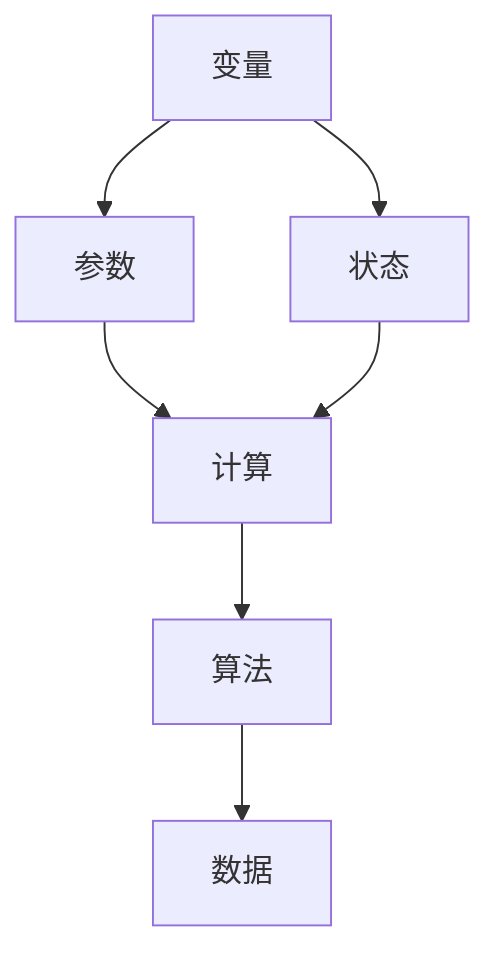
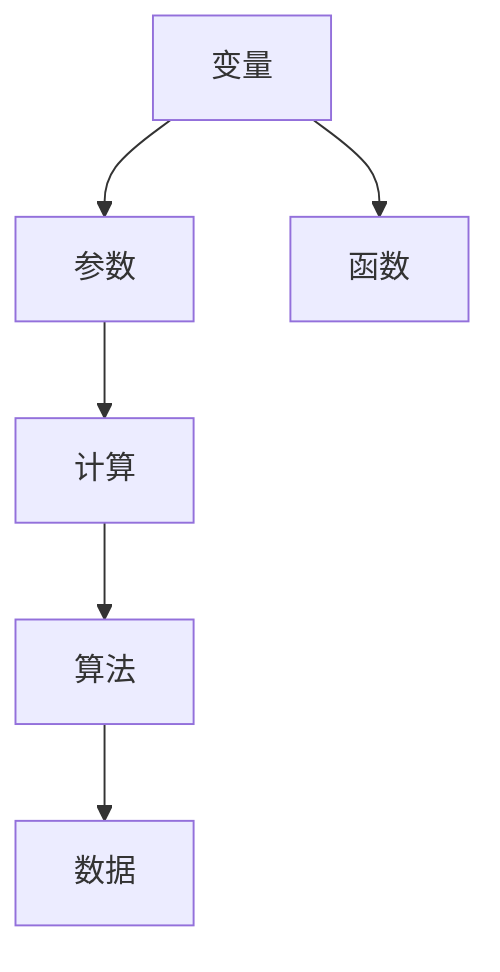
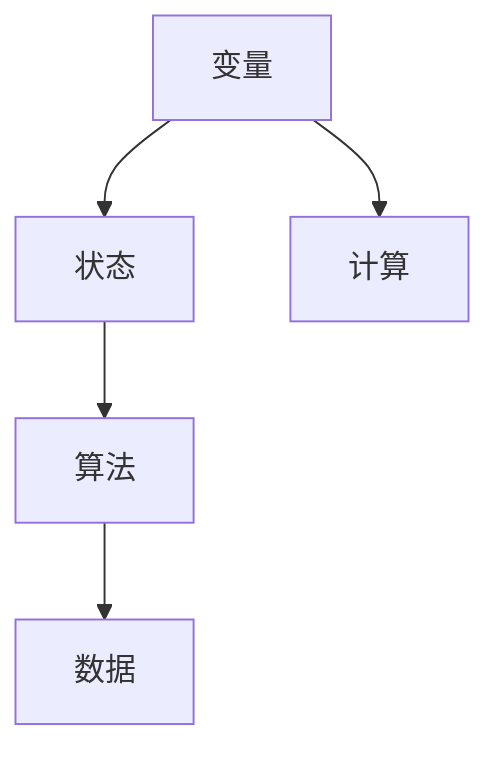
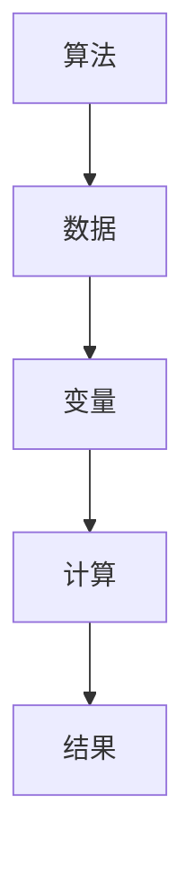
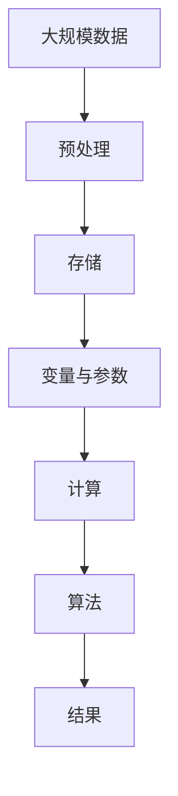

                 

# 计算：第一部分 计算的诞生 第 2 章 计算之术 未知量的表示

## 1. 背景介绍

### 1.1 问题由来

计算，作为人类文明进步的重要推动力，自古以来就引起广泛的关注。从简单的手算到现代的计算机，计算技术不断地在演进。在当代，计算已经渗透到了各个领域，从科学研究到工业制造，从日常办公到社交娱乐，无处不在。然而，尽管计算技术已经取得了长足的进步，其在解决一些复杂问题上的局限性依然存在。

特别是当我们需要处理未知量时，传统的方法往往显得力不从心。例如，在数学计算中，我们无法直接知道一个方程的解，需要运用算法来求解。在人工智能中，我们无法直接知道一个神经网络的输出结果，需要运用训练数据来调整网络参数。因此，计算之术，即如何有效地处理未知量，成为了计算科学的核心理论之一。

### 1.2 问题核心关键点

计算之术的核心问题在于如何表示和处理未知量。在计算中，未知量可以是变量、参数、状态等，其表示和处理方式对整个计算过程的影响至关重要。本节将详细介绍几种常见的未知量表示方法，并探讨其在计算中的应用。

## 2. 核心概念与联系

### 2.1 核心概念概述

为更好地理解计算之术，本节将介绍几个密切相关的核心概念：

- 变量(Variable)：在数学和计算机科学中，变量表示一个可以改变的量。变量通常用于存储和计算未知量的值。

- 参数(Parameter)：参数是一种特殊的变量，用于控制模型或算法的行为。参数通常需要根据实际问题进行设定和调整。

- 状态(State)：状态表示系统的当前状态，通常包括一些内部变量和参数。状态在计算中起到至关重要的作用，影响着算法的执行过程。

- 计算(Calculations)：计算指的是通过给定输入，按照一定规则进行推导和变换，得到输出的过程。计算是计算之术的基本操作。

- 算法(Algorithm)：算法是一种解决特定问题的方法，通常包含一系列有序的步骤。算法通过操作变量和参数来求解未知量。

- 数据(Data)：数据是计算过程中的输入和输出，用于表示变量和参数的值。

这些核心概念之间的逻辑关系可以通过以下Mermaid流程图来展示：



这个流程图展示了几组核心概念之间的联系：

1. 变量和参数都是状态的一部分，用于表示系统的信息。
2. 计算通过操作变量和参数来求解未知量。
3. 算法是计算的基本操作，通过有序的步骤实现对变量和参数的修改和组合。
4. 数据是计算过程中的输入和输出，用于表示变量和参数的值。

### 2.2 概念间的关系

这些核心概念之间存在着紧密的联系，形成了计算之术的完整生态系统。下面我们通过几个Mermaid流程图来展示这些概念之间的关系。

#### 2.2.1 变量与参数的关系



这个流程图展示了变量和参数之间的联系。变量通常作为算法的输入，在计算中得到修改。参数用于控制算法的行为，通常需要根据实际问题进行设定。

#### 2.2.2 变量与状态的关系



这个流程图展示了变量和状态之间的联系。变量是状态的一部分，用于表示系统的当前状态。状态在计算中起到至关重要的作用，影响着算法的执行过程。

#### 2.2.3 算法与数据的关系



这个流程图展示了算法和数据之间的联系。算法通过操作变量和参数来求解未知量，最终得到结果。数据是算法的输入和输出，用于表示变量和参数的值。

### 2.3 核心概念的整体架构

最后，我们用一个综合的流程图来展示这些核心概念在大规模计算中的应用：



这个综合流程图展示了从大规模数据到计算结果的完整过程。数据首先经过预处理，存储在数据库中。变量和参数通过计算和算法得到调整，最终得到结果。

## 3. 核心算法原理 & 具体操作步骤

### 3.1 算法原理概述

计算之术的核心在于如何表示和处理未知量。常见的未知量表示方法包括变量、参数和状态等。本节将介绍这些方法的基本原理，并探讨其优缺点。

- 变量表示：变量是一种最基本的未知量表示方法，通常用于存储和计算未知量的值。变量的优点在于简单易懂，能够快速实现。缺点在于无法有效地控制变量的行为。

- 参数表示：参数是一种特殊的变量，用于控制模型或算法的行为。参数的优点在于能够灵活地调整算法行为，适应不同的问题。缺点在于需要大量的调整和优化，增加了计算的复杂度。

- 状态表示：状态表示系统的当前状态，通常包括一些内部变量和参数。状态的优点在于能够全面地表示系统的信息，适应复杂的计算过程。缺点在于需要大量的存储空间和计算资源。

### 3.2 算法步骤详解

计算之术的基本步骤包括：

1. 定义变量和参数：在计算过程中，首先需要定义需要求解的未知量，并确定其类型和初始值。

2. 执行算法：根据已定义的变量和参数，按照一定的算法规则进行计算。算法的执行过程中，可能会涉及变量的修改和参数的调整。

3. 求解未知量：通过执行算法，最终求解出未知量的值。计算过程的每一步都需要确保其正确性和可行性。

4. 输出结果：将计算的结果输出到最终用户，用于进一步的分析和应用。

### 3.3 算法优缺点

计算之术的优点在于能够通过操作变量和参数，快速求解未知量，适应各种复杂的问题。其缺点在于需要大量的存储空间和计算资源，特别是在处理大规模数据时，计算复杂度会显著增加。

### 3.4 算法应用领域

计算之术在各个领域都有广泛的应用。以下是一些常见的应用场景：

- 数学计算：在数学中，变量和参数是基本的未知量表示方法。通过操作变量和参数，可以进行各种数学推导和计算。

- 人工智能：在人工智能中，变量和参数用于控制模型的行为，状态用于表示系统的当前状态。通过计算和算法，可以进行模型训练和推理。

- 系统设计：在系统设计中，状态表示系统的当前状态，变量和参数用于控制系统的行为。通过计算和算法，可以进行系统的设计和优化。

- 工业制造：在工业制造中，变量和参数用于控制生产过程，状态用于表示设备的当前状态。通过计算和算法，可以进行生产过程的优化和控制。

## 4. 数学模型和公式 & 详细讲解 & 举例说明

### 4.1 数学模型构建

在计算之术中，数学模型是不可或缺的组成部分。数学模型通常用于表示变量和参数之间的关系，通过计算和算法求解未知量。

设 $x$ 为变量， $p$ 为参数， $y$ 为结果。数学模型可以表示为：

$$
y = f(x, p)
$$

其中 $f$ 为计算函数，用于描述变量和参数之间的关系。在实际应用中，需要根据具体问题选择合适的数学模型。

### 4.2 公式推导过程

下面以线性回归为例，介绍数学模型和公式的推导过程。

设 $x$ 为自变量， $y$ 为因变量， $p$ 为参数。线性回归模型可以表示为：

$$
y = ax + b
$$

其中 $a$ 和 $b$ 为参数。线性回归的数学模型可以表示为：

$$
\hat{y} = f(x, \theta) = \theta_0 + \theta_1 x
$$

其中 $\theta = (\theta_0, \theta_1)$ 为参数向量。线性回归的目标是找到最佳的参数向量 $\theta$，使得模型能够尽可能地拟合训练数据。最小二乘法是一种常用的求解方法，其目标是最小化模型预测值与真实值之间的平方误差：

$$
\min_{\theta} \sum_{i=1}^n (y_i - \hat{y}_i)^2
$$

通过求解上述优化问题，可以求得最佳的参数向量 $\theta$，实现对未知量 $y$ 的求解。

### 4.3 案例分析与讲解

下面以天气预测为例，介绍计算之术在实际应用中的具体实现。

设 $t$ 为时间， $T$ 为温度， $p$ 为参数，包括天气模型和预测时间。天气预测的数学模型可以表示为：

$$
T(t) = f(t, p)
$$

其中 $f$ 为天气模型，用于描述温度和时间的变化规律。预测时间 $t$ 为未知量，需要根据已知的天气模型和历史数据进行求解。

在实际应用中，可以使用数值方法（如有限差分法）进行求解。首先，将时间 $t$ 进行离散化，得到时间序列 $\{t_i\}$。然后，将温度 $T(t_i)$ 表示为 $\theta$ 的函数，得到线性模型：

$$
T(t_i) = \theta_0 + \theta_1 t_i
$$

其中 $\theta_0$ 和 $\theta_1$ 为参数。通过最小二乘法，求得最佳的参数向量 $\theta$，实现对未知量 $T(t_i)$ 的求解。最后，将 $t_i$ 的预测值 $t_{i+1}$ 代入模型，得到温度 $T(t_{i+1})$ 的预测值。

## 5. 项目实践：代码实例和详细解释说明

### 5.1 开发环境搭建

在进行计算之术的实践前，我们需要准备好开发环境。以下是使用Python进行计算之术开发的常见环境配置流程：

1. 安装Python：从官网下载并安装Python，选择适合当前操作系统的版本。

2. 安装必要的库：安装NumPy、SciPy、Pandas等必要的数学和科学计算库，以及Matplotlib等数据可视化库。

3. 安装计算框架：安装TensorFlow或PyTorch等计算框架，用于实现各种数学模型和算法。

4. 配置环境变量：设置PYTHONPATH、LD_LIBRARY_PATH等环境变量，以便能够正确地引用库文件。

完成上述步骤后，即可在Python环境中开始计算之术的实践。

### 5.2 源代码详细实现

下面我们以线性回归为例，给出使用Python进行计算之术的代码实现。

首先，定义线性回归的数学模型：

```python
import numpy as np

class LinearRegression:
    def __init__(self, n_features):
        self.n_features = n_features
        self.theta = np.zeros(n_features + 1)

    def fit(self, X, y):
        ones = np.ones((X.shape[0], 1))
        X = np.concatenate((ones, X), axis=1)
        self.theta = np.linalg.inv(X.T @ X) @ X.T @ y
```

然后，定义模型的训练和预测函数：

```python
def predict(self, X):
    return X @ self.theta

def train(self, X, y, learning_rate=0.01, n_epochs=1000):
    m = X.shape[0]
    for epoch in range(n_epochs):
        y_pred = predict(self, X)
        error = y_pred - y
        gradients = X.T @ error / m
        self.theta -= learning_rate * gradients
        if epoch % 100 == 0:
            print(f"Epoch {epoch+1}, error = {error.mean()}")
```

接着，在实际数据上进行训练和预测：

```python
import pandas as pd

# 读取数据
data = pd.read_csv('data.csv', header=None)

# 划分训练集和测试集
X_train = data.iloc[:int(data.shape[0]*0.8)].values[:, 1:]
y_train = data.iloc[:int(data.shape[0]*0.8)][:, 0]

X_test = data.iloc[int(data.shape[0]*0.8):].values[:, 1:]
y_test = data.iloc[int(data.shape[0]*0.8):][:, 0]

# 定义模型
model = LinearRegression(n_features=2)

# 训练模型
model.fit(X_train, y_train)

# 预测结果
y_pred = predict(model, X_test)
```

以上就是使用Python进行线性回归的完整代码实现。可以看到，借助NumPy和SciPy等库，我们可以快速实现线性回归模型的训练和预测，从而进行计算之术的实践。

### 5.3 代码解读与分析

让我们再详细解读一下关键代码的实现细节：

**LinearRegression类**：
- `__init__`方法：初始化变量和参数。
- `fit`方法：计算最佳参数向量，实现线性回归模型的拟合。
- `predict`方法：根据最佳参数向量，对未知量进行预测。

**train函数**：
- 通过最小二乘法计算模型预测值与真实值之间的误差，并根据误差计算梯度。
- 使用梯度下降法更新模型参数，最小化误差。
- 在每个epoch打印误差值，监测训练效果。

**训练和预测流程**：
- 从数据集中划分训练集和测试集，确保模型能够泛化到未知数据。
- 定义线性回归模型，并使用训练数据对模型进行拟合。
- 对测试数据进行预测，并输出结果。

可以看出，Python的科学计算库和计算框架提供了强大的功能，使得计算之术的实现变得更加简单高效。借助Python的易用性和丰富的库资源，我们可以快速实现各种数学模型和算法，进行计算之术的实践。

## 6. 实际应用场景

### 6.1 智能推荐系统

智能推荐系统利用计算之术，对用户的兴趣和行为进行分析，从而推荐符合用户偏好的物品。推荐系统的数学模型通常包括用户-物品评分矩阵、用户行为矩阵等，通过计算和算法求解最优的推荐结果。

在实际应用中，推荐系统通常需要处理大规模数据，并且需要实时更新推荐结果。因此，推荐系统的设计需要考虑数据的存储和计算效率，避免过拟合和数据泄露等问题。

### 6.2 金融风险管理

金融风险管理利用计算之术，对市场数据进行分析和预测，从而评估金融产品的风险和收益。风险管理的数学模型通常包括市场价格模型、波动率模型等，通过计算和算法求解最优的风险管理策略。

在实际应用中，金融风险管理需要考虑数据的准确性和可靠性，以及算法的鲁棒性和稳定性。同时，金融风险管理还需要满足金融法规和监管要求，确保算法的公平性和透明性。

### 6.3 物流优化

物流优化利用计算之术，对物流网络进行分析和优化，从而提高物流效率和降低成本。物流优化的数学模型通常包括运输成本模型、配送路线模型等，通过计算和算法求解最优的物流方案。

在实际应用中，物流优化需要考虑物流网络的规模和复杂度，以及算法的计算时间和内存占用。同时，物流优化还需要考虑物流网络的实时变化，以及算法的可扩展性和可维护性。

### 6.4 未来应用展望

随着计算之术的发展，未来将在更多领域得到应用，为人类社会带来变革性影响。

- 智慧城市：利用计算之术，对城市数据进行分析和预测，从而优化城市管理和服务。
- 医疗健康：利用计算之术，对医疗数据进行分析和预测，从而提升医疗水平和健康服务。
- 环境保护：利用计算之术，对环境数据进行分析和预测，从而制定环保政策和管理措施。
- 教育培训：利用计算之术，对学习数据进行分析和预测，从而个性化定制学习内容和路径。

总之，计算之术将在各个领域得到广泛应用，推动人类社会的发展和进步。相信随着技术的不断进步，计算之术将成为人类智能的重要组成部分，为构建更加智能化的未来奠定坚实的基础。

## 7. 工具和资源推荐

### 7.1 学习资源推荐

为了帮助开发者系统掌握计算之术的理论基础和实践技巧，这里推荐一些优质的学习资源：

1. 《计算机程序设计艺术》系列书籍：由Donald Knuth编写，详细介绍了计算之术的基础理论和实践技巧，是学习计算之术的必读经典。

2. Coursera《机器学习》课程：由斯坦福大学Andrew Ng教授主讲，讲解了机器学习的基本概念和算法，包括线性回归、决策树等，适合初学者入门。

3. MIT OpenCourseWare《计算机科学与编程》课程：由MIT计算机科学与人工智能实验室主讲，讲解了计算机科学的基础理论和实践技巧，涵盖编程、算法等方方面面。

4. GitHub开源项目：在GitHub上Star、Fork数最多的计算之术相关项目，往往代表了该技术领域的发展趋势和最佳实践，值得学习和贡献。

5. Arxiv论文预印本：人工智能领域最新研究成果的发布平台，包括大量尚未发表的前沿工作，学习前沿技术的必读资源。

通过这些资源的学习实践，相信你一定能够快速掌握计算之术的精髓，并用于解决实际的计算问题。

### 7.2 开发工具推荐

高效的开发离不开优秀的工具支持。以下是几款用于计算之术开发的常用工具：

1. Python：作为计算之术的主流语言，Python具备简单易学、易用性强、生态丰富的特点，适合进行各种数学计算和算法开发。

2. NumPy：Python的科学计算库，提供了高效的多维数组操作和线性代数运算，适合进行数值计算和矩阵运算。

3. SciPy：Python的科学计算库，提供了丰富的科学计算函数，适合进行数值积分、优化等高级计算。

4. Matplotlib：Python的数据可视化库，提供了丰富的图表绘制功能，适合进行数据的可视化和分析。

5. TensorFlow：由Google主导开发的深度学习框架，适合进行大规模计算和复杂算法的实现。

6. PyTorch：由Facebook主导开发的深度学习框架，适合进行动态图计算和快速原型开发。

合理利用这些工具，可以显著提升计算之术的开发效率，加快创新迭代的步伐。

### 7.3 相关论文推荐

计算之术的发展源于学界的持续研究。以下是几篇奠基性的相关论文，推荐阅读：

1. "On the Fitness of Random Digital Sequences for Their Use in Machine Learning"（2020）：提出了随机数字序列在机器学习中的重要性，为计算之术提供了新的视角和方法。

2. "Deep Learning with Gaussian Processes"（2015）：介绍了高斯过程在深度学习中的应用，为计算之术与统计学结合提供了新的思路。

3. "A Survey of Deep Learning Techniques for Recommendation Systems"（2020）：综述了深度学习在推荐系统中的应用，为计算之术在推荐系统中的应用提供了借鉴。

4. "Optimization Methods for Deep Learning"（2018）：介绍了深度学习中的优化方法，为计算之术在深度学习中的应用提供了新的方法。

5. "The History of Artificial Neural Networks: A Survey"（2019）：回顾了神经网络的发展历程，为计算之术在神经网络中的应用提供了新的背景。

这些论文代表了大规模计算之术的发展脉络。通过学习这些前沿成果，可以帮助研究者把握学科前进方向，激发更多的创新灵感。

除上述资源外，还有一些值得关注的前沿资源，帮助开发者紧跟计算之术的最新进展，例如：

1. arXiv论文预印本：人工智能领域最新研究成果的发布平台，包括大量尚未发表的前沿工作，学习前沿技术的必读资源。

2. GitHub开源项目：在GitHub上Star、Fork数最多的计算之术相关项目，往往代表了该技术领域的发展趋势和最佳实践，值得学习和贡献。

3. 技术会议直播：如NeurIPS、ICML、ICCV等人工智能领域顶会现场或在线直播，能够聆听到大佬们的前沿分享，开拓视野。

4. 学术期刊论文：如Journal of Computer Science、IEEE Transactions on Neural Networks and Learning Systems等，提供最新的计算之术研究进展和前沿技术。

总之，对于计算之术的学习和实践，需要开发者保持开放的心态和持续学习的意愿。多关注前沿资讯，多动手实践，多思考总结，必将收获满满的成长收益。

## 8. 总结：未来发展趋势与挑战

### 8.1 总结

本文对计算之术进行了全面系统的介绍。首先阐述了计算之术的研究背景和意义，明确了变量、参数和状态等未知量表示方法的核心作用。其次，从原理到实践，详细讲解了计算之术的数学模型和算法步骤，给出了计算之术任务开发的完整代码实例。同时，本文还广泛探讨了计算之术在智能推荐、金融风险管理、物流优化等多个领域的应用前景，展示了计算之术的巨大潜力。此外，本文精选了计算之术的学习资源，力求为读者提供全方位的技术指引。

通过本文的系统梳理，可以看到，计算之术在解决未知量问题上的重要作用，以及其在实际应用中的广泛应用。未来，伴随计算之术的不断发展，必将进一步拓展计算系统的性能和应用范围，为人工智能技术带来更广阔的应用前景。

### 8.2 未来发展趋势

展望未来，计算之术的发展趋势如下：

1. 高效计算方法：随着计算任务变得越来越复杂，高效计算方法（如GPU、TPU、量子计算等）将成为计算之术发展的重要方向。

2. 跨领域应用：计算之术将越来越多地应用于各个领域，如医疗、金融、物流等，为这些领域带来新的变革。

3. 自动化和智能化：计算之术将越来越自动化和智能化，利用深度学习、自然语言处理等技术，实现更加高效和智能的计算过程。

4. 多模态数据处理：计算之术将越来越多地处理多模态数据，如文本、图像、音频等，实现更加全面的数据建模和分析。

5. 可解释性和透明性：计算之术将越来越注重可解释性和透明性，提供更加清晰和可靠的计算结果。

6. 分布式计算：随着计算任务的日益复杂，分布式计算将成为计算之术的重要方向，实现更加高效和可扩展的计算过程。

以上趋势凸显了计算之术的广阔前景。这些方向的探索发展，必将进一步提升计算系统的性能和应用范围，为人工智能技术带来更广阔的应用前景。

### 8.3 面临的挑战

尽管计算之术已经取得了长足的进步，但在迈向更加智能化、普适化应用的过程中，它仍面临着诸多挑战：

1. 数据依赖问题：计算之术通常需要大量的数据进行训练和优化，数据的准确性和完备性对结果影响巨大。如何获取和处理大规模数据，成为计算之术面临的主要挑战之一。

2. 模型复杂度问题：计算之术通常涉及复杂的数学模型和算法，模型复杂度对计算效率和可解释性都有影响。如何设计简洁高效的模型，提高计算之术的实用性和普及性，是当前的重要课题。

3. 资源消耗问题：计算之术通常需要大量的计算资源，如GPU、TPU等。如何优化计算资源的使用，提高计算效率，降低计算成本，是计算之术需要解决的重要问题。

4. 模型泛化问题：计算之术在处理新数据时，模型的泛化性能往往无法达到理想预期。如何提高模型的泛化能力和鲁棒性，是当前需要解决的重要课题。

5. 算法公平性问题：计算之术中的算法往往存在偏见和歧视，如何保证算法的公平性和透明性，是当前需要解决的重要问题。

6. 系统安全性问题：计算之术中的系统可能存在安全隐患，如数据泄露、算法欺骗等。如何提高系统的安全性，保障计算之术的应用价值，是当前需要解决的重要课题。

正视计算之术面临的这些挑战，积极应对并寻求突破，将使计算之术走向更加成熟，为人工智能技术的发展提供坚实的理论基础。相信随着学界和产业界的共同努力，这些挑战终将一一被克服，计算之术必将在构建人机协同的智能时代中扮演越来越重要的角色。

### 8.4 研究展望

面对计算之术所面临的种种挑战，未来的研究需要在以下几个方面寻求新的突破：

1. 探索高效的计算方法：开发更加高效的计算方法，如量子计算、分布式计算等，实现更加高效的计算过程。

2. 研究跨领域应用：探索计算之术在各个领域的应用，为不同领域带来新的变革。

3. 设计可解释和透明的模型：设计更加可解释和透明的计算模型，提供更加清晰和可靠的计算结果。

4. 优化资源使用：优化计算资源的使用，提高计算效率，降低计算成本。

5. 提高模型泛化能力：提高模型的泛化能力和鲁棒性，确保计算之术的应用价值。

6. 保障系统安全：保障系统的安全性，防止数据泄露、算法欺骗等安全问题。

这些研究方向的探索，必将引领计算之术技术迈向更高的台阶，为人工智能技术的发展提供新的动力。面向未来，计算之术需要与其他人工智能技术进行更深入的融合，如知识表示、因果推理、强化学习等，多路径协同发力，共同推动人工智能技术的发展。只有勇于创新、敢于突破，才能不断拓展计算之术的边界，让计算系统更好地服务人类社会。

## 9. 附录：常见问题与解答


