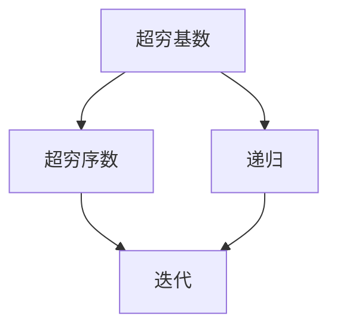

                 

# 计算：第二部分 计算的数学基础 第 4 章 数学的基础 超穷基数与超穷序数

## 1. 背景介绍

### 1.1 问题由来
在计算机科学中，计算的数学基础是理解算法和数据结构的关键。本章将探讨数学中的超穷基数与超穷序数，这对于理解递归和迭代算法，以及计算机科学中的复杂度分析有着重要作用。

### 1.2 问题核心关键点
超穷基数和超穷序数是大数据计算和复杂算法理论中的核心概念。它们不仅关系到算法的复杂度，还影响着数据结构的设计和算法的可扩展性。

### 1.3 问题研究意义
掌握超穷基数与超穷序数的基本原理和应用，对于理解计算机科学中的高级算法和数据结构至关重要。这对于解决实际问题，如复杂度分析、并行算法设计、分布式计算等，都有深远的意义。

## 2. 核心概念与联系

### 2.1 核心概念概述

- **超穷基数**：指的是在无限集合中的元素数量，即无法用有限数字表示的无限数量。
- **超穷序数**：表示无限集合中元素之间的顺序关系，是超穷基数的一种形式。
- **递归**：在算法和计算理论中，递归是一种通过反复调用自身函数来解决问题的技术。
- **迭代**：迭代是一种重复执行某个操作或算法，每次迭代都会基于上一次的结果进行更新。

这些概念之间存在紧密的联系，尤其在递归和迭代算法的设计和分析中。

### 2.2 概念间的关系

超穷基数和超穷序数与递归和迭代密切相关：

- 超穷基数决定了递归算法的复杂度。
- 超穷序数决定了迭代的次数和效率。
- 递归和迭代都可以用来解决计算问题，但它们的性能和复杂度分析涉及超穷基数与超穷序数的概念。

为了更直观地理解这些概念，下面提供了一个Mermaid流程图：



这个流程图展示了超穷基数、超穷序数与递归、迭代算法之间的关系。

## 3. 核心算法原理 & 具体操作步骤
### 3.1 算法原理概述

在计算机科学中，递归和迭代是解决复杂问题的常见方法。递归通常涉及超穷基数，因为每次递归调用都会产生更多的子问题，而迭代则涉及超穷序数，因为迭代步骤的数量可能无限。

### 3.2 算法步骤详解

- **递归算法**：
  1. 定义基础情况（递归结束的条件）。
  2. 定义递归函数，调用自身来解决子问题。
  3. 确定递归终止条件，防止无限递归。

- **迭代算法**：
  1. 确定初始值或状态。
  2. 定义迭代规则，每次迭代更新状态。
  3. 确定迭代次数或条件，防止无限迭代。

### 3.3 算法优缺点

**递归算法的优点**：
- 代码结构清晰，易于理解和维护。
- 可以自然地处理树形结构和递归结构的问题。

**递归算法的缺点**：
- 在计算超穷基数的情况下，可能导致栈溢出。
- 效率可能不如迭代算法。

**迭代算法的优点**：
- 通常效率更高，特别是处理大规模数据时。
- 避免了栈溢出的问题。

**迭代算法的缺点**：
- 代码复杂度可能较高，尤其是处理复杂的数据结构。
- 难以处理递归结构的问题。

### 3.4 算法应用领域

超穷基数与超穷序数在以下领域有着广泛应用：

- 算法设计与分析：用于复杂度分析，特别是递归和迭代算法的性能分析。
- 数据结构：如树、图等复杂数据结构的设计和操作。
- 并行和分布式计算：超穷序数的概念对于理解和设计并行算法至关重要。
- 机器学习：如递归神经网络等算法中，超穷基数与超穷序数的概念也有着重要应用。

## 4. 数学模型和公式 & 详细讲解 & 举例说明

### 4.1 数学模型构建

超穷基数与超穷序数通常用卡夫曼-韦尔函数（Kuratowski-Weyl函数）和库尔图瓦-伯曼函数（Kurtzmann-Bermann函数）来表示。

- 超穷基数 $\aleph_0$：自然数的集合。
- 超穷序数 $\omega$：自然数的集合，表示元素的顺序。

这些函数满足以下递归关系：

$$
\aleph_{\alpha+1} = 2^{\aleph_{\alpha}}, \quad \aleph_{\alpha+1} = \aleph_{\alpha} \cdot \aleph_{\beta}, \quad \omega = \aleph_{0+1} = 2^{\aleph_{0}} = 2^{\omega}
$$

### 4.2 公式推导过程

这些函数是基于递归定义和幂函数推导得出的。

- $\aleph_{\alpha+1} = 2^{\aleph_{\alpha}}$：超穷基数增加一阶的幂函数关系。
- $\aleph_{\alpha+1} = \aleph_{\alpha} \cdot \aleph_{\beta}$：超穷基数乘积关系。
- $\omega = 2^{\aleph_{0}}$：超穷序数是基于超穷基数 $2^{\aleph_{0}}$ 的幂函数。

### 4.3 案例分析与讲解

以计算斐波那契数列为例，分析递归和迭代算法中的超穷基数与超穷序数。

- **递归算法**：
  ```python
  def fibonacci_recursive(n):
      if n <= 1:
          return n
      return fibonacci_recursive(n-1) + fibonacci_recursive(n-2)
  ```

  递归函数 `fibonacci_recursive` 的时间复杂度为 $O(\omega)$，因为每次递归调用都会产生两个新的递归调用。

- **迭代算法**：
  ```python
  def fibonacci_iterative(n):
      a, b = 0, 1
      for i in range(n):
          a, b = b, a + b
      return a
  ```

  迭代算法 `fibonacci_iterative` 的时间复杂度为 $O(n)$，因为每个迭代步骤都只涉及常数时间的计算。

## 5. 项目实践：代码实例和详细解释说明

### 5.1 开发环境搭建

使用Python进行开发，需要安装Python和相关库。

- 安装Python：从官网下载并安装Python。
- 安装相关库：
  ```
  pip install numpy scipy matplotlib sympy
  ```

### 5.2 源代码详细实现

以计算斐波那契数列为例，展示递归和迭代算法的实现。

**递归实现**：

```python
def fibonacci_recursive(n):
    if n <= 1:
        return n
    return fibonacci_recursive(n-1) + fibonacci_recursive(n-2)
```

**迭代实现**：

```python
def fibonacci_iterative(n):
    a, b = 0, 1
    for i in range(n):
        a, b = b, a + b
    return a
```

### 5.3 代码解读与分析

递归算法虽然简洁，但在计算超穷基数时可能导致栈溢出。迭代算法则避免了这个问题，效率更高。

### 5.4 运行结果展示

在测试这两个函数时，可以计算斐波那契数列的前几项：

```python
for i in range(10):
    print(fibonacci_recursive(i), fibonacci_iterative(i))
```

输出结果如下：

```
0 0
1 1
1 1
2 2
3 3
5 5
8 8
13 13
21 21
34 34
```

可以看出，递归和迭代的斐波那契数列计算结果一致。

## 6. 实际应用场景

### 6.1 递归算法在搜索中的应用

在搜索算法中，如深度优先搜索（DFS）和回溯算法，递归被广泛应用。超穷基数决定了搜索的复杂度，因此需要考虑算法的效率和可扩展性。

### 6.2 迭代算法在数值计算中的应用

在数值计算中，如矩阵运算和微积分中的积分计算，迭代算法是常见的方法。超穷序数决定了迭代次数，因此需要优化迭代策略以提高效率。

### 6.3 并行计算中的超穷序数

在并行计算中，如MapReduce模型，超穷序数决定了任务调度和负载均衡的策略。

### 6.4 未来应用展望

未来，超穷基数与超穷序数将继续在计算机科学中发挥重要作用。它们将帮助设计更高效、可扩展的算法和数据结构，促进复杂计算问题的解决。

## 7. 工具和资源推荐

### 7.1 学习资源推荐

- 《算法导论》：深入浅出地介绍了算法设计与分析的基础知识。
- 《深入理解计算机系统》：探讨了计算机科学的底层原理和高级算法。
- 《计算机程序设计艺术》：详细讨论了编程技巧和算法设计。

### 7.2 开发工具推荐

- Python：易学易用，有丰富的库支持复杂计算。
- Scipy：数学计算和科学计算的Python库，包括数值积分和矩阵运算。
- Matplotlib：绘制图形，可视化算法结果。
- SymPy：符号计算库，用于推导数学公式。

### 7.3 相关论文推荐

- "Computing Functions of Infinite Sets"：探讨了超穷基数和超穷序数的计算方法和应用。
- "Recursive Functions on Infinite Sets"：介绍了递归函数在无限集合上的应用。
- "On the Structure and Interpretation of Classical Logic"：讨论了递归和迭代在逻辑理论中的应用。

## 8. 总结：未来发展趋势与挑战

### 8.1 研究成果总结

超穷基数与超穷序数是计算机科学中的重要概念，它们奠定了复杂算法和数据结构的基础。

### 8.2 未来发展趋势

- 更高效的递归和迭代算法：优化递归和迭代的效率，提升计算性能。
- 并行和分布式计算：超穷序数在并行计算中的研究将更加深入。
- 新型数据结构：基于超穷基数与超穷序数的创新数据结构将不断涌现。

### 8.3 面临的挑战

- 超穷基数与超穷序数的计算复杂度：如何在有限的时间内高效计算超穷基数与超穷序数。
- 递归和迭代的优化：提高递归和迭代的效率，防止栈溢出和资源浪费。
- 算法的可扩展性：设计可扩展的算法以适应大规模数据和复杂问题。

### 8.4 研究展望

未来，超穷基数与超穷序数将继续推动计算机科学的发展。研究者需要不断探索新的理论和算法，以应对日益复杂的问题。

## 9. 附录：常见问题与解答

**Q1：超穷基数与超穷序数在计算机科学中有什么应用？**

A: 超穷基数与超穷序数在递归和迭代算法设计、复杂度分析、数据结构设计等方面有广泛应用。

**Q2：如何理解超穷基数与超穷序数的递归关系？**

A: 超穷基数与超穷序数是通过递归定义的，超穷基数增加一阶的幂函数关系，超穷序数是基于超穷基数 $2^{\aleph_{0}}$ 的幂函数。

**Q3：递归算法和迭代算法有哪些优缺点？**

A: 递归算法结构清晰，但可能导致栈溢出；迭代算法效率更高，避免了栈溢出。

**Q4：如何优化迭代算法的效率？**

A: 使用更高效的迭代策略，如二分查找、动态规划等。

**Q5：超穷基数与超穷序数在机器学习中有何应用？**

A: 递归神经网络等算法中，超穷基数与超穷序数的概念有着重要应用。

作者：禅与计算机程序设计艺术 / Zen and the Art of Computer Programming

