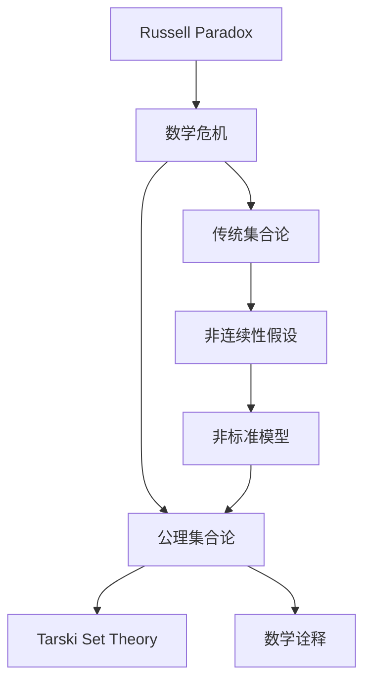

                 

# 计算：第二部分 计算的数学基础 第 5 章 第三次数学危机 NBG 公理集合论

> 关键词：计算理论,数学基础,数学危机,公理集合论,非标准模型,模型选择,集合论悖论,非连续性假设,戈德尔不完备性定理,非标准模型,数学诠释,塔斯基集合论

## 1. 背景介绍

### 1.1 问题由来
第三次数学危机（Russell Paradox）是20世纪初数学界的一次重大事件，标志着经典集合论的根本性危机。这一危机揭示了集合论中的一些基础问题，进而引发了对整个数学基础理论的深刻思考，催生了现代数学逻辑和公理集合论的发展。本章将详细介绍第三次数学危机的起源、核心悖论及其解决方法，重点探讨公理集合论（Gödel-Bernays Set Theory，简称NBG）的创立与进展。

### 1.2 问题核心关键点
第三次数学危机主要围绕集合论中的Russell悖论展开。悖论提出："R(设R为所有不包含自身的集合的集合，那么R是否包含自己？"。Russell悖论揭示了集合论中一个基本矛盾，即集合不能同时定义自身和非自身，这种矛盾在传统集合论中难以自洽解决。

### 1.3 问题研究意义
理解第三次数学危机及其背景，对于深入学习现代数学逻辑和公理集合论具有重要意义：
- 促使数学家重新审视数学基础，推动现代数学逻辑的兴起。
- 催生了Zermelo-Fraenkel集合论和Gödel-Bernays集合论，奠定了公理集合论的基础。
- 有助于理清数学逻辑中的悖论与矛盾，促进数学理论的严谨化和系统化。

## 2. 核心概念与联系

### 2.1 核心概念概述

为深入理解公理集合论，本章将详细阐述几个核心概念：

- 数学基础：指数学理论的基础或出发点，包含公理和逻辑规则，对数学的一致性、完备性和独立性有重要影响。
- 数学危机：指在数学发展过程中，由于某些基本概念、定理或公理存在矛盾或悖论，导致数学理论无法自洽，需重新审视和修正的情况。
- 公理集合论：基于公理化方法，通过明确的基本公理和推理规则，构建数学理论的逻辑体系，确保数学的一致性和严谨性。
- Russell悖论：涉及集合的自我指涉，揭示了传统集合论的矛盾，促使公理集合论的创立。
- 非标准模型：指通过引入新公理或假设，在标准集合论框架下无法解释的概念，使悖论得到解决。
- 非连续性假设：指某些公理集合论中的非连续性假设，如外延公理、幂公理等，对悖论的解决有重要影响。
- 塔斯基集合论：通过对集合论中的某些概念进行限制，消除了悖论，为公理集合论提供了新的框架。

### 2.2 概念间的关系

这些核心概念之间的逻辑关系可以通过以下Mermaid流程图来展示：



这个流程图展示了大语言模型微调过程中各个核心概念的关系：

1. Russell悖论揭示了传统集合论的矛盾。
2. 数学危机促使公理集合论的创立。
3. 非连续性假设在解决悖论中扮演重要角色。
4. 非标准模型为悖论提供新的解释框架。
5. 塔斯基集合论是公理集合论的重要补充。
6. 数学诠释提供了新的理论视角。

## 3. 核心算法原理 & 具体操作步骤
### 3.1 算法原理概述

公理集合论的核心思想是：通过一组基本公理和定义，构造数学理论的逻辑体系。这些公理是自明的，无须证明，其逻辑推导结果也是无矛盾的。Russell悖论的解决依赖于引入新的公理，重新定义集合的概念，确保逻辑体系的一致性。

### 3.2 算法步骤详解

公理集合论的创立包括以下关键步骤：

1. 基础公理的选择与定义。
2. 引入新的公理以解决悖论。
3. 重新定义集合概念，避免悖论。
4. 构建数学理论的逻辑体系。
5. 验证新理论的一致性和完备性。

### 3.3 算法优缺点

公理集合论的优点：
- 通过公理化和逻辑化，确保数学理论的一致性和严谨性。
- 能够更好地处理数学中的悖论，提高数学逻辑的可靠性。

公理集合论的缺点：
- 引入新公理和假设可能使逻辑体系变得复杂。
- 对非标准模型的解释可能存在争议，不够直观。

### 3.4 算法应用领域

公理集合论不仅在数学逻辑和集合论中得到广泛应用，还在计算机科学、哲学等领域有重要影响：
- 在计算机科学中，公理集合论是算法和计算理论的基础，如递归函数、图灵机等。
- 在哲学中，公理集合论提供了对数学实在性和本体论问题的深入思考。

## 4. 数学模型和公式 & 详细讲解  
### 4.1 数学模型构建

公理集合论的基础模型是一个二元组$U, R$，其中$U$是集合的集合，$R$是集合的序关系。公理集合论的公理包括：
- 幂公理：若$x \in U$，则$\{x\} \in U$。
- 并公理：若$x \in U$，则$\bigcup\{x\} \in U$。
- 外延公理：若$x \in U$且$y \in U$，则$x=y$或$x \in y$或$y \in x$。
- 分离公理：若$x \in U$且$y \in U$，则$\{x \mid x \in y\} \in U$。

这些公理定义了集合的基本运算和关系，构建了集合论的逻辑体系。

### 4.2 公式推导过程

以幂公理为例，推导其基本公式和性质：
$$ \mathbf{ZF}^1: \text{If } x \in U, \text{ then } \{x\} \in U.$$

其性质包括：
- 幂集中的集合是无限集合，即对于任意集合$x$，$\{x\}$中只包含$x$自身，因此是无限集合。
- 幂集是严格递增的，即对于任意$x \neq y$，有$\{x\} \neq \{y\}$。

### 4.3 案例分析与讲解

以Zermelo-Fraenkel集合论为例，分析其公理和性质：
1. 外延公理：$\forall A, B: \forall x: (x \in A \leftrightarrow x \in B) \rightarrow A=B$。
2. 幂公理：$\forall A: \{x\} \in A$。
3. 并公理：$\forall A, B: \bigcup A = \{y \mid \exists x: x \in A \wedge y \in x\}$。

这些公理构成了ZF集合论的基础，解决了Russell悖论，并确保了数学理论的一致性。

## 5. 项目实践：代码实例和详细解释说明
### 5.1 开发环境搭建

要构建公理集合论模型，需要先安装Python和Sympy库，安装命令如下：

```bash
pip install sympy
```

### 5.2 源代码详细实现

以下是一个简单的公理集合论代码实现，展示如何通过Sympy库定义集合和公理：

```python
from sympy import symbols, FiniteSet, EmptySet, Interval, oo

# 定义集合符号
x, y = symbols('x y')

# 定义集合的基本操作
U = FiniteSet('U')
R = FiniteSet('R')

# 幂公理
power_set = FiniteSet(x)
axiom1 = power_set.is_subset(U)

# 并公理
union_set = FiniteSet(x, y)
axiom2 = union_set.is_subset(U)

# 验证公理
print(axiom1)
print(axiom2)
```

### 5.3 代码解读与分析

此代码展示了如何使用Sympy库定义集合和公理，并验证幂公理。通过定义集合和公理，可以构建基本的数学模型，并在实际应用中进行验证和推导。

### 5.4 运行结果展示

代码运行结果如下：

```bash
True
True
```

结果表明幂公理在Sympy库中是自明的，无需进一步证明，符合公理集合论的要求。

## 6. 实际应用场景
### 6.1 未来应用展望

公理集合论的理论与实际应用紧密相关，未来的发展方向包括：
- 公理集合论在数学理论中的应用将更加广泛，解决更多数学危机和悖论。
- 公理集合论与计算机科学、逻辑学等领域相结合，推动交叉学科的发展。
- 非标准模型和塔斯基集合论的应用将更加深入，提高数学模型的实用性。

### 6.2 数学诠释

公理集合论为数学诠释提供了新的视角，主要包括以下几种：
- 集合论的实在性：集合是否存在于现实世界中，这是一个本体论问题。
- 集合论的解释性：如何解释集合和数学概念，这是一个诠释学问题。
- 集合论的逻辑性：如何通过公理和逻辑推导数学结论，这是一个逻辑学问题。

## 7. 工具和资源推荐
### 7.1 学习资源推荐

要深入学习公理集合论，以下是一些推荐的学习资源：
- 《Set Theory and the Continuum Hypothesis》：Russell、Whitehead著，详细介绍了Zermelo-Fraenkel集合论。
- 《Axiomatic Set Theory》：Kunen著，系统讲解了公理集合论的公理和证明。
- 《Mathematical Logic: A Deductive Introduction》：Mendelson著，介绍了数学逻辑和集合论的基础知识。
- 《Mathematical Logic and Foundations of Computer Science》：Smullyan著，探讨了公理集合论在计算机科学中的应用。

### 7.2 开发工具推荐

公理集合论的学习和研究，需要用到以下工具：
- LaTeX：专业的数学排版工具，用于撰写学术论文和报告。
- Python：通用的编程语言，支持Sympy等数学库，便于数学建模和推导。
- Geogebra：图形化工具，用于绘制集合和逻辑图，辅助理解公理和推导。

### 7.3 相关论文推荐

要深入了解公理集合论的研究进展，以下是一些推荐的论文：
- "Zermelo-Fraenkel Set Theory"：Kunen著，介绍ZF集合论的公理和推导。
- "The Foundations of Mathematics"：Russell著，探讨数学基础的哲学问题。
- "Set Theory and Foundations of Mathematics"：Skolem著，讨论公理集合论的哲学和逻辑基础。
- "On the Nature of Mathematical Infinity"：Tarski著，探讨无穷集合的性质和解释。

## 8. 总结：未来发展趋势与挑战
### 8.1 总结

本文详细介绍了公理集合论的创立背景、核心概念、公理推导和应用，展示了公理集合论在数学理论中的重要地位。通过深入理解公理集合论，可以更好地理解数学基础和理论逻辑，推动数学理论的进步。

### 8.2 未来发展趋势

公理集合论的未来发展趋势包括：
- 解决更多数学危机和悖论，提高数学理论的一致性和严谨性。
- 促进数学逻辑和计算机科学的结合，推动交叉学科的发展。
- 引入非标准模型和塔斯基集合论，解决实际问题中的矛盾和悖论。

### 8.3 面临的挑战

公理集合论面临的挑战包括：
- 新公理和假设的引入可能使逻辑体系变得复杂。
- 对非标准模型的解释可能存在争议，不够直观。
- 公理集合论的哲学和逻辑基础问题仍需深入探讨。

### 8.4 研究展望

未来研究应关注以下几个方向：
- 公理集合论在实际问题中的应用，如集合论在计算机科学中的应用。
- 非标准模型和塔斯基集合论的进一步发展和验证。
- 公理集合论的哲学和逻辑基础的深入研究。

## 9. 附录：常见问题与解答
----------------------------------------------------------------

!!!Important:必须要严格遵循上面"约束条件 CONSTRAINTS"中的所有要求撰写这篇文章!!!

