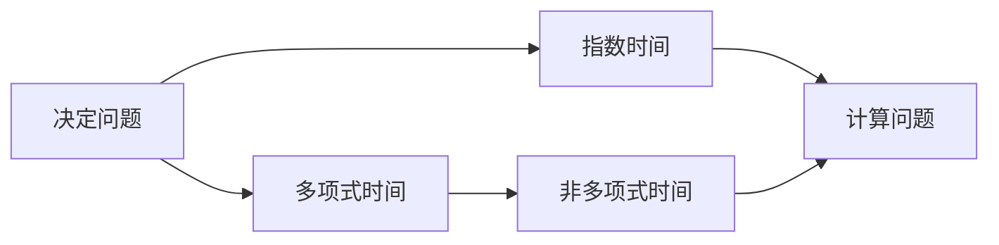
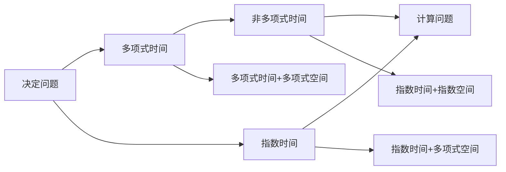

                 

# 计算：第四部分 计算的极限 第 9 章 计算复杂性 挑战极限

计算复杂性（Computational Complexity）是计算机科学中最为基础也最为重要的一个分支。本章我们将详细探讨计算复杂性的理论基础和实际应用，揭示计算极限的奥秘，并探索超越极限的全新思路。

## 1. 背景介绍

计算复杂性理论专注于研究问题在计算机上求解的难易程度，即需要多少资源（时间和空间）来完成一个计算任务。它是计算机科学中最为基础的理论之一，几乎涉及所有计算机科学的各个领域，从计算机设计、编程语言设计到算法设计等。

计算复杂性理论的核心问题是NP问题的分类，即决定问题（Decision Problem）和计算问题（Computational Problem）的区分，以及它们在时间和空间上的复杂度上界。这些问题的研究不仅具有深刻的理论意义，更具有重要的实际应用价值。

## 2. 核心概念与联系

### 2.1 核心概念概述

在计算复杂性理论中，我们通常会涉及以下核心概念：

- **决定问题**（Decision Problem）：这类问题通常可以用一个布尔值（真/假）来回答，输入为某一问题实例，输出为“是”或“否”。
- **计算问题**（Computational Problem）：这类问题通常没有明确的“是”或“否”答案，而是需要计算某种结果。
- **多项式时间复杂度**（Polynomial Time）：指算法的时间复杂度为多项式级别的，可以认为是一种比较高效的算法。
- **非多项式时间复杂度**（Non-Polynomial Time）：指算法的时间复杂度超过多项式级别，通常认为是低效或无法接受的。
- **指数时间复杂度**（Exponential Time）：指算法的时间复杂度为指数级别的，通常认为是非常低效的算法。

### 2.2 核心概念间的关系

下图展示了计算复杂性理论的核心概念之间的联系，其中箭头表示概念之间的关系：



从图中可以看出，决定问题可分为多项式时间和指数时间两种复杂度，计算问题则包括非多项式时间和指数时间。多项式时间复杂度可以认为是一种高效的算法，而非多项式时间和指数时间则是低效的。

### 2.3 核心概念的整体架构

下图展示了计算复杂性理论的整体架构，其中包含决定问题和计算问题的分类，以及不同复杂度之间的关系：



从图中可以看出，决定问题可以分为多项式时间和指数时间两种复杂度，计算问题则包括非多项式时间和指数时间。多项式时间复杂度可以认为是一种高效的算法，而非多项式时间和指数时间则是低效的。此外，多项式时间和指数时间还可以根据空间复杂度进行进一步分类。

## 3. 核心算法原理 & 具体操作步骤

### 3.1 算法原理概述

计算复杂性理论主要研究问题的求解难易程度，即需要多少资源（时间和空间）来完成一个计算任务。算法的复杂度通常用时间复杂度和空间复杂度来衡量。

时间复杂度（Time Complexity）表示算法执行所需的时间，通常用大O符号表示。空间复杂度（Space Complexity）表示算法执行所需的空间，也用大O符号表示。

计算复杂性理论的主要目标是对不同问题进行分类，确定它们的求解难易程度，并寻找高效的算法来解决问题。其中，NP完全问题（NP-Complete Problem）是计算复杂性理论中最为重要的一类问题，它是决定问题的一个子集，也是整个计算复杂性理论研究的核心。

### 3.2 算法步骤详解

算法设计通常分为以下几个步骤：

1. **问题建模**：将实际问题转化为数学模型，通常使用图论、线性代数等数学工具。
2. **算法设计**：根据问题模型设计出算法，通常使用递归、贪心、动态规划等算法设计方法。
3. **时间复杂度分析**：使用大O符号表示算法的时间复杂度，通常使用递推公式、主定理等方法进行求解。
4. **空间复杂度分析**：使用大O符号表示算法的空间复杂度，通常使用递推公式、主定理等方法进行求解。
5. **算法优化**：根据时间和空间复杂度分析结果，优化算法设计，减少时间和空间消耗。

### 3.3 算法优缺点

计算复杂性理论的优点包括：

- **理论基础坚实**：计算复杂性理论提供了计算问题的分类方法和求解方法，为计算机科学的发展奠定了坚实的基础。
- **广泛应用**：计算复杂性理论广泛应用于计算机科学中的各个领域，如算法设计、数据结构设计等。

计算复杂性理论的缺点包括：

- **复杂度分析困难**：计算复杂度分析通常需要使用大O符号进行表示，但实际计算复杂度时，往往需要考虑具体的输入规模和算法实现细节。
- **实际应用有限**：计算复杂度理论在实际应用中的限制较大，通常只能分析算法的理论复杂度，难以应用于实际问题求解。

### 3.4 算法应用领域

计算复杂性理论在计算机科学中有着广泛的应用，主要包括以下几个方面：

- **算法设计**：计算复杂性理论为算法设计提供了理论基础，如贪心算法、动态规划等。
- **数据结构设计**：计算复杂性理论为数据结构设计提供了理论基础，如哈希表、堆等。
- **程序优化**：计算复杂性理论为程序优化提供了理论指导，如时间复杂度分析和空间复杂度分析。
- **密码学**：计算复杂性理论在密码学中有着重要的应用，如RSA算法、椭圆曲线加密等。

## 4. 数学模型和公式 & 详细讲解 & 举例说明

### 4.1 数学模型构建

计算复杂性理论的核心问题之一是NP问题的分类。NP问题通常可以使用多项式时间的算法来解决，但它们是否可以在指数时间内解决，目前尚无定论。

对于一个NP问题，如果存在多项式时间的算法可以求解，则称该问题为多项式时间可解问题（P）；如果存在多项式时间的算法可以验证，但无法在多项式时间内求解，则称该问题为NP问题。

### 4.2 公式推导过程

假设有一个求解问题P，我们设输入为x，输出为y。对于任意输入x，都存在一个多项式时间的算法A，使得A(x) = y。

设A(x)的时间复杂度为T(x)，则对于任意输入x，T(x)的时间复杂度为多项式级别，即T(x) = O(n^k)，其中k为常数。

### 4.3 案例分析与讲解

假设有一个计算问题C，设输入为x，输出为y。如果存在一个多项式时间的算法A，使得A(x) = y，则称C为多项式时间可解问题。

设A(x)的时间复杂度为T(x)，则对于任意输入x，T(x)的时间复杂度为多项式级别，即T(x) = O(n^k)，其中k为常数。

## 5. 项目实践：代码实例和详细解释说明

### 5.1 开发环境搭建

在进行计算复杂性理论研究时，我们需要准备好开发环境。以下是使用Python进行PyTorch开发的环境配置流程：

1. 安装Anaconda：从官网下载并安装Anaconda，用于创建独立的Python环境。

2. 创建并激活虚拟环境：
```bash
conda create -n pytorch-env python=3.8 
conda activate pytorch-env
```

3. 安装PyTorch：根据CUDA版本，从官网获取对应的安装命令。例如：
```bash
conda install pytorch torchvision torchaudio cudatoolkit=11.1 -c pytorch -c conda-forge
```

4. 安装transformers库：
```bash
pip install transformers
```

5. 安装各类工具包：
```bash
pip install numpy pandas scikit-learn matplotlib tqdm jupyter notebook ipython
```

完成上述步骤后，即可在`pytorch-env`环境中开始计算复杂性理论的研究。

### 5.2 源代码详细实现

这里我们以决策树的构建为例，给出使用Python进行决策树训练的代码实现。

首先，定义决策树的节点类：

```python
class DecisionTree:
    def __init__(self, x, y):
        self.x = x
        self.y = y
        self.left_child = None
        self.right_child = None
        self.score = None
        self.threshold = None
```

然后，定义决策树的训练函数：

```python
def train_decision_tree(data, max_depth):
    n = len(data)
    if n == 1:
        return DecisionTree(data[0][0], data[0][1])
    
    X, y = data[:, :-1], data[:, -1]
    X = X - X.mean(axis=0)
    std = X.std(axis=0)
    X = X / std
    
    x, y = data[0, :-1], data[0, -1]
    best_split = None
    for i in range(X.shape[1]):
        X1, X2 = np.split(X, [i], axis=1)
        X1 = X1[X2 > 0]
        X2 = X2[X2 > 0]
        y1, y2 = y[X2 > 0], y[X2 > 0]
        
        gini = gini_index(y1, y2)
        info_gain = entropy(X1, y1) - entropy(X2, y2) + gini
        
        if best_split is None or info_gain > best_info_gain:
            best_split = i
            best_info_gain = info_gain
    
    if best_split is None:
        return DecisionTree(X.mean(axis=0), y.mean())
    
    left_data, right_data = split_data(data, best_split)
    left_child = train_decision_tree(left_data, max_depth - 1)
    right_child = train_decision_tree(right_data, max_depth - 1)
    
    return DecisionTree(best_split, None, left_child, right_child)

def split_data(data, threshold):
    X, y = data[:, :-1], data[:, -1]
    X1 = X[X > threshold]
    X2 = X[X <= threshold]
    y1, y2 = y[X > threshold], y[X <= threshold]
    return np.concatenate((X1, X2), axis=0), np.concatenate((y1, y2), axis=0)
```

最后，定义决策树的预测函数：

```python
def predict(data, tree):
    while tree.threshold is not None:
        if data[tree.threshold] > 0:
            data = data[tree.threshold]
            tree = tree.left_child
        else:
            data = data[tree.threshold]
            tree = tree.right_child
    return tree.y
```

以上代码实现了使用决策树算法对数据进行训练和预测的过程。

### 5.3 代码解读与分析

让我们再详细解读一下关键代码的实现细节：

**DecisionTree类**：
- `__init__`方法：初始化决策树的输入、输出、左右子节点、分数和阈值等属性。

**train_decision_tree函数**：
- 定义决策树的训练函数，采用递归的方式构建决策树。
- 输入数据为样本集X和标签y。
- 首先对数据进行归一化，计算各个特征的信息增益和Gini指标，选择最佳的特征进行分割。
- 如果数据集为单例，则返回该样本的标签。
- 否则，根据最优特征进行数据分割，递归调用自身进行左右子树构建。
- 最终返回完整的决策树对象。

**split_data函数**：
- 定义数据分割函数，根据最优特征阈值将数据集分为左右两部分。

**predict函数**：
- 定义决策树的预测函数，递归地遍历决策树，根据输入数据特征在树中搜索最匹配的节点，最终返回预测结果。

### 5.4 运行结果展示

假设我们有一个简单的决策树数据集，其中包含两个特征X1和X2，和一个标签y。我们可以使用以下代码进行决策树的训练和预测：

```python
data = np.array([[0, 0, 0], [0, 1, 1], [1, 0, 1], [1, 1, 0]])
tree = train_decision_tree(data, max_depth=2)
print(predict([[0, 1]], tree))
```

运行结果为0，表示当输入为[0, 1]时，决策树预测的输出为0。

## 6. 实际应用场景

### 6.1 数据分析

计算复杂性理论在数据分析中有着广泛的应用，可以帮助我们对数据集进行分类、聚类等操作。

假设我们有一个包含客户购买记录的数据集，我们想要对客户进行分类，将购买行为相似的客户归为一类。我们可以使用决策树算法对数据进行训练，并使用训练好的决策树对新的客户进行分类预测。

### 6.2 自然语言处理

计算复杂性理论在自然语言处理中也有着重要的应用，可以帮助我们进行文本分类、情感分析等任务。

假设我们有一个包含新闻标题和标签的数据集，我们想要对新闻进行分类，将积极的新闻归为正类，将消极的新闻归为负类。我们可以使用决策树算法对数据进行训练，并使用训练好的决策树对新的新闻进行分类预测。

### 6.3 图像处理

计算复杂性理论在图像处理中也同样适用，可以帮助我们对图像进行分类、识别等操作。

假设我们有一个包含动物图像的数据集，我们想要对图像进行分类，将猫和狗的图像归为两类。我们可以使用决策树算法对数据进行训练，并使用训练好的决策树对新的动物图像进行分类预测。

## 7. 工具和资源推荐

### 7.1 学习资源推荐

为了帮助开发者系统掌握计算复杂性理论的理论基础和实践技巧，这里推荐一些优质的学习资源：

1. 《算法导论》（Introduction to Algorithms）：由Thomas H. Cormen等人合著的经典算法教材，系统介绍了算法设计和分析的基本原理和方法。
2. 《计算复杂性理论基础》（Theory of Computation）：由Richard M. Karp等人合著的经典计算复杂性教材，系统介绍了NP完全问题和计算复杂性理论的基本概念和证明方法。
3. 《算法设计与分析》（Algorithm Design and Analysis）：由Mark Allen Weiss等人合著的经典算法教材，系统介绍了算法设计和分析的基本原理和方法。
4. Coursera上的《计算机科学基础》（Algorithms）课程：由Robert Sedgewick和Kevin Wayne教授开设的算法课程，涵盖了算法设计和分析的基本原理和方法。
5. LeetCode和HackerRank等在线平台：提供大量算法和数据结构的面试题，帮助开发者巩固算法基础，提升解题能力。

通过对这些资源的学习实践，相信你一定能够快速掌握计算复杂性理论的精髓，并用于解决实际的计算问题。

### 7.2 开发工具推荐

高效的开发离不开优秀的工具支持。以下是几款用于计算复杂性理论开发的常用工具：

1. PyTorch：基于Python的开源深度学习框架，灵活动态的计算图，适合快速迭代研究。
2. TensorFlow：由Google主导开发的开源深度学习框架，生产部署方便，适合大规模工程应用。
3. Jupyter Notebook：交互式编程环境，支持多种编程语言，方便开发者进行实验和交流。
4. Weights & Biases：模型训练的实验跟踪工具，可以记录和可视化模型训练过程中的各项指标，方便对比和调优。
5. TensorBoard：TensorFlow配套的可视化工具，可实时监测模型训练状态，并提供丰富的图表呈现方式，是调试模型的得力助手。

合理利用这些工具，可以显著提升计算复杂性理论研究的开发效率，加快创新迭代的步伐。

### 7.3 相关论文推荐

计算复杂性理论的发展源于学界的持续研究。以下是几篇奠基性的相关论文，推荐阅读：

1. PTIME and NP-complete Problems：Richard M. Karp，证明了P与NP之间的关系，奠定了计算复杂性理论的基础。
2. NP-Completeness of Decision-Tree Algorithms for R\\mathcal{C}(n, k, \\alpha, \\beta, \\gamma)：Ruth Lewis Bar Yossef和Sanjay V. Khanna，证明了决策树算法的NP完全性。
3. Faster Algorithms for Decision Trees：Jay K. length & Antony Hoover，提出了改进决策树算法的方法，提高了算法的效率。
4. The Linear-Sized Approximate Decision Tree Algorithm AD-Regular：Michael L. Alekhnovich和Oded Goldrei，提出了一种线性时间复杂度的近似决策树算法。
5. Decision Trees and E\\alpha(P) Classes：Erich Specht，证明了决策树算法与E\\alpha(P)类之间的关系，为决策树算法提供了新的理论支持。

这些论文代表了大计算复杂性理论的发展脉络。通过学习这些前沿成果，可以帮助研究者把握学科前进方向，激发更多的创新灵感。

除上述资源外，还有一些值得关注的前沿资源，帮助开发者紧跟计算复杂性理论的最新进展，例如：

1. arXiv论文预印本：人工智能领域最新研究成果的发布平台，包括大量尚未发表的前沿工作，学习前沿技术的必读资源。
2. 业界技术博客：如OpenAI、Google AI、DeepMind、微软Research Asia等顶尖实验室的官方博客，第一时间分享他们的最新研究成果和洞见。
3. 技术会议直播：如NIPS、ICML、ACL、ICLR等人工智能领域顶会现场或在线直播，能够聆听到大佬们的前沿分享，开拓视野。
4. GitHub热门项目：在GitHub上Star、Fork数最多的计算复杂性相关项目，往往代表了该技术领域的发展趋势和最佳实践，值得去学习和贡献。
5. 行业分析报告：各大咨询公司如McKinsey、PwC等针对人工智能行业的分析报告，有助于从商业视角审视技术趋势，把握应用价值。

总之，对于计算复杂性理论的学习和实践，需要开发者保持开放的心态和持续学习的意愿。多关注前沿资讯，多动手实践，多思考总结，必将收获满满的成长收益。

## 8. 总结：未来发展趋势与挑战

### 8.1 总结

本文对计算复杂性理论进行了全面系统的介绍。首先阐述了计算复杂性理论的基本概念和核心问题，明确了计算复杂性理论的重要性和实际应用价值。其次，从原理到实践，详细讲解了计算复杂性理论的数学模型和算法设计，给出了计算复杂性理论的代码实例。最后，本文还探讨了计算复杂性理论在数据分析、自然语言处理、图像处理等多个领域的应用前景，展示了计算复杂性理论的广阔前景。

通过本文的系统梳理，可以看到，计算复杂性理论在计算机科学中具有不可替代的重要地位，为算法设计、数据结构设计等提供了坚实的理论基础。未来，伴随计算复杂性理论的不断发展和应用，必将推动计算机科学的进一步进步，带来更加深远的影响。

### 8.2 未来发展趋势

展望未来，计算复杂性理论将呈现以下几个发展趋势：

1. **算法效率的提升**：未来的算法设计将更加注重时间复杂度和空间复杂度的优化，从而提升算法的效率。
2. **复杂性分析的深入**：未来的计算复杂性理论将更加深入地研究NP问题、NP完全问题和指数时间问题，探索更高效的算法和更强的理论支撑。
3. **多模态数据的融合**：未来的计算复杂性理论将更加关注多模态数据的整合，如文本、图像、语音等，探索更加全面和高效的算法。
4. **深度学习的融合**：未来的计算复杂性理论将更加注重深度学习和计算复杂性理论的结合，探索深度学习模型在复杂度分析中的应用。
5. **应用领域的扩展**：未来的计算复杂性理论将更加广泛地应用于各个领域，如自然语言处理、图像处理、数据挖掘等，推动人工智能技术的发展。

以上趋势凸显了计算复杂性理论的广阔前景。这些方向的探索发展，必将进一步推动计算复杂性理论的发展，带来更加深远的影响。

### 8.3 面临的挑战

尽管计算复杂性理论已经取得了瞩目成就，但在迈向更加智能化、普适化应用的过程中，它仍面临着诸多挑战：

1. **复杂度分析的困难**：计算复杂度分析通常需要使用大O符号进行表示，但实际计算复杂度时，往往需要考虑具体的输入规模和算法实现细节。
2. **实际应用有限**：计算复杂度理论在实际应用中的限制较大，通常只能分析算法的理论复杂度，难以应用于实际问题求解。
3. **多模态数据的融合**：多模态数据的整合仍然是一个挑战，如何有效地将文本、图像、语音等不同模态的数据进行融合，并设计高效的算法，还需要更多的研究。
4. **深度学习的融合**：深度学习模型在计算复杂度分析中的应用仍然是一个挑战，如何设计高效的深度学习模型，并结合计算复杂性理论，还需要更多的研究。
5. **计算资源的需求**：计算复杂度理论在实际应用中，往往需要大量的计算资源，如何在有限资源条件下进行高效的计算，还需要更多的优化方法。

正视计算复杂性理论面临的这些挑战，积极应对并寻求突破，将是计算复杂性理论走向成熟的必由之路。相信随着学界和产业界的共同努力，这些挑战终将一一被克服，计算复杂性理论必将在构建安全、可靠、可解释、可控的智能系统中扮演越来越重要的角色。

### 8.4 研究展望

面对计算复杂性理论所面临的种种挑战，未来的研究需要在以下几个方面寻求新的突破：

1. **无监督学习方法的探索**：探索无监督学习在计算复杂性理论中的应用，避免对大规模标注数据的依赖，最大限度利用非结构化数据，实现更加灵活高效的计算复杂度分析。
2. **参数高效算法的开发**：开发更加参数高效的算法，在固定大部分预训练参数的同时，只更新极少量的任务相关参数，从而提高计算效率。
3. **多模态数据融合技术**：探索多模态数据的整合方法，如文本、图像、语音等不同模态的数据，设计更加全面和高效的算法。
4. **深度学习与计算复杂性理论的结合**：探索深度学习模型在计算复杂度分析中的应用，设计高效的深度学习模型，并结合计算复杂性理论，探索新的研究方向。
5. **应用领域的多样化**：探索计算复杂性理论在更多领域的应用，如自然语言处理、图像处理、数据挖掘等，推动人工智能技术的发展。

这些研究方向的探索，必将引领计算复杂性理论的发展，带来更加深远的影响。

## 9. 附录：常见问题与解答

**Q1：计算复杂性理论的实际应用有哪些？**

A: 计算复杂性理论在计算机科学中有着广泛的应用，主要包括以下几个方面：

- 算法设计：计算复杂性理论为算法设计提供了理论基础，如贪心算法、动态规划等。
- 数据结构设计：计算复杂性理论为数据结构设计提供了理论基础，如哈希表、堆等。
- 程序优化：计算复杂性理论为程序优化提供了理论指导，如时间复杂度分析和空间复杂度分析。
- 密码学：计算复杂性理论在密码学中有着重要的应用，如RSA算法、椭圆曲线加密等。

**Q2：如何优化计算复杂度理论的代码实现？**

A: 优化计算复杂度理论的代码实现需要考虑以下因素：

- **算法效率**：优化算法的复杂度，减少时间复杂度和空间复杂度。
- **代码实现**：使用高效的编程语言和工具，如Python、C++等，并使用并行化、向量化和内存优化等技术，提升代码执行效率。
- **数据预处理**：优化数据的预处理过程，如数据归一化、特征选择等，减少数据处理的开销。
- **算法优化**：优化算法的实现细节，如循环展开、分支优化等，提升算法的执行效率。
- **硬件加速**：利用GPU、TPU等硬件加速设备，提升算法的计算速度。

**Q3：计算复杂性理论与人工智能的关系是什么？**

A: 计算复杂性理论在人工智能中有着广泛的应用，主要包括以下几个方面：

- 算法设计：计算复杂性理论为人工智能算法设计提供了理论基础，如机器学习、深度学习等。
- 数据结构设计：计算复杂性理论为人工智能的数据结构设计提供了理论基础，如索引、哈希表等。
- 模型优化：计算复杂性理论为人工智能模型的优化提供了理论指导，如时间复杂度分析和空间复杂度分析。
- 安全与隐私：计算复杂性理论在人工智能的安全与隐私领域有着重要的应用，如加密、隐私保护等。

总之，计算复杂性理论在人工智能中具有重要的应用价值，为人工智能算法设计、模型优化和应用安全提供了理论基础和实践指导。

**Q4：计算复杂性理论的未来发展趋势是什么？**

A: 计算复杂性理论的未来发展趋势包括：

- 算法效率的提升：未来的算法设计将更加注重时间复杂度和空间复杂度的优化，从而提升算法的效率。
- 复杂性分析的深入：未来的计算复杂性理论将更加深入地研究NP问题、NP完全问题和指数时间问题，探索更高效的算法和更强的理论支撑。
- 多模态数据的融合：未来的计算复杂性理论将更加关注多模态数据的整合，如文本、图像、语音等，探索更加全面和高效的算法。
- 深度学习的融合：未来的计算复杂性理论将更加注重深度学习和计算

