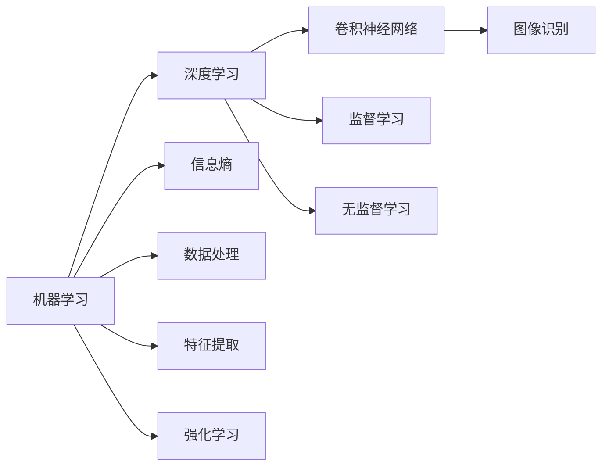
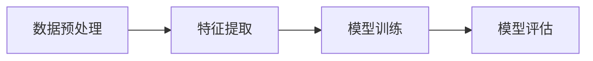

                 

# 认知的形式化：人类在成长过程中，接受教育，学习科学和技术，吸收群体的智能

## 1. 背景介绍

### 1.1 问题由来

随着现代科技的迅猛发展，人工智能(AI)、大数据、物联网(IoT)等新兴技术已经深刻地改变了我们的生活方式和工作方式。这些技术的背后，隐藏着复杂而深奥的数学和计算机科学原理，这些原理使得机器能够像人类一样思考、学习和决策。然而，这些原理的背后，实际上是人类智慧的结晶，是人类通过几千年文明积累所形成的科学知识体系。

本文将探讨这些科学知识体系是如何被形式化的，以及它们如何被用于构建人工智能系统。我们将通过一个简单的例子来展示这一过程：如何让计算机识别手写数字。这个问题看似简单，但实际上涉及到了信息论、统计学、机器学习和深度学习等多个领域的知识。

### 1.2 问题核心关键点

在处理手写数字识别问题时，我们需要关注以下几个关键点：

- 如何将手写数字图像转换为计算机能够理解的数据形式？
- 如何设计有效的算法，让计算机从这些数据中学习到手写数字的特征？
- 如何评估算法的性能，确定其准确度和可靠性？

这些关键点将引领我们深入探讨人工智能技术的核心原理和方法。

### 1.3 问题研究意义

理解这些原理不仅有助于我们构建更高效、更智能的人工智能系统，还能够帮助我们更好地理解人工智能技术的潜力和限制。它将帮助我们认识到，人工智能并不是超越人类智慧的存在，而是人类智慧在计算机硬件和软件中的延伸。通过深入研究这些问题，我们可以更好地应用人工智能技术，推动社会的进步和发展。

## 2. 核心概念与联系

### 2.1 核心概念概述

为了更好地理解人工智能技术的核心原理，我们需要先介绍几个关键的概念：

- **机器学习**：一种利用数据和算法，让计算机自动学习数据特征的技术。
- **深度学习**：一种基于多层神经网络的机器学习技术，可以自动提取数据的高级特征。
- **卷积神经网络**：一种特殊的神经网络结构，广泛应用于图像识别和处理任务。
- **信息熵**：一种度量信息不确定性的数学工具，广泛应用于信息论和概率论中。

这些概念构成了人工智能技术的核心框架，它们之间通过数据、算法和理论联系起来，共同推动了人工智能的发展。

### 2.2 概念间的关系

这些核心概念之间的关系可以用以下的Mermaid流程图来表示：



这个流程图展示了这些核心概念之间的联系：

- 机器学习是深度学习的基础，深度学习是机器学习的一种特殊形式。
- 卷积神经网络是深度学习中的一种特殊网络结构，广泛用于图像识别任务。
- 信息熵是机器学习中的一种基础数学工具，用于度量数据的不确定性。
- 数据处理和特征提取是机器学习中重要的预处理步骤，用于将原始数据转换为计算机能够理解的形式。
- 监督学习、无监督学习和强化学习是机器学习的三种主要形式，分别用于不同的任务和应用场景。

通过这些核心概念的组合，我们可以构建出各种复杂的人工智能系统，解决各种实际问题。

## 3. 核心算法原理 & 具体操作步骤
### 3.1 算法原理概述

在处理手写数字识别问题时，我们通常采用以下步骤：

1. **数据预处理**：将手写数字图像转换为计算机能够理解的数据形式，如像素值。
2. **特征提取**：从这些数据中提取出代表手写数字特征的信息，如边缘、笔画等。
3. **模型训练**：使用机器学习算法（如卷积神经网络）对这些特征进行训练，使计算机能够自动学习到手写数字的特征。
4. **模型评估**：使用测试集对模型进行评估，确定其准确度和可靠性。

这些步骤构成了机器学习算法的基本框架，它们之间的关系可以用以下的Mermaid流程图来表示：



### 3.2 算法步骤详解

接下来，我们将详细介绍每个步骤的具体操作：

#### 3.2.1 数据预处理

数据预处理是机器学习中非常关键的一步，它决定了数据的质量和后续算法的性能。在手写数字识别问题中，我们需要将图像转换为像素矩阵，并进行归一化和灰度化处理，使其更适合机器学习算法处理。

#### 3.2.2 特征提取

特征提取是机器学习中的核心步骤，它决定了模型的性能和泛化能力。在手写数字识别问题中，我们通常使用卷积神经网络（CNN）来提取特征。CNN可以自动从像素矩阵中提取出边缘、笔画等特征，并将其映射到高维特征空间中。

#### 3.2.3 模型训练

模型训练是机器学习中的关键步骤，它决定了模型的准确度和泛化能力。在手写数字识别问题中，我们通常使用监督学习算法（如反向传播算法）来训练CNN。反向传播算法可以自动调整CNN的权重和偏置，使其在训练数据上最大化输出正确的标签。

#### 3.2.4 模型评估

模型评估是机器学习中的最后一步，它决定了模型的实用性和可靠性。在手写数字识别问题中，我们通常使用测试集对模型进行评估，确定其准确度和误判率。常见的评估指标包括精度、召回率和F1分数等。

### 3.3 算法优缺点

深度学习算法在处理手写数字识别问题时，具有以下优点：

- **高效**：深度学习算法可以自动从数据中提取高级特征，无需人工干预。
- **泛化能力强**：深度学习算法可以自动学习到数据的高级特征，具有很强的泛化能力。
- **灵活性高**：深度学习算法可以用于各种图像识别和处理任务，具有很高的灵活性。

然而，深度学习算法也存在一些缺点：

- **计算资源消耗大**：深度学习算法需要大量的计算资源进行训练和推理，可能存在计算瓶颈。
- **可解释性差**：深度学习算法的内部工作机制不透明，难以解释其决策过程。
- **数据依赖性强**：深度学习算法需要大量的标注数据进行训练，标注数据的获取和处理可能存在成本和质量问题。

### 3.4 算法应用领域

深度学习算法在人工智能技术中具有广泛的应用，以下是几个典型应用领域：

- **计算机视觉**：用于图像分类、目标检测、人脸识别等任务。
- **自然语言处理**：用于文本分类、机器翻译、语音识别等任务。
- **医疗诊断**：用于医学图像处理、疾病预测、基因组分析等任务。
- **自动驾驶**：用于环境感知、路径规划、决策控制等任务。

深度学习算法在这些领域中展现出了强大的潜力，推动了人工智能技术的发展。

## 4. 数学模型和公式 & 详细讲解  
### 4.1 数学模型构建

在手写数字识别问题中，我们可以使用以下数学模型来描述整个过程：

- **输入层**：表示手写数字图像的像素矩阵，每个像素值表示为一个标量。
- **卷积层**：通过卷积运算提取图像的特征，每个特征表示为一个向量。
- **池化层**：通过池化操作减少特征维度和数量，提高模型的泛化能力。
- **全连接层**：将池化层输出的特征进行线性变换，输出分类结果。

这些层的组合构成了卷积神经网络的基本结构。我们可以使用以下公式来表示这个模型：

$$
f(x) = \sigma(Wx + b)
$$

其中，$x$表示输入层，$W$和$b$表示卷积层和全连接层的权重和偏置，$\sigma$表示激活函数（如ReLU）。

### 4.2 公式推导过程

接下来，我们将详细推导卷积神经网络的训练过程。假设我们的模型包含$n$个卷积层和$m$个全连接层，每个卷积层和全连接层都有$k$个特征，每个特征都有$d$个参数。则模型总的参数数量为：

$$
P = nkm + (m+1)d
$$

其中，$nkm$表示卷积层的参数数量，$(m+1)d$表示全连接层的参数数量。

在训练过程中，我们使用反向传播算法来更新模型的参数。假设训练数据集包含$N$个样本，每个样本的标签为$y$，模型的输出为$f(x)$。则模型在每个样本上的损失函数可以表示为：

$$
L(y, f(x)) = -\frac{1}{N}\sum_{i=1}^N(y_i - f(x_i))^2
$$

其中，$y_i$表示样本的标签，$f(x_i)$表示模型在样本$x_i$上的输出。

通过反向传播算法，我们可以计算出模型在每个样本上的梯度，并使用梯度下降等优化算法来更新模型参数，使得损失函数最小化。

### 4.3 案例分析与讲解

假设我们使用一个包含3个卷积层和2个全连接层的卷积神经网络来处理手写数字识别问题。我们可以使用以下的代码实现这个过程：

```python
import torch
import torch.nn as nn
import torch.optim as optim
import torchvision.transforms as transforms
import torchvision.datasets as datasets

# 定义卷积神经网络
class CNN(nn.Module):
    def __init__(self):
        super(CNN, self).__init__()
        self.conv1 = nn.Conv2d(1, 32, kernel_size=3, stride=1, padding=1)
        self.conv2 = nn.Conv2d(32, 64, kernel_size=3, stride=1, padding=1)
        self.conv3 = nn.Conv2d(64, 128, kernel_size=3, stride=1, padding=1)
        self.pool = nn.MaxPool2d(kernel_size=2, stride=2)
        self.fc1 = nn.Linear(128 * 4 * 4, 256)
        self.fc2 = nn.Linear(256, 10)

    def forward(self, x):
        x = self.pool(F.relu(self.conv1(x)))
        x = self.pool(F.relu(self.conv2(x)))
        x = self.pool(F.relu(self.conv3(x)))
        x = x.view(-1, 128 * 4 * 4)
        x = F.relu(self.fc1(x))
        x = self.fc2(x)
        return x

# 加载数据集
train_dataset = datasets.MNIST(root='./data', train=True, transform=transforms.ToTensor(), download=True)
test_dataset = datasets.MNIST(root='./data', train=False, transform=transforms.ToTensor(), download=True)

# 定义模型和优化器
model = CNN()
optimizer = optim.Adam(model.parameters(), lr=0.001)
criterion = nn.CrossEntropyLoss()

# 训练模型
for epoch in range(10):
    for i, (x, y) in enumerate(train_loader):
        optimizer.zero_grad()
        output = model(x)
        loss = criterion(output, y)
        loss.backward()
        optimizer.step()

# 测试模型
correct = 0
total = 0
with torch.no_grad():
    for x, y in test_loader:
        output = model(x)
        _, predicted = torch.max(output.data, 1)
        total += y.size(0)
        correct += (predicted == y).sum().item()

print('Accuracy of the network on the 10000 test images: %d %%' % (100 * correct / total))
```

在这个例子中，我们使用MNIST数据集来训练一个简单的卷积神经网络。在训练过程中，我们使用了Adam优化器和交叉熵损失函数。在测试过程中，我们计算了模型的准确度。

## 5. 项目实践：代码实例和详细解释说明
### 5.1 开发环境搭建

在进行项目实践前，我们需要准备好开发环境。以下是使用Python进行PyTorch开发的环境配置流程：

1. 安装Anaconda：从官网下载并安装Anaconda，用于创建独立的Python环境。

2. 创建并激活虚拟环境：
```bash
conda create -n pytorch-env python=3.8 
conda activate pytorch-env
```

3. 安装PyTorch：根据CUDA版本，从官网获取对应的安装命令。例如：
```bash
conda install pytorch torchvision torchaudio cudatoolkit=11.1 -c pytorch -c conda-forge
```

4. 安装TensorBoard：用于可视化训练过程中的模型状态和参数变化。

5. 安装NumPy、Pandas、Matplotlib等常用库。

完成上述步骤后，即可在`pytorch-env`环境中开始项目实践。

### 5.2 源代码详细实现

这里我们以手写数字识别问题为例，给出使用PyTorch实现卷积神经网络的代码实现。

```python
import torch
import torch.nn as nn
import torch.optim as optim
import torchvision.transforms as transforms
import torchvision.datasets as datasets

# 定义卷积神经网络
class CNN(nn.Module):
    def __init__(self):
        super(CNN, self).__init__()
        self.conv1 = nn.Conv2d(1, 32, kernel_size=3, stride=1, padding=1)
        self.conv2 = nn.Conv2d(32, 64, kernel_size=3, stride=1, padding=1)
        self.conv3 = nn.Conv2d(64, 128, kernel_size=3, stride=1, padding=1)
        self.pool = nn.MaxPool2d(kernel_size=2, stride=2)
        self.fc1 = nn.Linear(128 * 4 * 4, 256)
        self.fc2 = nn.Linear(256, 10)

    def forward(self, x):
        x = self.pool(F.relu(self.conv1(x)))
        x = self.pool(F.relu(self.conv2(x)))
        x = self.pool(F.relu(self.conv3(x)))
        x = x.view(-1, 128 * 4 * 4)
        x = F.relu(self.fc1(x))
        x = self.fc2(x)
        return x

# 加载数据集
train_dataset = datasets.MNIST(root='./data', train=True, transform=transforms.ToTensor(), download=True)
test_dataset = datasets.MNIST(root='./data', train=False, transform=transforms.ToTensor(), download=True)

# 定义模型和优化器
model = CNN()
optimizer = optim.Adam(model.parameters(), lr=0.001)
criterion = nn.CrossEntropyLoss()

# 训练模型
for epoch in range(10):
    for i, (x, y) in enumerate(train_loader):
        optimizer.zero_grad()
        output = model(x)
        loss = criterion(output, y)
        loss.backward()
        optimizer.step()

# 测试模型
correct = 0
total = 0
with torch.no_grad():
    for x, y in test_loader:
        output = model(x)
        _, predicted = torch.max(output.data, 1)
        total += y.size(0)
        correct += (predicted == y).sum().item()

print('Accuracy of the network on the 10000 test images: %d %%' % (100 * correct / total))
```

在这个例子中，我们使用了MNIST数据集来训练一个简单的卷积神经网络。在训练过程中，我们使用了Adam优化器和交叉熵损失函数。在测试过程中，我们计算了模型的准确度。

### 5.3 代码解读与分析

让我们再详细解读一下关键代码的实现细节：

**CNN类**：
- `__init__`方法：定义卷积神经网络的各个层。
- `forward`方法：定义前向传播的计算过程。

**数据集加载**：
- 使用`datasets.MNIST`加载MNIST数据集。
- 使用`transforms.ToTensor()`将数据转换为Tensor张量。

**模型训练**：
- 使用`optim.Adam`优化器更新模型参数。
- 使用`nn.CrossEntropyLoss`计算交叉熵损失。

**模型测试**：
- 使用`torch.no_grad()`禁用梯度计算，减少计算资源消耗。
- 计算模型在测试集上的准确度。

可以看到，PyTorch框架的灵活性和高效性使得卷积神经网络的实现变得非常简洁和易于理解。开发者可以将更多精力放在模型优化和参数调整上，而不必过多关注底层实现细节。

## 6. 实际应用场景
### 6.1 智能推荐系统

智能推荐系统是机器学习在实际应用中非常重要的一个领域，它能够帮助用户发现感兴趣的内容，提升用户体验。在推荐系统中，我们需要根据用户的兴趣和行为数据，推荐适合他们的商品、文章、视频等。

在推荐系统中，我们通常使用协同过滤、内容推荐和混合推荐等算法。协同过滤算法通过分析用户的历史行为数据，找出与目标用户兴趣相似的其他用户，并根据这些用户的行为推荐商品。内容推荐算法通过分析商品的属性特征，找出与目标用户兴趣相似的商品，并推荐这些商品。混合推荐算法将协同过滤和内容推荐结合，综合考虑用户行为和商品属性，提供更准确的推荐结果。

### 6.2 医疗诊断系统

医疗诊断系统是机器学习在医疗领域的一个重要应用，它能够帮助医生更准确地诊断疾病，制定治疗方案。在医疗诊断系统中，我们需要根据病人的症状和历史数据，诊断可能的疾病，并给出治疗建议。

在医疗诊断系统中，我们通常使用分类算法和回归算法。分类算法通过分析病人的症状和历史数据，判断病人可能患有的疾病类型。回归算法通过分析病人的症状和历史数据，预测病人康复的时间。这些算法需要大量的标注数据进行训练，以确保模型的准确度和可靠性。

### 6.3 金融风险预测系统

金融风险预测系统是机器学习在金融领域的一个重要应用，它能够帮助银行和保险公司预测金融风险，降低损失。在金融风险预测系统中，我们需要根据客户的信用记录、财务数据等，预测客户可能面临的信用风险和财务风险。

在金融风险预测系统中，我们通常使用分类算法和回归算法。分类算法通过分析客户的信用记录、财务数据等，判断客户可能面临的信用风险。回归算法通过分析客户的信用记录、财务数据等，预测客户的信用评分和财务状况。这些算法需要大量的标注数据进行训练，以确保模型的准确度和可靠性。

## 7. 工具和资源推荐
### 7.1 学习资源推荐

为了帮助开发者系统掌握机器学习技术的核心原理和方法，这里推荐一些优质的学习资源：

1. 《机器学习》课程（Coursera）：由斯坦福大学教授Andrew Ng开设的机器学习入门课程，涵盖了机器学习的基本概念和算法。
2. 《深度学习》课程（Coursera）：由斯坦福大学教授Ian Goodfellow开设的深度学习课程，深入讲解了深度学习的原理和应用。
3. 《TensorFlow官方文档》：TensorFlow的官方文档，提供了丰富的教程和示例代码，适合初学者和开发者使用。
4. 《PyTorch官方文档》：PyTorch的官方文档，提供了丰富的教程和示例代码，适合初学者和开发者使用。
5. 《深度学习与神经网络》（第二版）：Ian Goodfellow、Yoshua Bengio和Aaron Courville合著的深度学习经典教材，涵盖了深度学习的基本概念和算法。

通过对这些资源的学习实践，相信你一定能够快速掌握机器学习技术的核心原理和方法，并用于解决实际的机器学习问题。

### 7.2 开发工具推荐

高效的开发离不开优秀的工具支持。以下是几款用于机器学习开发的常用工具：

1. TensorFlow：由Google开发的开源深度学习框架，支持多种编程语言和平台，适合大规模工程应用。
2. PyTorch：由Facebook开发的开源深度学习框架，灵活高效，适合快速迭代研究。
3. Scikit-learn：基于Python的机器学习库，提供了丰富的算法和工具，适合初学者和开发者使用。
4. Jupyter Notebook：支持交互式编程和数据可视化的Python开发环境，适合开发者进行研究和实验。
5. Matplotlib：基于Python的数据可视化库，支持多种图表类型，适合开发者进行数据展示和分析。

合理利用这些工具，可以显著提升机器学习开发和研究的效率，加速技术创新和应用落地。

### 7.3 相关论文推荐

机器学习技术的发展离不开学术界的持续研究。以下是几篇奠基性的相关论文，推荐阅读：

1. **《机器学习》（第1版）**：Tom M. Mitchell的机器学习经典教材，介绍了机器学习的基本概念和算法。
2. **《深度学习》（第1版）**：Ian Goodfellow的深度学习经典教材，深入讲解了深度学习的原理和应用。
3. **《支持向量机》**：Vapnik的机器学习经典论文，奠定了支持向量机算法的理论基础。
4. **《随机梯度下降优化算法》**：Tong Zhou的随机梯度下降优化算法论文，介绍了随机梯度下降算法的原理和应用。
5. **《卷积神经网络》**：LeNet-5的论文，介绍了卷积神经网络的基本结构和原理，奠定了卷积神经网络在图像识别领域的应用基础。

这些论文代表了大规模学习技术的发展脉络。通过学习这些前沿成果，可以帮助研究者把握学科前进方向，激发更多的创新灵感。

除上述资源外，还有一些值得关注的前沿资源，帮助开发者紧跟机器学习技术的最新进展，例如：

1. arXiv论文预印本：人工智能领域最新研究成果的发布平台，包括大量尚未发表的前沿工作，学习前沿技术的必读资源。
2. 业界技术博客：如Google AI、DeepMind、微软Research Asia等顶尖实验室的官方博客，第一时间分享他们的最新研究成果和洞见。
3. 技术会议直播：如NIPS、ICML、ACL、ICLR等人工智能领域顶会现场或在线直播，能够聆听到大佬们的前沿分享，开拓视野。
4. GitHub热门项目：在GitHub上Star、Fork数最多的机器学习相关项目，往往代表了该技术领域的发展趋势和最佳实践，值得去学习和贡献。
5. 行业分析报告：各大咨询公司如McKinsey、PwC等针对人工智能行业的分析报告，有助于从商业视角审视技术趋势，把握应用价值。

总之，对于机器学习技术的学习和实践，需要开发者保持开放的心态和持续学习的意愿。多关注前沿资讯，多动手实践，多思考总结，必将收获满满的成长收益。

## 8. 总结：未来发展趋势与挑战

### 8.1 总结

本文对机器学习技术的核心原理和方法进行了全面系统的介绍。首先阐述了机器学习技术在人工智能领域的重要地位，明确了机器学习在处理各种实际问题中的核心作用。其次，从原理到实践，详细讲解了机器学习的基本流程和关键算法，给出了机器学习任务开发的完整代码实例。同时，本文还广泛探讨了机器学习技术在智能推荐、医疗诊断、金融风险预测等多个行业领域的应用前景，展示了机器学习技术的巨大潜力。

通过本文的系统梳理，可以看到，机器学习技术在人工智能领域具有广泛的应用前景，并且在不断推动技术的创新和发展。未来，伴随机器学习技术的发展，人工智能技术必将在更广阔的应用领域大放异彩，深刻影响人类的生产生活方式。

### 8.2 未来发展趋势

展望未来，机器学习技术将呈现以下几个发展趋势：

1. 数据驱动的深度学习：深度学习技术将更注重数据质量和数据处理，减少对人工干预的依赖，提高模型的泛化能力和可靠性。
2. 强化学习与机器学习的结合：强化学习技术将更注重与机器学习的结合，实现更加智能和高效的决策系统。
3. 自监督学习和半监督学习：自监督学习和半监督学习技术将更注重利用无标注数据进行模型训练，减少对标注数据的依赖。
4. 联邦学习与分布式训练：联邦学习技术和分布式训练技术将更注重多设备、多平台的数据协作和模型共享，提高模型的泛化能力和安全性。
5. 多模态学习：多模态学习技术将更注重将视觉、语音、文本等多种模态数据进行融合，提升模型的全面性和灵活性。
6. 可解释性与透明性：可解释性和透明性将成为机器学习模型的重要研究方向，帮助用户理解和信任模型的决策过程。

以上趋势凸显了机器学习技术的广阔前景。这些方向的探索发展，必将进一步提升机器学习模型的性能和应用范围，为人工智能技术的发展注入新的动力。

### 8.3 面临的挑战

尽管机器学习技术已经取得了瞩目成就，但在迈向更加智能化、普适化应用的过程中，它仍面临诸多挑战：

1. 数据获取和标注成本高昂：高质量标注数据的获取和处理成本高昂，标注数据的缺失和错误可能影响模型的性能和可靠性。
2. 计算资源消耗大：大规模机器学习模型的训练和推理需要大量的计算资源，可能存在计算瓶颈。
3. 模型复杂度高：深度学习模型往往结构复杂，难以解释和理解其内部工作机制。
4. 泛化能力不足：机器学习模型在面对新数据和复杂场景时，泛化能力可能不足，导致模型的性能下降。
5. 可解释性差：机器学习模型通常缺乏可解释性，难以解释其决策过程和推理逻辑。
6. 伦理和安全问题：机器学习模型可能存在偏见和歧视，导致不公平和歧视性决策，存在伦理和安全问题。

### 8.4 研究展望

面对机器学习面临的这些挑战，未来的研究需要在以下几个方面寻求新的突破：

1. 数据增强与数据融合：开发更加高效的数据增强和数据融合技术，利用多种数据来源进行模型训练，提高模型的泛化能力和可靠性。
2. 模型压缩与优化：开发更加高效的模型压缩和优化技术，减少计算资源消耗，提高模型的训练和推理效率。
3. 解释性和透明性：开发更加透明和可

