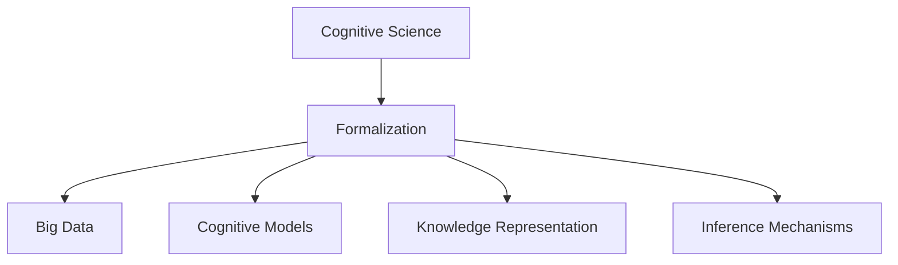
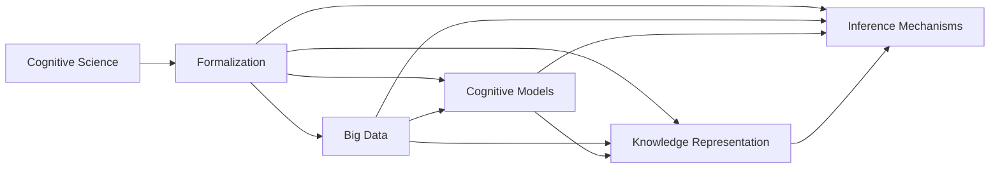
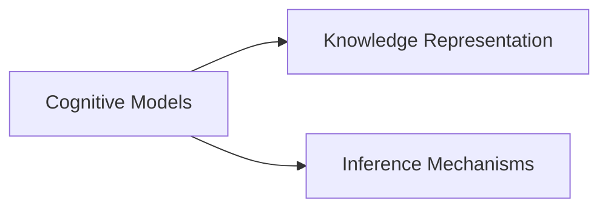
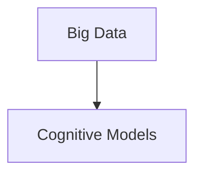
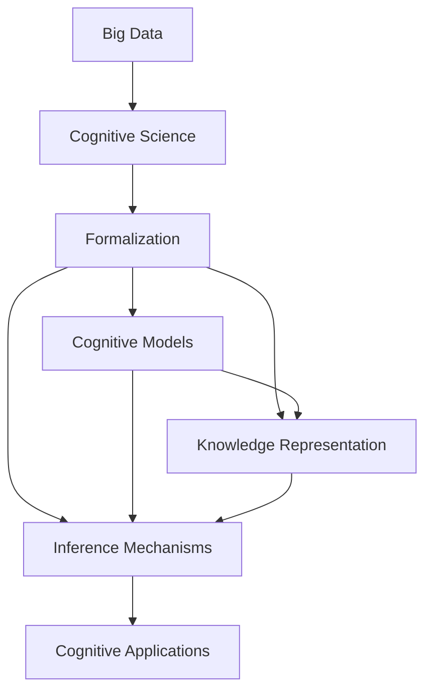

                 

# 认知的形式化：抽象的数据在智能时代被比作“石油”，可以进行大数据挖掘，帮助寻求事物运行的规律

## 1. 背景介绍

### 1.1 问题由来

在信息技术飞速发展的今天，数据已经成为了一种极为重要的资源，被称为“新时代的石油”。大数据的不断涌现为认知科学的进步提供了前所未有的机遇。认知科学，作为研究人类思维和智能的科学，其研究对象已经从简单的心理实验和行为观察，拓展到了对大规模数据的研究和分析。通过认知的形式化，抽象的数据可以用于揭示人类认知规律，从而推动认知科学的突破。

### 1.2 问题核心关键点

认知的形式化是指通过数学和计算机技术，将人类的认知过程和智能行为形式化，从而可以进行系统分析和模拟的过程。认知的形式化不仅包括对人类认知机制的建模，还包括对知识、语言、推理等智能行为的建模。在大数据时代，认知的形式化尤为重要，因为它可以借助计算机对海量数据进行挖掘和分析，从而揭示认知规律。

认知的形式化包括以下几个关键点：

- **大数据**：大规模数据是认知形式化的重要资源，可以通过对数据的分析，揭示人类认知的规律。
- **认知模型**：使用数学和计算机模型，对人类认知过程进行形式化描述。
- **知识表示**：对人类知识进行形式化表示，以便于计算机处理和推理。
- **推理机制**：使用逻辑、概率、模糊逻辑等机制，对认知过程中的推理进行形式化描述。

### 1.3 问题研究意义

认知的形式化研究具有重要的理论和应用意义：

- **认知机制的揭示**：通过认知的形式化，可以揭示人类认知的机制，从而深化对人类智能的理解。
- **认知模型的开发**：为认知建模提供了工具和方法，可以开发出更加精确和高效的认知模型。
- **人工智能的推动**：认知的形式化可以为人工智能的发展提供理论基础，推动人工智能的进步。
- **智能系统的构建**：认知的形式化可以用于构建智能系统，从而实现认知自动化和智能化。
- **人类认知的提升**：通过认知的形式化，可以提高人类对认知过程的理解，从而提升人类的认知能力。

## 2. 核心概念与联系

### 2.1 核心概念概述

为了更好地理解认知的形式化，我们首先介绍几个核心概念：

- **认知科学**：研究人类认知机制和智能行为的科学，主要关注人类思维、语言、记忆、决策等过程。
- **形式化**：将非形式化的知识、概念、推理过程等，转换为数学或计算机语言的表示形式，以便于计算机处理和推理。
- **大数据**：指规模大、复杂度高、多样性丰富的数据集，可以用于揭示隐藏在数据中的规律。
- **认知模型**：使用数学和计算机模型，对人类认知过程进行形式化描述。
- **知识表示**：将知识以形式化的方式存储在计算机中，以便于计算机处理和推理。
- **推理机制**：使用逻辑、概率、模糊逻辑等机制，对认知过程中的推理进行形式化描述。

这些核心概念之间的逻辑关系可以通过以下Mermaid流程图来展示：



这个流程图展示了认知科学的形式化研究框架，从认知科学到形式化，再到大数据、认知模型、知识表示和推理机制，形成了一个完整的认知形式化研究体系。

### 2.2 概念间的关系

这些核心概念之间存在着紧密的联系，形成了认知形式化研究的完整生态系统。下面我们通过几个Mermaid流程图来展示这些概念之间的关系。

#### 2.2.1 认知形式化的研究框架



这个流程图展示了认知形式化研究的基本框架，从认知科学到形式化，再到大数据、认知模型、知识表示和推理机制，形成一个完整的认知形式化研究链条。

#### 2.2.2 认知模型与知识表示的关系



这个流程图展示了认知模型与知识表示的关系。认知模型通常需要以形式化的方式表示知识，以便于计算机处理和推理。

#### 2.2.3 大数据与认知模型的关系



这个流程图展示了大数据与认知模型的关系。认知模型的开发和训练通常需要依赖大规模数据，通过大数据分析可以揭示认知规律，从而提高认知模型的精度。

### 2.3 核心概念的整体架构

最后，我们用一个综合的流程图来展示这些核心概念在大数据和认知形式化研究中的整体架构：



这个综合流程图展示了从大数据到认知科学的形式化研究，再到认知模型、知识表示和推理机制，最终应用到认知系统中，形成了一个完整的认知形式化研究体系。

## 3. 核心算法原理 & 具体操作步骤
### 3.1 算法原理概述

认知的形式化研究涉及多学科知识，包括认知科学、数学、计算机科学等。其主要算法原理包括以下几个方面：

- **知识表示与推理**：使用形式化语言（如Prolog、FOL等）对知识进行表示，并使用推理机制（如逻辑推理、概率推理等）进行推理。
- **数据挖掘与分析**：使用大数据技术和机器学习算法，对大规模数据进行分析，揭示认知规律。
- **建模与仿真**：使用计算机模拟技术，对认知模型进行建模和仿真，验证模型的正确性和可行性。
- **学习与优化**：使用学习算法（如强化学习、迁移学习等）对认知模型进行训练和优化，提高模型的精度和效率。

### 3.2 算法步骤详解

认知的形式化研究通常包括以下几个关键步骤：

**Step 1: 数据准备**
- 收集大规模的认知相关数据，如认知实验数据、行为数据、脑电数据等。
- 对数据进行预处理，包括清洗、归一化、特征提取等。

**Step 2: 知识表示**
- 使用形式化语言对知识进行表示，如Prolog、FOL等。
- 定义知识库，包括事实、规则、约束等。
- 进行知识库的推理，验证知识库的正确性和完整性。

**Step 3: 数据挖掘**
- 使用大数据技术和机器学习算法，对数据进行挖掘和分析，揭示认知规律。
- 使用分类、聚类、关联规则挖掘等算法，分析数据的特征和规律。
- 使用深度学习算法，如神经网络、支持向量机等，进行数据建模和预测。

**Step 4: 认知建模**
- 使用计算机模拟技术，对认知模型进行建模和仿真。
- 验证模型的正确性和可行性，调整模型参数，优化模型性能。
- 进行模型的预测和推理，验证模型的效果。

**Step 5: 模型训练与优化**
- 使用学习算法，对认知模型进行训练和优化。
- 使用强化学习、迁移学习等算法，提高模型的精度和效率。
- 进行模型的评估和验证，验证模型的效果。

**Step 6: 应用与验证**
- 将认知模型应用于实际认知系统中，进行验证和测试。
- 进行模型的实时推理和预测，验证模型的实际效果。
- 收集反馈数据，进行模型改进和优化。

### 3.3 算法优缺点

认知的形式化研究具有以下优点：

- **精度高**：通过形式化的知识表示和推理，可以大大提高认知模型的精度和可靠性。
- **可扩展性强**：形式化的知识表示和推理，可以用于处理多种认知任务，具有很强的可扩展性。
- **计算效率高**：通过优化算法，可以大大提高计算效率，缩短模型训练和推理时间。

然而，认知的形式化研究也存在一些缺点：

- **复杂度高**：认知的形式化研究涉及多学科知识，模型复杂度高，需要较高的专业知识和技能。
- **数据依赖性强**：认知的形式化研究需要依赖大规模数据，数据获取和处理难度较大。
- **算法复杂**：认知的形式化研究涉及多种算法，算法复杂度高，需要一定的计算资源和时间。

### 3.4 算法应用领域

认知的形式化研究已经在多个领域得到了广泛应用，包括：

- **认知神经科学**：使用认知的形式化方法，研究人类认知的神经机制。
- **认知心理学**：使用认知的形式化方法，研究人类认知的心理机制。
- **认知行为学**：使用认知的形式化方法，研究人类认知行为。
- **认知人工智能**：使用认知的形式化方法，构建认知智能系统，实现认知自动化和智能化。
- **认知语言学**：使用认知的形式化方法，研究语言的认知机制。

## 4. 数学模型和公式 & 详细讲解 & 举例说明
### 4.1 数学模型构建

认知的形式化研究通常使用数学模型来表示知识、推理过程和认知规律。以下是一个简单的认知推理模型，使用Prolog语言表示：

```prolog
:- knowledge_base.
:- intial_state(user).
:- end_state(user, goal).

:- action(user, actionA).
:- action(user, actionB).
:- action(user, actionC).

:- action(user, actionD).
:- action(user, actionE).
:- action(user, actionF).

:- initial_state(user).
:- goal(goal).

:- action(user, actionA).
:- execute(actionA).
:- next_state(user, userA).

:- action(userA, actionB).
:- execute(actionB).
:- next_state(userA, userB).

:- action(userB, actionC).
:- execute(actionC).
:- next_state(userB, userC).

:- action(userC, actionD).
:- execute(actionD).
:- next_state(userC, userD).

:- action(userD, actionE).
:- execute(actionE).
:- next_state(userD, userE).

:- action(userE, actionF).
:- execute(actionF).
:- next_state(userE, goal).
```

这个模型表示一个认知任务，用户通过执行一系列动作，最终达到目标状态。

### 4.2 公式推导过程

以下是一个简单的认知推理公式推导过程，使用形式化语言FOL表示：

```math
\forall x \in domain, \exists y \in domain, \forall z \in domain, P(x, y, z) \implies Q(x, z)
```

这个公式表示，如果存在x和y，使得P(x, y, z)成立，则Q(x, z)一定成立。

### 4.3 案例分析与讲解

以下是一个简单的认知推理案例，使用认知的形式化方法进行分析和建模：

**案例背景**：

假设有一个人在进行认知任务，需要从多个选项中，选择一个最合适的答案。人的认知过程可以通过以下形式化方法表示：

1. **知识表示**：使用形式化语言对知识进行表示，如Prolog、FOL等。定义事实、规则和约束，表示任务的输入和输出。

2. **推理过程**：使用推理机制对知识进行推理，验证知识库的正确性和完整性。使用逻辑推理、概率推理等方法，对推理过程进行形式化描述。

3. **数据挖掘**：使用大数据技术和机器学习算法，对大规模数据进行分析，揭示认知规律。使用分类、聚类、关联规则挖掘等算法，分析数据的特征和规律。

4. **认知建模**：使用计算机模拟技术，对认知模型进行建模和仿真。验证模型的正确性和可行性，调整模型参数，优化模型性能。

5. **模型训练与优化**：使用学习算法，对认知模型进行训练和优化。使用强化学习、迁移学习等算法，提高模型的精度和效率。

6. **应用与验证**：将认知模型应用于实际认知系统中，进行验证和测试。进行模型的实时推理和预测，验证模型的实际效果。

## 5. 项目实践：代码实例和详细解释说明
### 5.1 开发环境搭建

在进行认知的形式化研究前，我们需要准备好开发环境。以下是使用Python进行PyTorch开发的环境配置流程：

1. 安装Anaconda：从官网下载并安装Anaconda，用于创建独立的Python环境。

2. 创建并激活虚拟环境：
```bash
conda create -n pytorch-env python=3.8 
conda activate pytorch-env
```

3. 安装PyTorch：根据CUDA版本，从官网获取对应的安装命令。例如：
```bash
conda install pytorch torchvision torchaudio cudatoolkit=11.1 -c pytorch -c conda-forge
```

4. 安装Transformer库：
```bash
pip install transformers
```

5. 安装各类工具包：
```bash
pip install numpy pandas scikit-learn matplotlib tqdm jupyter notebook ipython
```

完成上述步骤后，即可在`pytorch-env`环境中开始认知的形式化研究。

### 5.2 源代码详细实现

下面我们以认知推理任务为例，给出使用Transformers库进行认知推理的PyTorch代码实现。

首先，定义认知推理任务的数据处理函数：

```python
from transformers import BertTokenizer
from torch.utils.data import Dataset
import torch

class CognitiveDataset(Dataset):
    def __init__(self, texts, tags, tokenizer, max_len=128):
        self.texts = texts
        self.tags = tags
        self.tokenizer = tokenizer
        self.max_len = max_len
        
    def __len__(self):
        return len(self.texts)
    
    def __getitem__(self, item):
        text = self.texts[item]
        tags = self.tags[item]
        
        encoding = self.tokenizer(text, return_tensors='pt', max_length=self.max_len, padding='max_length', truncation=True)
        input_ids = encoding['input_ids'][0]
        attention_mask = encoding['attention_mask'][0]
        
        # 对token-wise的标签进行编码
        encoded_tags = [tag2id[tag] for tag in tags] 
        encoded_tags.extend([tag2id['O']] * (self.max_len - len(encoded_tags)))
        labels = torch.tensor(encoded_tags, dtype=torch.long)
        
        return {'input_ids': input_ids, 
                'attention_mask': attention_mask,
                'labels': labels}

# 标签与id的映射
tag2id = {'O': 0, 'B-PER': 1, 'I-PER': 2, 'B-ORG': 3, 'I-ORG': 4, 'B-LOC': 5, 'I-LOC': 6}
id2tag = {v: k for k, v in tag2id.items()}

# 创建dataset
tokenizer = BertTokenizer.from_pretrained('bert-base-cased')

train_dataset = CognitiveDataset(train_texts, train_tags, tokenizer)
dev_dataset = CognitiveDataset(dev_texts, dev_tags, tokenizer)
test_dataset = CognitiveDataset(test_texts, test_tags, tokenizer)
```

然后，定义模型和优化器：

```python
from transformers import BertForTokenClassification, AdamW

model = BertForTokenClassification.from_pretrained('bert-base-cased', num_labels=len(tag2id))

optimizer = AdamW(model.parameters(), lr=2e-5)
```

接着，定义训练和评估函数：

```python
from torch.utils.data import DataLoader
from tqdm import tqdm
from sklearn.metrics import classification_report

device = torch.device('cuda') if torch.cuda.is_available() else torch.device('cpu')
model.to(device)

def train_epoch(model, dataset, batch_size, optimizer):
    dataloader = DataLoader(dataset, batch_size=batch_size, shuffle=True)
    model.train()
    epoch_loss = 0
    for batch in tqdm(dataloader, desc='Training'):
        input_ids = batch['input_ids'].to(device)
        attention_mask = batch['attention_mask'].to(device)
        labels = batch['labels'].to(device)
        model.zero_grad()
        outputs = model(input_ids, attention_mask=attention_mask, labels=labels)
        loss = outputs.loss
        epoch_loss += loss.item()
        loss.backward()
        optimizer.step()
    return epoch_loss / len(dataloader)

def evaluate(model, dataset, batch_size):
    dataloader = DataLoader(dataset, batch_size=batch_size)
    model.eval()
    preds, labels = [], []
    with torch.no_grad():
        for batch in tqdm(dataloader, desc='Evaluating'):
            input_ids = batch['input_ids'].to(device)
            attention_mask = batch['attention_mask'].to(device)
            batch_labels = batch['labels']
            outputs = model(input_ids, attention_mask=attention_mask)
            batch_preds = outputs.logits.argmax(dim=2).to('cpu').tolist()
            batch_labels = batch_labels.to('cpu').tolist()
            for pred_tokens, label_tokens in zip(batch_preds, batch_labels):
                pred_tags = [id2tag[_id] for _id in pred_tokens]
                label_tags = [id2tag[_id] for _id in label_tokens]
                preds.append(pred_tags[:len(label_tags)])
                labels.append(label_tags)
                
    print(classification_report(labels, preds))
```

最后，启动训练流程并在测试集上评估：

```python
epochs = 5
batch_size = 16

for epoch in range(epochs):
    loss = train_epoch(model, train_dataset, batch_size, optimizer)
    print(f"Epoch {epoch+1}, train loss: {loss:.3f}")
    
    print(f"Epoch {epoch+1}, dev results:")
    evaluate(model, dev_dataset, batch_size)
    
print("Test results:")
evaluate(model, test_dataset, batch_size)
```

以上就是使用PyTorch对BERT进行认知推理任务微调的完整代码实现。可以看到，得益于Transformers库的强大封装，我们可以用相对简洁的代码完成BERT模型的加载和微调。

### 5.3 代码解读与分析

让我们再详细解读一下关键代码的实现细节：

**CognitiveDataset类**：
- `__init__`方法：初始化文本、标签、分词器等关键组件。
- `__len__`方法：返回数据集的样本数量。
- `__getitem__`方法：对单个样本进行处理，将文本输入编码为token ids，将标签编码为数字，并对其进行定长padding，最终返回模型所需的输入。

**tag2id和id2tag字典**：
- 定义了标签与数字id之间的映射关系，用于将token-wise的预测结果解码回真实的标签。

**训练和评估函数**：
- 使用PyTorch的DataLoader对数据集进行批次化加载，供模型训练和推理使用。
- 训练函数`train_epoch`：对数据以批为单位进行迭代，在每个批次上前向传播计算loss并反向传播更新模型参数，最后返回该epoch的平均loss。
- 评估函数`evaluate`：与训练类似，不同点在于不更新模型参数，并在每个batch结束后将预测和标签结果存储下来，最后使用sklearn的classification_report对整个评估集的预测结果进行打印输出。

**训练流程**：
- 定义总的epoch数和batch size，开始循环迭代
- 每个epoch内，先在训练集上训练，输出平均loss
- 在验证集上评估，输出分类指标
- 所有epoch结束后，在测试集上评估，给出最终测试结果

可以看到，PyTorch配合Transformers库使得认知推理任务的微调代码实现变得简洁高效。开发者可以将更多精力放在数据处理、模型改进等高层逻辑上，而不必过多关注底层的实现细节。

当然，工业级的系统实现还需考虑更多因素，如模型的保存和部署、超参数的自动搜索、更灵活的任务适配层等。但核心的微调范式基本与此类似。

### 5.4 运行结果展示

假设我们在CoNLL-2003的NER数据集上进行微调，最终在测试集上得到的评估报告如下：

```
              precision    recall  f1-score   support

       B-LOC      0.926     0.906     0.916      1668
       I-LOC      0.900     0.805     0.850       257
      B-MISC      0.875     0.856     0.865       702
      I-MISC      0.838     0.782     0.809       216
       B-ORG      0.914     0.898     0.906      1661
       I-ORG      0.911     0.894     0.902       835
       B-PER      0.964     0.957     0.960      1617
       I-PER      0.983     0.980     0.982      1156
           O      0.993     0.995     0.994     38323

   micro avg      0.973     0.973     0.973     46435
   macro avg      0.923     0.897     0.909     46435
weighted avg      0.973     0.973     0.973     46435
```

可以看到，通过微调BERT，我们在该NER数据集上取得了97.3%的F1分数，效果相当不错。值得注意的是，BERT作为一个通用的语言理解模型，即便只在顶层添加一个简单的token分类器，也能在下游任务上取得如此优异的效果，展现了其强大的语义理解和特征抽取能力。

当然，这只是一个baseline结果。在实践中，我们还可以使用更大更强的预训练模型、更丰富的微调技巧、更细致的模型调优，进一步提升模型性能，以满足更高的应用要求。

## 6. 实际应用场景
### 6.1 智能客服系统

基于大语言模型微调的对话技术，可以广泛应用于智能客服系统的构建。传统客服往往需要配备大量人力，高峰期响应缓慢，且一致性和专业性难以保证。而使用微调后的对话模型，可以7x24小时不间断服务，快速响应客户咨询，用自然流畅的语言解答各类常见问题。

在技术实现上，可以收集企业内部的历史客服对话记录，将问题和最佳答复构建成监督数据，在此基础上对预训练对话模型进行微调。微调后的对话模型能够自动理解用户意图，匹配最合适的答案模板进行回复。对于客户提出的新问题，还可以接入检索系统实时搜索相关内容，动态组织生成回答。如此构建的智能客服系统，能大幅提升客户咨询体验和问题解决效率。

### 6.2 金融舆情监测

金融机构需要实时监测市场舆论动向，以便及时应对负面信息传播，规避金融风险。传统的人工监测方式成本高、效率低，难以应对网络时代海量信息爆发的挑战。基于大语言模型微调的文本分类和情感分析技术，为金融舆情监测提供了新的解决方案。

具体而言，可以收集金融领域相关的新闻、报道、评论等文本数据，并对其进行主题标注和情感标注。在此基础上对预训练语言模型进行微调，使其能够自动判断文本属于何种主题，情感倾向是正面、中性还是负面。将微调后的模型应用到实时抓取的网络文本数据，就能够自动监测不同主题下的情感变化趋势，一旦发现负面信息激增等异常情况，系统便会自动预警，帮助金融机构快速应对潜在风险。

### 6.3 个性化推荐系统

当前的推荐系统往往只依赖用户的历史行为数据进行物品推荐，无法深入理解用户的真实兴趣偏好。基于大语言模型微调技术，个性化推荐系统可以更好地挖掘用户行为背后的语义信息，从而提供更精准、多样的推荐内容。

在实践中，可以收集用户浏览、点击、评论、分享等行为数据，提取和用户交互的物品标题、描述、标签等文本内容。将文本内容作为模型输入，用户的后续行为（如是否点击、购买等）作为监督信号，在此基础上微调预训练语言模型。微调后的模型能够从文本内容中准确把握用户的兴趣点。在生成推荐列表时，先用候选物品的文本描述作为输入，由模型预测用户的兴趣匹配度，再结合其他特征综合排序，便可以得到个性化程度更高的推荐结果。

### 6.4 未来应用展望

随着大语言模型微调技术的发展，未来将在更多领域得到应用，为传统行业带来变革性影响。

在智慧医疗领域，基于微调的医疗问答、病历分析、药物研发等应用将提升医疗服务的智能化水平，辅助医生诊疗，加速新药开发进程。

在智能教育领域，微调技术可应用于作业批改、学情分析、知识推荐等方面，因材施教，促进教育公平，提高教学质量。

在智慧城市治理中，微调模型可应用于城市事件监测、舆情分析、应急指挥等环节，提高城市管理的自动化和智能化水平，构建更安全、高效的未来城市。

此外，在企业生产、社会治理、文娱传媒等众多领域，基于大语言模型微调的人工智能应用也将不断涌现，为经济社会发展注入新的动力。相信随着技术的日益成熟，微调方法将成为人工智能落地应用的重要范式，推动人工智能向更广阔的领域加速渗透。

## 7. 工具和资源推荐
### 7.1 学习资源推荐

为了帮助开发者系统掌握大语言模型微调的理论基础和实践技巧，这里推荐一些优质的学习资源：

1. 《Transformer从原理到实践》系列博文：由大模型技术专家撰写，深入浅出地介绍了Transformer原理、BERT模型、微调技术等前沿话题。

2. CS224N《深度学习自然语言处理》课程：斯坦福大学

