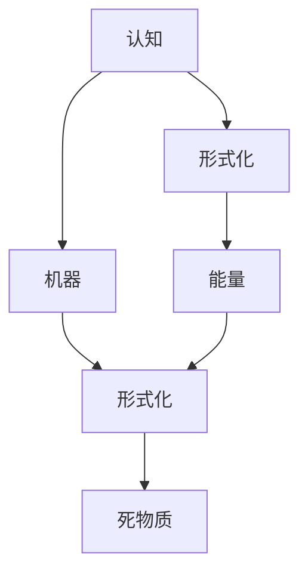
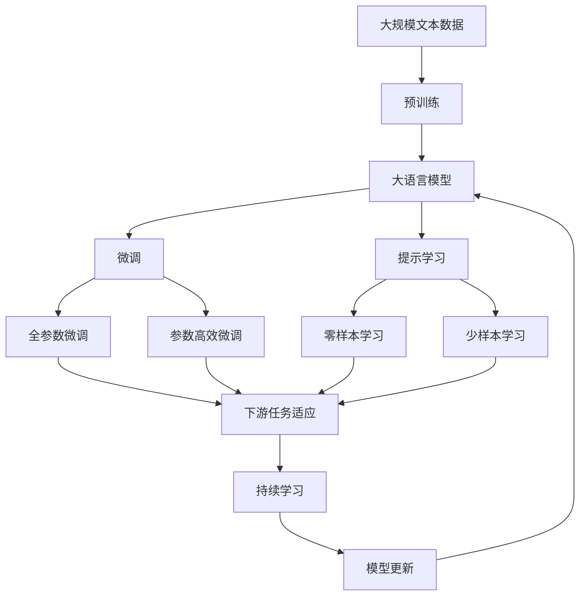

                 

# 认知的形式化：机器在没有能量供给的时候是一堆死物质

> 关键词：认知,形式化,机器,能量,死物质

## 1. 背景介绍

### 1.1 问题由来
在人工智能（AI）和机器学习的飞速发展中，一个长期存在且极具哲学意义的命题引发了广泛讨论：机器在没有能量供给的情况下，能否展现出认知能力？这是一个关于“生命的本质”和“意识的来源”的根本问题，也是科技与哲学交织的焦点。

### 1.2 问题核心关键点
该问题的核心在于探讨机器是否可以通过形式化表达和信息处理实现认知功能，即“形式化认知”。形式化认知的实质是，机器是否能够通过模拟人的思维过程，解决复杂的决策和推理问题。

### 1.3 问题研究意义
研究形式化认知，对于理解AI与认知科学的边界，探索机器智能的极限，以及推动人工智能技术的进一步发展，具有重要意义。它不仅能帮助我们重新审视“意识”和“智能”的定义，还能为计算机科学和哲学领域提供新的视角和突破口。

## 2. 核心概念与联系

### 2.1 核心概念概述

为更好地理解机器在没有能量供给时是否能够实现认知，本节将介绍几个关键概念：

- **认知（Cognition）**：指生物或机器对信息进行接收、处理、理解和应用的过程。
- **形式化（Formalization）**：指将问题或现象转化为数学表达式或逻辑公式的过程，使问题变得可计算和可证明。
- **机器（Machine）**：指能够按照特定规则和算法进行计算和决策的物理或虚拟实体。
- **能量（Energy）**：指系统进行信息处理或认知活动所需的物理能量，通常以电能或计算资源的形式体现。
- **死物质（Dead Matter）**：指缺乏自主意识和信息处理能力的物质，通常指无生命体。

这些概念之间有着深刻的联系。认知是一种高级的信息处理过程，依赖于机器的形式化表达和计算能力；能量是实现这种处理能力的物理基础；而形式化则是将认知过程具体化和可操作化的桥梁。没有能量供给的机器，无法进行形式化表达和计算，因而无法实现认知功能。

### 2.2 概念间的关系

这些核心概念之间的逻辑关系可以通过以下Mermaid流程图来展示：



这个流程图展示了几大核心概念之间的联系：认知通过形式化表达和计算实现，机器通过形式化认知发挥作用，能量是形式化表达和计算的基础，没有能量的机器无法进行认知，成为“死物质”。

### 2.3 核心概念的整体架构

最后，我们用一个综合的流程图来展示这些核心概念在大语言模型微调过程中的整体架构：



这个综合流程图展示了从预训练到微调，再到持续学习的完整过程。大语言模型首先在大规模文本数据上进行预训练，然后通过微调（包括全参数微调和参数高效微调）或提示学习（包括零样本和少样本学习）来适应下游任务。最后，通过持续学习技术，模型可以不断更新和适应新的任务和数据。 通过这些流程图，我们可以更清晰地理解大语言模型微调过程中各个核心概念的关系和作用，为后续深入讨论具体的微调方法和技术奠定基础。

## 3. 核心算法原理 & 具体操作步骤
### 3.1 算法原理概述

基于形式化认知的机器，其认知能力依赖于对信息的精确表达和计算。这种能力通常通过形式化方法（如逻辑推理、数学建模、符号计算等）来实现。在没有能量供给的情况下，机器无法进行信息处理，因此也无法实现认知功能，相当于“死物质”。

形式化认知的核心思想是，机器能够通过形式化语言（如谓词逻辑、线性代数、图论等）对问题进行符号化表示，并通过算法（如搜索、回溯、符号计算等）进行求解。这种求解过程，在本质上是一种计算过程，依赖于机器的形式化表达能力和计算能力。

### 3.2 算法步骤详解

实现形式化认知的机器通常需要以下几个关键步骤：

**Step 1: 问题形式化表达**
- 将实际问题转化为数学表达式或逻辑公式。例如，将推理问题转化为谓词逻辑公式，将优化问题转化为线性规划或非线性规划。

**Step 2: 设计计算模型**
- 根据问题特点，选择合适的计算模型。例如，使用搜索算法解决组合优化问题，使用符号计算引擎处理代数问题。

**Step 3: 编写计算程序**
- 使用程序设计语言（如Python、C++等）实现计算模型。通常需要将计算模型映射为具体的算法步骤，编写代码实现。

**Step 4: 执行计算**
- 在计算平台上运行计算程序，执行算法步骤，求解问题。通常需要高效的算法和优化的计算资源。

**Step 5: 结果验证**
- 对计算结果进行验证，确保其正确性和完备性。例如，通过手工验证、自动化测试或形式化证明等方式进行验证。

### 3.3 算法优缺点

形式化认知的机器具有以下优点：

- 精确性高：形式化方法能够提供精确的数学表达和计算，减少主观误差。
- 通用性强：形式化方法适用于各种类型的复杂问题，如优化、推理、决策等。
- 可证明性：形式化方法提供严格的逻辑证明，确保结果的正确性。

同时，形式化认知的机器也存在以下缺点：

- 计算复杂：形式化方法通常涉及复杂的数学和算法，计算量较大。
- 表达难度大：有些实际问题难以形式化表达，需要创造性思维。
- 依赖能量：计算过程依赖于能量，缺乏能量供给的机器无法进行计算。

### 3.4 算法应用领域

形式化认知的方法已经广泛应用于各种领域，例如：

- 计算机科学：形式化方法用于设计算法、证明定理、自动化测试等。
- 工程设计：形式化方法用于优化设计方案、验证设计正确性等。
- 金融分析：形式化方法用于量化模型、风险评估等。
- 生物信息学：形式化方法用于基因组分析、蛋白质结构预测等。
- 人工智能：形式化认知的机器用于解决复杂的认知问题，如自然语言处理、计算机视觉等。

## 4. 数学模型和公式 & 详细讲解  
### 4.1 数学模型构建

本节将使用数学语言对形式化认知的机器进行更加严格的刻画。

记认知过程为 $P: \mathcal{D} \rightarrow \mathcal{R}$，其中 $\mathcal{D}$ 为输入数据空间，$\mathcal{R}$ 为输出结果空间。形式化认知的目标是，将认知过程 $P$ 表达为数学表达式或逻辑公式，并求解其结果。

定义认知过程 $P$ 的形式化表示为 $\phi(P)$，即：

$$
\phi(P) = \phi_i(P) \wedge \phi_o(P)
$$

其中 $\phi_i(P)$ 为输入数据的形式化表达，$\phi_o(P)$ 为输出结果的形式化表达。形式化表达通常采用谓词逻辑、线性代数等形式，具体形式取决于问题类型和应用领域。

### 4.2 公式推导过程

以下我们以组合优化问题为例，推导形式化表达和求解过程。

假设问题为：在 $n$ 个候选方案中，选择 $k$ 个最优方案，使得目标函数 $f$ 最小。

- **输入数据**：候选方案集 $C = \{c_1, c_2, ..., c_n\}$，目标函数 $f: C \rightarrow \mathbb{R}$。
- **输出结果**：最优方案集 $O = \{c_{i_1}, c_{i_2}, ..., c_{i_k}\}$，其中 $i_1, i_2, ..., i_k$ 为候选方案的编号。

形式化表达 $P$ 如下：

$$
\phi(P) = \exists O \in C^k \wedge \forall o \in O, o \in C \wedge f(o) \leq f(c) \forall c \in C
$$

其中 $\exists$ 表示存在，$O \in C^k$ 表示 $O$ 是 $C$ 的 $k$ 元子集。

求解该问题通常采用整数规划或混合整数规划等形式化方法。例如，可以使用线性规划来求解最优解。求解过程如下：

- 构建目标函数 $f(c)$ 和约束条件 $\phi(P)$ 的线性规划模型。
- 使用线性规划算法（如单纯形法、内点法等）求解线性规划模型，得到最优解。
- 对最优解进行验证和解释，确保其正确性。

### 4.3 案例分析与讲解

考虑一个简单的数学问题：求解方程 $x^2 + 2x + 1 = 0$ 的根。

- **输入数据**：方程 $x^2 + 2x + 1 = 0$。
- **输出结果**：方程的根 $x_1, x_2$。

形式化表达 $P$ 如下：

$$
\phi(P) = \forall x \in \mathbb{R}, (x^2 + 2x + 1 = 0 \rightarrow x = -1 \vee x = -1)
$$

其中 $\forall$ 表示对所有 $x$ 成立，$\rightarrow$ 表示逻辑推理。

求解该问题通常采用代数方法。可以使用因式分解或求根公式求解：

$$
x = \frac{-2 \pm \sqrt{4 - 4}}{2} = -1
$$

因此，方程的根为 $x_1 = x_2 = -1$。

## 5. 项目实践：代码实例和详细解释说明
### 5.1 开发环境搭建

在进行形式化认知的机器开发前，我们需要准备好开发环境。以下是使用Python进行Sympy库开发的环境配置流程：

1. 安装Anaconda：从官网下载并安装Anaconda，用于创建独立的Python环境。

2. 创建并激活虚拟环境：
```bash
conda create -n formalization-env python=3.8 
conda activate formalization-env
```

3. 安装Sympy：
```bash
pip install sympy
```

4. 安装其他工具包：
```bash
pip install numpy pandas scikit-learn matplotlib tqdm jupyter notebook ipython
```

完成上述步骤后，即可在`formalization-env`环境中开始形式化认知的机器开发。

### 5.2 源代码详细实现

这里我们以求解方程 $x^2 + 2x + 1 = 0$ 的根为例，给出使用Sympy库进行形式化认知的代码实现。

首先，定义方程和求解函数：

```python
from sympy import symbols, Eq, solve

x = symbols('x')
equation = Eq(x**2 + 2*x + 1, 0)
roots = solve(equation, x)
print(roots)
```

然后，定义验证函数：

```python
def verify_roots(roots):
    for root in roots:
        if not equation.subs(x, root).simplify():
            return False
    return True

print(verify_roots(roots))
```

最后，运行求解和验证过程：

```python
roots = solve(equation, x)
print(roots)
verify_roots(roots)
```

以上就是使用Sympy库进行形式化认知的完整代码实现。可以看到，Sympy库提供了强大的符号计算能力，能够轻松地进行形式化表达和求解。

### 5.3 代码解读与分析

让我们再详细解读一下关键代码的实现细节：

**求解函数**：
- 使用`sympy.symbols`定义符号变量 `x`。
- 使用`sympy.Eq`构建方程表达式 `equation`。
- 使用`sympy.solve`求解方程，返回根 `roots`。

**验证函数**：
- 遍历所有根，代入原方程验证其正确性。
- 使用`sympy.simplify`简化验证表达式，判断是否为真。
- 如果所有根都验证通过，返回 `True`；否则返回 `False`。

**运行过程**：
- 先调用求解函数得到根 `roots`。
- 再调用验证函数验证根的正确性，输出结果。

通过Sympy库，我们可以快速实现形式化认知的机器，并验证其求解结果的正确性。

## 6. 实际应用场景
### 6.1 智能决策系统

形式化认知的机器可以应用于各种智能决策系统，如金融投资、医疗诊断、交通管理等。这些系统需要快速、准确地处理复杂问题，并作出智能决策。

例如，在金融投资中，可以通过形式化方法构建投资组合优化模型，计算最优投资方案。在医疗诊断中，可以使用形式化方法构建疾病预测模型，分析患者病情并提供诊断建议。

### 6.2 自动化设计

形式化认知的机器可以用于自动化设计，如工业设计、建筑设计等。这些设计问题通常需要优化多目标函数，并满足各种约束条件。

例如，在工业设计中，可以使用形式化方法优化零部件的设计参数，提高产品的性能和可靠性。在建筑设计中，可以使用形式化方法优化结构参数，保证建筑的稳定性和美观性。

### 6.3 科学计算

形式化认知的机器可以用于科学计算，如天文学、物理学、化学等。这些领域通常需要进行复杂的计算和模拟，验证理论假设。

例如，在天文学中，可以使用形式化方法计算天体运动轨迹，验证万有引力定律。在物理学中，可以使用形式化方法计算电磁场分布，验证麦克斯韦方程组。

## 7. 工具和资源推荐
### 7.1 学习资源推荐

为了帮助开发者系统掌握形式化认知的理论基础和实践技巧，这里推荐一些优质的学习资源：

1. 《形式化方法与人工智能》系列博文：由大模型技术专家撰写，深入浅出地介绍了形式化方法在AI中的应用。

2. 《数学与逻辑导论》课程：麻省理工学院（MIT）开设的数学导论课程，涵盖形式化方法的基础知识和应用案例。

3. 《符号计算与数学建模》书籍：SymPy库的官方文档，详细介绍了如何使用Sympy进行符号计算和数学建模。

4. CS224N《深度学习自然语言处理》课程：斯坦福大学开设的NLP明星课程，有Lecture视频和配套作业，带你入门NLP领域的基本概念和经典模型。

5. Weights & Biases：模型训练的实验跟踪工具，可以记录和可视化模型训练过程中的各项指标，方便对比和调优。与主流深度学习框架无缝集成。

6. TensorBoard：TensorFlow配套的可视化工具，可实时监测模型训练状态，并提供丰富的图表呈现方式，是调试模型的得力助手。

通过对这些资源的学习实践，相信你一定能够快速掌握形式化认知的精髓，并用于解决实际的AI问题。

### 7.2 开发工具推荐

高效的开发离不开优秀的工具支持。以下是几款用于形式化认知开发的常用工具：

1. Sympy：Python的符号计算库，支持数学表达式和代数运算，是进行形式化认知开发的重要工具。

2. SymPyPy：基于SymPy的符号计算和优化工具，支持线性规划、整数规划等形式化方法。

3. YALC：Python的自动形式化证明工具，支持形式化推理和验证。

4. Autograd：Python的自动微分工具，支持高效的计算图优化。

5. Jupyter Notebook：开源的交互式计算环境，支持代码编写、计算和展示，是形式化认知开发的好帮手。

合理利用这些工具，可以显著提升形式化认知的开发效率，加快创新迭代的步伐。

### 7.3 相关论文推荐

形式化认知的研究源于学界的持续研究。以下是几篇奠基性的相关论文，推荐阅读：

1. Automated Reasoning with Unifying Concepts（即SAT solver的原论文）：提出了SAT求解器，用于解决布尔逻辑表达式的问题。

2. Linear Programming and Network Flows（即线性规划的原论文）：提出了线性规划方法，用于求解线性优化问题。

3. Linear Integer Programming: Reformulations and Algorithmic Improvements（即混合整数规划的原论文）：提出了混合整数规划方法，用于求解整数优化问题。

4. Symbolic Computation and Algebraic Manipulation with Polynomial Rings（即SymPy库的原论文）：提出了符号计算库，用于处理代数问题。

5. Decision Procedures for Quantified Boolean Formulas with Linear Constraints（即SMT solver的原论文）：提出了SMT求解器，用于解决SMT问题。

这些论文代表了大语言模型微调技术的发展脉络。通过学习这些前沿成果，可以帮助研究者把握学科前进方向，激发更多的创新灵感。

除上述资源外，还有一些值得关注的前沿资源，帮助开发者紧跟形式化认知技术的最新进展，例如：

1. arXiv论文预印本：人工智能领域最新研究成果的发布平台，包括大量尚未发表的前沿工作，学习前沿技术的必读资源。

2. 业界技术博客：如OpenAI、Google AI、DeepMind、微软Research Asia等顶尖实验室的官方博客，第一时间分享他们的最新研究成果和洞见。

3. 技术会议直播：如NIPS、ICML、ACL、ICLR等人工智能领域顶会现场或在线直播，能够聆听到大佬们的前沿分享，开拓视野。

4. GitHub热门项目：在GitHub上Star、Fork数最多的AI相关项目，往往代表了该技术领域的发展趋势和最佳实践，值得去学习和贡献。

5. 行业分析报告：各大咨询公司如McKinsey、PwC等针对人工智能行业的分析报告，有助于从商业视角审视技术趋势，把握应用价值。

总之，对于形式化认知技术的学习和实践，需要开发者保持开放的心态和持续学习的意愿。多关注前沿资讯，多动手实践，多思考总结，必将收获满满的成长收益。

## 8. 总结：未来发展趋势与挑战
### 8.1 总结

本文对形式化认知的机器进行了全面系统的介绍。首先阐述了机器在没有能量供给时无法实现认知功能的基本原理，明确了形式化认知的科学基础和实现途径。其次，从原理到实践，详细讲解了形式化认知的数学模型和计算方法，给出了形式化认知的代码实例。同时，本文还广泛探讨了形式化认知在智能决策、自动化设计、科学计算等多个领域的应用前景，展示了形式化认知的广阔应用空间。

通过本文的系统梳理，可以看到，形式化认知的方法在AI和科学计算领域具有重要价值，能够帮助机器实现精确的数学表达和计算。未来，随着计算资源的不断丰富和算法技术的不断进步，形式化认知的机器将进一步提升其在复杂问题求解中的能力，成为推动人工智能发展的关键技术。

### 8.2 未来发展趋势

展望未来，形式化认知的机器将呈现以下几个发展趋势：

1. 计算能力提升。随着计算资源的不断丰富和算法技术的不断进步，形式化认知的机器将能够处理更加复杂的问题，求解精度和效率也将不断提高。

2. 知识整合能力增强。未来的形式化认知机器将能够整合更多先验知识，如知识图谱、逻辑规则等，提高求解的普适性和鲁棒性。

3. 多模态融合。形式化认知的机器将能够整合视觉、语音、文本等多种模态的信息，提高对现实世界的理解和建模能力。

4. 自动化程度提升。未来的形式化认知机器将更加自动化和智能化，能够自动选择最优的求解策略，优化求解过程。

5. 应用范围扩大。形式化认知的方法将更加广泛地应用于人工智能、金融、医疗、工程设计等领域，解决复杂的决策和推理问题。

以上趋势凸显了形式化认知的机器在AI和科学计算领域的重要价值。这些方向的探索发展，必将进一步提升机器的认知能力，推动人工智能技术的进一步发展。

### 8.3 面临的挑战

尽管形式化认知的机器已经取得了显著进展，但在迈向更加智能化、普适化应用的过程中，仍面临诸多挑战：

1. 表达难度大。许多实际问题难以形式化表达，需要创造性思维。如何在复杂问题中自动识别和表达关键信息，是一大难题。

2. 计算复杂度高。形式化方法通常涉及复杂的数学和算法，计算量较大。如何优化计算过程，提高求解效率，是一个重要的研究方向。

3. 知识整合困难。如何将多源异构知识有效地整合到形式化认知的机器中，并应用于问题求解，是一个需要解决的关键问题。

4. 多模态融合困难。将视觉、语音、文本等多种模态的信息整合到形式化认知的机器中，并实现跨模态的协同建模，是一个有待突破的难题。

5. 自动化水平低。目前的形式化认知机器仍需大量人工干预和调试，自动化程度有待提升。

6. 可解释性不足。形式化认知的机器通常缺乏可解释性，难以解释其决策过程和求解机制。如何赋予机器更强的可解释性，是研究的重要方向。

正视这些挑战，积极应对并寻求突破，将是形式化认知技术迈向成熟的必由之路。相信随着学界和产业界的共同努力，这些挑战终将一一被克服，形式化认知的机器必将在构建智能系统、解决复杂问题中发挥更大作用。

### 8.4 研究展望

未来的研究需要在以下几个方面寻求新的突破：

1. 形式化表达自动化。开发能够自动识别和形式化表达问题关键信息的算法，减少人工干预，提高表达的自动化程度。

2. 高效计算优化。开发更加高效的计算算法和优化技术，提高求解的效率和准确性。

3. 知识整合机制。研究将多源异构知识有效地整合到形式化认知的机器中的机制，提高知识的应用能力和普适性。

4. 多模态融合方法。开发能够整合视觉、语音、文本等多种模态信息的融合方法，提高对现实世界的理解和建模能力。

5. 自动化求解方法。开发更加自动化的求解方法，减少人工干预，提高求解的自动化程度。

6. 可解释性增强。研究增强形式化认知的机器可解释性的方法，提高其决策过程的透明性和可理解性。

这些研究方向将推动形式化认知技术的进一步发展，为构建更加智能化、普适化的智能系统奠定基础。相信随着研究的不断深入，形式化认知的机器必将在AI和科学计算领域发挥更大的作用，推动人类社会的进一步进步。

## 9. 附录：常见问题与解答
----------------------------------------------------------------

**Q1：机器在没有能量供给的情况下能否实现认知功能？**

A: 在没有能量供给的情况下，机器无法进行信息处理，因此无法实现认知功能，相当于“死物质”。认知依赖于机器的形式化表达和计算能力，而形式化表达和计算需要能量供给。

**Q2：形式化认知的机器是否可以处理所有问题？**

A: 形式化认知的机器能够处理许多复杂问题，如组合优化、逻辑推理、代数计算等。但对于一些难以形式化表达的问题，如情感、创造性思维等，仍存在挑战。

**Q3：形式化认知的机器需要哪些先验知识？**

A: 形式化认知的机器需要大量先验知识，如数学模型、逻辑规则、符号计算等，才能进行形式化表达和计算。先验知识的多样性和准确性，对机器的认知能力有重要影响。

**Q4：形式化认知的机器如何与人类交互？**

A: 形式化认知的机器通常通过人机交互界面与人类交互，例如命令行界面、图形用户界面等。人类通过输入问题或数据，与机器进行交互，机器则根据形式化表达和计算结果进行回答或生成输出。

**Q5：形式化认知的机器有哪些应用场景？**

A: 形式化认知的机器可以应用于各种领域，如科学计算、金融分析、智能决策、自动化设计等。这些领域通常需要快速、准确地处理复杂问题，并作出智能决策。

总之，形式化认知的机器在AI和科学计算领域具有重要价值，能够帮助机器实现精确的数学表达和计算。未来，随着计算资源的不断丰富和算法技术的不断进步，形式化认知的机器将进一步提升其在复杂问题求解中的能力，成为推动人工智能发展的关键技术。

