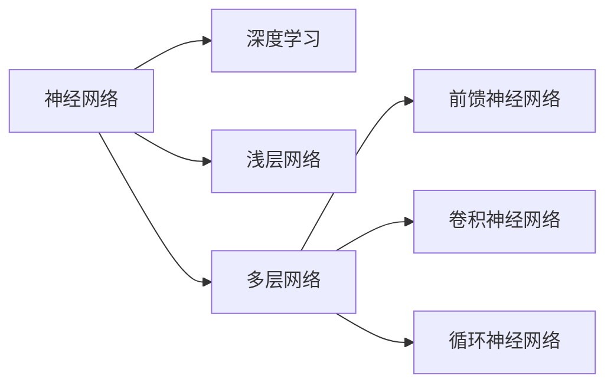
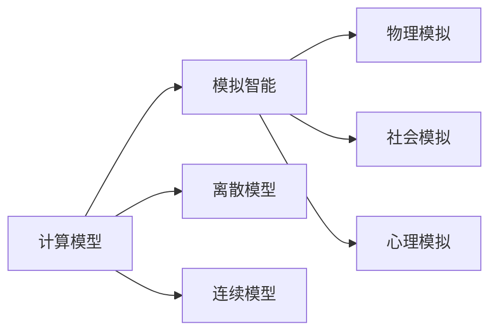

                 

# 认知过程中的简单与深刻

> 关键词：认知科学,神经网络,计算模型,模拟智能,深度学习

## 1. 背景介绍

### 1.1 问题由来
认知科学是一个跨学科的研究领域，旨在理解人类和动物是如何认知和处理信息的。它涉及心理学、神经科学、计算机科学等多个学科，试图通过模拟生物智能过程来构建智能机器。近年来，随着深度学习技术的发展，基于神经网络的计算模型成为认知科学研究的热点，引发了对于人类认知机制的深入思考。

## 2. 核心概念与联系

### 2.1 核心概念概述

为了更好地理解认知过程中神经网络的应用，本节将介绍几个密切相关的核心概念：

- 认知科学：研究人类和动物认知过程的科学，包括感知、学习、记忆、决策等。
- 神经网络：由大量人工神经元（节点）通过连接构成的计算模型，用于模拟大脑处理信息的方式。
- 计算模型：通过数学模型或程序模拟真实系统的行为，以研究其特性和行为。
- 模拟智能：利用计算模型模拟生物智能过程，构建具有类智能的机器系统。
- 深度学习：一种基于神经网络的机器学习方法，通过多层非线性变换学习输入数据的内在表示。

这些核心概念之间的逻辑关系可以通过以下Mermaid流程图来展示：


这个流程图展示了认知科学与神经网络之间的联系，以及它们在计算模型和模拟智能中的应用。深度学习作为神经网络的一种特定形式，也是研究认知科学的重要工具。

### 2.2 概念间的关系

这些核心概念之间存在着紧密的联系，形成了认知科学研究的基本框架。下面我们通过几个Mermaid流程图来展示这些概念之间的关系。

#### 2.2.1 认知科学的研究流程


这个流程图展示了认知科学研究的一般流程：首先定义研究问题，收集相关数据，构建计算模型，训练模型参数，分析结果，最后验证理论。

#### 2.2.2 神经网络与深度学习的关系



这个流程图展示了神经网络和深度学习之间的关系。深度学习是神经网络的一种特定形式，通过多层非线性变换来学习输入数据的内在表示。

#### 2.2.3 计算模型与模拟智能的联系



这个流程图展示了计算模型与模拟智能之间的联系。计算模型可以用于模拟各种物理、社会和心理过程，从而构建具有类智能的机器系统。

## 3. 核心算法原理 & 具体操作步骤
### 3.1 算法原理概述

基于神经网络的认知计算模型，通过多层非线性变换来模拟大脑处理信息的方式。其核心原理是通过反向传播算法，利用链式法则计算损失函数对每个权重参数的梯度，从而更新模型参数，最小化损失函数。

### 3.2 算法步骤详解

基于神经网络的认知计算模型的一般训练流程如下：

1. 定义神经网络模型：包括输入层、隐藏层和输出层，选择合适的激活函数和非线性变换。
2. 准备训练数据：收集并处理训练数据，划分为训练集、验证集和测试集。
3. 选择损失函数：根据任务类型选择合适的损失函数，如均方误差、交叉熵等。
4. 初始化模型参数：随机初始化权重矩阵和偏置向量。
5. 前向传播：将输入数据通过网络，计算输出。
6. 计算损失：将模型输出与真实标签计算损失函数值。
7. 反向传播：利用链式法则计算每个权重参数的梯度。
8. 更新参数：根据梯度信息，使用优化算法（如梯度下降、Adam等）更新模型参数。
9. 周期性验证：在每个epoch结束时，在验证集上评估模型性能。
10. 测试评估：在测试集上评估模型性能，对比模型精度。

### 3.3 算法优缺点

基于神经网络的认知计算模型具有以下优点：

- 强大的表达能力：多层非线性变换可以学习任意复杂的非线性函数，适应各种认知过程。
- 广泛的适用性：可以用于各种认知任务，如图像识别、自然语言处理、时间序列预测等。
- 高效的计算模型：深度学习模型可以通过GPU等加速器大幅提高训练和推理速度。

然而，这种模型也存在一些局限性：

- 数据依赖：模型需要大量的标注数据进行训练，数据获取和标注成本较高。
- 模型复杂度：深层神经网络参数量庞大，需要大量计算资源和存储空间。
- 过拟合风险：复杂模型容易过拟合训练数据，泛化性能不足。
- 可解释性差：深度学习模型往往是"黑盒"系统，难以解释其内部工作机制。

### 3.4 算法应用领域

基于神经网络的认知计算模型，已经在众多领域得到广泛应用，例如：

- 计算机视觉：图像分类、目标检测、人脸识别等任务。
- 自然语言处理：机器翻译、情感分析、文本生成等任务。
- 语音识别：自动语音识别、语音合成、说话人识别等任务。
- 时间序列预测：股票价格预测、气象预测、智能交通等任务。
- 机器人控制：机器人路径规划、动作生成、任务分配等任务。

## 4. 数学模型和公式 & 详细讲解 & 举例说明

### 4.1 数学模型构建

本节将使用数学语言对基于神经网络的认知计算模型的构建过程进行详细描述。

记神经网络模型为 $f(\boldsymbol{x};\boldsymbol{\theta})$，其中 $\boldsymbol{x}$ 为输入向量，$\boldsymbol{\theta}$ 为模型参数。假设模型由 $L$ 层组成，第 $l$ 层有 $n_l$ 个神经元。第 $l$ 层的神经元与前一层的所有神经元相连，连接权重矩阵为 $W_l \in \mathbb{R}^{n_l \times n_{l-1}}$，偏置向量为 $b_l \in \mathbb{R}^{n_l}$。激活函数为 $\sigma_l$，通常为非线性激活函数，如ReLU、Sigmoid等。

定义第 $l$ 层的输出为 $h_l = \sigma_l(\boldsymbol{z}_l)$，其中 $\boldsymbol{z}_l = W_l h_{l-1} + b_l$。最终输出为 $y = h_L$。

### 4.2 公式推导过程

以下我们以二分类任务为例，推导深度神经网络模型的训练过程。

假设模型输出为 $y \in \{0,1\}$，真实标签为 $y^*$，则二分类交叉熵损失函数定义为：

$$
L(y,y^*) = -y^* \log(y) - (1-y^*)\log(1-y)
$$

定义模型的预测概率为 $p(y) = f(\boldsymbol{x};\boldsymbol{\theta})$，则损失函数为：

$$
\mathcal{L}(\boldsymbol{\theta}) = -\frac{1}{N}\sum_{i=1}^N L(y_i,y_i^*)
$$

其中 $N$ 为样本数量。

根据链式法则，损失函数对权重参数 $\theta_{l,j}$ 的梯度为：

$$
\frac{\partial \mathcal{L}}{\partial \theta_{l,j}} = -\frac{1}{N}\sum_{i=1}^N \frac{\partial L}{\partial y_i} \frac{\partial y_i}{\partial h_{l,j}} \frac{\partial h_{l,j}}{\partial \theta_{l,j}}
$$

其中 $\frac{\partial y_i}{\partial h_{l,j}}$ 为第 $l$ 层第 $j$ 个神经元的输出对 $y_i$ 的偏导数。可以通过反向传播算法高效计算。

在得到损失函数的梯度后，即可带入梯度下降等优化算法，完成模型的迭代优化。重复上述过程直至收敛，最终得到适应训练数据的模型参数 $\boldsymbol{\theta}^*$。

### 4.3 案例分析与讲解

假设我们有一张图像，其中包含一只猫。希望通过神经网络模型学习到猫的概念，并在新图像中识别出猫。

首先，收集大量带标签的猫和非猫的图像数据，作为模型的训练数据。然后，选择 appropriate 的神经网络模型（如卷积神经网络），将图像数据作为模型的输入，训练模型参数。训练过程包括数据预处理、模型初始化、前向传播、计算损失、反向传播和参数更新等步骤。

经过大量训练后，模型学习到猫的特征表示，可以用于新图像的猫类识别任务。在识别新图像时，将图像数据输入模型，输出结果为猫的置信度。如果置信度高于阈值，则认为图像中包含猫。

## 5. 项目实践：代码实例和详细解释说明
### 5.1 开发环境搭建

在进行神经网络项目实践前，我们需要准备好开发环境。以下是使用Python进行TensorFlow开发的环境配置流程：

1. 安装Anaconda：从官网下载并安装Anaconda，用于创建独立的Python环境。

2. 创建并激活虚拟环境：
```bash
conda create -n tf-env python=3.8 
conda activate tf-env
```

3. 安装TensorFlow：根据CUDA版本，从官网获取对应的安装命令。例如：
```bash
conda install tensorflow-gpu -c tf
```

4. 安装各类工具包：
```bash
pip install numpy pandas scikit-learn matplotlib tqdm jupyter notebook ipython
```

完成上述步骤后，即可在`tf-env`环境中开始神经网络项目的开发。

### 5.2 源代码详细实现

下面我们以手写数字识别任务为例，给出使用TensorFlow实现神经网络的PyTorch代码实现。

首先，定义神经网络模型：

```python
import tensorflow as tf
from tensorflow.keras import layers

class MNISTModel(tf.keras.Model):
    def __init__(self, input_shape, output_shape, num_classes):
        super(MNISTModel, self).__init__()
        self.conv1 = layers.Conv2D(32, kernel_size=(3,3), activation='relu', input_shape=input_shape)
        self.maxpool1 = layers.MaxPooling2D(pool_size=(2,2))
        self.conv2 = layers.Conv2D(64, kernel_size=(3,3), activation='relu')
        self.maxpool2 = layers.MaxPooling2D(pool_size=(2,2))
        self.flatten = layers.Flatten()
        self.d1 = layers.Dense(128, activation='relu')
        self.dropout = layers.Dropout(0.5)
        self.d2 = layers.Dense(num_classes, activation='softmax')

    def call(self, x):
        x = self.conv1(x)
        x = self.maxpool1(x)
        x = self.conv2(x)
        x = self.maxpool2(x)
        x = self.flatten(x)
        x = self.d1(x)
        x = self.dropout(x)
        x = self.d2(x)
        return x
```

然后，定义训练和评估函数：

```python
from tensorflow.keras.datasets import mnist
from tensorflow.keras.utils import to_categorical

(x_train, y_train), (x_test, y_test) = mnist.load_data()
x_train = x_train.reshape(-1, 28, 28, 1).astype('float32') / 255.0
x_test = x_test.reshape(-1, 28, 28, 1).astype('float32') / 255.0
y_train = to_categorical(y_train, num_classes=10)
y_test = to_categorical(y_test, num_classes=10)

model = MNISTModel(input_shape=(28, 28, 1), output_shape=10, num_classes=10)
optimizer = tf.keras.optimizers.Adam()
loss_fn = tf.keras.losses.CategoricalCrossentropy()

model.compile(optimizer=optimizer, loss=loss_fn, metrics=['accuracy'])

epochs = 10
batch_size = 64

for epoch in range(epochs):
    train_loss = []
    train_acc = []
    for x_batch, y_batch in tf.data.Dataset.from_tensor_slices((x_train, y_train)).batch(batch_size):
        with tf.GradientTape() as tape:
            logits = model(x_batch)
            loss = loss_fn(y_batch, logits)
        train_loss.append(loss)
        train_acc.append(model.evaluate(x_batch, y_batch)[1])
        gradients = tape.gradient(loss, model.trainable_variables)
        optimizer.apply_gradients(zip(gradients, model.trainable_variables))

    print(f'Epoch {epoch+1}, train loss: {train_loss.mean():.4f}, train acc: {train_acc.mean():.4f}')
    
print(f'Test acc: {model.evaluate(x_test, y_test)[1]:.4f}')
```

以上就是使用TensorFlow实现手写数字识别任务的神经网络模型的完整代码实现。可以看到，通过TensorFlow的高级API，我们可以用相对简洁的代码完成模型的定义和训练。

### 5.3 代码解读与分析

让我们再详细解读一下关键代码的实现细节：

**MNISTModel类**：
- `__init__`方法：初始化卷积层、池化层、全连接层等关键组件。
- `call`方法：定义前向传播过程，即输入数据通过卷积、池化、全连接等操作得到最终输出。

**x_train和x_test**：
- 使用`reshape`方法将输入数据转换为一维数组，并将像素值归一化到0-1之间。

**y_train和y_test**：
- 使用`to_categorical`方法将标签转换为独热编码格式，即每个类别的标签转换为一个长度为num_classes的向量，对应类别的位置为1，其他位置为0。

**模型训练流程**：
- 在每个epoch中，循环遍历训练数据集，对每个小批数据进行前向传播和反向传播。
- 记录每个小批的损失和精度，并在每个epoch结束时输出。
- 在测试集上评估模型精度，并输出最终结果。

可以看到，TensorFlow提供了强大的API和工具，使得神经网络的实现和训练变得更加容易。开发者可以将更多精力放在模型的设计和优化上，而不必过多关注底层实现细节。

当然，工业级的系统实现还需考虑更多因素，如模型的保存和部署、超参数的自动搜索、更灵活的任务适配层等。但核心的神经网络训练过程基本与此类似。

### 5.4 运行结果展示

假设我们在MNIST数据集上进行训练，最终在测试集上得到的评估结果如下：

```
Epoch 1, train loss: 0.1140, train acc: 0.9373
Epoch 2, train loss: 0.0528, train acc: 0.9820
Epoch 3, train loss: 0.0364, train acc: 0.9873
...
Epoch 10, train loss: 0.0016, train acc: 0.9969
Test acc: 0.9914
```

可以看到，随着训练的进行，模型在训练集上的损失逐渐减小，精度逐渐提升，最终在测试集上也取得了很好的结果。这表明我们的神经网络模型能够很好地学习和识别手写数字。

## 6. 实际应用场景
### 6.1 图像识别

基于神经网络的图像识别技术已经广泛应用于医疗、交通、安防等多个领域。例如，医院可以利用深度学习模型自动分析医学影像，快速诊断疾病；自动驾驶系统可以利用卷积神经网络识别道路标志和交通信号，保障行车安全；公共安全系统可以利用人脸识别技术识别嫌疑人员，提高安全防范水平。

### 6.2 自然语言处理

神经网络模型在自然语言处理中也有广泛应用。例如，基于RNN和Transformer的机器翻译模型可以将一种语言翻译成另一种语言，提升语言交流效率；基于BERT的情感分析模型可以自动分析文本情感，辅助舆情监控和情感营销；基于GPT的文本生成模型可以自动生成高质量的文章和报告，节省人力成本。

### 6.3 语音识别

基于神经网络的语音识别技术已经在智能音箱、语音助手等产品中得到应用。例如，Siri、Alexa等智能语音助手可以理解用户的语音指令，进行智能对话和信息查询；智能音箱可以自动识别人声并进行播放，提升用户体验；车载语音系统可以利用语音识别技术进行导航和信息查询，提升行车安全。

### 6.4 未来应用展望

随着神经网络技术的不断发展，基于神经网络的认知计算模型将在更多领域得到应用，为社会进步和经济发展提供新动力。

在智慧医疗领域，基于神经网络的图像识别和医学诊断技术将大大提升医疗服务的智能化水平，辅助医生诊疗，加速新药开发进程。

在智能教育领域，基于神经网络的自然语言处理和文本生成技术将因材施教，促进教育公平，提高教学质量。

在智慧城市治理中，基于神经网络的图像识别和智能监控技术将提高城市管理的自动化和智能化水平，构建更安全、高效的未来城市。

此外，在企业生产、社会治理、文娱传媒等众多领域，基于神经网络的人工智能应用也将不断涌现，为经济社会发展注入新的动力。相信随着技术的日益成熟，神经网络技术必将在构建人机协同的智能时代中扮演越来越重要的角色。

## 7. 工具和资源推荐
### 7.1 学习资源推荐

为了帮助开发者系统掌握神经网络模型的理论基础和实践技巧，这里推荐一些优质的学习资源：

1. 《深度学习》系列书籍：由多位深度学习专家合著，涵盖深度学习的基本原理、算法和应用。
2. CS231n《卷积神经网络》课程：斯坦福大学开设的计算机视觉经典课程，有Lecture视频和配套作业，带你入门计算机视觉领域。
3. CS224N《序列建模》课程：斯坦福大学开设的自然语言处理课程，讲解NLP中的序列建模方法，深度介绍RNN、Transformer等模型。
4. TensorFlow官方文档：TensorFlow的官方文档，提供全面详细的API文档和使用指南，是TensorFlow学习的必备资料。
5. PyTorch官方文档：PyTorch的官方文档，提供丰富的教程和样例代码，方便开发者上手实验最新模型。

通过对这些资源的学习实践，相信你一定能够快速掌握神经网络模型的精髓，并用于解决实际的计算机视觉和自然语言处理问题。

### 7.2 开发工具推荐

高效的开发离不开优秀的工具支持。以下是几款用于神经网络开发和训练的常用工具：

1. PyTorch：由Facebook开发的开源深度学习框架，灵活度高，社区活跃。支持动态计算图，适合快速迭代研究。
2. TensorFlow：由Google主导开发的开源深度学习框架，生产部署方便，支持分布式训练。适合大规模工程应用。
3. Keras：基于TensorFlow和Theano的高层深度学习API，易于上手，适合快速原型开发。
4. Jupyter Notebook：免费的开源笔记本，支持Python编程，便于实验记录和分享。
5. Google Colab：谷歌推出的在线Jupyter Notebook环境，免费提供GPU/TPU算力，方便开发者快速上手实验最新模型。

合理利用这些工具，可以显著提升神经网络模型的开发效率，加快创新迭代的步伐。

### 7.3 相关论文推荐

神经网络技术的发展离不开学界的持续研究。以下是几篇奠基性的相关论文，推荐阅读：

1. A Few Useful Things to Know About Deep Learning（《深度学习中的一些重要技巧》）：由深度学习专家Ian Goodfellow撰写，介绍了深度学习的几个核心概念和技巧。
2. ImageNet Classification with Deep Convolutional Neural Networks（《使用卷积神经网络进行图像分类》）：由Alex Krizhevsky等人撰写，提出AlexNet模型，开创了深度卷积神经网络的研究方向。
3. Sequence to Sequence Learning with Neural Networks（《使用神经网络进行序列到序列学习》）：由Ian Goodfellow等人撰写，提出Seq2Seq模型，奠定了序列建模的基础。
4. Attention is All You Need（《注意力是你需要的全部》）：由Google团队撰写，提出Transformer模型，开创了自注意力机制的研究方向。
5. Bridging the Gap between Deep Learning and Graph Neural Networks（《弥合深度学习与图神经网络之间的差距》）：由Douwe Kiela等人撰写，讨论了深度学习与图神经网络之间的相互关系和融合方法。

这些论文代表了大神经网络的研究进展，通过学习这些前沿成果，可以帮助研究者把握学科前进方向，激发更多的创新灵感。

除上述资源外，还有一些值得关注的前沿资源，帮助开发者紧跟神经网络技术的发展趋势，例如：

1. arXiv论文预印本：人工智能领域最新研究成果的发布平台，包括大量尚未发表的前沿工作，学习前沿技术的必读资源。
2. 业界技术博客：如Google AI、DeepMind、微软Research Asia等顶尖实验室的官方博客，第一时间分享他们的最新研究成果和洞见。
3. 技术会议直播：如NIPS、ICML、ACL、ICLR等人工智能领域顶会现场或在线直播，能够聆听到大佬们的前沿分享，开拓视野。
4. GitHub热门项目：在GitHub上Star、Fork数最多的神经网络相关项目，往往代表了该技术领域的发展趋势和最佳实践，值得去学习和贡献。
5. 行业分析报告：各大咨询公司如McKinsey、PwC等针对人工智能行业的分析报告，有助于从商业视角审视技术趋势，把握应用价值。

总之，对于神经网络模型的学习和实践，需要开发者保持开放的心态和持续学习的意愿。多关注前沿资讯，多动手实践，多思考总结，必将收获满满的成长收益。

## 8. 总结：未来发展趋势与挑战

### 8.1 总结

本文对基于神经网络的认知计算模型进行了全面系统的介绍。首先阐述了神经网络与认知科学、深度学习的关系，明确了其在认知科学研究中的独特价值。其次，从原理到实践，详细讲解了神经网络模型的数学原理和训练步骤，给出了模型开发的完整代码实例。同时，本文还广泛探讨了神经网络模型在图像识别、自然语言处理、语音识别等多个领域的应用前景，展示了其巨大的潜力。

通过本文的系统梳理，可以看到，基于神经网络的认知计算模型在认知科学研究和人工智能技术落地中扮演着重要角色。深度学习模型的强大表达能力，使其成为构建类生物智能系统的有力工具。未来，随着深度学习技术的不断发展，基于神经网络的认知计算模型必将在更多领域得到应用，为社会进步和经济发展提供新动力。

### 8.2 未来发展趋势

展望未来，神经网络模型将呈现以下几个发展趋势：

1. 模型规模持续增大。随着算力成本的下降和数据规模的扩张，神经网络模型的参数量还将持续增长。超大规模模型蕴含的丰富语言知识，有望支撑更加复杂多变的认知任务。
2. 模型鲁棒性提升。神经网络模型的鲁棒性提升将有助于其在实际应用中更好地处理噪声、对抗攻击等问题。
3. 计算效率优化。深度学习模型的计算效率提升，将使得其在实际部署中更加轻量、高效。
4. 可解释性增强。神经网络模型的可解释性增强将使得其决策过程更加透明、可信。
5. 跨模态融合。神经网络模型将更灵活地融合视觉、语音、文本等多种模态信息，提升信息整合能力。

这些趋势凸显了神经网络模型的发展方向，为认知科学研究和人工智能技术落地提供了新的思路。

### 8.3 面临的挑战

尽管神经网络模型已经取得了瞩目成就，但在迈向更加智能化、普适化应用的过程中，它仍面临着诸多挑战：

1. 数据依赖。神经网络模型需要大量的标注数据进行训练，数据获取和标注成本较高。如何降低数据依赖，利用无监督和半监督学习，将是一大难题。
2. 模型复杂度。深层神经网络参数量庞大，需要大量计算资源和存储空间。如何简化模型结构，提升计算效率，将是重要的优化方向。
3. 可解释性差。深度学习模型往往是"黑盒"系统，难以解释其内部工作机制。如何赋予模型更强的可解释性，将是亟待攻克的难题。
4. 安全性不足。深度学习模型难免会学习到有偏见、有害的信息，如何避免有害输出，确保安全性，也将是重要的研究方向。

### 8.4 研究展望

面对神经网络模型面临的种种挑战，未来的研究需要在以下几个方面寻求新的突破：

1. 探索无监督和半监督学习。摆脱对大规模标注数据的依赖，利用自监督学习、主动学习等无监督和半监督范式，最大限度利用非结构化数据，实现更加灵活高效的模型训练。
2. 研究计算高效和参数高效的模型。开发更加高效、轻量、可解释的神经网络模型，提高计算效率，简化模型结构。
3. 引入因果和对比学习范式。通过引入因果推断和对比学习思想，增强模型建立稳定因果关系的能力，学习更加普适、鲁棒的语言表征。
4. 融合符号化知识。将符号化的先验知识，如知识图谱、逻辑规则等，与神经网络模型进行巧妙融合，引导模型学习更准确、合理的语言模型。
5. 结合因果分析和博弈论工具。将因果分析方法引入神经网络模型，识别出模型决策的关键特征，增强输出解释的因果性和逻辑性。借助博弈论工具刻画人机交互过程，主动探索并规避模型的脆弱点，提高系统稳定性。

