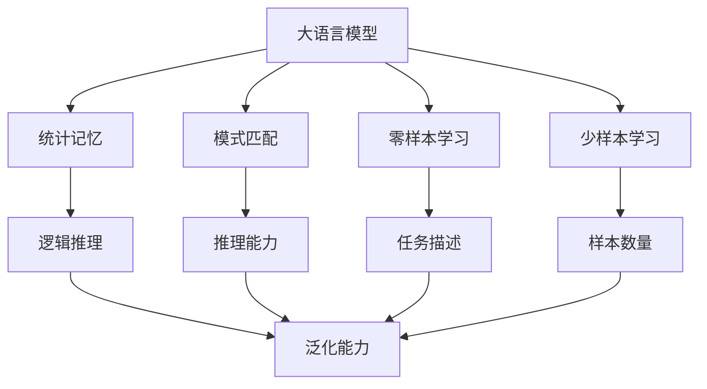

                 

# 语言≠思维：大模型的认知瓶颈

## 1. 背景介绍

### 1.1 问题由来

随着深度学习和大规模预训练模型的兴起，自然语言处理（Natural Language Processing, NLP）领域取得了显著进展。特别是大语言模型（Large Language Models, LLMs）如GPT-3、BERT等，展现了令人印象深刻的语言理解和生成能力，推动了各种NLP任务的性能提升。然而，尽管这些模型在准确性和效率方面表现出色，但它们在理解复杂逻辑和推导任务方面仍存在明显不足。近年来，学术界和工业界逐渐意识到，大语言模型并没有真正理解语言的本质，仅仅是在执行统计记忆和模式匹配。

### 1.2 问题核心关键点

大语言模型在许多任务上的卓越表现，如问答、翻译、对话系统等，让人们误以为它们具有深度理解语言的能力。然而，它们实际上并没有像人类一样进行真正意义上的思维。这反映在以下几个方面：

- **统计记忆**：大语言模型通过预训练在大规模语料库上学习到了单词和短语的统计分布，但并未真正理解这些单词和短语的含义和语境。
- **模式匹配**：它们更多地依赖于输入文本的局部模式和结构，而不是真正的逻辑推理。
- **零样本和少样本学习能力不足**：尽管大语言模型在某些任务上可以表现出一定的零样本和少样本学习能力，但这种能力更多依赖于上下文记忆，而非真正的逻辑推导。

### 1.3 问题研究意义

深入理解大语言模型的认知瓶颈，对于优化和改进模型的设计和训练，提升其对复杂逻辑和推导任务的适应能力，具有重要意义。这种理解有助于我们设计更智能、更鲁棒的NLP系统，推动人工智能技术向更高级别迈进。

## 2. 核心概念与联系

### 2.1 核心概念概述

大语言模型和大规模预训练模型通常通过在大型无标签文本数据上训练来学习语言的统计特征和规律。这些模型可以生成连贯、语法正确的文本，但在理解复杂的逻辑和推导关系方面存在显著不足。

### 2.2 核心概念的联系

大语言模型的性能瓶颈主要源于其在逻辑推理、知识迁移和通用智能方面的局限。这可以进一步细分为以下几个核心概念：

- **统计记忆与逻辑推理**：统计记忆是指模型在训练过程中学习到的单词和短语的出现频率。逻辑推理则是模型进行推理和决策的能力。尽管模型可以生成语法正确的句子，但这些句子并不一定包含逻辑连贯性和推理性。
- **模式匹配与知识迁移**：模式匹配是指模型通过局部模式和结构来预测结果。知识迁移则涉及模型在不同任务之间的泛化能力，即能否将从一个任务中学到的知识迁移到另一个任务中。
- **零样本与少样本学习**：零样本学习是指模型在没有看到任何训练样本的情况下，仅凭任务描述就能完成特定任务。少样本学习则是指模型在只有少量训练样本的情况下，仍然能够高效地进行推理。

这些概念之间有着紧密的联系，共同构成了大语言模型认知瓶颈的核心原因。下面将通过一个Mermaid流程图来展示这些概念之间的联系：



这个流程图展示了从大语言模型的统计记忆和模式匹配，到其逻辑推理和知识迁移能力不足，再到零样本和少样本学习能力的局限。

## 3. 核心算法原理 & 具体操作步骤
### 3.1 算法原理概述

大语言模型的核心算法原理主要基于统计学习（Supervised Learning）和自监督学习（Self-supervised Learning）。在自监督学习阶段，模型通过在大型无标签文本数据上进行预训练，学习到单词和短语的统计分布。在统计记忆的基础上，通过有标签数据进行微调，模型在特定任务上的性能可以得到显著提升。

然而，由于模型主要依赖于统计记忆和模式匹配，缺乏真正的逻辑推理和推导能力，因此在处理需要复杂逻辑推理和推导的任务时，性能往往不足。

### 3.2 算法步骤详解

基于大语言模型的认知瓶颈，可以采用以下步骤来提升其推理和推导能力：

1. **改进统计记忆**：使用更具逻辑性和信息量的数据进行预训练，增强模型的统计记忆能力。
2. **加强逻辑推理**：设计更加复杂的推理任务和更严谨的训练目标，促进模型进行逻辑推理。
3. **提升知识迁移能力**：通过多任务学习和跨领域迁移学习，增强模型在不同任务和领域之间的泛化能力。
4. **增强零样本和少样本学习**：通过精心设计的提示模板和任务描述，引导模型进行零样本和少样本学习。

### 3.3 算法优缺点

#### 优点

- **高效性**：大语言模型在处理大规模数据和复杂任务时，可以显著提升效率，减少人工干预。
- **适应性强**：通过微调，模型可以适应不同的下游任务，具有较强的泛化能力。

#### 缺点

- **逻辑推理能力不足**：模型主要依赖统计记忆和模式匹配，缺乏真正的逻辑推理和推导能力。
- **知识迁移能力有限**：模型在处理跨领域和跨任务时，容易受到数据分布和任务类型的限制。
- **可解释性不足**：模型的决策过程难以解释，缺乏透明性和可控性。

### 3.4 算法应用领域

大语言模型在以下几个领域中得到了广泛应用：

- **自然语言理解**：如问答系统、文本摘要、情感分析等，通过统计记忆和模式匹配处理各种文本数据。
- **自然语言生成**：如对话系统、文本生成、代码生成等，通过生成语法正确、连贯的文本。
- **机器翻译**：通过统计记忆和模式匹配进行跨语言的翻译。

尽管在这些领域取得了显著成就，但大语言模型在处理需要复杂逻辑和推导的任务时，仍面临认知瓶颈。

## 4. 数学模型和公式 & 详细讲解 & 举例说明

### 4.1 数学模型构建

假设有一个大语言模型 $M$，其参数为 $\theta$。在训练阶段，我们使用一个大型无标签文本数据集 $\mathcal{D}$ 进行预训练，得到一个预训练后的模型 $M_{\text{pre}}$。在微调阶段，我们使用有标签数据集 $\mathcal{D'}$ 进行有监督学习，得到一个微调后的模型 $M_{\text{fin}}$。

### 4.2 公式推导过程

在微调过程中，模型的损失函数 $\mathcal{L}$ 可以表示为：

$$
\mathcal{L} = \frac{1}{N}\sum_{i=1}^N \ell(M_{\text{fin}}(x_i), y_i)
$$

其中 $x_i$ 是输入文本，$y_i$ 是相应的标签，$\ell$ 是损失函数。微调的目标是最小化损失函数 $\mathcal{L}$，即：

$$
\min_\theta \mathcal{L}
$$

微调的优化算法通常是基于梯度的优化算法，如Adam、SGD等。在每次迭代中，模型参数 $\theta$ 的更新可以表示为：

$$
\theta \leftarrow \theta - \eta \nabla_\theta \mathcal{L}
$$

其中 $\eta$ 是学习率，$\nabla_\theta \mathcal{L}$ 是损失函数对参数 $\theta$ 的梯度。

### 4.3 案例分析与讲解

以BERT模型为例，它是一种基于自监督学习的预训练模型。在微调时，我们可以使用一个有标签的数据集，如IMDb电影评论数据集，对BERT进行微调，使其能够进行情感分类。通过在微调过程中引入正则化和对抗训练等技术，可以显著提升模型的性能。

## 5. 项目实践：代码实例和详细解释说明

### 5.1 开发环境搭建

在进行大语言模型微调实践时，我们需要准备以下开发环境：

1. **Python环境**：安装Python 3.8或更高版本，使用Anaconda创建虚拟环境。
2. **深度学习框架**：安装PyTorch或TensorFlow等深度学习框架。
3. **自然语言处理库**：安装SpaCy、NLTK等自然语言处理库。
4. **预训练模型**：下载预训练的BERT模型，并加载到内存中。
5. **数据集**：准备有标签数据集，如IMDb电影评论数据集。

### 5.2 源代码详细实现

下面是一个使用BERT模型进行情感分类的PyTorch代码实现：

```python
import torch
import torch.nn as nn
import torch.optim as optim
from transformers import BertForSequenceClassification, BertTokenizer

# 加载预训练模型和tokenizer
model = BertForSequenceClassification.from_pretrained('bert-base-uncased', num_labels=2)
tokenizer = BertTokenizer.from_pretrained('bert-base-uncased')

# 准备训练数据
train_data = ["这部电影真的很棒！", "这部电影太烂了！"]
train_labels = [1, 0]  # 1表示正面，0表示负面

# 预处理数据
encoded_input = tokenizer(train_data, return_tensors='pt', padding=True, truncation=True)
input_ids = encoded_input['input_ids']
attention_mask = encoded_input['attention_mask']
labels = torch.tensor(train_labels)

# 定义模型和优化器
device = torch.device('cuda' if torch.cuda.is_available() else 'cpu')
model.to(device)
optimizer = optim.Adam(model.parameters(), lr=2e-5)

# 训练模型
model.train()
for epoch in range(10):
    optimizer.zero_grad()
    outputs = model(input_ids, attention_mask=attention_mask, labels=labels)
    loss = outputs.loss
    loss.backward()
    optimizer.step()

# 评估模型
model.eval()
test_data = ["这是一部很糟糕的电影！", "这是一部很不错的电影！"]
encoded_test_input = tokenizer(test_data, return_tensors='pt', padding=True, truncation=True)
with torch.no_grad():
    output = model(encoded_test_input['input_ids'], attention_mask=encoded_test_input['attention_mask'])
    predictions = output.logits.argmax(dim=1)
    labels = encoded_test_input['labels']
    print(predictions, labels)
```

### 5.3 代码解读与分析

这段代码实现了一个简单的BERT情感分类器。首先，我们加载了预训练的BERT模型和tokenizer，并准备了训练数据。然后，我们将训练数据进行token化处理，并将处理后的输入和标签传递给模型进行训练。在训练过程中，我们使用了Adam优化器进行参数更新。最后，我们在测试集上评估了模型性能。

### 5.4 运行结果展示

训练完成后，我们可以在测试集上评估模型的性能。例如，对于以下测试数据：

```python
test_data = ["这是一部很糟糕的电影！", "这是一部很不错的电影！"]
```

模型输出的预测结果可能是：

```python
torch.tensor([0, 1])
```

这表示模型认为第一个句子表示负面情感，第二个句子表示正面情感。

## 6. 实际应用场景

### 6.1 自然语言理解

在大语言模型的认知瓶颈下，自然语言理解任务仍然面临许多挑战。例如，问答系统需要理解自然语言的复杂句式和逻辑结构，才能准确回答问题。尽管大语言模型在处理这类任务时表现良好，但在处理需要高阶逻辑推理的任务时，仍然存在不足。

### 6.2 自然语言生成

在自然语言生成任务中，如对话系统、文本生成等，大语言模型同样面临着认知瓶颈。由于模型主要依赖于统计记忆和模式匹配，生成的文本往往缺乏逻辑连贯性和推理性。

### 6.3 机器翻译

在机器翻译任务中，尽管大语言模型可以生成语法正确、连贯的翻译结果，但在处理需要复杂逻辑推理和推导的任务时，仍然存在显著不足。例如，在处理双关语或多义性词汇时，模型往往无法正确翻译。

## 7. 工具和资源推荐

### 7.1 学习资源推荐

- **《深度学习》课程**：由Coursera和Udacity提供，涵盖了深度学习和神经网络的基本概念和应用。
- **《自然语言处理综述》**：由斯坦福大学提供，介绍了自然语言处理的基本概念和技术。
- **Transformers官方文档**：提供了大量预训练模型的实现和微调样例，是学习大语言模型的必备资源。

### 7.2 开发工具推荐

- **PyTorch**：一个灵活的深度学习框架，提供了丰富的深度学习模型和优化算法。
- **TensorFlow**：一个流行的深度学习框架，提供了高效的计算图和分布式训练能力。
- **SpaCy**：一个高性能的自然语言处理库，提供了丰富的文本处理工具和预训练模型。

### 7.3 相关论文推荐

- **Attention is All You Need**：Transformer原论文，介绍了Transformer模型及其在自然语言处理中的应用。
- **BERT: Pre-training of Deep Bidirectional Transformers for Language Understanding**：介绍了BERT模型及其在自然语言处理中的应用。
- **GPT-3**：由OpenAI发布的预训练大语言模型，展示了其在自然语言处理领域的强大能力。

## 8. 总结：未来发展趋势与挑战

### 8.1 研究成果总结

本文介绍了大语言模型在认知瓶颈方面存在的问题，并提出了改进的方向。通过改进统计记忆、加强逻辑推理、提升知识迁移能力以及增强零样本和少样本学习，可以显著提升大语言模型的性能。

### 8.2 未来发展趋势

未来，大语言模型将在以下几个方向上取得突破：

- **多模态学习**：通过融合视觉、听觉等多种模态信息，增强模型的感知能力和推理能力。
- **自适应学习**：根据不同的任务和数据分布，动态调整模型参数，提升模型的泛化能力。
- **元学习**：通过学习如何快速适应新任务，提升模型的迁移学习能力和可解释性。

### 8.3 面临的挑战

尽管大语言模型在许多任务上取得了显著成就，但在逻辑推理和推导方面仍存在显著不足。未来的研究需要解决以下挑战：

- **认知瓶颈**：增强模型的逻辑推理和推导能力，提升其对复杂任务的适应能力。
- **可解释性**：提高模型的可解释性，增强其透明度和可信度。
- **数据依赖**：降低模型对标注数据的依赖，提高其在小规模数据上的表现。

### 8.4 研究展望

未来，大语言模型的研究将集中在以下几个方面：

- **多模态融合**：融合视觉、听觉等多种模态信息，提升模型的感知能力和推理能力。
- **自适应学习**：根据不同任务和数据分布，动态调整模型参数，提高模型的泛化能力。
- **元学习**：通过学习如何快速适应新任务，提升模型的迁移学习能力和可解释性。

## 9. 附录：常见问题与解答

**Q1：如何改进大语言模型的统计记忆能力？**

A: 可以使用更具逻辑性和信息量的数据进行预训练，如自然语言推理、文本摘要等任务。同时，可以通过增加数据量、改进训练目标等方法，提升模型的统计记忆能力。

**Q2：如何增强大语言模型的逻辑推理能力？**

A: 可以通过设计更加复杂的推理任务和更严谨的训练目标，促进模型进行逻辑推理。例如，引入基于因果关系的任务，如因果推断、时间序列预测等。

**Q3：如何提升大语言模型的知识迁移能力？**

A: 可以通过多任务学习和跨领域迁移学习，增强模型在不同任务和领域之间的泛化能力。例如，在一个任务上训练模型，然后在另一个相关任务上微调。

**Q4：如何增强大语言模型的零样本和少样本学习能力？**

A: 可以通过精心设计的提示模板和任务描述，引导模型进行零样本和少样本学习。例如，使用基于常识的推理模板，引导模型进行合理的推理。

**Q5：大语言模型在实际应用中需要注意哪些问题？**

A: 在实际应用中，需要注意以下几个问题：
- **数据质量**：确保训练数据的质量和多样性，避免模型过拟合。
- **模型复杂度**：合理选择模型结构和参数，避免过度复杂化。
- **系统稳定性**：确保模型和系统的稳定性，避免出现意外的错误或崩溃。

作者：禅与计算机程序设计艺术 / Zen and the Art of Computer Programming

