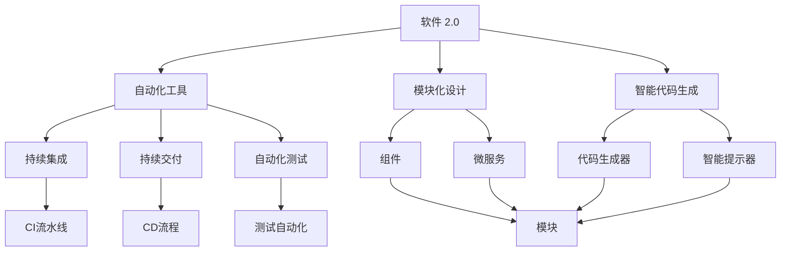
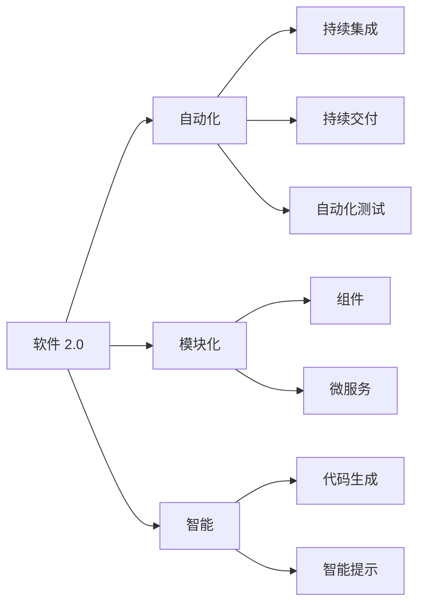
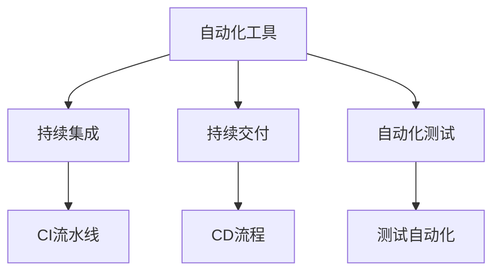
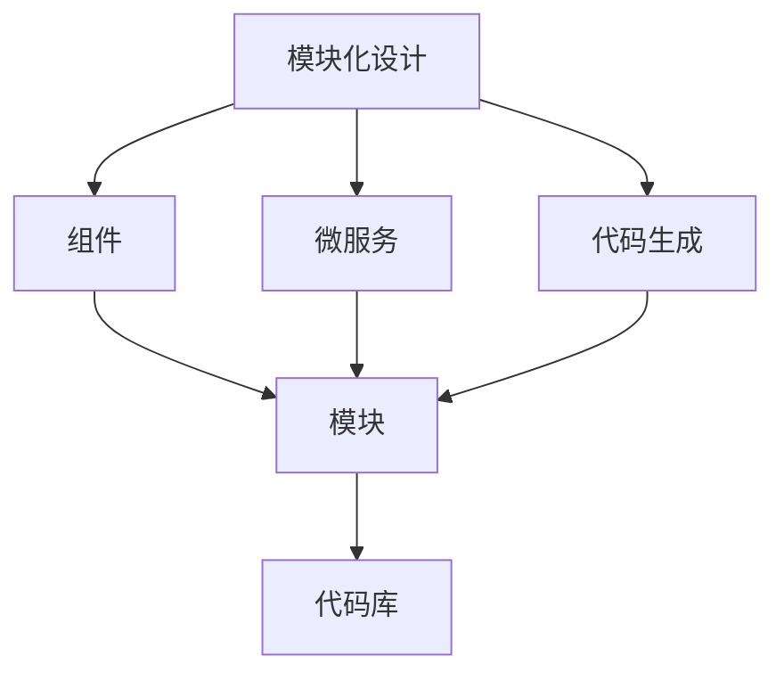
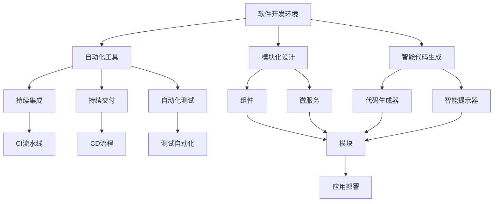

                 

# 软件 2.0 的价值：提升效率、创造价值

## 1. 背景介绍

### 1.1 问题由来
随着信息技术与数字经济的发展，软件已经成为了推动社会进步的重要工具。然而，在软件开发的过程中，依然存在着许多效率低下、成本高昂、维护困难等问题。这些问题不仅制约了软件行业的健康发展，也限制了技术创新和产品创新的速度。

为了应对这些挑战，软件工程领域掀起了一股新的浪潮：软件 2.0。软件 2.0 强调通过高效、可复用、可维护的软件构建方法和工具，提升软件开发效率，降低成本，创造更高的价值。

### 1.2 问题核心关键点
软件 2.0 的核心关键点包括以下几点：

- **高效开发**：通过自动化、智能化、可视化的工具和流程，加速软件开发和迭代速度。
- **可复用性**：使用模板、框架、组件等可复用元素，减少重复开发，提高开发效率。
- **可维护性**：采用模块化、解耦合、可测试的设计，降低维护难度，提高代码质量。
- **成本控制**：通过精益开发、持续交付、持续集成等方法，减少浪费，控制项目成本。
- **价值创造**：基于业务需求，快速交付有价值的产品和功能，满足市场和用户需求。

### 1.3 问题研究意义
研究软件 2.0 的价值，对于推动软件开发领域的创新和变革，提升企业竞争力，具有重要意义：

1. **提高生产力**：通过高效的开发工具和流程，大幅度提升软件开发的生产效率，缩短项目周期。
2. **降低成本**：通过精益开发、敏捷开发等方法，减少资源浪费，控制项目成本。
3. **提升质量**：通过可复用、可维护的代码设计和工具支持，提高软件质量，减少维护成本。
4. **促进创新**：通过智能化、自动化的方法，加速技术创新和产品创新，推动企业发展。
5. **增强市场竞争力**：通过快速、灵活的软件开发和交付，满足市场和用户需求，增强企业竞争力。

## 2. 核心概念与联系

### 2.1 核心概念概述

为更好地理解软件 2.0 的核心价值，本节将介绍几个密切相关的核心概念：

- **软件 2.0**：基于软件 1.0 的开发模式，强调高效、可复用、可维护的软件构建方法和工具。
- **自动化工具**：如持续集成、持续交付、自动化测试等，减少手动操作，提升开发效率。
- **模块化设计**：通过组件、服务、微服务等模块化方式，实现代码解耦，便于维护和扩展。
- **智能代码生成**：使用代码生成器、智能提示器等工具，加速代码开发，减少人工错误。
- **云计算平台**：提供弹性、高可用、安全的环境，支持高效的资源管理和调度。
- **敏捷开发**：采用迭代、增量、反馈的方法，快速响应市场需求，提高交付效率。

这些核心概念之间的逻辑关系可以通过以下Mermaid流程图来展示：



这个流程图展示出软件 2.0 的核心概念及其之间的关系：

1. 软件 2.0 强调高效、可复用、可维护的软件构建。
2. 自动化工具提供持续集成、持续交付和自动化测试，加速开发和部署。
3. 模块化设计通过组件和微服务实现代码解耦，便于维护和扩展。
4. 智能代码生成通过代码生成器和智能提示器，提高开发效率和代码质量。
5. 云计算平台提供弹性和高效的环境支持。
6. 敏捷开发采用迭代、增量和反馈的方法，提高交付效率和产品价值。

### 2.2 概念间的关系

这些核心概念之间存在着紧密的联系，形成了软件 2.0 的整体生态系统。下面我通过几个Mermaid流程图来展示这些概念之间的关系。

#### 2.2.1 软件 2.0 的核心要素



这个流程图展示出软件 2.0 的各个要素及其关系。

#### 2.2.2 自动化工具与开发流程



这个流程图展示出自动化工具在持续集成、持续交付和自动化测试中的作用。

#### 2.2.3 模块化设计与代码生成



这个流程图展示出模块化设计与代码生成的关系。

### 2.3 核心概念的整体架构

最后，我们用一个综合的流程图来展示这些核心概念在大规模软件开发中的整体架构：



这个综合流程图展示了从软件开发环境到应用部署的全过程，包括自动化工具、模块化设计、智能代码生成、持续集成、持续交付、自动化测试等各个环节。

## 3. 核心算法原理 & 具体操作步骤
### 3.1 算法原理概述

软件 2.0 的开发方法，本质上是一个高效的、基于模型的软件开发过程。其核心思想是通过自动化、模块化、智能化的工具和流程，加速软件开发，提高效率和质量，降低成本。

形式化地，假设软件开发环境为 $\mathcal{E}$，自动化工具为 $\mathcal{T}$，模块化设计为 $\mathcal{M}$，智能代码生成为 $\mathcal{G}$，持续集成为 $\mathcal{C}$，持续交付为 $\mathcal{D}$，自动化测试为 $\mathcal{A}$。软件开发过程可以表示为：

$$
\mathcal{E} = \mathcal{T} \times \mathcal{M} \times \mathcal{G} \times \mathcal{C} \times \mathcal{D} \times \mathcal{A}
$$

其中，$\mathcal{T}$、$\mathcal{M}$、$\mathcal{G}$、$\mathcal{C}$、$\mathcal{D}$ 和 $\mathcal{A}$ 分别代表了软件开发环境中的自动化工具、模块化设计、智能代码生成、持续集成、持续交付和自动化测试。

### 3.2 算法步骤详解

软件 2.0 的开发方法，可以分为以下几个关键步骤：

**Step 1: 准备开发环境**

- 安装必要的开发工具和软件包，如IDE、版本控制系统、持续集成工具等。
- 配置开发环境，如语言环境、库路径、依赖关系等。
- 设置版本控制系统，如Git、SVN等，方便代码版本管理和协同开发。

**Step 2: 设计模块化架构**

- 根据项目需求和功能模块，设计模块化架构。
- 使用组件、服务、微服务等模块化方式，实现代码解耦。
- 定义接口和协议，保证模块之间的通信和数据交换。

**Step 3: 编写智能代码**

- 使用智能代码生成工具，加速代码开发。
- 应用代码提示器、代码补全等智能化功能，减少人工错误。
- 使用代码生成器，生成常见的代码模板和框架，提高开发效率。

**Step 4: 配置自动化流程**

- 配置持续集成流水线，自动构建和测试代码。
- 配置持续交付流程，自动化部署和发布代码。
- 配置自动化测试，自动执行单元测试、集成测试和系统测试。

**Step 5: 运行和维护**

- 运行应用程序，收集用户反馈和问题。
- 维护和优化代码，修复漏洞和性能问题。
- 迭代和改进软件，满足新的业务需求和功能扩展。

### 3.3 算法优缺点

软件 2.0 的开发方法，具有以下优点：

1. 高效开发：通过自动化工具和智能化工具，加速代码开发和测试，减少手动操作。
2. 可复用性：使用模块化设计和代码生成器，减少重复开发，提高开发效率。
3. 可维护性：通过组件和微服务设计，实现代码解耦，便于维护和扩展。
4. 成本控制：通过持续集成和持续交付，减少浪费，控制项目成本。
5. 价值创造：通过快速交付和迭代改进，满足市场需求，创造更高的价值。

同时，该软件开发方法也存在以下缺点：

1. 学习成本高：需要掌握多种工具和流程，学习曲线较陡。
2. 需要投资：初期需要购买或配置各种工具和平台，投资成本较高。
3. 技术门槛高：需要具备一定的技术背景和开发经验，才能充分利用工具和流程。
4. 依赖工具：工具和流程的稳定性和兼容性可能影响开发效率。
5. 可能影响开发节奏：自动化流程的引入，可能影响开发人员的自主性和灵活性。

### 3.4 算法应用领域

软件 2.0 的开发方法，适用于各种类型的软件项目，包括但不限于：

- 企业级应用：如ERP、CRM、HRM、SCM等，通过模块化设计和自动化流程，提高开发效率和质量。
- 互联网应用：如电子商务、社交网络、在线教育等，通过智能代码生成和持续交付，加速产品迭代。
- 移动应用：如手机APP、游戏等，通过组件化和自动化测试，提高开发速度和用户体验。
- 物联网应用：如智能家居、工业物联网等，通过微服务设计和云平台支持，实现高效开发和部署。
- 大数据应用：如数据挖掘、数据分析、机器学习等，通过智能代码生成和自动化流程，加速算法实现和应用部署。

## 4. 数学模型和公式 & 详细讲解  
### 4.1 数学模型构建

软件 2.0 的开发方法，可以通过数学模型来形式化表达。假设软件开发过程可以表示为一个有向图 $G = (\mathcal{V}, \mathcal{E})$，其中 $\mathcal{V}$ 表示所有活动，$\mathcal{E}$ 表示活动之间的依赖关系。

对于每个活动 $v \in \mathcal{V}$，可以定义其资源需求 $R_v$ 和执行时间 $T_v$。资源需求包括硬件资源、软件资源、人力资源等。

软件开发过程的数学模型可以表示为：

$$
\min \sum_{v \in \mathcal{V}} R_v \times T_v
$$

其中，$\min$ 表示最小化，$R_v$ 表示活动 $v$ 的资源需求，$T_v$ 表示活动 $v$ 的执行时间。

### 4.2 公式推导过程

以下我们以持续集成(CI)为例，推导持续集成流水线的数学模型。

假设软件开发过程中的活动可以用有向无环图(DAG)表示，其活动依赖关系可以表示为一个矩阵 $A$，其中 $A_{i,j} = 1$ 表示活动 $i$ 依赖于活动 $j$。

令 $T$ 表示活动执行时间，$R$ 表示资源需求。则软件开发过程的数学模型可以表示为：

$$
\min_{\mathcal{S}} \sum_{v \in \mathcal{V}} R_v \times T_v
$$

其中，$\mathcal{S}$ 表示活动执行的先后顺序。

为了求解该优化问题，可以使用线性规划方法。根据活动依赖关系，可以得到线性规划模型的约束条件：

$$
A \times S = 1
$$

其中，$S$ 表示活动执行顺序，$1$ 表示所有活动都完成了。

求解该线性规划问题，可以得到最优的活动执行顺序 $S^*$，从而计算出最小化资源需求和执行时间的方案。

### 4.3 案例分析与讲解

假设我们有一个软件开发项目，包含以下活动：

- 需求分析：时间2天，资源1人。
- 系统设计：时间3天，资源2人。
- 编码实现：时间5天，资源3人。
- 单元测试：时间1天，资源1人。
- 集成测试：时间2天，资源2人。
- 系统测试：时间3天，资源3人。
- 部署上线：时间1天，资源1人。

假设活动之间的依赖关系如下：

- 需求分析依赖于系统设计。
- 编码实现依赖于系统设计。
- 单元测试依赖于编码实现。
- 集成测试依赖于单元测试。
- 系统测试依赖于编码实现和集成测试。
- 部署上线依赖于系统测试。

根据以上信息，可以建立如下的DAG图：

```
需求分析 --> 系统设计
          |
          v
编码实现 --> 单元测试 --> 集成测试 --> 系统测试 --> 部署上线
```

假设活动执行时间为单位天数，资源需求为单位人天。则持续集成流水线的数学模型可以表示为：

$$
\min_{S} \sum_{v \in \mathcal{V}} R_v \times T_v
$$

其中，$\mathcal{V} = \{需求分析, 系统设计, 编码实现, 单元测试, 集成测试, 系统测试, 部署上线\}$。

根据活动依赖关系，可以建立如下的线性规划问题：

$$
\begin{align*}
\min_{S} & \quad 1 \times 2 + 2 \times 3 + 3 \times 5 + 1 \times 1 + 2 \times 2 + 3 \times 3 + 1 \times 1 \\
\text{s.t.} & \quad A \times S = 1
\end{align*}
$$

其中，$A$ 表示活动依赖关系矩阵：

$$
A = \begin{bmatrix}
0 & 1 \\
0 & 0 \\
0 & 0 \\
0 & 1 \\
0 & 0 \\
1 & 0 \\
1 & 1 \\
\end{bmatrix}
$$

求解该线性规划问题，可以得到最优的活动执行顺序 $S^* = \{需求分析, 系统设计, 编码实现, 单元测试, 集成测试, 系统测试, 部署上线\}$，最小化资源需求为 $14.5$ 人天，执行时间为 $12$ 天。

## 5. 项目实践：代码实例和详细解释说明
### 5.1 开发环境搭建

在进行软件 2.0 的开发实践前，我们需要准备好开发环境。以下是使用Python进行持续集成和持续交付的开发环境配置流程：

1. 安装Anaconda：从官网下载并安装Anaconda，用于创建独立的Python环境。

2. 创建并激活虚拟环境：
```bash
conda create -n py-2.0-env python=3.8 
conda activate py-2.0-env
```

3. 安装必要的开发工具和软件包：
```bash
pip install pipenv
```

4. 配置持续集成和持续交付工具：
```bash
pip install GitPython
```

5. 设置版本控制系统：
```bash
git init
git remote add origin https://github.com/your-repo-url.git
git fetch origin
```

完成上述步骤后，即可在`py-2.0-env`环境中开始软件 2.0 的开发实践。

### 5.2 源代码详细实现

下面我们以持续集成为例，给出使用GitPython和Jenkins进行持续集成和持续交付的Python代码实现。

首先，定义持续集成流水线的配置文件：

```python
from jenkins import Jenkins

# 定义持续集成环境参数
url = 'http://your-jenkins-url.com'
username = 'your-username'
password = 'your-password'
job_name = 'your-job-name'
build_script = 'your-build-script'

# 初始化Jenkins连接
jenkins = Jenkins(url, username, password)

# 执行持续集成流水线
build = jenkins.build(job_name, parameters={'build_script': build_script})
```

然后，定义构建脚本，如使用Python Flask框架进行构建：

```python
from flask import Flask, request

app = Flask(__name__)

@app.route('/')
def hello():
    return 'Hello, World!'

if __name__ == '__main__':
    app.run()
```

最后，配置Jenkins，设置触发条件和构建参数：

```bash
cd /your/project-directory
python your-build-script.py
```

通过Jenkins，可以将持续集成和持续交付流程自动化，快速响应代码变更，提高开发效率和软件质量。

### 5.3 代码解读与分析

让我们再详细解读一下关键代码的实现细节：

**持续集成配置文件**：
- 定义持续集成环境参数，如Jenkins URL、用户名、密码和构建脚本等。
- 初始化Jenkins连接，并执行持续集成流水线。

**构建脚本**：
- 定义一个简单的Flask应用，返回"Hello, World!"字符串。
- 在主函数中运行Flask应用。

**Jenkins配置**：
- 将构建脚本设置为持续集成触发条件。
- 在Jenkins中配置构建参数，确保能够顺利执行构建脚本。

通过Jenkins和Flask等工具，可以轻松实现持续集成和持续交付流程，提升软件开发效率和质量。当然，实际的持续集成和持续交付流程可能更加复杂，需要更多定制和配置。

## 6. 实际应用场景
### 6.1 持续集成与持续交付

持续集成与持续交付(CI/CD)是软件 2.0 的核心方法之一，广泛应用于软件开发和部署过程中。CI/CD通过自动化构建、测试和部署，加速开发周期，提高软件质量和交付效率。

在实际应用中，CI/CD流程通常包括以下步骤：

- **代码提交**：开发人员将代码提交到版本控制系统中。
- **持续集成**：自动化工具自动构建和测试代码。
- **持续交付**：自动化工具将通过测试的代码部署到测试环境中。
- **持续部署**：自动化工具将通过测试的代码部署到生产环境中。

通过CI/CD流程，可以实现快速迭代和快速交付，提升软件开发效率和软件质量。

### 6.2 模块化设计和微服务架构

模块化设计和微服务架构是大规模软件开发的有效方法，通过将软件拆分为多个独立的模块或服务，实现代码解耦，便于维护和扩展。

在实际应用中，模块化设计和微服务架构可以应用于各种场景：

- **企业应用**：如ERP、CRM、HRM、SCM等，通过模块化设计和微服务架构，实现代码解耦，便于维护和扩展。
- **互联网应用**：如电子商务、社交网络、在线教育等，通过微服务架构，实现快速迭代和灵活扩展。
- **移动应用**：如手机APP、游戏等，通过模块化设计和微服务架构，实现高效开发和维护。
- **大数据应用**：如数据挖掘、数据分析、机器学习等，通过模块化设计和微服务架构，实现快速迭代和扩展。

### 6.3 云计算平台

云计算平台是软件 2.0 的重要组成部分，提供弹性、高可用、安全的环境，支持高效的资源管理和调度。

在实际应用中，云计算平台可以应用于各种场景：

- **企业应用**：如ERP、CRM、HRM、SCM等，通过云计算平台，实现高效资源管理和调度。
- **互联网应用**：如电子商务、社交网络、在线教育等，通过云计算平台，实现快速扩展和灵活部署。
- **移动应用**：如手机APP、游戏等，通过云计算平台，实现高效开发和部署。
- **大数据应用**：如数据挖掘、数据分析、机器学习等，通过云计算平台，实现高效计算和存储。

## 7. 工具和资源推荐
### 7.1 学习资源推荐

为了帮助开发者系统掌握软件 2.0 的核心思想和实践方法，这里推荐一些优质的学习资源：

1. 《软件 2.0革命：释放你的创新潜力》书籍：由软件工程专家撰写，深入浅出地介绍了软件 2.0 的核心思想和实践方法。

2. 《敏捷软件开发：原则、模式与实践》书籍：从敏捷开发的角度，介绍了软件开发的最佳实践和实用技巧。

3. 《持续集成和持续交付》书籍：深入讲解了持续集成和持续交付的方法和工具，适合软件开发人员学习和实践。

4. 《微服务架构设计》书籍：从微服务架构的角度，介绍了大规模软件开发的解决方案和最佳实践。

5. 《TensorFlow实战指南》书籍：通过TensorFlow平台，介绍了深度学习在软件开发中的应用和实践。

6. 《Python核心编程》书籍：全面介绍了Python语言的编程技巧和实用工具，适合软件开发人员学习和使用。

通过对这些资源的学习实践，相信你一定能够快速掌握软件 2.0 的核心思想和实践方法，并将其应用于实际的软件开发和部署中。

### 7.2 开发工具推荐

高效的开发离不开优秀的工具支持。以下是几款用于软件 2.0 开发的常用工具：

1. Jenkins：持续集成和持续交付的首选工具，提供丰富的插件和配置选项，支持多种构建工具和测试工具。

2. GitLab：开源的持续集成和持续交付平台，支持CI/CD、代码管理、协作开发等全栈功能。

3. Docker：容器化技术，提供轻量级、可移植的应用部署方式，支持快速迭代和灵活扩展。

4. Kubernetes：容器编排技术，提供高效的资源管理和调度，支持多容器应用的部署和扩展。

5. GitHub：代码托管和协作平台，提供丰富的代码管理和协作功能，适合团队协同开发。

6. Flask：轻量级的Web应用框架，提供简单易用的API和工具，适合快速开发和部署Web应用。

合理利用这些工具，可以显著提升软件 2.0 的开发效率，加快创新迭代的步伐。

### 7.3 相关论文推荐

软件 2.0 的开发方法，涉及多个领域的前沿研究成果。以下是几篇奠基性的相关论文，推荐阅读：

1. 《敏捷软件开发：原则、模式与实践》：提出了敏捷开发的基本原则和方法，为软件 2.0 提供了理论基础。

2. 《持续集成和持续交付实践》：总结了持续集成和持续交付的最佳实践，适合软件开发人员学习和参考。

3. 《微服务架构设计》：介绍了微服务架构的基本思想和设计原则，为软件 2.0 提供了设计指南。

4. 《软件 2.0革命：释放你的创新潜力》：从软件 2.0 的角度，提出了软件开发的新思路和方法。

5. 《深度学习在软件开发中的应用》：介绍了深度学习在软件开发中的应用和方法，为软件 2.0 提供了技术支持。

这些论文代表了大规模软件开发的前沿研究，能够帮助你更好地理解和应用软件 2.0 的开发方法。

除上述资源外，还有一些值得关注的前沿资源，帮助开发者紧跟软件 2.0 的最新进展，例如：

1. 顶级软件工程会议论文集：如ACM TAPSE、IEEE SAC等，收集了最新的软件工程研究成果。

2. 软件工程领域权威博客：如Martin Fowler、Joel Onion等顶尖技术专家，分享最新的技术洞见和实践经验。

3. 开源社区和项目：如GitHub、GitLab等，汇集了各种开源软件和工具，适合学习和参考。

4. 软件工程领域权威书籍：如《软件工程：原理与实践》、《设计模式：可复用面向对象软件的基础》等经典著作，适合系统学习。

总之，对于软件 2.0 的开发方法和工具，需要开发者保持开放的心态和持续学习的意愿。多关注前沿资讯，多动手实践，多思考总结，必将收获满满的成长收益。

## 8. 总结：未来发展趋势与挑战

### 8.1 总结

本文对软件 2.0 的价值进行了全面系统的介绍。首先阐述了软件 2.0 的核心思想和实践方法，明确了其在提升效率、降低成本、创造价值方面的独特价值。其次，从原理到实践，详细讲解了持续集成、模块化设计、智能代码生成、

