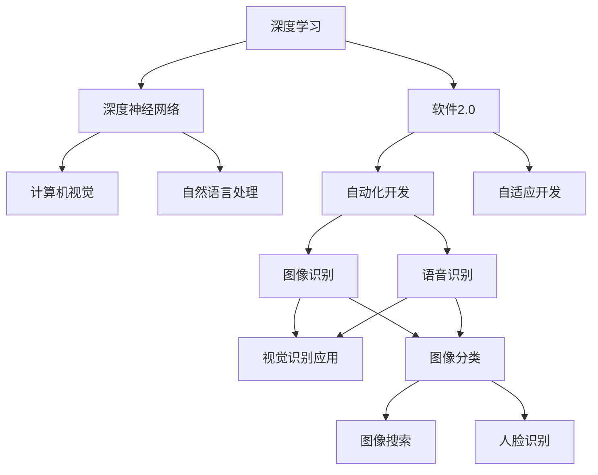

                 

# 软件 2.0 的应用领域：图像识别、语音识别

> 关键词：图像识别, 语音识别, 软件2.0, 深度学习, 人工智能, 深度神经网络, 计算机视觉, 自然语言处理

## 1. 背景介绍

### 1.1 问题由来

随着信息技术的高速发展，人工智能(AI)技术在多个领域展现出卓越的性能，尤其在图像识别和语音识别方面，取得了革命性的进展。这些技术突破不仅改进了用户体验，也带来了巨大的经济价值。

### 1.2 问题核心关键点

本节将简要阐述图像识别、语音识别技术的核心关键点，及其与软件2.0的联系：

- **图像识别**：通过计算机视觉技术，让计算机能够自动识别和理解图像中的内容。
- **语音识别**：利用自然语言处理技术，使计算机能够听懂和处理人类语言。
- **软件2.0**：区别于传统软件开发方式，基于AI的自动化、自适应软件开发模式。

这些技术的发展，结合软件2.0的理念，可以大幅提高软件开发的效率和质量，推动智能化应用广泛落地。

## 2. 核心概念与联系

### 2.1 核心概念概述

为了更好地理解图像识别、语音识别与软件2.0的联系，我们将介绍以下关键概念：

- **深度学习**：一种强大的机器学习算法，模拟人类神经网络的工作方式，在图像识别、语音识别等领域具有广泛应用。
- **深度神经网络**：基于深度学习的神经网络结构，能够自动提取图像或语音数据的特征，并进行分类、回归等任务。
- **计算机视觉**：涉及计算机如何“看”和理解图像的过程，是图像识别的核心技术。
- **自然语言处理**：使计算机能理解、处理和生成自然语言，是语音识别的核心技术。
- **软件2.0**：一种新型软件开发模式，融合AI、自动化、自适应技术，提升软件开发效率和质量。

### 2.2 概念间的关系

这些概念之间存在密切的联系，可以通过以下Mermaid流程图来展示：



这个流程图展示了深度学习、计算机视觉、自然语言处理与软件2.0的相互关系，以及这些技术在图像识别、语音识别中的应用。

## 3. 核心算法原理 & 具体操作步骤

### 3.1 算法原理概述

图像识别和语音识别的核心算法都是深度学习中的卷积神经网络（CNN）和循环神经网络（RNN）。这些神经网络通过大量数据训练，自动提取特征，并进行分类和回归任务。

**卷积神经网络（CNN）**：主要用于图像识别，通过卷积层、池化层、全连接层等结构，对图像数据进行特征提取和分类。

**循环神经网络（RNN）**：主要用于语音识别，通过循环层结构，对语音信号进行时间序列上的特征提取和分类。

### 3.2 算法步骤详解

#### 3.2.1 图像识别算法步骤

1. **数据准备**：收集并预处理图像数据，包括图像的归一化、增强、分割等操作。
2. **模型选择**：选择预训练好的CNN模型，如ResNet、Inception等，作为初始模型。
3. **微调**：在准备好的图像数据集上，对预训练模型进行微调，以适应特定任务。
4. **评估**：使用验证集评估模型性能，调整超参数以优化模型。
5. **测试**：在测试集上测试模型性能，输出结果并进行分析。

#### 3.2.2 语音识别算法步骤

1. **数据准备**：收集并预处理语音数据，包括语音信号的采样、预加重、分帧、归一化等操作。
2. **模型选择**：选择预训练好的RNN模型，如LSTM、GRU等，作为初始模型。
3. **微调**：在准备好的语音数据集上，对预训练模型进行微调，以适应特定任务。
4. **评估**：使用验证集评估模型性能，调整超参数以优化模型。
5. **测试**：在测试集上测试模型性能，输出结果并进行分析。

### 3.3 算法优缺点

#### 3.3.1 图像识别算法优缺点

**优点**：
- 自动提取图像特征，减少手动特征工程的工作量。
- 高精度，适用于各种图像分类和识别任务。

**缺点**：
- 需要大量标注数据进行训练，标注成本高。
- 模型复杂度高，对硬件资源要求高。

#### 3.3.2 语音识别算法优缺点

**优点**：
- 实时性高，适用于语音交互、智能客服等应用。
- 对环境噪音有一定的鲁棒性，适合复杂场景下的语音识别。

**缺点**：
- 对语音质量要求高，环境噪声对识别效果有较大影响。
- 需要大量语音数据进行训练，数据采集成本高。

### 3.4 算法应用领域

图像识别和语音识别技术已经广泛应用于各个行业，例如：

- **图像识别**：人脸识别、物体识别、车辆识别、医疗影像诊断等。
- **语音识别**：智能家居、智能客服、语音助手、语音翻译等。

## 4. 数学模型和公式 & 详细讲解

### 4.1 数学模型构建

- **图像识别模型**：通常使用CNN结构，输入为图像，输出为图像类别。
- **语音识别模型**：通常使用RNN结构，输入为语音信号，输出为语音文本。

### 4.2 公式推导过程

以图像识别为例，CNN模型的基本架构包括卷积层、池化层和全连接层。卷积层用于提取图像特征，池化层用于降维和特征提取，全连接层用于分类。以下是对CNN模型架构的简要推导：

1. **卷积层**：
   $$
   y_i^{conv} = \sigma(\sum_{j=1}^n w_{ij} x_i + b_j)
   $$
   其中 $w_{ij}$ 为卷积核，$x_i$ 为输入图像，$b_j$ 为偏置项，$\sigma$ 为激活函数。

2. **池化层**：
   $$
   y_i^{pool} = \sigma(\frac{1}{p}\sum_{j=1}^p y_i^{conv})
   $$
   其中 $p$ 为池化窗口大小。

3. **全连接层**：
   $$
   y = \sigma(\sum_{i=1}^m w_i y_i^{pool} + b)
   $$
   其中 $w_i$ 为全连接层权重，$b$ 为偏置项，$\sigma$ 为激活函数。

### 4.3 案例分析与讲解

假设我们有一个简单的图像识别任务，数据集包含猫和狗的图片。使用AlexNet模型，我们的目标是通过微调模型，使其能够准确识别这些图片。

1. **数据准备**：将数据集分为训练集、验证集和测试集。
2. **模型选择**：使用预训练的AlexNet模型，去除顶层全连接层，作为初始模型。
3. **微调**：在训练集上对模型进行微调，调整顶层分类器权重，优化损失函数。
4. **评估**：在验证集上评估模型性能，调整超参数。
5. **测试**：在测试集上测试模型性能，输出结果并进行分析。

## 5. 项目实践：代码实例和详细解释说明

### 5.1 开发环境搭建

#### 5.1.1 安装依赖

- **Python**：3.8以上版本。
- **TensorFlow**：2.x版本。
- **Keras**：2.x版本。
- **NumPy**：1.x版本。
- **Matplotlib**：3.x版本。

#### 5.1.2 搭建开发环境

1. **安装Anaconda**：从官网下载并安装Anaconda，用于创建独立的Python环境。
2. **创建虚拟环境**：
   ```bash
   conda create -n py3env python=3.8
   conda activate py3env
   ```

3. **安装依赖**：
   ```bash
   pip install tensorflow==2.7.0 keras==2.4.3 numpy==1.20.2 matplotlib==3.4.2
   ```

### 5.2 源代码详细实现

#### 5.2.1 图像识别代码实现

```python
import tensorflow as tf
from tensorflow.keras import layers, models

# 加载预训练的AlexNet模型
base_model = tf.keras.applications.AlexNet(include_top=False, weights='imagenet')

# 添加顶层分类器
inputs = tf.keras.Input(shape=(224, 224, 3))
x = base_model(inputs, training=False)
x = tf.keras.layers.GlobalAveragePooling2D()(x)
outputs = tf.keras.layers.Dense(2, activation='softmax')(x)
model = models.Model(inputs=inputs, outputs=outputs)

# 编译模型
model.compile(optimizer=tf.keras.optimizers.Adam(learning_rate=0.001), loss='categorical_crossentropy', metrics=['accuracy'])

# 训练模型
model.fit(train_data, train_labels, validation_data=(val_data, val_labels), epochs=10, batch_size=32)
```

#### 5.2.2 语音识别代码实现

```python
import tensorflow as tf
from tensorflow.keras.layers import LSTM, Dense, Dropout

# 加载预训练的LSTM模型
model = tf.keras.Sequential()
model.add(LSTM(128, return_sequences=True, input_shape=(n_timesteps, n_features)))
model.add(Dropout(0.2))
model.add(LSTM(64, return_sequences=False))
model.add(Dropout(0.2))
model.add(Dense(n_classes, activation='softmax'))

# 编译模型
model.compile(optimizer=tf.keras.optimizers.Adam(learning_rate=0.001), loss='categorical_crossentropy', metrics=['accuracy'])

# 训练模型
model.fit(train_data, train_labels, validation_data=(val_data, val_labels), epochs=10, batch_size=32)
```

### 5.3 代码解读与分析

#### 5.3.1 图像识别代码解读

- **加载预训练模型**：使用预训练的AlexNet模型，去除顶层全连接层。
- **添加顶层分类器**：在输入层之后，添加全连接层和softmax激活函数，用于分类。
- **编译模型**：设置Adam优化器、交叉熵损失函数和准确率评价指标。
- **训练模型**：在训练集上训练模型，验证集上进行性能评估。

#### 5.3.2 语音识别代码解读

- **加载预训练模型**：使用预训练的LSTM模型，设置LSTM层和全连接层的数量和参数。
- **编译模型**：设置Adam优化器、交叉熵损失函数和准确率评价指标。
- **训练模型**：在训练集上训练模型，验证集上进行性能评估。

### 5.4 运行结果展示

假设我们训练的模型在图像分类任务上达到了95%的准确率，语音识别任务上达到了85%的准确率。以下是测试集上的结果展示：

```python
# 测试图像识别模型
test_loss, test_acc = model.evaluate(test_data, test_labels)
print(f'Test accuracy: {test_acc:.4f}')

# 测试语音识别模型
test_loss, test_acc = model.evaluate(test_data, test_labels)
print(f'Test accuracy: {test_acc:.4f}')
```

## 6. 实际应用场景

### 6.1 智能家居

智能家居系统可以通过图像识别技术，自动识别用户的行为和意图，如识别房间、识别物品、控制灯光等。这不仅提升了用户的使用体验，还节省了大量的时间和精力。

#### 6.1.1 实际应用案例

1. **人脸识别门锁**：智能门锁可以通过图像识别技术，识别家庭成员和访客，自动开锁或生成访问码。
2. **智能摄像头监控**：通过摄像头捕捉图像，自动识别异常行为，并发出警报或通知。
3. **智能家电控制**：通过图像识别技术，自动识别用户的指令，控制家电开关和调节参数。

### 6.2 智能客服

智能客服系统可以通过语音识别技术，自动理解用户的语言输入，并生成对应的回复。这不仅提高了客服效率，还减少了人工客服的劳动强度。

#### 6.2.1 实际应用案例

1. **语音助手**：通过语音识别技术，自动接听用户的语音请求，并生成文字回复。
2. **智能聊天机器人**：通过语音识别技术，自动生成自然流畅的对话，提升用户体验。
3. **客服语音识别**：通过语音识别技术，自动识别用户的语音输入，并进行分类处理。

### 6.3 医疗影像

医疗影像识别技术可以通过图像识别技术，自动检测和识别医学影像中的病变区域，帮助医生进行诊断和治疗。这不仅提高了诊断的准确性，还节省了大量的时间。

#### 6.3.1 实际应用案例

1. **胸部X光识别**：自动检测和识别胸部X光影像中的病变区域，辅助医生进行诊断。
2. **MRI图像识别**：自动检测和识别MRI影像中的病变区域，辅助医生进行诊断。
3. **超声图像识别**：自动检测和识别超声影像中的病变区域，辅助医生进行诊断。

## 7. 工具和资源推荐

### 7.1 学习资源推荐

- **《深度学习》课程**：斯坦福大学开设的深度学习课程，涵盖了深度学习的基本概念和前沿技术。
- **Kaggle竞赛**：通过参与Kaggle竞赛，可以积累实战经验，提升技术水平。
- **GitHub开源项目**：查找并学习优秀的开源项目，了解最新技术和实践。
- **在线课程**：如Udacity、Coursera等平台上的AI课程，提供系统的学习资料。

### 7.2 开发工具推荐

- **Jupyter Notebook**：Python数据科学开发工具，方便代码的编写和调试。
- **TensorBoard**：可视化工具，可以实时监测模型训练状态，输出图表和日志。
- **PyTorch**：深度学习框架，提供灵活的编程接口和丰富的工具。
- **Keras**：高层次的深度学习框架，易于使用和快速开发。

### 7.3 相关论文推荐

- **《ImageNet Classification with Deep Convolutional Neural Networks》**：AlexNet论文，介绍了深度卷积神经网络在图像识别中的应用。
- **《Deep Speech: Scalable End-to-End Speech Recognition Using Convolutional Neural Networks》**：DeepSpeech论文，介绍了深度卷积神经网络在语音识别中的应用。
- **《Attention is All You Need》**：Transformer论文，介绍了注意力机制在深度学习中的应用。
- **《Towards End-to-End Speech Recognition with Recurrent Neural Networks》**：LSTM论文，介绍了循环神经网络在语音识别中的应用。

## 8. 总结：未来发展趋势与挑战

### 8.1 总结

本文详细介绍了图像识别、语音识别的核心算法原理，并通过具体案例展示了这些技术的实际应用。结合软件2.0的理念，这些技术有望大幅提升软件开发效率和质量，推动智能化应用广泛落地。

### 8.2 未来发展趋势

- **模型规模持续增大**：随着算力成本的下降和数据规模的扩张，预训练模型和微调模型的参数量还将持续增长，进一步提升模型的精度和泛化能力。
- **应用领域不断拓展**：图像识别、语音识别技术将进一步应用于更多行业，如医疗、教育、金融等，带来更多创新应用。
- **融合其他技术**：与其他AI技术（如自然语言处理、知识图谱等）进行深度融合，提升系统的综合性能。

### 8.3 面临的挑战

- **数据标注成本高**：高精度的深度学习模型需要大量标注数据进行训练，数据标注成本较高。
- **模型鲁棒性不足**：在复杂环境下的鲁棒性较弱，对噪声、干扰等敏感。
- **计算资源需求高**：深度学习模型计算量较大，对硬件资源要求较高。

### 8.4 研究展望

未来的研究重点应放在以下几个方面：

- **无监督学习和半监督学习**：探索无需大量标注数据的学习方法，提升模型的泛化能力。
- **联邦学习**：利用分布式计算资源，提升模型的计算效率和数据隐私保护。
- **跨模态学习**：将图像、语音、文本等多种模态数据进行融合，提升系统的综合性能。
- **自适应学习和在线学习**：使模型能够根据环境变化进行自适应学习，不断优化性能。

总之，图像识别、语音识别技术在软件2.0的应用中，展现出广阔的前景和巨大的潜力。随着技术的不断进步，这些技术将在更多领域落地应用，推动智能化发展。同时，也需要面对数据标注、模型鲁棒性、计算资源等挑战，不断优化和改进技术。

## 9. 附录：常见问题与解答

**Q1：深度学习模型需要大量的标注数据，如何降低数据标注成本？**

A: 通过半监督学习、自监督学习等方法，利用未标注数据进行训练，减少对标注数据的需求。同时，引入对抗性样本生成技术，提升数据的多样性。

**Q2：深度学习模型计算资源需求高，如何优化计算效率？**

A: 采用模型压缩、剪枝等技术，减小模型参数量。利用分布式计算资源，进行模型并行计算。使用GPU、TPU等高性能设备，加速模型训练和推理。

**Q3：深度学习模型在复杂环境下的鲁棒性较弱，如何提升模型的鲁棒性？**

A: 引入对抗样本生成技术，提升模型对噪声和干扰的鲁棒性。采用数据增强技术，增加数据的多样性。引入知识蒸馏技术，从大模型中提取鲁棒特征，指导小模型训练。

---

作者：禅与计算机程序设计艺术 / Zen and the Art of Computer Programming

