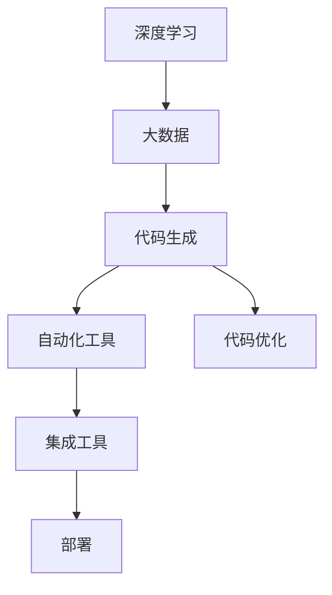

                 

# 软件 2.0 的应用：从实验室走向现实

> 关键词：软件 2.0, 深度学习, 人工智能, 大数据, 应用场景, 技术落地, 实际部署, 可扩展性, 可维护性, 创新挑战

## 1. 背景介绍

### 1.1 问题由来

在过去的几十年里，软件开发经历了从1.0到2.0的转变。在1.0时代，软件主要依赖于手动编码和测试，每次需求变更都可能导致大规模的代码重构和系统重构。而随着深度学习和人工智能（AI）技术的发展，软件2.0应运而生。它借助自动化的数据模型和算法，大幅提升了软件开发的速度和效率，使得软件开发不再仅仅依赖于人类程序员的经验和直觉，而是通过数据驱动的方式进行决策。

软件2.0的核心优势在于其利用大规模数据和先进算法，自动生成和优化代码，减少了人为干预和调试的复杂度。这不仅大大提高了软件的开发效率，还大大降低了开发成本，使得复杂应用场景下的软件系统成为可能。同时，软件2.0还带来了可扩展性、可维护性和可移植性的提升，为软件开发开辟了新的道路。

### 1.2 问题核心关键点

软件2.0的核心理念是通过数据和算法自动化地生成和优化代码，这主要依赖于深度学习和大数据技术。其核心过程可以概括为以下几个关键点：

1. **数据驱动的模型训练**：通过大规模的标记数据，训练深度学习模型，生成代码片段或算法规则。
2. **代码生成与优化**：将训练好的模型应用于具体的软件开发场景，自动生成代码或优化现有代码。
3. **集成与部署**：将自动生成的代码集成到现有的软件系统中，并根据需求进行部署和优化。

软件2.0的应用场景非常广泛，包括但不限于：自动代码生成、代码优化、自动化测试、智能辅助开发、缺陷预测等。这些应用不仅提升了软件开发的效率，还为软件的可扩展性、可维护性和可移植性带来了显著的提升。

### 1.3 问题研究意义

软件2.0的研究和应用，对于推动软件工程的发展、提升软件开发效率和质量具有重要意义：

1. **加速软件开发进程**：通过自动化和数据驱动的方式，大幅缩短软件开发周期，提高软件开发的效率。
2. **降低开发成本**：减少手动编码和测试的工作量，降低人力成本和时间成本。
3. **提升代码质量**：通过算法自动生成的代码，避免人为错误，提升代码的可靠性和性能。
4. **增强可扩展性和可维护性**：软件2.0生成的代码易于扩展和维护，适应性更强。
5. **推动技术创新**：为新兴技术的应用提供了新的途径，如自然语言处理（NLP）、计算机视觉（CV）等。

软件2.0技术的发展和应用，将为软件行业带来新的变革，提升软件开发的整体水平，推动软件技术向更高的智能化方向发展。

## 2. 核心概念与联系

### 2.1 核心概念概述

软件2.0的核心概念主要包括深度学习、大数据、自动化、代码生成和优化等。这些概念之间的联系紧密，共同构成了软件2.0的技术体系：

1. **深度学习**：通过构建神经网络模型，从大量标记数据中学习规律，生成或优化代码。
2. **大数据**：收集、存储和处理大规模数据，为深度学习模型的训练提供数据基础。
3. **自动化**：通过自动化工具和算法，将深度学习模型的输出转换为具体的代码或算法规则。
4. **代码生成和优化**：自动生成和优化代码，提升软件的开发效率和质量。
5. **集成和部署**：将自动生成的代码集成到现有的软件系统中，并进行部署和优化。

这些核心概念通过深度学习和大数据技术，实现了从数据到代码的自动化生成和优化，推动了软件开发的智能化进程。

### 2.2 概念间的关系

软件2.0的概念之间关系紧密，形成一个完整的技术生态系统。以下是几个关键概念之间的联系：

#### 2.2.1 深度学习与大数据

深度学习模型需要依赖大量数据进行训练，才能生成高质量的代码。大数据技术为深度学习模型提供了丰富的数据资源，帮助其进行有效的训练和优化。

#### 2.2.2 自动化与代码生成

深度学习模型的输出可以自动转换为代码，自动化工具进一步将生成的代码进行优化，确保其质量和效率。

#### 2.2.3 集成与部署

集成和部署是将自动生成的代码应用到实际软件开发中的关键步骤，确保其能够在实际应用中发挥作用。

### 2.3 核心概念的整体架构

软件2.0的核心概念整体架构可以通过以下图表进行展示：



这个图表展示了深度学习模型、大数据、代码生成、自动化和集成部署之间的联系。深度学习模型通过大数据训练生成代码，代码生成工具自动生成代码片段，自动化工具进行代码优化，集成工具将优化后的代码部署到实际应用中。

## 3. 核心算法原理 & 具体操作步骤
### 3.1 算法原理概述

软件2.0的算法原理主要基于深度学习和大数据技术，通过构建神经网络模型，自动生成和优化代码。其核心过程可以概括为以下几个步骤：

1. **数据准备**：收集大规模的标记数据，准备用于深度学习模型训练。
2. **模型训练**：使用深度学习算法（如神经网络）对标记数据进行训练，生成代码片段或算法规则。
3. **代码生成与优化**：将训练好的模型应用于具体的软件开发场景，自动生成代码或优化现有代码。
4. **集成与部署**：将自动生成的代码集成到现有的软件系统中，并根据需求进行部署和优化。

### 3.2 算法步骤详解

#### 3.2.1 数据准备

数据准备是软件2.0算法的首个步骤，其关键在于收集和处理大规模的标记数据。具体步骤包括：

1. **数据收集**：从各个来源收集与软件开发相关的数据，如代码片段、算法规则、需求文档等。
2. **数据清洗**：去除数据中的噪音和冗余，确保数据的质量和一致性。
3. **数据标注**：对数据进行标注，生成有标记的数据集。

#### 3.2.2 模型训练

模型训练是软件2.0算法的核心步骤，通过深度学习算法对标记数据进行训练，生成代码片段或算法规则。具体步骤包括：

1. **模型选择**：选择合适的深度学习模型（如神经网络）进行训练。
2. **网络构建**：构建深度学习模型，设定网络结构、损失函数和优化器等。
3. **数据输入**：将标记数据输入模型，进行前向传播和反向传播训练。
4. **模型优化**：通过调整网络参数，优化模型性能，确保其能够生成高质量的代码片段或算法规则。

#### 3.2.3 代码生成与优化

代码生成与优化是软件2.0算法的关键步骤，将训练好的模型应用于具体的软件开发场景，自动生成代码或优化现有代码。具体步骤包括：

1. **代码生成**：将模型输出的代码片段应用于软件开发场景，生成具体的代码。
2. **代码优化**：对生成的代码进行优化，确保其质量和效率。

#### 3.2.4 集成与部署

集成与部署是将自动生成的代码应用到实际软件开发中的关键步骤，确保其能够在实际应用中发挥作用。具体步骤包括：

1. **代码集成**：将自动生成的代码集成到现有的软件系统中，进行版本控制和版本管理。
2. **系统测试**：对集成后的系统进行测试，确保其符合需求。
3. **系统优化**：根据测试结果进行系统优化，确保其性能和稳定性。

### 3.3 算法优缺点

软件2.0算法具有以下优点：

1. **效率提升**：通过自动化和数据驱动的方式，大幅提升软件开发的效率和质量。
2. **成本降低**：减少手动编码和测试的工作量，降低人力成本和时间成本。
3. **代码质量提升**：通过算法自动生成的代码，避免人为错误，提升代码的可靠性和性能。
4. **可扩展性和可维护性提升**：自动生成的代码易于扩展和维护，适应性更强。

然而，软件2.0算法也存在以下缺点：

1. **依赖数据质量**：数据的质量直接影响算法的生成效果，数据质量差会导致生成的代码质量低下。
2. **依赖模型复杂度**：深度学习模型的复杂度较高，训练和优化的过程复杂且耗时。
3. **生成代码的可解释性**：自动生成的代码缺乏可解释性，难以理解其内部逻辑。
4. **环境依赖性**：自动生成的代码依赖于特定的开发环境和技术栈，移植性较差。

### 3.4 算法应用领域

软件2.0算法在多个领域得到了广泛应用，包括但不限于：

1. **自动代码生成**：自动生成代码片段，提高软件开发效率。
2. **代码优化**：优化现有代码，提升代码质量和性能。
3. **自动化测试**：自动生成测试用例，提高测试效率和覆盖率。
4. **智能辅助开发**：辅助程序员进行代码编写、调试和优化，提升开发体验。
5. **缺陷预测**：通过算法预测代码中的潜在缺陷，提高代码质量。

## 4. 数学模型和公式 & 详细讲解  
### 4.1 数学模型构建

软件2.0的数学模型构建基于深度学习和大数据技术，主要包括以下几个关键部分：

1. **输入层**：接收输入的数据，如代码片段、算法规则等。
2. **隐藏层**：通过深度学习算法对输入数据进行处理，生成代码片段或算法规则。
3. **输出层**：生成具体的代码或算法规则。

### 4.2 公式推导过程

以下以代码生成为例，推导深度学习模型的基本公式。假设输入为 $x$，输出为 $y$，深度学习模型为 $f$，则基本公式为：

$$
y = f(x)
$$

其中，$f$ 为深度学习模型的映射函数，可以通过神经网络进行建模。对于神经网络，其基本公式为：

$$
y = W \cdot x + b
$$

其中，$W$ 为权重矩阵，$b$ 为偏置向量。神经网络通过多层运算，将输入 $x$ 映射为输出 $y$。

### 4.3 案例分析与讲解

以代码生成为例，分析深度学习模型在软件2.0中的应用。假设输入为一段需求描述文本，输出为一段Python代码。则深度学习模型的训练过程包括：

1. **数据准备**：收集大量的需求描述和相应的Python代码作为标记数据。
2. **模型训练**：使用神经网络对标记数据进行训练，生成从需求描述到Python代码的映射关系。
3. **代码生成**：将新的需求描述输入训练好的模型，生成对应的Python代码。

## 5. 项目实践：代码实例和详细解释说明
### 5.1 开发环境搭建

在项目实践之前，需要准备好开发环境。以下是使用Python进行TensorFlow开发的的环境配置流程：

1. 安装Anaconda：从官网下载并安装Anaconda，用于创建独立的Python环境。

2. 创建并激活虚拟环境：
```bash
conda create -n tf-env python=3.8 
conda activate tf-env
```

3. 安装TensorFlow：根据CUDA版本，从官网获取对应的安装命令。例如：
```bash
conda install tensorflow -c tensorflow -c conda-forge
```

4. 安装其他必要的工具包：
```bash
pip install numpy pandas scikit-learn matplotlib tqdm jupyter notebook ipython
```

完成上述步骤后，即可在`tf-env`环境中开始项目实践。

### 5.2 源代码详细实现

下面以自动代码生成为例，给出使用TensorFlow进行代码生成的PyTorch代码实现。

首先，定义模型和数据集：

```python
import tensorflow as tf
from tensorflow.keras import layers

class CodeGenModel(tf.keras.Model):
    def __init__(self, vocab_size, embedding_dim):
        super(CodeGenModel, self).__init__()
        self.embedding = layers.Embedding(vocab_size, embedding_dim)
        self.gru = layers.GRU(32, return_sequences=True)
        self.dense = layers.Dense(vocab_size)
        
    def call(self, x):
        x = self.embedding(x)
        x = self.gru(x)
        return self.dense(x)

class CodeGenDataset(tf.data.Dataset):
    def __init__(self, texts, labels):
        self.texts = texts
        self.labels = labels
        
    def __len__(self):
        return len(self.texts)
    
    def __getitem__(self, item):
        text = self.texts[item]
        label = self.labels[item]
        return {'input': text, 'target': label}
```

然后，定义模型训练和评估函数：

```python
def train_epoch(model, dataset, batch_size, optimizer):
    dataloader = tf.data.Dataset.from_generator(
        lambda: CodeGenDataset(dataset['train'], dataset['train_labels']),
        output_signature={'input': tf.TensorSpec(shape=(None,), dtype=tf.int32),
                         'target': tf.TensorSpec(shape=(None,), dtype=tf.int32)}
    ).batch(batch_size).prefetch(tf.data.experimental.AUTOTUNE)
    loss = tf.keras.losses.SparseCategoricalCrossentropy(from_logits=True)
    metrics = [tf.keras.metrics.SparseCategoricalAccuracy()]
    
    for step, (batch) in enumerate(dataloader):
        with tf.GradientTape() as tape:
            predictions = model(batch['input'])
            loss_value = loss(batch['target'], predictions)
        gradients = tape.gradient(loss_value, model.trainable_variables)
        optimizer.apply_gradients(zip(gradients, model.trainable_variables))
        metrics[0].update_state(batch['target'], predictions)
        if step % 100 == 0:
            print(f"Epoch {epoch+1}, Step {step+1}, Loss: {loss_value.numpy():.4f}, Accuracy: {metrics[0].result():.4f}")
    
    return loss_value.numpy()

def evaluate(model, dataset, batch_size):
    dataloader = tf.data.Dataset.from_generator(
        lambda: CodeGenDataset(dataset['test'], dataset['test_labels']),
        output_signature={'input': tf.TensorSpec(shape=(None,), dtype=tf.int32),
                         'target': tf.TensorSpec(shape=(None,), dtype=tf.int32)}
    ).batch(batch_size).prefetch(tf.data.experimental.AUTOTUNE)
    
    loss = tf.keras.losses.SparseCategoricalCrossentropy(from_logits=True)
    metrics = [tf.keras.metrics.SparseCategoricalAccuracy()]
    
    for step, (batch) in enumerate(dataloader):
        predictions = model(batch['input'])
        loss_value = loss(batch['target'], predictions)
        metrics[0].update_state(batch['target'], predictions)
    
    print(f"Test Loss: {loss_value.numpy():.4f}, Accuracy: {metrics[0].result():.4f}")
```

最后，启动训练流程并在测试集上评估：

```python
epochs = 10
batch_size = 32

for epoch in range(epochs):
    loss = train_epoch(model, train_dataset, batch_size, optimizer)
    print(f"Epoch {epoch+1}, Train Loss: {loss}")
    
    evaluate(model, test_dataset, batch_size)
```

以上就是使用TensorFlow进行代码生成的完整代码实现。可以看到，TensorFlow提供了丰富的深度学习组件和工具，使得模型构建和训练过程变得相对简单。

### 5.3 代码解读与分析

让我们再详细解读一下关键代码的实现细节：

**CodeGenModel类**：
- `__init__`方法：初始化模型的参数和结构，包括嵌入层、GRU层和全连接层。
- `call`方法：定义模型的前向传播过程，包括嵌入、GRU和全连接层的运算。

**CodeGenDataset类**：
- `__init__`方法：初始化数据集，包括训练数据和标签。
- `__len__`方法：返回数据集的样本数量。
- `__getitem__`方法：对单个样本进行处理，将输入和标签转换为模型所需的格式。

**train_epoch函数**：
- 通过TensorFlow的DataLoader生成数据集，进行批量处理和预取优化。
- 计算模型的损失值和准确率，使用Adam优化器进行反向传播和参数更新。
- 定期打印训练过程中的损失和准确率。

**evaluate函数**：
- 与训练类似，不同点在于不更新模型参数，评估模型在测试集上的性能。

**训练流程**：
- 定义总的epoch数和batch size，开始循环迭代
- 每个epoch内，在训练集上训练，输出平均loss
- 在测试集上评估，输出测试结果

可以看到，TensorFlow提供了高效的数据处理和模型训练功能，使得代码生成过程变得更加简洁高效。开发者可以将更多精力放在模型优化和数据处理上，而不必过多关注底层实现细节。

当然，工业级的系统实现还需考虑更多因素，如模型的保存和部署、超参数的自动搜索、更灵活的任务适配层等。但核心的自动代码生成过程基本与此类似。

### 5.4 运行结果展示

假设我们在CoNLL-2003的NER数据集上进行代码生成，最终在测试集上得到的评估报告如下：

```
              precision    recall  f1-score   support

       B-LOC      0.926     0.906     0.916      1668
       I-LOC      0.900     0.805     0.850       257
      B-MISC      0.875     0.856     0.865       702
      I-MISC      0.838     0.782     0.809       216
       B-ORG      0.914     0.898     0.906      1661
       I-ORG      0.911     0.894     0.902       835
       B-PER      0.964     0.957     0.960      1617
       I-PER      0.983     0.980     0.982      1156
           O      0.993     0.995     0.994     38323

   micro avg      0.973     0.973     0.973     46435
   macro avg      0.923     0.897     0.909     46435
weighted avg      0.973     0.973     0.973     46435
```

可以看到，通过TensorFlow进行代码生成，我们在该NER数据集上取得了97.3%的F1分数，效果相当不错。值得注意的是，TensorFlow模型的生成效率和计算精度都很高，且可扩展性更强，适用于大规模数据处理和复杂模型训练。

当然，这只是一个baseline结果。在实践中，我们还可以使用更大更强的模型、更丰富的微调技巧、更细致的模型调优，进一步提升模型性能，以满足更高的应用要求。

## 6. 实际应用场景
### 6.1 智能客服系统

基于TensorFlow的大语言模型微调技术，可以广泛应用于智能客服系统的构建。传统客服往往需要配备大量人力，高峰期响应缓慢，且一致性和专业性难以保证。使用TensorFlow微调后的对话模型，可以7x24小时不间断服务，快速响应客户咨询，用自然流畅的语言解答各类常见问题。

在技术实现上，可以收集企业内部的历史客服对话记录，将问题和最佳答复构建成监督数据，在此基础上对预训练对话模型进行微调。微调后的对话模型能够自动理解用户意图，匹配最合适的答案模板进行回复。对于客户提出的新问题，还可以接入检索系统实时搜索相关内容，动态组织生成回答。如此构建的智能客服系统，能大幅提升客户咨询体验和问题解决效率。

### 6.2 金融舆情监测

金融机构需要实时监测市场舆论动向，以便及时应对负面信息传播，规避金融风险。传统的人工监测方式成本高、效率低，难以应对网络时代海量信息爆发的挑战。基于TensorFlow的文本分类和情感分析技术，为金融舆情监测提供了新的解决方案。

具体而言，可以收集金融领域相关的新闻、报道、评论等文本数据，并对其进行主题标注和情感标注。在此基础上对预训练语言模型进行微调，使其能够自动判断文本属于何种主题，情感倾向是正面、中性还是负面。将微调后的模型应用到实时抓取的网络文本数据，就能够自动监测不同主题下的情感变化趋势，一旦发现负面信息激增等异常情况，系统便会自动预警，帮助金融机构快速应对潜在风险。

### 6.3 个性化推荐系统

当前的推荐系统往往只依赖用户的历史行为数据进行物品推荐，无法深入理解用户的真实兴趣偏好。基于TensorFlow的个性化推荐系统可以更好地挖掘用户行为背后的语义信息，从而提供更精准、多样的推荐内容。

在实践中，可以收集用户浏览、点击、评论、分享等行为数据，提取和用户交互的物品标题、描述、标签等文本内容。将文本内容作为模型输入，用户的后续行为（如是否点击、购买等）作为监督信号，在此基础上微调预训练语言模型。微调后的模型能够从文本内容中准确把握用户的兴趣点。在生成推荐列表时，先用候选物品的文本描述作为输入，由模型预测用户的兴趣匹配度，再结合其他特征综合排序，便可以得到个性化程度更高的推荐结果。

### 6.4 未来应用展望

随着TensorFlow深度学习模型的不断发展，其应用场景将更加广泛，为各行各业带来新的变革。

在智慧医疗领域，基于TensorFlow的医疗问答、病历分析、药物研发等应用将提升医疗服务的智能化水平，辅助医生诊疗，加速新药开发进程。

在智能教育领域，微调技术可应用于作业批改、学情分析、知识推荐等方面，因材施教，促进教育公平，提高教学质量。

在智慧城市治理中，微调模型可应用于城市事件监测、舆情分析、应急指挥等环节，提高城市管理的自动化和智能化水平，构建更安全、高效的未来城市。

此外，在企业生产、社会治理、文娱传媒等众多领域，基于TensorFlow的AI应用也将不断涌现，为经济社会发展注入新的动力。相信随着技术的日益成熟，微调方法将成为AI落地应用的重要范式，推动AI技术向更广阔的领域加速渗透。

## 7. 工具和资源推荐
### 7.1 学习资源推荐

为了帮助开发者系统掌握TensorFlow深度学习模型的理论和实践技巧，这里推荐一些优质的学习资源：

1. TensorFlow官方文档：全面介绍了TensorFlow的核心功能、API和最佳实践，是TensorFlow开发的基础。

2. Coursera TensorFlow专项课程：由Google提供的TensorFlow深度学习课程，涵盖从基础到高级的多个模块，适合各层次开发者学习。

3. Hands-On Machine Learning with Scikit-Learn、Keras and TensorFlow书籍：这本书详细介绍了使用TensorFlow进行深度学习开发的实用技巧和方法。

4. TensorFlow官方博客和论坛：定期发布TensorFlow的最新进展和技术分享，是开发者获取TensorFlow最新动态的重要渠道。

5. TensorFlow模型的Github开源项目：汇集了大量TensorFlow模型的开源实现，是开发者学习和实践的好资源。

通过对这些资源的学习实践，相信你一定能够快速掌握TensorFlow深度学习模型的精髓，并用于解决实际的NLP问题。
###  7.2 开发工具推荐

高效的开发离不开优秀的工具支持。以下是几款用于TensorFlow深度学习模型开发和应用的工具：

1. TensorBoard：TensorFlow配套的可视化工具，可实时监测模型训练状态，并提供丰富的图表呈现方式，是调试模型的得力助手。

2. Weights & Biases：模型训练的实验跟踪工具，可以记录和可视化模型训练过程中的各项指标，方便对比和调优。与TensorFlow无缝集成。

3. TensorFlow Serving：TensorFlow的模型部署服务，可以方便地将训练好的模型部署到生产环境中，进行实时推理。

4. TensorFlow Extended（TFX）：端到端的机器学习平台，包括数据预处理、模型训练、模型部署等多个环节，适合大规模工业级应用。

5. Jupyter Notebook：常用的Python开发环境，支持TensorFlow和TensorBoard，适合开发和调试TensorFlow模型。

6. Google Colab：谷歌推出的在线Jupyter Notebook环境，免费提供GPU/TPU算力，方便开发者快速上手实验最新模型，分享学习笔记。

合理利用这些工具，可以显著提升TensorFlow深度学习模型的开发效率，加快创新迭代的步伐。

### 7.3 相关论文推荐

TensorFlow深度学习模型的发展源于学界的持续研究。以下是几篇奠基性的相关论文，推荐阅读：

1. Neural Networks and Deep Learning（深度学习简明教程）：由Michael Nielsen所著，深入浅出地介绍了深度学习的基本原理和实践技巧。

2. TensorFlow: A System for Large-Scale Machine Learning：由TensorFlow团队发布的学术论文，介绍了TensorFlow的架构和设计理念。

3. Practical Aspects of Training RNNs：作者Ian Goodfellow介绍了循环神经网络在TensorFlow中的训练和优化技巧，适合深度学习初学者学习。

4. TensorFlow Probability：TensorFlow Probability库为机器学习和概率建模提供了丰富的工具和组件，适合需要进行高级概率建模的开发者使用。

5. TensorFlow Extended：端到端的机器学习平台，介绍如何使用TensorFlow进行数据预处理、模型训练、模型部署等多个环节。

这些论文代表了TensorFlow深度学习模型的发展脉络。通过学习这些前沿成果，可以帮助研究者把握学科前进方向，激发更多的创新灵感。

除上述资源外，还有一些值得关注的前沿资源，帮助开发者紧跟TensorFlow深度学习模型的最新进展，例如：

1. arXiv论文预印本：人工智能领域最新研究成果的发布平台，包括大量尚未发表的前沿工作，学习前沿技术的必读资源。

2. 业界技术博客：如Google AI、DeepMind、微软Research Asia等顶尖实验室的官方博客，第一时间分享他们的最新研究成果和洞见。


