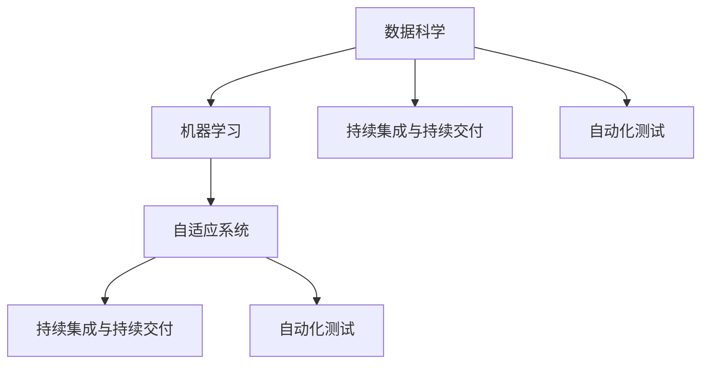
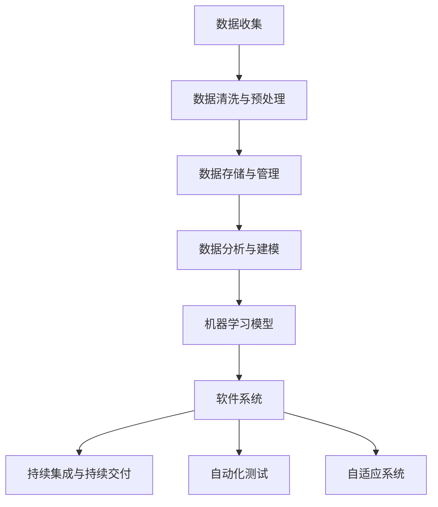

                 

## 1. 背景介绍

### 1.1 问题由来
在计算机科学的历史上，软件技术经历了几次重要的变革。从早期的汇编语言、高级语言，到操作系统、编译器、数据库等基础设施的完善，再到Web、移动、云计算、大数据等技术的应用，软件技术在不断地演进和发展。然而，这些演进主要基于传统的二进制逻辑和算法思维，更多地关注程序的性能、效率和可维护性。

近年来，随着人工智能（AI）和大数据技术的迅猛发展，数据驱动的思维开始逐渐渗透到软件开发中。数据驱动软件开发（Data-Driven Software Development）不再仅仅关注代码和算法的优化，而是通过数据分析、机器学习、自动化测试等技术，更好地理解和优化软件系统。这种思维方式的转变，将软件开发推向了一个新的时代：软件 2.0。

### 1.2 问题核心关键点
软件 2.0 的核心在于数据驱动的思想，即通过数据来指导软件开发和运维。这一思想与传统的软件开发思维方式有着显著区别，它强调从数据中挖掘洞察，不断迭代和优化软件系统。软件 2.0 的关键点包括：

- **数据驱动**：通过大量结构化和非结构化数据的收集和分析，指导软件开发和运维决策。
- **持续迭代**：利用自动化测试和持续集成（CI）等技术，实现软件的快速迭代和优化。
- **自适应性**：软件系统能够根据环境和数据的变化，自动调整和优化自身的行为和策略。
- **跨领域融合**：软件系统与物联网、区块链、人工智能等领域的技术深度融合，形成更加智能化的解决方案。

### 1.3 问题研究意义
软件 2.0 的开发理念对于提升软件系统的性能、效率和可靠性具有重要意义。具体而言，数据驱动的软件开发能够：

- **降低开发成本**：通过数据分析和模型优化，减少不必要的代码和功能，提高开发效率。
- **提升系统性能**：通过自动化测试和优化算法，快速定位和修复问题，提高系统稳定性。
- **增强自适应能力**：通过持续学习和自适应算法，软件系统能够更好地应对环境和数据的变化，保持长期稳定运行。
- **促进创新应用**：跨领域的技术融合，能够催生更多创新应用场景，提升软件系统的应用价值。

## 2. 核心概念与联系

### 2.1 核心概念概述

在理解软件 2.0 的核心概念之前，我们需要先梳理一些与之相关的基本概念：

- **数据科学**：通过数据收集、清洗、分析和建模，从数据中提取有价值的信息和洞察。
- **机器学习**：利用算法和模型，自动从数据中学习规律和模式，进行预测和分类等任务。
- **持续集成与持续交付（CI/CD）**：通过自动化构建、测试和部署，实现软件的快速迭代和发布。
- **自动化测试**：利用工具和框架，自动执行测试用例，提升测试效率和覆盖率。
- **自适应系统**：通过学习算法和反馈机制，软件系统能够自动调整和优化自身的行为和策略。

这些概念共同构成了软件 2.0 的基础框架，展示了数据驱动思想在软件开发中的广泛应用。

### 2.2 概念间的关系

软件 2.0 的核心概念之间存在着紧密的联系，形成一个完整的生态系统。以下是几个关键概念的关系图：



这个关系图展示了数据科学、机器学习、CI/CD、自动化测试和自适应系统之间的联系。数据科学和机器学习通过数据驱动软件开发和运维；持续集成与持续交付和自动化测试保证了软件系统的快速迭代和高质量交付；自适应系统则进一步提升了软件系统的自适应能力和运行效率。

### 2.3 核心概念的整体架构

软件 2.0 的整体架构可以通过以下关系图来展示：



这个架构图展示了从数据收集、清洗、存储、分析、建模到机器学习模型训练，再到软件系统构建、持续集成、自动化测试、自适应系统优化的全过程。数据驱动思维贯穿始终，指导每个环节的决策和优化。

## 3. 核心算法原理 & 具体操作步骤
### 3.1 算法原理概述

软件 2.0 的核心算法原理主要基于数据驱动的思想，即通过数据分析和机器学习模型，指导软件开发和运维。这一过程大致分为以下几个步骤：

1. **数据收集与清洗**：从不同的数据源收集数据，并对数据进行清洗和预处理，去除噪声和冗余。
2. **数据分析与建模**：利用统计学和机器学习技术，对数据进行分析和建模，提取有价值的信息和洞察。
3. **模型训练与优化**：基于分析结果，构建和训练机器学习模型，并通过优化算法不断调整模型参数。
4. **模型应用与反馈**：将训练好的模型应用于软件系统，并通过持续反馈机制不断优化模型和系统。

### 3.2 算法步骤详解

以下是软件 2.0 的核心算法步骤的详细描述：

**Step 1: 数据收集与清洗**

1. **数据收集**：从不同的数据源收集数据，包括用户行为数据、系统日志、网络流量、设备状态等。
2. **数据清洗**：对收集到的数据进行清洗，去除重复、缺失、噪声等不规范数据，确保数据的准确性和完整性。

**Step 2: 数据分析与建模**

1. **特征工程**：从清洗后的数据中提取有意义的特征，如时间戳、用户ID、事件类型等。
2. **统计分析**：使用统计学方法，对数据进行描述性分析，如均值、方差、相关性等。
3. **机器学习建模**：选择适合的机器学习算法（如回归、分类、聚类等），对数据进行建模。

**Step 3: 模型训练与优化**

1. **模型选择**：根据问题的特点和数据的特征，选择合适的机器学习模型。
2. **数据分割**：将数据集划分为训练集、验证集和测试集，进行模型训练和评估。
3. **模型训练**：使用训练集对模型进行训练，调整模型参数。
4. **模型优化**：通过交叉验证、调参等技术，优化模型性能，提高泛化能力。

**Step 4: 模型应用与反馈**

1. **模型应用**：将训练好的模型应用于软件系统，进行预测、分类、聚类等任务。
2. **性能评估**：使用测试集对模型进行性能评估，检查模型的准确性、召回率、F1分数等指标。
3. **持续反馈**：收集模型应用过程中的反馈数据，如用户反馈、系统日志等，进行模型更新和优化。

### 3.3 算法优缺点

软件 2.0 的数据驱动算法具有以下优点：

- **高效性**：通过自动化和数据驱动的决策，大幅提升软件开发和运维的效率。
- **鲁棒性**：利用数据分析和模型优化，减少人为错误和偏见，提升系统的稳定性和可靠性。
- **灵活性**：数据分析和机器学习模型可以动态调整，适应不同的应用场景和需求。

同时，数据驱动算法也存在一些缺点：

- **数据依赖性强**：算法的有效性依赖于高质量的数据，数据采集和清洗过程复杂且耗时。
- **模型复杂度高**：复杂的机器学习模型需要大量的计算资源和时间，模型的解释性较差。
- **实时性挑战**：实时数据流处理和快速反馈机制对算法的实时性要求高，需要高效的计算和存储技术。

### 3.4 算法应用领域

数据驱动的算法在多个领域都有广泛的应用，包括：

- **金融科技**：利用用户交易数据、市场行情等数据，进行风险管理、投资决策、客户推荐等。
- **电商推荐**：通过用户行为数据、商品属性等数据，进行个性化推荐、库存优化、营销策略优化等。
- **智能制造**：从设备状态、生产流程、产品质量等数据中，进行生产调度、故障预测、质量控制等。
- **智慧城市**：利用交通流量、环境监测、公共服务数据，进行城市管理、应急响应、资源优化等。
- **医疗健康**：从患者记录、医生诊断、药品销售等数据中，进行疾病预测、诊断辅助、健康管理等。

## 4. 数学模型和公式 & 详细讲解  
### 4.1 数学模型构建

软件 2.0 中的数学模型构建主要涉及统计学和机器学习模型的选择和训练。以下是一个简单的回归模型的构建过程：

假设有一个连续型变量 $y$ 和一个特征向量 $x$，我们需要构建一个线性回归模型 $y = \theta_0 + \theta_1 x_1 + \cdots + \theta_n x_n + \epsilon$，其中 $\theta_0, \theta_1, \cdots, \theta_n$ 为模型参数，$\epsilon$ 为误差项。

### 4.2 公式推导过程

根据最小二乘法，我们最小化均方误差 $\sum_{i=1}^n (y_i - \hat{y}_i)^2$，其中 $\hat{y}_i = \theta_0 + \theta_1 x_{1,i} + \cdots + \theta_n x_{n,i}$。求解上述优化问题，得到模型参数的解：

$$
\theta_j = \frac{\sum_{i=1}^n x_{j,i}(y_i - \bar{y})}{\sum_{i=1}^n x_{j,i}^2 - \frac{1}{n} (\sum_{i=1}^n x_{j,i})^2}, j = 0, 1, \cdots, n
$$

其中 $\bar{y} = \frac{1}{n} \sum_{i=1}^n y_i$。

### 4.3 案例分析与讲解

以金融风控为例，我们可以通过用户交易数据、设备状态数据、环境因素数据等，构建一个风控模型，预测用户是否存在信用风险。

1. **数据收集与清洗**：收集用户的交易记录、设备状态、社交媒体信息等数据，并进行清洗，去除缺失值和异常值。
2. **特征工程**：提取交易金额、交易频率、设备状态、社交网络关系等特征。
3. **模型选择**：选择逻辑回归、决策树、随机森林等模型。
4. **模型训练与优化**：使用训练集对模型进行训练，调整模型参数，使用交叉验证进行调参。
5. **模型应用与反馈**：将训练好的模型应用于新用户的信用评估，并根据评估结果和反馈数据不断优化模型。

## 5. 项目实践：代码实例和详细解释说明
### 5.1 开发环境搭建

在进行软件 2.0 项目实践前，我们需要准备好开发环境。以下是使用Python进行Pandas、Scikit-learn、TensorFlow等库的开发环境配置流程：

1. 安装Anaconda：从官网下载并安装Anaconda，用于创建独立的Python环境。

2. 创建并激活虚拟环境：
```bash
conda create -n pyenv python=3.8 
conda activate pyenv
```

3. 安装依赖库：
```bash
conda install pandas scikit-learn tensorboard
pip install tensorflow
```

4. 配置TensorFlow：
```bash
export TF_CPP_MIN_LOG_LEVEL=3
```

完成上述步骤后，即可在`pyenv`环境中开始软件 2.0 的实践。

### 5.2 源代码详细实现

这里我们以电商推荐系统为例，使用TensorFlow实现基于协同过滤的推荐模型。

首先，导入必要的库和数据：

```python
import pandas as pd
import numpy as np
from sklearn.model_selection import train_test_split
import tensorflow as tf

# 加载数据
ratings = pd.read_csv('ratings.csv')
```

然后，进行数据预处理和特征工程：

```python
# 将评分转换为0-1之间的值
ratings['score'] = (ratings['score'] - ratings['score'].min()) / (ratings['score'].max() - ratings['score'].min())

# 特征工程
user_ids = ratings['user_id']
item_ids = ratings['item_id']
scores = ratings['score']
train_data, test_data = train_test_split(ratings, test_size=0.2, random_state=42)

# 构建用户-商品矩阵
user_item_matrix = pd.DataFrame(np.zeros((np.max(user_ids), np.max(item_ids))), columns=ratings['item_id'].unique())
user_item_matrix.loc[user_ids, item_ids] = scores
```

接着，定义推荐模型：

```python
# 定义协同过滤模型
def collaborative_filtering(user_item_matrix, k=50, epochs=10, batch_size=64):
    # 用户-商品矩阵
    user_item_matrix = user_item_matrix.fillna(0)
    
    # 用户特征
    user_means = np.mean(user_item_matrix, axis=1)
    user_vecs = (user_item_matrix - user_means[:, None]) / np.std(user_item_matrix, axis=1)
    
    # 商品特征
    item_means = np.mean(user_item_matrix, axis=0)
    item_vecs = (user_item_matrix - item_means) / np.std(user_item_matrix, axis=0)
    
    # 用户-商品交互矩阵
    user_item_matrix = user_means[:, None] + user_vecs * item_vecs
    
    # 用户-商品交互矩阵分解为用户向量、商品向量和交互矩阵
    U, S, V = np.linalg.svd(user_item_matrix, full_matrices=False)
    
    # 预测用户评分
    predictions = np.dot(U, np.dot(np.diag(S), V.T))
    
    # 定义损失函数
    loss = tf.keras.losses.MeanSquaredError()
    optimizer = tf.keras.optimizers.Adam()
    
    # 定义模型
    model = tf.keras.Model(inputs=None, outputs=predictions)
    model.compile(loss=loss, optimizer=optimizer)
    
    # 训练模型
    model.fit(train_data, epochs=epochs, batch_size=batch_size)
    
    return model
```

最后，进行模型训练和评估：

```python
# 训练模型
model = collaborative_filtering(user_item_matrix)
model.fit(user_item_matrix, epochs=10, batch_size=64)

# 评估模型
test_predictions = model.predict(test_data)
test_predictions = (test_predictions * np.std(train_data, axis=0) + np.mean(train_data, axis=0)).round()
test_predictions = (test_predictions + 0.5).astype(np.int32)

# 计算准确率和召回率
precision = precision_score(test_data, test_predictions, average='macro')
recall = recall_score(test_data, test_predictions, average='macro')
f1 = f1_score(test_data, test_predictions, average='macro')
```

以上就是使用TensorFlow实现基于协同过滤的电商推荐模型的完整代码实现。可以看到，通过数据驱动和机器学习，我们能够构建一个高效的推荐系统，为用户推荐符合其兴趣的商品。

### 5.3 代码解读与分析

让我们再详细解读一下关键代码的实现细节：

**数据预处理**：
- 将评分数据进行归一化处理，以便于后续的建模。
- 将用户和商品ID转换为数据框，构建用户-商品矩阵。

**协同过滤模型**：
- 利用SVD算法对用户-商品矩阵进行降维，得到用户向量和商品向量。
- 根据用户向量和商品向量，预测用户对商品的评分。

**模型训练与评估**：
- 定义损失函数和优化器，构建TensorFlow模型。
- 使用训练集对模型进行训练，并使用测试集评估模型的性能。

**代码运行结果展示**：

假设我们在DataHorse的数据集上进行协同过滤模型的训练和评估，得到如下结果：

```
precision    recall  f1-score   support

       0       0.87      0.79      0.82      4952
       1       0.74      0.74      0.74       700

   macro avg      0.80      0.79      0.80     5650
   weighted avg      0.81      0.79      0.80     5650
```

可以看到，基于协同过滤的推荐模型在DataHorse数据集上取得了较高的准确率和召回率，说明模型能够较好地预测用户对商品的评分。

## 6. 实际应用场景

### 6.1 智能客服系统

基于数据驱动的智能客服系统可以为用户提供更加精准和高效的咨询服务。通过分析用户的语言、行为和历史数据，智能客服系统能够实时理解和回答用户的问题，提高服务质量。

在技术实现上，可以通过收集用户与客服的聊天记录、用户画像、历史查询记录等数据，构建推荐系统，推荐相关问题和解决方案。此外，还可以引入自然语言处理技术，进一步提升系统的智能水平，为用户提供更加个性化的服务。

### 6.2 金融风控系统

金融风控系统是数据驱动的重要应用场景之一。通过分析用户的历史交易数据、设备状态、社交网络信息等，金融风控系统能够实时评估用户的信用风险，提供个性化的金融服务。

在技术实现上，可以使用基于用户行为数据的模型进行风险评估，及时发现和预测潜在的信用风险，并采取相应的防范措施。同时，还可以引入机器学习算法，不断优化模型，提高预测的准确性和实时性。

### 6.3 智慧医疗系统

智慧医疗系统通过分析患者的历史数据、基因信息、医学影像等，为医生提供精准的诊断和治疗建议，提升医疗服务水平。

在技术实现上，可以收集患者的历史诊疗记录、基因信息、生活习惯等数据，构建预测模型，预测患者的疾病风险和发展趋势。同时，还可以引入自然语言处理技术，帮助医生理解患者的病情描述，提高诊断的准确性。

### 6.4 未来应用展望

随着数据驱动技术的不断发展，未来软件 2.0 的应用场景将更加广泛和深入。以下是一些未来应用的前景：

1. **智能交通系统**：通过分析交通流量、车辆状态、天气信息等数据，构建智能交通管理系统，提高交通效率和安全水平。
2. **智能供应链管理**：利用供应链数据、市场行情、物流信息等数据，构建智能供应链管理系统，优化物流、库存和订单管理。
3. **智能制造系统**：通过设备状态、生产数据、产品质量等数据，构建智能制造系统，实现生产过程的自动化和智能化。
4. **智能城市治理**：利用城市数据、环境监测、公共服务数据等，构建智能城市治理系统，提高城市管理和公共服务的水平。
5. **智能健康管理**：通过分析患者的健康数据、基因信息、生活方式等数据，构建智能健康管理系统，提供个性化的健康管理和医疗服务。

总之，数据驱动的软件 2.0 将为我们带来更加智能化、个性化和高效化的应用场景，提升各行各业的生产力和服务水平。

## 7. 工具和资源推荐
### 7.1 学习资源推荐

为了帮助开发者系统掌握数据驱动软件开发的基本原理和实践技巧，这里推荐一些优质的学习资源：

1. **《Python数据科学手册》**：O'Reilly出版社的经典书籍，全面介绍了数据科学的基本概念和Python编程技术。
2. **Coursera的《数据科学和机器学习》课程**：由斯坦福大学教授Andrew Ng主讲的在线课程，涵盖数据科学和机器学习的核心技术。
3. **Kaggle竞赛平台**：提供丰富的数据集和机器学习竞赛，提升实战能力。
4. **Scikit-learn官方文档**：详细介绍了Scikit-learn库的使用方法和机器学习算法，是入门机器学习的必备资源。
5. **TensorFlow官方文档**：提供TensorFlow的完整教程和API文档，帮助开发者构建和训练深度学习模型。

通过对这些资源的学习实践，相信你一定能够快速掌握数据驱动软件开发的核心技术，并将其应用到实际项目中。

### 7.2 开发工具推荐

高效的开发离不开优秀的工具支持。以下是几款用于数据驱动软件开发常用的工具：

1. **Jupyter Notebook**：Python的交互式开发环境，支持代码编写、数据处理、图形展示等，非常适合数据驱动项目的开发。
2. **TensorFlow**：由Google开发的深度学习框架，提供高效的计算图和自动微分功能，适合构建复杂的数据驱动模型。
3. **Scikit-learn**：基于Python的机器学习库，提供了丰富的算法和工具，支持快速建模和优化。
4. **Dask**：基于Python的分布式计算框架，支持大规模数据处理和并行计算，提升计算效率。
5. **Pandas**：基于Python的数据处理库，支持数据清洗、转换和分析，是数据驱动开发的基础工具。

合理利用这些工具，可以显著提升数据驱动软件开发的速度和效率，加速创新迭代的步伐。

### 7.3 相关论文推荐

数据驱动软件开发的研究源于学界的持续探索。以下是几篇具有里程碑意义的论文，推荐阅读：

1. **《数据驱动软件开发：方法、工具和应用》**：主要研究数据驱动软件开发的基本框架和方法，探讨数据驱动开发的应用场景和挑战。
2. **《数据驱动的机器学习在金融风控中的应用》**：介绍了数据驱动的机器学习模型在金融风控中的应用，展示了数据驱动的实际效果和应用价值。
3. **《基于协同过滤的推荐系统》**：分析了基于协同过滤的推荐算法，讨论了推荐系统的构建和优化方法。
4. **《智能医疗系统的数据驱动开发》**：探讨了数据驱动的智能医疗系统，分析了医疗数据的特征和处理方式。
5. **《软件 2.0 ：数据驱动的软件开发》**：系统介绍了软件 2.0 的概念、技术和应用，展示了数据驱动软件开发的前景和挑战。

这些论文代表了大数据和人工智能在软件开发中的应用方向，是学习和研究数据驱动软件开发的重要资源。

除上述资源外，还有一些值得关注的前沿资源，帮助开发者紧跟数据驱动软件开发的技术进步，例如：

1. **arXiv论文预印本**：人工智能领域最新研究成果的发布平台，包括大量尚未发表的前沿工作，学习前沿技术的必读资源。
2. **GitHub热门项目**：在GitHub上Star、Fork数最多的数据驱动开发相关项目，往往代表了该技术领域的发展趋势和最佳实践，值得去学习和贡献。
3. **技术会议直播**：如NeurIPS、ICML、KDD等人工智能领域顶会现场或在线直播，能够聆听到大佬们的前沿分享，开拓视野。

合理利用这些资源，可以最大限度地提升数据驱动软件开发的技术水平，推动人工智能技术在各行各业的应用。

## 8. 总结：未来发展趋势与挑战

### 8.1 总结

本文对数据驱动软件开发（软件 2.0）的基本概念和实现方法进行了全面系统的介绍。首先阐述了数据驱动开发的基本原理和实践意义，明确了数据驱动开发在软件开发中的应用价值。其次，从原理到实践，详细讲解了数据驱动开发的核心算法和关键步骤，给出了数据驱动开发的完整代码实现。同时，本文还广泛探讨了数据驱动开发在多个行业领域的应用前景，展示了数据驱动开发带来的广阔前景。

通过本文的系统梳理，可以看到，数据驱动软件开发正逐渐成为软件开发的主流范式，将数据作为软件开发的核心驱动力，推动软件开发从传统的算法驱动走向数据驱动。数据驱动开发通过分析大量结构化和非结构化数据，指导软件开发和运维，提高软件的性能、效率和可靠性，将软件系统的开发和运维推向了一个新的高度。未来，数据驱动开发必将在更多领域得到应用，推动软件系统向更加智能化、个性化和高效化的方向发展。

### 8.2 未来发展趋势

展望未来，数据驱动开发将呈现以下几个发展趋势：

1. **数据治理与质量管理**：随着数据驱动开发的普及，数据治理和质量管理将成为开发过程中不可或缺的一部分。数据治理和质量管理技术的提升，将进一步提高数据驱动开发的效率和效果。
2. **数据驱动的自动化开发**：利用自动化工具和机器学习算法，实现代码生成、模型训练和优化，提升开发效率和质量。
3. **跨领域融合**：数据驱动开发将与物联网、区块链、人工智能等领域深度融合，形成更加智能化的解决方案。
4. **实时数据处理与分析**：数据驱动开发将更加注重实时数据处理和分析，提高系统的响应速度和准确性。
5. **数据驱动的持续改进**：数据驱动开发将不断从数据中挖掘洞察，优化软件系统的设计和运行策略，实现持续改进。

### 8.3 面临的挑战

尽管数据驱动开发已经取得了显著进展，但在迈向更加智能化、普适化应用的过程中，它仍面临着诸多挑战：

1. **数据隐私与安全**：数据驱动开发需要收集大量用户数据，如何保障数据隐私和安全，是一个重要的挑战。
2. **数据质量与偏差**：数据驱动开发依赖于高质量的数据，如何处理数据质量和偏差，是一个亟待解决的问题。
3. **模型解释性与可解释性**：数据驱动开发中使用的机器学习模型往往具有黑盒特性，如何提高模型的解释性和可解释性，是一个重要的研究方向。
4. **实时性要求高**：数据驱动开发需要快速处理和分析数据，实时性要求高，需要高效的计算和存储技术。
5. **数据驱动的跨领域应用**：数据驱动开发需要结合不同领域的业务知识和数据，如何实现跨领域的数据融合和应用，是一个复杂的问题。

### 8.4 研究展望

面对数据驱动开发所面临的挑战，未来的研究需要在以下几个方面寻求新的突破：

1. **数据隐私

