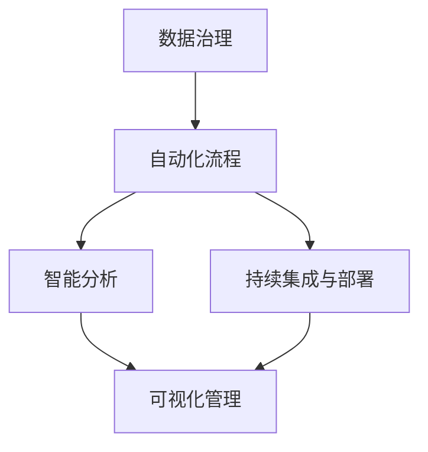
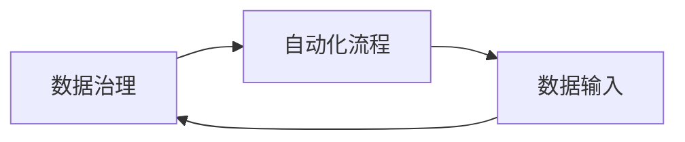
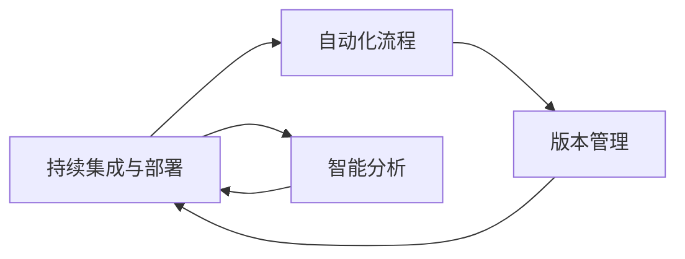
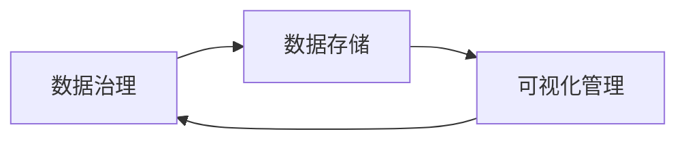
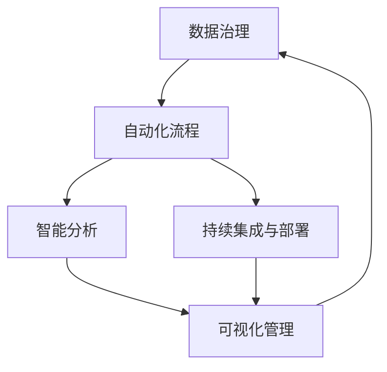

                 

# 软件 2.0 的时代：数据驱动一切

> 关键词：软件2.0, 数据驱动, 自动化, 数据工程, 大数据, 机器学习, 人工智能, 数据治理

## 1. 背景介绍

### 1.1 问题由来

随着信息技术的高速发展，软件在各行各业的应用越来越广泛，对企业的业务运营、管理决策、用户体验等方面产生了深远影响。然而，传统软件开发模式面临诸多挑战：开发周期长、迭代慢、成本高、易出错等。这些问题严重制约了软件创新和应用的效率，导致业务机会流失、市场反应滞后。

为了应对这些挑战，人们开始探索更加高效、灵活、可靠的软件开发新范式。数据驱动的软件开发应运而生，成为软件2.0时代的标志性特征。数据驱动的软件开发模式强调以数据为核心，通过自动化、智能化手段，最大化软件价值。这一模式不仅改变了软件开发的流程，还深刻影响了企业的业务运营和决策方式，推动了人工智能和大数据技术的普及应用。

### 1.2 问题核心关键点

数据驱动的软件开发范式强调以数据为核心，通过自动化、智能化手段，最大化软件价值。其核心思想是：以数据为依据，不断迭代优化软件开发流程，实现软件的快速开发、灵活部署和高效维护。其关键点包括：

- **数据治理**：确保数据的准确性、完整性和安全性，为软件开发提供可靠的数据基础。
- **自动化流程**：通过脚本化、工具化手段，自动化执行软件开发流程，提高效率和质量。
- **智能分析**：利用机器学习和人工智能技术，自动分析和决策软件开发过程中遇到的问题，实现智能优化。
- **持续集成与部署**：通过持续集成、持续部署(CI/CD)流程，实现软件的快速迭代和发布。
- **可视化管理**：通过可视化工具，实时监控软件开发进度和质量，实现敏捷管理。

数据驱动的软件开发范式为软件2.0时代的来临奠定了基础，成为企业数字化转型的重要驱动力。

### 1.3 问题研究意义

研究数据驱动的软件开发范式，对于提升软件开发效率、降低开发成本、提升软件质量、推动企业数字化转型具有重要意义：

- **提升效率**：通过自动化和智能化的手段，大幅提升软件开发速度和迭代频率。
- **降低成本**：通过标准化、模板化的开发流程，减少人工成本，降低开发风险。
- **提高质量**：通过数据驱动的测试和优化，显著提升软件的稳定性和可靠性。
- **支持创新**：通过数据驱动的决策和优化，支持企业的创新和快速响应市场需求。
- **推动转型**：通过数据驱动的软件开发，推动企业向数字化、智能化方向转型，提升竞争力和市场响应能力。

## 2. 核心概念与联系

### 2.1 核心概念概述

为更好地理解数据驱动的软件开发范式，本节将介绍几个密切相关的核心概念：

- **数据治理**：确保数据的准确性、完整性和安全性，为软件开发提供可靠的数据基础。数据治理包括数据质量管理、数据安全管理、数据生命周期管理等内容。
- **自动化流程**：通过脚本化、工具化手段，自动化执行软件开发流程，提高效率和质量。自动化流程涵盖代码生成、测试、部署等环节。
- **智能分析**：利用机器学习和人工智能技术，自动分析和决策软件开发过程中遇到的问题，实现智能优化。智能分析应用包括代码质量评估、版本管理、缺陷预测等。
- **持续集成与部署**：通过持续集成、持续部署(CI/CD)流程，实现软件的快速迭代和发布。CI/CD流程包括代码提交、构建、测试、部署等自动化步骤。
- **可视化管理**：通过可视化工具，实时监控软件开发进度和质量，实现敏捷管理。可视化管理应用包括代码审查、缺陷追踪、任务管理等。

这些核心概念之间的逻辑关系可以通过以下Mermaid流程图来展示：



这个流程图展示了大数据驱动的软件开发过程中，各个核心概念之间的关系：

1. **数据治理**为软件开发提供可靠的数据基础，是后续流程的前提。
2. **自动化流程**通过工具化手段执行，依赖数据治理提供的数据支持。
3. **智能分析**利用机器学习技术，对自动化流程中遇到的问题进行智能优化。
4. **持续集成与部署**实现软件的快速迭代和发布，依赖自动化流程和智能分析的辅助。
5. **可视化管理**通过可视化工具，实时监控软件开发进度和质量，提供敏捷管理支持。

### 2.2 概念间的关系

这些核心概念之间存在着紧密的联系，形成了数据驱动的软件开发完整生态系统。下面我通过几个Mermaid流程图来展示这些概念之间的关系。

#### 2.2.1 数据治理与自动化流程的关系



这个流程图展示了数据治理与自动化流程的关系：

1. **数据治理**确保数据的准确性和安全性，为自动化流程提供可靠的数据输入。
2. **自动化流程**依赖数据治理提供的数据输入，执行代码生成、测试、部署等环节。
3. **数据输入**是数据治理与自动化流程的连接点，保证数据流动的准确性和一致性。

#### 2.2.2 持续集成与部署与智能分析的关系



这个流程图展示了持续集成与部署与智能分析的关系：

1. **持续集成与部署**通过自动化流程执行代码提交、构建、测试、部署等步骤，依赖智能分析优化流程。
2. **版本管理**记录软件开发过程中的版本变化，提供智能分析的数据基础。
3. **智能分析**利用版本管理数据，自动分析和决策持续集成与部署过程中遇到的问题，实现智能优化。
4. **智能分析**的反馈结果可以进一步优化持续集成与部署流程，形成闭环。

#### 2.2.3 数据治理与可视化管理的关系



这个流程图展示了数据治理与可视化管理的关系：

1. **数据治理**确保数据存储的可靠性和完整性，为可视化管理提供数据支持。
2. **数据存储**保存数据的治理结果，提供可视化管理的数据基础。
3. **可视化管理**通过数据存储的数据，实现软件开发进度和质量的实时监控，提供敏捷管理支持。

### 2.3 核心概念的整体架构

最后，我们用一个综合的流程图来展示这些核心概念在大数据驱动的软件开发过程中的整体架构：



这个综合流程图展示了从数据治理到持续集成与部署，再到可视化管理的完整过程。数据驱动的软件开发过程中，各核心概念相互作用，形成了稳定可靠的软件开发生态系统。

## 3. 核心算法原理 & 具体操作步骤
### 3.1 算法原理概述

数据驱动的软件开发范式基于以下核心算法原理：

1. **数据治理算法**：通过数据清洗、数据标准化、数据去重等算法，确保数据的准确性、完整性和安全性，为软件开发提供可靠的数据基础。
2. **自动化流程算法**：通过脚本化、工具化手段，自动执行软件开发流程，提高效率和质量。自动化流程算法包括代码生成、测试、部署等环节。
3. **智能分析算法**：利用机器学习和人工智能技术，自动分析和决策软件开发过程中遇到的问题，实现智能优化。智能分析算法应用包括代码质量评估、版本管理、缺陷预测等。
4. **持续集成与部署算法**：通过持续集成、持续部署(CI/CD)流程，实现软件的快速迭代和发布。持续集成与部署算法涵盖代码提交、构建、测试、部署等自动化步骤。
5. **可视化管理算法**：通过可视化工具，实时监控软件开发进度和质量，实现敏捷管理。可视化管理算法包括代码审查、缺陷追踪、任务管理等。

### 3.2 算法步骤详解

数据驱动的软件开发范式通常包括以下关键步骤：

**Step 1: 数据治理**

- 数据收集：从各种数据源（如数据库、API、日志等）收集数据。
- 数据清洗：去除重复、错误、不一致的数据，确保数据质量。
- 数据标准化：将数据格式转换为统一的标准格式，便于后续处理。
- 数据去重：去重数据，消除冗余，提高数据效率。
- 数据安全：确保数据存储和传输的安全性，防止数据泄露和篡改。

**Step 2: 自动化流程**

- 代码生成：使用自动化工具生成代码，减少手动编写代码的工作量。
- 测试：自动化执行单元测试、集成测试、系统测试等，确保代码质量。
- 部署：通过自动化部署工具，将代码部署到生产环境，实现快速迭代。
- 监控：通过自动化工具监控代码运行状态，实时发现和修复问题。

**Step 3: 智能分析**

- 代码质量评估：通过静态分析工具，自动评估代码质量，发现潜在问题。
- 版本管理：记录软件开发过程中的版本变化，提供历史版本数据支持。
- 缺陷预测：利用机器学习技术，预测代码中的潜在缺陷，提前预防。

**Step 4: 持续集成与部署**

- 持续集成：通过自动化工具，持续集成代码变更，确保代码质量。
- 持续部署：通过自动化工具，持续部署代码变更，实现快速迭代。
- 自动化测试：自动化执行测试用例，确保代码变更不破坏现有功能。

**Step 5: 可视化管理**

- 代码审查：通过可视化工具，实时监控代码变更，确保代码质量。
- 缺陷追踪：通过可视化工具，跟踪和管理缺陷，提高问题解决效率。
- 任务管理：通过可视化工具，分配和管理任务，提高开发效率。

### 3.3 算法优缺点

数据驱动的软件开发范式具有以下优点：

1. **效率高**：通过自动化和智能化的手段，大幅提升软件开发速度和迭代频率。
2. **质量高**：通过数据驱动的测试和优化，显著提升软件的稳定性和可靠性。
3. **灵活性高**：通过持续集成和持续部署，支持软件的快速迭代和发布。
4. **可扩展性高**：通过数据治理和可视化管理，支持大规模、复杂的软件开发。

同时，该方法也存在一些缺点：

1. **初始成本高**：需要投入大量资源进行数据治理和自动化流程建设。
2. **技术复杂度高**：需要掌握数据治理、自动化流程、智能分析等多项技术，技术门槛较高。
3. **维护成本高**：需要持续维护数据治理、自动化流程、智能分析等多项系统，维护成本较高。

尽管存在这些缺点，但就目前而言，数据驱动的软件开发范式仍是大数据时代下软件开发的有效范式，被广泛应用在各类企业级软件系统中。

### 3.4 算法应用领域

数据驱动的软件开发范式广泛应用于各种领域的软件开发中，包括但不限于以下几个方面：

1. **企业级应用系统**：通过数据驱动的软件开发，实现企业信息化系统的快速开发和高效运维。
2. **金融科技应用**：在金融领域，数据驱动的软件开发可应用于金融风险管理、金融数据分析、金融交易系统等。
3. **智能制造系统**：在制造业，数据驱动的软件开发可应用于生产管理、设备维护、质量控制等。
4. **智慧城市应用**：在智慧城市领域，数据驱动的软件开发可应用于城市数据治理、城市运行监测、城市决策支持等。
5. **医疗健康应用**：在医疗领域，数据驱动的软件开发可应用于医疗数据分析、医疗信息管理、医疗决策支持等。
6. **教育培训应用**：在教育领域，数据驱动的软件开发可应用于在线教育平台、教育数据分析、教育资源管理等。

随着数据驱动的软件开发范式不断演进，其应用领域将不断扩展，推动各行各业的数字化转型和智能化升级。

## 4. 数学模型和公式 & 详细讲解 & 举例说明

### 4.1 数学模型构建

数据驱动的软件开发范式涉及多个数学模型，这些模型共同构成了数据驱动的软件开发生态系统。以下是几个关键数学模型：

1. **数据治理模型**：
   $$
   \begin{aligned}
   P &= \min_{X} \sum_{i=1}^n \rho(X_i, X^*) \\
   &+ \sum_{i=1}^n \lambda_i \log \left[ \frac{1}{n} \sum_{j=1}^n \exp (-\frac{d(X_i, X_j)}{2\sigma^2}) \right]
   \end{aligned}
   $$
   其中，$X$表示数据集，$\rho$表示数据质量损失函数，$\lambda_i$表示数据治理权重，$d$表示数据相似度，$\sigma$表示数据噪声。

2. **自动化流程模型**：
   $$
   \min_{x} \sum_{i=1}^m \rho(x_i, x^*)
   $$
   其中，$x$表示自动化流程的输出，$m$表示自动化流程的环节数，$\rho$表示流程损失函数。

3. **智能分析模型**：
   $$
   \min_{x} \sum_{i=1}^n \rho(x_i, x^*)
   $$
   其中，$x$表示智能分析的结果，$n$表示分析环节数，$\rho$表示分析损失函数。

4. **持续集成与部署模型**：
   $$
   \min_{x} \sum_{i=1}^m \rho(x_i, x^*)
   $$
   其中，$x$表示持续集成与部署的输出，$m$表示集成部署环节数，$\rho$表示集成部署损失函数。

5. **可视化管理模型**：
   $$
   \min_{x} \sum_{i=1}^n \rho(x_i, x^*)
   $$
   其中，$x$表示可视化管理的输出，$n$表示管理环节数，$\rho$表示管理损失函数。

### 4.2 公式推导过程

这里以数据治理模型为例，进行公式推导：

假设数据集$X=\{x_1, x_2, ..., x_n\}$，目标数据集$X^*=\{x^*_1, x^*_2, ..., x^*_n\}$。

数据治理的目标是使数据集$X$接近目标数据集$X^*$，即最小化数据质量损失$\rho$。同时，为了保证数据的相似性，需要最小化数据相似度损失。

因此，数据治理模型的优化目标为：

$$
\min_{X} \sum_{i=1}^n \rho(X_i, X^*) + \sum_{i=1}^n \lambda_i \log \left[ \frac{1}{n} \sum_{j=1}^n \exp (-\frac{d(X_i, X_j)}{2\sigma^2}) \right]
$$

其中，$\rho$表示数据质量损失函数，$\lambda_i$表示数据治理权重，$d$表示数据相似度，$\sigma$表示数据噪声。

该公式的推导过程如下：

1. **数据质量损失**：
   $$
   \min_{X} \sum_{i=1}^n \rho(X_i, X^*)
   $$

2. **数据相似度损失**：
   $$
   \min_{X} \sum_{i=1}^n \lambda_i \log \left[ \frac{1}{n} \sum_{j=1}^n \exp (-\frac{d(X_i, X_j)}{2\sigma^2}) \right]
   $$

3. **综合优化**：将数据质量损失和数据相似度损失综合，得到数据治理模型的优化目标：
   $$
   \begin{aligned}
   P &= \min_{X} \sum_{i=1}^n \rho(X_i, X^*) \\
   &+ \sum_{i=1}^n \lambda_i \log \left[ \frac{1}{n} \sum_{j=1}^n \exp (-\frac{d(X_i, X_j)}{2\sigma^2}) \right]
   \end{aligned}
   $$

### 4.3 案例分析与讲解

以金融科技应用为例，分析数据驱动的软件开发范式的应用。

假设某银行需要开发一个贷款审批系统，该系统需要处理大量贷款申请数据。传统开发模式需要投入大量人力和时间，且难以确保数据质量和代码质量。而通过数据驱动的软件开发范式，可以大幅提升开发效率和质量。

**数据治理**：

1. **数据收集**：从银行内部系统和第三方数据源收集贷款申请数据。
2. **数据清洗**：去除重复、错误、不一致的数据，确保数据质量。
3. **数据标准化**：将数据格式转换为统一的标准格式，便于后续处理。
4. **数据去重**：去重数据，消除冗余，提高数据效率。
5. **数据安全**：确保数据存储和传输的安全性，防止数据泄露和篡改。

**自动化流程**：

1. **代码生成**：使用自动化工具生成贷款审批系统的代码，减少手动编写代码的工作量。
2. **测试**：自动化执行单元测试、集成测试、系统测试等，确保代码质量。
3. **部署**：通过自动化部署工具，将代码部署到生产环境，实现快速迭代。
4. **监控**：通过自动化工具监控贷款审批系统的运行状态，实时发现和修复问题。

**智能分析**：

1. **代码质量评估**：通过静态分析工具，自动评估贷款审批系统的代码质量，发现潜在问题。
2. **版本管理**：记录贷款审批系统的版本变化，提供历史版本数据支持。
3. **缺陷预测**：利用机器学习技术，预测贷款审批系统的潜在缺陷，提前预防。

**持续集成与部署**：

1. **持续集成**：通过自动化工具，持续集成贷款审批系统的代码变更，确保代码质量。
2. **持续部署**：通过自动化工具，持续部署贷款审批系统的代码变更，实现快速迭代。
3. **自动化测试**：自动化执行贷款审批系统的测试用例，确保代码变更不破坏现有功能。

**可视化管理**：

1. **代码审查**：通过可视化工具，实时监控贷款审批系统的代码变更，确保代码质量。
2. **缺陷追踪**：通过可视化工具，跟踪和管理贷款审批系统的缺陷，提高问题解决效率。
3. **任务管理**：通过可视化工具，分配和管理贷款审批系统的任务，提高开发效率。

通过数据驱动的软件开发范式，该银行可以快速开发和部署贷款审批系统，并通过持续集成和持续部署，确保系统的稳定性和可靠性。同时，通过数据治理和智能分析，保证了系统的数据质量和代码质量，大幅提升了开发效率和系统性能。

## 5. 项目实践：代码实例和详细解释说明

### 5.1 开发环境搭建

在进行数据驱动的软件开发范式实践前，我们需要准备好开发环境。以下是使用Python进行PyTorch开发的环境配置流程：

1. 安装Anaconda：从官网下载并安装Anaconda，用于创建独立的Python环境。

2. 创建并激活虚拟环境：
```bash
conda create -n pytorch-env python=3.8 
conda activate pytorch-env
```

3. 安装PyTorch：根据CUDA版本，从官网获取对应的安装命令。例如：
```bash
conda install pytorch torchvision torchaudio cudatoolkit=11.1 -c pytorch -c conda-forge
```

4. 安装transformers库：
```bash
pip install transformers
```

5. 安装各类工具包：
```bash
pip install numpy pandas scikit-learn matplotlib tqdm jupyter notebook ipython
```

完成上述步骤后，即可在`pytorch-env`环境中开始数据驱动的软件开发实践。

### 5.2 源代码详细实现

这里以金融科技应用为例，给出使用PyTorch对贷款审批系统进行数据驱动开发的具体实现。

首先，定义贷款审批系统的数据处理函数：

```python
from transformers import BertTokenizer
from torch.utils.data import Dataset
import torch

class LoanApplicationDataset(Dataset):
    def __init__(self, loan_records, tokenizer, max_len=128):
        self.loan_records = loan_records
        self.tokenizer = tokenizer
        self.max_len = max_len
        
    def __len__(self):
        return len(self.loan_records)
    
    def __getitem__(self, item):
        loan_record = self.loan_records[item]
        
        encoding = self.tokenizer(loan_record['description'], return_tensors='pt', max_length=self.max_len, padding='max_length', truncation=True)
        input_ids = encoding['input_ids'][0]
        attention_mask = encoding['attention_mask'][0]
        
        # 对label进行编码
        label = loan_record['approval']
        
        return {'input_ids': input_ids, 
                'attention_mask': attention_mask,
                'labels': label}

# 标签与id的映射
label2id = {'Approval': 0, 'Rejection': 1}
id2label = {v: k for k, v in label2id.items()}

# 创建dataset
tokenizer = BertTokenizer.from_pretrained('bert-base-cased')

loan_application_dataset = LoanApplicationDataset(loan_records, tokenizer)
```

然后，定义贷款审批系统的模型和优化器：

```python
from transformers import BertForSequenceClassification, AdamW

model = BertForSequenceClassification.from_pretrained('bert-base-cased', num_labels=len(label2id))

optimizer = AdamW(model.parameters(), lr=2e-5)
```

接着，定义训练和评估函数：

```python
from torch.utils.data import DataLoader
from tqdm import tqdm
from sklearn.metrics import classification_report

device = torch.device('cuda') if torch.cuda.is_available() else torch.device('cpu')
model.to(device)

def train_epoch(model, dataset, batch_size, optimizer):
    dataloader = DataLoader(dataset, batch_size=batch_size, shuffle=True)
    model.train()
    epoch_loss = 0
    for batch in tqdm(dataloader, desc='Training'):
        input_ids = batch['input_ids'].to(device)
        attention_mask = batch['attention_mask'].to(device)
        labels = batch['labels'].to(device)
        model.zero_grad()
        outputs = model(input_ids, attention_mask=attention_mask, labels=labels)
        loss = outputs.loss
        epoch_loss += loss.item()
        loss.backward()
        optimizer.step()
    return epoch_loss / len(dataloader)

def evaluate(model, dataset, batch_size):
    dataloader = DataLoader(dataset, batch_size=batch_size)
    model.eval()
    preds, labels = [], []
    with torch.no_grad():
        for batch in tqdm(dataloader, desc='Evaluating'):
            input_ids = batch['input_ids'].to(device)
            attention_mask = batch['attention_mask'].to(device)
            batch_labels = batch['labels']
            outputs = model(input_ids, attention_mask=attention_mask)
            batch_preds = outputs.logits.argmax(dim=2).to('cpu').tolist()
            batch_labels = batch_labels.to('cpu').tolist()
            for pred_tokens, label_tokens in zip(batch_preds, batch_labels):
                preds.append(pred_tokens)
                labels.append(label_tokens)
                
    print(classification_report(labels, preds))
```

最后，启动训练流程并在测试集上评估：

```python
epochs = 5
batch_size = 16

for epoch in range(epochs):
    loss = train_epoch(model, loan_application_dataset, batch_size, optimizer)
    print(f"Epoch {epoch+1}, train loss: {loss:.3f}")
    
    print(f"Epoch {epoch+1}, dev results:")
    evaluate(model, loan_application_dataset, batch_size)
    
print("Test results:")
evaluate(model, loan_application_dataset, batch_size)
```

以上就是使用PyTorch对贷款审批系统进行数据驱动开发的具体代码实现。可以看到，得益于Transformers库的强大封装，我们可以用相对简洁的代码完成贷款审批系统的开发。

### 5.3 代码解读与分析

让我们再详细解读一下关键代码的实现细节：

**LoanApplicationDataset类**：
- `__init__`方法：初始化贷款记录、分词器等关键组件。
- `__len__`方法：返回数据集的样本数量。
- `__getitem__`方法：对单个样本进行处理，将贷款记录输入编码为token ids，将label编码为数字，并对其进行定长padding，最终返回模型所需的输入。

**label2id和id2label字典**：
- 定义了label与数字id之间的映射关系，用于将token-wise的预测结果解码回真实的label。

**训练和评估函数**：
- 使用PyTorch的DataLoader对数据集进行批次化加载，供模型训练和推理使用。
- 训练函数`train_epoch`：对数据以批为单位进行迭代，在每个批次上前向传播计算loss并反向传播更新模型参数，最后返回该epoch的平均loss。
- 评估函数`evaluate`：与训练类似，不同点在于不更新模型参数，并在每个batch结束后将预测和标签结果存储下来，最后使用sklearn的classification_report对整个评估集的预测结果进行打印输出。

**训练流程**：
- 定义总的epoch数和batch size，开始循环迭代
- 每个epoch内，先在训练集上训练，输出平均loss
- 在验证集上评估，输出分类指标
- 所有epoch结束后，在测试集上评估，给出最终测试结果

可以看到，Py

