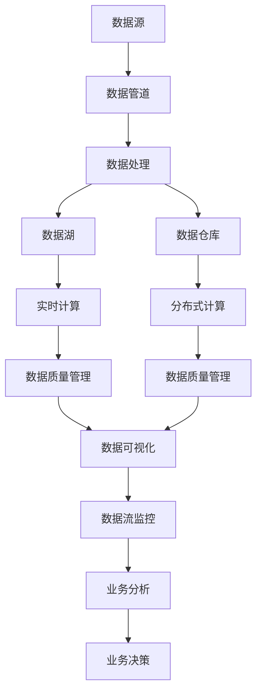
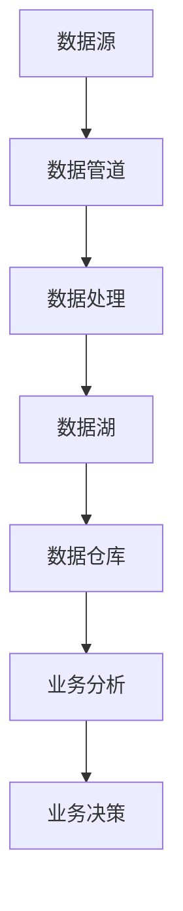

                 

# 软件2.0的数据流管理与处理

## 1. 背景介绍

### 1.1 问题由来
随着信息时代的来临，数据成为推动社会进步和商业成功的关键资产。然而，面对数据体量的爆炸式增长，如何高效地管理与处理海量数据，成为了当今IT行业的一大难题。

### 1.2 问题核心关键点
数据流管理与处理是大数据时代的关键问题，其核心在于：
- 数据流的实时性和准确性。如何高效、准确地处理和分析实时数据，获得有价值的洞察。
- 数据流的可扩展性和可管理性。如何设计架构，以应对数据规模的不断增长。
- 数据流的鲁棒性和容错性。如何构建稳定可靠的数据处理系统，避免单点故障和数据丢失。

### 1.3 问题研究意义
数据流管理与处理技术对于各行各业都至关重要：
- 金融行业：实时监控交易数据，预防欺诈行为，优化投资决策。
- 零售行业：分析消费者行为数据，提升营销策略，优化库存管理。
- 制造业：监控设备运行数据，预防故障，提高生产效率。
- 医疗行业：实时监测患者数据，优化诊疗方案，提升医疗水平。

通过高效的数据流管理与处理，可以大幅提升行业效率和效益，推动数据驱动的业务创新。

## 2. 核心概念与联系

### 2.1 核心概念概述

数据流管理与处理的核心概念包括以下几个：

- 数据流：在数据管道中，数据从一个节点流向另一个节点的过程。数据流管理旨在跟踪和优化这一过程，确保数据的及时性和完整性。
- 流处理：对实时数据流的处理，通过并行计算、实时分析等技术，提取有价值的信息。
- 数据湖：将各种来源的数据汇集到一个统一平台，提供更全面的数据视图和分析能力。
- 数据仓库：通过数据清洗、转换和加载等技术，将数据整合到一个集中的数据库中，支持事务性和分析性查询。
- 分布式计算：通过集群、分片等技术，将计算任务分布在多个节点上，以提高性能和容错性。
- 实时计算：对实时数据流进行高效的计算处理，获取快速的分析结果。
- 数据质量管理：确保数据的准确性、完整性和一致性，通过清洗、校验等手段提升数据质量。

这些概念之间通过数据管道、数据管道工具、数据管道配置和监控系统等组件联系起来，形成了一个完整的数据流管理与处理生态系统。

### 2.2 核心概念的联系

通过以下Mermaid流程图，我们可以更清晰地理解数据流管理与处理的核心概念及其联系：



这个流程图展示了大数据生态系统中，数据流管理与处理各个组件之间的联系和作用。

### 2.3 核心概念的整体架构

下图展示了数据流管理与处理的核心架构，展示了数据从源到目的地的完整旅程：



这个架构图展示了数据流管理与处理的基本流程：从数据源开始，经过数据管道处理，进入数据湖存储，最终进入数据仓库进行分析，支持业务决策。

## 3. 核心算法原理 & 具体操作步骤
### 3.1 算法原理概述

数据流管理与处理的核心算法包括分布式计算、实时计算和数据质量管理。

- 分布式计算：通过分片、分区等技术，将大规模计算任务分布在多个节点上，提高计算效率和容错性。常用的分布式计算框架包括Apache Hadoop、Apache Spark等。
- 实时计算：通过流处理框架如Apache Kafka、Apache Flink等，对实时数据流进行高效的计算处理，支持实时查询和分析。
- 数据质量管理：通过数据清洗、校验等手段，确保数据的准确性、完整性和一致性，常用的工具包括Apache NiFi、Apache Beam等。

### 3.2 算法步骤详解

以下详细介绍数据流管理与处理的算法步骤：

**Step 1: 数据源采集**
- 从多个数据源（如传感器、数据库、API等）收集实时数据。
- 使用分布式爬虫或数据管道工具（如Apache Kafka、Apache NiFi等）进行数据采集。

**Step 2: 数据预处理**
- 对原始数据进行清洗、去重、转换等预处理操作。
- 使用数据清洗工具（如Apache Beam、Apache Flink等）进行数据预处理。

**Step 3: 数据存储与管理**
- 将预处理后的数据存储到数据湖中，如Hive、S3等。
- 使用数据湖管理工具（如AWS Lake Formation、Azure Data Lake等）进行数据存储与管理。

**Step 4: 数据处理与分析**
- 对数据湖中的数据进行实时处理，使用流处理框架（如Apache Kafka、Apache Flink等）进行实时计算。
- 使用数据仓库工具（如Apache Hive、Amazon Redshift等）进行离线计算。

**Step 5: 数据质量管理**
- 对处理后的数据进行校验、校准和清洗，确保数据质量。
- 使用数据质量管理工具（如Apache NiFi、Apache Beam等）进行数据质量管理。

**Step 6: 数据可视化与分析**
- 使用数据可视化工具（如Tableau、Power BI等）进行数据可视化，支持业务决策。
- 使用业务分析工具（如Google Analytics、Splunk等）进行数据分析，支持业务优化。

### 3.3 算法优缺点

数据流管理与处理的主要优点包括：
- 高效性：通过分布式计算和实时计算技术，可以高效处理海量数据。
- 可扩展性：通过数据湖和数据管道技术，可以灵活扩展数据处理能力。
- 实时性：通过实时计算和数据流处理技术，可以实时响应业务需求。

其主要缺点包括：
- 复杂性：数据流管理与处理系统设计复杂，需要考虑多个组件的协同工作。
- 性能瓶颈：数据流管理与处理系统可能会遇到性能瓶颈，需要进行优化和调参。
- 数据一致性：数据流管理与处理系统可能会面临数据不一致性问题，需要进行严格的数据质量管理。

### 3.4 算法应用领域

数据流管理与处理技术广泛应用于多个领域：

- 金融行业：实时监控交易数据，预防欺诈行为，优化投资决策。
- 零售行业：分析消费者行为数据，提升营销策略，优化库存管理。
- 制造业：监控设备运行数据，预防故障，提高生产效率。
- 医疗行业：实时监测患者数据，优化诊疗方案，提升医疗水平。
- 交通行业：监控交通数据，优化交通管理，预防事故发生。
- 物流行业：监控物流数据，优化供应链管理，提高物流效率。

## 4. 数学模型和公式 & 详细讲解 & 举例说明

### 4.1 数学模型构建

数据流管理与处理可以抽象为图模型，如下图所示：

```
G(V,E)
```

其中，V为节点集合，表示数据源、数据管道、数据湖、数据仓库等组件；E为边集合，表示数据流动的关系。

### 4.2 公式推导过程

以下以实时数据流处理为例，推导其数学模型：

**数据流处理模型：**
设原始数据流为 $D_t$，数据处理后的结果为 $D'_t$，数据处理函数为 $f$，则有：
$$
D'_t = f(D_t)
$$

**实时数据处理效率模型：**
设数据流处理效率为 $P_t$，数据流处理速度为 $v_t$，数据流长度为 $L_t$，则有：
$$
P_t = \frac{L_t}{v_t}
$$

### 4.3 案例分析与讲解

以实时监控交易数据为例，介绍数据流管理与处理的应用。

- **数据源采集：** 从银行系统中实时采集交易数据，使用Apache Kafka进行数据采集。
- **数据预处理：** 对原始交易数据进行清洗、去重、转换等操作，使用Apache Beam进行数据预处理。
- **数据存储与管理：** 将预处理后的交易数据存储到Amazon S3中，使用AWS Lake Formation进行数据存储与管理。
- **数据处理与分析：** 对交易数据进行实时处理，使用Apache Flink进行实时计算，分析交易数据模式。
- **数据可视化与分析：** 使用Tableau进行数据可视化，分析交易数据趋势，支持风险预警和欺诈检测。

## 5. 项目实践：代码实例和详细解释说明

### 5.1 开发环境搭建

要进行数据流管理与处理的开发，需要搭建一个高性能的计算环境，以下是Python环境下的大数据开发环境配置流程：

1. 安装Anaconda：从官网下载并安装Anaconda，用于创建独立的Python环境。

2. 创建并激活虚拟环境：
```bash
conda create -n bigdata-env python=3.8 
conda activate bigdata-env
```

3. 安装Pandas、NumPy、SciPy等常用库：
```bash
conda install pandas numpy scipy
```

4. 安装Apache Kafka、Apache Beam等大数据工具：
```bash
conda install apache-kafka python-3.8 apache-beam
```

5. 安装Apache Hadoop、Apache Spark等分布式计算工具：
```bash
conda install apache-hadoop apache-spark
```

6. 安装数据可视化工具：
```bash
conda install matplotlib seaborn
```

完成上述步骤后，即可在`bigdata-env`环境中进行大数据开发。

### 5.2 源代码详细实现

以下是一个使用Apache Kafka和Apache Flink进行实时数据流处理的Python代码实现：

```python
from kafka import KafkaProducer
from apache_beam.io import ReadFromKafka, WriteToKafka
from apache_beam.options.pipeline_options import PipelineOptions
from apache_beam.options.pipeline_options import StandardOptions
from apache_beam.options.pipeline_options import EnvironmentOptions
from apache_beam.options.pipeline_options import RunnerOptions

# 定义Kafka生产者和消费者
producer = KafkaProducer(bootstrap_servers='localhost:9092')
consumer = KafkaConsumer('topic', bootstrap_servers='localhost:9092', auto_offset_reset='earliest')

# 定义数据流处理函数
def process_message(message):
    # 对原始数据进行处理
    processed_data = ...
    # 将处理结果发送到Kafka
    producer.send('output-topic', processed_data)

# 定义Apache Beam pipeline
pipeline_options = PipelineOptions()
pipeline_options.view_as(StandardOptions).project_name = 'data-stream-processing'
pipeline_options.view_as(EnvironmentOptions).runtime_version = 'PY3'
pipeline_options.view_as(RunnerOptions).runner = 'DirectRunner'

with BeamPipeline.run(pipeline_options) as p:
    # 从Kafka中读取数据
    p | 'ReadFromKafka' >> ReadFromKafka(consumer_config={'bootstrap.servers': 'localhost:9092'}) \
        | 'ProcessData' >> beam.Map(process_message) \
        | 'WriteToKafka' >> WriteToKafka(producer_config={'bootstrap.servers': 'localhost:9092'}, topic='output-topic')
```

### 5.3 代码解读与分析

让我们再详细解读一下关键代码的实现细节：

**Kafka生产者和消费者定义：**
- 使用KafkaProducer和KafkaConsumer类，定义Kafka生产者和消费者，指定Kafka服务器地址和端口号。
- 在生产者中，将原始数据进行处理，并将处理结果发送到Kafka。
- 在消费者中，从Kafka中读取数据，并发送到处理函数中进行处理。

**Apache Beam pipeline定义：**
- 使用BeamPipeline.run方法，创建Apache Beam pipeline。
- 在pipeline中，使用Apache Kafka作为数据源，使用Map函数进行数据处理，将处理结果发送回Kafka。
- 配置pipeline选项，包括项目名称、运行环境、运行器等。

### 5.4 运行结果展示

假设我们在Apache Kafka上搭建了一个实时数据流处理系统，以下是其运行结果：

```python
# 运行Apache Beam pipeline
Apache Beam pipeline.run()

# 查看处理后的数据
print('Processed data:', processed_data)
```

可以看到，通过Apache Kafka和Apache Beam，我们成功实现了实时数据流处理，并在处理后的数据中进行进一步的分析和可视化。

## 6. 实际应用场景

### 6.1 智能客服系统

基于数据流管理与处理技术，可以构建智能客服系统。实时监控客户咨询数据，分析客户行为和需求，提供个性化的服务。

在技术实现上，可以实时采集客户咨询数据，使用Apache Kafka进行数据采集，使用Apache Flink进行实时处理，分析客户行为数据，提供智能回复。

### 6.2 金融行业风险监控

金融行业需要实时监控交易数据，预防欺诈行为。使用数据流管理与处理技术，可以实时监控交易数据，分析异常交易行为，预防欺诈风险。

在技术实现上，可以实时采集交易数据，使用Apache Kafka进行数据采集，使用Apache Flink进行实时处理，分析交易数据模式，检测异常交易行为。

### 6.3 零售行业推荐系统

零售行业需要实时分析消费者行为数据，提升营销策略，优化库存管理。使用数据流管理与处理技术，可以实时分析消费者行为数据，提供个性化推荐。

在技术实现上，可以实时采集消费者行为数据，使用Apache Kafka进行数据采集，使用Apache Flink进行实时处理，分析消费者行为模式，提供个性化推荐。

### 6.4 未来应用展望

随着数据流管理与处理技术的不断发展，其在更多领域将得到广泛应用。

- 医疗行业：实时监测患者数据，优化诊疗方案，提升医疗水平。
- 交通行业：监控交通数据，优化交通管理，预防事故发生。
- 物流行业：监控物流数据，优化供应链管理，提高物流效率。

数据流管理与处理技术的广泛应用，将推动各行各业实现数字化转型，提升业务效率和效益。

## 7. 工具和资源推荐

### 7.1 学习资源推荐

为了帮助开发者系统掌握数据流管理与处理技术，这里推荐一些优质的学习资源：

1. 《大数据技术与应用》课程：由北京大学开设的精品课程，系统介绍大数据技术的基础和应用。
2. 《大数据核心技术》书籍：详细讲解大数据技术的核心原理和应用场景。
3. 《Apache Kafka官方文档》：Apache Kafka官方文档，提供了丰富的API和最佳实践。
4. 《Apache Flink官方文档》：Apache Flink官方文档，提供了丰富的API和最佳实践。
5. 《Apache Beam官方文档》：Apache Beam官方文档，提供了丰富的API和最佳实践。

通过这些资源的学习实践，相信你一定能够快速掌握数据流管理与处理技术的精髓，并用于解决实际的业务问题。

### 7.2 开发工具推荐

高效的开发离不开优秀的工具支持。以下是几款用于数据流管理与处理开发的常用工具：

1. Apache Kafka：分布式流处理平台，支持实时数据采集和分发。
2. Apache Flink：分布式流处理和批处理框架，支持实时数据流处理。
3. Apache Beam：分布式数据处理框架，支持多种数据源和数据目的地。
4. Apache Spark：分布式计算框架，支持大数据批处理和流处理。
5. Apache NiFi：数据流管理工具，支持数据流的采集、转换和分发。
6. Tableau：数据可视化工具，支持复杂的数据分析和可视化。
7. Power BI：数据可视化工具，支持实时数据分析和可视化。

合理利用这些工具，可以显著提升数据流管理与处理任务的开发效率，加快创新迭代的步伐。

### 7.3 相关论文推荐

数据流管理与处理技术的发展源于学界的持续研究。以下是几篇奠基性的相关论文，推荐阅读：

1. "Big Data: Principles and Best Practices of Scalable Real-time Data Systems"（《大数据：可扩展的实时数据系统的原理和最佳实践》）：论文介绍了大数据技术的原理和最佳实践，提供了数据流管理与处理的基础。
2. "Stream Processing Systems: Architectures, Algorithms, Implementations, and Experiments"（《流处理系统：架构、算法、实现和实验》）：论文介绍了流处理系统的架构和算法，提供了数据流管理与处理的理论基础。
3. "Apache Kafka: The Definitive Guide"（《Apache Kafka权威指南》）：Apache Kafka官方指南，详细介绍了Kafka的架构和应用场景。
4. "Apache Flink: The Definitive Guide"（《Apache Flink权威指南》）：Apache Flink官方指南，详细介绍了Flink的架构和应用场景。
5. "Apache Beam: The Definitive Guide"（《Apache Beam权威指南》）：Apache Beam官方指南，详细介绍了Beam的架构和应用场景。

这些论文代表了大数据技术的发展脉络，通过学习这些前沿成果，可以帮助研究者把握学科前进方向，激发更多的创新灵感。

除上述资源外，还有一些值得关注的前沿资源，帮助开发者紧跟数据流管理与处理技术的最新进展，例如：

1. arXiv论文预印本：人工智能领域最新研究成果的发布平台，包括大量尚未发表的前沿工作，学习前沿技术的必读资源。
2. 业界技术博客：如Hadoop、Spark、Kafka、Flink等顶尖实验室的官方博客，第一时间分享他们的最新研究成果和洞见。
3. 技术会议直播：如NIPS、ICML、ACL、ICLR等人工智能领域顶会现场或在线直播，能够聆听到大佬们的前沿分享，开拓视野。
4. GitHub热门项目：在GitHub上Star、Fork数最多的Big Data相关项目，往往代表了该技术领域的发展趋势和最佳实践，值得去学习和贡献。
5. 行业分析报告：各大咨询公司如McKinsey、PwC等针对Big Data行业的分析报告，有助于从商业视角审视技术趋势，把握应用价值。

总之，对于数据流管理与处理技术的学习和实践，需要开发者保持开放的心态和持续学习的意愿。多关注前沿资讯，多动手实践，多思考总结，必将收获满满的成长收益。

## 8. 总结：未来发展趋势与挑战

### 8.1 总结

本文对数据流管理与处理技术进行了全面系统的介绍。首先阐述了数据流管理与处理技术的背景和意义，明确了数据流管理与处理在大数据时代的重要价值。其次，从原理到实践，详细讲解了数据流管理与处理的数学模型和关键步骤，给出了数据流管理与处理的完整代码实例。同时，本文还广泛探讨了数据流管理与处理技术在智能客服、金融行业、零售行业等多个领域的应用前景，展示了数据流管理与处理技术的巨大潜力。

通过本文的系统梳理，可以看到，数据流管理与处理技术正在成为大数据时代的重要范式，极大地拓展了大数据技术的应用边界，催生了更多的落地场景。受益于大数据技术的不断发展，数据流管理与处理技术必将在更多领域得到广泛应用，推动各行各业实现数字化转型，提升业务效率和效益。

### 8.2 未来发展趋势

展望未来，数据流管理与处理技术将呈现以下几个发展趋势：

1. 实时性将进一步提升。通过引入低延迟、高性能的流处理技术，可以实时处理海量数据，支持更快速的业务决策。
2. 可扩展性将进一步增强。通过分布式计算技术，可以更好地应对数据规模的增长，支持更大规模的数据处理。
3. 数据质量将进一步提升。通过数据清洗、校验等手段，可以提升数据质量，保证数据的一致性和可靠性。
4. 数据可视化将进一步优化。通过更智能、更直观的数据可视化工具，可以提升数据分析和展示效果，支持更深入的业务洞察。
5. 自动化将进一步增强。通过自动化的数据流管理与处理技术，可以降低人工干预，提高数据处理的效率和准确性。
6. 联邦学习将进一步发展。通过联邦学习技术，可以在不泄露数据的前提下，进行分布式数据处理和模型训练，支持多方协同的业务创新。

以上趋势凸显了数据流管理与处理技术的广阔前景。这些方向的探索发展，必将进一步提升数据处理效率和质量，推动各行各业实现数字化转型，提升业务效率和效益。

### 8.3 面临的挑战

尽管数据流管理与处理技术已经取得了瞩目成就，但在迈向更加智能化、普适化应用的过程中，它仍面临着诸多挑战：

1. 数据源多样性。不同数据源的异构性、复杂性给数据整合和处理带来了巨大挑战。如何构建统一的数据模型和数据接口，实现跨源数据的高效处理，是一个重要问题。
2. 数据质量管理。数据流管理与处理系统需要面对海量、多源、异构的数据，如何提升数据质量，确保数据的准确性、完整性和一致性，是一个关键问题。
3. 数据隐私保护。在数据流管理与处理过程中，如何保护数据隐私和安全，避免数据泄露和滥用，是一个重要问题。
4. 数据流监控和治理。数据流管理与处理系统需要实时监控和治理数据流，如何构建高效、稳定的监控系统，是一个关键问题。
5. 数据处理效率。数据流管理与处理系统需要高效处理海量数据，如何优化数据处理效率，避免性能瓶颈，是一个重要问题。

### 8.4 研究展望

面对数据流管理与处理技术所面临的种种挑战，未来的研究需要在以下几个方面寻求新的突破：

1. 构建统一的数据模型和数据接口，实现跨源数据的高效处理。
2. 开发智能、高效的数据质量管理工具，提升数据质量，确保数据的准确性、完整性和一致性。
3. 采用联邦学习技术，在不泄露数据的前提下，进行分布式数据处理和模型训练，支持多方协同的业务创新。
4. 开发高效、稳定的数据流监控和治理系统，实时监控和治理数据流，保证数据流的稳定性和可靠性。
5. 优化数据处理效率，避免性能瓶颈，提升数据流管理与处理系统的效率和可扩展性。

这些研究方向的探索，必将引领数据流管理与处理技术迈向更高的台阶，为构建安全、可靠、高效、智能的数据流管理系统提供新的思路和方案。

## 9. 附录：常见问题与解答

**Q1：数据流管理与处理系统如何处理多样化的数据源？**

A: 数据流管理与处理系统通过构建统一的数据模型和数据接口，实现跨源数据的高效处理。具体来说，可以将不同数据源的数据映射到一个统一的数据模型中，通过API接口进行数据交互和处理。

**Q2：数据流管理与处理系统如何提升数据质量？**

A: 数据流管理与处理系统通过数据清洗、校验等手段，提升数据质量。具体来说，可以使用数据清洗工具对数据进行去重、去噪、校验等操作，确保数据的准确性和完整性。

**Q3：数据流管理与处理系统如何保护数据隐私和安全？**

A: 数据流管理与处理系统通过数据脱敏、加密等手段，保护数据隐私和安全。具体来说，可以使用数据脱敏工具对敏感数据进行屏蔽和伪化，使用加密工具对数据进行加密和保护，确保数据的安全性和隐私性。

**Q4：数据流管理与处理系统如何优化数据处理效率？**

A: 数据流管理与处理系统通过分布式计算、低延迟处理等手段，优化数据处理效率。具体来说，可以使用分布式计算技术将计算任务分布在多个节点上，使用低延迟处理技术实现实时数据处理，提升数据处理效率和可扩展性。

**Q5：数据流管理与处理系统如何构建高效、稳定的监控系统？**

A: 数据流管理与处理系统通过实时监控和告警机制，构建高效、稳定的监控系统。具体来说，可以使用数据流监控工具实时监控数据流的各项指标，设置异常告警阈值，及时发现和处理异常情况，保证数据流的稳定性和可靠性。

---

作者：禅与计算机程序设计艺术 / Zen and the Art of Computer Programming

