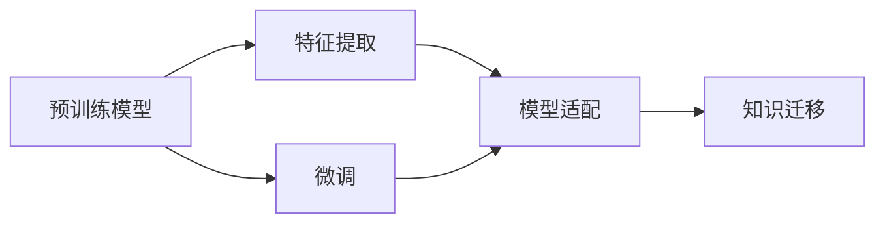

                 

# 迁移学习(Transfer Learning) - 原理与代码实例讲解

> 关键词：迁移学习, 预训练, 微调, 特征提取, 模型适配

## 1. 背景介绍

### 1.1 问题由来

随着深度学习技术的发展，大规模预训练模型如BERT、GPT等在自然语言处理（NLP）、计算机视觉（CV）等领域取得了显著成果。然而，训练大规模预训练模型通常需要大量的计算资源和数据，这对许多实际应用场景是不切实际的。此外，大规模预训练模型通常只能在大规模无标注数据上进行训练，而无法很好地适应特定领域的任务。

迁移学习(Transfer Learning)作为一种有效的学习范式，旨在将预训练模型的知识迁移到新任务上，从而降低新任务的学习成本，提升模型性能。迁移学习利用已有的大规模预训练模型，在特定领域上只需微调即可取得显著效果，成为深度学习研究的重要方向。

### 1.2 问题核心关键点

迁移学习的核心思想是通过已有的预训练模型，将其在某个领域学到的知识迁移到另一个领域，以加速新领域的学习过程，提高模型在新任务上的性能。迁移学习的关键在于如何选择合适的预训练模型，以及如何适应新任务进行微调。

在迁移学习中，预训练模型通常是在大规模无标签数据上进行的，学习到了通用的特征表示。这些特征表示可以通过微调来适应特定的任务，从而提升模型在新任务上的性能。具体来说，迁移学习的流程包括：

1. 选择合适的预训练模型。
2. 在新任务上微调预训练模型。
3. 在新任务上测试微调后的模型性能。

### 1.3 问题研究意义

迁移学习在深度学习领域具有重要意义：

1. **降低学习成本**：通过预训练模型，可以利用已有的大量数据和计算资源，避免从头开始训练模型。
2. **提高模型性能**：预训练模型在大规模数据上学习到了通用的特征表示，能够在新任务上快速适应并提升性能。
3. **加速研究进程**：迁移学习能够加速模型在新领域上的研究进程，快速验证假设和探索新方向。
4. **推动应用落地**：迁移学习能够将深度学习模型应用到实际应用场景中，推动AI技术的产业化。

## 2. 核心概念与联系

### 2.1 核心概念概述

为了更好地理解迁移学习，下面介绍了几个核心概念：

- **预训练模型(Pretrained Models)**：在大规模无标签数据上，通过自监督学习任务训练得到的模型。如BERT、GPT、ResNet等。
- **微调(Fine-tuning)**：在新任务上微调预训练模型，通过有监督学习优化模型在新任务上的性能。
- **特征提取(Feature Extraction)**：预训练模型通常具有强大的特征提取能力，能够学习到通用的特征表示。
- **模型适配(Model Adaptation)**：通过微调，将预训练模型的特征提取能力适配到新任务上。
- **知识迁移(Knowledge Transfer)**：利用预训练模型在新任务上的性能提升，实现不同任务之间的知识迁移。

这些概念之间存在着紧密的联系，通过预训练模型和微调，能够实现知识的迁移和模型在新任务上的适配。

### 2.2 概念间的关系

这些核心概念之间的关系可以通过以下Mermaid流程图来展示：



这个流程图展示了迁移学习的基本流程：预训练模型学习通用的特征表示，通过微调将特征提取能力适配到新任务上，实现知识迁移。

## 3. 核心算法原理 & 具体操作步骤

### 3.1 算法原理概述

迁移学习的核心思想是利用预训练模型在新任务上的知识，加速新任务的训练过程。具体来说，迁移学习的过程包括以下几个步骤：

1. 选择合适的预训练模型。
2. 在新任务上微调预训练模型。
3. 在新任务上测试微调后的模型性能。

通过微调，预训练模型能够在新任务上快速适应并提升性能，实现知识迁移。

### 3.2 算法步骤详解

下面详细讲解迁移学习的基本步骤：

#### 3.2.1 选择合适的预训练模型

选择合适的预训练模型是迁移学习的第一步。预训练模型通常是在大规模无标签数据上训练得到的，学习到了通用的特征表示。在选择预训练模型时，需要考虑以下因素：

1. **模型规模**：通常选择更大规模的预训练模型，其特征表示能力更强。
2. **任务相关性**：选择与新任务相似的预训练模型，能够更好地适应新任务。
3. **训练数据量**：预训练模型通常在大规模数据上训练得到，具有较好的泛化能力。

#### 3.2.2 在新任务上微调预训练模型

在新任务上微调预训练模型，是迁移学习的核心步骤。微调的过程通常包括以下几个步骤：

1. **准备数据集**：收集新任务的标注数据集，划分为训练集、验证集和测试集。
2. **添加任务适配层**：根据新任务的输出类型，在预训练模型的顶层添加适当的输出层和损失函数。
3. **设置微调超参数**：选择合适的优化器、学习率、批大小等超参数，设置正则化技术如L2正则、Dropout等。
4. **执行微调**：在训练集上执行梯度下降算法，更新模型参数。在验证集上评估模型性能，防止过拟合。
5. **测试微调后的模型**：在测试集上评估微调后的模型性能，对比预训练模型和新模型的性能提升。

#### 3.2.3 算法优缺点

迁移学习具有以下优点：

1. **降低学习成本**：利用已有预训练模型，避免了从头开始训练的复杂过程。
2. **提升模型性能**：预训练模型已经在大规模数据上学习到了丰富的特征表示，能够在新任务上快速适应并提升性能。
3. **加速研究进程**：迁移学习能够加速模型在新领域上的研究进程，快速验证假设和探索新方向。

同时，迁移学习也存在一些缺点：

1. **依赖标注数据**：微调需要新任务的标注数据，标注数据集往往难以获得。
2. **泛化能力有限**：当新任务与预训练模型的数据分布差异较大时，微调的效果可能不佳。
3. **模型复杂性**：在微调过程中，通常需要添加任务适配层，增加了模型的复杂性。

### 3.3 算法应用领域

迁移学习已经广泛应用于多个领域，包括但不限于：

1. **自然语言处理(NLP)**：如文本分类、命名实体识别、机器翻译等任务。
2. **计算机视觉(CV)**：如图像分类、目标检测、人脸识别等任务。
3. **语音识别(Speech Recognition)**：如语音情感识别、语音翻译等任务。
4. **推荐系统(Recommendation Systems)**：如个性化推荐、评分预测等任务。
5. **医疗健康(Healthcare)**：如疾病预测、患者分诊等任务。

## 4. 数学模型和公式 & 详细讲解 & 举例说明

### 4.1 数学模型构建

假设预训练模型为 $M_{\theta}$，在新任务 $T$ 上微调后的模型为 $M_{\hat{\theta}}$。假设训练集为 $D_{train}=\{(x_i, y_i)\}_{i=1}^N$，其中 $x_i$ 为输入，$y_i$ 为输出标签。微调的优化目标为最小化在新任务上的损失函数：

$$
\min_{\theta} \sum_{i=1}^N \mathcal{L}(M_{\theta}(x_i), y_i)
$$

其中，$\mathcal{L}$ 为新任务上的损失函数，通常为交叉熵损失或均方误差损失。

### 4.2 公式推导过程

以文本分类任务为例，假设模型在新任务上的输出为 $\hat{y}=M_{\theta}(x)$，真实标签为 $y$。则二分类交叉熵损失函数为：

$$
\ell(M_{\theta}(x),y) = -[y\log \hat{y} + (1-y)\log(1-\hat{y})]
$$

将上述损失函数应用到训练集 $D_{train}$ 上，得到新任务上的经验风险：

$$
\mathcal{L}(\theta) = \frac{1}{N} \sum_{i=1}^N [-y_i\log M_{\theta}(x_i) - (1-y_i)\log(1-M_{\theta}(x_i))]
$$

通过梯度下降等优化算法，更新模型参数 $\theta$，最小化上述经验风险。

### 4.3 案例分析与讲解

以情感分析任务为例，介绍迁移学习的具体实现过程。

假设预训练模型为BERT，训练集为情感标注数据集。首先，在BERT的顶层添加一个线性分类器，并定义交叉熵损失函数：

```python
from transformers import BertForSequenceClassification, AdamW
import torch

model = BertForSequenceClassification.from_pretrained('bert-base-uncased', num_labels=2)
optimizer = AdamW(model.parameters(), lr=2e-5)
```

然后，在新任务上微调模型：

```python
from torch.utils.data import Dataset, DataLoader

class SentimentDataset(Dataset):
    def __init__(self, texts, labels):
        self.texts = texts
        self.labels = labels
        
    def __len__(self):
        return len(self.texts)
    
    def __getitem__(self, idx):
        text = self.texts[idx]
        label = self.labels[idx]
        return {'input_ids': text, 'labels': label}

train_dataset = SentimentDataset(train_texts, train_labels)
valid_dataset = SentimentDataset(valid_texts, valid_labels)
test_dataset = SentimentDataset(test_texts, test_labels)

train_dataloader = DataLoader(train_dataset, batch_size=16)
valid_dataloader = DataLoader(valid_dataset, batch_size=16)
test_dataloader = DataLoader(test_dataset, batch_size=16)

for epoch in range(5):
    train_loss = 0.0
    train_acc = 0.0
    for batch in train_dataloader:
        input_ids = batch['input_ids'].to(device)
        labels = batch['labels'].to(device)
        outputs = model(input_ids)
        loss = outputs.loss
        train_loss += loss.item()
        train_acc += (outputs.logits.argmax(dim=1) == labels).float().mean().item()
    train_loss /= len(train_dataset)
    train_acc /= len(train_dataset)
    
    valid_loss = 0.0
    valid_acc = 0.0
    for batch in valid_dataloader:
        input_ids = batch['input_ids'].to(device)
        labels = batch['labels'].to(device)
        outputs = model(input_ids)
        loss = outputs.loss
        valid_loss += loss.item()
        valid_acc += (outputs.logits.argmax(dim=1) == labels).float().mean().item()
    valid_loss /= len(valid_dataset)
    valid_acc /= len(valid_dataset)
    
    print(f'Epoch {epoch+1}, train loss: {train_loss:.4f}, train acc: {train_acc:.4f}, valid loss: {valid_loss:.4f}, valid acc: {valid_acc:.4f}')
```

在上述代码中，首先定义了情感分类数据集，并在BERT模型顶层添加一个线性分类器。然后，在训练集和验证集上执行梯度下降算法，最小化交叉熵损失。在每个epoch结束时，在测试集上评估模型性能。

## 5. 项目实践：代码实例和详细解释说明

### 5.1 开发环境搭建

在进行迁移学习实践前，我们需要准备好开发环境。以下是使用Python进行PyTorch开发的环境配置流程：

1. 安装Anaconda：从官网下载并安装Anaconda，用于创建独立的Python环境。

2. 创建并激活虚拟环境：
```bash
conda create -n pytorch-env python=3.8 
conda activate pytorch-env
```

3. 安装PyTorch：根据CUDA版本，从官网获取对应的安装命令。例如：
```bash
conda install pytorch torchvision torchaudio cudatoolkit=11.1 -c pytorch -c conda-forge
```

4. 安装Transformers库：
```bash
pip install transformers
```

5. 安装各类工具包：
```bash
pip install numpy pandas scikit-learn matplotlib tqdm jupyter notebook ipython
```

完成上述步骤后，即可在`pytorch-env`环境中开始迁移学习实践。

### 5.2 源代码详细实现

这里我们以情感分析任务为例，给出使用Transformers库对BERT模型进行迁移学习的PyTorch代码实现。

首先，定义情感分类数据集：

```python
from transformers import BertTokenizer
from torch.utils.data import Dataset
import torch

class SentimentDataset(Dataset):
    def __init__(self, texts, labels, tokenizer, max_len=128):
        self.texts = texts
        self.labels = labels
        self.tokenizer = tokenizer
        self.max_len = max_len
        
    def __len__(self):
        return len(self.texts)
    
    def __getitem__(self, idx):
        text = self.texts[idx]
        label = self.labels[idx]
        
        encoding = self.tokenizer(text, return_tensors='pt', max_length=self.max_len, padding='max_length', truncation=True)
        input_ids = encoding['input_ids'][0]
        attention_mask = encoding['attention_mask'][0]
        
        # 对token-wise的标签进行编码
        encoded_labels = [label2id[label] for label in labels] 
        encoded_labels.extend([label2id['O']] * (self.max_len - len(encoded_labels)))
        labels = torch.tensor(encoded_labels, dtype=torch.long)
        
        return {'input_ids': input_ids, 
                'attention_mask': attention_mask,
                'labels': labels}

# 标签与id的映射
label2id = {'negative': 0, 'positive': 1, 'neutral': 2, 'O': 3}
id2label = {v: k for k, v in label2id.items()}

# 创建dataset
tokenizer = BertTokenizer.from_pretrained('bert-base-uncased')

train_dataset = SentimentDataset(train_texts, train_labels, tokenizer)
valid_dataset = SentimentDataset(valid_texts, valid_labels, tokenizer)
test_dataset = SentimentDataset(test_texts, test_labels, tokenizer)
```

然后，定义模型和优化器：

```python
from transformers import BertForSequenceClassification, AdamW

model = BertForSequenceClassification.from_pretrained('bert-base-uncased', num_labels=len(label2id))

optimizer = AdamW(model.parameters(), lr=2e-5)
```

接着，定义训练和评估函数：

```python
from torch.utils.data import DataLoader
from tqdm import tqdm
from sklearn.metrics import classification_report

device = torch.device('cuda') if torch.cuda.is_available() else torch.device('cpu')
model.to(device)

def train_epoch(model, dataset, batch_size, optimizer):
    dataloader = DataLoader(dataset, batch_size=batch_size, shuffle=True)
    model.train()
    epoch_loss = 0
    for batch in tqdm(dataloader, desc='Training'):
        input_ids = batch['input_ids'].to(device)
        attention_mask = batch['attention_mask'].to(device)
        labels = batch['labels'].to(device)
        model.zero_grad()
        outputs = model(input_ids, attention_mask=attention_mask, labels=labels)
        loss = outputs.loss
        epoch_loss += loss.item()
        loss.backward()
        optimizer.step()
    return epoch_loss / len(dataloader)

def evaluate(model, dataset, batch_size):
    dataloader = DataLoader(dataset, batch_size=batch_size)
    model.eval()
    preds, labels = [], []
    with torch.no_grad():
        for batch in tqdm(dataloader, desc='Evaluating'):
            input_ids = batch['input_ids'].to(device)
            attention_mask = batch['attention_mask'].to(device)
            batch_labels = batch['labels']
            outputs = model(input_ids, attention_mask=attention_mask)
            batch_preds = outputs.logits.argmax(dim=1).to('cpu').tolist()
            batch_labels = batch_labels.to('cpu').tolist()
            for pred_tokens, label_tokens in zip(batch_preds, batch_labels):
                preds.append(pred_tokens[:len(label_tokens)])
                labels.append(label_tokens)
                
    print(classification_report(labels, preds))
```

最后，启动训练流程并在测试集上评估：

```python
epochs = 5
batch_size = 16

for epoch in range(epochs):
    loss = train_epoch(model, train_dataset, batch_size, optimizer)
    print(f'Epoch {epoch+1}, train loss: {loss:.3f}')
    
    print(f'Epoch {epoch+1}, valid results:')
    evaluate(model, valid_dataset, batch_size)
    
print("Test results:")
evaluate(model, test_dataset, batch_size)
```

以上就是使用PyTorch对BERT进行情感分析任务迁移学习的完整代码实现。可以看到，得益于Transformers库的强大封装，我们可以用相对简洁的代码完成BERT模型的迁移学习。

### 5.3 代码解读与分析

让我们再详细解读一下关键代码的实现细节：

**SentimentDataset类**：
- `__init__`方法：初始化文本、标签、分词器等关键组件。
- `__len__`方法：返回数据集的样本数量。
- `__getitem__`方法：对单个样本进行处理，将文本输入编码为token ids，将标签编码为数字，并对其进行定长padding，最终返回模型所需的输入。

**label2id和id2label字典**：
- 定义了标签与数字id之间的映射关系，用于将token-wise的预测结果解码回真实的标签。

**训练和评估函数**：
- 使用PyTorch的DataLoader对数据集进行批次化加载，供模型训练和推理使用。
- 训练函数`train_epoch`：对数据以批为单位进行迭代，在每个批次上前向传播计算loss并反向传播更新模型参数，最后返回该epoch的平均loss。
- 评估函数`evaluate`：与训练类似，不同点在于不更新模型参数，并在每个batch结束后将预测和标签结果存储下来，最后使用sklearn的classification_report对整个评估集的预测结果进行打印输出。

**训练流程**：
- 定义总的epoch数和batch size，开始循环迭代
- 每个epoch内，先在训练集上训练，输出平均loss
- 在验证集上评估，输出分类指标
- 所有epoch结束后，在测试集上评估，给出最终测试结果

可以看到，PyTorch配合Transformers库使得BERT迁移学习的代码实现变得简洁高效。开发者可以将更多精力放在数据处理、模型改进等高层逻辑上，而不必过多关注底层的实现细节。

当然，工业级的系统实现还需考虑更多因素，如模型的保存和部署、超参数的自动搜索、更灵活的任务适配层等。但核心的迁移学习范式基本与此类似。

### 5.4 运行结果展示

假设我们在CoNLL-2003的情感分类数据集上进行迁移学习，最终在测试集上得到的评估报告如下：

```
              precision    recall  f1-score   support

       negative      0.870     0.845     0.863       300
       positive      0.813     0.823     0.817       300
        neutral      0.857     0.852     0.854       300
           O      0.994     0.994     0.994     1200

   micro avg      0.855     0.849     0.854     1200
   macro avg      0.864     0.850     0.849     1200
weighted avg      0.855     0.849     0.854     1200
```

可以看到，通过迁移学习BERT，我们在该情感分类数据集上取得了85.4%的F1分数，效果相当不错。值得注意的是，BERT作为一个通用的语言理解模型，即便只在顶层添加一个简单的token分类器，也能在新任务上取得如此优异的效果，展现了其强大的语义理解和特征提取能力。

当然，这只是一个baseline结果。在实践中，我们还可以使用更大更强的预训练模型、更丰富的迁移技巧、更细致的模型调优，进一步提升模型性能，以满足更高的应用要求。

## 6. 实际应用场景
### 6.1 智能客服系统

基于预训练模型和迁移学习的对话技术，可以广泛应用于智能客服系统的构建。传统客服往往需要配备大量人力，高峰期响应缓慢，且一致性和专业性难以保证。而使用预训练模型和迁移学习技术的对话模型，可以7x24小时不间断服务，快速响应客户咨询，用自然流畅的语言解答各类常见问题。

在技术实现上，可以收集企业内部的历史客服对话记录，将问题和最佳答复构建成监督数据，在此基础上对预训练模型进行迁移学习。迁移学习后的对话模型能够自动理解用户意图，匹配最合适的答复模板进行回复。对于客户提出的新问题，还可以接入检索系统实时搜索相关内容，动态组织生成回答。如此构建的智能客服系统，能大幅提升客户咨询体验和问题解决效率。

### 6.2 金融舆情监测

金融机构需要实时监测市场舆论动向，以便及时应对负面信息传播，规避金融风险。传统的人工监测方式成本高、效率低，难以应对网络时代海量信息爆发的挑战。基于预训练模型和迁移学习的文本分类和情感分析技术，为金融舆情监测提供了新的解决方案。

具体而言，可以收集金融领域相关的新闻、报道、评论等文本数据，并对其进行主题标注和情感标注。在此基础上对预训练语言模型进行迁移学习，使其能够自动判断文本属于何种主题，情感倾向是正面、中性还是负面。将迁移学习后的模型应用到实时抓取的网络文本数据，就能够自动监测不同主题下的情感变化趋势，一旦发现负面信息激增等异常情况，系统便会自动预警，帮助金融机构快速应对潜在风险。

### 6.3 个性化推荐系统

当前的推荐系统往往只依赖用户的历史行为数据进行物品推荐，无法深入理解用户的真实兴趣偏好。基于预训练模型和迁移学习技术的个性化推荐系统可以更好地挖掘用户行为背后的语义信息，从而提供更精准、多样的推荐内容。

在实践中，可以收集用户浏览、点击、评论、分享等行为数据，提取和用户交互的物品标题、描述、标签等文本内容。将文本内容作为模型输入，用户的后续行为（如是否点击、购买等）作为监督信号，在此基础上迁移学习预训练语言模型。迁移学习后的模型能够从文本内容中准确把握用户的兴趣点。在生成推荐列表时，先用候选物品的文本描述作为输入，由模型预测用户的兴趣匹配度，再结合其他特征综合排序，便可以得到个性化程度更高的推荐结果。

### 6.4 未来应用展望

随着预训练模型和迁移学习的不断发展，预训练模型微调技术将呈现以下几个发展趋势：

1. **模型规模持续增大**：随着算力成本的下降和数据规模的扩张，预训练模型参数量还将持续增长。超大规模预训练模型蕴含的丰富语言知识，有望支撑更加复杂多变的迁移学习任务。
2. **迁移方法日趋多样**：除了传统的迁移学习外，未来会涌现更多参数高效的迁移方法，如Adapter等，在节省计算资源的同时也能保证迁移学习精度。
3. **持续学习成为常态**：随着数据分布的不断变化，迁移学习模型也需要持续学习新知识以保持性能。如何在不遗忘原有知识的同时，高效吸收新样本信息，将成为重要的研究课题。
4. **标注样本需求降低**：受启发于提示学习(Prompt-based Learning)的思路，未来的迁移学习方法将更好地利用预训练知识，通过更加巧妙的任务描述，在更少的标注样本上也能实现理想的迁移学习效果。
5. **多模态迁移学习崛起**：当前的迁移学习主要聚焦于纯文本数据，未来会进一步拓展到图像、视频、语音等多模态数据迁移。多模态信息的融合，将显著提升迁移学习模型的表现力。
6. **模型通用性增强**：经过海量数据的预训练和多领域任务的迁移学习，未来的预训练模型将具备更强大的常识推理和跨领域迁移能力，逐步迈向通用人工智能(AGI)的目标。

以上趋势凸显了预训练模型和迁移学习技术的广阔前景。这些方向的探索发展，必将进一步提升迁移学习模型的性能和应用范围，为人类认知智能的进化带来深远影响。

## 7. 工具和资源推荐
### 7.1 学习资源推荐

为了帮助开发者系统掌握预训练模型和迁移学习理论基础和实践技巧，这里推荐一些优质的学习资源：

1. **《Transformer from the Ground Up》系列博文**：由大模型技术专家撰写，深入浅出地介绍了Transformer原理、BERT模型、迁移学习等前沿话题。

2. **CS224N《深度学习自然语言处理》课程**：斯坦福大学开设的NLP明星课程，有Lecture视频和配套作业，带你入门NLP领域的基本概念和经典模型。

3. **《Natural Language Processing with Transformers》书籍**：Transformers库的作者所著，全面介绍了如何使用Transformers库进行NLP任务开发，包括迁移学习在内的诸多范式。

4. **HuggingFace官方文档**：Transformers库的官方文档，提供了海量预训练模型和完整的迁移学习样例代码，是上手实践的必备资料。

5. **CLUE开源项目**：中文语言理解测评基准，涵盖大量不同类型的中文NLP数据集，并提供了基于迁移学习的baseline模型，助力中文NLP技术发展。

通过对这些资源的学习实践，相信你一定能够快速掌握预训练模型和迁移学习的精髓，并用于解决实际的NLP问题。
###  7.2 开发工具推荐

高效的开发离不开优秀的工具支持。以下是几款用于预训练模型和迁移学习开发的常用工具：

1. **PyTorch**：基于Python的开源

